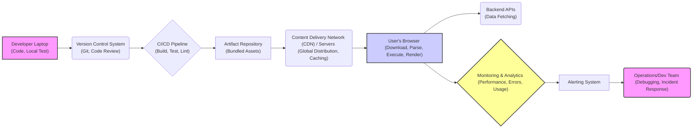
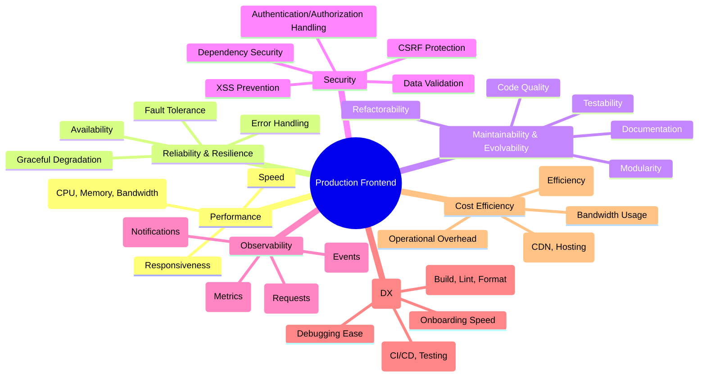

# Chapter 1: Defining "Production-Grade" and "Scalable" Frontend Systems

## A. Introduction: Beyond "It Works on My Machine"

The journey of a frontend application from a developer's local environment to a globally accessible, reliable service is fraught with challenges that extend far beyond simply making code functional. The phrase "It works on my machine" is a notorious cliché in software development, but it perfectly encapsulates the significant gap between code that _runs_ and code that is truly _production-ready_ and _scalable_. This chapter lays the foundational understanding of what these terms mean in the context of modern, complex frontend systems, setting the stage for the architectural principles and practices discussed throughout this book.

### 1. The Chasm Between Development and Production

In a development environment, constraints are often relaxed. Developers typically work with:

- **Predictable Hardware:** Fast machines with ample memory and CPU power.
- **Reliable Networks:** Low-latency, high-bandwidth connections, often wired.
- **Controlled Data:** Mock data or limited, sanitized datasets.
- **Limited Concurrency:** Usually only one or a few users (the developers themselves).
- **Forgiving Error States:** Errors might simply be logged to the console, and a page refresh often suffices.
- **Focus on Features:** The primary goal is implementing functionality.

Production environments, however, are vastly different:

- **Diverse Hardware:** Users access applications on a wide spectrum of devices (low-end mobile phones, old desktops, powerful workstations).
- **Unreliable Networks:** Users experience varying network conditions (3G, spotty Wi-Fi, high-latency satellite links).
- **Real-World Data:** Applications handle large, complex, and sometimes unpredictable user-generated data.
- **High Concurrency:** Thousands or even millions of users might access the application simultaneously.
- **Critical Error Impact:** Errors can lead to lost revenue, user frustration, data corruption, and reputational damage.
- **Holistic Concerns:** Focus shifts to reliability, performance, security, maintainability, and cost-effectiveness alongside features.

Bridging this chasm requires a deliberate shift in mindset and methodology, moving from feature-centric development to system-centric engineering.

### 2. Defining Production Readiness: Reliability, Maintainability, Observability

A "production-grade" frontend system is one that meets a high standard across several key dimensions, ensuring it can be trusted to run critical business operations and serve users effectively. While the exact criteria can vary based on context (e.g., an internal tool vs. a global e-commerce site), the core principles remain consistent:

> **Production-Grade:** A system designed, built, and operated to be **reliable**, **maintainable**, and **observable** under real-world conditions, meeting its functional and non-functional requirements consistently and predictably.

- **Reliability:** The system performs its intended functions correctly and consistently, even in the face of errors, unexpected inputs, or infrastructure issues. It handles failures gracefully and recovers automatically where possible. Users can depend on it.
- **Maintainability:** The system can be easily understood, modified, tested, and extended over its lifetime by different developers or teams without introducing defects or excessive effort. This includes code quality, clear architecture, good documentation, and effective tooling.
- **Observability:** The system provides sufficient visibility into its internal state and behavior, allowing operators to understand _why_ it's behaving a certain way, detect problems proactively, diagnose issues quickly, and monitor performance trends. This is achieved through comprehensive logging, metrics, and tracing.

### 3. Defining Scalability in Frontend: Load, Complexity, Team Size, Feature Velocity

Scalability refers to a system's ability to handle increasing demands without degradation in performance or manageability. In the frontend context, scalability encompasses multiple dimensions:

> **Scalable Frontend:** A system whose architecture, codebase, and development processes can effectively handle growth in **user load**, **application complexity**, **team size**, and **feature velocity** without requiring fundamental redesigns or causing significant bottlenecks.

- **Load Scalability:** The application's ability to maintain performance (load times, responsiveness) as the number of concurrent users, requests, or data volume increases. This often involves efficient code, optimized asset delivery (CDNs), effective caching, and potentially techniques like code splitting and server-side rendering.
- **Complexity Scalability:** The architecture's ability to accommodate an increasing number of features, components, states, and interactions without becoming brittle, difficult to understand, or prone to regressions. This relies heavily on modular design, clear separation of concerns, and well-defined interfaces.
- **Team Scalability:** The system's ability to support multiple developers or teams working concurrently on the codebase without excessive conflicts, coordination overhead, or knowledge silos. This is influenced by project structure, code ownership models (e.g., monorepos vs. polyrepos), clear coding standards, and effective tooling.
- **Feature Velocity Scalability:** The ability to consistently deliver new features, improvements, and bug fixes rapidly and reliably without compromising the stability or maintainability of the existing system. This requires robust testing strategies, efficient CI/CD pipelines, and an architecture that allows for localized changes.

### 4. The E2E Perspective: From Developer Laptop to Global User Base

Achieving production-grade scalability requires considering the entire lifecycle and delivery pipeline of the frontend application. It's not just about the JavaScript code running in the browser.



_Diagram Explanation:_ This flowchart illustrates the end-to-end journey of frontend code. Production and scalability concerns exist at each stage: efficient local development (A), robust version control and review (B), automated quality gates in CI/CD (C), optimized build artifacts (D), efficient global delivery via CDNs (E), performant execution in diverse user environments (F), reliable API interactions (G), comprehensive monitoring (H, I), and effective operational response (J). A production-grade system optimizes this entire flow.

## B. Core Pillars of Production Frontend Architecture

Building production-grade, scalable frontend systems rests on several interconnected pillars. Neglecting any one of these can compromise the overall quality and viability of the application.



_Diagram Explanation:_ This mindmap visually represents the core pillars supporting a production-grade frontend system. Each pillar branches into specific aspects that contribute to its overall goal, highlighting the multifaceted nature of building robust applications.

### 1. Performance: Speed, Responsiveness, Resource Efficiency

Performance is often the most user-visible aspect. Slow load times, janky animations, or unresponsive interfaces lead directly to user frustration and abandonment.

- **Speed:** How quickly does the application load initially (Time to First Byte, First Contentful Paint, Largest Contentful Paint) and how fast do subsequent interactions complete?
- **Responsiveness:** How quickly does the UI react to user input (Interaction to Next Paint)? Does the application feel smooth during scrolling and animations?
- **Resource Efficiency:** How much CPU, memory, and network bandwidth does the application consume? Efficient use is crucial for low-end devices, battery life, and users on metered data plans. It also impacts hosting costs.

### 2. Reliability & Resilience: Error Handling, Fault Tolerance, Graceful Degradation

Production systems must operate correctly under diverse and often unpredictable conditions.

- **Error Handling:** How are errors (network failures, API errors, unexpected data, runtime exceptions) detected, logged, reported, and handled? Does the application crash, or does it recover gracefully?
- **Fault Tolerance:** Can the application continue functioning, perhaps in a limited capacity, even if some parts (e.g., a non-critical API) fail?
- **Graceful Degradation:** If certain browser features are unavailable or if parts of the application fail to load, does the core functionality remain accessible?

**Example: Production vs. Development Error Handling**

- **Development Approach:**

  ```javascript
  async function fetchData() {
    try {
      const response = await fetch("/api/data");
      const data = await response.json();
      // ... process data
    } catch (error) {
      console.error("Failed to fetch data:", error);
      // Maybe show a generic "Error loading data" message
    }
  }
  ```

  _Problem:_ Logs only to the developer console (invisible to operators), lacks context (which user, what page?), doesn't inform support teams, might leave the UI in a broken state.

- **Production Approach:**

  ```javascript
  import ErrorReportingService from "./services/ErrorReportingService";
  import UINotifier from "./services/UINotifier";
  import { getUserContext } from "./services/UserContext";

  async function fetchData(componentContext) {
    try {
      const response = await fetch("/api/data");
      if (!response.ok) {
        // Handle specific HTTP error statuses
        throw new Error(`API Error: ${response.status} ${response.statusText}`);
      }
      const data = await response.json();
      // ... process data
    } catch (error) {
      const userContext = getUserContext();
      // Report error with context for observability
      ErrorReportingService.captureException(error, {
        tags: { component: componentContext, apiEndpoint: "/api/data" },
        extra: { user: userContext },
      });
      // Inform the user appropriately without breaking the entire app
      UINotifier.showError(
        "Sorry, we couldn't load the required data right now. Please try again later."
      );
      // Potentially set state to reflect the error and allow retry
    }
  }
  ```

  _Benefit:_ Errors are sent to a dedicated service (like Sentry, Datadog RUM), enriched with user and application context for faster debugging. Users receive clear feedback, and the application remains stable.

### 3. Maintainability & Evolvability: Code Quality, Modularity, Testability, Documentation

Code is read far more often than it is written. Maintainability ensures the long-term health and evolution of the application.

- **Code Quality:** Is the code clean, consistent, readable, and follows established best practices and style guides?
- **Modularity:** Is the application broken down into well-defined, loosely coupled modules or components with clear responsibilities and interfaces? This allows changes to be made locally without unintended side effects.
- **Testability:** Can components and features be easily tested in isolation (unit tests) and in integration? Is there comprehensive test coverage?
- **Documentation:** Is the architecture, complex logic, component APIs, and setup process well-documented?

**Example: Production vs. Development Component Design**

- **Development Approach (Tightly Coupled):** A single large component fetches data, manages complex state, contains all the rendering logic, and handles user interactions directly.
  _Problem:_ Difficult to test individual parts, hard to reuse logic, changes in one area (e.g., data fetching) risk breaking unrelated UI rendering, complex to understand and modify.

- **Production Approach (Modular):**
  - A custom hook (`useUserData`) encapsulates data fetching logic and state management.
  - A "container" component uses the hook to get data and passes relevant pieces down.
  - Multiple smaller "presentational" components receive data via props and emit events for interactions, focusing solely on rendering the UI.
    _Benefit:_ Each part has a single responsibility (SRP). The hook is testable independently. Presentational components are easily tested and reused. Changes to data fetching don't directly impact UI components. Easier for multiple developers to work on different parts.

### 4. Security: Protecting User Data and Application Integrity

Frontend applications are part of the security perimeter and must defend against common web vulnerabilities.

- **Input Validation:** Sanitizing and validating all user inputs to prevent injection attacks (XSS).
- **API Interaction Security:** Implementing measures like CSRF protection, ensuring secure communication (HTTPS), and handling authentication/authorization tokens correctly.
- **Dependency Management:** Regularly scanning dependencies for known vulnerabilities and keeping them updated.
- **Secure Defaults:** Configuring frameworks and libraries securely.

### 5. Observability: Monitoring, Logging, Tracing, Alerting

You cannot manage what you cannot measure. Observability provides the insights needed to understand and operate the system effectively in production.

- **Monitoring:** Collecting and visualizing key performance indicators (KPIs) and system health metrics (e.g., load times, error rates, resource usage, custom business metrics).
- **Logging:** Recording significant events, errors, and diagnostic information from the frontend application, often aggregated in a central logging system.
- **Tracing:** Tracking requests as they flow through the frontend and potentially into backend services, helping pinpoint bottlenecks and failures in distributed systems.
- **Alerting:** Automatically notifying operations or development teams when critical thresholds are breached or specific error conditions occur.

### 6. Developer Experience (DX): Tooling, Workflows, Onboarding

A good DX is crucial for team scalability and feature velocity. Frustrating tools and processes slow down development, increase bugs, and hinder onboarding.

- **Tooling:** Fast and reliable build systems, effective linters/formatters, powerful debugging tools, seamless IDE integration.
- **Workflows:** Efficient local development setup (e.g., Hot Module Replacement), streamlined code review processes, fast and reliable CI/CD pipelines.
- **Onboarding:** Clear documentation, simple project setup, and an intuitive codebase make it easier for new developers to become productive quickly.

**Example: DX Impact on Scalability**

- **Poor DX:** A project with a 10-minute build time, flaky tests, complex manual setup steps, and inconsistent coding styles.
  _Impact:_ Developers waste significant time waiting, context switching, and debugging environment issues. Onboarding new team members is slow and painful. Feature velocity decreases as the team grows due to friction.
- **Good DX:** Sub-second HMR, fast CI checks (< 5 mins), automated setup scripts, auto-formatting, clear architectural patterns.
  _Impact:_ Developers stay in flow, get rapid feedback, and focus on building features. New hires can contribute meaningful code within days. The team can scale more effectively.

### 7. Cost Efficiency: Infrastructure, Bandwidth, Development Time

While often seen as a business concern, architectural decisions directly impact costs.

- **Infrastructure:** Choices around CDNs, hosting (serverless vs. servers), build systems, and monitoring tools have direct cost implications.
- **Bandwidth:** Large bundle sizes and inefficient asset loading increase CDN costs and impact users on metered plans.
- **Development Time:** A maintainable, well-architected system with good DX reduces the time (and thus cost) needed to build features, fix bugs, and operate the system. Technical debt incurred now often translates to higher future development costs.

## C. Understanding System Constraints and Trade-offs

Building real-world systems is rarely about achieving theoretical perfection. It's an exercise in balancing competing concerns and making informed trade-offs based on specific constraints. Recognizing and managing these trade-offs is a hallmark of mature frontend architecture.

### 1. Business Requirements vs. Technical Purity

The ultimate goal of most software is to deliver business value. Sometimes, the "technically perfect" solution might be too slow to build, too expensive, or overkill for the business need. Architects must understand the business context and find solutions that are _good enough_ and deliver value effectively, even if they aren't textbook examples.

### 2. The CAP Theorem's Influence (Conceptual Analogy for Frontend Choices)

The CAP theorem (Consistency, Availability, Partition Tolerance) states that a distributed data store can only provide two of these three guarantees simultaneously. While directly applicable to backend databases, it serves as a useful _analogy_ for frontend trade-offs:

- **Consistency (e.g., UI reflects latest data state):** Do users always see the absolute latest data, potentially at the cost of slower loads (waiting for fetches) or complex state synchronization?
- **Availability (e.g., App works offline/flaky network):** Does the app remain usable even when network connectivity is poor or backend services are down (e.g., using cached data, service workers)? This might mean showing slightly stale data (lower consistency).
- **Partition Tolerance (e.g., Handling network splits/errors):** The frontend _must_ tolerate network issues (partitions between browser and server). The real trade-off is between Consistency and Availability when a partition occurs.

Frontend architects constantly make analogous choices: Should we prioritize instant UI updates with optimistic rendering (high availability/responsiveness, potential temporary inconsistency) or wait for server confirmation (high consistency, potential lower perceived availability/responsiveness)? Should we build complex offline capabilities (high availability) at the cost of increased development time and complexity?

### 3. Time-to-Market vs. Technical Debt

Often, there's pressure to launch features quickly. This can lead to taking shortcuts – skipping tests, writing less modular code, deferring performance optimizations. This creates **technical debt**: design or implementation choices made for short-term benefit that will incur extra cost (rework, maintenance) later.

A production mindset doesn't mean _never_ incurring technical debt, but rather:

- Making conscious, informed decisions about _which_ debt to incur.
- Quantifying the potential impact.
- **Documenting** the debt and the rationale behind the decision.
- Having a concrete plan to pay it back (refactor) later.

**Example: Documenting a Trade-off**

> **Architectural Decision Record (ADR) - 015: Simplified Search Implementation**
>
> - **Status:** Accepted
> - **Context:** Need to launch Product Discovery V1 by end of Q3. Full fuzzy search with type-ahead requires significant backend changes and complex frontend state management.
> - **Decision:** Implement a simpler, debounce-based search calling a basic backend endpoint for V1. Defer fuzzy search and type-ahead suggestions.
> - **Consequences:** Search experience is less sophisticated than desired. Known technical debt: Frontend search component needs refactoring for advanced features; backend needs a dedicated search index/service.
> - **Rationale:** Meets critical deadline for V1 launch. Delivers core search value immediately. Risk of delaying launch deemed higher than impact of basic search for initial release.
> - **Plan:** Revisit for V2 in Q1 next year, allocate specific sprint capacity for refactoring and implementing advanced search features.

### 4. Balancing Feature Development with Architectural Integrity

As applications grow, there's a constant tension between adding new features and maintaining/improving the underlying architecture (refactoring, upgrading dependencies, improving tooling). Neglecting architectural integrity leads to slower feature development, increased bugs, and reduced scalability over time. Production-grade systems require dedicated time and effort for maintaining architectural health, often referred to as "platform work" or "engineering enablement."

### 5. [Production Note: Documenting Architectural Decisions and Trade-offs]

As highlighted in the example above, **documenting significant architectural decisions and the trade-offs involved is crucial for production-grade systems.** Tools like Architectural Decision Records (ADRs) provide a historical context for _why_ the system is built the way it is. This helps onboard new developers, prevents repeating past mistakes, and facilitates future evolution by making the rationale behind past choices explicit. This documentation is a key aspect of maintainability and team scalability.

## D. The Role of the Frontend Architect

In the context of production-grade, scalable systems, the role of the Frontend Architect becomes critical. This role extends beyond just writing code; it involves technical leadership, strategic thinking, and cross-functional collaboration.

### 1. Responsibilities and Skillset

- **Technical Vision:** Defining the overall frontend architecture, technical standards, and long-term roadmap.
- **Design & Decision Making:** Choosing frameworks, libraries, patterns, and tools. Making critical trade-off decisions. Designing core components and systems.
- **Quality Assurance:** Establishing best practices for code quality, testing, performance, security, and accessibility. Ensuring these standards are met.
- **Risk Management:** Identifying potential technical risks (performance bottlenecks, security vulnerabilities, maintainability issues) and proposing mitigation strategies.
- **Staying Current:** Keeping abreast of new technologies, patterns, and industry trends, evaluating their applicability.
- **Skills:** Deep expertise in frontend technologies (HTML, CSS, JS, frameworks), software design principles (SOLID, patterns), performance optimization, security best practices, build tooling, testing strategies, and system design. Strong problem-solving and analytical skills.

### 2. Collaboration: Bridging Frontend, Backend, DevOps, and Design

Frontend systems don't exist in isolation. The architect plays a crucial role in bridging communication and collaboration gaps:

- **Backend:** Defining clear API contracts, discussing data fetching strategies, coordinating on authentication/authorization flows.
- **DevOps/Platform:** Collaborating on CI/CD pipelines, infrastructure choices (CDNs, hosting), monitoring/alerting setup, build optimizations.
- **Design/UX:** Translating design requirements into feasible technical solutions, ensuring UI consistency (Design Systems), providing feedback on technical limitations or possibilities.
- **Product Management:** Understanding business requirements, providing technical feasibility assessments, explaining trade-offs.

### 3. Technical Leadership and Mentorship

- **Guidance:** Providing technical direction and guidance to the development team.
- **Mentorship:** Helping junior and mid-level developers grow their skills, understand the architecture, and adopt best practices.
- **Code Reviews:** Participating in code reviews, focusing on architectural consistency, quality, and adherence to standards.
- **Knowledge Sharing:** Facilitating workshops, writing documentation, and promoting a culture of learning.

### 4. Driving Architectural Vision and Standards

The architect is responsible for ensuring the team understands and aligns with the chosen architectural direction. This involves:

- **Communicating the Vision:** Clearly articulating the "why" behind architectural choices.
- **Establishing Standards:** Defining and documenting coding standards, patterns, and processes.
- **Enforcing Consistency:** Using tools (linters, formatters, CI checks) and processes (code reviews, ADRs) to maintain architectural integrity across the codebase.
- **Evolving the Architecture:** Proactively identifying areas for improvement and leading refactoring or re-architecting efforts when necessary.

---

By understanding the distinct demands of production environments, embracing the core pillars of robust frontend architecture, navigating complex trade-offs thoughtfully, and recognizing the pivotal role of architectural leadership, teams can move beyond "it works on my machine" to consistently deliver frontend systems that are truly production-grade and scalable. The subsequent chapters in this book will delve deeper into the specific technologies, patterns, and practices required to achieve this.
