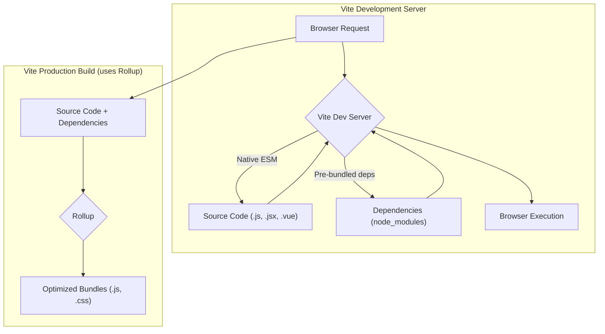
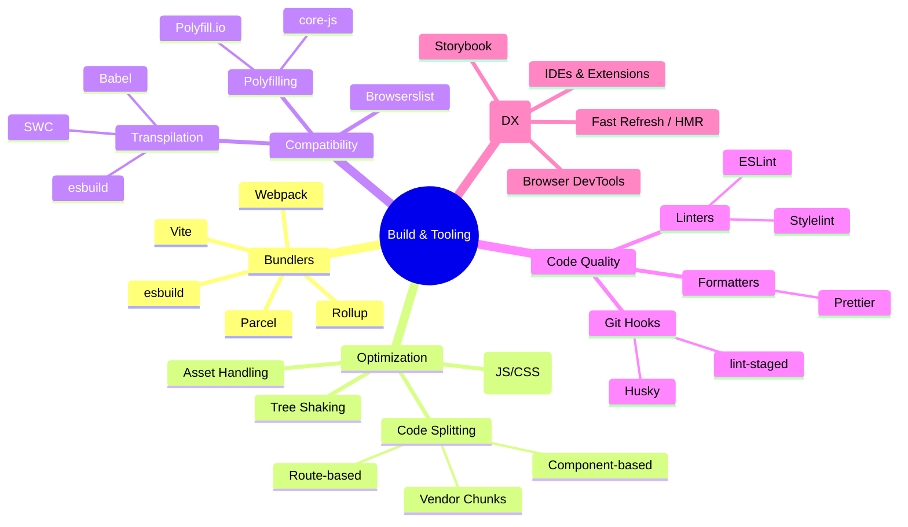

# Chapter 10: Build Systems and Tooling for Production

Modern frontend applications are complex ecosystems. Writing code in isolation using the latest JavaScript features, TypeScript, CSS preprocessors, and framework-specific syntax is only the first step. To deliver a performant, reliable, and maintainable application to end-users, this development code must undergo a sophisticated transformation process. This is where build systems and tooling become indispensable pillars of production-grade frontend architecture.

Build systems automate the process of converting source code written for developer convenience into optimized assets suitable for browser execution. Tooling encompasses the broader set of utilities that aid developers in writing high-quality code, debugging effectively, and maintaining consistency across a codebase and team. Neglecting these aspects leads to slow load times, bloated bundles, inconsistent user experiences, difficult maintenance, and frustrated development teams.

This chapter delves into the critical build systems and tooling necessary for shipping robust, scalable frontend applications to production. We will explore module bundlers, code splitting techniques, transpilation, polyfilling, code quality enforcement, and tools that enhance the developer experience, all with a focus on production readiness.

## A. Module Bundlers Deep Dive

At the heart of modern frontend development lies the concept of modules – breaking down code into smaller, reusable pieces (e.g., ES Modules, CommonJS). While browsers are increasingly supporting native ES Modules, module bundlers remain crucial for production builds. They traverse the dependency graph of your application, starting from entry points, and package all necessary modules into optimized bundles for the browser.

> **Definition: Module Bundler**
> A tool that processes your application's source code and its dependencies, resolving module imports/exports, and generating one or more optimized output files (bundles) that can be loaded by a browser.

Key benefits of using bundlers include:

- **Dependency Management:** Handling complex dependency graphs automatically.
- **Optimization:** Performing tasks like minification, tree shaking (removing unused code), and scope hoisting.
- **Asset Handling:** Processing non-JavaScript assets like CSS, images, and fonts.
- **Code Splitting:** Enabling strategies to load code on demand, improving initial load performance.
- **Development Server:** Often providing features like Hot Module Replacement (HMR) for a better developer experience.

Let's explore the most prominent bundlers.

### 1. Webpack: Core Concepts (Entry, Output, Loaders, Plugins, Mode), Advanced Configuration

Webpack has long been the dominant force in the bundling landscape. Its power lies in its extensive configuration options and vast ecosystem of loaders and plugins, making it highly flexible but also potentially complex to configure.

**Core Concepts:**

- **Entry:** Specifies the starting point(s) of your application's dependency graph. Webpack begins bundling from these files.
  ```javascript
  // webpack.config.js
  module.exports = {
    entry: "./src/index.js", // Single entry
    // or
    entry: {
      // Multiple entries
      main: "./src/index.js",
      admin: "./src/admin.js",
    },
  };
  ```
- **Output:** Tells Webpack where to emit the generated bundles and how to name them.

  ```javascript
  // webpack.config.js
  const path = require("path");

  module.exports = {
    // ... entry
    output: {
      filename: "[name].[contenthash].js", // Use placeholders for dynamic names (caching)
      path: path.resolve(__dirname, "dist"), // Output directory
      clean: true, // Clean the output directory before each build
      publicPath: "/", // Base path for assets on the server
    },
  };
  ```

- **Loaders:** Enable Webpack to process non-JavaScript files or transform JavaScript files before bundling. Loaders work on a per-module basis. Examples include `babel-loader` (transpile JS), `css-loader` (process CSS imports), `style-loader` (inject CSS into DOM), `file-loader` (handle files).
  ```javascript
  // webpack.config.js
  module.exports = {
    // ... entry, output
    module: {
      rules: [
        {
          test: /\.js$/, // Apply loader to .js files
          exclude: /node_modules/,
          use: {
            loader: "babel-loader", // Use Babel for transpilation
          },
        },
        {
          test: /\.css$/,
          use: ["style-loader", "css-loader"], // Chain loaders (executed right-to-left)
        },
        {
          test: /\.(png|svg|jpg|jpeg|gif)$/i,
          type: "asset/resource", // Built-in asset module type
        },
      ],
    },
  };
  ```
- **Plugins:** Perform a wider range of tasks that loaders cannot, operating on the bundle(s) as a whole. Examples include `HtmlWebpackPlugin` (generate HTML file with injected bundles), `MiniCssExtractPlugin` (extract CSS into separate files), `DefinePlugin` (create global constants).

  ```javascript
  // webpack.config.js
  const HtmlWebpackPlugin = require("html-webpack-plugin");
  const MiniCssExtractPlugin = require("mini-css-extract-plugin");

  module.exports = {
    // ... entry, output, module
    plugins: [
      new HtmlWebpackPlugin({ template: "./src/index.html" }),
      new MiniCssExtractPlugin({ filename: "[name].[contenthash].css" }),
    ],
  };
  ```

- **Mode:** Sets the build mode (`'development'`, `'production'`, or `'none'`), enabling default optimizations appropriate for each environment. Production mode enables minification, tree shaking, scope hoisting, and more.
  ```javascript
  // webpack.config.js
  module.exports = {
    mode: "production", // Or 'development'
    // ... rest of config
  };
  ```

**Advanced Configuration:** Often involves fine-tuning optimization settings (`optimization` property), setting up development servers (`devServer`), handling environment variables, and configuring complex code splitting strategies.

### 2. Vite: Architecture (Native ESM Dev Server, Rollup Production Build), Plugin Ecosystem

Vite (French for "fast") is a newer build tool that significantly improves the development experience by leveraging native ES Modules (ESM) in the browser during development.

**Architecture:**

- **Development:** Instead of bundling the entire application upfront, Vite serves source code directly to the browser using native ESM imports. It intercepts requests for modules, performs on-the-fly transformations (e.g., for JSX, TypeScript) only when requested, and leverages the browser's module resolution. This results in near-instant server start and incredibly fast Hot Module Replacement (HMR). Dependencies are pre-bundled using `esbuild` (written in Go) for speed.
- **Production:** For production builds, Vite uses Rollup under the hood. Rollup is known for producing highly optimized, tree-shaken bundles, especially well-suited for libraries but also effective for applications. Vite provides sensible default Rollup configurations optimized for web applications.



_Diagram: High-level comparison of Vite's development and production workflows._

**Plugin Ecosystem:** Vite has its own plugin API, largely compatible with the Rollup plugin interface, making it easy to leverage many existing Rollup plugins. Common plugins handle framework integration (React, Vue, Svelte), CSS preprocessors, image optimization, and more. Configuration is typically done in a `vite.config.js` or `vite.config.ts` file.

### 3. Parcel, esbuild, Rollup (Use Cases and Comparisons)

- **Parcel:** Known for its zero-configuration philosophy. It aims to work out of the box for many common web development scenarios, automatically detecting and configuring loaders, transpilers, and other tools. While great for quick starts and smaller projects, complex configurations can sometimes be less straightforward than with Webpack or Vite. It uses its own bundler core written in Rust for performance.
- **esbuild:** An extremely fast bundler and minifier written in Go. Its primary focus is speed. While it can bundle applications, its plugin API and feature set (e.g., advanced code splitting) are less mature than Webpack or Rollup/Vite. It's often used _within_ other tools (like Vite for pre-bundling, or as a faster alternative for transpilation/minification via plugins like `esbuild-loader` for Webpack or `vite-plugin-esbuild`).
- **Rollup:** Primarily designed for bundling JavaScript libraries, excelling at generating clean, efficient code using ES Modules format. It's known for its effective tree shaking. While it can bundle applications, it often requires more plugins for features like CSS handling or development servers compared to Webpack or Vite out-of-the-box. Vite uses Rollup for its production builds, benefiting from its optimization capabilities.

**Comparison Summary:**

| Feature         | Webpack                                   | Vite                                    | Parcel                       | esbuild                    | Rollup                                 |
| :-------------- | :---------------------------------------- | :-------------------------------------- | :--------------------------- | :------------------------- | :------------------------------------- |
| **Primary Use** | Applications                              | Applications                            | Applications (simpler setup) | Tooling (bundler/minifier) | Libraries (also apps via Vite)         |
| **Dev Speed**   | Moderate (improving)                      | Very Fast (Native ESM)                  | Fast                         | Very Fast                  | N/A (often used by other tools)        |
| **Prod Build**  | Highly configurable, mature optimizations | Uses Rollup (optimized defaults)        | Good defaults, less flexible | Fast, fewer optimizations  | Excellent optimizations (tree shaking) |
| **Config**      | Explicit, powerful, complex               | Simpler defaults, Rollup-based for prod | Zero-config focus            | Minimal                    | Explicit, focused on JS                |
| **Ecosystem**   | Vast                                      | Growing rapidly, Rollup compatible      | Good                         | Limited                    | Good (JS focused)                      |

### 4. [Configuration Guide: Optimizing a Webpack build for production]

This example demonstrates key production optimizations in a `webpack.config.js`.

```javascript
// webpack.config.js
const path = require("path");
const HtmlWebpackPlugin = require("html-webpack-plugin");
const MiniCssExtractPlugin = require("mini-css-extract-plugin");
const CssMinimizerPlugin = require("css-minimizer-webpack-plugin");
const TerserPlugin = require("terser-webpack-plugin"); // Included by default in production mode
const { DefinePlugin } = require("webpack");

module.exports = (env, argv) => {
  const isProduction = argv.mode === "production";

  return {
    mode: isProduction ? "production" : "development",
    devtool: isProduction ? "source-map" : "eval-source-map", // Source maps for debugging
    entry: "./src/index.js",
    output: {
      filename: isProduction
        ? "static/js/[name].[contenthash:8].js"
        : "static/js/bundle.js",
      chunkFilename: isProduction
        ? "static/js/[name].[contenthash:8].chunk.js"
        : "static/js/[name].chunk.js",
      path: path.resolve(__dirname, "build"),
      publicPath: "/",
      clean: true, // Clean the build folder before each build
    },
    module: {
      rules: [
        {
          test: /\.(js|jsx|ts|tsx)$/,
          exclude: /node_modules/,
          use: {
            loader: "babel-loader", // Assumes Babel is configured separately
          },
        },
        {
          test: /\.css$/,
          use: [
            isProduction ? MiniCssExtractPlugin.loader : "style-loader", // Extract CSS in prod, inject in dev
            "css-loader",
            "postcss-loader", // For autoprefixing etc. (requires postcss.config.js)
          ],
        },
        {
          test: /\.(png|svg|jpg|jpeg|gif)$/i,
          type: "asset/resource",
          generator: {
            filename: "static/media/[name].[hash:8][ext]",
          },
        },
      ],
    },
    plugins: [
      new HtmlWebpackPlugin({
        template: "./public/index.html",
        minify: isProduction
          ? {
              removeComments: true,
              collapseWhitespace: true,
              removeRedundantAttributes: true,
              useShortDoctype: true,
              removeEmptyAttributes: true,
              removeStyleLinkTypeAttributes: true,
              keepClosingSlash: true,
              minifyJS: true,
              minifyCSS: true,
              minifyURLs: true,
            }
          : false,
      }),
      isProduction &&
        new MiniCssExtractPlugin({
          // Only extract CSS in production
          filename: "static/css/[name].[contenthash:8].css",
          chunkFilename: "static/css/[name].[contenthash:8].chunk.css",
        }),
      // Define environment variables (useful for API endpoints etc.)
      new DefinePlugin({
        "process.env.NODE_ENV": JSON.stringify(
          isProduction ? "production" : "development"
        ),
        "process.env.API_URL": JSON.stringify(
          isProduction ? "https://api.example.com" : "http://localhost:5000/api"
        ),
      }),
      // Add other plugins like WebpackBundleAnalyzer conditionally
      // if (isProduction && process.env.ANALYZE) {
      //   const BundleAnalyzerPlugin = require('webpack-bundle-analyzer').BundleAnalyzerPlugin;
      //   plugins.push(new BundleAnalyzerPlugin());
      // }
    ].filter(Boolean), // Filter out falsy values (like MiniCssExtractPlugin in dev)
    optimization: {
      minimize: isProduction, // Enable minimization in production mode
      minimizer: [
        // Use TerserPlugin for JS minification (Webpack's default)
        new TerserPlugin({
          terserOptions: {
            parse: { ecma: 8 },
            compress: {
              ecma: 5,
              warnings: false,
              comparisons: false,
              inline: 2,
            },
            mangle: { safari10: true },
            output: { ecma: 5, comments: false, ascii_only: true },
          },
          parallel: true, // Use multi-process parallel running to improve build speed
        }),
        // Use CssMinimizerPlugin for CSS minification
        new CssMinimizerPlugin(),
      ],
      splitChunks: {
        // Configure code splitting
        chunks: "all", // Apply splitting to all chunks (initial, async)
        // Sensible defaults, but can be customized heavily
        // Example: Create a separate vendor chunk
        // cacheGroups: {
        //   vendor: {
        //     test: /[\\/]node_modules[\\/]/,
        //     name: 'vendors',
        //     chunks: 'all',
        //   },
        // },
      },
      runtimeChunk: "single", // Create a single runtime chunk for all entry points
    },
    performance: {
      // Configure performance hints
      hints: isProduction ? "warning" : false, // Show warnings for large assets in production
      maxEntrypointSize: 512000, // 500 KiB
      maxAssetSize: 512000, // 500 KiB
    },
    resolve: {
      extensions: [".js", ".jsx", ".ts", ".tsx", ".json"], // Allow importing without extension
      alias: {
        // Create import aliases
        "@": path.resolve(__dirname, "src"),
      },
    },
  };
};
```

_Key optimizations shown: Mode switching, source maps, content hashing, CSS extraction/minification, JS minification (Terser), code splitting (`splitChunks`), runtime chunk, asset handling, environment variables, performance hints._

### 5. [Configuration Guide: Setting up a Vite project with common plugins]

This example shows a basic `vite.config.js` for a React project.

```javascript
// vite.config.js
import { defineConfig, loadEnv } from "vite";
import react from "@vitejs/plugin-react"; // Official React plugin (handles JSX, Fast Refresh)
import eslint from "vite-plugin-eslint"; // Integrate ESLint into the dev server
import svgr from "vite-plugin-svgr"; // Import SVGs as React components

export default defineConfig(({ mode }) => {
  // Load env file based on `mode` in the current working directory.
  // Set the third parameter to '' to load all env regardless of the `VITE_` prefix.
  const env = loadEnv(mode, process.cwd(), "");

  return {
    plugins: [
      react(),
      svgr(), // Allows import Logo from './logo.svg?react';
      eslint({
        cache: false, // Disable cache for demonstration
        include: [
          "./src/**/*.js",
          "./src/**/*.jsx",
          "./src/**/*.ts",
          "./src/**/*.tsx",
        ],
        exclude: [/node_modules/, /dist/],
      }),
    ],
    resolve: {
      alias: {
        "@": "/src", // Alias for cleaner imports (Note: Vite uses / prefix for project root)
      },
    },
    server: {
      port: 3000, // Development server port
      open: true, // Automatically open browser
      // Proxy API requests during development to avoid CORS issues
      // proxy: {
      //   '/api': {
      //     target: 'http://localhost:5000', // Your backend server
      //     changeOrigin: true,
      //     rewrite: (path) => path.replace(/^\/api/, ''),
      //   },
      // }
    },
    build: {
      outDir: "build", // Output directory (defaults to 'dist')
      sourcemap: true, // Generate source maps for production build
      rollupOptions: {
        // Further customize Rollup build options if needed
        output: {
          manualChunks(id) {
            // Example: Create a vendor chunk for node_modules
            if (id.includes("node_modules")) {
              // Split large libraries into their own chunks
              if (
                id.includes("react-router-dom") ||
                id.includes("@remix-run/router")
              ) {
                return "vendor-router";
              }
              if (id.includes("lodash")) {
                return "vendor-lodash";
              }
              // Default vendor chunk
              return "vendor";
            }
          },
          // Customize output asset names
          entryFileNames: `static/js/[name]-[hash].js`,
          chunkFileNames: `static/js/[name]-[hash].js`,
          assetFileNames: `static/assets/[name]-[hash].[ext]`,
        },
      },
    },
    // Define global constants (similar to Webpack's DefinePlugin)
    define: {
      "process.env.NODE_ENV": JSON.stringify(mode),
      "process.env.API_URL": JSON.stringify(env.API_URL), // Access env variables loaded by loadEnv
      __APP_VERSION__: JSON.stringify(process.env.npm_package_version),
    },
  };
});
```

_Key features shown: React plugin integration, ESLint plugin, SVGR plugin, aliases, dev server config (port, proxy), production build output customization (`rollupOptions`), environment variables (`loadEnv`, `define`)._

## B. Code Splitting and Lazy Loading Strategies

As applications grow, their JavaScript bundles can become very large, leading to slow initial page loads. Code splitting is the technique of dividing your application's bundle into smaller chunks that can be loaded on demand (lazy loading) or in parallel.

> **Goal:** Load only the code necessary for the initial view, and defer loading code for other routes or features until they are needed.

Modern bundlers like Webpack and Vite (via Rollup) offer built-in support for code splitting, primarily using the dynamic `import()` syntax.

### 1. Route-Based Splitting

This is the most common and often most impactful code splitting strategy. The code associated with each application route (or a group of routes) is placed into a separate chunk. When the user navigates to a new route, the corresponding chunk is fetched and executed.

**Example (React Router v6):**

```jsx
import React, { Suspense, lazy } from "react";
import { BrowserRouter as Router, Routes, Route } from "react-router-dom";
import LoadingSpinner from "./components/LoadingSpinner"; // A component to show while loading

// Statically import components for core routes/layout if needed
import HomePage from "./pages/HomePage";
import AppLayout from "./components/AppLayout";

// Dynamically import components for other routes
const AboutPage = lazy(() => import("./pages/AboutPage"));
const UserProfile = lazy(() => import("./pages/UserProfile"));
const AdminDashboard = lazy(() => import("./pages/AdminDashboard")); // Potentially large section

function App() {
  return (
    <Router>
      <Suspense fallback={<LoadingSpinner />}>
        {" "}
        {/* Display fallback UI while chunks load */}
        <Routes>
          <Route path="/" element={<AppLayout />}>
            <Route index element={<HomePage />} />
            <Route path="about" element={<AboutPage />} />
            <Route path="users/:userId" element={<UserProfile />} />
            {/* Example: Protected or feature-flagged route */}
            <Route path="admin" element={<AdminDashboard />} />
            {/* Define other routes */}
          </Route>
        </Routes>
      </Suspense>
    </Router>
  );
}

export default App;
```

_Here, `AboutPage`, `UserProfile`, and `AdminDashboard` will be placed in separate JavaScript chunks by the bundler. They are only fetched when the user navigates to `/about`, `/users/:userId`, or `/admin` respectively. `React.Suspense` handles the loading state._

### 2. Component-Based Splitting

Sometimes, even within a single route or page, there might be large components that are not immediately visible or critical for the initial render (e.g., complex charts, heavy modal dialogs, components below the fold). These can also be dynamically imported.

**Example:**

```jsx
import React, { useState, Suspense, lazy } from "react";
import LoadingIndicator from "./components/LoadingIndicator";

// Dynamically import a heavy component
const HeavyChartComponent = lazy(() =>
  import("./components/HeavyChartComponent")
);

function Dashboard() {
  const [showChart, setShowChart] = useState(false);

  const handleLoadChart = () => {
    setShowChart(true);
  };

  return (
    <div>
      <h1>Dashboard</h1>
      <p>Main dashboard content...</p>

      {!showChart && (
        <button onClick={handleLoadChart}>Load Performance Chart</button>
      )}

      {showChart && (
        <Suspense fallback={<LoadingIndicator />}>
          <HeavyChartComponent />
        </Suspense>
      )}
    </div>
  );
}

export default Dashboard;
```

_The code for `HeavyChartComponent` is only loaded when the user clicks the button._

### 3. Vendor Chunking and Library Splitting

Third-party libraries (dependencies from `node_modules`) often constitute a significant portion of the final bundle size. Separating these into a separate "vendor" chunk can improve caching. Since libraries change less frequently than application code, users can cache the vendor chunk for longer periods, speeding up subsequent visits even after application code updates.

Bundlers often provide automatic or configurable ways to achieve this:

- **Webpack:** The `optimization.splitChunks.cacheGroups` configuration allows fine-grained control. A common pattern is to create a `vendors` chunk.
  ```javascript
  // webpack.config.js (inside optimization.splitChunks)
  cacheGroups: {
    vendor: {
      test: /[\\/]node_modules[\\/]/,
      name: 'vendors',
      chunks: 'all',
      priority: -10, // Prioritize splitting vendors
      reuseExistingChunk: true,
    },
    // Optional: Split large libraries further
    // lodash: {
    //   test: /[\\/]node_modules[\\/](lodash|lodash-es)[\\/]/,
    //   name: 'vendor-lodash',
    //   chunks: 'all',
    //   priority: 0, // Higher priority than default vendor
    // },
  }
  ```
- **Vite (Rollup):** The `build.rollupOptions.output.manualChunks` function provides similar capabilities. (See Vite config example above).

### 4. Analyzing Bundle Sizes

To effectively optimize and code split, you need visibility into what makes up your bundles.

- **Webpack Bundle Analyzer:** A popular Webpack plugin that generates an interactive treemap visualization of your bundle contents. It helps identify large modules or dependencies that could be candidates for splitting or optimization.
  ```bash
  # Install
  npm install --save-dev webpack-bundle-analyzer
  # Add to webpack plugins (conditionally recommended)
  const BundleAnalyzerPlugin = require('webpack-bundle-analyzer').BundleAnalyzerPlugin;
  // ... inside plugins array:
  if (process.env.ANALYZE) {
    plugins.push(new BundleAnalyzerPlugin());
  }
  # Run build with ANALYZE flag
  ANALYZE=true npm run build
  ```
- **source-map-explorer:** Analyzes JavaScript bundles using source maps to determine code size contribution from your original source files. Works with any bundler that produces source maps.
  ```bash
  # Install
  npm install --save-dev source-map-explorer
  # Add script to package.json
  "scripts": {
    "analyze": "source-map-explorer 'build/static/js/*.js'"
  }
  # Run after building
  npm run build && npm run analyze
  ```

Interpreting the output of these tools allows you to pinpoint:

- Large dependencies accidentally included.
- Components or routes contributing disproportionately to bundle size.
- Opportunities for splitting vendor code or specific features.

### 5. [Practical Example: Implementing dynamic imports for code splitting]

Dynamic `import()` is an ECMAScript feature that returns a Promise, resolving with the module once it's loaded. Bundlers recognize this syntax and automatically create separate chunks.

```javascript
// utils/math.js - A module we want to load dynamically
export const add = (a, b) => a + b;
export const subtract = (a, b) => a - b;

// main.js - Where we use the dynamic import
async function calculateResult(a, b) {
  console.log("Preparing to load math module...");
  try {
    // Dynamic import returns a Promise
    const mathModule = await import("./utils/math.js");
    console.log("Math module loaded.");

    const sum = mathModule.add(a, b);
    console.log(`Sum: ${sum}`);

    // You can also destructure if the module has named exports
    const { subtract } = await import("./utils/math.js");
    const difference = subtract(a, b);
    console.log(`Difference: ${difference}`);
  } catch (error) {
    console.error("Failed to load math module:", error);
    // Handle loading error (e.g., show a message to the user)
  }
}

// Example usage (e.g., triggered by a button click)
document.getElementById("calculateBtn").addEventListener("click", () => {
  calculateResult(10, 5);
});
```

_When this code runs, the browser (or bundler's runtime) will only request `utils/math.js` when `calculateResult` is called and the `import()` statement is executed._

### 6. [Production Note: Balancing chunk granularity and network requests]

While code splitting is powerful, excessive splitting can be detrimental.

- **Too few/large chunks:** Leads to slow initial load times as users download unnecessary code.
- **Too many/small chunks:** Can increase the total load time due to network latency and the overhead of multiple HTTP requests (especially on high-latency mobile networks). HTTP/2 and HTTP/3 mitigate this somewhat with multiplexing, but overhead still exists.

**The goal is to find a balance:**

- Prioritize splitting by route.
- Split out large, non-critical components or features triggered by user interaction.
- Consolidate small, frequently used utility modules or components into shared chunks if appropriate (bundlers often do this automatically with `splitChunks` defaults).
- Use bundle analysis tools to identify chunks that are either too large or unnecessarily small.
- Consider network prefetching (`<link rel="prefetch">` or bundler plugins) for likely next navigation chunks, but use it judiciously to avoid wasting bandwidth.

## C. Transpilation and Polyfilling

The web platform evolves rapidly, with new JavaScript features (ECMAScript) and browser APIs being standardized. However, users might be on older browsers that don't support these features. Transpilation and polyfilling bridge this gap.

- **Transpilation:** The process of converting code written in one language (e.g., modern JavaScript ES2020+, TypeScript, JSX) into an equivalent version of another language (usually older, more widely compatible JavaScript like ES5).
- **Polyfilling:** Providing implementations of modern browser APIs (e.g., `Promise`, `fetch`, `Object.assign`, `Array.prototype.includes`) in environments where they are missing natively.

### 1. Babel Deep Dive: Presets, Plugins, Configuration

Babel is the de facto standard for JavaScript transpilation. It uses a plugin-based architecture.

- **Plugins:** Perform specific code transformations (e.g., `@babel/plugin-transform-arrow-functions` converts arrow functions to regular functions). You rarely use individual plugins directly.
- **Presets:** Ordered collections of plugins. The most important preset is `@babel/preset-env`. It intelligently applies only the necessary transformations based on your target environment definitions.
  - `targets`: Specifies the browsers or Node.js versions you need to support (see Browserslist).
  - `useBuiltIns`: Controls how polyfills are added (often used with `core-js`).
    - `'entry'`: Requires importing `core-js` manually at the entry point; replaces imports with specific polyfills needed for targets. Can bloat the bundle if not careful.
    - `'usage'`: Automatically adds specific `core-js` imports _only_ where features are used in your code. More efficient bundle size. **Recommended.**
    - `false` (default): Does not add polyfills automatically.
  - `corejs`: Specifies the version of `core-js` to use when `useBuiltIns` is enabled (e.g., `{ version: 3, proposals: true }`).
- **Configuration:** Typically defined in `babel.config.js` (project-wide) or `.babelrc` (file-relative). `babel.config.js` is generally preferred for applications.

Other common presets include:

- `@babel/preset-react`: Handles JSX transformation.
- `@babel/preset-typescript`: Handles TypeScript transformation (strips types, doesn't type-check).

### 2. SWC and esbuild as Transpilers

While Babel is powerful and mature, its performance (being written in JavaScript) can be a bottleneck in large projects. Newer tools written in systems languages offer significant speed improvements:

- **SWC (Speedy Web Compiler):** Written in Rust. Aims to be a high-performance replacement for Babel. It's used by Next.js and is gaining traction. Offers Babel plugin compatibility (work in progress).
- **esbuild:** Written in Go. Primarily a bundler/minifier, but also performs extremely fast transpilation (JSX, TypeScript, modern JS to ESNext/ES20XX). Its transformation capabilities are less extensive than Babel's, but sufficient for many use cases.

These can be integrated into build pipelines (e.g., `esbuild-loader` for Webpack, Vite uses esbuild internally) to speed up the transpilation step. The trade-off might be a less mature plugin ecosystem or slightly different transformation outputs compared to Babel in edge cases.

### 3. Polyfill Strategies (Core-js, Polyfill.io)

- **`core-js`:** The most comprehensive and standard library for JavaScript polyfills. It's designed to be used modularly, often in conjunction with `@babel/preset-env`'s `useBuiltIns: 'usage'` option for optimal bundle size. You need to install it as a dependency (`npm install core-js@3`).
- **`Polyfill.io` (and similar services):** A web service that provides polyfills dynamically based on the requesting browser's User-Agent string. You include a single script tag in your HTML, and the service sends back only the polyfills needed for that specific browser.
  - **Pros:** Can result in smaller initial downloads for modern browsers (which get minimal or no polyfills). Offloads polyfill maintenance.
  - **Cons:** Introduces an external dependency (potential point of failure, performance bottleneck). Privacy concerns (User-Agent data sent to a third party). Less predictable performance. May not cover all edge cases or proposals perfectly. Generally less recommended for critical production applications compared to bundled polyfills.

For most production applications, bundling necessary polyfills via `core-js` and `@babel/preset-env` offers the best balance of compatibility, reliability, and performance.

### 4. Browser Compatibility Targets (Browserslist)

Defining _which_ browsers and environments your application needs to support is crucial for both transpilation and polyfilling (and also for tools like Autoprefixer for CSS). Browserslist provides a standardized way to do this.

Configuration is typically placed in `package.json` or a `.browserslistrc` file:

```json
// package.json
{
  "name": "my-app",
  "version": "1.0.0",
  // ... other fields
  "browserslist": {
    "production": [
      // Targets for production build
      ">0.5%", // Browsers with > 0.5% global usage
      "last 2 versions", // Last 2 major versions for each browser
      "Firefox ESR", // Latest Firefox Extended Support Release
      "not dead", // Exclude browsers officially dead/unsupported
      "not op_mini all" // Exclude Opera Mini
    ],
    "development": [
      // Targets for development (can be more lenient)
      "last 1 chrome version",
      "last 1 firefox version",
      "last 1 safari version"
    ]
  }
}
```

Tools like `@babel/preset-env`, `autoprefixer`, and `eslint-plugin-compat` read this configuration to determine their behavior. Use `npx browserslist` in your terminal to see the exact list of browsers matched by your query.

### 5. [Configuration Guide: Configuring Babel for optimal compatibility and bundle size]

This `babel.config.js` uses `@babel/preset-env` with `useBuiltIns: 'usage'` and `core-js@3` driven by a `browserslist` configuration.

```javascript
// babel.config.js
module.exports = function (api) {
  // Cache the configuration based on the NODE_ENV environment variable.
  api.cache.using(() => process.env.NODE_ENV);

  const isProduction = api.env("production");
  const isDevelopment = api.env("development");
  const isTest = api.env("test");

  const presets = [
    [
      "@babel/preset-env",
      {
        // Define target environments (uses browserslist config by default)
        // targets: '> 0.5%, last 2 versions, Firefox ESR, not dead', // Or rely on browserslist file/package.json

        // Use polyfills from core-js version 3
        corejs: { version: 3, proposals: false }, // Set proposals: true if using experimental features

        // Add polyfills automatically based on usage in the code
        // Requires core-js@3 to be installed as a dependency
        useBuiltIns: "usage",

        // Do not transform ES modules syntax (let the bundler handle it)
        // Important for tree shaking to work correctly
        modules: false,

        // Exclude transforms that are problematic or rarely needed
        exclude: ["transform-typeof-symbol"],
      },
    ],
    // Preset for React (handles JSX, development optimizations)
    [
      "@babel/preset-react",
      {
        // Use the new JSX transform (React 17+)
        runtime: "automatic",
        // Adds __source and __self in development for better debugging
        development: isDevelopment || isTest,
      },
    ],
    // Preset for TypeScript (only transforms syntax, doesn't type check)
    // Ensure this comes *before* preset-env if you have class properties etc.
    ["@babel/preset-typescript"],
  ];

  const plugins = [
    // Example: Add support for class properties (stage 3 proposal)
    // Note: Many modern features are included in preset-env based on targets
    // ['@babel/plugin-proposal-class-properties', { loose: true }], // Check compatibility needs
    // Add other necessary plugins here
    // e.g., babel-plugin-styled-components if using styled-components
  ];

  // Add React Refresh plugin only in development for Fast Refresh
  if (isDevelopment) {
    plugins.push("react-refresh/babel");
  }

  return {
    presets,
    plugins,
  };
};
```

_This configuration ensures that modern JavaScript, JSX, and TypeScript are transpiled based on the defined `browserslist` targets, and necessary polyfills from `core-js@3` are automatically included only where needed, optimizing the final bundle size._

## D. Linters and Formatters

Maintaining code quality, consistency, and preventing common errors is crucial in large, long-lived projects, especially with multiple developers. Linters and formatters automate this process.

- **Linters:** Analyze source code to find problematic patterns, potential errors, style violations, and anti-patterns based on configurable rules.
- **Formatters:** Automatically rewrite code to conform to specific style guidelines, ensuring consistency in spacing, indentation, line breaks, etc.

### 1. ESLint: Rules, Plugins, Configurations (Sharable Configs)

ESLint is the standard linter for JavaScript and TypeScript.

- **Rules:** Individual checks (e.g., `no-unused-vars`, `eqeqeq`, `react/jsx-key`). Rules can be turned off, set to warn, or set to error.
- **Plugins:** Provide additional rules, often specific to frameworks or libraries (e.g., `eslint-plugin-react`, `eslint-plugin-import`, `eslint-plugin-jsx-a11y`, `@typescript-eslint/eslint-plugin`).
- **Configurations:** Define which rules/plugins are enabled and how they are configured.
  - `extends`: Inherit configurations from base sets or sharable configs. Popular sharable configs include `eslint:recommended`, `eslint-config-airbnb`, `eslint-config-standard`, `plugin:react/recommended`, `plugin:@typescript-eslint/recommended`.
  - `parser`: Specifies the parser ESLint should use (e.g., `@typescript-eslint/parser` for TypeScript).
  - `parserOptions`: Configure parser behavior (e.g., `ecmaVersion`, `sourceType: 'module'`).
  - `env`: Define global variables available in specific environments (e.g., `browser: true`, `node: true`, `es2021: true`).
  - `rules`: Override or customize specific rules from extended configs.

Configuration is typically in `.eslintrc.js`, `.eslintrc.json`, `.eslintrc.yml`, or `eslintConfig` in `package.json`.

### 2. Prettier: Integration with Linters, Editor Setup

Prettier is an opinionated code formatter. It takes your code and reprints it according to its own strict style rules, largely ignoring the original formatting. Its goal is to end debates about code style by enforcing one consistent style.

- **Integration:** Prettier focuses _only_ on formatting, while ESLint also checks code quality. They can conflict if ESLint has formatting rules enabled. The standard practice is to:
  1.  Use Prettier for all formatting concerns.
  2.  Use ESLint for code quality checks.
  3.  Use `eslint-config-prettier` to disable any ESLint rules that conflict with Prettier.
  4.  Optionally use `eslint-plugin-prettier` to run Prettier as an ESLint rule and report differences as ESLint issues (useful for integration).
- **Editor Setup:** Most code editors (VS Code, WebStorm) have Prettier extensions that can automatically format code on save, providing immediate feedback and ensuring consistency.

Configuration is typically in `.prettierrc.js`, `.prettierrc.json`, or `prettier` in `package.json`.

### 3. Stylelint: Linting CSS, SCSS, CSS-in-JS

Stylelint is the equivalent of ESLint for CSS, SCSS, Less, and even CSS-in-JS libraries.

- **Features:** Checks for errors, enforces stylistic conventions (property order, selector patterns), prevents accessibility issues, and understands modern CSS features.
- **Plugins & Configs:** Similar to ESLint, it has plugins (e.g., `stylelint-order` for property ordering) and sharable configurations (`stylelint-config-standard`, `stylelint-config-recommended-scss`).
- **CSS-in-JS:** Requires specific processors or syntaxes (e.g., `postcss-styled-syntax`) to parse styles embedded within JavaScript/TypeScript files.

Configuration is typically in `.stylelintrc.js`, `.stylelintrc.json`, or `stylelint` in `package.json`.

### 4. Enforcing Standards with Git Hooks (Husky, lint-staged)

To ensure that code committed to the repository adheres to linting and formatting standards, Git hooks are essential.

- **Husky:** A popular tool that makes managing Git hooks easy (e.g., `pre-commit`, `pre-push`).
- **lint-staged:** A tool that runs linters/formatters _only_ on files staged for commit in Git. This prevents accidentally linting/formatting unrelated files and speeds up the pre-commit check.

**Setup Example (`package.json` and config files):**

```bash
# Install dependencies
npm install --save-dev husky lint-staged eslint prettier stylelint \
  eslint-config-prettier eslint-plugin-prettier \
  stylelint-config-standard stylelint-config-prettier

# Initialize Husky (v7+)
npx husky install
npm pkg set scripts.prepare="husky install" # Run husky install automatically after npm install
npx husky add .husky/pre-commit "npx lint-staged"
```

```json
// package.json (lint-staged configuration)
{
  // ... other fields
  "lint-staged": {
    "*.{js,jsx,ts,tsx}": [
      // Target JS/TS files
      "eslint --fix", // Run ESLint with auto-fix
      "prettier --write" // Run Prettier to format
    ],
    "*.{css,scss}": [
      // Target CSS/SCSS files
      "stylelint --fix", // Run Stylelint with auto-fix
      "prettier --write" // Run Prettier to format
    ],
    "*.{json,md,html}": [
      // Target other relevant files
      "prettier --write" // Format JSON, Markdown, HTML
    ]
  }
}
```

Now, before any commit, `lint-staged` will run the specified commands on the staged files, automatically fixing issues where possible and preventing the commit if errors remain.

### 5. [Configuration Guide: Setting up a comprehensive linting/formatting pipeline]

This combines configurations for ESLint, Prettier, Stylelint, and lint-staged.

**`.eslintrc.js` (Example for React + TypeScript):**

```javascript
module.exports = {
  root: true, // Prevent ESLint from looking further up the directory tree
  parser: "@typescript-eslint/parser", // Specifies the ESLint parser for TypeScript
  parserOptions: {
    ecmaVersion: 2021, // Allows for the parsing of modern ECMAScript features
    sourceType: "module", // Allows for the use of imports
    ecmaFeatures: {
      jsx: true, // Allows for the parsing of JSX
    },
    project: "./tsconfig.json", // Important for type-aware linting rules
  },
  settings: {
    react: {
      version: "detect", // Tells eslint-plugin-react to automatically detect the React version
    },
    "import/resolver": {
      // Helps eslint-plugin-import resolve paths
      typescript: {}, // Uses tsconfig.json for path resolution
      node: {
        extensions: [".js", ".jsx", ".ts", ".tsx"],
      },
    },
  },
  env: {
    // Specifies predefined global variables
    browser: true,
    es2021: true,
    node: true,
    jest: true, // Add if using Jest for testing
  },
  extends: [
    "eslint:recommended", // Base ESLint recommended rules
    "plugin:react/recommended", // React specific linting rules
    "plugin:react-hooks/recommended", // Rules for React Hooks
    "plugin:@typescript-eslint/recommended", // Base TypeScript recommended rules
    "plugin:@typescript-eslint/recommended-requiring-type-checking", // Rules requiring type information
    "plugin:import/recommended", // Rules for ES6+ import/export syntax
    "plugin:import/typescript", // TypeScript support for eslint-plugin-import
    "plugin:jsx-a11y/recommended", // Accessibility rules for JSX
    "plugin:prettier/recommended", // **IMPORTANT**: Runs Prettier as an ESLint rule and disables conflicting rules. Must be LAST.
  ],
  plugins: [
    "@typescript-eslint",
    "react",
    "react-hooks",
    "import",
    "jsx-a11y",
    // 'prettier' is included by the 'plugin:prettier/recommended' extension
  ],
  rules: {
    // --- Add custom rule overrides here ---
    "no-console": ["warn", { allow: ["warn", "error"] }], // Allow console.warn and console.error
    "react/prop-types": "off", // Disable prop-types as we use TypeScript
    "react/react-in-jsx-scope": "off", // Not needed with React 17+ new JSX transform
    "@typescript-eslint/no-unused-vars": ["warn", { argsIgnorePattern: "^_" }], // Warn on unused vars, allow underscore prefix
    "@typescript-eslint/explicit-module-boundary-types": "off", // Allow inferred return types for functions
    "import/order": [
      // Enforce a convention for import order
      "warn",
      {
        groups: [
          "builtin",
          "external",
          "internal",
          ["parent", "sibling", "index"],
          "object",
          "type",
        ],
        "newlines-between": "always",
        alphabetize: { order: "asc", caseInsensitive: true },
      },
    ],
    // Example: Enforce curly braces for all control statements
    // 'curly': ['error', 'all'],

    // --- Prettier conflicts are handled by 'plugin:prettier/recommended' ---
  },
  ignorePatterns: [
    "node_modules/",
    "build/",
    "dist/",
    "public/",
    ".eslintrc.js",
    "*.config.js",
  ], // Files/folders to ignore
};
```

**`.prettierrc.js`:**

```javascript
module.exports = {
  printWidth: 100, // Max line length
  tabWidth: 2, // Spaces per indent level
  useTabs: false, // Use spaces instead of tabs
  semi: true, // Print semicolons at the ends of statements
  singleQuote: true, // Use single quotes instead of double quotes
  jsxSingleQuote: false, // Use double quotes in JSX
  trailingComma: "es5", // Trailing commas where valid in ES5 (objects, arrays, etc.)
  bracketSpacing: true, // Print spaces between brackets in object literals
  jsxBracketSameLine: false, // Put the `>` of a multi-line JSX element at the end of the last line
  arrowParens: "always", // Always include parens around arrow function parameters
  endOfLine: "lf", // Line ending convention (\n)
};
```

**`.stylelintrc.js`:**

```javascript
module.exports = {
  extends: [
    "stylelint-config-standard", // Standard Stylelint rules
    "stylelint-config-scss", // Rules specific to SCSS (if using SCSS)
    "stylelint-config-prettier", // Disables rules conflicting with Prettier (must be last)
  ],
  plugins: [
    "stylelint-order", // Plugin to enforce property order
  ],
  rules: {
    // --- Add custom rule overrides here ---
    "selector-class-pattern": null, // Allow any class name pattern (often needed for CSS Modules/BEM)
    "block-no-empty": null, // Allow empty blocks (sometimes useful)
    "no-descending-specificity": null, // Can be overly strict in complex apps
    "scss/at-rule-no-unknown": [
      // Allow known SCSS @-rules, plus Tailwind's
      true,
      {
        ignoreAtRules: [
          "tailwind",
          "apply",
          "variants",
          "responsive",
          "screen",
        ],
      },
    ],
    "order/properties-alphabetical": null, // Disable alphabetical order (prefer logical grouping)
    "order/properties-order": [
      // Define a logical order for CSS properties (example)
      [
        // Positioning
        "position",
        "top",
        "right",
        "bottom",
        "left",
        "z-index",
        // Box Model
        "display",
        "flex",
        "flex-grow",
        "flex-shrink",
        "flex-basis",
        "flex-flow",
        "flex-direction",
        "flex-wrap",
        "grid",
        "grid-area",
        "grid-template",
        "grid-template-areas",
        "grid-template-rows",
        "grid-template-columns",
        "grid-row",
        "grid-row-start",
        "grid-row-end",
        "grid-column",
        "grid-column-start",
        "grid-column-end",
        "grid-auto-rows",
        "grid-auto-columns",
        "grid-auto-flow",
        "gap",
        "grid-gap",
        "row-gap",
        "column-gap",
        "align-content",
        "align-items",
        "align-self",
        "justify-content",
        "justify-items",
        "justify-self",
        "order",
        "float",
        "clear",
        "box-sizing",
        "width",
        "min-width",
        "max-width",
        "height",
        "min-height",
        "max-height",
        "margin",
        "margin-top",
        "margin-right",
        "margin-bottom",
        "margin-left",
        "padding",
        "padding-top",
        "padding-right",
        "padding-bottom",
        "padding-left",
        // Typography
        "color",
        "font",
        "font-family",
        "font-size",
        "font-weight",
        "font-style",
        "font-variant",
        "font-size-adjust",
        "font-stretch",
        "line-height",
        "letter-spacing",
        "text-align",
        "text-decoration",
        "text-indent",
        "text-transform",
        "text-shadow",
        "white-space",
        "word-spacing",
        "word-wrap",
        "overflow-wrap",
        // Visual
        "background",
        "background-color",
        "background-image",
        "background-repeat",
        "background-position",
        "background-size",
        "background-attachment",
        "border",
        "border-width",
        "border-style",
        "border-color",
        "border-top",
        "border-right",
        "border-bottom",
        "border-left",
        "border-radius",
        "outline",
        "outline-offset",
        "box-shadow",
        "opacity",
        "visibility",
        // Animation & Transitions
        "transition",
        "transition-property",
        "transition-duration",
        "transition-timing-function",
        "transition-delay",
        "animation",
        "animation-name",
        "animation-duration",
        "animation-timing-function",
        "animation-delay",
        "animation-iteration-count",
        "animation-direction",
        "animation-fill-mode",
        "animation-play-state",
        // Misc
        "overflow",
        "overflow-x",
        "overflow-y",
        "cursor",
        "pointer-events",
        "user-select",
        "content",
        "quotes",
        "counter-reset",
        "counter-increment",
        "list-style",
        "list-style-type",
        "list-style-position",
        "list-style-image",
      ],
      { unspecified: "bottom" }, // Place unspecified properties at the bottom
    ],
  },
  ignoreFiles: ["node_modules/**", "build/**", "dist/**", "public/**"],
};
```

**`lint-staged` config in `package.json` (as shown previously):** Ensures these tools run automatically before commits.

This comprehensive setup provides a robust safety net, enforcing consistency and catching errors early in the development cycle, which is invaluable for production stability and team scalability.

## E. Developer Experience Tooling

While the primary focus of build systems is the production output, the tooling surrounding the development process itself is equally critical for building scalable systems. A smooth, fast, and informative Developer Experience (DX) directly impacts productivity, code quality, and team velocity.

### 1. Fast Refresh / Hot Module Replacement (HMR)

Waiting for full application rebuilds and page reloads after every small code change drastically slows down development.

- **Hot Module Replacement (HMR):** A mechanism where, upon detecting code changes, the bundler's development server sends _only the updated module(s)_ to the browser. The browser then swaps the old module with the new one _without_ a full page refresh, often preserving application state. This provides near-instant feedback. Webpack and Parcel have mature HMR implementations.
- **Fast Refresh:** A more advanced HMR implementation specifically for React (and adopted by other frameworks like Next.js, Vite). It's more resilient to errors during updates and reliably preserves component state, including React Hooks state. Vite's native ESM approach makes its HMR/Fast Refresh incredibly fast.

These features are typically enabled by default in the development modes of modern bundlers and frameworks (Webpack Dev Server, Vite dev server).

### 2. Integrated Development Environments (IDEs) and Extensions

A well-configured IDE is a developer's command center. Modern IDEs like Visual Studio Code (VS Code) or WebStorm offer much more than just text editing.

- **IntelliSense/Autocompletion:** Suggests code completions, including types (with TypeScript), reducing typos and lookup time.
- **Integrated Linters/Formatters:** Display errors and warnings from ESLint/Stylelint directly in the editor and allow formatting (Prettier) on save.
- **Debugging Tools:** Allow setting breakpoints, inspecting variables, and stepping through code execution directly within the IDE, connected to the browser or Node.js.
- **Source Control Integration:** Manage Git operations (commit, push, pull, branch) directly within the editor.
- **Framework-Specific Extensions:** Provide syntax highlighting, snippets, and specific tooling for frameworks like React, Vue, Angular, Svelte.
- **TypeScript Integration:** Deep integration for type checking, refactoring, and navigation.

Investing time in configuring the IDE and leveraging relevant extensions significantly boosts productivity and code quality.

### 3. Browser Developer Tools Mastery

The browser's built-in developer tools (available in Chrome, Firefox, Edge, Safari) are indispensable for frontend development and debugging. Key tabs include:

- **Elements:** Inspect and manipulate the DOM and CSS. Essential for UI debugging and styling adjustments.
- **Console:** View logs, errors, and warnings; interact with the page's JavaScript context.
- **Sources:** Debug JavaScript (set breakpoints, step through code), inspect source maps, view original source code.
- **Network:** Analyze network requests (timing, headers, payloads, status codes), throttle network speed, inspect WebSockets. Crucial for diagnosing loading performance and API interaction issues.
- **Performance:** Record and analyze runtime performance, identify bottlenecks (long tasks, layout thrashing, paint issues), analyze rendering performance (FPS).
- **Application (or Storage):** Inspect local storage, session storage, cookies, IndexedDB, cache storage. Manage service workers.
- **Lighthouse (in Chrome):** Audit the page for performance, accessibility, PWA readiness, SEO, and best practices.

Proficiency in using these tools is non-negotiable for building and debugging production applications.

### 4. Storybook / Component Explorers for UI Development

Developing UI components in isolation, separate from the main application context, offers numerous benefits. Tools like Storybook facilitate this workflow.

- **Isolated Development:** Build and test components without needing to navigate through the application or mock complex application state.
- **Visual Testing:** Easily view components in different states and variations (props).
- **Documentation:** Storybook serves as living documentation for your component library or design system.
- **Collaboration:** Makes it easier for designers and developers to collaborate on UI components.
- **Testing:** Integrates with testing frameworks for snapshot testing, accessibility testing (e.g., `storybook-addon-a11y`), and interaction testing.

Component explorers encourage modularity and reusability, key principles for scalable frontend systems (covered further in Chapter 5 and Chapter 13).



_Diagram: Key areas covered by build systems and development tooling._

## Conclusion

Build systems and tooling are not mere conveniences; they are fundamental infrastructure for creating production-grade frontend applications. They transform developer-friendly source code into optimized, cross-browser compatible assets ready for deployment. From module bundling and code splitting with Webpack or Vite, to ensuring compatibility with Babel and polyfills, to maintaining code quality with linters and formatters, each piece plays a vital role.

Furthermore, prioritizing developer experience through tools like HMR, well-configured IDEs, and component explorers directly contributes to the scalability and maintainability of the system by enabling faster development cycles and higher quality code. Mastering this toolchain is essential for any team aiming to build and operate frontend systems effectively at scale. The choices made here impact performance, reliability, maintainability, and the daily productivity of the entire development team.
