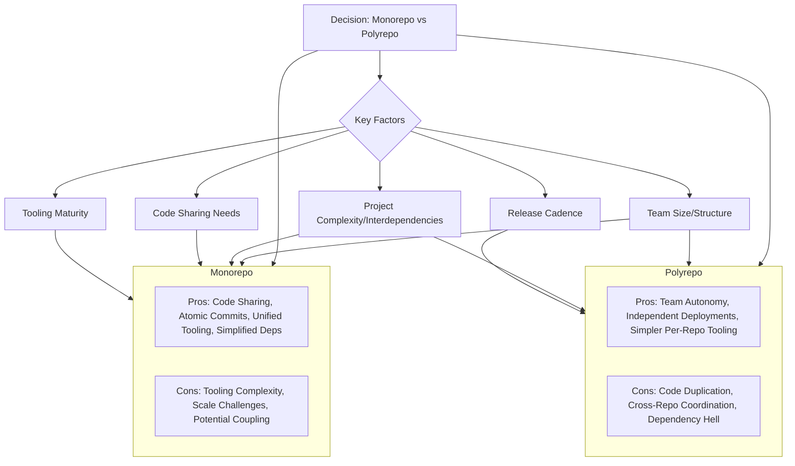
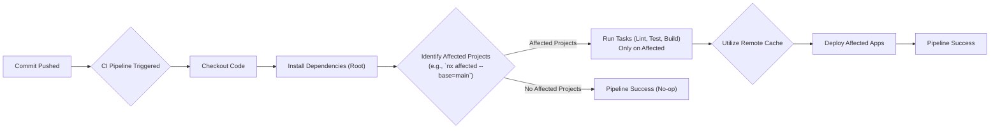

# Chapter 11: Monorepos vs. Polyrepos for Frontend Ecosystems

As frontend systems grow in complexity and involve multiple teams, applications, and shared libraries, the way code is organized becomes a critical architectural decision. How do you structure your repositories to maximize collaboration, maintainability, and deployment efficiency? This chapter delves into the two dominant strategies: monorepos (a single repository for multiple projects) and polyrepos (multiple repositories, typically one per project or team).

Choosing between a monorepo and a polyrepo approach is not merely a matter of preference; it has profound implications for your development workflow, tooling, build processes, dependency management, team autonomy, and overall scalability. There's no single "right" answer, as the optimal choice depends heavily on the specific context of your organization, teams, and projects. We will explore the intricate trade-offs, the specialized tooling required, and the practical strategies for managing code effectively within each paradigm. Understanding these nuances is essential for architecting a frontend ecosystem that can evolve and scale successfully.

## A. Understanding the Trade-offs

Before diving into tooling and implementation details, it's crucial to grasp the fundamental advantages and disadvantages inherent in both monorepo and polyrepo structures.

> **Monorepo:** A version control repository that holds the source code for multiple distinct projects (applications, libraries, services).
>
> **Polyrepo:** A strategy where each project (application, library, service) resides in its own separate version control repository.

Let's break down the characteristics of each:

#### 1. Monorepo: Code Sharing, Atomic Commits, Simplified Dependency Management, Tooling Complexity

**Advantages:**

- **Simplified Code Sharing:** Sharing code (components, utilities, types) between projects becomes trivial. Import paths are direct, eliminating the need for separate versioning and publishing cycles for internal libraries during development.
- **Atomic Commits/Refactoring:** Changes spanning multiple projects (e.g., updating a shared library and all its consumers) can be committed atomically in a single changeset. This greatly simplifies large-scale refactoring and ensures consistency across dependent projects.
- **Simplified Dependency Management:** Managing third-party dependencies can be centralized. Often, a single version of a dependency (e.g., React, Lodash) is used across the entire repository, reducing conflicts and ensuring consistency. Workspace tools (like Yarn/NPM/pnpm workspaces) help manage this efficiently.
- **Unified Tooling and Standards:** It's easier to enforce consistent linting rules, testing frameworks, build configurations, and code style across all projects within the monorepo.
- **Enhanced Collaboration & Visibility:** Developers can easily browse and understand code across different projects, potentially fostering better collaboration and knowledge sharing. Discoverability of shared code is high.

**Disadvantages:**

- **Tooling Complexity:** Standard Git commands and CI/CD tools may struggle with the scale of a large monorepo. Specialized tooling (Nx, Turborepo, Lerna, Bazel) is often _required_ to manage builds, tests, dependencies, and deployments efficiently (e.g., only building/testing affected projects).
- **Potential for Tight Coupling:** While code sharing is easier, it can also inadvertently lead to tighter coupling between projects if not managed carefully with clear boundaries and APIs.
- **Build/Test Times (Without Optimization):** Without intelligent tooling, building or testing the entire repository for every small change becomes prohibitively slow. "Affected" commands are essential.
- **Access Control:** Granular access control (allowing specific teams access only to certain parts of the repo) can be more challenging to implement effectively compared to separate repositories.
- **Steeper Learning Curve:** Developers new to the project might face a steeper learning curve due to the sheer volume of code and the specialized tooling involved.

**Example: Atomic Commit Benefit (Monorepo)**

Imagine a shared UI component library (`@my-org/ui-kit`) and two applications (`app-alpha`, `app-beta`) consuming it within a monorepo. A critical accessibility fix is needed in a button component within `ui-kit`. This fix also requires minor adjustments in how `app-alpha` and `app-beta` use that button.

- **Monorepo:** A developer makes the changes to `ui-kit`, `app-alpha`, and `app-beta` within the same branch and creates a _single_ pull request. This PR is reviewed and merged atomically. All changes land simultaneously, ensuring consistency. The CI pipeline, using "affected" commands, only rebuilds and tests `ui-kit`, `app-alpha`, and `app-beta`.
- **Polyrepo (Contrast):** The developer first updates the `ui-kit` repo, publishes a new version (e.g., `1.2.1`). Then, they create separate PRs in `app-alpha` and `app-beta` to update the `ui-kit` dependency to `1.2.1` and make the necessary usage adjustments. This involves multiple PRs, potential delays between updates, and a higher risk of inconsistency if one app updates before the other.

#### 2. Polyrepo: Team Autonomy, Independent Deployments, Code Duplication, Cross-Repo Coordination

**Advantages:**

- **Team Autonomy:** Teams typically have full ownership of their repository, allowing them to choose their own tools (within organizational guidelines), development pace, and release schedules.
- **Independent Deployments:** Each project can be built, tested, and deployed independently without affecting others. This simplifies the deployment pipeline for individual projects.
- **Clear Ownership and Boundaries:** Repository boundaries naturally enforce separation of concerns and make ownership clear.
- **Simpler Per-Repo Tooling:** Standard Git and CI/CD practices generally work well for individual repositories without requiring specialized monorepo management tools. Build and test times are naturally scoped to the single project.
- **Granular Access Control:** Access control is straightforward – permissions are managed per repository.

**Disadvantages:**

- **Code Duplication/Inconsistency:** Sharing code requires creating separate shared libraries, publishing them (e.g., to npm), and managing their versions across consuming repositories. This often leads to code duplication or inconsistencies if not managed rigorously.
- **Cross-Repo Coordination Overhead:** Making changes that affect multiple repositories (like the atomic commit example above) requires significant coordination, potentially involving multiple pull requests, version bumps, and careful release sequencing.
- **Dependency Management Complexity:** Managing dependencies _across_ repositories can become complex ("dependency hell"). Different projects might require conflicting versions of the same shared library or third-party dependency, leading to integration challenges.
- **Reduced Discoverability:** Finding shared code or understanding dependencies across the entire ecosystem can be difficult. Developers might reinvent the wheel if they aren't aware of existing solutions in other repositories.
- **Tooling/Standardization Drift:** Maintaining consistent tooling, linting rules, and development practices across many independent repositories requires significant organizational effort and discipline.

**Example: Dependency Hell (Polyrepo)**

Consider a polyrepo setup with `shared-utils` (v1.0.0), `app-one` (depends on `shared-utils` v1.0.0), and `app-two` (depends on `shared-utils` v1.0.0).

1.  Team Two needs a new feature from `shared-utils` and updates it, releasing `shared-utils` v2.0.0 (potentially with breaking changes). `app-two` is updated to use v2.0.0.
2.  Team One now needs to integrate a feature that relies on functionality from `app-two`. However, `app-one` still uses `shared-utils` v1.0.0. Integrating code or components from `app-two` might fail or require complex workarounds because of the incompatible `shared-utils` versions.
3.  Resolving this requires either `app-one` to undertake the potentially significant effort of migrating to `shared-utils` v2.0.0 or finding complex ways to isolate the dependencies. This coordination overhead slows down development.

#### 3. Factors Influencing the Decision

The choice between monorepo and polyrepo isn't black and white. Consider these factors:

- **Team Size and Structure:**
  - **Small/Colocated Teams:** Monorepos often work well, facilitating easy collaboration.
  - **Large/Distributed Teams:** Polyrepos might seem simpler initially due to autonomy, but monorepos with strong tooling can scale effectively by managing interdependencies explicitly. The key is tooling and clear ownership within the monorepo.
  - **Organizational Silos:** Strong silos might favor polyrepos, while organizations encouraging cross-team collaboration might lean towards monorepos.
- **Project Complexity and Interdependencies:**
  - **Highly Interrelated Projects:** A monorepo shines when projects frequently share code or require coordinated changes.
  - **Loosely Coupled Projects:** Polyrepos might be sufficient if projects are largely independent with well-defined APIs between them.
- **Code Sharing Needs:** If extensive code sharing (UI components, utilities, types) is a primary goal, a monorepo offers significant advantages.
- **Release Cadence:** Polyrepos naturally support independent release schedules. Monorepos _can_ support this with proper tooling (independent versioning and deployment pipelines triggered by affected commands), but it requires deliberate setup.
- **Tooling Maturity and Investment:** Implementing and maintaining a large-scale monorepo requires investment in specialized tooling (Nx, Turborepo, etc.) and educating developers on how to use it. Polyrepos rely more on standard tooling but require robust processes for managing shared libraries and cross-repo changes.
- **Existing Infrastructure:** Migrating a large existing polyrepo ecosystem to a monorepo (or vice-versa) is a significant undertaking. The current state often influences the path forward.

**Diagram Explanation:** This diagram illustrates the central decision between Monorepo and Polyrepo, influenced by key factors. It also summarizes the core pros and cons associated with each approach, highlighting the trade-offs involved.

## B. Monorepo Tooling and Strategies

Choosing a monorepo necessitates adopting specialized tooling to manage its inherent complexities effectively. These tools provide mechanisms for optimizing builds, tests, dependency management, and code generation, making large monorepos tractable.

#### 1. Deep Dive: Nx (Generators, Executors, Caching, Dependency Graph)

Nx is a powerful and extensible build system with first-class monorepo support. It provides a suite of tools and conventions to manage complex projects efficiently.

- **Workspace:** The root of the monorepo, containing configuration files (`nx.json`, `workspace.json` or `project.json` files).
- **Projects:** Applications (`apps/`) and libraries (`libs/`) within the workspace. Nx encourages breaking down functionality into smaller, reusable libraries.
- **Generators:** Code scaffolding tools (`nx generate ...`) that create boilerplate for components, libraries, applications, etc., ensuring consistency and adherence to patterns. Custom generators can be created for project-specific needs.
- **Executors:** Wrappers around common tasks (`nx build`, `nx test`, `nx serve`, `nx lint`). They define _how_ a task is executed for a specific project, often integrating with underlying tools like Webpack, Jest, ESLint, or framework CLIs. Executors can be customized.
- **Dependency Graph:** Nx analyzes the `import` statements across the workspace to build an accurate graph of dependencies between projects (`nx graph` or `nx dep-graph`). This graph is crucial for optimization.
- **Caching:** Nx caches the results of tasks (builds, tests, linting). If you run a task again on code that hasn't changed (and its dependencies haven't changed), Nx restores the output from the cache almost instantly. This dramatically speeds up CI/CD and local development. Caching can be local or distributed (Nx Cloud).
- **Affected Commands:** Using the dependency graph, Nx can identify only the projects affected by a code change (`nx affected:build`, `nx affected:test`). This avoids rebuilding and retesting the entire monorepo, leading to massive time savings in CI.

Nx provides a structured and opinionated approach, often beneficial for large teams seeking consistency and powerful optimizations.

#### 2. Deep Dive: Turborepo (Remote Caching, Task Pipelines)

Turborepo, acquired by Vercel, focuses primarily on being an incredibly fast build system optimized for JavaScript/TypeScript monorepos.

- **Task Pipelines:** Defined in `turbo.json`, these specify the relationships and dependencies between tasks (e.g., `build` depends on the `build` task of its internal dependencies, `test` depends on `build`). Turborepo uses this pipeline definition to optimize task scheduling and parallelization.
- **Caching:** Similar to Nx, Turborepo implements aggressive caching of task outputs. If the inputs (source files, dependencies, environment variables) for a task haven't changed, the output is retrieved from the cache.
- **Remote Caching:** Turborepo offers built-in support for sharing the cache across a team and CI/CD environments, significantly speeding up builds for everyone. This is often integrated with platforms like Vercel.
- **Affected Commands:** Turborepo can filter tasks to run only on packages affected by changes since a specific Git commit (`turbo run build --filter=...[HEAD^1]`).
- **Less Opinionated:** Compared to Nx, Turborepo is generally less opinionated about project structure and code generation, focusing purely on optimizing the execution of tasks defined in `package.json` scripts. It integrates well with existing package manager workspaces.

Turborepo is often favored for its speed, simplicity (relative to Nx's broader feature set), and excellent remote caching capabilities, particularly for teams already using Vercel.

#### 3. Lerna (Classic and Modern Usage)

Lerna was one of the earliest popular tools for managing JavaScript monorepos.

- **Classic Usage:** Primarily focused on managing multiple packages that would be published to npm. Key commands included `lerna bootstrap` (linking cross-dependencies), `lerna publish` (automating version bumping and publishing), and `lerna run` (running npm scripts across packages).
- **Modern Usage:** With the advent of native workspace features in package managers (Yarn, NPM, pnpm) and more powerful build tools like Nx and Turborepo, Lerna's role has evolved.
  - `lerna bootstrap` is largely superseded by `yarn install`, `npm install`, or `pnpm install` in workspace setups.
  - `lerna publish` remains valuable for orchestrating the release process of multiple packages.
  - `lerna run` or `lerna exec` can still be used for running commands, but often Nx or Turborepo provide more optimized alternatives (leveraging caching and affected logic).
- **Integration:** Lerna is now often used _alongside_ Nx or Turborepo. Nx has official integration and stewardship of Lerna, allowing developers to use Nx's computation caching and affected graph with Lerna commands.

While still relevant, especially for publishing workflows, Lerna is often complemented or replaced by Nx/Turborepo for build and task orchestration in modern frontend monorepos.

#### 4. Yarn Workspaces / NPM Workspaces / pnpm Workspaces

These are features built into the major JavaScript package managers that provide the foundational mechanism for monorepos:

- **Dependency Hoisting:** They install dependencies from all projects within the monorepo into a single `node_modules` folder at the root (or use symlinking/hardlinking strategies like pnpm), reducing duplication and ensuring packages find their dependencies.
- **Local Linking:** They automatically symlink local packages within the monorepo. If `app-alpha` depends on `lib-ui`, the package managers ensure that `app-alpha/node_modules/lib-ui` points directly to the source code of `lib-ui` within the monorepo, rather than requiring a published version.
- **Single Lock File:** Typically, a single lock file (`yarn.lock`, `package-lock.json`, `pnpm-lock.yaml`) at the root manages dependencies for the entire workspace, aiding consistency.

These workspace features are the bedrock upon which tools like Nx, Turborepo, and Lerna build their more advanced capabilities. You almost always use package manager workspaces _within_ an Nx or Turborepo setup.

#### 5. Managing Dependencies and Versioning within a Monorepo

- **Single Version Policy:** Often, monorepos enforce a single version policy for external dependencies. All projects use the same version of React, Lodash, etc. This is managed via the root `package.json`. Tools like `syncpack` can help enforce consistency.
- **Multiple Versions (Exceptions):** While less common, some setups might allow specific projects to override certain dependency versions if absolutely necessary, though this adds complexity. Package manager features like `resolutions` (Yarn) or `overrides` (NPM/pnpm) can be used, but should be applied cautiously.
- **Internal Package Versioning:** How do you version the libraries (`libs/`) _within_ the monorepo?
  - **Fixed/Locked:** All internal packages share the same version number, bumped in lockstep (common with Lerna's fixed mode). Simple, but forces releases of unchanged packages.
  - **Independent:** Each internal package is versioned independently based on its changes (common with Lerna's independent mode or Nx/Turborepo setups). More flexible, but requires tooling to manage inter-package dependencies and publishing. Tools often use conventional commits to automate versioning and changelog generation.

#### 6. Setting up CI/CD for Monorepos (Affected Builds/Tests)

Efficient CI/CD is paramount for monorepos to avoid cripplingly slow pipelines.

- **The Problem:** Running `npm run build` and `npm run test` for the _entire_ repository on every commit is unsustainable.
- **The Solution: "Affected" Commands:** Leverage the tooling's dependency graph and Git history to identify only the projects impacted by a given change.
  - `nx affected:build --base=origin/main --head=HEAD`
  - `turbo run build --filter=...[origin/main]`
- **Pipeline Structure:**
  1.  **Checkout Code:** Fetch the repository code.
  2.  **Install Dependencies:** Run `yarn install`, `npm install`, or `pnpm install` at the root.
  3.  **Identify Affected Projects:** Use the tool's affected command (comparing against the base branch, e.g., `main` or `develop`).
  4.  **Run Tasks:** Execute linting, testing, building, and deployment tasks _only_ for the affected projects.
  5.  **Utilize Caching:** Configure the CI environment to leverage the remote caching features of Nx Cloud or Turborepo to avoid re-running tasks whose inputs haven't changed, even across different CI runs or developers' machines.

**Diagram Explanation:** This flowchart depicts a typical optimized CI/CD pipeline for a monorepo. It highlights the crucial step of identifying affected projects based on code changes, ensuring that tasks are only run on the necessary subset of the codebase, and leveraging remote caching for further optimization.

#### 7. [Configuration Guide: Setting up an Nx or Turborepo workspace]

Setting up a new monorepo with modern tooling is generally straightforward using their initialization commands.

**Conceptual Steps (Nx):**

1.  **Initialization:** Run `npx create-nx-workspace@latest my-org --preset=react` (or `angular`, `node`, `ts`, etc.). This scaffolds the basic structure, installs Nx, and sets up configuration files (`nx.json`, `package.json`, etc.).
2.  **Add Applications:** Use Nx generators: `nx generate @nx/react:application my-app`.
3.  **Add Libraries:** Use Nx generators: `nx generate @nx/react:library my-shared-ui`.
4.  **Define Dependencies:** Import code from libraries into applications as needed (e.g., `import { Button } from '@my-org/my-shared-ui';`). Nx automatically detects these dependencies.
5.  **Configure Tasks (Optional Customization):** Project tasks (build, test, serve) are usually pre-configured by generators in `project.json` files. You can customize these if needed.
6.  **Run Tasks:** Use `nx build my-app`, `nx test my-shared-ui`, `nx affected:test`.

**Conceptual Steps (Turborepo):**

1.  **Initialization:** Run `npx create-turbo@latest my-turborepo`. This sets up a basic monorepo structure with Yarn/NPM/pnpm workspaces, installs Turborepo, and creates a `turbo.json` file.
2.  **Add Packages:** Manually create directories under a `packages/` (or similar) folder. Each package needs its own `package.json`. Add applications similarly (e.g., in an `apps/` folder).
3.  **Define Workspaces:** Configure the root `package.json` to recognize the `apps/*` and `packages/*` directories as workspaces.
4.  **Define Dependencies:** Add local packages as dependencies in the relevant `package.json` files (e.g., `app-one`'s `package.json` lists `"my-shared-ui": "workspace:*"`). Run `yarn/npm/pnpm install`.
5.  **Configure Pipelines:** Define task dependencies and caching behavior in `turbo.json`. Specify which tasks depend on others (e.g., `build` depends on `^build` - the build task of its dependencies) and which tasks' outputs should be cached.
6.  **Run Tasks:** Use `turbo run build`, `turbo run test --filter=my-app`, `turbo run test --filter=...[main]`.

These tools have excellent documentation providing detailed setup guides. The key takeaway is that they provide structure and automation for managing the monorepo effectively.

#### 8. [Case Study: Migrating multiple frontend projects into a monorepo]

**Scenario:** "InnovateApp Inc." had three separate React frontend applications (`customer-portal`, `admin-dashboard`, `marketing-site`) each in its own Git repository. They also maintained a separate repository for a shared UI component library (`innovate-ui-kit`).

**Challenges with Polyrepo:**

- **UI Inconsistency:** `innovate-ui-kit` updates were slow to propagate. Different apps often used slightly different versions or had locally patched versions, leading to visual inconsistencies.
- **Code Duplication:** Common utility functions (auth helpers, API clients) were copied or slightly modified across the application repos.
- **Refactoring Pain:** Updating a core API client used by all three apps required coordinating PRs and releases across four repositories.
- **Onboarding Complexity:** New developers had to clone multiple repositories and understand different (sometimes conflicting) build setups.
- **CI/CD Sprawl:** Maintaining separate CI/CD pipelines for each repo was becoming burdensome.

**Migration to Monorepo (using Nx):**

1.  **Setup:** An Nx workspace was created.
2.  **Import:** The codebases for the three apps and the UI kit were moved into `apps/` and `libs/` directories respectively within the Nx workspace. Git history was partially preserved using subtree merges or import tools where feasible.
3.  **Configuration:** `project.json` files were configured for each app and library, defining build, test, and serve targets using Nx executors (@nx/webpack, @nx/jest, etc.).
4.  **Dependency Management:** A single root `package.json` was established, consolidating common dependencies (React, TypeScript, etc.) and enforcing single versions. Yarn workspaces handled linking.
5.  **Refactoring Shared Code:** Duplicated utility functions were extracted into new shared libraries within `libs/` (e.g., `libs/auth`, `libs/api-client`). Applications were updated to import directly from these libraries.
6.  **CI/CD Pipeline:** A single CI/CD pipeline was created using GitHub Actions, leveraging `nx affected:build` and `nx affected:test` to only process changed projects. Nx Cloud was implemented for distributed caching.

**Results:**

- **Improved Consistency:** All apps now consumed the latest `innovate-ui-kit` directly from source. UI consistency improved dramatically.
- **Increased Code Reuse:** Shared libraries for auth, API clients, and utilities reduced duplication significantly.
- **Simplified Refactoring:** Cross-cutting changes could be made in a single atomic commit/PR.
- **Faster Builds:** CI times dropped significantly due to "affected" commands and remote caching via Nx Cloud. Local builds also benefited from caching.
- **Streamlined Onboarding:** New developers only needed to clone one repository and learn one set of commands (`nx ...`).

**Challenges During Migration:**

- Initial tooling setup and configuration required learning Nx.
- Getting team buy-in and adapting to new workflows took time.
- Merging Git histories was complex and imperfect.
- Initial full builds were slow before caching was effective.

Despite the initial effort, InnovateApp Inc. found the long-term benefits of improved consistency, collaboration, and efficiency outweighed the migration costs.

## C. Polyrepo Strategies and Coordination

While monorepos offer compelling advantages for managing interdependencies, the polyrepo approach remains viable and sometimes preferable, especially for organizations prioritizing team autonomy or dealing with truly decoupled projects. However, success with polyrepos requires deliberate strategies to mitigate the inherent challenges of coordination and consistency.

#### 1. Managing Shared Libraries (Versioning, Publishing, Consumption)

This is the cornerstone of code sharing in a polyrepo world.

- **Dedicated Repositories:** Create separate Git repositories for shared code (e.g., `ui-components`, `shared-utils`, `api-client-spec`).
- **Semantic Versioning (SemVer):** Strictly adhere to SemVer (Major.Minor.Patch) for published packages. This communicates the nature of changes (breaking, feature, fix) to consumers.
- **Publishing:** Publish shared libraries as packages to a registry. This could be the public npm registry or, more commonly for internal code, a private registry like:
  - npm Pro/Teams/Enterprise
  - GitHub Packages
  - GitLab Package Registry
  - JFrog Artifactory
  - AWS CodeArtifact
- **Consumption:** Consuming applications list the shared library as a dependency in their `package.json` (e.g., `"@my-org/ui-components": "^1.2.3"`).
- **Update Strategy:** Decide how updates are consumed:
  - **Manual Updates:** Teams explicitly update dependencies when needed. Gives control but can lead to divergence.
  - **Automated Updates:** Use tools like Dependabot or Renovatebot to automatically create PRs when new versions of shared libraries are published. Requires good test coverage to catch regressions.
- **Challenges:**
  - **Versioning Overhead:** Every change requires a version bump and publish cycle.
  - **Synchronization:** Ensuring all consuming applications update in a timely manner can be difficult.
  - **"Dependency Hell":** Managing transitive dependencies and potential version conflicts across multiple consuming applications requires diligence (as illustrated in the earlier example).

#### 2. Cross-Repository Communication and Integration Testing

When changes in one repository impact another (e.g., an API change in a backend service consumed by a frontend app), coordination is key.

- **API Contracts:** Define clear contracts between systems (e.g., using OpenAPI/Swagger for REST APIs, GraphQL schemas). Version these contracts.
- **Contract Testing:** Implement contract testing (e.g., using Pact). The consumer defines the interactions it expects, and the provider verifies these expectations against its codebase. This helps catch integration issues early without requiring fully integrated environments.
- **End-to-End (E2E) Testing:** Have a separate E2E test suite that runs against a deployed environment where multiple applications/services are integrated. This validates the system as a whole but is typically slower and runs later in the development cycle.
- **Communication Channels:** Establish clear communication channels between teams responsible for different repositories (Slack, regular meetings, shared documentation).
- **Feature Flags:** Use feature flags to decouple deployment from release, allowing changes to be deployed across multiple repositories gradually and rolled back easily if integration issues arise.

#### 3. Git Submodules / Git subtree (Use Cases and Pitfalls)

These are Git features sometimes considered for managing shared code, but they come with significant drawbacks, especially for internal, frequently changing code.

- **Git Submodules:** Allows you to embed one Git repository inside another. The outer repository stores a reference to a specific commit in the submodule repository.
  - **Use Cases:** Primarily useful for including _external_ third-party libraries or dependencies where you don't frequently modify the submodule's code yourself.
  - **Pitfalls for Internal Code:**
    - **Complexity:** Developers need to learn extra commands (`git submodule update --init --recursive`).
    - **Detached HEAD:** Checking out the outer repo often leaves submodules in a detached HEAD state.
    - **Commit Coordination:** Making changes requires committing in the submodule, pushing, then updating the pointer commit in the outer repo and committing/pushing again. This is cumbersome for frequent changes.
    - **Merge Conflicts:** Conflicts involving submodule pointers can be confusing to resolve.
- **Git Subtree:** Merges the history of another repository into your main repository as a subdirectory.
  - **Use Cases:** Can be simpler for one-time imports or less frequently updated shared code compared to submodules.
  - **Pitfalls for Internal Code:**
    - **History Bloat:** Merges the entire history of the subtree, potentially bloating the main repository.
    - **Updating/Pushing Back:** Pushing changes back to the original subtree repository or pulling updates from it requires complex `git subtree push/pull` commands with precise prefix arguments. It's easy to make mistakes.
    - **Divergence:** It's easy for the subtree copy to diverge significantly from the original source if updates aren't managed carefully.

> **Recommendation:** For managing _internal, actively developed_ shared frontend code, dedicated versioned packages (Strategy C.1) are generally far superior to Git submodules or subtree due to the developer experience and workflow complexities associated with the latter two. Reserve submodules/subtree for specific cases, primarily involving external or infrequently changing dependencies.

#### 4. [Production Note: Challenges of maintaining consistency across polyrepos]

While polyrepos offer autonomy, maintaining consistency across a large frontend ecosystem becomes a significant operational challenge. This requires conscious effort and robust processes:

- **UI/UX Consistency:** Without easy sharing (like in a monorepo), ensuring components look and behave identically across different applications requires strict adherence to design systems and rigorous processes for updating shared UI libraries. Visual regression testing becomes crucial.
- **Tooling & Configuration:** Keeping build tools (Webpack/Vite versions and configs), linters (ESLint rules), testing frameworks (Jest configs), and TypeScript versions aligned across dozens of repositories requires automation (e.g., shared configuration packages) and discipline. Drift is common.
- **Dependency Skew:** Different applications might end up on vastly different versions of core libraries (React, state management libraries) or shared internal libraries, making integration, shared tooling, and developer mobility harder.
- **Security Patching:** Applying critical security patches across numerous repositories requires efficient tracking and rollout processes. Tools like Dependabot help, but verification across all repos is needed.
- **Architectural Standards:** Enforcing architectural patterns, coding standards, and best practices consistently requires strong governance, documentation, and potentially shared tooling or templates (e.g., using `create-react-app` style templates).

Successfully scaling a polyrepo environment demands significant investment in automation, governance, and communication to prevent divergence and maintain a cohesive, manageable ecosystem.

## Conclusion

The decision between a monorepo and a polyrepo structure is one of the most impactful architectural choices for a growing frontend ecosystem. Monorepos, powered by tools like Nx and Turborepo, excel at managing interdependencies, facilitating code sharing, and enabling atomic refactoring, but require investment in specialized tooling and workflows. Polyrepos offer team autonomy and simpler per-repo setups but demand robust strategies for managing shared libraries, coordinating cross-repo changes, and maintaining consistency across the ecosystem.

The "best" approach is context-dependent, weighing factors like team structure, project coupling, and organizational maturity. Understanding the deep trade-offs, the available tooling, and the necessary strategies for either approach is crucial for building scalable, maintainable, and production-grade frontend systems. The next chapter will explore another architectural pattern often used in conjunction with or as an alternative to these repository strategies: Micro-Frontends.
