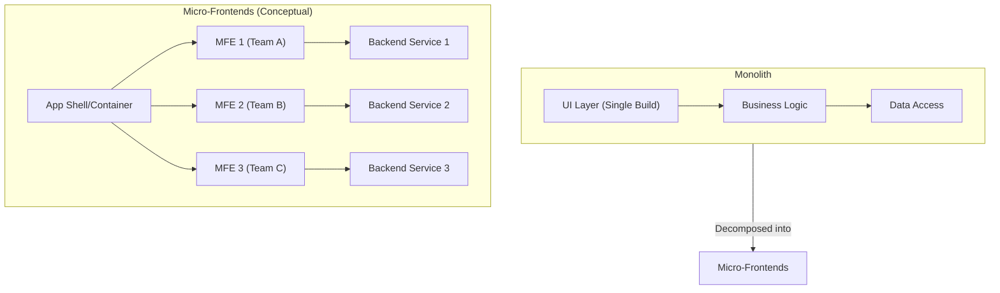
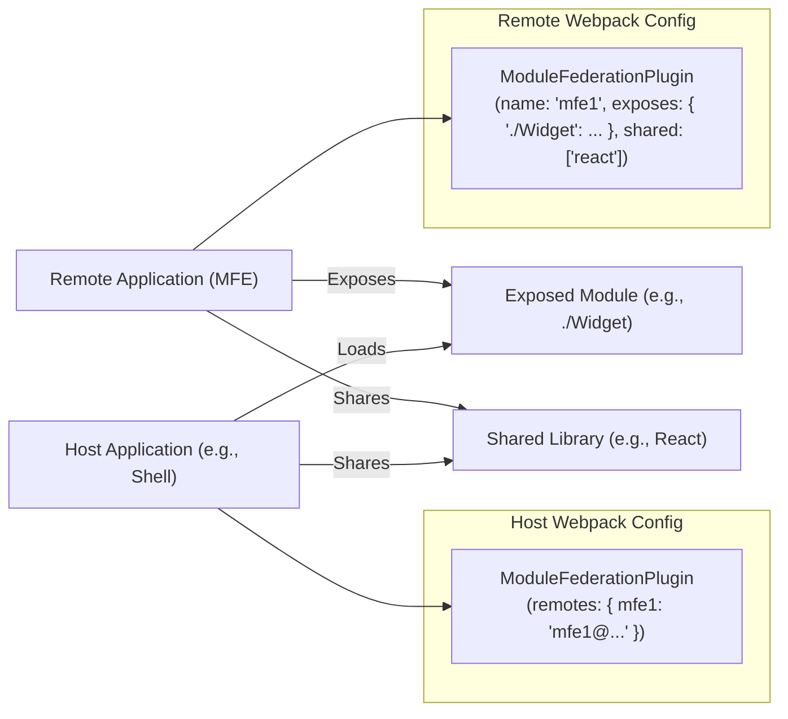

# Chapter 12: Micro-Frontends Architecture

The monolithic frontend application, once the standard, faces significant challenges as applications grow in complexity and team sizes increase. Coordinating development, managing dependencies, scaling features independently, and adopting new technologies become increasingly difficult. Just as microservices revolutionized backend development by breaking down monoliths into smaller, independently deployable services, **Micro-Frontends (MFEs)** apply similar principles to the frontend.

This architectural style involves decomposing a frontend application into smaller, semi-independent "micro-apps" working together. Each micro-frontend typically encapsulates a specific business domain or feature, developed and potentially deployed by a dedicated team. The goal is to achieve scalability, maintainability, and team autonomy in large, complex frontend ecosystems.

However, adopting micro-frontends is not a silver bullet. It introduces its own set of complexities related to integration, performance, consistency, and operational overhead. This chapter delves into the core concepts, motivations, implementation strategies, and design considerations essential for successfully architecting and implementing micro-frontend systems in a production environment.

## A. Core Concepts and Motivations

Why would an organization choose the inherent complexity of micro-frontends over a traditional monolith? The motivations stem primarily from the challenges of scaling frontend development in large organizations.

#### 1. Independent Teams and Deployments

Perhaps the most significant driver for adopting MFEs is enabling organizational scalability.

> **Definition: Independent Teams:** In an MFE architecture, different teams can own distinct parts of the user interface, corresponding to specific business capabilities or domains (e.g., Product Search, Shopping Cart, User Profile).

This ownership model allows teams to:

- **Develop Autonomously:** Teams can work on their features without deep coordination with others, reducing communication overhead and potential blocking dependencies.
- **Deploy Independently:** Crucially, teams can deploy their micro-frontend updates without requiring a coordinated release of the entire application. This dramatically increases deployment frequency, reduces release risk, and accelerates time-to-market for new features or bug fixes.
- **Manage Their Own Roadmap:** Teams have greater control over their specific domain's technical evolution and feature prioritization.

**Example: Production vs. Development Bottleneck**

- **Monolith Scenario:** Team A (Search) finishes a critical feature but must wait for Team B (Checkout) to fix a blocking bug before _any_ part of the application can be deployed. Release cycles are slow and coupled.
- **MFE Scenario:** Team A deploys their updated Search MFE as soon as it's ready. Team B's work doesn't block Team A. If the Checkout MFE has a critical issue, it might be temporarily disabled or rolled back independently, minimizing impact on other application areas. This independent deployability is a core production advantage.

#### 2. Technology Diversity

Monolithic frontends often enforce a single technology stack (e.g., React, Angular, Vue) across the entire application. While consistency has benefits, it can also hinder innovation and make upgrades difficult.

MFEs allow different teams to choose the technology stack best suited for their specific micro-frontend's requirements or their team's expertise.

- **Best Tool for the Job:** A computationally intensive data visualization MFE might benefit from a specific library or even WebAssembly (Chapter 21), while a forms-heavy section might use a framework excelling at form handling.
- **Team Expertise:** Teams can leverage their existing skills without being forced onto a less familiar stack.
- **Easier Adoption of New Technologies:** New frameworks or libraries can be piloted within a single MFE without impacting the entire application.

> **Caution:** Unfettered technology diversity can lead to excessive bundle sizes (duplicate dependencies) and inconsistent user experiences. This freedom must be balanced with strategies for sharing common dependencies (see Module Federation) and enforcing UI consistency (see Design Systems, Chapter 13).

#### 3. Incremental Upgrades and Decoupling

Rewriting large, legacy frontend monoliths is often a daunting, high-risk, and expensive undertaking. MFEs offer a path for gradual modernization.

- **Strangler Fig Pattern:** New features or sections can be built as MFEs alongside the existing monolith. Over time, functionality is "strangled" out of the monolith and replaced by MFEs until the monolith is eventually retired.
- **Targeted Refactoring:** Teams can refactor or upgrade their specific MFE without needing to coordinate a massive, application-wide refactoring effort. If a team wants to upgrade from React 17 to React 18, they can do so within their MFE's boundary (assuming dependency sharing is managed correctly).
- **Reduced Coupling:** By definition, MFEs aim to reduce coupling between different parts of the application. Changes within one MFE are less likely to have unintended consequences in another, improving overall system resilience (Chapter 16).

#### 4. Challenges: Performance Overhead, Consistency, Operational Complexity

Micro-frontends introduce significant challenges that must be addressed for a production-grade system:

- **Performance Overhead:**
  - **Bundle Size:** Loading multiple frameworks or duplicated dependencies can significantly increase the total JavaScript payload size, impacting load times (Chapter 15). Strategies like shared dependencies (Module Federation) are crucial.
  - **Network Requests:** Depending on the integration strategy, loading MFEs might involve additional network requests.
  - **Runtime Performance:** Orchestrating and bootstrapping multiple applications on the client side can consume more CPU resources.
- **Consistency:**
  - **UI/UX:** Maintaining a consistent look, feel, and interaction pattern across MFEs built by different teams, potentially using different technologies, is a major hurdle. A robust Design System (Chapter 13) is non-negotiable.
  - **Behavioral:** Ensuring consistent handling of cross-cutting concerns like error reporting (Chapter 20), internationalization, or accessibility (Chapter 14) requires careful planning and shared standards or libraries.
- **Operational Complexity:**
  - **Build & Deployment:** Managing separate build pipelines (Chapter 19) and deployment strategies for numerous MFEs is more complex than for a single monolith.
  - **Testing:** End-to-end testing (Chapter 18) across multiple independently deployed MFEs requires careful orchestration.
  - **Monitoring & Debugging:** Tracking user journeys and diagnosing issues across MFE boundaries can be challenging (Chapter 20). Distributed tracing might become necessary.
  - **Shared State & Communication:** Coordinating state and actions between MFEs requires well-defined patterns (discussed later).

Adopting MFEs is a strategic decision that trades monolithic simplicity for scalability and autonomy, but requires significant investment in tooling, standards, and architectural governance.

## B. Implementation Strategies

Several techniques exist for integrating micro-frontends into a cohesive user experience. The choice depends on factors like desired isolation level, performance requirements, team structure, and existing infrastructure.

#### 1. Build-Time Integration (e.g., NPM Packages - often not true MFE)

This approach involves publishing each micro-frontend as a package (e.g., on NPM or a private registry) and having a container application install these packages as dependencies.

- **How it Works:** The container application imports components or functions from the MFE packages. The final application is bundled together at build time.
- **Pros:** Relatively simple setup using existing package management tools. Good type safety if using TypeScript.
- **Cons:**
  - **Not Truly Independent Deployment:** A change in any MFE package requires the _container_ application to be rebuilt and redeployed. This violates the core MFE principle of independent deployability.
  - **Coupled Releases:** All MFEs are versioned and released together within the container.
  - **Technology Lock-in:** Often forces all packages to use compatible versions of shared libraries or frameworks.
- **Verdict:** While useful for sharing libraries or components (like in a Design System), this is generally **not considered a true micro-frontend architecture** due to the lack of independent deployment. It's more akin to modular monolith development.

#### 2. Server-Side Integration (e.g., Server-Side Includes, Tailor)

Here, the integration happens on the server before the page is sent to the browser. The server constructs the final HTML document by assembling fragments generated by different backend services (each potentially serving an MFE).

- **How it Works:**
  - **Server-Side Includes (SSI):** Using directives (e.g., in Nginx or Apache) to fetch and include HTML fragments from different URLs into a main template.
  - **Edge-Side Includes (ESI):** Similar to SSI but typically implemented at the CDN or edge layer.
  - **Composition Services:** Specialized services (like Zalando's Tailor or OpenComponents) that orchestrate calls to different MFE-serving endpoints and stitch the responses together.
- **Pros:**
  - **Faster Initial Load:** The browser receives a fully composed HTML page, potentially improving perceived performance and SEO.
  - **Technology Agnostic:** Different MFEs can be rendered using any server-side technology.
  - **Resilience:** If one MFE service fails, the composition layer might still be able to render the rest of the page.
- **Cons:**
  - **Requires Backend Coordination:** Needs infrastructure changes and potentially dedicated composition services.
  - **Limited Client-Side Interactivity:** Primarily focuses on composing HTML; client-side state sharing and communication between MFEs still need separate solutions.
  - **Potential Bottleneck:** The composition layer can become a single point of failure or performance bottleneck.

#### 3. Run-Time Integration via Iframes

Iframes (`<iframe>`) create nested browsing contexts, allowing embedding of entirely separate HTML documents.

- **How it Works:** A container application embeds each MFE within an iframe, pointing the `src` attribute to the URL where the MFE is hosted.
- **Pros:**
  - **Strong Isolation:** Excellent isolation for styles (CSS) and JavaScript globals. Conflicts are unlikely.
  - **Technology Agnostic:** Each iframe can load an application built with any technology.
  - **Independent Deployment:** MFEs hosted at different URLs can be deployed completely independently.
- **Cons:**
  - **Poor UX:** Can be difficult to create seamless routing, history management, and responsive layouts that span across iframes.
  - **Communication Complexity:** Communicating between the container and iframes (or between iframes) typically relies on `postMessage`, which can be cumbersome and requires careful security considerations.
  - **Performance Overhead:** Each iframe loads a separate document, potentially incurring significant overhead.
  - **SEO Challenges:** Search engine indexing of content within iframes can be problematic.
  - **Accessibility Issues:** Managing focus and ARIA attributes across iframe boundaries can be complex.

#### 4. Run-Time Integration via JavaScript (e.g., Single-SPA, Module Federation)

This is arguably the most popular and flexible approach for modern, highly interactive applications. Integration happens client-side using JavaScript.

- **How it Works:** A container application (often called a "shell") orchestrates the loading, mounting, and unmounting of different MFE applications (typically JavaScript bundles) directly into the DOM.
  - **Frameworks like `single-spa`:** Provide APIs and conventions for managing the lifecycle (load, mount, unmount) of MFEs built with different frameworks. The shell uses `single-spa` to determine which MFE to render based on the current route.
  - **Webpack Module Federation:** A lower-level Webpack feature (discussed next) allowing separate builds to dynamically load code from each other at runtime, effectively treating MFEs as dynamically linked libraries.
- **Pros:**
  - **Seamless UX:** Can provide a smooth, single-page application experience.
  - **Flexibility:** High degree of control over integration, communication, and routing.
  - **Independent Deployment:** MFEs can be deployed independently.
  - **Shared Dependencies:** Techniques like Module Federation allow efficient sharing of common libraries.
- **Cons:**
  - **Complexity:** Requires sophisticated tooling and careful architectural design.
  - **Potential Conflicts:** Requires discipline to avoid global namespace collisions or CSS conflicts (though techniques like CSS Modules or Shadow DOM help).
  - **Framework Integration:** Ensuring different frameworks coexist smoothly requires effort (e.g., managing routing, global event listeners).

#### 5. Web Components as an Integration Layer

Web Components (Custom Elements, Shadow DOM, HTML Templates) offer a framework-agnostic way to encapsulate functionality and UI.

- **How it Works:** Each MFE is wrapped within a Custom Element (e.g., `<product-recommendations>`). The container application simply includes these custom tags in its HTML. The browser handles loading and rendering the component defined by the MFE's JavaScript.
- **Pros:**
  - **Framework Agnostic:** The container doesn't need to know the internal implementation details or framework used by the MFE.
  - **Encapsulation:** Shadow DOM provides style and DOM isolation.
  - **Standardized:** Based on web standards, promoting interoperability.
- **Cons:**
  - **Maturity & Tooling:** While improving, tooling and browser support nuances can still be challenging compared to framework-specific solutions.
  - **Server-Side Rendering (SSR):** SSR for Web Components can be complex to set up consistently across different MFEs.
  - **Attribute/Property Limitations:** Communicating complex data structures via attributes can be awkward; properties and methods on the custom element are often needed.



**Diagram Explanation:** This diagram contrasts the traditional monolithic frontend structure (a single deployable unit) with the micro-frontend approach, where a central Shell application integrates multiple, independently developed and potentially deployed Micro-Frontends (MFE1, MFE2, MFE3), often corresponding to different teams or backend services.

## C. Deep Dive: Webpack Module Federation

Webpack Module Federation, introduced in Webpack 5, is a game-changer for implementing run-time integration via JavaScript. It allows a JavaScript application to dynamically load code from another application (at runtime) while efficiently sharing dependencies.

#### 1. Core Concepts: Host, Remote, Shared Dependencies, Exposed Modules

- **Host:** An application (typically the shell or another MFE) that consumes code from other applications (Remotes). It defines which Remotes it can connect to.
- **Remote:** An application that exposes modules to be consumed by Hosts. It defines which modules it makes available. An application can be both a Host and a Remote.
- **Exposed Modules:** Specific modules (components, functions, etc.) within a Remote that are made available for consumption by Hosts.
- **Shared Dependencies:** Libraries (e.g., `react`, `react-dom`, `lodash`) that can be shared between the Host and Remotes. Module Federation attempts to use only one instance of a shared dependency (if versions are compatible), significantly reducing bundle duplication.



**Diagram Explanation:** This diagram illustrates the basic relationship in Module Federation. The Host Application's Webpack config defines `remotes` it can consume. The Remote Application's config defines its `name`, `exposes` modules, and lists `shared` dependencies. At runtime, the Host can dynamically load the `Exposed Module` from the Remote, ideally sharing a single instance of `Shared Library`.

#### 2. Configuration and Setup

Setting up Module Federation involves configuring the `ModuleFederationPlugin` in the Webpack configuration (`webpack.config.js`) of both the Host and the Remote(s).

**Remote Configuration (`packages/remote-app/webpack.config.js`):**

```javascript
const { ModuleFederationPlugin } = require("webpack").container;
const deps = require("./package.json").dependencies;

module.exports = {
  // ... other webpack config (entry, output, rules, etc.)
  plugins: [
    new ModuleFederationPlugin({
      name: "remoteApp", // Unique name for this remote
      filename: "remoteEntry.js", // Standard filename for the manifest
      exposes: {
        // Alias: Path to the module
        "./Button": "./src/components/Button",
        "./utils": "./src/utils",
      },
      shared: {
        // Share dependencies to avoid duplication
        ...deps, // Share all dependencies (can be risky, better to be explicit)
        react: { singleton: true, requiredVersion: deps.react },
        "react-dom": { singleton: true, requiredVersion: deps["react-dom"] },
        // Add other key shared libraries
      },
    }),
    // ... other plugins
  ],
};
```

**Host Configuration (`packages/host-app/webpack.config.js`):**

```javascript
const { ModuleFederationPlugin } = require("webpack").container;
const deps = require("./package.json").dependencies;

module.exports = {
  // ... other webpack config
  plugins: [
    new ModuleFederationPlugin({
      name: "hostApp", // Optional name for the host
      remotes: {
        // Alias: 'remoteName@URL_to_remoteEntry.js'
        remoteApp: "remoteApp@http://localhost:3001/remoteEntry.js",
        // Add other remotes
      },
      shared: {
        // Define shared dependencies matching the remotes
        ...deps,
        react: { singleton: true, requiredVersion: deps.react },
        "react-dom": { singleton: true, requiredVersion: deps["react-dom"] },
      },
    }),
    // ... other plugins
  ],
};
```

**Key Points:**

- `name`: A unique identifier for the application when acting as a Remote.
- `filename`: The manifest file generated by the Remote, containing information about exposed modules and shared dependencies. The Host fetches this file.
- `exposes`: Maps internal module paths to publicly accessible aliases.
- `remotes`: Maps aliases used within the Host's code to the location (`name@URL`) of the Remote's `remoteEntry.js`.
- `shared`: Defines dependencies to be shared. `singleton: true` ensures only one instance is loaded (if versions are compatible). `requiredVersion` specifies acceptable version ranges.

#### 3. Sharing State and Functionality Between Remotes

While Module Federation handles code sharing, it doesn't dictate _how_ different MFEs should communicate or share application state. Common patterns include:

- **Shared Libraries:** Expose utility functions or state management modules (like a configured Redux store slice or Zustand store) from a dedicated "common" MFE or via the Host, and consume them in other MFEs. This requires careful dependency management.
- **Custom Events / PubSub:** Use the browser's Custom Events API or implement a simple publish-subscribe library accessible globally (e.g., attached to the `window` object, used sparingly) or passed down via props/context from the shell.
- **Props and Callbacks:** The Host application can pass data and callback functions down to the loaded MFE components as props.
- **Shared Context API (Framework Specific):** If Host and Remote use the same framework instance (e.g., React via `singleton: true`), the Host can wrap Remotes in a Context Provider to share state.
- **URL / Routing:** Use URL parameters or query strings to pass state between MFEs, especially when navigating between them.
- **Browser Storage:** Use `localStorage` or `sessionStorage` for simple, non-sensitive data sharing (use with caution due to synchronous nature and size limits).

**Example: Production vs. Development State Sharing**

- **Naive Approach:** Randomly using `window.myGlobalState = {...}` across different MFEs. This is brittle, hard to track, prone to naming collisions, and makes testing difficult.
- **Production Approach:** Define clear contracts. Use a dedicated PubSub library instance provided by the shell, or pass state down explicitly via props/context. For complex state, use a shared state management module exposed via Module Federation with clear actions/selectors. This improves maintainability, testability, and reduces unexpected side effects.

#### 4. Deployment Strategies for Federated Modules

A key benefit of Module Federation is independent deployment.

- **Independent Deployment:** The Host and each Remote can (and should) have their own CI/CD pipelines (Chapter 19). Deploying a new version of a Remote only requires updating its hosted `remoteEntry.js` and associated bundles.
- **Host Updates:** The Host application typically doesn't need redeployment unless:
  - The URL of a Remote changes.
  - A new Remote is added.
  - Shared dependency versions in the Host need updating.
  - The Host's own code changes.
- **Versioning:** Careful versioning of Remotes and shared dependencies is critical. Use semantic versioning. The `requiredVersion` in the `shared` config helps manage compatibility. Consider strategies for handling breaking changes in Remotes (e.g., versioned endpoints: `remoteApp_v1@...`, `remoteApp_v2@...`).
- **Dynamic Remotes:** The `remotes` object in the Host configuration can be populated dynamically at runtime (e.g., fetched from a configuration service), allowing for adding or updating Remotes without redeploying the Host.

#### 5. Practical Example: Building a simple application using Module Federation

Imagine an e-commerce shell (Host) loading a Product Recommendations widget (Remote).

1.  **Remote (`recommendations-mfe`):**
    - Builds a React component `RecommendationsWidget`.
    - Webpack config `exposes: { './Widget': './src/RecommendationsWidget' }`.
    - Shares `react` and `react-dom`.
    - Deploys its `remoteEntry.js` and bundles to `http://cdn.example.com/recommendations/`.
2.  **Host (`shell-app`):**

    - Webpack config `remotes: { recommendations: 'recommendations@http://cdn.example.com/recommendations/remoteEntry.js' }`.
    - Shares compatible versions of `react` and `react-dom`.
    - In its code (e.g., a React component):

    ```jsx
    import React, { Suspense } from "react";

    // Dynamically import the remote component
    const RecommendationsWidget = React.lazy(() =>
      import("recommendations/Widget")
    );

    function ProductPage() {
      return (
        <div>
          <h1>Product Details</h1>
          {/* ... other product info ... */}
          <h2>You Might Also Like</h2>
          <Suspense fallback={<div>Loading Recommendations...</div>}>
            <RecommendationsWidget productId="123" />
          </Suspense>
        </div>
      );
    }

    export default ProductPage;
    ```

Now, the `shell-app` can load and render the `RecommendationsWidget` dynamically at runtime. The recommendations team can update and deploy their widget independently, as long as the component interface (`productId` prop) and the `remoteEntry.js` URL remain stable.

#### 6. Configuration Guide: Setting up Module Federation between two applications

_(Refer to the Webpack configuration snippets in section C.2 for a practical guide)._

Key steps involve:

1.  Install `webpack` and necessary loaders/plugins in both projects.
2.  Identify shared dependencies (`react`, `react-dom`, common UI libraries, state management).
3.  Configure `ModuleFederationPlugin` in the **Remote**:
    - Set `name`.
    - Set `filename`.
    - Define `exposes` mapping aliases to module paths.
    - Define `shared` dependencies, marking key ones like framework libraries as `singleton: true` and specifying `requiredVersion`.
4.  Configure `ModuleFederationPlugin` in the **Host**:
    - Define `remotes` mapping aliases to the Remote's `name@URL`.
    - Define `shared` dependencies matching the Remote's shared config (compatible versions are crucial).
5.  Ensure the Remote application is running and accessible at the URL specified in the Host's `remotes` config.
6.  In the Host's code, use dynamic `import()` (often with `React.lazy` or similar framework features) to load modules using the remote alias (e.g., `import('remoteAlias/ExposedModuleAlias')`).

#### 7. Troubleshooting Section: Common Module Federation issues

- **Version Mismatches:**
  - **Symptom:** Errors like "Unsatisfied version..." or unexpected behavior. Often occurs with `singleton: true` dependencies.
  - **Cause:** Host and Remote require incompatible versions of a shared singleton library.
  - **Solution:** Ensure `requiredVersion` constraints are compatible across all consuming applications. Use tools like `npm ls <package-name>` or `yarn why <package-name>` to inspect resolved versions. Consider relaxing strict version requirements carefully or coordinating upgrades.
- **Runtime Errors on Load:**
  - **Symptom:** Errors like "Cannot read property 'get' of undefined" or "module not found" when trying to load a remote module.
  - **Cause:** `remoteEntry.js` failed to load (network error, CORS issue, wrong URL), the exposed module name is incorrect, or initialization code within the remote failed.
  - **Solution:** Check browser network tab for `remoteEntry.js` request status. Verify CORS headers on the server hosting the remote. Double-check `remotes` config in Host and `exposes` config in Remote. Add error boundaries around dynamic imports.
- **CORS Issues:**
  - **Symptom:** Browser blocks request to `remoteEntry.js` due to Cross-Origin Resource Sharing policy.
  - **Cause:** The server hosting the Remote MFE isn't configured to send the correct `Access-Control-Allow-Origin` headers for the Host's domain.
  - **Solution:** Configure the Remote's hosting server (or CDN) to allow requests from the Host's origin.
- **Multiple Framework Instances:**
  - **Symptom:** Unexpected behavior, state loss, context API not working across MFEs.
  - **Cause:** Forgetting `singleton: true` for shared framework libraries (like `react`).
  - **Solution:** Ensure critical shared libraries that rely on a single instance (React, Redux stores, etc.) are marked as `singleton: true` in the `shared` config of _all_ participating applications.
- **Configuration Errors:**
  - **Symptom:** Build failures or runtime errors related to Module Federation plugin setup.
  - **Cause:** Typos in `webpack.config.js`, incorrect paths, mismatched names.
  - **Solution:** Carefully review the `ModuleFederationPlugin` configuration in both Host and Remote against documentation and examples. Start with a minimal configuration and add complexity gradually.

## D. Designing for Micro-Frontend Systems

Successfully implementing MFEs requires more than just choosing an integration technique; it demands careful architectural design.

#### 1. The Application Shell / Container

The shell is the entry point and orchestrator of the MFE system. Its responsibilities typically include:

- **Rendering Global Layout:** Header, footer, navigation menus.
- **Handling Core Concerns:** Authentication state, routing initialization, global configuration loading.
- **Orchestrating MFE Loading:** Determining which MFE to load based on the route or other state, fetching it (e.g., via Module Federation or iframes), and mounting it into the correct place in the DOM.
- **Providing Shared Services:** May expose APIs or context for cross-MFE communication, access to shared libraries, or utilities (e.g., error reporting).

The shell should be kept as thin as possible to avoid becoming a new monolith. Its primary role is orchestration, not business logic.

#### 2. Routing Across Micro-Frontends

Routing in an MFE architecture needs careful consideration:

- **Shell-Managed Routing:** The shell owns the top-level routes and determines which MFE is responsible for the current URL path. It then loads that MFE. The MFE might handle its own sub-routes internally (e.g., `/products/123`, `/products/categories`). This is common and provides central control.
- **MFE-Managed Routing:** Each MFE could potentially register its routes directly with a central routing service managed by the shell. This requires more coordination.
- **Implementation:**
  - Use standard routing libraries (React Router, Vue Router) within each MFE for internal routing.
  - The shell uses its router to match top-level paths and trigger the loading/mounting of the corresponding MFE.
  - Ensure browser history (`pushState`, `replaceState`) is managed correctly, often coordinated by the shell or a shared routing library/service.

#### 3. Cross-MFE Communication Patterns

Direct coupling between MFEs should be minimized. Communication should ideally flow through the shell or use indirect patterns:

- **Custom Events (DOM Events):** MFEs can dispatch custom events on the `window` or a shared DOM node, and other MFEs (or the shell) can listen for them. Simple, but can become hard to manage at scale (event naming, data payload structure).

  ```javascript
  // MFE A (dispatching)
  window.dispatchEvent(
    new CustomEvent("cart:updated", { detail: { items: 5 } })
  );

  // MFE B (listening)
  window.addEventListener("cart:updated", (event) => {
    console.log("Cart updated:", event.detail.items);
  });
  ```

- **Pub/Sub Library:** A dedicated publish-subscribe library (either custom-built or off-the-shelf) provided by the shell or as a shared module. Offers better structure and decoupling than raw DOM events.
- **Props/Callbacks (Shell -> MFE):** The shell can pass data and functions down to MFEs when mounting them. Good for direct parent-child communication.
- **Shared State Management Module:** Expose parts of a shared store (Redux, Zustand, etc.) via Module Federation. Requires careful design of the shared state structure.
- **`window` Object (Use with Caution):** Sharing functions or data directly on the `window` object is possible but generally discouraged due to pollution of the global namespace, potential for collisions, and difficulty in tracking dependencies. Use only when absolutely necessary and with clear namespacing.
- **URL State:** Passing information via URL parameters remains a valid, stateless communication method.

#### 4. Maintaining UI/UX Consistency (Design Systems)

This is critical for avoiding a fragmented user experience.

- **Shared Component Library:** A Design System (Chapter 13) providing reusable UI components (buttons, inputs, modals, etc.) built according to established design guidelines.
- **Shared Styling/Tokens:** Using shared CSS variables/custom properties or design tokens (for colors, spacing, typography) ensures visual consistency even if MFEs use different CSS methodologies (CSS-in-JS, CSS Modules, utility classes).
- **Distribution:** The Design System components and styles can be distributed as:
  - An NPM package (if build-time integration is acceptable for the design system itself).
  - A dedicated MFE exposing components via Module Federation.
  - Raw CSS/Tokens that each MFE consumes.
- **Governance:** Clear guidelines and processes for contributing to and consuming the Design System are essential.

#### 5. Authentication and Authorization Strategies

Handling security across independent MFEs requires a unified approach:

- **Shell-Managed Authentication:** The shell application is typically responsible for the login process. Once authenticated, it obtains a token (e.g., JWT).
- **Token Propagation:**
  - The shell can store the token (e.g., in `localStorage` or memory) and make it available to MFEs via props, context, or a shared module.
  - MFEs include the token in their API requests to backend services.
- **Backend-for-Frontend (BFF):** Each MFE might communicate with its own dedicated BFF service. The shell authenticates with a central auth service, and subsequent requests from MFEs go through their BFFs, which might handle token validation or exchange.
- **Session Cookies:** Using secure, HTTP-only cookies can simplify things if all MFEs are served from the same parent domain or subdomains. The browser automatically sends the cookie with requests.
- **Authorization:** Permissions might be fetched by the shell after login and passed to MFEs, or each MFE might query a central authorization service based on the user's identity (derived from the token).

#### 6. Case Study: Architecting a large e-commerce site with Micro-Frontends

**Scenario:** "MegaMart," a large online retailer, struggles with its monolithic frontend. Releases are slow, different teams (Search, Product Detail, Cart, Checkout, Account) block each other, and upgrading the aging Angular.js codebase is daunting.

**MFE Approach:**

1.  **Decomposition:** Identify core domains: `Search`, `Product`, `Cart`, `Checkout`, `Account`, `SharedNav`.
2.  **Teams:** Assign dedicated teams to each domain.
3.  **Technology:**
    - Shell & SharedNav: React (kept minimal).
    - Search Team: Chooses Vue 3 for its reactivity and performance.
    - Product Team: Sticks with React for complex component interactions.
    - Cart Team: Uses Preact for performance optimization.
    - Checkout Team: Uses React, focusing on security and reliability.
    - Account Team: Uses React.
4.  **Integration:** Webpack Module Federation chosen for runtime integration via JavaScript.
5.  **Shell:** Handles routing (top-level), global header/footer (from `SharedNav` MFE), authentication state, and provides a basic PubSub instance for cross-MFE events (e.g., `cart:updated`).
6.  **Routing:** Shell maps `/search/*` to Search MFE, `/product/*` to Product MFE, `/cart` to Cart MFE, etc. MFEs handle their internal sub-routes.
7.  **Consistency:** A dedicated Design System team builds a shared component library (React) and design tokens (CSS variables). React components are wrapped as Web Components for consumption by the Vue MFE (or exposed directly via Module Federation where React is used). CSS variables ensure styling consistency across all MFEs.
8.  **Communication:**
    - `cart:updated` event published by Cart MFE when items are added/removed. Header MFE listens to update the cart icon count.
    - Product MFE passes product ID to Cart MFE via URL or PubSub event when "Add to Cart" is clicked.
9.  **Deployment:** Each MFE has its own CI/CD pipeline deploying to a CDN. The shell loads `remoteEntry.js` files from the CDN.
10. **Authentication:** Shell handles login, stores JWT in memory, and provides an API for MFEs to request the token for their backend calls.

**Benefits Achieved:**

- Teams deploy features independently multiple times a day.
- Search team innovates rapidly using Vue 3 features.
- Product team incrementally improves details pages without impacting checkout.
- Performance tuning can target specific MFEs (e.g., optimizing the Cart MFE).

**Challenges Faced:**

- Initial setup complexity of Module Federation and CI/CD pipelines.
- Ensuring strict adherence to the Design System across teams.
- Debugging issues spanning multiple MFEs required better correlation IDs and logging (Chapter 20).
- Managing shared dependency versions required careful coordination.

#### 7. Production Note: Performance implications of different MFE strategies

The choice of implementation strategy significantly impacts performance (Chapter 15):

- **Build-Time (NPM):** Least runtime overhead _per MFE_, but results in large monolithic bundles and slow initial loads if not carefully code-split. Violates independent deployment.
- **Server-Side Integration:** Can offer good Time To First Byte (TTFB) as HTML is pre-assembled. Performance depends heavily on the efficiency of the composition server and backend MFE services. Client-side hydration/interactivity costs still apply.
- **Iframes:** High isolation but potentially high overhead. Each iframe is a separate document load, consuming memory and CPU. Can block the main thread. Network requests multiply.
- **Run-Time JS (Module Federation):** Flexible but potentially costly.
  - **Good:** Shared dependencies drastically reduce duplicate code compared to naive JS integration or iframes. Dynamic loading means users only download code for the MFEs they interact with.
  - **Bad:** Can still lead to large initial bundles if not carefully managed (e.g., sharing too much eagerly). Runtime overhead of bootstrapping multiple applications. Network latency for fetching `remoteEntry.js` and MFE chunks can impact perceived performance. Requires careful code-splitting within both the shell and MFEs.
- **Web Components:** Performance depends on the component's complexity and underlying implementation. Shadow DOM can have some performance cost. SSR complexity can impact initial load performance.

**Production Optimization:** Regardless of the strategy, optimizing MFE performance requires diligent code-splitting, lazy loading, efficient dependency sharing (Module Federation shines here), image optimization, caching, and monitoring bundle sizes and core web vitals.

## Conclusion

Micro-frontends offer a compelling architectural pattern for scaling frontend development in large, complex applications involving multiple teams. By enabling independent development, deployment, and technology choices, MFEs can significantly improve team autonomy and delivery speed.

However, this power comes at the cost of increased complexity. Successfully implementing MFEs requires careful consideration of integration strategies (with Module Federation being a prominent modern choice), robust solutions for routing, cross-MFE communication, state management, and maintaining UI/UX consistency through strong Design Systems. The operational overhead of managing builds, deployments, testing, and monitoring across multiple independent units cannot be underestimated.

Micro-frontends are not a default choice; they are a solution tailored to specific scaling problems. When applied correctly, with a clear understanding of the trade-offs and a commitment to managing the inherent complexity, they provide a powerful foundation for building truly scalable, evolvable, and production-grade frontend systems. The following chapters on Design Systems, Cross-Cutting Concerns, Performance, and CI/CD will build upon the concepts introduced here, providing further tools and techniques essential for managing MFE architectures effectively.
