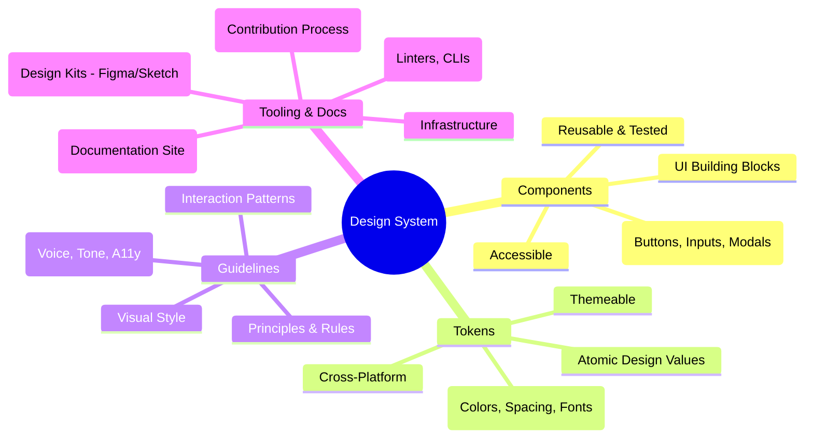

# Chapter 13: Design Systems: Building and Scaling UI Consistency

As frontend applications grow in complexity and are worked on by multiple teams, maintaining a consistent user interface (UI) and user experience (UX) becomes a significant challenge. Discrepancies creep in: buttons look slightly different across pages, spacing is inconsistent, interaction patterns vary, and accessibility standards are applied unevenly. This leads to a fragmented user experience, wasted development effort reinventing common UI elements, and increased maintenance overhead.

Design systems emerge as the strategic solution to these problems. They are far more than simple component libraries; they represent a holistic approach to product development, bridging the gap between design and engineering, and providing a shared language and toolkit for building high-quality, consistent user interfaces at scale. This chapter delves into the core concepts, architecture, implementation, and maintenance of design systems, positioning them as a critical pillar for any production-grade frontend ecosystem.

## A. What is a Design System? (Beyond Component Libraries)

Many teams start with a shared component library, which is a valuable first step. However, a true design system encompasses a broader set of interconnected elements that guide product development.

> **Definition: Design System**
> A design system is the single source of truth which groups all the elements that will allow the teams to design, realize, and develop a product. It consists of UI components, design tokens, guidelines, principles, tooling, and documentation, all working together to ensure consistency, efficiency, and scalability in product development.

Let's break down its core components:

#### 1. UI Components

These are the reusable building blocks of the user interface, implemented in code. Examples include buttons, input fields, modals, cards, navigation bars, etc. Key characteristics of design system components include:

- **Reusability:** Designed to be used across multiple features and applications.
- **Consistency:** Adhering strictly to the system's visual and interaction guidelines.
- **Accessibility:** Built with accessibility standards (like WCAG) in mind from the ground up.
- **Robustness:** Well-tested and reliable.
- **Well-Documented:** Clear usage instructions, props API, and examples.

#### 2. Design Tokens

Design tokens are the atomic, named entities that store the visual design attributes. They abstract design decisions away from hardcoded values, making the system themeable and easier to maintain. Think of them as design variables.

- **Examples:**
  - `color-brand-primary: #0052cc`
  - `font-size-medium: 16px`
  - `spacing-small: 8px`
  - `border-radius-default: 4px`
  - `shadow-level-1: 0 1px 3px rgba(0,0,0,0.12)`
- **Benefits:**
  - **Consistency:** Ensures attributes like color and spacing are used uniformly.
  - **Maintainability:** Updating a token value propagates the change everywhere it's used.
  - **Theming:** Enables easy creation of different themes (e.g., dark mode, high contrast) by swapping token sets.
  - **Cross-Platform:** Tokens can be transformed into formats usable by different platforms (Web CSS, iOS, Android, etc.).

#### 3. Guidelines and Principles

These provide the "why" and "how" behind the design system, guiding decision-making for both designers and developers.

- **Visual Style:** Rules for applying colors, typography, spacing, iconography, etc.
- **Voice and Tone:** Guidelines for language and communication style within the UI.
- **Interaction Patterns:** Standard ways to handle common user interactions (e.g., form validation feedback, loading states).
- **Accessibility (A11y):** Specific standards and best practices to ensure usability for everyone, often referencing WCAG levels (A, AA, AAA).
- **Motion Design:** Principles for using animation to enhance UX without being distracting.
- **Content Strategy:** Guidelines on writing clear and concise UI text.

#### 4. Tooling and Documentation

This encompasses the infrastructure that makes the design system usable and discoverable.

- **Documentation Site:** A central, accessible website showcasing components, tokens, guidelines, and usage examples (often built with tools like Storybook, Zeroheight, Docusaurus).
- **Design Kits:** Libraries for design tools (Figma, Sketch, Adobe XD) containing components and styles synced with the coded system.
- **Linters & Formatters:** Tools (like ESLint, Stylelint, Prettier) configured to enforce coding standards and design token usage.
- **CLI Tools:** Custom command-line tools to help automate tasks like component creation or token integration.
- **Contribution Workflow:** Defined processes for proposing, developing, reviewing, and releasing changes to the system.



**Diagram Explanation:** This mind map illustrates the core, interconnected pillars of a comprehensive design system, emphasizing that it's more than just a component library. Each pillar supports the others to create a cohesive and scalable system.

## B. Architecting a Scalable Design System

Building a design system that can evolve and serve multiple products or teams requires careful architectural planning. Simply throwing components together won't scale.

#### 1. Technology Choices (Framework Agnostic vs. Specific)

A fundamental decision is whether to tie the design system to a specific frontend framework (React, Vue, Angular) or aim for framework-agnosticism.

- **Framework-Specific:**
  - **Pros:** Faster initial development if the organization primarily uses one framework, leverages framework features directly, potentially easier integration for consumers using that framework.
  - **Cons:** Locks the system to that framework, difficult to use with other frameworks or future technologies, requires separate implementations for different frameworks if needed.
- **Framework-Agnostic:**
  - **Approach:** Often uses Web Components (via libraries like Stencil.js, Lit) or outputs plain CSS/JS that can be wrapped or used by any framework. Tokens are inherently agnostic.
  - **Pros:** Maximum reusability across different tech stacks, future-proofs the core system, promotes consistency even in heterogeneous environments.
  - **Cons:** Can have a steeper learning curve (Web Components), potential integration friction (framework wrappers might be needed), might not leverage framework-specific optimizations as easily.

> **Production Consideration:** For large organizations with diverse technology stacks or those planning for long-term evolution, a framework-agnostic approach, particularly for core styles and tokens, often provides better scalability. Components might still have framework-specific _wrappers_ built on top of an agnostic core or use Web Components directly.

#### 2. Monorepo Structure for Design System Packages

Managing the various parts of a design system (tokens, core styles, multiple component packages, documentation) is complex. A monorepo (managed by tools like Nx, Turborepo, Lerna) offers significant advantages:

- **Centralized Management:** All design system code lives in one repository.
- **Simplified Dependency Management:** Easier to link internal packages (e.g., components depending on tokens). Tools can optimize builds and tests based on changed packages.
- **Atomic Changes:** A single commit can update tokens, components using those tokens, and documentation simultaneously.
- **Consistent Tooling:** Easier to enforce linting, testing, and build processes across all packages.

#### 3. Managing Design Tokens (Style Dictionary, Figma Tokens)

Manually keeping tokens consistent across design tools (Figma) and code platforms (CSS, JS, iOS, Android) is error-prone. Automation is key.

- **Single Source of Truth:** Define tokens in a canonical format, often JSON or YAML. This can be managed directly in the repository or synced from design tools.
- **Tools:**
  - **Style Dictionary (by Amazon):** A popular build system that takes token definitions (JSON/YAML) and transforms them into various platform-specific formats (CSS variables, SCSS maps, JS objects, Android XML, iOS Swift code, etc.) using configurable templates.
  - **Figma Tokens Plugin:** Allows designers to manage tokens directly within Figma and export them as JSON, which can then be fed into Style Dictionary or a similar tool. This improves the design-dev workflow.
- **Workflow:**
  1.  Define/Update tokens in the source (Figma or JSON files).
  2.  Export/Commit token definitions.
  3.  Run a build process (e.g., `style-dictionary build`) to generate platform-specific outputs.
  4.  Package and publish these outputs.

#### 4. Versioning and Release Strategy

A clear versioning and release process is crucial for consumers.

- **Semantic Versioning (SemVer):** Use `MAJOR.MINOR.PATCH` (e.g., `2.1.3`).
  - `MAJOR`: Breaking changes (API changes, visual overhaul).
  - `MINOR`: New features/components (backwards-compatible).
  - `PATCH`: Bug fixes (backwards-compatible).
- **Release Pipeline (CI/CD):** Automate testing, building, version bumping, changelog generation, and publishing to a package registry (like NPM).
- **Changelogs:** Maintain a clear `CHANGELOG.md` file detailing changes in each version. Automated tools can help generate this from commit messages (e.g., Conventional Commits).
- **Communication:** Announce new releases, especially major ones, with migration guides if necessary.

#### 5. [Practical Example: Setting up a basic design system structure]

Here's a simplified monorepo structure using directories (tools like Nx or Turborepo would add configuration files):

```
my-design-system/
├── packages/
│   ├── tokens/             # Design token definitions and build config
│   │   ├── properties/     # Raw token JSON/YAML files (e.g., color.json, size.json)
│   │   ├── config.json     # Style Dictionary configuration
│   │   └── package.json
│   ├── core-styles/        # Base CSS, resets, global styles (optional)
│   │   ├── src/
│   │   └── package.json
│   ├── react-components/   # React component implementations
│   │   ├── src/
│   │   │   ├── Button/
│   │   │   │   ├── Button.tsx
│   │   │   │   ├── Button.module.css
│   │   │   │   └── index.ts
│   │   │   └── index.ts    # Exports all components
│   │   ├── package.json
│   │   └── tsconfig.json
│   ├── vue-components/     # Vue component implementations (if needed)
│   │   ├── src/
│   │   └── package.json
│   └── utils/              # Shared utility functions
│       ├── src/
│       └── package.json
├── apps/
│   └── docs/               # Documentation site (e.g., Storybook, Docusaurus)
│       ├── stories/        # Component stories for Storybook
│       └── package.json
├── tools/                  # Shared build scripts, configs
├── package.json            # Root package.json (for monorepo tooling)
├── nx.json                 # Example: Nx configuration
└── README.md
└── CHANGELOG.md
```

This structure separates concerns, allows independent versioning of packages (if desired), and facilitates management via monorepo tooling.

## C. Building Reusable and Themeable Components

The quality of the design system hinges on the quality of its components. They must be flexible, consistent, accessible, and themeable.

#### 1. API Design for Flexibility and Consistency

How developers interact with components (their API, primarily props) is critical.

- **Consistency:** Use consistent prop names for similar concepts across components (e.g., `variant`, `size`, `isDisabled`, `onClick`).
- **Predictability:** Props should behave as expected. Avoid boolean props that toggle wildly different behaviors; prefer explicit enum-like props (e.g., `variant="primary" | "secondary"` instead of `isSecondary`).
- **Flexibility:**
  - **Composition:** Allow components to be composed together easily. Use `children` props effectively.
  - **Slots:** Provide named slots (or equivalent prop patterns like `renderIcon`) for injecting custom content into specific areas of a component.
  - **Styling Overrides:** Offer controlled ways to customize styles when necessary (e.g., `className` prop, `style` prop, dedicated styling props), but document limitations.
- **Avoid Over-Abstraction:** Don't create components so generic they become difficult to use or understand. Balance reusability with clarity.

> **Example: Contrasting Button APIs**
>
> **Naive API:**
>
> ```jsx
> // Hard to know what combinations are valid, boolean explosion
> <Button large primary error iconLeft="add" text="Submit" />
> ```
>
> **Production-Grade API:**
>
> ```jsx
> // Clearer intent, controlled variations, composition for icon
> <Button
>   variant="primary"
>   size="large"
>   state="error" // Or maybe integrated with form validation context
>   onClick={handleSubmit}
>   icon={<AddIcon />} // Composition for icon
> >
>   Submit
> </Button>
> ```
>
> The second API is more explicit, easier to type-check (with TypeScript), and less prone to invalid combinations.

#### 2. Implementing Theming (CSS Variables, Context API, Styled Components Theming)

Theming allows adapting the look and feel of components without changing their core structure, often driven by design tokens.

- **CSS Custom Properties (Variables):**
  - **Mechanism:** Define tokens as CSS variables at a root level (e.g., `:root` or a theme-specific class). Components use these variables (`var(--color-brand-primary)`).
  - **Theming:** Change themes by swapping the set of variables (e.g., adding a `dark` class to `<body>` that redefines the variables).
  - **Pros:** Native browser feature, performant, framework-agnostic.
  - **Cons:** Requires CSS variable support (very good now).
- **React Context API:**
  - **Mechanism:** Wrap the application (or part of it) in a Theme Provider component that holds the current theme object (derived from tokens) in context. Components consume this context to get theme values.
  - **Pros:** Integrates well with React ecosystems, allows dynamic theme changes.
  - **Cons:** React-specific, can cause re-renders if not optimized.
- **CSS-in-JS Theming (e.g., Styled Components, Emotion):**
  - **Mechanism:** These libraries often provide a `<ThemeProvider>` component similar to the Context API approach. Styled components can directly access theme props.
  - **Pros:** Powerful integration with component styles, dynamic theming.
  - **Cons:** Tied to the specific CSS-in-JS library, potential runtime overhead.

The most common and scalable approach often involves using **CSS Custom Properties generated from design tokens**, potentially combined with a lightweight JS mechanism (like Context) to _trigger_ theme switches (e.g., toggling a class on the body).

#### 3. Accessibility as a Core Requirement

Accessibility (a11y) cannot be an afterthought; it must be baked into components from the start.

- **Semantic HTML:** Use appropriate HTML elements (e.g., `<button>`, `<nav>`, `<input type="checkbox">`) as they come with built-in accessibility features.
- **ARIA Attributes:** Use Accessible Rich Internet Applications (ARIA) attributes (`role`, `aria-label`, `aria-labelledby`, `aria-describedby`, `aria-hidden`, etc.) correctly to enhance semantics where native HTML is insufficient, especially for complex custom components (like dropdowns, tabs, modals).
- **Keyboard Navigation:** Ensure all interactive elements are focusable and operable via keyboard alone, in a logical order. Manage focus appropriately (e.g., trapping focus within modals).
- **Color Contrast:** Ensure text and UI elements meet WCAG contrast ratio requirements (e.g., AA level: 4.5:1 for normal text, 3:1 for large text/graphics). Use tokens to enforce accessible color combinations.
- **Screen Reader Testing:** Regularly test components with screen readers (VoiceOver, NVDA, JAWS) to ensure they are announced clearly and logically.

#### 4. [Code Snippet: Creating a themeable Button component]

This React example uses CSS Modules and CSS Variables derived from tokens.

**1. Define Tokens (e.g., generated by Style Dictionary):**

```css
/* variables.css (loaded globally) */
:root {
  --button-primary-background-color: #0052cc;
  --button-primary-text-color: #ffffff;
  --button-secondary-background-color: #f4f5f7;
  --button-secondary-text-color: #172b4d;
  --button-border-radius: 3px;
  --button-padding-vertical: 8px;
  --button-padding-horizontal: 12px;
  --font-family-base: sans-serif;
}

/* Example dark theme override */
body.dark-theme {
  --button-primary-background-color: #4c9aff;
  --button-primary-text-color: #091e42;
  --button-secondary-background-color: #282e33;
  --button-secondary-text-color: #b0bac9;
}
```

**2. Button Component (React + CSS Modules):**

```typescript
// Button.module.css
.button {
  font-family: var(--font-family-base);
  border: none;
  border-radius: var(--button-border-radius);
  padding: var(--button-padding-vertical) var(--button-padding-horizontal);
  cursor: pointer;
  display: inline-flex;
  align-items: center;
  justify-content: center;
  text-decoration: none;
  transition: background-color 0.2s ease, box-shadow 0.2s ease;
}

.button:focus {
  outline: 2px solid blue; /* Add proper focus indicator */
  outline-offset: 2px;
}

.primary {
  background-color: var(--button-primary-background-color);
  color: var(--button-primary-text-color);
}

.secondary {
  background-color: var(--button-secondary-background-color);
  color: var(--button-secondary-text-color);
  /* Add border for secondary if needed */
}

.disabled {
  opacity: 0.6;
  cursor: not-allowed;
}

// Button.tsx
import React from 'react';
import styles from './Button.module.css';

type ButtonVariant = 'primary' | 'secondary';

interface ButtonProps extends React.ButtonHTMLAttributes<HTMLButtonElement> {
  variant?: ButtonVariant;
  children: React.ReactNode;
}

export const Button: React.FC<ButtonProps> = ({
  variant = 'primary',
  children,
  className = '',
  disabled = false,
  ...props
}) => {
  const buttonClasses = `
    ${styles.button}
    ${variant === 'primary' ? styles.primary : styles.secondary}
    ${disabled ? styles.disabled : ''}
    ${className} // Allow external classes
  `.trim();

  return (
    <button
      className={buttonClasses}
      disabled={disabled}
      aria-disabled={disabled} // Important for accessibility
      {...props}
    >
      {children}
    </button>
  );
};
```

This component uses CSS variables for styling, making it automatically themeable by changing the variables (e.g., by toggling `dark-theme` class on the body). It also includes basic accessibility considerations like `aria-disabled`.

## D. Documentation and Collaboration

A design system is only effective if people know how to use it and can contribute back. Documentation and collaboration workflows are essential.

#### 1. Tools for Documentation (Storybook, Zeroheight, Docusaurus)

- **Storybook:** The industry standard for developing, documenting, and testing UI components in isolation. It provides a live playground for each component, showcasing different states and props, and allowing for visual regression testing and accessibility checks.
- **Zeroheight / Specify / Knapsack:** Platforms designed specifically for creating comprehensive design system documentation sites. They often integrate directly with design tools (Figma/Sketch) and code repositories (Storybook), pulling components, tokens, and design assets into a unified, searchable site that includes usage guidelines.
- **Docusaurus / GitBook / VuePress:** General-purpose documentation site generators that can be customized to host design system documentation, including markdown pages for guidelines, embedded Storybook instances, and token references.

The key is a central, well-organized, and easily searchable documentation site that serves both designers and developers.

#### 2. Integrating Design Tools (Figma, Sketch) with Development Workflow

Bridging the gap between design mockups and coded components reduces friction and inconsistency.

- **Synced Libraries:** Design tool libraries (Figma Libraries, Sketch Libraries) should mirror the coded components and tokens. Updates in the design system code should trigger updates in the design kits, and vice-versa (though the code is often the ultimate source of truth).
- **Figma REST API:** Can be used to programmatically extract design information, including token values or component structures, feeding into the build process or documentation.
- **Plugins:** Tools like the Figma Tokens plugin, or plugins that link Figma components directly to Storybook stories or code repositories, streamline the workflow.
- **Developer Handoff Tools:** Zeplin, Avocode, or Figma's own inspect mode allow developers to inspect design files, extract measurements, assets, and token values easily.

#### 3. Contribution Models and Governance

How do new components get added? How are bugs fixed? Who approves changes? A clear governance model is needed.

- **Contribution Process:** Define clear steps for proposing changes (e.g., issue templates), developing components (coding standards, testing requirements), submitting pull requests (PR templates, review checklists), and getting approvals.
- **Ownership Models:**
  - **Core Team:** A dedicated team owns and maintains the design system. They handle most development and review external contributions. (Pros: Consistency, dedicated focus. Cons: Can become a bottleneck).
  - **Federated/Distributed:** Ownership is distributed across different product teams. Teams contribute components relevant to their domain, reviewed by peers or a small core council. (Pros: Scalability, closer to product needs. Cons: Potential for inconsistency without strong guidelines and oversight).
  - **Hybrid:** A mix, with a core team handling foundational elements and processes, while feature teams contribute more specific components under guidance.
- **Review Process:** Establish clear criteria for code reviews (adherence to guidelines, accessibility, testing, performance) and design reviews (visual alignment, UX consistency).

#### 4. [Production Note: Driving adoption and ensuring consistency across teams]

> **Production Note: Adoption is Not Automatic**
> Simply building a design system and publishing it is not enough. Driving adoption requires active effort:
>
> - **Onboarding & Training:** Provide workshops and documentation to teach teams how to use the system effectively.
> - **Support Channels:** Offer dedicated Slack channels or office hours for questions and support.
> - **Advocacy:** Identify champions within product teams to promote the system's use.
> - **Integration Support:** Help teams integrate the system into their existing projects and build processes.
> - **Feedback Loops:** Actively solicit feedback from consuming teams to understand pain points and identify areas for improvement.
> - **Metrics:** Track adoption rates (e.g., percentage of UI built with system components) to measure success and justify continued investment.
>   Without proactive adoption strategies, even the best design system can fail to deliver its promised value, leading back to fragmentation and inconsistency.

## E. Distributing and Consuming the Design System

Once built, the design system needs to be packaged, distributed, and integrated into consuming applications reliably.

#### 1. Packaging and Publishing (NPM)

- **Packaging:** Each distinct part of the system (e.g., `tokens`, `react-components`, `utils`) should typically be packaged as a separate unit. This allows consumers to only install what they need. Build tools like Rollup, esbuild, or tsc are used to create distributable formats (e.g., CommonJS, ES Modules, UMD) and type definitions (`.d.ts`).
- **Publishing:** The standard mechanism for distributing web-focused packages is a package registry, most commonly NPM (using the public registry or a private one like GitHub Packages, Verdaccio, or Artifactory). The CI/CD pipeline should automate the publishing step upon successful merge/tagging.

#### 2. Integration into Application Build Processes

Consuming applications need to install and configure the design system packages.

- **Installation:** `npm install @my-design-system/react-components @my-design-system/tokens`
- **Importing Components:** Standard ES module imports: `import { Button } from '@my-design-system/react-components';`
- **Using Tokens:**
  - **CSS:** Import the generated CSS file containing variables: `import '@my-design-system/tokens/dist/variables.css';`
  - **JS/TS:** Import the generated JS object: `import tokens from '@my-design-system/tokens/dist/js/tokens';`
- **Build Tool Configuration:** Consumers might need to configure their build tools (Webpack, Vite, Next.js, etc.) to correctly handle CSS imports, assets (like fonts or icons) bundled with the design system, or ensure compatibility (e.g., transpilation settings).

#### 3. Handling Updates and Breaking Changes

Consumers need a predictable way to handle updates.

- **SemVer:** Strictly adhering to Semantic Versioning is paramount. Consumers can configure their `package.json` to accept only patch/minor updates automatically (`^2.1.0`, `~2.1.0`) while requiring manual intervention for major versions.
- **Clear Changelogs:** Essential for understanding what changed between versions.
- **Deprecation Strategy:** For breaking changes (major versions), provide clear warnings about deprecated components or props in the previous minor versions. Offer migration paths or codemods (automated code transformations) if possible.
- **Communication:** Proactively communicate upcoming major releases and breaking changes to consuming teams well in advance.

#### 4. [Configuration Guide: Consuming design tokens in an application]

Here’s a basic example of how a consuming React application might set up global CSS variables from the design system's token package.

**1. Install Token Package:**

```bash
npm install @my-design-system/tokens
```

**2. Assume the token package provides a CSS file:**
`@my-design-system/tokens/dist/css/variables.css` (containing the `:root { ... }` definitions)

**3. Import the CSS file globally:**
In the application's main entry point (e.g., `index.js`, `main.tsx`, `_app.tsx` in Next.js):

```javascript
// src/index.js or src/main.tsx
import React from 'react';
import ReactDOM from 'react-dom/client';
import App from './App';

// Import the design system's global token styles
import '@my-design-system/tokens/dist/css/variables.css';

// Import any application-specific global styles AFTER token styles
import './global.css';

const root = ReactDOM.createRoot(document.getElementById('root') as HTMLElement);
root.render(
  <React.StrictMode>
    <App />
  </React.StrictMode>
);
```

Now, any CSS written within the application (or within components from `@my-design-system/react-components` that use these variables) will have access to the design tokens defined as CSS custom properties. Switching themes might involve adding/removing a class on the `<body>` element that loads an alternative set of variable definitions, as shown previously.

```mermaid
flowchart LR
    subgraph Design System Repo (Monorepo)
        A[Tokens Definition (JSON/YAML)] --> B{Style Dictionary};
        B --> C[CSS Variables Output];
        B --> D[JS/TS Objects Output];
        B --> E[iOS/Android Output];
        F[Component Code (React/Vue/WC)] --> G{Build Process (Rollup/tsc)};
        C --> G;  // Styles used by components
        D --> G;  // Tokens potentially used in JS
        G --> H[Component Package (NPM)];
        C --> I[Token CSS Package (NPM)];
        D --> J[Token JS Package (NPM)];
    end

    subgraph Publishing
        H --> K([NPM Registry]);
        I --> K;
        J --> K;
    end

    subgraph Consuming Application
        L[App Code] --> M{Build Process (Webpack/Vite)};
        N[package.json] --> O{npm install};
        O --> K;
        K --> P[@my-ds/components];
        K --> Q[@my-ds/tokens-css];
        K --> R[@my-ds/tokens-js];
        P --> M;
        Q --> M; // CSS loaded globally or via components
        R --> L; // Tokens used in app logic/styles
        M --> S[Bundled Application];
    end

    style K fill:#f9f,stroke:#333,stroke-width:2px
```

**Diagram Explanation:** This flowchart illustrates the lifecycle of design system assets, from definition and building within the monorepo, through packaging and publishing to NPM, to finally being installed and consumed by an application's build process. It highlights the separation of token and component packages and their integration points.

## Conclusion

A well-architected design system is far more than a cosmetic enhancement; it is a strategic asset for building production-grade frontend applications. By establishing a shared language and toolkit based on reusable components, design tokens, clear guidelines, and robust tooling, design systems drive UI/UX consistency, improve development efficiency, enhance accessibility, and enable teams to scale their efforts effectively. While building and maintaining a design system requires significant upfront and ongoing investment, the long-term benefits in terms of product quality, development velocity, and maintainability make it an indispensable component of modern, large-scale frontend architecture. The principles discussed here – thoughtful architecture, component quality, robust documentation, and collaborative governance – are key to realizing that value.
