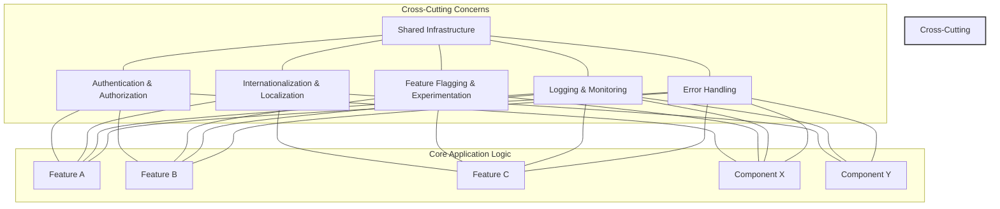
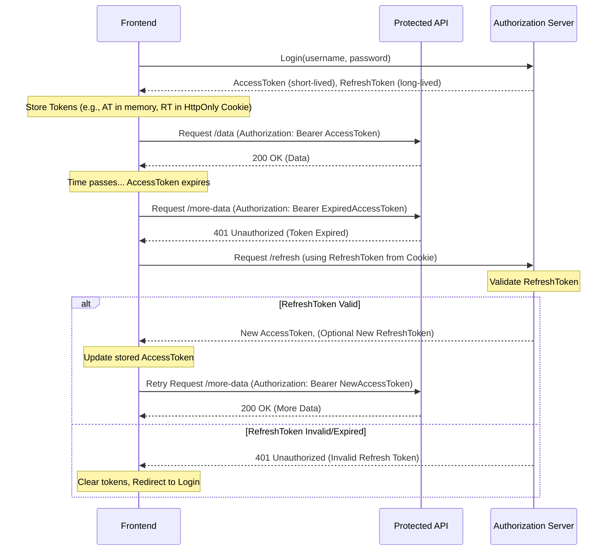

# Chapter 14: Cross-Cutting Concerns in Frontend Systems

## Introduction: Beyond Features - The Fabric of Production Applications

In the journey of building frontend applications, the focus often gravitates towards implementing user-facing features – the buttons, forms, data displays, and workflows that directly deliver value to the end-user. However, truly robust, scalable, and maintainable "production-grade" systems are defined not just by their features, but by how effectively they handle concerns that span across multiple features and components. These are known as **cross-cutting concerns**.

> **Definition: Cross-Cutting Concerns**
> In software engineering, cross-cutting concerns are aspects of a program that affect (or "cut across") other concerns. These concerns often cannot be cleanly decomposed from the rest of the system in a modular way, leading to them being scattered or tangled throughout the codebase if not managed properly.

Think of cross-cutting concerns as the essential infrastructure or utilities of your application's "city." While features are the buildings (shops, houses, offices), cross-cutting concerns are the roads, power grid, water supply, and emergency services. They are fundamental to the functioning, safety, and scalability of the entire system. Neglecting them leads to applications that are brittle, insecure, difficult to maintain, and impossible to scale effectively.

This chapter delves into the most critical cross-cutting concerns encountered in modern frontend development:

- **Authentication and Authorization:** Ensuring only the right users can access the right data and features.
- **Internationalization (i18n) and Localization (l10n):** Adapting the application for different languages, regions, and cultures.
- **Feature Flagging and Experimentation:** Enabling controlled rollouts, A/B testing, and decoupling deployment from release.
- **Shared Infrastructure and Platform Services:** Leveraging common tools and platforms for consistency and efficiency across teams and projects.

Mastering these areas is non-negotiable for building frontend systems that can withstand the rigors of production environments and evolve gracefully over time.



**Diagram Explanation:** This diagram illustrates how cross-cutting concerns (like Authentication, i18n, Feature Flags, Logging, Error Handling) interact with multiple core application features and components, highlighting their pervasive nature within the system. Shared Infrastructure often underpins these concerns.

## A. Authentication and Authorization Patterns

Authentication (AuthN) and Authorization (AuthZ) are cornerstones of application security.

- **Authentication:** Verifying the identity of a user (Who are you?).
- **Authorization:** Determining what an authenticated user is allowed to do (What can you do?).

In frontend systems, implementing these correctly is crucial for protecting user data and controlling access to application functionality.

### 1. Token-Based Authentication (JWT, OAuth, OpenID Connect)

Modern web applications heavily rely on token-based authentication, moving away from traditional server-side sessions managed solely by cookies.

- **JSON Web Tokens (JWT):** A compact, URL-safe standard for representing claims securely between two parties. A JWT typically contains a header, a payload (with user information and permissions, called _claims_), and a signature. The signature verifies the token's integrity (it hasn't been tampered with) and authenticity (it was issued by a trusted authority). The frontend receives a JWT upon successful login and includes it (usually in the `Authorization` header as a Bearer token) in subsequent requests to protected backend resources.
- **OAuth 2.0:** An authorization _framework_ (not a specific protocol) that enables applications to obtain limited access to user accounts on an HTTP service, such as Facebook, GitHub, or Google. It defines roles (Resource Owner, Client, Authorization Server, Resource Server) and grant types (Authorization Code, Implicit, Client Credentials, Password Credentials). It's commonly used for "Login with..." functionality. OAuth focuses on _delegated authorization_.
- **OpenID Connect (OIDC):** Built on top of OAuth 2.0, OIDC adds an _identity layer_. While OAuth provides access tokens for authorization, OIDC provides ID tokens (which are JWTs) containing user identity information. It standardizes how clients can verify the identity of the end-user based on the authentication performed by an Authorization Server.

### 2. Secure Token Storage (HttpOnly Cookies vs. LocalStorage - Security Implications)

Where the frontend stores authentication tokens (like JWTs or OAuth access tokens) has significant security implications.

- **LocalStorage / SessionStorage:**
  - **Pros:** Easy to access via JavaScript. Persists across sessions (LocalStorage) or for the duration of the session (SessionStorage).
  - **Cons:** **Vulnerable to Cross-Site Scripting (XSS) attacks.** Malicious JavaScript injected into your site (e.g., via a third-party library or user-generated content) can read tokens from LocalStorage and exfiltrate them, allowing attackers to impersonate users. This is a major security risk.
- **HttpOnly Cookies:**
  - **Pros:** **Not accessible via JavaScript.** This mitigates the risk of token theft through XSS attacks. Cookies are automatically sent with requests to the origin server. Can be configured with `Secure` (only sent over HTTPS) and `SameSite` (mitigates Cross-Site Request Forgery - CSRF) attributes for added security.
  - **Cons:** Vulnerable to CSRF attacks if not properly protected (e.g., using `SameSite=Strict` or `SameSite=Lax` attributes and anti-CSRF tokens). Requires backend cooperation to set the cookie upon login. Can sometimes be complex in cross-domain scenarios.

> **Production Recommendation:** For storing sensitive tokens like JWT access tokens, **HttpOnly cookies are generally the more secure option** due to their protection against XSS. LocalStorage might be acceptable for non-sensitive data or tokens with very short lifespans used in specific, controlled ways, but requires extreme diligence regarding XSS prevention.

### 3. Implementing Role-Based Access Control (RBAC) on the Frontend

While the _authoritative_ enforcement of permissions must happen on the backend, the frontend plays a crucial role in _presenting_ an appropriate UI based on user roles and permissions. This improves user experience by not showing options or data the user cannot access.

Common frontend RBAC techniques include:

- **Route Guarding:** Preventing users from navigating to routes they are not authorized to access. Frameworks like React Router or Vue Router provide mechanisms (e.g., wrapper components, navigation guards) to check user permissions before rendering a route component.
- **Conditional Rendering of UI Elements:** Hiding buttons, menu items, or data fields based on user roles or specific permissions. This often involves checking user claims (decoded from a JWT or fetched from an API) within components.
- **Permission-Based Data Fetching:** Modifying API requests or skipping them entirely if the user lacks the necessary permissions for the requested data.

**Example: Simple RBAC Component (Conceptual React)**

```jsx
import React from "react";
import { useAuth } from "./AuthContext"; // Assume a context provides user roles/permissions

// A component that only renders its children if the user has the required role
const RequiresRole = ({ role, children }) => {
  const { user } = useAuth();

  if (!user || !user.roles || !user.roles.includes(role)) {
    // Optionally render a fallback UI or null
    return null;
  }

  return <>{children}</>;
};

// Usage:
const AdminDashboard = () => (
  <div>
    <h1>Admin Dashboard</h1>
    <RequiresRole role="admin">
      <button>Manage Users</button>
    </RequiresRole>
    <RequiresRole role="editor">
      <button>Edit Content</button>
    </RequiresRole>
    {/* Content visible to all logged-in users */}
  </div>
);
```

### 4. Session Management and Refresh Tokens

Access tokens (like JWTs) are typically short-lived (e.g., 15-60 minutes) to limit the damage if they are compromised. To maintain a user session without requiring frequent logins, a **refresh token** mechanism is used.

- **Refresh Tokens:** Long-lived tokens issued alongside access tokens. They are stored securely (ideally in an HttpOnly cookie or secure backend storage associated with the user session) and are _only_ used to request new access tokens from the authorization server when the current access token expires. They are typically single-use or have mechanisms to detect reuse (rotation).

**Typical Flow:**

1.  User logs in. Receives an access token (short-lived) and a refresh token (long-lived).
2.  Frontend stores tokens (access token potentially in memory or SessionStorage for JS access if needed, refresh token ideally in HttpOnly cookie).
3.  Frontend makes API calls using the access token in the `Authorization` header.
4.  API call fails with a 401 Unauthorized (or similar) status, indicating an expired access token.
5.  Frontend (or an interceptor) automatically makes a request to a dedicated refresh endpoint (e.g., `/api/auth/refresh`), sending the refresh token (often via the secure cookie).
6.  Backend validates the refresh token. If valid, issues a new access token (and potentially a new refresh token - rotation).
7.  Frontend receives the new access token, updates its storage, and retries the original failed API call with the new token.
8.  If the refresh token is invalid or expired, the user is logged out and redirected to the login page.



**Diagram Explanation:** This sequence diagram illustrates the JWT refresh token flow, showing how the frontend uses a short-lived access token for API calls and a long-lived refresh token (often managed via HttpOnly cookies) to obtain new access tokens without requiring the user to log in again.

### 5. Single Sign-On (SSO) Integration

SSO allows users to log in once and gain access to multiple related but independent software systems. In enterprise environments or platform ecosystems, integrating with an SSO provider (like Okta, Azure AD, Auth0, or a custom SAML/OIDC provider) is common.

From the frontend perspective, SSO integration typically involves:

1.  **Redirecting** the user to the SSO provider's login page when authentication is required.
2.  **Handling the callback** from the SSO provider after successful authentication. This callback usually includes an authorization code or tokens (depending on the flow, e.g., OIDC Authorization Code Flow).
3.  **Exchanging the authorization code** (if applicable) for tokens by making a backend request (the frontend should _not_ handle client secrets).
4.  **Storing the received tokens** securely and managing the user session as described previously.
5.  Implementing **logout** mechanisms that potentially invalidate the session with the SSO provider as well.

Libraries specific to SSO providers or generic OIDC/SAML client libraries often simplify this integration.

### 6. [Practical Example: Implementing a secure authentication flow]

Let's outline a conceptual, secure flow using React, Axios (for HTTP requests), and context for state management, prioritizing security with HttpOnly cookies for the refresh token.

**Assumptions:**

- Backend API at `/api`.
- Login endpoint `/api/auth/login` accepts credentials, sets an `HttpOnly`, `Secure`, `SameSite=Strict` cookie containing the refresh token, and returns user info + access token in the JSON response body.
- Refresh endpoint `/api/auth/refresh` expects the refresh token cookie and returns a new access token.
- Logout endpoint `/api/auth/logout` clears the refresh token cookie.

**1. Auth Context (`AuthContext.js`)**

```jsx
import React, {
  createContext,
  useState,
  useContext,
  useEffect,
  useCallback,
} from "react";
import axiosInstance from "./axiosConfig"; // Configured Axios instance (see below)
import { loginUser, logoutUser } from "./authService"; // API call functions

const AuthContext = createContext(null);

export const AuthProvider = ({ children }) => {
  const [user, setUser] = useState(null);
  const [accessToken, setAccessToken] = useState(null);
  const [isLoading, setIsLoading] = useState(true); // Check initial auth status

  // Function to attempt refreshing the token on initial load
  const checkAuthStatus = useCallback(async () => {
    try {
      // The refresh endpoint relies on the HttpOnly cookie being sent automatically
      const response = await axiosInstance.post("/auth/refresh");
      setAccessToken(response.data.accessToken);
      setUser(response.data.user);
    } catch (error) {
      // No valid refresh token cookie or other error
      setAccessToken(null);
      setUser(null);
    } finally {
      setIsLoading(false);
    }
  }, []);

  useEffect(() => {
    checkAuthStatus();
  }, [checkAuthStatus]);

  const login = async (credentials) => {
    const { user: loggedInUser, accessToken: newAccessToken } = await loginUser(
      credentials
    );
    setUser(loggedInUser);
    setAccessToken(newAccessToken);
    // Refresh token is set as HttpOnly cookie by the backend
  };

  const logout = async () => {
    try {
      await logoutUser(); // Call backend to invalidate session/cookie
    } catch (error) {
      console.error("Logout failed:", error);
      // Still clear client-side state even if backend call fails
    } finally {
      setUser(null);
      setAccessToken(null);
      // The HttpOnly refresh token cookie is cleared by the backend response
      // Or potentially by setting an expired cookie from the frontend if needed,
      // but backend clearing is preferred.
    }
  };

  const authValue = { user, accessToken, login, logout, isLoading };

  return (
    <AuthContext.Provider value={authValue}>
      {!isLoading && children}
    </AuthContext.Provider>
  );
};

export const useAuth = () => useContext(AuthContext);
```

**2. Axios Configuration (`axiosConfig.js`)**

```javascript
import axios from "axios";

const axiosInstance = axios.create({
  baseURL: "/api", // Your API base URL
  withCredentials: true, // Crucial for sending HttpOnly cookies
});

// Request interceptor to add the Authorization header
axiosInstance.interceptors.request.use(
  (config) => {
    // Get access token from AuthContext (or state management)
    // This part needs access to the state, which can be tricky.
    // Solutions:
    // 1. Pass the token directly when making calls.
    // 2. Use a state management library accessible here.
    // 3. (Simpler for example) Assume accessToken is available globally or via a getter.
    const token = window.getCurrentAccessToken?.(); // Placeholder for getting token
    if (token) {
      config.headers["Authorization"] = `Bearer ${token}`;
    }
    return config;
  },
  (error) => Promise.reject(error)
);

// Response interceptor to handle token refresh
axiosInstance.interceptors.response.use(
  (response) => response, // Pass through successful responses
  async (error) => {
    const originalRequest = error.config;
    // Check if it's a 401 error and not a retry request already
    if (error.response?.status === 401 && !originalRequest._retry) {
      originalRequest._retry = true; // Mark as retry
      try {
        // Attempt to refresh the token (relies on HttpOnly cookie)
        const refreshResponse = await axiosInstance.post("/auth/refresh");
        const newAccessToken = refreshResponse.data.accessToken;
        // Update the access token in your state management (e.g., AuthContext)
        window.updateAccessToken?.(newAccessToken); // Placeholder for updating token
        // Update the Authorization header for the original request
        originalRequest.headers["Authorization"] = `Bearer ${newAccessToken}`;
        // Retry the original request
        return axiosInstance(originalRequest);
      } catch (refreshError) {
        // Refresh failed, likely invalid refresh token. Trigger logout.
        window.triggerLogout?.(); // Placeholder for triggering logout
        return Promise.reject(refreshError);
      }
    }
    // For other errors, just reject
    return Promise.reject(error);
  }
);

// Placeholder functions to interact with AuthContext state (implement properly)
// This is a simplification; direct access is better via context/state management.
let currentToken = null;
let updateTokenCallback = null;
let triggerLogoutCallback = null;

window.getCurrentAccessToken = () => currentToken;
window.updateAccessToken = (token) => {
  currentToken = token;
  if (updateTokenCallback) updateTokenCallback(token);
};
window.triggerLogout = () => {
  if (triggerLogoutCallback) triggerLogoutCallback();
};

// In AuthContext.js, you would set these callbacks:
// useEffect(() => {
//   updateTokenCallback = setAccessToken;
//   triggerLogoutCallback = logout;
//   return () => { // Cleanup
//      updateTokenCallback = null;
//      triggerLogoutCallback = null;
//   }
// }, [logout]);
// useEffect(() => { currentToken = accessToken; }, [accessToken]);

export default axiosInstance;
```

**3. API Service (`authService.js`)**

```javascript
import axiosInstance from "./axiosConfig";

export const loginUser = async (credentials) => {
  const response = await axiosInstance.post("/auth/login", credentials);
  // Backend sets HttpOnly refresh token cookie
  // Backend returns user info and access token in body
  return response.data; // { user: {...}, accessToken: '...' }
};

export const logoutUser = async () => {
  // Backend clears HttpOnly refresh token cookie
  await axiosInstance.post("/auth/logout");
};

// Example protected API call
export const fetchProtectedData = async () => {
  const response = await axiosInstance.get("/secure-data");
  return response.data;
};
```

**Key Security Aspects:**

- **Refresh Token:** Stored in an `HttpOnly`, `Secure`, `SameSite=Strict` cookie, inaccessible to JavaScript, mitigating XSS.
- **Access Token:** Returned in the response body. Stored in JavaScript memory (e.g., React state). While potentially accessible via XSS, it's short-lived, reducing the impact window.
- **`withCredentials: true`:** Essential for Axios to send cookies automatically.
- **Interceptors:** Automate adding the access token and handling refresh logic, keeping component code cleaner.
- **CSRF Protection:** The `SameSite=Strict` cookie attribute provides strong CSRF protection. If `SameSite=Lax` is used, additional measures like anti-CSRF tokens might be needed depending on the application's requirements.

This example provides a robust foundation. Real-world implementations might use dedicated libraries (e.g., `oidc-client-js` for OIDC) or more sophisticated state management integration.

### 7. [Production Note: Frontend security is not enough; backend validation is crucial]

> **Crucial Production Note:** Never trust the client. All authorization decisions _must_ be authoritatively enforced on the backend. Frontend RBAC (hiding UI elements, guarding routes) is purely for user experience and preliminary checks. A malicious user can always bypass frontend controls and send crafted requests directly to the API. The backend _must_ re-validate every request to ensure the authenticated user has the necessary permissions for the requested action or data, regardless of what the frontend UI suggested.

## B. Internationalization (i18n) and Localization (l10n)

Building applications for a global audience requires adapting the user interface and experience to different languages, regions, and cultural conventions.

- **Internationalization (i18n):** Designing and developing the application so it _can be_ adapted to various languages and regions without engineering changes. This involves externalizing text strings, supporting different character sets (Unicode), designing flexible layouts, and providing hooks for locale-specific formatting. (The '18' stands for the 18 letters between 'i' and 'n').
- **Localization (l10n):** The process of _actually adapting_ the internationalized application for a specific region or language by adding locale-specific components and translating text. This includes translating UI strings, formatting dates, times, numbers, and currencies, handling pluralization rules, supporting local sorting orders, and considering cultural conventions (e.g., colors, icons, layout direction). (The '10' stands for the 10 letters between 'l' and 'n').

### 1. Libraries and Frameworks (i18next, FormatJS/React-Intl)

Implementing i18n/l10n from scratch is complex. Leveraging established libraries is highly recommended.

- **i18next:** A very popular, framework-agnostic i18n framework. It offers a comprehensive feature set including translation loading, interpolation, pluralization, context, nesting, formatting, and plugins for various frontend frameworks (React, Vue, Angular, etc.) and backends (Node.js). It's known for its flexibility and extensive ecosystem.
- **FormatJS / React-Intl:** A collection of JavaScript libraries for internationalization focused on standards-based APIs (built around ECMA-402 Intl). React-Intl provides React components and an API for formatting dates, numbers, and strings, including pluralization and handling translations. It emphasizes using the ICU Message Format standard for translations, which is powerful but can have a steeper learning curve than simple key-value translations.

Choosing a library depends on project needs, framework integration, and desired features (e.g., ICU message complexity vs. simpler key-value).

### 2. Managing Translation Files/Workflows

Storing and managing translations is a key challenge.

- **File Formats:** Common formats include JSON (often nested or flat key-value pairs), YAML, or `.po` files (used by gettext). JSON is prevalent in web development.
  - _Nested JSON:_ `{"user": {"greeting": "Hello", "logout": "Log Out"}}`
  - _Flat JSON (namespaced keys):_ `{"user.greeting": "Hello", "user.logout": "Log Out"}` (Often easier for translators).
- **Loading Strategies:** Translations can be bundled with the application code (simpler, increases bundle size) or loaded on demand based on the user's selected language (more complex, smaller initial load).
- **Translation Management Systems (TMS):** For larger projects or teams involving professional translators, using a TMS (e.g., Lokalise, Phrase, Crowdin, Smartling) is essential. These platforms provide UIs for translators, manage workflows (review, approval), offer translation memory and glossaries, and often integrate with code repositories (e.g., GitHub) via APIs or CLIs to automate the synchronization of translation files.

### 3. Pluralization, Date/Number Formatting

Different languages have different rules for pluralization (e.g., English has singular/plural, some Slavic languages have multiple plural forms based on count). Dates, times, numbers, and currencies are also formatted differently across locales.

- **Pluralization:** i18n libraries provide mechanisms to handle plural rules based on the CLDR (Common Locale Data Repository). You provide different translation strings for different plural categories (zero, one, two, few, many, other).
- **Formatting:** Libraries typically leverage the browser's built-in `Intl` object (ECMA-402) or provide wrappers around it for consistent date, time, number, and currency formatting according to the user's locale. Avoid manual formatting logic.

**Example (i18next pluralization):**

```json
// en/translation.json
{
  "message_count": "{{count}} message",
  "message_count_plural": "{{count}} messages"
}

// Usage (i18next)
t('message_count', { count: 1 }); // -> "1 message"
t('message_count', { count: 5 }); // -> "5 messages"
```

**Example (FormatJS/React-Intl date formatting):**

```jsx
import { FormattedDate } from 'react-intl';

// Assuming locale is set to 'de-DE' (German)
<FormattedDate
  value={new Date()}
  year="numeric"
  month="long"
  day="numeric"
/> // -> e.g., "14. Oktober 2023"

// Assuming locale is set to 'en-US' (US English)
<FormattedDate
  value={new Date()}
  year="numeric"
  month="long"
  day="numeric"
/> // -> e.g., "October 14, 2023"
```

### 4. Right-to-Left (RTL) Support

Languages like Arabic, Hebrew, and Persian are written from right to left. Supporting RTL requires careful consideration in CSS and layout design.

- **CSS Logical Properties:** Use CSS logical properties and values (e.g., `margin-inline-start` instead of `margin-left`, `padding-inline-end` instead of `padding-right`, `text-align: start` instead of `text-align: left`). These automatically adapt based on the document's writing direction.
- **`dir` Attribute:** Set the `dir="rtl"` attribute on the `<html>` or `<body>` tag (or relevant container) for RTL languages. This signals the browser and CSS engine to adjust layout accordingly.
- **CSS Transformations/Positioning:** Be mindful of absolute positioning and transformations; they might need adjustments for RTL layouts. Tools like `rtlcss` can help automate the conversion of LTR CSS to RTL-compatible CSS.
- **Framework/Library Support:** Many UI component libraries (e.g., Material UI, Ant Design) offer built-in RTL support, handling layout mirroring automatically when the direction is set.

### 5. [Practical Example: Setting up i18next in a React application]

**1. Install Dependencies:**

```bash
npm install i18next react-i18next i18next-http-backend i18next-browser-languagedetector
# or
yarn add i18next react-i18next i18next-http-backend i18next-browser-languagedetector
```

**2. Configure i18next (`src/i18n.js`):**

```javascript
import i18n from "i18next";
import { initReactI18next } from "react-i18next";
import HttpApi from "i18next-http-backend"; // Loads translations via HTTP
import LanguageDetector from "i18next-browser-languagedetector"; // Detects user language

i18n
  // Load translations using http -> see /public/locales
  .use(HttpApi)
  // Detect user language
  .use(LanguageDetector)
  // Pass the i18n instance to react-i18next.
  .use(initReactI18next)
  // Init i18next
  .init({
    fallbackLng: "en", // Use 'en' if detected language is not available
    debug: process.env.NODE_ENV === "development", // Enable debug output in dev

    interpolation: {
      escapeValue: false, // React already safes from xss
    },

    // Configuration for i18next-http-backend
    backend: {
      loadPath: "/locales/{{lng}}/{{ns}}.json", // Path to translation files
    },

    // Configuration for LanguageDetector
    detection: {
      order: [
        "querystring",
        "cookie",
        "localStorage",
        "sessionStorage",
        "navigator",
        "htmlTag",
      ],
      caches: ["cookie", "localStorage"], // Cache detected language
    },

    // React-specific configuration
    react: {
      useSuspense: true, // Use Suspense for loading translations
    },
  });

export default i18n;
```

**3. Create Translation Files:**

Create a `public/locales` directory. Inside, create language folders (e.g., `en`, `es`) and add translation files (e.g., `translation.json`).

- `public/locales/en/translation.json`:
  ```json
  {
    "welcome": "Welcome to our Application!",
    "user": {
      "logout": "Log Out"
    },
    "item_count_plural": "{{count}} items"
  }
  ```
- `public/locales/es/translation.json`:
  ```json
  {
    "welcome": "¡Bienvenido a nuestra Aplicación!",
    "user": {
      "logout": "Cerrar Sesión"
    },
    "item_count_plural": "{{count}} artículos"
  }
  ```

**4. Initialize in your App Entry Point (`src/index.js` or `src/main.jsx`):**

```jsx
import React, { Suspense } from "react";
import ReactDOM from "react-dom/client";
import App from "./App";
import "./i18n"; // Import the i18n configuration

const root = ReactDOM.createRoot(document.getElementById("root"));
root.render(
  <React.StrictMode>
    {/* Wrap App with Suspense for translation loading */}
    <Suspense fallback="Loading...">
      <App />
    </Suspense>
  </React.StrictMode>
);
```

**5. Use Translations in Components:**

```jsx
import React from "react";
import { useTranslation } from "react-i18next";

function MyComponent() {
  const { t, i18n } = useTranslation(); // 't' is the translation function

  const changeLanguage = (lng) => {
    i18n.changeLanguage(lng);
  };

  const itemCount = 5;

  return (
    <div>
      <h1>{t("welcome")}</h1>
      <p>{t("user.logout")}</p>
      <p>{t("item_count", { count: itemCount })}</p>{" "}
      {/* Pluralization handled automatically */}
      <button onClick={() => changeLanguage("en")}>English</button>
      <button onClick={() => changeLanguage("es")}>Español</button>
    </div>
  );
}

export default MyComponent;
```

This setup provides language detection, lazy loading of translations, and a simple way to use translations within React components.

### 6. [Configuration Guide: Integrating with translation management systems]

Integrating with a TMS typically involves these steps:

1.  **Choose a TMS:** Select a platform like Lokalise, Phrase, Crowdin, etc., based on features, pricing, and integration capabilities.
2.  **Project Setup:** Create a project in the TMS, configure source and target languages, and invite translators/reviewers.
3.  **Upload Source Files:** Upload your source language translation files (e.g., `en/translation.json`) to the TMS. This becomes the single source of truth.
4.  **Translation Workflow:** Translators work within the TMS interface to translate the strings into target languages. The TMS provides features like translation memory (reusing previous translations), glossaries, and quality checks.
5.  **Integration Setup (CLI/API/Git):**
    - **CLI Tool:** Most TMS providers offer a Command Line Interface (CLI) tool. Configure the CLI with your project API key. Use CLI commands to:
      - `push`: Upload new source strings from your codebase to the TMS.
      - `pull`: Download translated files from the TMS into your `public/locales` (or equivalent) directory.
    - **API:** Use the TMS API to build custom integrations if the CLI doesn't meet specific needs.
    - **Git Integration:** Some TMS platforms can directly connect to your Git repository (e.g., GitHub, GitLab, Bitbucket). They can automatically detect changes in source files, pull them into the TMS, and create pull requests back to your repository with the latest translations.
6.  **CI/CD Integration:** Automate the `push` and `pull` process within your Continuous Integration/Continuous Deployment pipeline. For example:
    - Before building the application, run the `pull` command to ensure the latest translations are included.
    - Optionally, set up a separate job that periodically runs the `push` command to update the TMS with new source strings found during development.

This automated workflow ensures that developers can add new translatable strings easily, translators have a dedicated environment, and the latest translations are consistently integrated back into the application.

## C. Feature Flagging and Experimentation (A/B Testing)

Feature flags (also known as feature toggles or feature switches) are powerful tools for managing the lifecycle of features in production environments. They allow teams to modify system behavior without changing code and redeploying.

> **Definition: Feature Flag**
> A technique that allows developers to wrap features in conditional logic, enabling them to turn features on or off for specific users, user segments, or globally, often via a configuration dashboard, without deploying new code.

Benefits include:

- **Decoupling Deployment from Release:** Deploy code to production frequently, even if features aren't fully ready, keeping them hidden behind a flag. Release the feature by enabling the flag when ready.
- **Testing in Production:** Safely test new features with a small subset of internal users or beta testers before a wider rollout.
- **Canary Releases & Gradual Rollouts:** Slowly increase the exposure of a new feature to users, monitoring for issues before a full release.
- **A/B Testing & Experimentation:** Show different versions of a feature (or UI) to different user segments and measure the impact on key metrics.
- **Kill Switch:** Quickly disable a problematic feature in production without needing an emergency rollback or hotfix deployment.

### 1. Implementing Feature Flags (Client-side vs. Server-side evaluation)

Feature flags can be evaluated in different places:

- **Client-side Evaluation:**
  - **How it works:** The frontend application fetches the flag configurations (which flags are on/off for the current user) from a feature flag service or configuration endpoint. The frontend JavaScript code then uses these configurations to conditionally render UI elements or execute specific logic.
  - **Pros:** Fast evaluation (no extra network request per check), enables UI-specific experiments easily (e.g., changing button colors).
  - **Cons:** Flag configurations are exposed to the end-user (they can potentially see upcoming features or manipulate flags if not secured properly), requires fetching configurations on load, potentially increasing initial load time slightly. Best suited for low-risk UI changes or features where exposure isn't a major concern.
- **Server-side Evaluation:**
  - **How it works:** The backend (or an edge function/BFF) evaluates the feature flags based on the user context (user ID, attributes, request headers) before rendering the page or responding to an API request. The frontend receives data or markup that already reflects the evaluated flag state.
  - **Pros:** More secure (flag rules and configurations are not exposed to the client), enables flagging of backend logic or data transformations, can reduce the amount of conditional logic needed on the frontend.
  - **Cons:** Can require a network request or server-side logic execution to determine feature state, potentially slower for purely UI changes compared to client-side evaluation. Often preferred for critical features, security-sensitive changes, or flags controlling backend behavior.

Often, a hybrid approach is used, with server-side evaluation for critical flags and client-side evaluation for UI tweaks or less sensitive features.

### 2. Feature Flag Management Tools (LaunchDarkly, Optimizely, Unleash)

Managing numerous feature flags across different environments and user segments can become complex. Dedicated tools simplify this:

- **LaunchDarkly:** A popular enterprise-grade SaaS platform for feature management. Offers sophisticated targeting rules, percentage rollouts, A/B testing experiment frameworks, SDKs for various languages (including JavaScript), and robust management dashboards.
- **Optimizely:** Primarily known for A/B testing and experimentation, Optimizely also offers feature flagging capabilities (Feature Experimentation). Strong focus on statistical analysis of experiments.
- **Unleash:** An open-source feature flag system. Can be self-hosted, providing more control over data and infrastructure. Offers SDKs, a management UI, and various activation strategies.
- **Flagsmith:** Another open-source and SaaS option offering feature flags and remote configuration.

These tools typically provide:

- A central dashboard to manage flags (create, toggle, set targeting rules).
- SDKs for easy integration into frontend (and backend) applications.
- User segmentation and targeting capabilities (based on user ID, email, IP address, custom attributes).
- Percentage-based rollouts.
- Audit logs.
- Experimentation frameworks.

### 3. Gradual Rollouts and Canary Releases

Feature flags are ideal for reducing the risk of new releases:

- **Canary Release:** Release a new feature (hidden behind a flag) to a very small group of users (e.g., internal employees, specific beta testers, or 1% of traffic). Monitor performance and error metrics closely.
- **Gradual Rollout:** If the canary release is stable, gradually increase the percentage of users exposed to the new feature (e.g., 5%, 25%, 50%, 100%) over time, continuing to monitor at each stage. Feature flag tools make adjusting these percentages easy via their dashboards.

This controlled exposure allows teams to catch bugs or performance issues with limited impact and roll back quickly by simply disabling the flag if problems arise.

### 4. Running A/B Tests on the Frontend

A/B testing (or split testing) involves showing two or more variations of a page or feature (Variation A, Variation B, etc.) to different segments of users simultaneously and comparing which variation performs better against a specific goal (e.g., conversion rate, click-through rate, time on page).

Feature flags are a natural fit for implementing A/B tests:

1.  **Define Variations:** Create the different code paths or components for each variation (e.g., `NewButtonA`, `NewButtonB`).
2.  **Set up Flag/Experiment:** Use a feature flag tool to create an experiment. Define the variations (often linked to specific flag values, e.g., flag returns "variation_a" or "variation_b").
3.  **Target Users:** Configure the tool to randomly assign users (often sticky, so they consistently see the same variation) to different variations. Define the percentage split (e.g., 50/50).
4.  **Implement Conditional Logic:** In the frontend code, use the feature flag SDK to get the assigned variation for the current user and render the corresponding component or execute the appropriate logic.
5.  **Track Metrics:** Implement analytics tracking to measure the desired goal metric for users in each variation. Send this data to your analytics platform (e.g., Google Analytics, Mixpanel, Amplitude) and often back to the feature flag tool itself, which may offer built-in statistical analysis.
6.  **Analyze Results:** Once enough data is collected, analyze the results to determine if one variation significantly outperforms the others.

### 5. [Practical Example: Integrating a feature flag service (Conceptual LaunchDarkly)]

**1. Install SDK:**

```bash
npm install launchdarkly-js-client-sdk
# or
yarn add launchdarkly-js-client-sdk
```

**2. Initialize SDK (e.g., in an initialization module or context):**

```javascript
import { initialize } from "launchdarkly-js-client-sdk";

let ldClient = null;

export const initializeLdClient = (user) => {
  if (!ldClient) {
    // Replace 'YOUR_CLIENT_SIDE_ID' with your actual LaunchDarkly client-side ID
    const clientSideID = "YOUR_CLIENT_SIDE_ID";

    // User object for targeting (adapt based on your user data)
    const ldUser = {
      key: user.id, // MUST be unique and stable identifier
      email: user.email,
      // Add any custom attributes used for targeting in LaunchDarkly
      custom: {
        betaTester: user.isBetaTester || false,
        planType: user.subscriptionPlan,
      },
    };

    ldClient = initialize(clientSideID, ldUser);

    return new Promise((resolve, reject) => {
      ldClient.on("ready", () => {
        console.log("LaunchDarkly client initialized");
        resolve(ldClient);
      });
      ldClient.on("failed", (error) => {
        console.error("LaunchDarkly client initialization failed:", error);
        reject(error);
      });
    });
  }
  return Promise.resolve(ldClient); // Already initialized
};

export const getLdClient = () => {
  if (!ldClient) {
    console.warn("LaunchDarkly client requested before initialization.");
    // Optionally return a mock client or throw an error
    return null;
  }
  return ldClient;
};

// Function to get a flag value with a default
export const getFeatureFlag = (flagKey, defaultValue) => {
  const client = getLdClient();
  if (!client) {
    return defaultValue; // Return default if client not ready
  }
  // The 'variation' method gets the flag value for the current user
  return client.variation(flagKey, defaultValue);
};
```

**3. Use in a Component (e.g., React):**

```jsx
import React, { useState, useEffect } from "react";
import { getFeatureFlag, initializeLdClient } from "./launchdarklyService"; // Your LD service module
import { useAuth } from "./AuthContext"; // Assuming user info comes from auth context

function FeatureComponent() {
  const { user } = useAuth(); // Get the logged-in user
  const [ldReady, setLdReady] = useState(false);

  // Initialize LD client when user context is available
  useEffect(() => {
    if (user && !ldReady) {
      initializeLdClient(user)
        .then(() => setLdReady(true))
        .catch((err) => console.error("Failed to init LD", err));
    }
    // Handle user logout/change if necessary (re-initialize or identify)
  }, [user, ldReady]);

  // --- Usage Example 1: Simple conditional rendering ---
  // Get flag value - provide a default if LD isn't ready or flag doesn't exist
  const showNewDashboard = getFeatureFlag("new-dashboard-feature", false);

  // --- Usage Example 2: A/B Test for a button label ---
  // Default value is 'control' or the original label
  const buttonLabelVariation = getFeatureFlag(
    "new-checkout-button-label-experiment",
    "Proceed to Checkout"
  );

  if (!ldReady) {
    return <div>Loading features...</div>; // Or render default UI
  }

  return (
    <div>
      <h2>My Feature Area</h2>

      {showNewDashboard ? <NewDashboardComponent /> : <OldDashboardComponent />}

      <button>{buttonLabelVariation}</button>

      {/* More component content */}
    </div>
  );
}

// Placeholder components
const NewDashboardComponent = () => <div>Showing the NEW Dashboard!</div>;
const OldDashboardComponent = () => <div>Showing the standard Dashboard.</div>;

export default FeatureComponent;
```

**In LaunchDarkly UI:**

1.  Create a boolean flag named `new-dashboard-feature`. Target specific users or enable it for a percentage rollout.
2.  Create a multivariate string flag named `new-checkout-button-label-experiment`.
    - Add variations like "Proceed to Checkout" (control), "Complete Purchase", "Buy Now".
    - Set up targeting rules to assign users to different variations (e.g., 50% see "Complete Purchase", 50% see "Buy Now").

This setup allows controlling the dashboard visibility and running the button label A/B test directly from the LaunchDarkly dashboard without code changes or deployments.

### 6. [Production Note: Cleaning up stale feature flags]

> **Production Note:** Feature flags introduce technical debt. A flag controlling a feature that has been fully rolled out (or rolled back) and is no longer needed becomes "stale." Stale flags clutter the codebase with dead conditional logic, making it harder to read, test, and maintain. Implement a process for regularly reviewing and removing stale flags:
>
> 1.  **Identify:** Periodically review flags in your management tool. Flags that have been 100% rolled out (or 0% rolled out) for a significant period are candidates for removal.
> 2.  **Remove Code:** Delete the conditional logic (`if/else` blocks) associated with the flag in your codebase, keeping only the code for the winning/permanent variation.
> 3.  **Remove Flag:** Delete the flag definition from your feature flag management tool.
> 4.  **Monitor:** Ensure the removal didn't cause regressions.
>     Aim to incorporate flag cleanup into your regular development or sprint cycles.

## D. Shared Infrastructure and Platform Services

As organizations scale, having multiple frontend teams or projects often leads to duplicated effort in setting up foundational elements. Establishing shared infrastructure and platform services promotes consistency, efficiency, and higher quality across the board. This is particularly relevant in micro-frontend architectures (Chapter 12) or large monorepos (Chapter 11) but applies even to organizations with multiple distinct frontend applications.

### 1. Common Data Layers or API Gateways (Frontend Perspective)

While often managed by backend or platform teams, the way frontends interact with APIs significantly impacts development and performance.

- **API Gateways:** Act as a single entry point for multiple backend microservices. From the frontend's perspective, this simplifies API interaction by providing a unified interface, handling concerns like authentication, rate limiting, and request/response transformation centrally.
- **Backend-for-Frontend (BFF):** A specific pattern where a dedicated backend service is created for _each_ user experience (e.g., one BFF for the web app, another for the mobile app). The BFF aggregates data from downstream microservices and shapes it specifically for the needs of its corresponding frontend client. This avoids over-fetching or under-fetching data and keeps frontend logic cleaner. Frontends interact only with their dedicated BFF.

From a frontend cross-cutting concern perspective, using gateways or BFFs means:

- **Simplified Data Fetching:** Fewer endpoints to manage, potentially tailored responses.
- **Centralized Authentication Logic:** Often, the gateway/BFF handles token validation or interaction with the auth server, simplifying frontend auth logic.
- **Consistent API Contracts:** Encourages standardization in how different frontends consume backend data.

### 2. Shared Logging, Monitoring, and Alerting Setup

Instead of each frontend application implementing its own logging, error tracking, and performance monitoring from scratch, a platform approach provides standardized tooling and configuration.

- **Shared Logging Library/Configuration:** A common library or configuration wrapper around logging tools (e.g., `pino`, `winston` for Node.js environments if using SSR/BFFs; browser-based wrappers for client-side logging) that ensures logs are formatted consistently (e.g., JSON) and include standard metadata (application name, version, user ID, session ID). Logs are typically shipped to a central logging platform (e.g., Datadog, Splunk, ELK stack).
- **Standardized Error Tracking:** Integrating a common error tracking service (e.g., Sentry, Bugsnag, Datadog RUM) across all frontends with consistent configuration (tagging, user identification, release tracking). This provides a unified view of frontend errors across the organization.
- **Consistent Performance Monitoring (RUM):** Using a Real User Monitoring (RUM) tool configured similarly across applications to track Core Web Vitals, page load times, frontend resource timings, and other performance metrics.
- **Centralized Alerting:** Defining standard alerts based on aggregated logs and metrics (e.g., spike in JS errors, degradation in LCP, high 4xx/5xx API error rates from the frontend perspective) in the central monitoring platform.

This standardization makes it easier to correlate issues across different applications, understand overall system health, and onboard new teams or projects.

### 3. Standardized Build and Deployment Pipelines

Duplicating CI/CD pipeline logic for building, testing, and deploying frontend applications is inefficient and error-prone.

- **Reusable Pipeline Templates/Components:** Creating shared CI/CD pipeline templates (e.g., using GitLab CI includes, GitHub Actions reusable workflows, Jenkins shared libraries) that encapsulate common stages like:
  - Dependency installation (with caching)
  - Linting and static analysis
  - Unit and integration testing
  - Code coverage reporting
  - Building production assets (JavaScript, CSS, images)
  - Containerization (if applicable)
  - Deployment to different environments (dev, staging, prod)
  - Security scanning (dependency checking, SAST)
- **Shared Build Tool Configurations:** Providing base configurations for tools like Webpack, Vite, esbuild, Babel, or TypeScript that enforce best practices and consistency. Projects can extend these base configurations as needed.
- **Infrastructure as Code (IaC) for Frontend Hosting:** Using tools like Terraform or Pulumi to define and manage the cloud infrastructure (e.g., S3 buckets, CloudFront distributions, Vercel/Netlify configurations) used for hosting frontend applications consistently.

Standardized pipelines ensure that all applications adhere to the same quality gates, security checks, and deployment procedures, reducing risk and improving developer experience.

### 4. [Case Study: Building a frontend platform for multiple product teams]

**Scenario:** A large e-commerce company ("MegaRetail") has multiple product teams working on different parts of the customer experience (Search, Product Details, Cart, Checkout, Account). Initially, each team built and managed its frontend stack independently.

**Problems:**

- Inconsistent UI/UX across different parts of the site.
- Duplicated effort in setting up build tools, CI/CD, authentication, logging, and monitoring.
- Difficulties in sharing components or logic between teams.
- Varying levels of quality, performance, and security practices.
- Slow onboarding for new developers who had to learn different stacks.

**Solution: The Frontend Platform Team**

MegaRetail established a dedicated Frontend Platform team responsible for providing shared tools, infrastructure, and standards for all product teams.

**Key Initiatives:**

1.  **Design System (Chapter 13):** Created and maintained a comprehensive design system with reusable React components, style guidelines, and UX patterns. This ensured UI consistency.
2.  **Shared Authentication Module:** Developed a standard authentication library (using OIDC and handling token management with HttpOnly cookies) that all frontend applications could integrate, simplifying login/logout and session management.
3.  **Standardized Tooling:**
    - Provided a common `create-frontend-app` CLI tool based on Vite with pre-configured TypeScript, ESLint, Prettier, and testing libraries (Jest/React Testing Library).
    - Managed shared base configurations for these tools.
4.  **Centralized Logging/Monitoring:** Integrated Sentry for error tracking and Datadog RUM for performance monitoring via standardized setup functions provided by the platform team. Ensured consistent tagging and metadata.
5.  **Reusable CI/CD Pipelines:** Created GitLab CI templates for building, testing (including automated visual regression tests against the design system), and deploying applications to their Kubernetes cluster (or a static hosting provider). Product teams included these templates in their `gitlab-ci.yml` files.
6.  **Feature Flag Service Integration:** Provided guidance and helper libraries for integrating with LaunchDarkly, ensuring consistent user identification and context propagation.
7.  **i18n Framework:** Standardized on `i18next` and integrated with their chosen TMS (Lokalise) via CI/CD automation managed by the platform team's templates.

**Outcomes:**

- **Increased Consistency:** UI/UX became much more uniform across the site.
- **Improved Efficiency:** Product teams could focus more on feature development, leveraging the platform's tools and infrastructure. Onboarding time decreased.
- **Higher Quality:** Standardized testing, logging, and monitoring led to more robust and reliable applications. Security practices were enforced consistently.
- **Better Collaboration:** Easier to share knowledge and components built on the common platform.
- **Scalability:** The platform approach made it easier to manage the growing number of frontend applications and teams.

**Challenges:**

- Initial investment required to build the platform.
- Ongoing maintenance and support burden on the platform team.
- Ensuring adoption and addressing the specific needs of diverse product teams (balancing standardization with flexibility).

This case study highlights how treating cross-cutting concerns and foundational infrastructure as a shared platform responsibility can significantly benefit organizations building complex frontend ecosystems.

## Conclusion

Cross-cutting concerns are the invisible threads that weave through the fabric of a production-grade frontend application. Authentication, internationalization, feature flagging, and shared infrastructure are not mere add-ons; they are fundamental requirements for security, usability, maintainability, and scalability.

Addressing these concerns systematically, often through dedicated libraries, platform services, and well-defined patterns, distinguishes robust, professional frontend systems from prototypes or small-scale projects. While they might seem like overhead initially, investing in solid solutions for cross-cutting concerns pays significant dividends throughout the application's lifecycle, enabling faster feature development, safer releases, and a better experience for both users and developers. The subsequent chapters on performance, resilience, security, testing, and CI/CD will build upon the foundations laid by effectively managing these pervasive system aspects.
