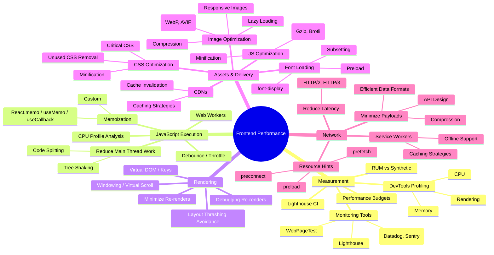

# Chapter 15: Deep Dive into Frontend Performance Optimization

In the realm of production-grade frontend systems, performance isn't merely a feature; it's a fundamental requirement. Slow, janky, or unresponsive applications lead to user frustration, abandonment, increased bounce rates, and ultimately, negative impacts on business goals. For large-scale applications serving a global audience, even minor performance regressions can have significant consequences.

This chapter delves deep into the multifaceted world of frontend performance optimization. We'll move beyond simplistic tips and explore the core principles, measurement techniques, and optimization strategies required to build and maintain high-performing, scalable frontend applications. Optimizing performance is an ongoing process, requiring a combination of careful measurement, targeted interventions, and architectural foresight.

> **Performance is User Experience:** A fast and responsive interface is often perceived as more intuitive, reliable, and trustworthy. Conversely, a slow application, regardless of its functional capabilities, delivers a poor user experience.

We will cover the critical areas impacting frontend performance: accurate measurement, JavaScript execution, rendering efficiency, asset delivery, and network interactions. Throughout this exploration, we'll emphasize practical techniques and production considerations.

## A. Measuring Performance Accurately

Before embarking on any optimization effort, it's crucial to establish a baseline and accurately measure performance. Optimizing without measurement is like navigating without a map – you might make changes, but you won't know if you're heading in the right direction or if your efforts are having the desired impact.

### 1. Browser DevTools Performance Profiling (CPU, Memory, Rendering)

Modern browser developer tools are indispensable for diagnosing performance issues locally. Key tabs include:

- **Performance Tab:** This is the workhorse for understanding runtime performance. You can record user interactions or page loads and get a detailed timeline breakdown, including:
  - **Main Thread Activity:** Shows JavaScript execution, style recalculations, layout, painting, and compositing. Long tasks (over 50ms) blocking the main thread are primary targets for optimization. Flame charts visualize call stacks and time spent in different functions.
  - **Network Requests:** Visualizes asset loading timelines.
  - **Frames:** Shows frame rendering times, helping identify dropped frames and jank.
  - **Timings:** Marks key metrics like First Contentful Paint (FCP), Largest Contentful Paint (LCP), and DOMContentLoaded.
- **Memory Tab:** Helps diagnose memory leaks or excessive memory consumption. You can take heap snapshots at different points in time and compare them to identify detached DOM nodes or objects that are not being garbage collected.
- **Rendering Tab (or Layers Tab/Performance Monitor in some browsers):** Provides insights into paint complexity, layout shifts, and layer management. Tools like "Paint Flashing" highlight areas being repainted, and "Layout Shift Regions" visualize Cumulative Layout Shift (CLS).

### 2. Real User Monitoring (RUM) vs. Synthetic Monitoring

While DevTools are great for local debugging, understanding performance for actual users in diverse network conditions and devices requires different approaches:

- **Synthetic Monitoring:** Involves running automated tests (scripts) from specific locations on controlled hardware and network conditions (e.g., using Lighthouse, WebPageTest).
  - **Pros:** Consistent, reproducible results; good for catching regressions in controlled environments; useful for pre-production testing.
  - **Cons:** Doesn't capture the full spectrum of real user experiences (varying devices, networks, locations, interactions); can be expensive to run frequently at scale.
- **Real User Monitoring (RUM):** Collects performance data directly from the browsers of actual users interacting with your application. Data is typically aggregated and sent back to a monitoring service.
  - **Pros:** Reflects actual user experience across diverse conditions; captures long-tail performance issues; provides insights into real-world usage patterns.
  - **Cons:** Data can be noisy; requires careful sampling and aggregation; less controlled environment makes pinpointing specific regressions harder; requires integrating a RUM agent into the application.

> **Best Practice:** Use a combination of both. Synthetic monitoring provides a stable baseline and regression testing, while RUM offers insights into the true perceived performance by your user base.

### 3. Performance Monitoring Tools (Lighthouse, WebPageTest, Datadog RUM, Sentry Performance)

Several excellent tools facilitate performance measurement:

- **Lighthouse:** An open-source, automated tool (available in Chrome DevTools, as a CLI, Node module, and web UI) for auditing web page quality. It provides scores for Performance, Accessibility, Best Practices, and SEO. The performance report highlights key metrics (LCP, TBT, CLS) and provides specific optimization opportunities.
- **WebPageTest:** A powerful, free web performance testing tool allowing tests from various locations, browsers, and network conditions. It provides detailed waterfall charts, optimization checks, filmstrip views, and video recordings of the page load. Ideal for deep dives and competitive analysis.
- **Commercial RUM Solutions (e.g., Datadog RUM, Dynatrace, New Relic Browser, Akamai mPulse):** These platforms offer sophisticated RUM capabilities, collecting detailed performance metrics (Core Web Vitals, custom timings), resource loading data, session replays, and error tracking from real users. They provide dashboards, alerting, and segmentation features.
- **Application Performance Monitoring (APM) with Frontend Capabilities (e.g., Sentry Performance, Elastic APM):** Often integrated with error tracking, these tools provide RUM features focusing on transaction tracing (mapping frontend actions to backend requests), Core Web Vitals, and identifying slow user interactions.

### 4. Setting Performance Budgets

A performance budget defines quantifiable limits for metrics that affect site performance. It's a commitment to staying fast. Budgets should be set early and enforced throughout the development lifecycle.

- **Why:** Prevents gradual performance degradation ("death by a thousand cuts") as new features are added. Aligns the team on performance goals.
- **What to Budget:**
  - **Metric-based:** Target values for Core Web Vitals (LCP < 2.5s, FID < 100ms / INP < 200ms, CLS < 0.1). Time To Interactive (TTI).
  - **Quantity-based:** Max JavaScript bundle size (e.g., < 170KB gzipped), max image weight, max number of requests.
  - **Rule-based:** Lighthouse score minimums (e.g., Performance score > 90).
- **How to Set:** Analyze competitor performance, consider target user devices/networks, use tools like Performance Budget Calculator. Start realistically and tighten budgets over time.
- **Enforcement:** Integrate budget checks into the CI/CD pipeline (e.g., using Lighthouse CI, bundlesize checks).

### 5. [Configuration Guide: Setting up Lighthouse CI]

Lighthouse CI automatically runs Lighthouse audits on commits or pull requests, preventing performance regressions from being merged.

**Steps:**

1.  **Install:** Add Lighthouse CI packages to your project:
    ```bash
    npm install -D @lhci/cli @lhci/server # Or yarn add -D ...
    ```
2.  **Configure:** Create an `lighthouserc.js` (or `.json`, `.yaml`) file in your project root:
    ```javascript
    // lighthouserc.js
    module.exports = {
      ci: {
        collect: {
          // Option 1: Statically build your site beforehand
          staticDistDir: "./dist", // Path to your build output directory
          // Option 2: Start a server and point LHCI to URLs
          // startServerCommand: 'npm run start', // Command to start your dev server
          // url: ['http://localhost:3000/', 'http://localhost:3000/about'],
          numberOfRuns: 3, // Run Lighthouse multiple times for stability
        },
        assert: {
          preset: "lighthouse:recommended", // Start with recommended assertions
          assertions: {
            // Override specific assertions
            "categories:performance": ["warn", { minScore: 0.9 }], // Warn if score < 90%
            "categories:accessibility": ["error", { minScore: 0.95 }], // Error if score < 95%
            "cumulative-layout-shift": ["warn", { maxNumericValue: 0.1 }],
            "mainthread-work-breakdown": ["warn", { maxNumericValue: 3000 }], // Max 3s main thread work
            "resource-summary:total:size": [
              "warn",
              { maxNumericValue: 500 * 1024 },
            ], // Max 500KB total size
            // Add assertions based on your performance budget
          },
        },
        upload: {
          target: "temporary-public-storage", // Easiest setup; or use 'lhci' server, 'filesystem'
          // For 'lhci' server target, you'll need server setup and a build token
        },
        server: {
          // Configuration if using the LHCI server for storing/comparing results
        },
      },
    };
    ```
3.  **Integrate into CI:** Add steps to your CI workflow (e.g., GitHub Actions, GitLab CI):

    - Build your application.
    - Run `lhci autorun` (this command runs collect, assert, and upload based on the config).
    - Fail the build if assertions fail (`lhci assert` returns non-zero exit code).

    **Example (GitHub Action snippet):**

    ```yaml
    name: Lighthouse CI

    on: [push]

    jobs:
      lhci:
        name: Lighthouse
        runs-on: ubuntu-latest
        steps:
          - uses: actions/checkout@v3
          - name: Use Node.js 18.x
            uses: actions/setup-node@v3
            with:
              node-version: 18.x
              cache: "npm" # or 'yarn'
          - name: npm install, build
            run: |
              npm install
              npm run build # Your build command
          - name: Run Lighthouse CI
            run: |
              npm install -g @lhci/cli@0.12.x # Install LHCI globally in the runner
              lhci autorun --config=./lighthouserc.js # Run LHCI using your config
            env:
              LHCI_GITHUB_APP_TOKEN: ${{ secrets.LHCI_GITHUB_APP_TOKEN }} # Optional: for status checks
    ```

4.  **Review Results:** Lighthouse CI will output results, upload reports (if configured), and potentially post status checks to pull requests, showing performance changes and budget adherence.

## B. Optimizing JavaScript Execution

JavaScript is often the primary driver of interactivity on the web, but it's also frequently the main bottleneck for performance, especially on lower-end devices. Excessive or inefficient JavaScript execution can block the main thread, leading to unresponsive UI, delayed interactions, and poor Core Web Vitals scores (like TBT and INP).

### 1. Reducing Main Thread Work

The browser's main thread handles JavaScript execution, rendering, layout, and user input processing. Keeping this thread free is paramount.

- **Code Splitting:** Break down large JavaScript bundles into smaller chunks loaded on demand (e.g., per route or feature). This reduces the initial script parsing, compilation, and execution time. Build tools like Webpack, Rollup, and Parcel offer built-in code splitting capabilities. (Covered in detail in Chapter 10: Build Systems).
- **Tree Shaking:** Eliminate unused code (dead code elimination) from your bundles during the build process. Ensure your codebase uses ES modules (`import`/`export`) effectively, as this is crucial for tree shaking to work.
- **Efficient Algorithms & Data Structures:** Analyze critical code paths. Sometimes, replacing an O(n^2) algorithm with an O(n log n) or O(n) alternative can yield significant performance gains, especially when dealing with large datasets.
- **Defer Non-Critical Execution:** Use techniques like `requestIdleCallback` to schedule non-essential tasks (e.g., analytics tracking, pre-caching) to run during periods when the main thread is idle.

### 2. Debouncing and Throttling Expensive Operations

Certain events (like `resize`, `scroll`, `mousemove`, or key presses in an input field) can fire very rapidly. If the event handler performs expensive operations (e.g., complex calculations, API calls), executing it on every event can overwhelm the main thread.

- **Debouncing:** Ensures a function is not called again until a certain amount of time has passed without it being called. Useful for delaying execution until an event stream has paused (e.g., waiting for the user to stop typing before triggering an autocomplete API call).
- **Throttling:** Ensures a function is called at most once within a specified time interval. Useful for rate-limiting execution during a continuous event stream (e.g., updating UI elements based on scroll position, but only every 200ms).

### 6. [Code Snippet: Implementing debouncing for search input]

```javascript
/**
 * Creates a debounced function that delays invoking func until after wait
 * milliseconds have elapsed since the last time the debounced function was invoked.
 * @param {Function} func The function to debounce.
 * @param {number} wait The number of milliseconds to delay.
 * @param {boolean} immediate Trigger the function on the leading edge instead of the trailing.
 * @returns {Function} Returns the new debounced function.
 */
function debounce(func, wait, immediate = false) {
  let timeout;

  return function executedFunction(...args) {
    const context = this;

    const later = function () {
      timeout = null;
      if (!immediate) func.apply(context, args);
    };

    const callNow = immediate && !timeout;
    clearTimeout(timeout);
    timeout = setTimeout(later, wait);

    if (callNow) func.apply(context, args);
  };
}

// --- Usage Example ---
const searchInput = document.getElementById("search-input");
const resultsContainer = document.getElementById("results");

// Function to fetch search results (simulated)
async function fetchSearchResults(query) {
  console.log(`Fetching results for: ${query}`);
  // In a real app, make an API call here
  await new Promise((resolve) => setTimeout(resolve, 500)); // Simulate network delay
  resultsContainer.innerHTML = `<li>Results for "${query}"</li>`;
}

// Create a debounced version of the fetch function
const debouncedFetchResults = debounce(fetchSearchResults, 300); // Wait 300ms after last keypress

searchInput.addEventListener("input", (event) => {
  const query = event.target.value.trim();
  if (query) {
    resultsContainer.innerHTML = "<li>Typing...</li>";
    debouncedFetchResults(query);
  } else {
    resultsContainer.innerHTML = "";
  }
});
```

This example prevents `fetchSearchResults` from being called on every keystroke, instead waiting until the user pauses typing for 300ms.

### 3. Web Workers for Off-Main-Thread Computation

Web Workers provide a mechanism to run scripts in background threads, separate from the main execution thread. This is ideal for offloading CPU-intensive tasks that would otherwise block the UI.

- **Use Cases:** Complex calculations (image processing, data analysis, cryptography), parsing large datasets, background synchronization.
- **Mechanism:** Communication between the main thread and workers happens via message passing (`postMessage` and `onmessage` event handlers). Data is copied, not shared directly (except for `SharedArrayBuffer` or transferable objects).
- **Limitations:** Workers don't have access to the DOM or many `window` object APIs. They are purely for computation.

**Example: Simple Web Worker**

```javascript
// main.js
const myWorker = new Worker("worker.js");

const dataToSend = { numbers: [1, 2, 3, 4, 5 /* ... large array */] };

myWorker.postMessage(dataToSend); // Send data to worker

myWorker.onmessage = function (e) {
  console.log("Message received from worker:", e.data.result);
  // Update UI with the result
};

myWorker.onerror = function (error) {
  console.error("Error from worker:", error.message);
};

// worker.js
self.onmessage = function (e) {
  console.log("Message received from main script");
  const data = e.data;
  const numbers = data.numbers;

  // Perform CPU-intensive task
  const sum = numbers.reduce((acc, val) => acc + val, 0);
  const result = `Sum calculated: ${sum}`;

  console.log("Posting message back to main script");
  self.postMessage({ result: result }); // Send result back
};
```

### 4. Memoization Techniques (React.memo, useMemo, useCallback, custom memoization)

Memoization is an optimization technique that caches the results of expensive function calls and returns the cached result when the same inputs occur again.

- **React.memo:** A higher-order component that memoizes functional components. It performs a shallow comparison of props and prevents re-rendering if props haven't changed. Useful for optimizing components that render often with the same props.
- **useMemo:** A React Hook that memoizes the result of a calculation. It recomputes the value only when one of its dependencies changes. Useful for expensive calculations within a component.
  ```javascript
  const expensiveValue = useMemo(() => {
    // Perform expensive calculation based on 'a' and 'b'
    return computeExpensiveValue(a, b);
  }, [a, b]); // Only recompute if 'a' or 'b' changes
  ```
- **useCallback:** A React Hook that memoizes a callback function instance. It returns the same function reference between renders as long as its dependencies haven't changed. Useful for passing callbacks to memoized child components (`React.memo`) to prevent unnecessary re-renders caused by new function instances on every parent render.

  ```javascript
  const handleClick = useCallback(() => {
    // Handle click using 'itemId'
    doSomething(itemId);
  }, [itemId]); // Only create a new function if 'itemId' changes

  return <MyMemoizedButton onClick={handleClick} />;
  ```

- **Custom Memoization:** For non-React JavaScript functions, you can implement memoization manually or use libraries like Lodash's `_.memoize`.

  ```javascript
  function memoize(fn) {
    const cache = {};
    return (...args) => {
      const key = JSON.stringify(args);
      if (cache[key]) {
        return cache[key];
      } else {
        const result = fn(...args);
        cache[key] = result;
        return result;
      }
    };
  }

  const slowFunction = (num) => {
    /* ... expensive calculation ... */ return num * 2;
  };
  const memoizedSlowFunction = memoize(slowFunction);

  console.log(memoizedSlowFunction(5)); // Calculates, caches, returns 10
  console.log(memoizedSlowFunction(5)); // Returns cached 10 directly
  ```

> **Caution:** Overuse of memoization can sometimes introduce more overhead (memory usage, dependency tracking complexity) than it saves. Profile first and apply memoization strategically to genuinely expensive operations or components suffering from unnecessary re-renders.

### 5. [Deep Dive: Analyzing CPU profiles to find bottlenecks]

Analyzing CPU profiles generated by browser DevTools (Performance tab) is key to pinpointing JavaScript bottlenecks.

1.  **Record a Profile:** Start recording in the Performance tab, perform the slow interaction in your app, and stop recording.
2.  **Identify Long Tasks:** Look for long, solid yellow bars in the "Main" thread timeline. These represent "Long Tasks" (>50ms) that block the main thread. Hover over them to see the duration.
3.  **Examine the Flame Chart:** Select a time range containing a long task. The "Bottom-Up" and "Call Tree" tabs are useful, but the **Flame Chart** provides a visual representation of the call stack over time.
    - **Width:** Wider blocks indicate functions that took longer to execute (including time spent in functions they called).
    - **Stacking:** Blocks stacked on top represent the call hierarchy (A calls B, B calls C).
    - **Focus:** Look for wide blocks at the top of the stack – these are the functions directly consuming significant time. Also, look for frequently called, moderately expensive functions that add up.
4.  **Analyze Specific Functions:** Click on a function block in the flame chart. The "Summary" tab shows details like "Self Time" (time spent directly in the function) and "Total Time" (time including called functions).
5.  **Correlate with Code:** Identify the source file and line number for bottleneck functions. Examine the code logic: Are there inefficient loops? Redundant calculations? Unnecessary DOM manipulations? Opportunities for memoization or offloading to a worker?
6.  **Iterate:** Implement optimizations based on your findings, re-record a profile, and verify the improvement. The goal is to break down long tasks into smaller ones (<50ms).

```mermaid
graph TD
    A[Start Recording Performance Profile] --> B(Perform Slow Interaction);
    B --> C(Stop Recording);
    C --> D{Examine Main Thread Timeline};
    D --> E[Identify Long Tasks (>50ms)];
    E --> F{Analyze Flame Chart};
    F --> G[Find Wide Blocks / High Total Time Functions];
    G --> H(Correlate with Source Code);
    H --> I(Identify Inefficiencies / Optimization Opportunities);
    I --> J(Implement Optimization);
    J --> K(Re-Record & Verify Improvement);
    K --> F;
    K --> L[Performance Goal Met];

    subgraph "Analysis Loop"
        F
        G
        H
        I
        J
        K
    end
```

_This diagram illustrates the iterative process of using CPU profiling to identify and fix JavaScript performance bottlenecks._

## C. Rendering Performance Optimization

How efficiently your application updates the UI in response to state changes or user interactions significantly impacts perceived performance. Sluggish rendering, dropped frames (jank), and unexpected layout shifts create a poor experience.

### 1. Virtual DOM Diffing Optimization (Key Prop Importance)

Frameworks like React, Vue, and Angular use a Virtual DOM (or similar abstraction) to minimize direct DOM manipulations. They create a virtual representation of the UI, compare it with the previous version when state changes ("diffing"), and then apply only the necessary changes to the actual DOM.

- **The `key` Prop:** When rendering lists of elements, providing a unique and stable `key` prop for each item is crucial. The key helps the diffing algorithm efficiently identify which items have been added, removed, or reordered, rather than assuming significant changes based on index shifts.
  - **Bad:** Using the array index as a key (`key={index}`). This can lead to incorrect component state, unnecessary DOM updates, and performance issues if items are added, removed, or reordered.
  - **Good:** Using a stable, unique identifier from your data (e.g., `item.id`) as the key (`key={item.id}`).

### 2. Minimizing Component Re-renders

Even with a Virtual DOM, unnecessary component re-renders consume CPU time and can lead to performance degradation, especially in complex applications.

- **`React.memo` / `PureComponent` / `shouldComponentUpdate`:** As discussed in the JS optimization section, these mechanisms prevent re-renders if props (and state for `PureComponent`/`shouldComponentUpdate`) haven't changed shallowly. Use them for components that are expensive to render or are frequently rendered with the same inputs.
- **Optimize Context API Usage:** When using React Context, be mindful that any component consuming the context will re-render whenever the _entire_ context value changes. Split contexts into smaller, more specific providers or use selectors (`useContextSelector` libraries) to subscribe components only to the slices of state they need.
- **State Colocation:** Keep state as close as possible to where it's used. Lifting state too high up the component tree can cause many intermediate components to re-render unnecessarily when that state changes.
- **Pass Primitive Props:** When possible, pass primitive values (strings, numbers) as props instead of objects or arrays if the child component only depends on those primitives. This makes shallow comparisons more effective.

### 3. Windowing / Virtual Scrolling for Large Lists

Rendering thousands of items in a list or grid simultaneously is highly inefficient. It creates a massive number of DOM nodes, consumes significant memory, and slows down initial rendering and subsequent updates.

- **Windowing (Virtual Scrolling):** This technique renders only the subset of items currently visible within the viewport (the "window"), plus a small buffer. As the user scrolls, previously visible items are removed from the DOM, and new items are rendered. This keeps the number of DOM nodes constant and low, regardless of the total list size.
- **Libraries:** Libraries like `react-window`, `react-virtualized`, or TanStack Virtual (`@tanstack/react-virtual`) provide robust implementations for virtual scrolling lists and grids.

### 5. [Practical Example: Implementing virtual scrolling with react-window or similar]

```jsx
import React from "react";
import { FixedSizeList as List } from "react-window";

// Assume 'items' is a large array of data objects, e.g., [{ id: 1, text: '...' }, ...]
const LargeListComponent = ({ items }) => {
  // Define the Row component that renders a single item
  // It receives 'index', 'style' props from react-window
  // 'style' MUST be applied to the outer element for positioning
  const Row = ({ index, style }) => (
    <div style={style} className="list-item">
      Item {items[index].id}: {items[index].text}
    </div>
  );

  return (
    <div className="list-container">
      {/*
        height: The total height of the visible list area
        itemCount: Total number of items in the list
        itemSize: The height of each individual item (must be constant for FixedSizeList)
        width: The width of the list container
      */}
      <List
        height={400} // Example height
        itemCount={items.length}
        itemSize={35} // Example item height
        width={"100%"}
      >
        {Row}
      </List>
    </div>
  );
};

// --- CSS ---
/*
.list-container {
  border: 1px solid #ccc;
  overflow: hidden; // Important for react-window
}

.list-item {
  border-bottom: 1px solid #eee;
  padding: 5px 10px;
  box-sizing: border-box; // Ensure padding doesn't break itemSize
  display: flex;
  align-items: center;
}
*/

export default LargeListComponent;
```

This example uses `react-window`'s `FixedSizeList` to efficiently render a potentially huge list by only mounting components for the visible rows.

### 4. Avoiding Layout Thrashing

Layout thrashing (also known as forced synchronous layout) occurs when JavaScript repeatedly writes, then reads, layout-sensitive properties from the DOM in quick succession within a single frame.

- **The Problem:** When you modify a style or class that affects layout (e.g., `width`, `height`, `top`, `margin`), the browser invalidates the current layout. If you then _immediately_ read a property that requires the layout to be calculated (e.g., `offsetHeight`, `offsetTop`, `getBoundingClientRect()`), the browser is forced to perform a synchronous layout calculation _right then and there_, potentially multiple times within a loop or single function execution. This is computationally expensive and blocks the main thread.
- **How to Avoid:**
  - **Batch Reads and Writes:** Structure your code to perform all DOM reads first, then perform all DOM writes.
  - **Use `requestAnimationFrame`:** If you need to perform animations or sequential read/write operations, schedule them using `requestAnimationFrame`. This ensures your code runs just before the browser's next repaint, allowing it to batch layout calculations more effectively.
  - **Be Mindful of Libraries:** Some third-party libraries might inadvertently cause layout thrashing. Profile interactions involving these libraries.
  - **CSS Containment:** Use the CSS `contain` property (e.g., `contain: layout size style;`) on components where possible to limit the scope of layout calculations.

**Example: Layout Thrashing vs. Optimized**

```javascript
// BAD: Layout Thrashing
function resizeElementsBad(elements) {
  elements.forEach((element) => {
    // WRITE: Change width (invalidates layout)
    element.style.width = element.offsetWidth / 2 + "px"; // READ: offsetWidth forces layout calculation HERE
    // Repaints and layout calculations happen inside the loop for each element!
  });
}

// GOOD: Batching Reads and Writes
function resizeElementsGood(elements) {
  // READ: Get all widths first
  const widths = Array.from(elements).map((el) => el.offsetWidth);

  // WRITE: Set all widths later
  elements.forEach((element, index) => {
    element.style.width = widths[index] / 2 + "px";
  });
  // Layout calculation happens only once (or fewer times) after the loop
}

// BETTER: Using requestAnimationFrame for animations/complex sequences
function animateWidth(element) {
  let currentWidth = element.offsetWidth; // Initial read

  function step() {
    currentWidth -= 1; // Calculate next state
    element.style.width = currentWidth + "px"; // Write

    if (currentWidth > 10) {
      requestAnimationFrame(step); // Schedule next step
    }
  }
  requestAnimationFrame(step); // Start the animation loop
}
```

### 6. [Troubleshooting Section: Debugging excessive component re-renders]

Identifying _why_ a component is re-rendering unnecessarily is crucial.

- **React DevTools Profiler:**
  1.  Open React DevTools in your browser.
  2.  Go to the "Profiler" tab.
  3.  Click "Record" and interact with the part of your application experiencing performance issues.
  4.  Stop recording.
  5.  Use the "Flamegraph" or "Ranked" chart to see which components rendered during the recording period and how long they took.
  6.  Select a specific commit (render update) in the timeline.
  7.  Select a component that rendered in that commit.
  8.  The right panel will show "Why did this render?" information if available (e.g., "Props changed: [propName]", "Hooks changed", "Parent component rendered"). This often pinpoints the cause.
- **`why-did-you-render` Library:** A popular library (`@welldone-software/why-did-you-render`) that monkey-patches React to log detailed information to the console about potentially avoidable re-renders, including specific prop changes. Requires setup in your application entry point.
- **Manual Logging:** In `useEffect` or component lifecycle methods (for class components), add `console.log` statements to track when a component renders and inspect the props/state values to see what changed. This is less sophisticated but can be helpful.
  ```jsx
  useEffect(() => {
    console.log(`MyComponent rendered. Props:`, props);
  }); // No dependency array, logs on every render
  ```

## D. Asset Optimization and Delivery

How efficiently you optimize and deliver static assets (images, fonts, CSS, JavaScript) has a massive impact on load performance (FCP, LCP) and overall bandwidth consumption.

### 1. Image Optimization (Formats: WebP, AVIF; Compression; Responsive Images)

Images often constitute the largest portion of a page's weight.

- **Modern Formats:** Use next-generation formats like **WebP** and **AVIF**. They offer significantly better compression than traditional JPEG and PNG formats at similar visual quality levels. Provide fallbacks using the `<picture>` element.
  ```html
  <picture>
    <source srcset="image.avif" type="image/avif" />
    <source srcset="image.webp" type="image/webp" />
    
  </picture>
  ```
- **Compression:** Apply both lossless (removing metadata, optimizing structure) and lossy (reducing quality slightly for significant size reduction) compression. Tools like `imagemin` (build-time) or services like Cloudinary, Akamai Image Manager (runtime/CDN) can automate this. Find the right balance between file size and visual quality.
- **Responsive Images:** Serve different image sizes based on the device's viewport width and pixel density. Use the `srcset` and `sizes` attributes on `` tags or the `<picture>` element. This prevents downloading unnecessarily large images on small screens.
  ```html
  
  alt="Description">
  ```
- **Lazy Loading:** Use the `loading="lazy"` attribute on `` and `<iframe>` tags for below-the-fold content. The browser will defer loading these resources until the user scrolls near them.

### 2. Font Loading Strategies

Web fonts add personality but can impact performance if not loaded carefully, potentially causing Flash of Unstyled Text (FOUT) or Flash of Invisible Text (FOIT).

- **`font-display` Property:** Use the CSS `font-display` descriptor within your `@font-face` rule.
  - `swap`: (Recommended) Shows fallback font immediately, then swaps to the web font once loaded. Minimizes blocking time but causes FOUT.
  - `block`: Short block period, then fallback (FOIT).
  - `fallback`: Very short block period, then fallback. If font doesn't load quickly, uses fallback permanently for that page view.
  - `optional`: Very short block period. If font isn't cached, uses fallback and doesn't attempt download. Good for non-essential fonts or slow connections.
  ```css
  @font-face {
    font-family: "MyCustomFont";
    src: url("/fonts/my-custom-font.woff2") format("woff2");
    font-weight: 400;
    font-style: normal;
    font-display: swap; /* Use fallback font immediately */
  }
  ```
- **Preload Critical Fonts:** If a specific web font is crucial for initial rendering (e.g., used in above-the-fold content), preload it using `<link rel="preload">`. This hints the browser to fetch the font earlier with higher priority.
  ```html
  <link
    rel="preload"
    href="/fonts/my-critical-font.woff2"
    as="font"
    type="font/woff2"
    crossorigin
  />
  ```
- **Subsetting:** Include only the characters (glyphs) needed for your site, significantly reducing font file size. Tools exist to subset fonts during the build process.
- **Use WOFF2:** The WOFF2 format offers the best compression for web fonts and is widely supported.

### 3. CSS Optimization (Minification, Critical CSS Extraction)

Optimize CSS delivery to ensure fast rendering and avoid render-blocking.

- **Minification:** Remove whitespace, comments, and unnecessary characters from CSS files during the build process. Tools like `cssnano` or build tool integrations handle this.
- **Critical CSS Extraction:** Identify the minimal CSS required to style the above-the-fold content and inline it directly in the `<head>` of the HTML document. Load the remaining CSS asynchronously (e.g., using `<link rel="stylesheet" ... media="print" onload="this.media='all'">` or JavaScript). This allows the browser to start rendering the visible part of the page much faster, improving FCP and LCP. Tools like `critical` can automate this extraction.
- **Remove Unused CSS:** Use tools like PurgeCSS during the build process to analyze your HTML/JS files and remove CSS rules that are not being used.
- **Optimize Selectors:** While less impactful than critical CSS or removing unused rules, overly complex CSS selectors can slightly increase style calculation time. Prefer simpler selectors where possible.

### 4. JavaScript Minification, Compression (Gzip, Brotli)

Similar to CSS, optimize JavaScript delivery.

- **Minification:** Remove whitespace, comments, shorten variable names, and perform other optimizations to reduce file size. Tools like Terser (commonly used with Webpack/Rollup) are standard.
- **Compression (Server-side):** Configure your web server or CDN to apply **Gzip** or, preferably, **Brotli** compression to text-based assets (JS, CSS, HTML, SVG, JSON). Brotli generally offers better compression ratios than Gzip. Ensure the `Content-Encoding` header is correctly set in responses.

### 5. Content Delivery Networks (CDNs): Caching Strategies

CDNs are essential for production applications serving a global audience. They cache static assets (JS, CSS, images, fonts) on servers geographically closer to users, reducing latency and offloading traffic from your origin server.

- **Benefits:** Reduced latency, increased availability, reduced origin server load, DDoS mitigation.
- **Caching Headers:** Control how browsers and CDNs cache assets using HTTP headers, primarily `Cache-Control`.
  - **Immutable Assets:** For assets with versioned filenames (e.g., `app.[contenthash].js`), use `Cache-Control: public, max-age=31536000, immutable`. This tells browsers/CDNs they can cache the file effectively forever, as the content will never change for that URL.
  - **Mutable Assets (e.g., `index.html`):** Use `Cache-Control: no-cache` (forces revalidation with the server) or a short `max-age` (e.g., `max-age=0`, `max-age=60`) combined with `ETag` or `Last-Modified` headers for validation. This ensures users get the latest HTML while still allowing conditional requests.
- **CDN Caching Strategy:** Configure your CDN's cache TTLs (Time To Live) appropriately. Leverage edge caching for static assets and potentially micro-caching for dynamic HTML if applicable.

### 6. [Configuration Guide: Setting up image optimization in the build process]

Using `imagemin` with Webpack (similar concepts apply to other bundlers):

1.  **Install:**
    ```bash
    npm install --save-dev imagemin imagemin-webpack-plugin imagemin-mozjpeg imagemin-pngquant imagemin-gifsicle imagemin-svgo imagemin-webp
    # Or yarn add -D ...
    ```
2.  **Configure Webpack:**

    ```javascript
    // webpack.config.js
    const ImageminPlugin = require("imagemin-webpack-plugin").default;
    const imageminMozjpeg = require("imagemin-mozjpeg");
    const imageminPngquant = require("imagemin-pngquant");
    const imageminWebp = require("imagemin-webp");
    const CopyWebpackPlugin = require("copy-webpack-plugin"); // To copy images

    module.exports = {
      // ... other webpack config
      plugins: [
        // Copy images from src to dist (adjust paths as needed)
        new CopyWebpackPlugin({
          patterns: [{ from: "src/assets/images", to: "assets/images" }],
        }),

        // Optimize images after they are copied
        new ImageminPlugin({
          test: /\.(jpe?g|png|gif|svg)$/i,
          // Disable during development for faster builds
          disable: process.env.NODE_ENV !== "production",
          plugins: [
            imageminMozjpeg({
              quality: 75, // Adjust quality vs size
              progressive: true,
            }),
            imageminPngquant({
              quality: [0.6, 0.8], // Min/max quality range
            }),
            // Optional: Convert to WebP
            imageminWebp({
              quality: 75,
            }),
            // Add imagemin-gifsicle, imagemin-svgo if needed
          ],
          // Optional: Configure WebP output location/naming if converting
          // filename: '[path][name].webp' // Outputs WebP alongside original
        }),
        // ... other plugins
      ],
    };
    ```

    - This setup copies images and then runs optimization plugins on them.
    - Adjust quality settings based on your needs.
    - Consider generating WebP/AVIF versions alongside originals and using `<picture>` in your HTML.

### 7. [Production Note: CDN cache invalidation strategies]

When you deploy new versions of assets, you need to ensure users get the updated files, not stale cached versions.

- **Versioned URLs / Fingerprinting:** (Best approach for JS/CSS/Images) Embed a content hash or version number in the filename (e.g., `app.a1b2c3d4.js`, `styles.v3.css`). When the file content changes, the hash changes, resulting in a new URL. Since the URL is different, browsers and CDNs will fetch the new version without needing explicit invalidation. Build tools automate this.
- **Purging/Invalidation API:** Most CDNs provide an API or UI to explicitly purge specific URLs or paths from their cache. This is necessary for files without versioned names (like `index.html` or images updated in place) or in emergency situations. Purging can take time to propagate across all CDN edge locations. Use it sparingly.
- **Short Cache TTLs:** For frequently changing, non-versioned files, use shorter `max-age` values in `Cache-Control` combined with validation headers (`ETag`, `Last-Modified`). This forces more frequent checks with the origin (or CDN edge if it has a validated copy), but ensures updates are picked up relatively quickly.

## E. Network Performance Optimization

Reducing the time spent fetching resources over the network is critical for fast load times and a responsive application, especially on mobile or unreliable connections.

### 1. Reducing Request Latency (HTTP/2, HTTP/3, Connection Pooling)

Latency (the time it takes for a request to travel to the server and back) is often a bigger bottleneck than bandwidth.

- **HTTP/2 and HTTP/3:** These newer versions of the HTTP protocol offer significant performance improvements over HTTP/1.1:
  - **Multiplexing (HTTP/2 & HTTP/3):** Allows multiple requests and responses to be sent concurrently over a single TCP connection (HTTP/2) or QUIC connection (HTTP/3), eliminating head-of-line blocking. This reduces the need for old hacks like domain sharding.
  - **Header Compression (HPACK/QPACK):** Reduces the overhead of HTTP headers.
  - **Server Push (HTTP/2 - Use with caution):** Allows servers to proactively send resources the client might need (though browser support and effectiveness vary).
  - **QUIC (HTTP/3):** Built on UDP, reduces connection establishment time (0-RTT or 1-RTT) and improves performance on lossy networks by avoiding TCP head-of-line blocking across streams.
  - **Action:** Ensure your hosting provider and CDN support and have enabled HTTP/2 or HTTP/3.
- **Connection Pooling:** Reusing existing TCP connections for multiple requests reduces the overhead of establishing new connections (TCP handshake, TLS negotiation). HTTP/1.1 uses `Keep-Alive`, while HTTP/2 and HTTP/3 handle this inherently via multiplexing over persistent connections.

### 2. Minimizing Request/Response Payloads

Reducing the amount of data transferred over the network directly improves load times, especially on slow or metered connections.

- **Compression:** As mentioned before, enable Gzip or Brotli compression on your server/CDN for text-based assets.
- **Asset Optimization:** Optimize images, minify JS/CSS, remove unused code (covered in Section D).
- **Efficient Data Formats:** For API responses, consider formats like Protocol Buffers (protobuf) or MessagePack as alternatives to JSON. They can be more compact and faster to parse, though they add complexity.
- **API Payload Shaping:** Design APIs to return only the data needed by the client for a specific view. Techniques like GraphQL allow clients to request exactly the fields they require, avoiding over-fetching. REST APIs can use query parameters (e.g., `?fields=id,name,price`) for partial responses.

### 3. Resource Hints (preload, prefetch, preconnect)

Resource hints allow you to give the browser information about resources that will be needed soon, enabling it to optimize fetching.

- **`<link rel="preload">`:** Tells the browser to fetch a resource with high priority because it's needed for the _current_ navigation (e.g., critical CSS, JS, fonts, LCP image). Use sparingly for essential resources. Requires `as` attribute specifying the resource type.
  ```html
  <link rel="preload" href="critical-script.js" as="script" />
  <link rel="preload" href="lcp-image.webp" as="image" />
  <link
    rel="preload"
    href="/fonts/critical-font.woff2"
    as="font"
    type="font/woff2"
    crossorigin
  />
  ```
- **`<link rel="prefetch">`:** Hints the browser that a resource might be needed for _future_ navigation (e.g., resources for the next likely page the user will visit). Fetched with low priority during browser idle time.
  ```html
  <link rel="prefetch" href="/next-page-bundle.js" as="script" />
  ```
- **`<link rel="preconnect">`:** Tells the browser to perform the connection handshake (DNS lookup, TCP handshake, TLS negotiation) with an origin from which you'll likely fetch resources soon, but without fetching a specific resource yet. Saves time when the actual request is made later. Useful for critical third-party origins (CDNs, API endpoints, font providers).
  ```html
  <link rel="preconnect" href="https://api.example.com" />
  <link rel="preconnect" href="https://fonts.gstatic.com" crossorigin />
  ```
- **`<link rel="dns-prefetch">`:** Only performs the DNS lookup for an origin. Lower overhead than `preconnect`, useful if you need to connect to many third-party domains. `preconnect` is generally preferred for critical origins.

### 4. Service Workers for Caching and Offline Support

Service Workers are JavaScript scripts that run in the background, separate from the web page, acting as programmable network proxies. They intercept network requests and can serve responses from a cache, enabling offline experiences and fine-grained caching strategies.

- **Caching Strategies:**
  - **Cache First:** Check the cache first. If a response is found, serve it. Otherwise, fetch from the network, cache the response, and then serve it. Good for static assets (app shell, versioned resources).
  - **Network First:** Try fetching from the network first. If successful, cache the response and serve it. If the network fails (offline), serve the response from the cache. Good for resources that update frequently (API data, non-versioned assets).
  - **Stale-While-Revalidate:** Serve response from the cache immediately (if available) for speed. Simultaneously, fetch an updated version from the network in the background and update the cache for the next request. Good balance for frequently updated resources where instant display is prioritized.
- **Offline Support:** By caching the application shell (HTML, CSS, JS) and potentially data, Service Workers can allow users to load and interact with the application even when offline.
- **Progressive Web Apps (PWAs):** Service Workers are a core technology enabling PWAs.

### 5. [Practical Example: Implementing a basic offline-capable PWA using Service Workers]

1.  **Create `service-worker.js` (in your project root or public folder):**

    ```javascript
    // service-worker.js
    const CACHE_NAME = "my-app-cache-v1";
    // List of URLs to cache initially (your app shell)
    const urlsToCache = [
      "/",
      "/index.html",
      "/styles/main.css",
      "/scripts/main.js",
      "/images/logo.png",
      // Add other essential assets for the app shell
    ];

    // Install event: Cache the app shell
    self.addEventListener("install", (event) => {
      console.log("Service Worker: Installing...");
      event.waitUntil(
        caches
          .open(CACHE_NAME)
          .then((cache) => {
            console.log("Service Worker: Caching app shell");
            return cache.addAll(urlsToCache);
          })
          .then(() => self.skipWaiting()) // Activate worker immediately
          .catch((error) => {
            console.error("Service Worker: Caching failed", error);
          })
      );
    });

    // Activate event: Clean up old caches
    self.addEventListener("activate", (event) => {
      console.log("Service Worker: Activating...");
      const cacheWhitelist = [CACHE_NAME]; // Only keep the current cache
      event.waitUntil(
        caches
          .keys()
          .then((cacheNames) => {
            return Promise.all(
              cacheNames.map((cacheName) => {
                if (cacheWhitelist.indexOf(cacheName) === -1) {
                  console.log("Service Worker: Deleting old cache", cacheName);
                  return caches.delete(cacheName);
                }
              })
            );
          })
          .then(() => self.clients.claim()) // Take control of clients immediately
      );
    });

    // Fetch event: Intercept network requests (Cache First strategy for this example)
    self.addEventListener("fetch", (event) => {
      // Let browser handle non-GET requests
      if (event.request.method !== "GET") {
        return;
      }

      // Ignore requests to Chrome extensions or other schemes
      if (!event.request.url.startsWith("http")) {
        return;
      }

      event.respondWith(
        caches.match(event.request).then((cachedResponse) => {
          // Cache hit - return response from cache
          if (cachedResponse) {
            // console.log('Service Worker: Serving from cache:', event.request.url);
            return cachedResponse;
          }

          // Not in cache - fetch from network, cache it, and return response
          // console.log('Service Worker: Fetching from network:', event.request.url);
          return fetch(event.request)
            .then((networkResponse) => {
              // Check if we received a valid response
              if (
                !networkResponse ||
                networkResponse.status !== 200 ||
                networkResponse.type !== "basic"
              ) {
                return networkResponse;
              }

              // IMPORTANT: Clone the response. A response is a stream
              // and because we want the browser to consume the response
              // as well as the cache consuming the response, we need
              // to clone it so we have two streams.
              const responseToCache = networkResponse.clone();

              caches.open(CACHE_NAME).then((cache) => {
                cache.put(event.request, responseToCache);
              });

              return networkResponse;
            })
            .catch((error) => {
              console.error(
                "Service Worker: Fetch failed; returning offline page instead.",
                error
              );
              // Optional: Return a fallback offline page if fetch fails
              // return caches.match('/offline.html');
            });
        })
      );
    });
    ```

2.  **Register the Service Worker in your main JavaScript file (`main.js` or similar):**
    ```javascript
    // main.js (or app entry point)
    if ("serviceWorker" in navigator) {
      window.addEventListener("load", () => {
        navigator.serviceWorker
          .register("/service-worker.js")
          .then((registration) => {
            console.log(
              "Service Worker registered successfully with scope: ",
              registration.scope
            );
          })
          .catch((error) => {
            console.error("Service Worker registration failed: ", error);
          });
      });
    }
    ```
3.  **Test:** Use Chrome DevTools (Application -> Service Workers) to inspect the lifecycle, test offline mode, and clear storage. Remember to update `CACHE_NAME` when you change cached assets.



_This mind map provides a high-level overview of the key areas covered in frontend performance optimization._

## Conclusion

Frontend performance optimization is a deep and critical discipline within frontend architecture. It's not a one-time task but an ongoing process of measurement, analysis, targeted optimization, and continuous monitoring. By understanding the bottlenecks across JavaScript execution, rendering, asset delivery, and network communication, and by applying the techniques discussed in this chapter, architects and developers can build applications that are not only functional and scalable but also fast, responsive, and delightful for users. Prioritizing performance from the outset and integrating it into the development lifecycle is essential for creating truly production-grade frontend systems.
