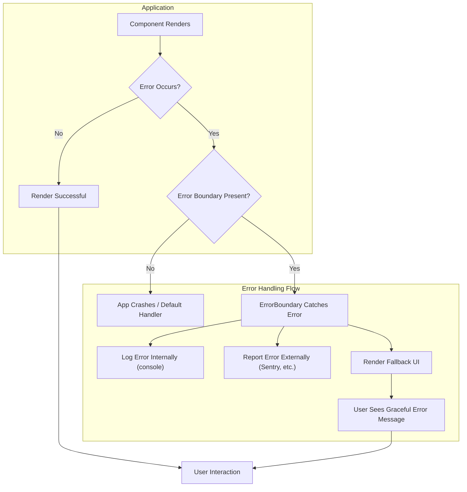
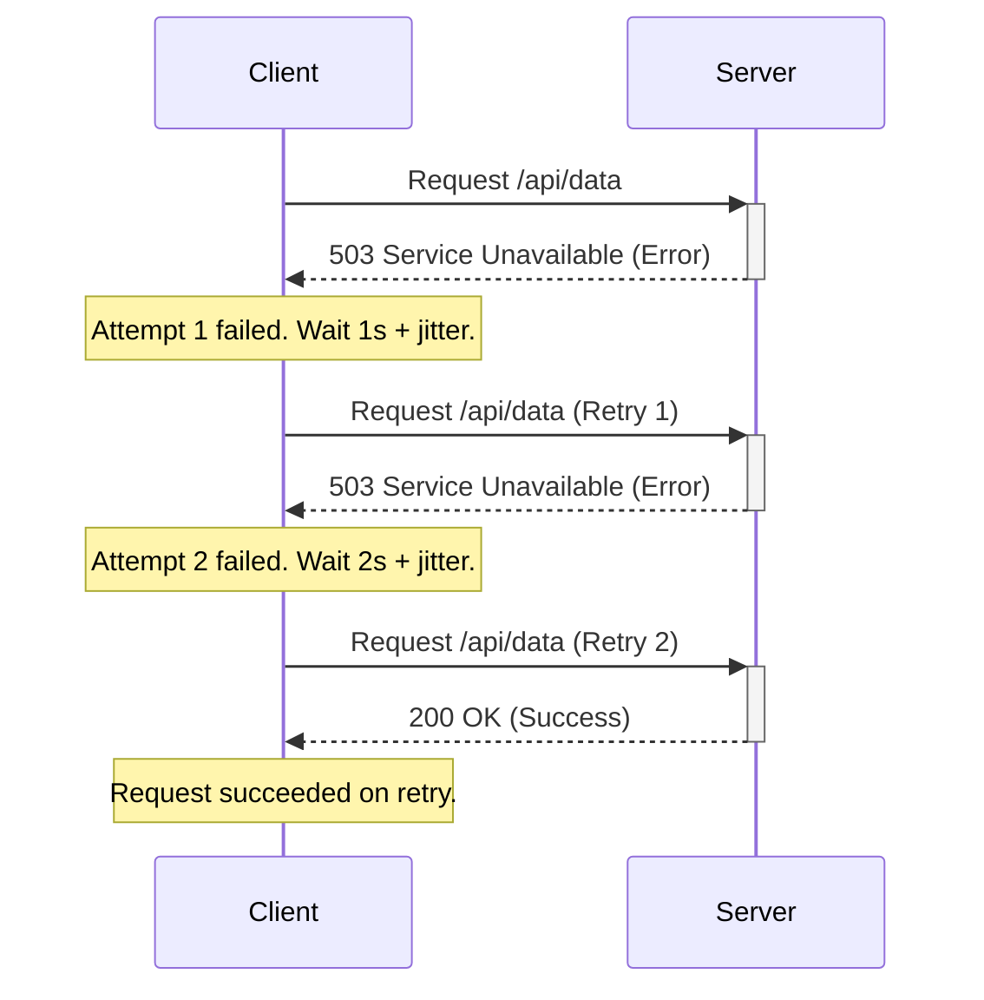

# Chapter 16: Building Resilient Frontend Applications

In the complex ecosystem of modern web development, where applications interact with numerous APIs, rely on fluctuating network conditions, and execute on diverse user devices, the concept of **resilience** is paramount. A resilient frontend application is not one that never encounters errors, but one that anticipates failures, handles them gracefully, and continues to provide the best possible user experience under adverse conditions. Building resilience isn't an afterthought; it's a fundamental architectural principle essential for creating production-grade, scalable systems that users can trust.

Failures in the frontend can manifest in myriad ways: APIs become unavailable, network connections drop, third-party scripts fail to load or execute correctly, unexpected data corrupts component state, or browser limitations hinder functionality. Without deliberate strategies to mitigate these issues, users face broken interfaces, lost data, and frustrating experiences, ultimately eroding confidence in the application and the business it represents.

This chapter delves into the core principles and practical techniques required to build robust and resilient frontend applications. We will explore how to design systems that can withstand common failure modes, implement effective error handling, manage network unreliability, ensure state management robustness, and safely integrate third-party dependencies. By embracing resilience engineering, we move beyond simply making things work in ideal conditions ("happy path") and focus on ensuring they don't catastrophically fail when conditions inevitably become less than ideal.

## A. Principles of Frontend Resilience

Building resilient frontends starts with adopting specific mindsets and foundational principles during the design and development process. These principles guide architectural decisions and coding practices to create applications capable of weathering unexpected storms.

### 1. Graceful Degradation vs. Progressive Enhancement

These two related but distinct philosophies are central to building resilient user experiences, particularly when dealing with varying browser capabilities or network conditions.

- **Graceful Degradation:** This approach starts with building the application assuming a modern, fully capable environment (latest browser, fast network). Then, layers of fallbacks are added to ensure the application remains functional, albeit potentially with reduced features, in less capable environments or when certain resources fail to load.

  > **Example:** A complex data visualization might rely on WebGL. With graceful degradation, if WebGL is unavailable, the application might fall back to rendering a simpler SVG or even a static image representation of the data, ensuring the core information is still accessible.

- **Progressive Enhancement:** This approach starts with a baseline of essential content and functionality that works universally across all browsers and network conditions. Then, layers of enhancements (more complex CSS, JavaScript interactions, advanced features) are added for browsers and environments that can support them. The core experience is always available.
  > **Example:** A form submission might initially work with a standard HTML form POST. JavaScript is then added progressively to provide client-side validation, asynchronous submission via AJAX for a smoother UX, and perhaps offline queuing if the network is down. If JavaScript fails or is disabled, the basic HTML form submission still works.

**Which to Choose?** Progressive enhancement is generally considered the more robust and accessible approach for the web. It prioritizes core content and functionality, ensuring universal access, and layers enhancements on top. Graceful degradation can sometimes lead to situations where the core experience is unintentionally broken in older environments if fallbacks aren't meticulously implemented and tested. However, for highly complex, feature-rich applications primarily targeting modern environments, a pragmatic approach often involves elements of both. The key is consciously deciding how the application should behave when certain capabilities are missing or fail.

### 2. Fault Tolerance: Handling API Failures and Network Issues

Frontend applications rarely exist in isolation. They depend heavily on backend APIs for data and functionality, and on the network for communication. Fault tolerance is the ability of the system to continue operating, possibly at a reduced level, rather than failing completely when one or more of its dependencies experience problems.

- **API Failures:** APIs can fail for numerous reasons: server downtime, deployment issues, rate limiting, invalid requests, unexpected data formats, or slow responses leading to timeouts. A resilient frontend must anticipate these possibilities.

  - **Detection:** Implement robust checks for HTTP status codes (e.g., `4xx`, `5xx` errors) and network errors (e.g., timeouts, DNS issues).
  - **Response:** Instead of crashing or showing cryptic error messages, provide clear user feedback (see Section B). Implement retry mechanisms where appropriate (see Section C). Consider serving cached/stale data if fresh data is unavailable but the application can still function.
  - **Isolation:** Ensure the failure of one optional API call (e.g., loading user recommendations) doesn't break core application functionality (e.g., viewing the main product).

- **Network Issues:** Users access applications from diverse network conditions – fast broadband, flaky mobile connections, or completely offline.
  - **Detection:** Use browser APIs (`navigator.onLine`) to detect online/offline status. However, be aware this is not always reliable (e.g., captive portals). A more robust check often involves periodically pinging a known endpoint.
  - **Response:** Notify the user about connectivity issues. Enable offline functionality using techniques like Service Workers and caching (see Section C). Queue actions performed offline for later synchronization.

### 3. Defensive Programming Techniques

Defensive programming is a practice where developers proactively anticipate potential problems and write code that guards against them. It assumes that inputs might be invalid, dependencies might fail, and unexpected states might occur.

- **Input Validation:** Never trust external inputs, whether from users, APIs, or third-party libraries. Validate data types, formats, ranges, and presence before processing. Use libraries like Zod, Yup, or io-ts for robust schema validation, especially at API boundaries.
- **Null/Undefined Checks:** Explicitly check for `null` or `undefined` values before accessing properties or calling methods on objects that might not exist, particularly with data fetched from APIs or derived from complex state transformations. Optional chaining (`?.`) and nullish coalescing (`??`) operators in JavaScript are invaluable tools here.
- **Boundary Conditions:** Pay close attention to edge cases and boundary conditions (e.g., empty arrays, zero values, maximum limits).
- **Assertions:** Use assertions during development and testing to verify assumptions about the state of the application or data. While often stripped in production builds for performance, they help catch logical errors early.
- **Immutability:** Favor immutable data structures where possible. This prevents accidental modification of state, making application logic easier to reason about and reducing a common source of bugs. Libraries like Immer can help manage immutable updates more ergonomically.
- **Type Safety:** Utilize TypeScript or Flow to catch type-related errors during development, significantly reducing runtime errors caused by incorrect data types.

> **Production Mindset:** Defensive programming isn't about writing paranoid code; it's about acknowledging the inherent unpredictability of external systems and user inputs and building safeguards to prevent common failure modes, leading to a more stable and reliable application.

## B. Robust Error Handling Strategies

Even with defensive programming, errors will inevitably occur. A resilient application needs comprehensive strategies for detecting, handling, reporting, and recovering from these errors gracefully.

### 1. Global Error Boundaries (React Error Boundaries, Vue errorHandler)

Frameworks often provide mechanisms to catch errors that occur anywhere within the component tree, preventing a single component error from crashing the entire application.

- **React Error Boundaries:** These are React components that implement `componentDidCatch(error, errorInfo)` or the static `getDerivedStateFromError(error)` lifecycle method. They catch JavaScript errors anywhere in their child component tree, log those errors, and display a fallback UI instead of the crashed component tree.
- **Vue `errorHandler`:** Vue provides a global `app.config.errorHandler` hook that can be configured to capture unhandled errors originating from within Vue components (including lifecycle hooks, event handlers, etc.). Similar to React Error Boundaries, this allows for centralized error logging and potentially displaying a global error message or fallback state.

These global handlers are crucial for catching _unexpected_ errors and preventing catastrophic UI failures. They act as a safety net.

### 2. Localized Error Handling within Components

While global boundaries catch uncaught errors, it's often better to handle _expected_ errors closer to where they occur. This allows for more context-specific feedback and recovery mechanisms.

- **`try...catch` Blocks:** Use standard JavaScript `try...catch` blocks within component logic (e.g., event handlers, effects) to handle errors from specific operations like API calls or complex computations.
- **Component State for Errors:** Components can maintain their own error state. If an operation within the component fails (e.g., fetching data specific to that component), update the component's state to reflect the error and render specific error UI within the component's boundaries (e.g., "Could not load user profile. [Retry]").

### 3. Handling Promise Rejections Gracefully

Asynchronous operations, especially API calls, heavily rely on Promises. Unhandled promise rejections can lead to uncaught errors that might crash the application or, worse, fail silently.

- **`.catch()` Method:** Always attach a `.catch()` handler to promise chains to handle potential rejections.
- **`async/await` with `try...catch`:** When using `async/await`, wrap `await` calls that might reject within `try...catch` blocks.

```javascript
// Using .catch()
fetch("/api/data")
  .then((response) => {
    if (!response.ok) {
      // Throw an error to be caught by .catch()
      throw new Error(`HTTP error! status: ${response.status}`);
    }
    return response.json();
  })
  .then((data) => {
    // Process data
  })
  .catch((error) => {
    console.error("API call failed:", error);
    // Update UI to show error
    showUserError("Failed to load data. Please try again.");
  });

// Using async/await
async function fetchData() {
  try {
    const response = await fetch("/api/data");
    if (!response.ok) {
      throw new Error(`HTTP error! status: ${response.status}`);
    }
    const data = await response.json();
    // Process data
  } catch (error) {
    console.error("API call failed:", error);
    // Update UI to show error
    showUserError("Failed to load data. Please try again.");
  }
}
```

### 4. User Feedback for Errors (Toast Notifications, Inline Messages)

How errors are communicated to the user is critical for resilience. Cryptic messages or silent failures lead to frustration.

- **Toast Notifications:** Suitable for non-critical errors or background operation failures (e.g., "Failed to sync settings"). They are less intrusive but should provide enough information or an action if needed.
- **Inline Messages:** Best for errors related to specific UI sections or forms (e.g., "Invalid email address" next to an input field, or "Could not load this section. [Retry]" within a component).
- **Modal Dialogs:** Use sparingly for critical errors that require immediate user attention or confirmation before proceeding.
- **Clear Language:** Avoid technical jargon. Explain what went wrong (briefly) and what the user can do (e.g., "Try again", "Contact support").
- **Error Codes/Identifiers:** Optionally include a unique error code or identifier that users can provide to support teams, facilitating faster debugging.

### 5. [Practical Example: Implementing a global error boundary with reporting]

Let's illustrate a React Error Boundary that not only displays a fallback UI but also reports the error to an external monitoring service (like Sentry, Datadog, etc.).

**Naive Approach (No Boundary):** An error in a deeply nested component crashes the entire application, showing a blank screen or React's default error overlay (in development).

**Production-Grade Approach:**

```jsx
// src/components/ErrorBoundary.jsx
import React, { Component } from 'react';
import * as Sentry from '@sentry/react'; // Example reporting service

class ErrorBoundary extends Component {
  constructor(props) {
    super(props);
    this.state = { hasError: false, errorId: null };
  }

  static getDerivedStateFromError(error) {
    // Update state so the next render will show the fallback UI.
    return { hasError: true };
  }

  componentDidCatch(error, errorInfo) {
    // You can also log the error to an error reporting service
    console.error("Uncaught error:", error, errorInfo);
    // Example: Reporting to Sentry
    Sentry.withScope(scope => {
      scope.setExtras(errorInfo);
      const errorId = Sentry.captureException(error);
      this.setState({ errorId }); // Store event ID for user reference
    });
  }

  render() {
    if (this.state.hasError) {
      // You can render any custom fallback UI
      return (
        <div style={{ padding: '20px', border: '1px solid red', margin: '10px' }}>
          <h2>Something went wrong.</h2>
          <p>We're sorry, but an unexpected error occurred. Our team has been notified.</p>
          <p>Please try refreshing the page. If the problem persists, contact support.</p>
          {this.state.errorId && (
            <p><small>Error ID: {this.state.errorId}</small></p>
          )}
          {/* Optionally provide a button to try reloading or resetting state */}
          <button onClick={() => window.location.reload()}>Refresh Page</button>
        </div>
      );
    }

    return this.props.children;
  }
}

export default ErrorBoundary;

// src/App.jsx (or relevant layout component)
import React from 'react';
import ErrorBoundary from './components/ErrorBoundary';
import MyRoutes from './MyRoutes'; // Component containing the rest of the app

function App() {
  return (
    <ErrorBoundary>
      {/* Wrap the core application parts */}
      <MyRoutes />
    </ErrorBoundary>
  );
}

export default App;
```

This boundary ensures that even if `MyRoutes` or any component within it throws an unhandled error, the user sees a helpful message instead of a crash, and the error details are automatically sent for analysis.



_Diagram Explanation:_ This flowchart illustrates the error handling process. If an error occurs during rendering, an Error Boundary intercepts it, logs/reports it, and displays a fallback UI, preventing a full application crash.

## C. Designing for Network Unreliability

The network is inherently unreliable. Applications must be designed with the expectation that connections can be slow, intermittent, or completely unavailable.

### 1. Offline Detection and User Notification

Detecting when the application goes offline or comes back online allows for tailored user experiences.

- **`navigator.onLine`:** Provides a quick boolean check. Useful but not foolproof (e.g., connected to WiFi but no internet access).
- **Event Listeners:** Use `window.addEventListener('online', ...)` and `window.addEventListener('offline', ...)` to react to changes detected by the browser.
- **Heartbeat/Ping:** A more reliable method involves periodically attempting a small network request (e.g., a `HEAD` request to `/healthcheck` or a known small resource). Failure indicates likely offline status.
- **User Notification:** When offline status is detected, inform the user clearly (e.g., a banner, toast). Indicate which features might be unavailable or operating in a limited mode. When connectivity is restored, notify the user and potentially trigger queued actions.

### 2. Caching Strategies for Offline Access (Service Workers)

Service Workers are essential for robust offline experiences. They act as programmable network proxies, allowing you to intercept network requests and decide how to respond – serving from cache, fetching from the network, or generating a custom response.

- **Cache API:** Service Workers use the Cache API to store network responses (HTML, CSS, JS, images, API data).
- **Caching Strategies:**
  - **Cache First:** Serve from cache first. If not found, fetch from the network and cache the response. Ideal for static assets (app shell).
  - **Network First:** Try fetching from the network first. If successful, cache the response. If network fails, serve from cache. Good for frequently updated data where freshness is preferred but offline fallback is needed.
  - **Stale-While-Revalidate:** Serve from cache immediately (for speed). Simultaneously, fetch from the network in the background to update the cache for the next request. Balances speed and freshness.
  - **Cache Only:** Only serve from cache. Useful for resources that should already be cached during installation.
  - **Network Only:** Bypass the cache entirely. For non-essential requests or things that must be live.
- **Implementation:** Libraries like Workbox simplify Service Worker implementation and caching strategies.

### 3. Request Retries with Exponential Backoff

When API requests fail due to transient network issues or temporary server problems (e.g., `503 Service Unavailable`, network timeout), automatically retrying the request can often resolve the issue without user intervention.

- **Retry Logic:** Implement logic that re-attempts a failed request a limited number of times.
- **Exponential Backoff:** Don't retry immediately. Increase the delay between retries exponentially (e.g., 1s, 2s, 4s, 8s...). This prevents overwhelming a struggling server and avoids rapid-fire retries during persistent network outages.
- **Jitter:** Add a small random amount of time to the backoff delay. This helps prevent multiple clients from retrying simultaneously (thundering herd problem) after a widespread but temporary outage.
- **Idempotency:** Only retry requests that are idempotent (safe to execute multiple times), primarily `GET`, `HEAD`, `OPTIONS`, `PUT`, `DELETE`. Be cautious retrying `POST` requests unless the backend is designed to handle duplicate submissions safely.

### 4. Optimistic UI Updates (with rollback mechanisms)

For actions that are likely to succeed quickly (e.g., marking an item as read, liking a post), you can update the UI _immediately_ as if the action was successful, _before_ receiving confirmation from the server. This makes the application feel much faster and more responsive.

- **Implementation:**
  1.  User performs an action.
  2.  Update the UI state locally _immediately_.
  3.  Initiate the API request to persist the change.
  4.  **If the API call succeeds:** Do nothing (or update local state with server-confirmed data if necessary).
  5.  **If the API call fails:**
      - **Rollback:** Revert the UI state to its previous condition.
      - **Notify User:** Inform the user that the action failed (e.g., "Couldn't like post. Please try again.").
- **Complexity:** Optimistic updates add complexity, especially managing the potential rollback state and handling sequences of actions. Use them judiciously for actions where the perceived performance benefit outweighs the implementation cost and the failure rate is expected to be low.

### 5. [Code Snippet: Implementing retry logic for API calls]

Here's a conceptual example of a fetch wrapper implementing retries with exponential backoff and jitter.

```javascript
async function fetchWithRetry(
  url,
  options = {},
  retries = 3,
  initialDelay = 1000
) {
  let delay = initialDelay;

  for (let i = 0; i < retries; i++) {
    try {
      const response = await fetch(url, options);
      // Only retry on specific network errors or server errors (e.g., 5xx)
      // Success (2xx) or client errors (4xx) usually shouldn't be retried automatically.
      if (response.ok) {
        return response; // Success!
      }
      // Decide if the status code warrants a retry
      if (response.status >= 500 && response.status <= 599) {
        console.warn(
          `Attempt ${i + 1} failed with status ${
            response.status
          }. Retrying in ${delay}ms...`
        );
        // Throw an error to trigger the catch block for retry logic
        throw new Error(`Server error: ${response.status}`);
      } else {
        // Don't retry on client errors (4xx) or other non-transient issues
        return response; // Return the error response
      }
    } catch (error) {
      // Catch network errors (e.g., fetch failed to connect) or errors thrown above
      console.warn(
        `Attempt ${i + 1} failed: ${error.message}. Retrying in ${delay}ms...`
      );
      if (i === retries - 1) {
        // Last attempt failed, re-throw the error
        throw error;
      }
    }

    // Wait for the delay period with jitter
    const jitter = delay * 0.1 * Math.random(); // Add up to 10% jitter
    await new Promise((resolve) => setTimeout(resolve, delay + jitter));

    // Increase delay for the next retry (exponential backoff)
    delay *= 2;
  }
  // Should not be reached if retries > 0, but satisfies TS/linting
  throw new Error("Retry logic failed unexpectedly.");
}

// Usage:
async function getData() {
  try {
    const response = await fetchWithRetry("/api/critical-data");
    if (!response.ok) {
      // Handle final non-retryable error (e.g. 404) or retry exhaustion
      throw new Error(`Failed to fetch data after retries: ${response.status}`);
    }
    const data = await response.json();
    console.log("Data fetched successfully:", data);
    // Process data
  } catch (error) {
    console.error("Failed to fetch data:", error);
    // Show error to user
  }
}

getData();
```



_Diagram Explanation:_ This sequence diagram shows a client attempting an API request that initially fails with a server error. The client waits using exponential backoff and jitter before retrying, eventually succeeding on the third attempt.

## D. State Management Resilience

Application state is volatile. Browser refreshes, crashes, or unexpected errors during state updates can lead to data loss or inconsistent UI. Resilient state management ensures state integrity and persistence where appropriate.

### 1. Persisting State Across Sessions (LocalStorage, IndexedDB)

For state that should survive browser refreshes or closing/reopening the tab/browser, persistence mechanisms are needed.

- **`localStorage`:** Simple key-value store. Easy to use for small amounts of string data (e.g., user preferences, JWT tokens). Synchronous API (can block the main thread if overused or with large data). Limited storage capacity (typically 5-10MB).
- **`sessionStorage`:** Similar to `localStorage` but persists only for the duration of the browser session (until the tab/window is closed).
- **`IndexedDB`:** A more powerful, asynchronous, transactional database system in the browser. Suitable for larger amounts of structured data, complex querying, and offline data storage. Steeper learning curve than `localStorage`. Libraries like `Dexie.js` can simplify its usage.
- **When to Persist:** Persist user settings, partially filled forms, application state that enables resuming a task, or offline data. Avoid persisting sensitive information directly unless adequately secured. Be mindful of storage limits and performance implications.

### 2. Handling State Hydration Errors (SSR/SSG)

In applications using Server-Side Rendering (SSR) or Static Site Generation (SSG), the initial HTML is rendered on the server, and the frontend JavaScript then "hydrates" this static markup, attaching event listeners and making it interactive. Mismatches between the server-rendered content and the initial client-side render can cause hydration errors.

- **Causes:** Differences in data fetching results, timestamp discrepancies, code execution differences (e.g., `window` access on server), conditional rendering based on environment.
- **Detection:** Frameworks like React and Next.js often provide warnings or errors in the console when hydration mismatches occur.
- **Mitigation:**
  - Ensure data fetching logic behaves consistently on server and client.
  - Delay rendering of problematic components until client-side mount (using `useEffect` or similar lifecycle hooks).
  - Use dynamic imports (`import()`) with `ssr: false` options where available (e.g., in Next.js).
  - Carefully manage state that influences initial render (e.g., timestamps, random numbers, browser-specific APIs).
  - Validate and potentially sanitize server-provided state before hydrating on the client.

### 3. Resetting State After Critical Errors

Sometimes, an error might leave the application state in an irrecoverable or inconsistent condition. In such cases, attempting to continue might lead to further errors or incorrect behavior.

- **Identify Critical Errors:** Determine which errors signify potentially corrupted state (e.g., failure during a critical multi-step process, invalid data received from a core API).
- **Reset Mechanism:** Provide a way, often triggered by a global error handler or a specific user action (like a "Reset Application" button in the error boundary), to reset the application state to a known good default. This might involve:
  - Clearing relevant parts of the state management store (Redux, Zustand, Vuex, etc.).
  - Clearing persisted state (`localStorage`, `IndexedDB`).
  - Forcing a full page reload (`window.location.reload()`).
- **User Experience:** Clearly communicate that a reset is happening or necessary, explaining (briefly) why.

### 4. [Production Note: Data validation before persisting/restoring state]

> **Production Note:** Never blindly trust data being read from `localStorage` or `IndexedDB`, nor data being used for hydration. Data formats might change between application versions, storage might be manually tampered with, or data might become corrupted.
>
> **Always validate data** read from persistence layers or received for hydration against an expected schema (using tools like Zod, Yup, io-ts) before merging it into your application state. If validation fails, discard the invalid persisted data and fall back to default state, logging the error for debugging. This prevents corrupted stored data from crashing the application on startup or hydration.

```typescript
// Example using Zod for validation
import { z } from "zod";
import { userPreferencesStore } from "./stateStore"; // Your state management logic

const UserPreferencesSchema = z.object({
  theme: z.enum(["light", "dark"]),
  notificationsEnabled: z.boolean(),
  lastVisited: z.string().optional(), // Allow optional for backward compatibility
});

function loadUserPreferences() {
  try {
    const storedPrefs = localStorage.getItem("userPreferences");
    if (!storedPrefs) {
      userPreferencesStore.resetToDefaults();
      return;
    }

    const parsedPrefs = JSON.parse(storedPrefs);
    const validationResult = UserPreferencesSchema.safeParse(parsedPrefs);

    if (validationResult.success) {
      userPreferencesStore.setPreferences(validationResult.data);
    } else {
      console.warn(
        "Invalid preferences found in localStorage. Resetting.",
        validationResult.error
      );
      localStorage.removeItem("userPreferences"); // Clear invalid data
      userPreferencesStore.resetToDefaults();
      // Optionally report this validation failure
      reportError("LocalStorage Validation Failed", {
        error: validationResult.error,
      });
    }
  } catch (error) {
    console.error("Failed to load or parse preferences:", error);
    localStorage.removeItem("userPreferences"); // Clear potentially corrupt data
    userPreferencesStore.resetToDefaults();
    reportError("LocalStorage Load/Parse Failed", { error });
  }
}

// Call this function early in your application startup
loadUserPreferences();
```

## E. Third-Party Script Resilience

Modern frontends often integrate numerous third-party scripts for analytics, advertising, customer support widgets, A/B testing, tag managers, and more. While providing valuable functionality, these scripts introduce significant risks to performance and reliability.

### 1. Impact of Third-Party Scripts on Performance and Reliability

- **Performance:** Third-party scripts add network requests, increase JavaScript execution time, and can block rendering or main thread activity, negatively impacting Core Web Vitals (LCP, FID/INP, CLS).
- **Reliability:**
  - **Single Point of Failure (SPOF):** If a critical third-party script fails to load or contains errors, it can block page rendering or break core application functionality.
  - **Security:** Malicious or compromised scripts can lead to data breaches or unwanted behavior (see Chapter 17: Frontend Security Best Practices).
  - **Unpredictability:** Third-party vendors can update their scripts without notice, potentially introducing bugs or performance regressions.

### 2. Asynchronous Loading and Deferred Execution

Never load third-party scripts synchronously in the `<head>` of your HTML unless absolutely necessary (which is rare). Synchronous loading blocks HTML parsing and rendering.

- **`async` Attribute:** `<script async src="...">` allows the script to be downloaded in parallel with HTML parsing and executed as soon as it's downloaded, potentially interrupting parsing. Order of execution is not guaranteed for multiple async scripts. Good for independent scripts like analytics.
- **`defer` Attribute:** `<script defer src="...">` allows the script to be downloaded in parallel, but execution is deferred until _after_ the HTML parsing is complete, just before the `DOMContentLoaded` event. Scripts with `defer` execute in the order they appear in the HTML. Generally preferred for scripts that need the DOM or depend on execution order.
- **Dynamic Injection:** Load scripts programmatically using JavaScript after the initial page load, often triggered by user interaction or specific conditions. This provides the most control but requires careful implementation.

### 3. Sandboxing and Subresource Integrity (SRI)

- **Sandboxing (Iframes):** For widgets or components where isolation is critical, consider loading the third-party content within an `<iframe>` with the `sandbox` attribute configured to restrict its capabilities (e.g., preventing script execution, form submission, top-level navigation).
- **Subresource Integrity (SRI):** This security feature allows browsers to verify that fetched resources (like scripts or stylesheets) are delivered without unexpected manipulation. It works by adding a cryptographic hash of the expected resource content to the `<script>` or `<link>` tag. If the downloaded file's hash doesn't match the provided hash, the browser refuses to execute/apply it.
  ```html
  <script
    src="https://third-party.com/library.js"
    integrity="sha384-oqVuAfXRKap7fdgcCY5uykM6+R9GqQ8K/uxy9rx7HNQlGYl1kPzQho1wx4JwY8wC"
    crossorigin="anonymous"
  ></script>
  ```
  **Caveat:** SRI only works if the third-party provider supplies static file versions with stable hashes. It doesn't work well with scripts that are frequently updated in-place under the same URL or dynamically generated.

### 4. Monitoring Third-Party Script Failures

Since third-party scripts operate outside your direct control, monitoring their behavior is crucial.

- **Performance Monitoring Tools:** Use tools (like Datadog Real User Monitoring, Sentry Performance, Google's CrUX/PageSpeed Insights) to identify slow-loading or long-running third-party scripts.
- **Error Reporting Services:** Configure your error reporting service (Sentry, Datadog, etc.) to capture errors originating from third-party domains (often requires CORS headers and specific configuration).
- **`window.onerror` / Global Handlers:** Ensure your global error handlers can catch errors thrown by third-party scripts, potentially logging them with context about which script failed.
- **Network Error Logging:** Monitor failed network requests for third-party resources.

### 5. [Practical Example: Safely integrating a third-party analytics script]

**Naive Approach:** Placing `<script src="https://analytics.example.com/tracker.js"></script>` directly in the `<head>`. This blocks rendering and is a SPOF.

**Production-Grade Approach:**

```html
<!DOCTYPE html>
<html>
  <head>
    <title>My Resilient App</title>
    <!-- Load critical CSS first -->
    <link rel="stylesheet" href="/styles/main.css" />

    <!-- Load analytics script asynchronously with SRI -->
    <!-- Obtain the correct hash from the provider -->
    <script
      async
      src="https://analytics.example.com/tracker.js"
      integrity="sha384-SOME_VALID_HASH_PROVIDED_BY_VENDOR"
      crossorigin="anonymous"
      onerror="handleAnalyticsLoadError(this)"
    ></script>

    <!-- Defer non-critical scripts that need the DOM -->
    <script defer src="/js/app-enhancements.js"></script>
  </head>
  <body>
    <!-- App content -->
    <div id="root"></div>

    <!-- Main application bundle -->
    <script defer src="/js/main.bundle.js"></script>

    <script>
      // Basic inline error handler for the analytics script load failure
      function handleAnalyticsLoadError(scriptElement) {
        console.warn(
          `Failed to load or execute analytics script: ${scriptElement.src}`
        );
        // Optionally report this failure to your own monitoring
        // reportInternalError('Analytics Load Failed', { src: scriptElement.src });

        // Ensure the rest of the app isn't blocked or dependent on this script
        // For example, define dummy analytics functions if the real ones didn't load
        window.trackEvent =
          window.trackEvent ||
          function () {
            console.log("Analytics unavailable, event not tracked.");
          };
      }

      // Initialize dummy functions immediately in case script fails or loads late
      window.trackEvent =
        window.trackEvent ||
        function () {
          console.log("Analytics not yet loaded...");
        };
    </script>
  </body>
</html>
```

**Explanation:**

1.  **`async`:** Prevents the script from blocking HTML parsing.
2.  **`integrity` & `crossorigin`:** Uses SRI to ensure the script hasn't been tampered with. The browser won't execute it if the hash doesn't match. `crossorigin="anonymous"` is required for SRI validation of cross-origin resources.
3.  **`onerror`:** A basic inline handler catches network errors during script loading or execution errors blocked by SRI failure. It logs a warning and could report the issue.
4.  **Dummy Functions:** Defining dummy `window.trackEvent` ensures that calls to the analytics function elsewhere in the code won't cause errors if the script fails to load or hasn't loaded yet. This decouples the application logic from the successful loading of the third-party script.

## Conclusion

Building resilient frontend applications is not a luxury but a necessity for delivering professional, production-grade user experiences. It requires a shift in mindset from merely implementing features to proactively anticipating and mitigating potential failures.

By embracing principles like progressive enhancement and fault tolerance, implementing robust error handling at both global and local levels, designing for network unreliability with caching and retries, ensuring state management integrity, and carefully managing the risks associated with third-party scripts, we create applications that are more stable, trustworthy, and usable under a wider range of conditions.

Resilience engineering is an ongoing process, involving careful design, defensive coding, thorough testing (covered in Chapter 18), and continuous monitoring (covered in Chapter 20). While it demands upfront investment, the payoff in reduced user frustration, fewer support incidents, increased user retention, and greater confidence in the application makes it an essential discipline for any team building scalable and reliable frontend systems.
