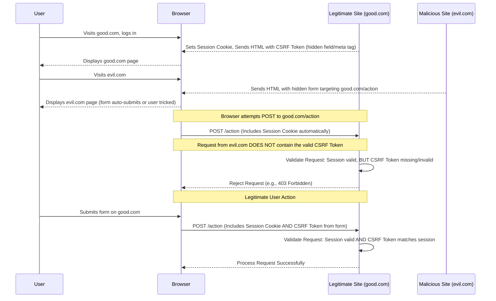
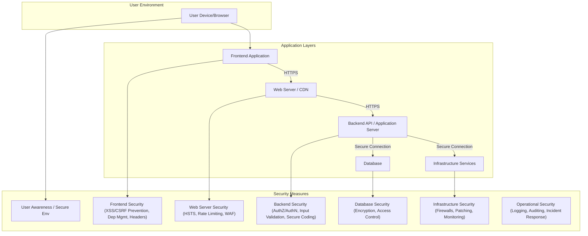

# Chapter 17: Frontend Security Best Practices

## Introduction: The Frontend as the First Line of Defense

While backend systems often handle the core logic and data storage, the frontend application, running directly in the user's potentially hostile browser environment, serves as the primary interface and a critical attack surface. Neglecting frontend security can lead to compromised user accounts, data breaches, application defacement, and loss of user trust. In production-grade, scalable systems, frontend security is not an afterthought but a fundamental requirement woven into the development lifecycle.

Security is a layered concern, involving infrastructure, backend services, and frontend code. However, the frontend developer plays a crucial role in mitigating specific threats that originate or manifest in the browser. This chapter delves into the most common frontend vulnerabilities and provides practical, actionable best practices for building secure, resilient user interfaces. We will explore how to defend against attacks like Cross-Site Scripting (XSS) and Cross-Site Request Forgery (CSRF), secure authentication mechanisms, manage dependencies safely, and leverage browser security features effectively.

Understanding and implementing these practices is essential for any team building applications intended for real-world use, especially those operating at scale where the impact of a security breach can be significantly amplified.

## A. Understanding Common Frontend Vulnerabilities

Before diving into prevention, it's crucial to understand the threats. Attackers constantly probe web applications for weaknesses, and the frontend presents unique opportunities.

### 1. Cross-Site Scripting (XSS)

XSS remains one of the most prevalent web application vulnerabilities. It occurs when an attacker injects malicious scripts into content that is then delivered to and executed by an unsuspecting user's browser. The goal is typically to steal sensitive information (like session tokens stored in cookies or local storage), manipulate the page content, or perform actions on behalf of the user.

> **Definition: Cross-Site Scripting (XSS)**
> An attack where malicious scripts are injected into otherwise benign and trusted websites. XSS attacks occur when an application includes untrusted data in a page sent to the browser without proper validation or escaping, or updates the DOM with user-supplied data using unsafe JavaScript APIs.

There are three main types of XSS:

- **Reflected XSS:** The malicious script is embedded in a URL or form data sent to the server. The server _reflects_ this script back in the HTTP response (e.g., in search results or error messages). When the user clicks the crafted link or submits the form, the script executes in their browser. This usually requires social engineering (e.g., phishing) to get the user to click the malicious link.
- **Stored (or Persistent) XSS:** The malicious script is permanently stored on the target server (e.g., in a database, message forum, comment field). When any user browses the page containing this stored script, it executes in their browser. This is often more dangerous as it doesn't require direct user interaction with a malicious link.
- **DOM-based XSS:** The vulnerability exists entirely within the client-side code. Untrusted data is read from the DOM (e.g., `location.hash` or `document.referrer`) and then passed to unsafe JavaScript APIs like `innerHTML`, `document.write()`, or `eval()`, causing script execution. The server is not directly involved in the reflection or storage of the script.

### 2. Cross-Site Request Forgery (CSRF)

CSRF tricks a logged-in user's browser into sending a forged HTTP request, including the user's session cookie and any other automatically included authentication information, to a vulnerable web application. This allows the attacker to perform actions on behalf of the victim (e.g., changing their email address, transferring funds, posting content).

> **Definition: Cross-Site Request Forgery (CSRF)**
> An attack that forces an end user to execute unwanted actions on a web application in which they're currently authenticated. CSRF attacks target state-changing requests, not data theft (since the attacker cannot see the response to the forged request).

**Example: Naive CSRF Scenario**
Imagine a user is logged into `mybank.com`. They then visit a malicious site, `evil.com`. `evil.com` contains a hidden form:

```html
<form action="https://mybank.com/transfer" method="POST" id="csrf-form">
  <input type="hidden" name="toAccount" value="attackerAccount" />
  <input type="hidden" name="amount" value="1000" />
</form>
<script>
  document.getElementById("csrf-form").submit();
</script>
```

When the user visits `evil.com`, their browser automatically submits this form to `mybank.com`. Since the user is logged in, their browser automatically includes their session cookie with the request. If `mybank.com` isn't protected against CSRF, it processes the transfer as if the user initiated it legitimately.

### 3. Insecure Direct Object References (IDOR) - Frontend Implications

While IDOR is primarily a backend authorization flaw (failing to check if the _current user_ is authorized to access the requested _object_), the frontend can contribute to or expose these vulnerabilities.

> **Definition: Insecure Direct Object References (IDOR)**
> Occurs when an application provides direct access to objects based on user-supplied input. More broadly, it represents cases where authorization checks are missing or flawed.

**Frontend Implications:**

- **Predictable Resource URLs:** Using sequential or easily guessable IDs in URLs (e.g., `/user/123/profile`, `/order/456/details`). If the backend lacks proper authorization checks, an attacker can simply change the ID in the URL (`/user/124/profile`) to access other users' data. The frontend design makes enumeration easy.
- **Exposing Internal IDs:** Sending internal database IDs to the client, which are then used in subsequent API requests. This exposes implementation details and provides attackers with direct identifiers to target.
- **Client-Side Authorization Checks (Insufficient):** Relying solely on hiding UI elements (e.g., an "Admin" button) based on user roles is insecure. An attacker can bypass these client-side checks by crafting direct API requests. The frontend _can_ enhance UX by hiding elements, but the _backend must always_ enforce authorization.

### 4. Clickjacking

Clickjacking (or UI Redress Attack) tricks a user into clicking something different from what they perceive they are clicking, thus potentially revealing confidential information or taking control of their computer while clicking on seemingly innocuous web pages.

> **Definition: Clickjacking**
> An attack technique where an attacker uses multiple transparent or opaque layers to trick a user into clicking on a button or link on another page when they intended to click on the top-level page.

This is often achieved by loading the target site in a transparent `<iframe>` overlaid on a decoy page. The user thinks they are clicking a button on the decoy page, but they are actually clicking a button (e.g., "Delete Account," "Transfer Funds") on the hidden, legitimate site.

### 5. Data Exposure Through Client-Side Code

Frontend code (JavaScript, HTML, CSS) is inherently visible to anyone using the browser's developer tools. Developers must be cautious about what information is embedded within this code.

**Common Mistakes:**

- **Embedding API Keys or Secrets:** Hardcoding sensitive API keys, credentials, or configuration secrets directly into JavaScript bundles.
- **Exposing Sensitive Data in Initial Payload:** Including excessive user data or sensitive application state in the initial HTML or JavaScript state hydration that isn't strictly necessary for the current view.
- **Verbose Error Messages:** Displaying detailed technical error messages (stack traces, database errors) to the end-user, which can reveal internal application structure or potential vulnerabilities.
- **Source Maps in Production:** While useful for debugging, deploying detailed source maps to production can make it easier for attackers to understand and reverse-engineer your application logic. Consider generating them but restricting access or using less detailed versions.

### 6. Dependency Vulnerabilities (NPM Audit, Snyk)

Modern frontend development relies heavily on third-party packages from registries like npm. These dependencies can contain known (or unknown) security vulnerabilities. A vulnerability in a deeply nested dependency can compromise your entire application.

**Risks:**

- **Transitive Dependencies:** You might install a package that seems safe, but it depends on another package with a vulnerability.
- **Malicious Packages:** Attackers sometimes publish packages with malicious code (e.g., scripts that steal environment variables or credentials) disguised as useful utilities (typosquatting, social engineering).
- **Outdated Packages:** Failing to update dependencies means you are not receiving security patches for known vulnerabilities.

Tools like `npm audit`, `yarn audit`, and commercial services like Snyk or Dependabot are essential for scanning dependencies, identifying known vulnerabilities, and suggesting remediation paths.

## B. XSS Prevention Techniques

Preventing XSS requires diligence in handling any data that originates from an untrusted source (user input, API responses, URL parameters) before it's rendered on the page or used in sensitive JavaScript contexts.

### 1. Output Encoding (Context-Aware)

The primary defense against XSS is encoding untrusted data _before_ it's outputted, specific to the context where it will be used.

> **Definition: Output Encoding**
> The process of converting potentially dangerous characters (e.g., `<`, `>`, `"`, `'`, `&`) into their safe, encoded equivalents (e.g., `&lt;`, `&gt;`, `&quot;`, `&#x27;`, `&amp;`) to prevent them from being interpreted as executable code by the browser.

**Context is Key:**

- **HTML Body:** Encode `<` to `&lt;`, `>` to `&gt;`, etc.
- **HTML Attributes:** Encode characters like `"`, `'`, space, `<`, `>` within attribute values. Be especially careful with `href`, `src`, and event handler attributes (`onclick`, etc.).
- **JavaScript Contexts:** Encode data placed within `<script>` tags or event handlers differently, often using backslash escaping (`\'`, `\"`, `\\`). Avoid inserting untrusted data directly into JavaScript code where possible. Use safe data attributes and read them instead.
- **CSS Contexts:** Avoid placing untrusted data directly into style blocks or attributes. If necessary, validate strictly and encode appropriately (though this is less common).

### 2. Using Safe Framework APIs (React's JSX Encoding, Angular's Sanitization)

Modern frontend frameworks provide built-in mechanisms to mitigate XSS by default.

- **React:** JSX automatically encodes string variables embedded within tags (`<div>{userData}</div>`). It treats the content as text, not HTML. To render raw HTML (which should be avoided unless absolutely necessary and the source is trusted/sanitized), you must use the `dangerouslySetInnerHTML` prop, explicitly acknowledging the risk.
- **Angular:** Angular treats all values as untrusted by default. When a value is bound to an element property, attribute, style, or class, Angular automatically sanitizes and escapes unsafe values based on the context. It uses a built-in DOM sanitizer. Similar to React, there are explicit mechanisms (`bypassSecurityTrustHtml`, etc.) to bypass sanitization if needed, requiring careful consideration.
- **Vue:** Similar to React, Vue's template syntax (`{{ userContent }}`) automatically escapes HTML content. The `v-html` directive must be used to output raw HTML, signaling the need for caution.

Leveraging these framework defaults is a powerful defense. Only bypass them when you fully understand the risks and have sanitized the data appropriately.

### 3. Content Security Policy (CSP) Deep Dive

CSP is a powerful browser security feature, delivered via an HTTP header (`Content-Security-Policy`), that allows you to declare _approved_ sources of content that the browser is allowed to load for your page. It acts as a second layer of defense, mitigating the impact of XSS even if an injection occurs.

> **Definition: Content Security Policy (CSP)**
> An added layer of security that helps to detect and mitigate certain types of attacks, including Cross-Site Scripting (XSS) and data injection attacks. CSP allows web administrators to specify the domains that the browser should consider to be valid sources of executable scripts.

**Key Directives:**

- `default-src`: A fallback for other fetch directives (`script-src`, `style-src`, `img-src`, `font-src`, `connect-src`, `media-src`, `object-src`, `frame-src`). Setting it to `'none'` or `'self'` (same origin) is a strong starting point.
- `script-src`: Defines valid sources for JavaScript. Crucial for XSS prevention. Using `'self'` and specific trusted domains/CDNs is common. Avoid `'unsafe-inline'` and `'unsafe-eval'` if possible.
  - **Nonces:** Use `script-src 'nonce-randomValue'`. A unique nonce is generated for each request (server-side) and added to the CSP header and the `<script>` tag. Only scripts with the matching nonce execute.
  - **Hashes:** Use `script-src 'sha256-hashOfScriptContent'`. Allows specific inline scripts by providing their hash in the header.
- `style-src`: Defines valid sources for stylesheets. Avoid `'unsafe-inline'` (prevents inline `<style>` blocks and `style` attributes).
- `img-src`: Defines valid sources for images.
- `connect-src`: Restricts URLs which can be loaded using script interfaces like `fetch`, `XMLHttpRequest`, `WebSocket`.
- `frame-src`: Restricts URLs which can be embedded in frames (`<iframe>`).
- `object-src`: Restricts sources for `<object>`, `<embed>`, `<applet>`. Setting to `'none'` is highly recommended.
- `base-uri`: Restricts URLs which can appear in a page's `<base>` element.
- `form-action`: Restricts URLs which can be used as the target of form submissions.
- `frame-ancestors`: Specifies valid parents that may embed a page using `<frame>`, `<iframe>`, `<object>`, `<embed>`, or `<applet>`. Crucial for preventing Clickjacking (supersedes `X-Frame-Options`). Setting to `'none'` or `'self'` is common.
- `report-uri` / `report-to`: Instructs the browser to POST reports of policy violations to a specified URL, allowing you to monitor and refine your policy.

**Implementing a Strict CSP:**
A strict policy often aims to disable inline scripts/styles and `eval`, relying on nonces/hashes or allowing only scripts from `'self'` and trusted origins.
Example Strict Policy (Nonce-based):

```http
Content-Security-Policy:
  default-src 'self';
  script-src 'self' 'nonce-rAnd0mVa1u3' https://trusted-cdn.com;
  style-src 'self' https://trusted-cdn.com;
  img-src 'self' data: https://trusted-images.com;
  object-src 'none';
  base-uri 'self';
  form-action 'self';
  frame-ancestors 'none';
  report-uri /csp-violation-report-endpoint;
```

This requires server-side logic to generate the nonce for each request and inject it into relevant `<script>` tags.

### 4. Trusted Types

Trusted Types is a newer browser mechanism designed to prevent DOM-based XSS by default. It locks down dangerous DOM manipulation functions (like `innerHTML`, `script.src`, `eval`). Instead of strings, these functions now require special `Trusted Type` objects, which can only be created via policies you define.

> **Definition: Trusted Types**
> A browser security feature that helps prevent DOM XSS by enforcing rules about how strings can be used in sensitive DOM sinks. It shifts the burden from auditing every use of a dangerous sink to auditing the policies that create Trusted Type objects.

**How it Works:**

1.  Enable Trusted Types via CSP: `Content-Security-Policy: require-trusted-types-for 'script'; trusted-types default;` (or a more specific policy).
2.  Define policies to create trusted values:
    ```javascript
    if (window.trustedTypes && window.trustedTypes.createPolicy) {
      window.trustedTypes.createPolicy("default", {
        createHTML: (string) => {
          // Use a safe sanitization library here (e.g., DOMPurify)
          // WARNING: Naive implementation shown for brevity. Use a real sanitizer!
          // return string; // UNSAFE - Just an example structure
          const sanitized = sanitizeMyHtmlCarefully(string); // Replace with actual sanitization
          return sanitized;
        },
        createScriptURL: (string) => {
          // Validate URL is safe/expected before returning
          if (isValidAndSafeScriptUrl(string)) {
            // Replace with actual validation
            return string;
          }
          console.error("Blocked unsafe script URL:", string);
          return null; // Or throw error
        },
        // createScript: ... (for eval-like functions)
      });
    }
    ```
3.  Use the policies:
    ```javascript
    // Instead of: element.innerHTML = potentiallyUnsafeHtmlString;
    // Use:
    const safeHtml = trustedTypes.defaultPolicy.createHTML(
      potentiallyUnsafeHtmlString
    );
    element.innerHTML = safeHtml; // Works only if safeHtml is a TrustedHTML object
    ```

Trusted Types forces developers to explicitly handle data destined for dangerous sinks through audited policies, making DOM XSS much harder. Adoption is growing, but it requires careful implementation and potentially refactoring existing code.

### 5. [Practical Example: Implementing a strict Content Security Policy]

**Scenario:** A React application needs a strict CSP. It serves its main bundle from the same origin (`'self'`), uses inline styles generated by a CSS-in-JS library (requires `'unsafe-inline'` for styles initially, or refactoring), fetches data from `/api`, loads images from `'self'` and a trusted CDN `https://cdn.example.com`, and wants to prevent framing and object embedding. It also needs to allow Google Analytics.

**Steps:**

1.  **Analyze Requirements:** Identify all sources for scripts, styles, images, fonts, connections, etc. Note any inline scripts/styles or `eval` usage.
2.  **Draft Initial Policy (Report-Only):** Start with a restrictive policy in `Content-Security-Policy-Report-Only` mode to gather violation reports without breaking the site.
    ```http
    Content-Security-Policy-Report-Only:
      default-src 'none';
      script-src 'self' https://www.google-analytics.com; # Allow self and GA
      style-src 'self' 'unsafe-inline'; # Temporarily allow inline styles
      img-src 'self' https://cdn.example.com https://www.google-analytics.com;
      connect-src 'self' https://www.google-analytics.com; # Allow API calls and GA
      font-src 'self';
      object-src 'none';
      frame-ancestors 'none';
      base-uri 'self';
      form-action 'self';
      report-uri /csp-reports;
    ```
3.  **Set up Reporting Endpoint:** Create a backend endpoint (`/csp-reports`) to receive and log violation reports.
4.  **Monitor and Refine:** Deploy the `Report-Only` policy. Monitor the reports. Identify necessary sources missed initially. Address `'unsafe-inline'` for styles (e.g., use nonces if possible, refactor CSS-in-JS if it supports it, or accept the risk if unavoidable and mitigated otherwise). Address any `'unsafe-eval'` if present (often from libraries - try to find alternatives or configure them safely).
5.  **Transition to Enforcing Policy:** Once reports are clean and the policy is stable, switch the header to `Content-Security-Policy`.
6.  **Consider Nonces/Hashes (Advanced):** For maximum security, especially for scripts, implement a nonce-based approach. This requires server-side integration to generate nonces per request and add them to script tags and the CSP header. This allows removing `'unsafe-inline'` for scripts if it was needed.

**Production Note:** Implementing CSP is an iterative process. Start restrictively, use `Report-Only`, monitor, refine, and then enforce. It often requires collaboration between frontend and backend/ops teams.

### 6. [Code Snippet: Demonstrating safe vs. unsafe HTML rendering]

**Scenario:** Displaying user-generated comments in a React application.

**Unsafe Approach (using `dangerouslySetInnerHTML` without sanitization):**

```jsx
import React from "react";

function UnsafeComment({ commentData }) {
  // Assume commentData.text might contain:
  // "Nice post! "

  return (
    <div className="comment">
      <p>User: {commentData.author}</p>
      {/* VERY DANGEROUS if commentData.text is untrusted user input */}
      <div dangerouslySetInnerHTML={{ __html: commentData.text }} />
    </div>
  );
}

export default UnsafeComment;
```

**Result:** If `commentData.text` contains the malicious string, the `onerror` script will execute in the user's browser.

**Safe Approach (React's default encoding):**

```jsx
import React from "react";

function SafeComment({ commentData }) {
  // Assume commentData.text might contain:
  // "Nice post! "

  return (
    <div className="comment">
      <p>User: {commentData.author}</p>
      {/* React automatically encodes the string, rendering it as literal text */}
      <div>{commentData.text}</div>
    </div>
  );
}

export default SafeComment;
```

**Result:** The browser will display the literal text: `Nice post! `. The script will not execute because `<` and `>` are encoded to `&lt;` and `&gt;`.

**Safe Approach (using `dangerouslySetInnerHTML` WITH sanitization):**
If you _must_ render HTML (e.g., allow basic formatting like `<b>`, `<i>`), use a robust sanitization library like DOMPurify.

```jsx
import React from "react";
import DOMPurify from "dompurify";

function SanitizedComment({ commentData }) {
  // Assume commentData.text might contain:
  // "Nice post! <b>Bold</b> "

  // Configure DOMPurify to allow only safe tags/attributes
  const cleanHtml = DOMPurify.sanitize(commentData.text, {
    USE_PROFILES: { html: true }, // Allow safe HTML tags
    // FORBID_TAGS: ['img'], // Example: explicitly forbid images
    // FORBID_ATTR: ['onerror', 'onload'] // Forbid dangerous attributes
  });

  return (
    <div className="comment">
      <p>User: {commentData.author}</p>
      {/* Render the *sanitized* HTML */}
      <div dangerouslySetInnerHTML={{ __html: cleanHtml }} />
    </div>
  );
}

export default SanitizedComment;
```

**Result:** The browser will display: `Nice post! <b>Bold</b> `. The dangerous `onerror` attribute is removed by DOMPurify, preventing the XSS attack while preserving allowed formatting.

## C. CSRF Prevention Techniques

CSRF protection primarily relies on ensuring that state-changing requests genuinely originate from the user interacting with your application, not from a malicious third-party site.

### 1. SameSite Cookies (Lax, Strict)

The `SameSite` cookie attribute is a powerful, browser-level defense against CSRF. It instructs the browser whether cookies should be sent with cross-site requests.

- **`Strict`:** The browser will _only_ send the cookie for same-site requests (requests originating from the site that set the cookie). It will _not_ be sent with requests initiated by third-party websites, even navigation clicks. This provides strong CSRF protection but can break legitimate cross-site functionality (e.g., linking from an external site directly to a state-changing action on your site).
- **`Lax`:** The browser sends the cookie for same-site requests and also with top-level navigations (e.g., clicking a link) using "safe" HTTP methods (GET, HEAD, OPTIONS, TRACE). It is _not_ sent on cross-domain `POST`, `PUT`, `DELETE` requests or with resources loaded in ``, `<iframe>`, etc. This is the default in many modern browsers. It offers good protection against most CSRF attacks targeting state-changing methods while allowing linking.
- **`None`:** The browser sends the cookie with both same-site and cross-site requests. This requires the `Secure` attribute (cookie only sent over HTTPS). Use `None` only when cookies _must_ be accessible in a third-party context (e.g., some SSO/federation scenarios, embedded content needing session state), and implement other CSRF defenses.

Setting session cookies to `SameSite=Lax` or `SameSite=Strict` is a highly effective baseline CSRF defense.

### 2. Anti-CSRF Tokens (Synchronizer Token Pattern)

This is a classic and robust CSRF defense mechanism.

**How it Works:**

1.  **Generate Token:** When a user logs in or accesses a form page, the server generates a unique, unpredictable, secret token (CSRF token) associated with the user's session.
2.  **Embed Token:** The server embeds this token in forms as a hidden field. For AJAX requests, it might be included in a meta tag or sent via a custom HTTP header (`X-CSRF-Token`).
3.  **Send Token:** When the user submits the form or makes an AJAX request, the browser sends the token back to the server (either in the form data or the header).
4.  **Verify Token:** The server validates that the token received matches the token associated with the user's session. If they match, the request is considered legitimate. If the token is missing or incorrect, the request is rejected.

An attacker forging a request from `evil.com` cannot guess or access the correct CSRF token associated with the user's session on `mybank.com` (due to the Same-Origin Policy), so the forged request will fail validation.

**Frontend Role:** The frontend needs to:

- Ensure forms include the hidden field containing the token provided by the server.
- For AJAX requests, read the token (e.g., from a cookie, meta tag, or initial page data) and include it in a custom request header (e.g., `X-CSRF-Token`). Many libraries (like Axios) can be configured to do this automatically if the token is stored in a readable cookie.



_Diagram Explanation:_ This sequence diagram illustrates how the Synchronizer Token Pattern prevents a CSRF attack. The malicious site (`evil.com`) can trigger a request to the legitimate site (`good.com`), and the browser automatically includes the session cookie. However, the request lacks the secret CSRF token, which only the legitimate site provided to the browser for its own forms/pages. The legitimate site rejects the request due to the missing/invalid token. A legitimate user action includes the correct token, allowing the request to succeed.

### 3. Checking Origin/Referer Headers (Less Reliable)

Servers can check the `Origin` or `Referer` headers of incoming requests. The `Origin` header indicates the domain from which the request originated, while `Referer` indicates the URL of the previous page.

- **Idea:** If a state-changing request (POST, PUT, DELETE) arrives, check if the `Origin` or `Referer` matches your own domain. If it's from a different domain, reject it.
- **Limitations:**
  - These headers are not always present (e.g., privacy settings, browser behavior, direct requests). Relying solely on their presence is fragile.
  - The `Referer` header can be suppressed or spoofed (though less common now).
  - Checking these headers can be complex to implement correctly (handling subdomains, edge cases).

While checking these headers can provide an _additional_ layer of defense, they are **not sufficient** on their own and should be used alongside stronger methods like SameSite cookies or Anti-CSRF tokens.

### 4. [Production Note: Primarily a backend concern, but frontend plays a role in token handling]

It's crucial to understand that the core logic for _generating_, _storing securely (server-side)_, and _validating_ CSRF tokens resides on the **backend**. The backend determines if a request is legitimate based on the token (or lack thereof).

However, the **frontend** is responsible for:

- Receiving the token from the backend (e.g., in initial HTML, via an API endpoint, sometimes in a non-HttpOnly cookie specifically for this purpose).
- Storing the token appropriately on the client-side if needed for subsequent AJAX requests.
- Including the token correctly in all relevant state-changing requests (typically via a hidden form field or a custom HTTP header like `X-CSRF-Token`).

Frameworks and libraries often provide helpers for this (e.g., Axios interceptors to automatically add the token header). Developers must ensure these mechanisms are correctly configured and used for all non-GET requests that modify state.

## D. Secure Authentication and Session Management (Frontend Aspects)

While the authentication process itself (verifying credentials) happens on the backend, the frontend handles storing and using session identifiers (usually tokens like JWTs or opaque session tokens) after login. Secure handling is paramount.

### 1. Secure Handling of Tokens (Storage, Transmission)

Once the user logs in, the backend issues a token. The frontend must store and transmit this token securely.

**Storage Options & Considerations:**

- **`localStorage` / `sessionStorage`:**
  - **Pros:** Easy to access via JavaScript. Persists across page refreshes (`localStorage`) or until the tab is closed (`sessionStorage`).
  - **Cons:** **Vulnerable to XSS.** If an attacker injects script, they can read _any_ data in `localStorage` or `sessionStorage` and exfiltrate the token. This is a major risk.
- **Cookies (HttpOnly, Secure, SameSite):**
  - **Pros:**
    - `HttpOnly`: Makes the cookie inaccessible to JavaScript, providing strong protection against token theft via XSS.
    - `Secure`: Ensures the cookie is only sent over HTTPS, preventing interception over insecure connections.
    - `SameSite` (`Lax` or `Strict`): Provides CSRF protection (as discussed earlier).
    - Automatically sent by the browser with requests to the origin domain, simplifying frontend code (no manual attachment needed for standard requests).
  - **Cons:** Vulnerable to CSRF if `SameSite` is not set correctly (though `Lax` is often the default now). Requires backend to set the cookie attributes correctly. Maximum size limit (~4KB).
- **In-Memory:** Store the token in a JavaScript variable within your application's state management solution (e.g., Redux, Zustand, Vuex).
  - **Pros:** Not vulnerable to XSS accessing storage APIs directly. Not vulnerable to CSRF (as it's not sent automatically).
  - **Cons:** Token is lost on page refresh, requiring mechanisms to re-authenticate or fetch a new token (e.g., using a refresh token stored in an `HttpOnly` cookie). Still vulnerable if XSS can execute arbitrary code within the application's context.

**Transmission:**

- **Always use HTTPS:** Ensure the entire application enforces HTTPS (see HSTS later) to prevent tokens (and all other data) from being intercepted in transit.
- **Authorization Header:** For tokens stored in JavaScript (`localStorage`, in-memory), send them in the `Authorization: Bearer <token>` HTTP header for API requests. Do not send tokens in URL parameters.

### 2. Preventing Token Hijacking

Token hijacking primarily occurs through:

- **XSS:** As discussed, XSS allows attackers to steal tokens stored in `localStorage` or `sessionStorage`, or potentially intercept tokens managed in memory if they gain script execution context. Using `HttpOnly` cookies is the best defense against this specific vector.
- **Man-in-the-Middle (MitM):** If the connection is not secured with HTTPS, an attacker on the same network can intercept traffic and steal the token. Enforcing HTTPS is critical.
- **Physical Access / Malware:** Malware on the user's device or physical access can compromise browser storage or memory. This is harder to defend against at the application level but highlights the importance of secure user environments.
- **Leaked Tokens:** Accidental logging of tokens, insecure storage on the server, or vulnerabilities in third-party services integrated with your authentication.

### 3. Implementing Secure Logout

Logout should invalidate the session on both the client and server sides.

- **Client-Side:**
  - Remove the token from storage (`localStorage.removeItem('token')`, clear the in-memory variable, etc.).
  - Redirect the user to the login page or public area.
  - Clear any sensitive user data cached in the application state.
- **Server-Side:**
  - **Crucially important:** The backend _must_ invalidate the token so it cannot be reused, even if an attacker previously stole it.
    - For session IDs stored server-side, delete the session record.
    - For JWTs, maintain a server-side blocklist (or allowlist) of invalidated tokens until they expire naturally. This adds state to JWTs, negating some of their stateless benefits, but is often necessary for immediate logout. Alternatively, use very short-lived access tokens combined with refresh tokens (where the refresh token _can_ be invalidated server-side).

Simply removing the token client-side is **insufficient**.

### 4. [Deep Dive: Security implications of different token storage methods]

Choosing where to store authentication tokens (JWTs, session tokens) on the frontend involves significant security trade-offs.

| Method                | Primary Pro                                           | Primary Con                                           | XSS Risk                                  | CSRF Risk                                            | Recommendation                                                                                                                             |
| :-------------------- | :---------------------------------------------------- | :---------------------------------------------------- | :---------------------------------------- | :--------------------------------------------------- | :----------------------------------------------------------------------------------------------------------------------------------------- |
| **`localStorage`**    | Simple JS access                                      | **Highly vulnerable to XSS**                          | **High** (JS can read directly)           | Low (Not sent automatically)                         | **Generally discouraged** for sensitive tokens due to XSS risk. Only viable if XSS risk is deemed extremely low and rigorously prevented.  |
| **`sessionStorage`**  | Simple JS access, cleared on tab close                | **Highly vulnerable to XSS**                          | **High** (JS can read directly)           | Low (Not sent automatically)                         | **Generally discouraged** for sensitive tokens due to XSS risk. Same concerns as `localStorage`.                                           |
| **`HttpOnly` Cookie** | **Inaccessible to JS (XSS Mitigation)**               | Vulnerable to CSRF if `SameSite` not set correctly    | **Low** (JS cannot read)                  | **Medium/High** (Mitigated by `SameSite=Lax/Strict`) | **Often Recommended:** Provides good balance, especially with `Secure` and `SameSite=Lax/Strict` attributes. Requires backend cooperation. |
| **In-Memory**         | Inaccessible via storage APIs, not sent automatically | Lost on page refresh, still vulnerable to runtime XSS | **Medium** (JS in app context can access) | Low (Not sent automatically)                         | Viable, especially with Refresh Tokens (stored in `HttpOnly` cookies). Requires handling refresh logic.                                    |

**The Hybrid Approach (Refresh Tokens):**
A common, robust pattern uses two types of tokens:

1.  **Access Token:** Short-lived (e.g., 15 minutes), stored in memory (JavaScript variable). Used in the `Authorization` header for API calls. Vulnerable to XSS while active, but its short lifespan limits the window of opportunity.
2.  **Refresh Token:** Long-lived (e.g., days/weeks), stored in an `HttpOnly`, `Secure`, `SameSite=Strict` cookie. Used only to request a new Access Token when the old one expires. It's not directly accessible via JavaScript (mitigating XSS theft) and protected against CSRF.

**Flow:**

1.  Login: Backend returns Access Token (in response body) and Refresh Token (in `HttpOnly` cookie).
2.  Frontend stores Access Token in memory.
3.  API Calls: Frontend includes Access Token in `Authorization` header.
4.  Access Token Expires: API returns 401 Unauthorized.
5.  Frontend makes a request to a specific `/refresh_token` endpoint. The browser automatically sends the `HttpOnly` Refresh Token cookie.
6.  Backend validates Refresh Token, issues a new Access Token (and potentially a new Refresh Token), returns it in the response body.
7.  Frontend updates the in-memory Access Token and retries the original API call.
8.  Logout: Frontend clears in-memory Access Token, makes a call to a `/logout` endpoint which invalidates the Refresh Token on the backend.

This hybrid approach offers strong protection against both XSS (for the long-lived refresh token) and CSRF, while providing a good user experience by minimizing re-logins.

## E. Securing Dependencies

Your application is only as secure as its weakest link, and dependencies are a common source of vulnerabilities.

### 1. Regularly Auditing Dependencies (npm audit, yarn audit, Snyk)

Make dependency scanning a routine part of your development and CI/CD process.

- `npm audit`: Scans your project's dependencies (defined in `package-lock.json`) against the npm vulnerability database. Reports vulnerabilities and suggests commands to fix them (`npm audit fix`).
- `yarn audit`: Similar functionality for projects using Yarn (uses `yarn.lock`).
- **Snyk:** A commercial tool (with a generous free tier) that offers more advanced scanning, integration with source control, CI/CD integration, license compliance checks, and often finds vulnerabilities sooner or provides better remediation advice than `npm audit`.
- **GitHub Dependabot:** Automatically scans repositories hosted on GitHub, alerts about vulnerable dependencies, and can automatically create Pull Requests to update them.

Run these tools frequently (e.g., locally during development, in CI pipelines on every commit/PR).

### 2. Using Lockfiles (`package-lock.json`, `yarn.lock`)

Lockfiles record the _exact_ versions of every dependency (including transitive dependencies) installed for your project.

- **Importance:** Ensures consistent installations across different developer machines and environments (development, staging, production). Prevents unexpected updates to dependencies that might introduce breaking changes or vulnerabilities.
- **Action:** **Always commit your lockfile** (`package-lock.json` or `yarn.lock`) to version control. Use commands like `npm ci` (instead of `npm install`) or `yarn install --frozen-lockfile` in CI/CD pipelines to perform clean installs strictly based on the lockfile.

### 3. Keeping Dependencies Up-to-Date

Regularly update your dependencies to receive bug fixes, performance improvements, and, crucially, security patches.

- **Patch Versions (e.g., 1.2.x -> 1.2.y):** Generally safe to update; primarily contain bug/security fixes.
- **Minor Versions (e.g., 1.x.x -> 1.y.0):** Should be backward-compatible, introduce new features. Test carefully after updating.
- **Major Versions (e.g., x.0.0 -> y.0.0):** Contain breaking changes. Require careful planning, reading changelogs, and potentially code modifications.
- **Strategy:** Update patch/minor versions frequently (automated tools like Dependabot help). Schedule time to handle major version updates periodically. Prioritize updates for known security vulnerabilities reported by audit tools.

### 4. Evaluating Dependency Trustworthiness

Before adding a new dependency:

- **Popularity/Activity:** Check download counts (npm), GitHub stars/forks, recent commit activity, and open/closed issue counts. Actively maintained, popular packages are generally (but not always) safer.
- **Author/Organization:** Is it maintained by a reputable individual or company?
- **Vulnerabilities:** Check `npm audit` or Snyk _before_ installing.
- **License:** Ensure the license is compatible with your project.
- **Complexity:** Does it have a large number of its _own_ dependencies (increasing the attack surface)? Is the code understandable if you needed to inspect it?
- **Need:** Do you _really_ need this dependency, or can you achieve the functionality with existing tools or native browser APIs? Minimize your dependency footprint.

### 5. [Configuration Guide: Integrating Snyk or npm audit into CI]

**Scenario:** Adding dependency vulnerability scanning to a GitHub Actions CI pipeline.

**Using `npm audit`:**

```yaml
# .github/workflows/ci.yml
name: CI Pipeline

on: [push, pull_request]

jobs:
  build_and_test:
    runs-on: ubuntu-latest
    steps:
      - uses: actions/checkout@v3
      - name: Use Node.js
        uses: actions/setup-node@v3
        with:
          node-version: "18.x"
          cache: "npm" # Cache npm dependencies

      - name: Install Dependencies using Lockfile
        run: npm ci # Use ci for clean, reproducible installs

      - name: Build Project (if applicable)
        run: npm run build --if-present

      - name: Run Tests
        run: npm test

      # --- Security Audit Step ---
      - name: Audit Dependencies for Vulnerabilities
        # Run npm audit with a severity threshold (e.g., high)
        # The audit level determines the minimum severity that will cause the command to exit with a non-zero code, failing the build.
        # Levels: low, moderate, high, critical
        # Adjust the level based on your risk tolerance. 'high' is a common starting point.
        run: npm audit --audit-level=high
```

**Explanation:**

- This workflow checks out code, sets up Node.js, installs dependencies using `npm ci` (respecting `package-lock.json`), builds, and tests.
- The crucial step is `npm audit --audit-level=high`.
- If `npm audit` finds any vulnerabilities with a severity of `high` or `critical`, it will exit with a non-zero status code, causing the CI job to fail. This prevents merging code with known high-severity vulnerabilities.
- Adjust `--audit-level` based on your project's needs (e.g., `moderate` for stricter checks).

**Using Snyk:** (Requires setting up a Snyk account and adding `SNYK_TOKEN` as a secret in GitHub)

```yaml
# .github/workflows/ci.yml
name: CI Pipeline with Snyk

on: [push, pull_request]

jobs:
  security_scan:
    runs-on: ubuntu-latest
    steps:
      - uses: actions/checkout@v3
      - name: Use Node.js
        uses: actions/setup-node@v3
        with:
          node-version: "18.x"
          # No cache here if Snyk does its own install/analysis

      - name: Install Snyk CLI
        run: npm install -g snyk

      - name: Authenticate Snyk
        run: snyk auth ${{ secrets.SNYK_TOKEN }} # Use GitHub secrets for the token

      # --- Snyk Scan Step ---
      - name: Run Snyk to check for vulnerabilities
        # snyk test exits with non-zero code if vulnerabilities meeting the threshold are found.
        # --severity-threshold=high checks for high and critical.
        # Add --fail-on=all to fail on any vulnerability level (upgradable, patchable).
        # Add --all-projects if you have multiple package.json files (e.g., in a monorepo).
        run: snyk test --severity-threshold=high
        # Optionally, monitor the project snapshot with Snyk for ongoing tracking:
        # run: snyk monitor --severity-threshold=high

  # Add other jobs like build_and_test if needed, potentially running in parallel
  # build_and_test:
  #   needs: security_scan # Or run in parallel if preferred
  #   runs-on: ubuntu-latest
  #   steps:
  #     # ... build and test steps ...
```

**Explanation:**

- This workflow installs the Snyk CLI, authenticates using a secret token.
- `snyk test --severity-threshold=high` scans the project. Like `npm audit`, it fails the build if vulnerabilities above the threshold are found.
- `snyk monitor` (optional) pushes a snapshot of dependencies to your Snyk account for continuous monitoring and alerting outside of the CI run.

Integrating these checks into CI provides automated enforcement of dependency security policies.

## F. Other Security Considerations

Beyond XSS, CSRF, authentication, and dependencies, several other browser features and best practices contribute to frontend security.

### 1. HTTPS Enforcement (HSTS)

Always serve your application over HTTPS. To prevent users from accidentally connecting via HTTP or bypassing certificate warnings, use the `Strict-Transport-Security` (HSTS) HTTP header.

> **Definition: HTTP Strict Transport Security (HSTS)**
> A security policy mechanism that helps to protect websites against protocol downgrade attacks and cookie hijacking. It allows web servers to declare that web browsers (or other complying user agents) should only interact with it using secure HTTPS connections, and never via the insecure HTTP protocol.

**Example Header:**
`Strict-Transport-Security: max-age=31536000; includeSubDomains; preload`

- `max-age`: How long (in seconds) the browser should remember to only connect via HTTPS. (One year shown here).
- `includeSubDomains`: Applies the rule to all subdomains as well.
- `preload`: Authorizes browsers to include your domain in a built-in preload list, ensuring users connect securely even on their very first visit (requires submission to hstspreload.org).

HSTS is configured on the web server/CDN level, not directly in frontend code, but frontend developers should be aware of its importance.

### 2. Subresource Integrity (SRI) for CDN Assets

If you load scripts or stylesheets from third-party CDNs, there's a risk the CDN could be compromised and serve malicious content. Subresource Integrity (SRI) mitigates this.

> **Definition: Subresource Integrity (SRI)**
> A security feature that enables browsers to verify that resources they fetch (for example, from a CDN) are delivered without unexpected manipulation. It works by allowing you to provide a cryptographic hash that a fetched resource must match.

**How it Works:**
When including a script or stylesheet, add the `integrity` attribute with a hash (e.g., SHA-384) of the expected file content, and the `crossorigin="anonymous"` attribute.

```html
<script
  src="https://code.jquery.com/jquery-3.6.0.min.js"
  integrity="sha384-vtXRMe3mGCbOeY7l30aIg8H9p3GdeSe4IFlP6G8JMa7o7lXvnz3GFKzPxzJdPfGK"
  crossorigin="anonymous"
></script>

<link
  rel="stylesheet"
  href="https://cdn.jsdelivr.net/npm/bootstrap@5.1.3/dist/css/bootstrap.min.css"
  integrity="sha384-1BmE4kWBq78iYhFldvKuhfTAU6auU8tT94WrHftjDbrCEXSU1oBoqyl2QvZ6jIW3"
  crossorigin="anonymous"
/>
```

If the file fetched by the browser doesn't match the provided hash, the browser will refuse to execute/apply it, preventing attacks via compromised CDNs. Build tools or CDNs often provide these hashes.

### 3. Security Headers (X-Frame-Options, X-Content-Type-Options, Referrer-Policy)

These HTTP headers provide additional security controls:

- **`X-Frame-Options`:** Prevents Clickjacking by controlling whether your site can be embedded in `<iframe>` or `<object>` tags on other sites.
  - `DENY`: No framing allowed.
  - `SAMEORIGIN`: Framing allowed only by pages on the same origin.
  - `ALLOW-FROM uri`: (Obsolete/Limited support) Allow framing only from a specific URI.
  - **Note:** The `frame-ancestors` directive in CSP is more flexible and supersedes `X-Frame-Options` in modern browsers, but setting both provides broader compatibility. `frame-ancestors 'none'` or `frame-ancestors 'self'` are common replacements for `DENY` and `SAMEORIGIN`.
- **`X-Content-Type-Options: nosniff`:** Prevents the browser from trying to guess (MIME-sniff) the content type of a resource if it differs from the declared `Content-Type` header. This helps mitigate attacks where a file uploaded as (say) an image actually contains executable script content.
- **`Referrer-Policy`:** Controls how much referrer information (the URL the user came from) is included with requests.
  - `no-referrer`: No referrer information sent.
  - `no-referrer-when-downgrade`: (Often default) Full URL sent for same-origin or HTTPS->HTTPS, but not when navigating from HTTPS to HTTP.
  - `same-origin`: Send referrer only for same-origin requests.
  - `strict-origin`: Send only the origin (e.g., `https://example.com`) for cross-origin requests (HTTPS->HTTPS) and same-origin requests. No referrer for HTTPS->HTTP.
  - `strict-origin-when-cross-origin`: Send full URL for same-origin, but only the origin for cross-origin (HTTPS->HTTPS). No referrer for HTTPS->HTTP.
  - **Recommendation:** `strict-origin-when-cross-origin` or `strict-origin` often provide a good balance between usefulness (e.g., basic analytics) and privacy/security (avoiding leaking sensitive URL paths/parameters).

These headers are typically configured at the web server or CDN level.

### 4. Input Validation (Client-Side as UX, Server-Side as Security)

While often discussed in backend security, input validation has a frontend component.

- **Client-Side Validation:** Performed in the browser using JavaScript _before_ submitting data.
  - **Purpose:** Primarily **User Experience (UX)**. Provide immediate feedback to users about formatting errors (e.g., invalid email address format, required field missing), preventing unnecessary server roundtrips.
  - **Security Role:** **Minimal.** Client-side validation can be easily bypassed by disabling JavaScript or crafting direct HTTP requests. **Never rely on client-side validation for security.**
- **Server-Side Validation:** Performed on the backend _after_ data is submitted.
  - **Purpose:** **Security and Data Integrity.** This is where the _actual_ security checks happen. The server must rigorously validate _all_ incoming data (type, length, format, range, business rules) before processing it or storing it. This prevents data corruption, injection attacks (SQLi, XSS if data is reflected), and other backend vulnerabilities.

**Rule:** Implement client-side validation for better UX, but **always** implement robust, authoritative server-side validation for security. Assume all data arriving from the client is potentially malicious until proven otherwise by server-side checks.

### 5. [Production Note: Security is layered; frontend is one part of the puzzle]

It cannot be stressed enough: **security is built in layers**. Frontend security practices are essential, but they are only one part of a comprehensive security posture.



_Diagram Explanation:_ This diagram illustrates the layered nature of web application security. Security measures (pink boxes) apply at each layer, from the user's environment through the frontend, web server, backend, database, and infrastructure. Frontend security is a critical layer, but it relies on and complements security measures implemented at other levels. A vulnerability in any layer can potentially compromise the system.

A secure frontend cannot compensate for:

- A backend that fails to authorize requests properly (IDOR).
- A backend vulnerable to SQL injection.
- Insecure server configurations.
- Compromised infrastructure.
- Unpatched operating systems or databases.

Building production-grade, secure systems requires a holistic approach involving developers (frontend, backend), operations/DevOps, and security teams working together. Frontend developers must implement the best practices outlined in this chapter as their crucial contribution to the overall security of the application.

## Conclusion

Frontend security is an indispensable aspect of building production-grade, scalable web applications. While the browser environment presents unique challenges, understanding common vulnerabilities like XSS and CSRF, and diligently applying countermeasures like output encoding, Content Security Policy, anti-CSRF tokens, secure token handling, and dependency management, significantly reduces the attack surface.

Leveraging the built-in security features of modern frameworks and browser platforms (like `HttpOnly` cookies, `SameSite` attributes, SRI, and security headers) provides powerful defenses. Remember that security is layered, and frontend best practices are most effective when combined with robust backend security, secure infrastructure, and ongoing vigilance through auditing and monitoring. As a frontend architect or developer, championing and implementing these security principles is not just about protecting data; it's about building trust and ensuring the resilience and reliability of the applications you create.
