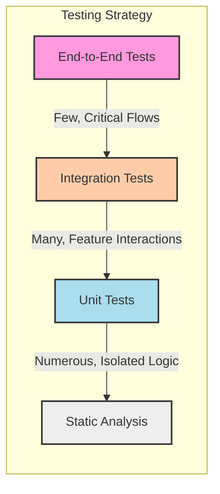

# Chapter 18: Comprehensive Frontend Testing Strategies

In the realm of production-grade, scalable frontend systems, testing is not merely a quality assurance step performed after development; it is an integral part of the engineering process itself. Robust testing strategies provide the confidence needed to deploy frequently, refactor aggressively, and evolve complex applications without introducing regressions. Insufficient or poorly designed tests lead to brittle systems, slow development cycles, fear of change, and ultimately, a degraded user experience and increased maintenance costs.

This chapter delves into the multifaceted world of frontend testing, moving beyond simple unit tests to embrace a comprehensive strategy that ensures reliability, maintainability, and correctness at various levels. We will explore different types of tests, the tools commonly used, best practices for writing effective tests, and how to cultivate a culture where testing is a shared responsibility that enables speed and quality.

## A. The Testing Pyramid/Trophy Revisited for Frontend

The concepts of the "Testing Pyramid" and Kent C. Dodds' "Testing Trophy" provide valuable mental models for structuring a testing strategy.

- **Testing Pyramid:** Traditionally emphasizes a large base of fast, cheap unit tests, a smaller layer of integration tests, and a very small top layer of slow, expensive end-to-end (E2E) tests. The goal is to catch bugs as early and cheaply as possible.
- **Testing Trophy:** Adapts this for modern UI development. It still values static analysis (like TypeScript, ESLint) and unit tests but gives significant weight to integration tests that verify component interactions and user flows within the frontend application. E2E tests remain crucial but are used more sparingly for critical paths, acknowledging their cost and potential flakiness.

For frontend systems, a balanced approach inspired by the Testing Trophy often proves most effective:



_Diagram Explanation: This diagram illustrates a frontend testing strategy inspired by the Testing Trophy. Static Analysis forms the base, followed by numerous Unit Tests, a significant layer of Integration Tests (the core focus), and fewer, targeted End-to-End Tests at the top._

Let's break down each layer in the context of frontend development.

#### 1. Unit Tests: Scope, Tools (Jest, Vitest, React Testing Library)

- **Scope:** Focus on testing the smallest "units" of code in isolation. In frontend, this often means individual functions (utilities, helpers, business logic) or sometimes isolated components (though component testing often blurs into integration testing). The key is isolation – dependencies are typically mocked.
- **Purpose:** Verify that a specific piece of logic works correctly given specific inputs. They are fast to write and run, providing quick feedback during development.
- **Tools:**
  - **Test Runners/Frameworks:** Jest, Vitest (increasingly popular due to its speed and ESM-first approach). These provide the environment, assertion libraries, and mocking capabilities.
  - **Component Testing Utilities:** While sometimes used for unit-level component checks, tools like React Testing Library (RTL) are more often used for integration tests, as we'll see. For pure logic or utility functions, no specific UI library is needed.
- **Benefits:** Fast feedback, precise error localization, encourages modular design.
- **Limitations:** Don't guarantee that units work together correctly. Over-reliance can lead to testing implementation details.

#### 2. Integration Tests: Scope, Tools (React Testing Library, Cypress, Playwright)

- **Scope:** Verify the interaction _between_ multiple units or components. This is the sweet spot for frontend testing, focusing on how components render and behave together within a part of the application. Tests often cover user interactions within a specific feature or component tree. Dependencies like API calls are usually mocked (e.g., using MSW).
- **Purpose:** Ensure that components integrate correctly, state updates propagate as expected, and user flows within a feature work end-to-end _within the frontend application_.
- **Tools:**
  - **React Testing Library (RTL) / Vue Testing Library / etc.:** The dominant paradigm. Focuses on testing components from the user's perspective (querying by accessible roles, text, etc.) rather than implementation details. Runs in a simulated DOM (jsdom via Jest/Vitest).
  - **Component Testing Runners (Cypress/Playwright):** Cypress and Playwright also offer component testing capabilities. Unlike RTL which uses jsdom, these run tests in a _real browser_, mounting components directly. This provides higher fidelity for browser-specific behaviors but can be slightly slower than jsdom-based tests.
- **Benefits:** Higher confidence than unit tests, tests realistic user interactions, encourages better component contracts.
- **Limitations:** Slower than unit tests, may require more setup (e.g., mocking network layers).

#### 3. End-to-End (E2E) Tests: Scope, Tools (Cypress, Playwright)

- **Scope:** Simulate real user journeys through the _entire_ application stack, from the frontend UI interacting with live or near-live backend services, databases, and potentially third-party integrations.
- **Purpose:** Verify that critical user flows work correctly in an environment that closely resembles production. They provide the highest level of confidence but are the most expensive to write, run, and maintain.
- **Tools:**
  - **Cypress:** An all-in-one framework known for its developer experience, time-travel debugging, and automatic waiting. Runs tests within the browser.
  - **Playwright:** A powerful cross-browser automation library developed by Microsoft, known for its speed, reliability, and broad browser support (Chromium, Firefox, WebKit). Offers features like auto-waits, network interception, and parallel execution.
- **Benefits:** Highest confidence in application functionality, tests the full stack integration.
- **Limitations:** Slowest to run, most brittle (prone to breaking due to unrelated UI or backend changes), require significant infrastructure (test environments, data seeding), debugging can be complex.

#### 4. Visual Regression Testing: Tools (Percy, Chromatic, Playwright/Cypress plugins)

- **Scope:** Focuses specifically on the visual appearance of UI components or pages. It captures baseline screenshots of the UI in a known good state and compares them against new screenshots taken after code changes.
- **Purpose:** Detect unintended visual changes (styling issues, layout shifts, broken elements) that might be missed by functional tests. Crucial for maintaining UI consistency, especially with Design Systems.
- **Tools:**
  - **Percy:** A popular commercial service that integrates with CI/CD and various testing frameworks (Cypress, Playwright, Storybook). Provides smart diffing and review workflows.
  - **Chromatic:** Developed by the Storybook team, primarily focused on visual testing components within Storybook. Also offers UI testing and review features.
  - **Framework Plugins/Libraries:** Playwright has built-in screenshot capabilities that can be used for basic visual testing. Cypress has plugins (`cypress-image-diff`, `cypress-visual-regression`) for similar purposes, often requiring self-hosted comparison logic or integration with external tools.
- **Benefits:** Catches visual bugs functional tests miss, ensures UI consistency, great complement to Design Systems.
- **Limitations:** Can be sensitive to minor rendering differences (requiring threshold adjustments), requires maintaining baseline images, can add cost (for SaaS tools or infrastructure).

#### 5. Accessibility Testing: Tools (axe-core, Jest-axe, Storybook A11y addon)

- **Scope:** Verifies that the application is usable by people with disabilities, adhering to standards like WCAG (Web Content Accessibility Guidelines).
- **Purpose:** Ensure inclusivity and compliance, improve overall usability for everyone. Catches issues like missing alt text, insufficient color contrast, improper ARIA roles, and keyboard navigation problems.
- **Tools:**
  - **axe-core:** The underlying engine for many accessibility testing tools. Can be run directly or via integrations.
  - **Jest-axe:** Integrates axe-core into Jest tests, allowing assertions on accessibility violations within unit/integration tests (often run with RTL).
  - **Storybook A11y Addon:** Integrates axe-core into Storybook, allowing interactive accessibility checks during component development.
  - **Browser Extensions (Axe DevTools, WAVE):** Useful for manual checks during development and testing.
  - **E2E Framework Integrations:** Libraries like `cypress-axe` and `playwright-axe` allow running accessibility checks within E2E tests.
- **Benefits:** Ensures compliance, improves usability for all users, reduces legal risk, promotes inclusive design.
- **Limitations:** Automated tools can only catch a subset (~30-50%) of WCAG issues; manual testing by experts is still essential for full coverage.

#### 6. Performance Testing (Integrating Lighthouse/Playwright checks)

- **Scope:** Measures and asserts on frontend performance metrics like Load Times (LCP, FCP), Interactivity (TBT, FID/INP), and Layout Stability (CLS) – Core Web Vitals are key here.
- **Purpose:** Prevent performance regressions, ensure a fast and smooth user experience, which impacts SEO, user retention, and conversion rates.
- **Tools:**
  - **Google Lighthouse:** The standard tool for auditing web page quality, including performance. Can be run via CLI (`lighthouse-ci`) or programmatically.
  - **Playwright:** Has built-in capabilities to interact with the Chrome DevTools Protocol (CDP), allowing collection of detailed performance traces and metrics during E2E tests.
  - **WebPageTest:** A powerful online tool for in-depth performance analysis, often used for deeper dives or benchmarking. Can be automated via its API.
  - **CI Integrations:** Tools like `lighthouse-ci` can be integrated into CI pipelines to automatically run Lighthouse audits on pull requests and fail builds if performance budgets are exceeded.
- **Benefits:** Protects user experience, improves SEO, provides objective metrics for performance goals.
- **Limitations:** Performance can be variable depending on network conditions and server load; requires careful configuration for reliable results in CI. Focus on relative changes (regressions) rather than absolute numbers in automated checks.

## B. Unit Testing Frontend Components and Logic

While integration tests often provide more value for components, unit tests remain essential for isolating and verifying specific pieces of logic, utility functions, and sometimes, the internal workings of complex hooks or stateful modules.

#### 1. Testing Library Philosophy (Testing User Behavior)

When testing components (even at a level that might blur into integration), the philosophy championed by Kent C. Dodds and implemented in the Testing Library family (React Testing Library, Vue Testing Library, etc.) is paramount:

> "The more your tests resemble the way your software is used, the more confidence they can give you."

This means:

- **Query elements like a user:** Find elements by accessible attributes (role, label text, placeholder text), visible text content, or test IDs (as a last resort). Avoid querying by CSS selectors or component internals.
- **Interact like a user:** Simulate user events (clicks, typing, focus changes) using Testing Library's `user-event` library, which mimics browser behavior more closely than simple `fireEvent`.
- **Assert on the result, not the implementation:** Check what the user sees (rendered output, state changes reflected in the UI) rather than asserting on component state or internal method calls.

This approach leads to tests that are more resilient to refactoring. If you change the internal implementation of a component but its user-facing behavior remains the same, your tests should still pass.

#### 2. Mocking Dependencies (Modules, API Calls, Timers)

Unit tests require isolation. Dependencies must be replaced with controlled substitutes (mocks, stubs, spies).

- **Modules (Jest/Vitest):** Test runners provide built-in mocking capabilities.
  - `jest.mock('./path/to/module')` or `vi.mock('./path/to/module')`: Replaces the entire module with a mock. You can provide a factory function to define the mock implementation.
  - `jest.fn()` or `vi.fn()`: Creates a mock function that tracks calls, arguments, and return values, allowing assertions on how it was used.
- **API Calls:**
  - **Manual Mocking:** Mock the specific function/module responsible for fetching data (e.g., `axios.get`, `fetch`, or your custom API client methods) using `jest.fn().mockResolvedValue(mockData)`.
  - **Mock Service Worker (MSW):** While often used for integration tests (see Section C), MSW can also be used in unit tests if you need to mock network requests triggered by the unit under test. This is less common for _pure_ unit tests but useful if the unit directly interacts with `fetch`.
- **Timers (`setTimeout`, `setInterval`):**
  - `jest.useFakeTimers()` / `vi.useFakeTimers()`: Replaces native timer functions with mock implementations.
  - `jest.advanceTimersByTime(ms)` / `vi.advanceTimersByTime(ms)`: Manually advance time to trigger timers without actually waiting.
  - `jest.runAllTimers()` / `vi.runAllTimers()`: Execute all pending timers immediately.

#### 3. Testing Hooks and Utilities

- **Utility Functions:** These are the easiest to unit test. They are typically pure functions: given an input, they produce an output without side effects. Test them by calling the function with various inputs and asserting on the outputs or errors thrown.
- **Custom Hooks (React):** Hooks encapsulate stateful logic and side effects.
  - **Using React Testing Library:** The recommended way is often to test the hook by using it within a simple test component rendered by RTL. Interact with the component to trigger the hook's logic and assert on the resulting UI changes or outputs.
  - **Using `@testing-library/react-hooks` (Legacy) or `renderHook` from RTL:** These utilities allow you to render a hook in isolation without a full component wrapper. You can then interact with the hook's return values and trigger updates using the provided `rerender` and `result` properties. This is useful for hooks that don't directly impact rendering or are complex to test via a component.

#### 4. Achieving High (Meaningful) Code Coverage

Code coverage tools (like Jest/Vitest's built-in coverage reporters using Istanbul) measure which lines, branches, functions, and statements of your code were executed during tests.

- **Interpreting Coverage:** A high percentage (e.g., 80-90%+) is often targeted, but it's a means, not an end. 100% coverage doesn't guarantee bug-free code. It's possible to execute code without actually asserting its behavior correctly.
- **Meaningful Coverage:** Focus on covering critical logic paths, edge cases, and error conditions. Use coverage reports to identify _untested_ code sections that represent significant risk. Don't chase 100% by writing trivial tests for simple code (like getters/setters) unless that logic is critical. Prioritize testing complex logic and user-facing behavior.
- **Coverage Thresholds:** Setting coverage thresholds in your CI pipeline can prevent decreases in coverage, but set realistic goals and focus on _quality_ of tests over raw numbers.

#### 5. [Practical Example: Writing unit tests for a complex component using RTL and Jest]

Let's consider a `UserProfileCard` component that fetches user data based on an ID prop and displays it, showing a loading state initially and an error state if the fetch fails. While this leans towards integration testing due to the fetch, we'll unit test its rendering logic based on different _props_ representing those states, mocking the fetch itself.

```typescript
// src/components/UserProfileCard.tsx
import React, { useState, useEffect } from "react";
import { fetchUserProfile } from "../services/api"; // Assume this fetches data

interface UserProfile {
  id: string;
  name: string;
  email: string;
}

interface UserProfileCardProps {
  userId: string;
  // Injecting fetch function for easier testing (Dependency Injection)
  fetcher?: (userId: string) => Promise<UserProfile>;
}

export const UserProfileCard: React.FC<UserProfileCardProps> = ({
  userId,
  fetcher = fetchUserProfile, // Default to real fetch
}) => {
  const [user, setUser] = useState<UserProfile | null>(null);
  const [loading, setLoading] = useState<boolean>(true);
  const [error, setError] = useState<string | null>(null);

  useEffect(() => {
    setLoading(true);
    setError(null);
    setUser(null);

    fetcher(userId)
      .then((data) => {
        setUser(data);
      })
      .catch((err) => {
        setError(err.message || "Failed to fetch user profile.");
      })
      .finally(() => {
        setLoading(false);
      });
  }, [userId, fetcher]);

  if (loading) {
    return <div data-testid="loading-indicator">Loading profile...</div>;
  }

  if (error) {
    return (
      <div data-testid="error-message" role="alert">
        Error: {error}
      </div>
    );
  }

  if (!user) {
    // Should ideally not happen if loading/error handled, but good practice
    return null;
  }

  return (
    <div data-testid={`user-profile-${user.id}`}>
      <h2>{user.name}</h2>
      <p>Email: {user.email}</p>
    </div>
  );
};

// src/components/UserProfileCard.test.tsx
import React from "react";
import { render, screen, waitFor } from "@testing-library/react";
import "@testing-library/jest-dom"; // For custom matchers like .toBeInTheDocument()
import { UserProfileCard } from "./UserProfileCard";

// Mock the fetcher function
const mockFetcher = jest.fn();

const mockUser: UserProfile = {
  id: "123",
  name: "Alice Wonderland",
  email: "alice@example.com",
};

describe("UserProfileCard", () => {
  beforeEach(() => {
    // Reset mocks before each test
    mockFetcher.mockClear();
  });

  test("displays loading state initially", () => {
    mockFetcher.mockResolvedValue(mockUser); // Prevent state update warning
    render(<UserProfileCard userId="123" fetcher={mockFetcher} />);
    expect(screen.getByTestId("loading-indicator")).toBeInTheDocument();
    expect(screen.getByText("Loading profile...")).toBeInTheDocument();
  });

  test("displays user profile after successful fetch", async () => {
    mockFetcher.mockResolvedValue(mockUser);
    render(<UserProfileCard userId="123" fetcher={mockFetcher} />);

    // Wait for loading to disappear and user profile to appear
    await waitFor(() => {
      expect(screen.queryByTestId("loading-indicator")).not.toBeInTheDocument();
    });

    expect(screen.getByTestId("user-profile-123")).toBeInTheDocument();
    expect(
      screen.getByRole("heading", { name: "Alice Wonderland" })
    ).toBeInTheDocument();
    expect(screen.getByText(`Email: ${mockUser.email}`)).toBeInTheDocument();
    expect(mockFetcher).toHaveBeenCalledTimes(1);
    expect(mockFetcher).toHaveBeenCalledWith("123");
  });

  test("displays error message if fetch fails", async () => {
    const errorMessage = "Network Error";
    mockFetcher.mockRejectedValue(new Error(errorMessage));
    render(<UserProfileCard userId="404" fetcher={mockFetcher} />);

    // Wait for loading to disappear and error message to appear
    await waitFor(() => {
      expect(screen.queryByTestId("loading-indicator")).not.toBeInTheDocument();
    });

    expect(screen.getByTestId("error-message")).toBeInTheDocument();
    expect(screen.getByRole("alert")).toHaveTextContent(
      `Error: ${errorMessage}`
    );
    expect(mockFetcher).toHaveBeenCalledTimes(1);
    expect(mockFetcher).toHaveBeenCalledWith("404");
  });

  test("refetches when userId prop changes", async () => {
    // Initial render
    mockFetcher.mockResolvedValueOnce(mockUser);
    const { rerender } = render(
      <UserProfileCard userId="123" fetcher={mockFetcher} />
    );
    await waitFor(() =>
      expect(screen.getByTestId("user-profile-123")).toBeInTheDocument()
    );
    expect(mockFetcher).toHaveBeenCalledTimes(1);

    // Rerender with new userId
    const newUser = {
      id: "456",
      name: "Bob The Builder",
      email: "bob@example.com",
    };
    mockFetcher.mockResolvedValueOnce(newUser);
    rerender(<UserProfileCard userId="456" fetcher={mockFetcher} />);

    // Should show loading again briefly (implementation detail, might not assert)
    // Then show the new user
    await waitFor(() =>
      expect(screen.getByTestId("user-profile-456")).toBeInTheDocument()
    );
    expect(
      screen.getByRole("heading", { name: "Bob The Builder" })
    ).toBeInTheDocument();
    expect(screen.queryByTestId("user-profile-123")).not.toBeInTheDocument(); // Old user gone
    expect(mockFetcher).toHaveBeenCalledTimes(2); // Called again for the new ID
    expect(mockFetcher).toHaveBeenCalledWith("456");
  });
});
```

This example demonstrates:

- Using RTL's `render`, `screen`, and `waitFor`.
- Mocking the data fetching function (`fetcher`) using `jest.fn()`.
- Testing loading, success, and error states.
- Testing behavior on prop changes (`rerender`).
- Using `data-testid` and accessible roles for querying.

#### 6. [Code Snippet: Mocking API requests in tests]

Using `jest.fn()` for a simple fetch wrapper:

```typescript
// src/services/api.ts
import axios from "axios";

export const fetchUserProfile = async (userId: string) => {
  const response = await axios.get(`/api/users/${userId}`);
  return response.data;
};

// src/services/api.test.ts
import axios from "axios";
import { fetchUserProfile } from "./api";

// Mock the axios module
jest.mock("axios");
const mockedAxios = axios as jest.Mocked<typeof axios>; // Type assertion for autocomplete

describe("fetchUserProfile", () => {
  test("fetches user data correctly", async () => {
    const mockData = { id: "1", name: "Test User" };
    // Mock the specific 'get' method for this test case
    mockedAxios.get.mockResolvedValue({ data: mockData });

    const user = await fetchUserProfile("1");

    expect(user).toEqual(mockData);
    expect(mockedAxios.get).toHaveBeenCalledTimes(1);
    expect(mockedAxios.get).toHaveBeenCalledWith("/api/users/1");
  });

  test("throws error when API fails", async () => {
    const errorMessage = "API Error";
    mockedAxios.get.mockRejectedValue(new Error(errorMessage));

    // Assert that the function throws when the mocked API call rejects
    await expect(fetchUserProfile("1")).rejects.toThrow(errorMessage);
    expect(mockedAxios.get).toHaveBeenCalledTimes(1);
    expect(mockedAxios.get).toHaveBeenCalledWith("/api/users/1");
  });
});
```

## C. Integration Testing Frontend Modules

Integration tests are arguably the most valuable type for frontend applications. They verify that different parts of your application work together correctly within the frontend boundary.

#### 1. Testing Interactions Between Multiple Components

Integration tests shine when testing how components collaborate. Examples:

- A form component interacting with input components and a submit button.
- A list component rendering items based on data passed from a parent container.
- A modal dialog being opened by a button click and closed correctly.
- A parent component passing callbacks down to children and verifying the callbacks are triggered correctly upon user interaction within the child.

The goal is to render a realistic slice of the UI tree and simulate user actions that span across these components, asserting the final UI state or side effects. React Testing Library is excellent for this.

#### 2. Testing Data Flow Through a Feature Slice

This involves testing a complete user workflow within a specific feature, often involving state management. Examples:

- Adding an item to a shopping cart and verifying the cart icon/count updates.
- Filtering a list of items and ensuring only matching items are displayed.
- Navigating between steps in a multi-step wizard.
- Testing user authentication flow (login form -> successful login state -> redirect).

These tests often require setting up initial state (e.g., in a Redux/Zustand store) and mocking API responses that drive the data flow.

#### 3. Mocking Server Responses at the Network Layer (MSW - Mock Service Worker)

For realistic integration tests involving data fetching, mocking at the network layer is superior to mocking individual fetch functions. Mock Service Worker (MSW) is the leading tool for this.

- **How it Works:** MSW intercepts outgoing network requests from the browser/jsdom using the Service Worker API (for browsers) or patching native modules (for Node/jsdom). It allows you to define mock handlers that respond to specific request URLs/methods with predefined data or error responses.
- **Benefits:**
  - **Decoupling:** Your components use `fetch` or `axios` as normal; they don't need to know they're being tested or that the network is mocked.
  - **Realism:** Tests interact with a mocked network layer, closely simulating real API interactions.
  - **Consistency:** Use the same mock definitions for development (via Service Worker) and testing (via Node request interceptors).
  - **No Implementation Mocking:** Avoids mocking specific data fetching modules (`axios`, `fetch`), making tests less brittle to refactoring of data fetching logic.

#### 4. [Practical Example: Writing integration tests for a user workflow (e.g., login form)]

Let's test a simple login form that calls an API on submit. We'll use RTL and MSW.

```typescript
// src/components/LoginForm.tsx
import React, { useState } from "react";

interface LoginFormProps {
  onLoginSuccess: (user: { token: string }) => void;
}

export const LoginForm: React.FC<LoginFormProps> = ({ onLoginSuccess }) => {
  const [email, setEmail] = useState("");
  const [password, setPassword] = useState("");
  const [error, setError] = useState<string | null>(null);
  const [loading, setLoading] = useState(false);

  const handleSubmit = async (event: React.FormEvent) => {
    event.preventDefault();
    setLoading(true);
    setError(null);

    try {
      const response = await fetch("/api/login", {
        method: "POST",
        headers: { "Content-Type": "application/json" },
        body: JSON.stringify({ email, password }),
      });

      const data = await response.json();

      if (!response.ok) {
        throw new Error(data.message || "Login failed");
      }

      onLoginSuccess({ token: data.token });
    } catch (err: any) {
      setError(err.message);
    } finally {
      setLoading(false);
    }
  };

  return (
    <form onSubmit={handleSubmit}>
      {error && (
        <div role="alert" style={{ color: "red" }}>
          {error}
        </div>
      )}
      <div>
        <label htmlFor="email">Email:</label>
        <input
          type="email"
          id="email"
          value={email}
          onChange={(e) => setEmail(e.target.value)}
          required
        />
      </div>
      <div>
        <label htmlFor="password">Password:</label>
        <input
          type="password"
          id="password"
          value={password}
          onChange={(e) => setPassword(e.target.value)}
          required
        />
      </div>
      <button type="submit" disabled={loading}>
        {loading ? "Logging in..." : "Login"}
      </button>
    </form>
  );
};

// src/mocks/handlers.ts (MSW handlers)
import { rest } from "msw";

export const handlers = [
  rest.post("/api/login", (req, res, ctx) => {
    const { email, password } = req.body as any;

    if (email === "user@example.com" && password === "password123") {
      return res(ctx.status(200), ctx.json({ token: "fake-jwt-token" }));
    } else {
      return res(ctx.status(401), ctx.json({ message: "Invalid credentials" }));
    }
  }),
];

// src/setupTests.ts (or similar Jest/Vitest setup file)
import { server } from "./mocks/server"; // Import the MSW server setup
import "@testing-library/jest-dom";

// Establish API mocking before all tests.
beforeAll(() => server.listen());

// Reset any request handlers that we may add during the tests,
// so they don't affect other tests.
afterEach(() => server.resetHandlers());

// Clean up after the tests are finished.
afterAll(() => server.close());

// src/mocks/server.ts (MSW server setup for Node)
import { setupServer } from "msw/node";
import { handlers } from "./handlers";

export const server = setupServer(...handlers);

// src/components/LoginForm.test.tsx
import React from "react";
import { render, screen, waitFor } from "@testing-library/react";
import userEvent from "@testing-library/user-event"; // Use userEvent for realistic interactions
import { LoginForm } from "./LoginForm";
import { server } from "../mocks/server"; // Import server for specific handler overrides if needed
import { rest } from "msw";

describe("LoginForm Integration Test", () => {
  const mockOnLoginSuccess = jest.fn();

  beforeEach(() => {
    mockOnLoginSuccess.mockClear();
  });

  test("allows user to log in successfully", async () => {
    const user = userEvent.setup();
    render(<LoginForm onLoginSuccess={mockOnLoginSuccess} />);

    // Fill the form
    await user.type(screen.getByLabelText(/email/i), "user@example.com");
    await user.type(screen.getByLabelText(/password/i), "password123");

    // Submit the form
    await user.click(screen.getByRole("button", { name: /login/i }));

    // Assertions: loading state, success callback, no error
    expect(
      screen.getByRole("button", { name: /logging in.../i })
    ).toBeDisabled();

    await waitFor(() => {
      expect(mockOnLoginSuccess).toHaveBeenCalledTimes(1);
    });
    expect(mockOnLoginSuccess).toHaveBeenCalledWith({
      token: "fake-jwt-token",
    });
    expect(screen.queryByRole("alert")).not.toBeInTheDocument();
    // Button should be enabled again
    expect(screen.getByRole("button", { name: /login/i })).toBeEnabled();
  });

  test("shows error message on failed login", async () => {
    const user = userEvent.setup();
    render(<LoginForm onLoginSuccess={mockOnLoginSuccess} />);

    // Fill the form with incorrect credentials
    await user.type(screen.getByLabelText(/email/i), "wrong@example.com");
    await user.type(screen.getByLabelText(/password/i), "wrongpassword");

    // Submit the form
    await user.click(screen.getByRole("button", { name: /login/i }));

    // Assertions: loading state, error message shown, callback not called
    expect(
      screen.getByRole("button", { name: /logging in.../i })
    ).toBeDisabled();

    // Wait for error message to appear
    const alert = await screen.findByRole("alert");
    expect(alert).toHaveTextContent("Invalid credentials");
    expect(mockOnLoginSuccess).not.toHaveBeenCalled();
    // Button should be enabled again
    expect(screen.getByRole("button", { name: /login/i })).toBeEnabled();
  });

  test("handles server error during login", async () => {
    const user = userEvent.setup();
    // Override the default handler for this specific test
    server.use(
      rest.post("/api/login", (req, res, ctx) => {
        return res(
          ctx.status(500),
          ctx.json({ message: "Internal Server Error" })
        );
      })
    );

    render(<LoginForm onLoginSuccess={mockOnLoginSuccess} />);

    await user.type(screen.getByLabelText(/email/i), "user@example.com");
    await user.type(screen.getByLabelText(/password/i), "password123");
    await user.click(screen.getByRole("button", { name: /login/i }));

    const alert = await screen.findByRole("alert");
    expect(alert).toHaveTextContent("Internal Server Error");
    expect(mockOnLoginSuccess).not.toHaveBeenCalled();
  });
});
```

This example shows:

- Using `userEvent` for realistic typing and clicking.
- Setting up MSW handlers (`handlers.ts`).
- Configuring MSW for tests (`setupTests.ts`, `server.ts`).
- Testing success, failure (401), and server error (500) scenarios by interacting with the form as a user would.
- Asserting on loading states, final UI output (error messages), and callback invocations.

#### 5. [Configuration Guide: Setting up MSW for development and testing]

1.  **Install:** `npm install msw --save-dev` or `yarn add msw --dev`.
2.  **Define Handlers:** Create handler files (e.g., `src/mocks/handlers.ts`) using `rest` or `graphql` from MSW to define mock responses for your API endpoints.
3.  **Setup for Testing (Node):**
    - Create a server setup file (e.g., `src/mocks/server.ts`) using `setupServer` from `msw/node` and import your handlers.
    - In your Jest/Vitest setup file (e.g., `src/setupTests.ts`):
      - Import the server.
      - Call `server.listen()` before all tests (`beforeAll`).
      - Call `server.resetHandlers()` after each test (`afterEach`) to reset runtime handlers.
      - Call `server.close()` after all tests (`afterAll`).
4.  **Setup for Development (Browser):**
    - Run the MSW CLI command: `npx msw init <PUBLIC_DIR> --save` (replace `<PUBLIC_DIR>` with your public assets directory, e.g., `public/`). This creates a `mockServiceWorker.js` file.
    - Create a browser setup file (e.g., `src/mocks/browser.ts`) using `setupWorker` from `msw` and import your handlers.
    - In your application's entry point (e.g., `src/index.tsx`), conditionally import and start the worker for development environments:
      ```typescript
      if (process.env.NODE_ENV === "development") {
        const { worker } = require("./mocks/browser"); // Use require for conditional loading
        worker.start();
      }
      ```
5.  **Start Application:** When running your app in development, MSW will intercept requests via the Service Worker. In tests, it uses the Node request interceptors.

## D. End-to-End Testing Strategies

E2E tests provide the ultimate confidence by verifying user flows across the entire system. However, their cost and potential flakiness require a strategic approach.

#### 1. Identifying Critical User Flows

Don't try to E2E test everything. Focus on the paths that are most critical to the business or user experience:

- **Core Functionality:** Login/Logout, Registration, Password Reset.
- **Primary Value Proposition:** Creating a post, completing a purchase, searching for key information, core feature interactions.
- **Revenue-Generating Flows:** Checkout process, subscription signup.
- **High-Risk Areas:** Flows involving payments, sensitive data, or complex integrations.

Prioritize breadth (covering different critical flows) over depth (testing every edge case within a single flow) for E2E tests. Push edge case testing down to integration or unit tests where possible.

#### 2. Writing Stable and Maintainable E2E Tests

Flakiness is the enemy of E2E tests. Strategies to improve stability:

- **Stable Selectors:** Avoid selectors tied to brittle CSS or text content that changes frequently. Prioritize:
  1.  Accessibility attributes (`getByRole`, `getByLabelText` - if using Testing Library concepts within E2E).
  2.  Dedicated test IDs (`data-testid`, `data-cy`). Use sparingly for elements without clear accessible roles.
  3.  Stable, semantic CSS selectors as a last resort.
- **Explicit Waits (Use Sparingly):** Modern frameworks like Cypress and Playwright have built-in auto-waiting for elements to exist, be visible, and be actionable. Rely on these whenever possible. Avoid fixed `sleep()` or `wait(milliseconds)`. Use explicit waits only when necessary (e.g., waiting for a specific network request to complete or for a non-standard asynchronous operation).
- **Network Interception:** Intercept and wait for specific API calls to complete before proceeding with assertions that depend on the API response. Both Cypress (`cy.intercept`) and Playwright (`page.waitForResponse`, `page.route`) offer powerful network interception.
- **Retry Logic:** Implement automatic retries for failed assertions or actions, especially for checks that might be sensitive to timing (e.g., waiting for an animation to finish). Frameworks often have built-in retry capabilities.
- **Isolate Tests:** Ensure tests are independent and don't rely on the state left by previous tests. Clean up resources (e.g., created data) or reset application state between tests.

#### 3. Page Object Model (POM) and Alternatives

As E2E test suites grow, managing selectors and interactions becomes complex. The Page Object Model (POM) is a common pattern to improve organization and maintainability:

- **Concept:** Encapsulate the selectors and actions for a specific page or significant component into a dedicated class or object. Tests then interact with the application through these Page Objects instead of directly using selectors and framework commands.
- **Benefits:**
  - **Readability:** Test scripts become cleaner, focusing on the steps of the user flow.
  - **Maintainability:** If the UI changes, updates only need to happen in the Page Object, not in every test that uses that page.
  - **Reusability:** Common actions (like login) can be encapsulated in Page Object methods.
- **Alternatives:**
  - **App Actions / Flow Functions:** Instead of strict page-based objects, focus on encapsulating reusable user _actions_ or _flows_ (e.g., `login(username, password)`, `addProductToCart(productId)`). This can be more flexible than rigid POM, especially in component-based architectures where "pages" are less distinct.

#### 4. Handling Authentication and Test Data

E2E tests often require a logged-in state and specific data to exist.

- **Authentication:**
  - **UI Login (Avoid):** Logging in through the UI for every test is slow and brittle.
  - **Programmatic Login:** Use API calls to log in directly and set authentication tokens/cookies in the browser context before the test starts. This is much faster and more reliable. Cypress (`cy.request`) and Playwright (`page.request`) facilitate this.
  - **Session Restoration:** Some frameworks allow saving and restoring authentication sessions between tests or test runs to speed things up further (use with caution to ensure test isolation).
- **Test Data:**
  - **Seeding:** Use backend scripts or API endpoints to seed the database with necessary data before a test run or individual test suite.
  - **Data Factories:** Use libraries or custom code to generate consistent test data.
  - **Cleanup:** Ensure data created during a test is cleaned up afterwards to maintain a consistent test environment. This can be done via API calls or database scripts in `afterEach` or `afterAll` hooks.
  - **Dedicated Test Environment:** E2E tests should run against a dedicated, stable environment that mirrors production as closely as possible, with its own isolated database.

#### 5. Running E2E Tests in CI/CD Pipelines

Integrating E2E tests into CI/CD is crucial for catching regressions before deployment.

- **Triggering:** Run E2E tests on key branches (e.g., `main`, `release`) and potentially on pull requests (though their runtime might necessitate running only a subset or running them in parallel).
- **Environment:** The CI pipeline needs to provision or connect to a suitable E2E test environment. This might involve deploying the application branch to a temporary environment.
- **Parallelization:** E2E tests are slow. Use framework features (Cypress Cloud, Playwright's built-in sharding) to run tests in parallel across multiple machines/containers to reduce overall execution time.
- **Reporting:** Integrate test results and artifacts (screenshots, videos on failure) into the CI/CD platform for easy debugging.
- **Flake Management:** Implement strategies to handle flaky tests (e.g., automatic retries in CI). Consistently flaky tests should be quarantined or fixed promptly, as they erode trust in the test suite.

#### 6. [Practical Example: Writing a Cypress test for a core feature]

Let's test adding an item to a todo list using Cypress.

```javascript
// cypress/e2e/todo.cy.js

describe("Todo Application", () => {
  beforeEach(() => {
    // Reset state before each test - could be API call or local storage clear
    cy.visit("/"); // Visit the base URL configured in cypress.config.js
    // Example: Clear todos via API if available
    // cy.request('POST', '/api/todos/clear');
    // Or clear local storage if app uses it
    // cy.clearLocalStorage();
    // cy.reload(); // Reload to ensure clean state applied
  });

  it("should allow users to add a new todo item", () => {
    const newItem = "Learn Cypress";

    // Find the input field (using data-testid is robust)
    cy.get('[data-testid="new-todo-input"]').type(`${newItem}{enter}`);

    // Assertions:
    // 1. The new item should appear in the list
    //    - Check text content and visibility
    cy.get('[data-testid="todo-list"] li')
      .should("have.length", 1) // Assuming list was empty
      .first()
      .should("have.text", newItem);

    // 2. The input field should be cleared
    cy.get('[data-testid="new-todo-input"]').should("have.value", "");
  });

  it("should allow users to mark a todo as completed", () => {
    const newItem = "Write E2E tests";
    cy.get('[data-testid="new-todo-input"]').type(`${newItem}{enter}`);

    // Find the checkbox associated with the new item and click it
    cy.contains('[data-testid="todo-list"] li', newItem)
      .find('[data-testid="todo-item-toggle"]') // Find checkbox within the list item
      .check(); // Use .check() for checkboxes/radio buttons

    // Assertion: The list item should have a 'completed' class (or similar indicator)
    cy.contains('[data-testid="todo-list"] li', newItem).should(
      "have.class",
      "completed"
    ); // Adjust class name as needed
  });

  // Example using Page Object Model (Conceptual)
  // Assuming cypress/support/pageObjects/TodoPage.js exists
  // it('should add item using Page Object', () => {
  //   const todoPage = new TodoPage(); // Instantiate the Page Object
  //   const newItem = 'Refactor with POM';
  //
  //   todoPage.addNewTodo(newItem);
  //   todoPage.getTodoListItems().should('have.length', 1).and('contain.text', newItem);
  //   todoPage.getNewTodoInput().should('have.value', '');
  // });
});
```

#### 7. [Troubleshooting Section: Debugging flaky E2E tests]

Flaky tests pass sometimes and fail other times without code changes. Debugging them is crucial.

- **Reproduce Locally:** Try to run the failing test multiple times locally. Use framework features like Cypress's UI (`cypress open`) or Playwright's Inspector/Trace Viewer to step through the execution and see the state at the point of failure.
- **Examine Artifacts:** Check screenshots and videos recorded during CI failures. They often reveal unexpected UI states, timing issues, or modals blocking interaction.
- **Check for Race Conditions:** Failures might occur because the test tries to interact with an element before it's ready (e.g., before an animation completes or data loads). Add more specific waits (e.g., wait for a network request, wait for an element to _not_ have a `disabled` attribute).
- **Selector Issues:** Is the selector still valid? Did related UI changes make it ambiguous or non-unique? Use browser dev tools to verify selectors against the failed state. Use more robust selectors (test IDs).
- **Timing/Animation:** Animations or transitions can cause issues. Disable animations in the test environment if possible, or add waits for animations to complete.
- **Test Isolation:** Ensure tests don't interfere with each other. Reset state thoroughly (`beforeEach`). Check for leftover data or state from previous tests.
- **Environment Differences:** Are there differences between the CI environment and local setup (e.g., browser version, screen resolution, network speed)? Try to align them or account for differences.
- **Network Reliability:** If tests rely on live services (even in staging), network blips or slow API responses can cause flakiness. Consider more network mocking or add robust retry logic around API-dependent assertions.
- **Incremental Debugging:** Comment out parts of the test to isolate the exact step causing the flake. Add logging (`cy.log`, `console.log` within `page.evaluate`) to understand the flow.

## E. Visual Regression Testing Workflow

VRT catches unintended visual changes, acting as a safety net for your UI's look and feel.

#### 1. Capturing Baseline Screenshots

The first time VRT runs for a component or page, it captures baseline images. These images represent the "known good" visual state. This typically happens on a specific branch (e.g., `main`) or requires manual approval through the VRT tool's interface. Subsequent runs on feature branches will compare against these baselines.

#### 2. Diffing Algorithms and Thresholds

When changes are detected, VRT tools generate visual "diffs" highlighting the differences between the baseline and the new screenshot.

- **Pixel-by-Pixel:** The simplest comparison, sensitive to any change.
- **Perceptual Diffing:** More advanced algorithms try to ignore minor anti-aliasing or rendering variations that humans wouldn't notice.
- **Thresholds:** Most tools allow configuring a tolerance threshold (e.g., percentage of different pixels or a perceptual difference score) to automatically accept minor, insignificant changes and reduce noise. Setting the right threshold is key to avoiding excessive false positives.

#### 3. Integrating with CI and Review Processes

VRT is most effective when integrated into your CI/CD pipeline:

1.  **Run on PRs:** Tests run automatically when a pull request is created or updated.
2.  **Capture & Compare:** Screenshots are captured for components (via Storybook integration) or pages (via E2E framework integration).
3.  **Report Status:** The VRT tool reports back to the PR (e.g., via GitHub Checks).
4.  **Review Diffs:** If visual changes are detected, the tool provides a UI for developers and designers to review the diffs.
5.  **Approve or Reject:** Reviewers approve legitimate changes (updating the baseline) or reject unintended changes (requiring code fixes). Blocking PR merges on VRT failures ensures visual consistency.

#### 4. [Configuration Guide: Setting up Percy or Chromatic with Storybook/Cypress]

**Percy with Storybook:**

1.  Install: `npm install --save-dev @percy/cli @percy/storybook`
2.  Configure: Set `PERCY_TOKEN` environment variable (from your Percy project).
3.  Run: Add a script to `package.json`: `"percy:storybook": "percy storybook ./storybook-static"` (assuming Storybook builds to `./storybook-static`).
4.  CI Integration: Run `npm run build-storybook && npm run percy:storybook` in your CI pipeline after installing dependencies and setting the token.

**Chromatic with Storybook:**

1.  Install: `npm install --save-dev chromatic`
2.  Configure: Set `CHROMATIC_PROJECT_TOKEN` environment variable (from your Chromatic project).
3.  Run: Add a script: `"chromatic": "chromatic --project-token=<your-token>"` (or rely on env var).
4.  CI Integration: Run `npm run build-storybook && npm run chromatic` in CI. Chromatic often auto-detects tokens in popular CI environments.

**Percy with Cypress:**

1.  Install: `npm install --save-dev @percy/cli @percy/cypress`
2.  Configure: Set `PERCY_TOKEN`.
3.  Setup: Add `import '@percy/cypress/task'` to `cypress/support/e2e.js` (or `commands.js`) and `require('@percy/cypress/task')(on, config)` to your `cypress.config.js`'s `setupNodeEvents`.
4.  Usage: In your tests, use `cy.percySnapshot('Snapshot Name');` at points where you want to capture a screenshot.
5.  Run: Wrap your Cypress run command with `percy exec`: `percy exec -- cypress run`.
6.  CI Integration: Run the `percy exec` command in CI.

_(Note: Setup steps might vary slightly based on tool versions and specific project configurations. Refer to the official documentation of Percy and Chromatic for the most up-to-date instructions.)_

## F. Test Strategy and Culture

Tools and techniques are only part of the equation. A successful testing approach requires a deliberate strategy and a supportive culture.

#### 1. Defining a Testing Strategy for Your Team/Project

Don't test haphazardly. Define and document your approach:

- **Goals:** What are you trying to achieve with testing? (e.g., reduce production bugs by X%, increase deployment confidence, ensure accessibility compliance).
- **Scope:** What types of tests will you write? (Unit, Integration, E2E, Visual, Accessibility, Performance).
- **Balance:** How will you balance these test types (Pyramid/Trophy)? Where will you invest the most effort? (Often integration tests).
- **Coverage Targets:** Define _meaningful_ coverage goals, if any. Focus on critical modules and user flows.
- **Tooling:** Standardize on specific testing frameworks and libraries.
- **Responsibility:** Who writes tests? (Ideally, the developer writing the feature code). Who maintains them?
- **When to Test:** Integrate testing into the development workflow (e.g., write tests alongside code, include tests in code reviews).
- **CI/CD Integration:** How will tests run automatically? Which tests block deployment?

Tailor the strategy to your application's complexity, team size, risk tolerance, and domain.

#### 2. Balancing Test Types and Coverage

No single test type is sufficient. Aim for a balanced portfolio:

- **Static Analysis:** Catch typos, basic errors, and enforce code style cheaply.
- **Unit Tests:** Verify isolated logic quickly. Good for utilities, complex algorithms, pure functions.
- **Integration Tests:** Provide the best ROI for testing component interactions and feature slices within the frontend. This should often be the largest part of your test suite.
- **E2E Tests:** Use sparingly for critical, end-to-end user flows. High confidence but high cost.
- **Visual Tests:** Essential for UI consistency, especially with design systems.
- **Accessibility Tests:** Non-negotiable for inclusive applications. Combine automated checks with manual testing.
- **Performance Tests:** Integrate checks (e.g., Lighthouse budgets) into CI to prevent regressions.

Avoid extremes: relying only on E2E tests leads to slow, brittle builds; relying only on unit tests misses integration issues.

#### 3. Integrating Testing into the Development Workflow

Testing should be a continuous activity, not an afterthought.

- **Test Alongside Development:** Write tests as you write code. Test-Driven Development (TDD) or Behavior-Driven Development (BDD) are powerful methodologies, but even just writing tests concurrently is beneficial.
- **Code Reviews:** Include tests as part of the code review process. Reviewers should check test quality, correctness, and coverage of important cases, not just the implementation code.
- **Definition of Done:** Include "working and tested" (with appropriate tests written and passing) in your team's definition of done for a feature or bug fix.
- **Debugging with Tests:** When fixing a bug, write a failing test that reproduces the bug first. Then fix the code until the test passes. This prevents regressions.
- **Shared Ownership:** Foster a culture where quality is everyone's responsibility. Developers write tests, QA engineers might focus on exploratory testing and more complex E2E scenarios, and designers might participate in reviewing visual tests.

#### 4. [Production Note: Test quality over quantity; focus on critical paths]

> **Production Note:** The ultimate goal of your testing strategy is to ship features and fixes to production with confidence, speed, and reliability. Don't fall into the trap of chasing arbitrary coverage numbers or writing tests for trivial code. Focus your efforts on tests that provide the most value – those that cover critical user journeys, complex business logic, and potential regression points. A smaller suite of high-quality, reliable integration and E2E tests covering essential flows is often more valuable than thousands of brittle unit tests verifying simple implementation details. Prioritize tests that genuinely reduce the risk of production failures and improve maintainability. Quality and strategic focus trump sheer quantity.
