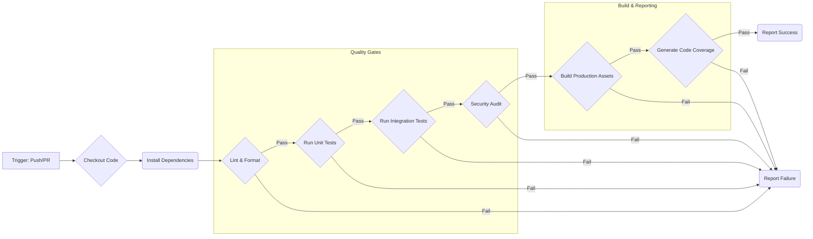

# Chapter 19: CI/CD Pipelines for Frontend Applications

In the preceding chapters, we've meticulously explored the architectural patterns, design principles, and technologies essential for building production-grade and scalable frontend systems. However, even the most well-architected application provides limited value if it cannot be reliably, consistently, and rapidly delivered to users. This is where Continuous Integration (CI) and Continuous Deployment/Delivery (CD) pipelines become indispensable.

CI/CD practices are the bedrock of modern software development, enabling teams to automate the build, test, and deployment processes. For frontend applications, which often involve complex build steps, diverse testing suites, and global distribution via Content Delivery Networks (CDNs), a robust CI/CD pipeline is not just a convenience—it's a fundamental requirement for achieving the velocity, stability, and quality demanded by production environments.

This chapter delves into the principles, design, implementation, and optimization of CI/CD pipelines specifically tailored for frontend applications. We will explore how to automate everything from code quality checks to sophisticated deployment strategies, ensuring your frontend system can evolve rapidly while maintaining the highest standards of reliability and performance.

## A. Principles of Continuous Integration and Continuous Deployment (CI/CD)

Before diving into the specifics of frontend pipelines, let's establish the core principles underpinning CI/CD.

- **Continuous Integration (CI):** The practice of developers frequently merging their code changes into a central repository, after which automated builds and tests are run.
- **Continuous Delivery (CD):** An extension of CI where code changes, after passing automated tests, are automatically released to a staging or pre-production environment. Deployment to production often requires manual approval but is automated.
- **Continuous Deployment (CD):** Goes one step further than Continuous Delivery, automatically deploying every change that passes all stages of the production pipeline to the production environment.

These practices are guided by several key principles:

### 1. Automation: Build, Test, Deploy

> **Automation is the cornerstone of CI/CD.** The primary goal is to eliminate manual, error-prone tasks involved in integrating code, running tests, building artifacts, and deploying the application.

In the context of frontend development, this means automating:

- **Dependency Installation:** `npm install`, `yarn install`, `pnpm install`.
- **Code Quality Checks:** Linting (`ESLint`), formatting (`Prettier`), type checking (`TypeScript`).
- **Testing:** Unit tests (`Jest`, `Vitest`), integration tests (`React Testing Library`, `Vue Test Utils`), end-to-end tests (`Cypress`, `Playwright`).
- **Building:** Transpiling (`Babel`), bundling (`Webpack`, `Vite`, `Rollup`), optimizing assets (images, CSS, fonts).
- **Deployment:** Uploading assets to hosting platforms (S3, Netlify, Vercel), invalidating CDN caches, deploying server-side rendering (SSR) applications.

By automating these steps, teams reduce the risk of human error, ensure consistency across environments, and free up developer time to focus on building features.

### 2. Fast Feedback Loops

> **CI/CD aims to provide rapid feedback on the impact of code changes.** The sooner a developer knows if their change broke the build, failed a test, or introduced a regression, the faster and cheaper it is to fix.

A well-designed CI pipeline runs quickly, providing feedback within minutes of a code push or pull request creation. This encourages developers to commit smaller, incremental changes more frequently, making integration smoother and debugging easier. Slow CI pipelines discourage frequent integration and can become a bottleneck, negating many of the benefits.

### 3. Consistency and Reliability

> **Automated pipelines ensure that the build, test, and deployment processes are executed identically every time.** This eliminates the "it works on my machine" problem and increases confidence in releases.

Manual processes are inherently variable. Different developers might have slightly different environment setups, forget a step, or perform tasks in a different order. CI/CD enforces a standardized workflow defined in code (pipeline configuration), guaranteeing that every change goes through the exact same validation and deployment sequence. This leads to more predictable and reliable releases.

## B. Designing the Frontend CI Pipeline

The Continuous Integration (CI) pipeline focuses on validating code changes automatically whenever new code is integrated into the main repository branch or proposed via a pull request. Its primary goal is to ensure code quality, correctness, and security _before_ changes are merged.



> **Diagram Explanation:** This flowchart illustrates a typical sequence of stages in a frontend CI pipeline. Each stage acts as a quality gate; failure at any stage typically stops the pipeline and reports an error, providing fast feedback.

### 1. Triggering Builds (Push, Pull Request)

CI pipelines are typically triggered by events in the version control system (e.g., Git):

- **Push:** Automatically trigger a build when code is pushed to specific branches (e.g., `main`, `develop`, feature branches).
- **Pull Request (PR) / Merge Request (MR):** Trigger a build when a PR/MR is opened or updated. This is crucial for validating changes _before_ they are merged into the main codebase.
- **Tags:** Trigger specific workflows (like releases) when Git tags are pushed.

Configuring triggers appropriately ensures that validation happens at the right points in the development workflow.

### 2. Linting and Code Formatting Checks

Maintaining code style consistency and catching potential errors early is vital for team collaboration and maintainability.

- **Linters (e.g., ESLint):** Analyze code for potential errors, anti-patterns, and stylistic issues based on configurable rules.
- **Formatters (e.g., Prettier):** Automatically enforce a consistent code style, eliminating debates and ensuring readability.

Running these checks in CI prevents code that violates standards from being merged.

```bash
# Example CI step (GitHub Actions syntax)
- name: Lint and Format Check
  run: |
    npm run lint
    npm run format:check
```

### 3. Running Unit and Integration Tests

Automated tests are critical for verifying application logic.

- **Unit Tests:** Test individual functions or components in isolation. They are typically fast and provide granular feedback. Tools like Jest, Vitest, React Testing Library, and Vue Test Utils are common.
- **Integration Tests:** Test the interaction between multiple units or components. They ensure that different parts of the application work together correctly.

A comprehensive test suite run automatically in CI provides high confidence that changes haven't introduced regressions.

```bash
# Example CI step
- name: Run Unit and Integration Tests
  run: npm test
```

### 4. Security Audits (npm audit, Snyk)

Frontend applications rely heavily on third-party dependencies from registries like npm. These dependencies can contain known vulnerabilities.

- **`npm audit` / `yarn audit`:** Built-in commands to check for known vulnerabilities in project dependencies.
- **Third-Party Tools (e.g., Snyk, Dependabot):** Offer more advanced scanning, vulnerability management, and automated remediation suggestions.

Integrating security audits into the CI pipeline helps catch vulnerable dependencies before they reach production.

```bash
# Example CI step (basic npm audit)
- name: Security Audit
  run: npm audit --audit-level=high # Fail only on high severity issues
```

### 5. Building Production Assets

This step simulates the production build process to ensure it completes successfully and generates the expected optimized assets.

- Runs the build command defined in `package.json` (e.g., `npm run build`, `vite build`).
- Uses production environment variables (`NODE_ENV=production`).
- Generates minified JavaScript, CSS, optimized images, etc.

Catching build errors in CI prevents deployment failures later.

```bash
# Example CI step
- name: Build Production Assets
  run: npm run build
  env:
    NODE_ENV: production
```

### 6. Generating Code Coverage Reports

Code coverage tools (e.g., Istanbul, integrated into Jest/Vitest) measure how much of the codebase is executed by the test suite.

- While 100% coverage isn't always practical or necessary, tracking coverage helps identify untested areas.
- CI pipelines can generate coverage reports and optionally upload them to services like Codecov or Coveralls for tracking trends and enforcing coverage thresholds in PRs.

```bash
# Example CI step (assuming 'npm test' generates coverage)
- name: Generate Code Coverage Report
  run: npm test -- --coverage # Specific flag might vary
- name: Upload coverage to Codecov
  uses: codecov/codecov-action@v3
  # Add configuration for Codecov token if needed
```

### 7. Parallelizing Jobs for Speed

As test suites and build processes grow, CI pipeline duration can increase significantly. Most CI platforms allow parallelizing jobs:

- **Splitting Tests:** Run different subsets of the test suite (e.g., unit vs. integration, or splitting tests across multiple machines) concurrently. Test runners often have features to support this.
- **Parallel Stages:** Run independent stages (e.g., linting and unit tests) simultaneously if they don't depend on each other.

Parallelization drastically reduces the overall pipeline execution time, improving the feedback loop.

### 8. Caching Dependencies and Build Artifacts

Downloading dependencies (`node_modules`) and rebuilding unchanged parts of the application on every CI run is inefficient.

- **Dependency Caching:** Most CI platforms offer mechanisms to cache the `node_modules` directory based on the lock file (`package-lock.json`, `yarn.lock`). If the lock file hasn't changed, the cached dependencies are restored, saving significant time.
- **Build Caching:** Tools like Webpack, Vite, Turborepo, and Nx offer build caching. They can cache intermediate build outputs and only rebuild parts of the application affected by code changes. CI platforms can also cache build output directories (e.g., `.dist`, `.next`, `.nuxt`).

Effective caching is crucial for maintaining fast CI pipelines, especially in large projects or monorepos.

```yaml
# Example GitHub Actions Caching
- name: Cache node modules
  uses: actions/cache@v3
  with:
    path: ~/.npm # or node_modules depending on strategy
    key: ${{ runner.os }}-node-${{ hashFiles('**/package-lock.json') }}
    restore-keys: |
      ${{ runner.os }}-node-
```

### 9. [Configuration Guide: Setting up a basic frontend CI pipeline using GitHub Actions or GitLab CI]

Here’s a simplified example of a frontend CI pipeline using GitHub Actions, defined in `.github/workflows/ci.yml`:

```yaml
name: Frontend CI

on:
  push:
    branches: [main]
  pull_request:
    branches: [main]

jobs:
  build-and-test:
    runs-on: ubuntu-latest

    strategy:
      matrix:
        node-version: [18.x] # Specify Node.js version

    steps:
      - name: Checkout code
        uses: actions/checkout@v3

      - name: Set up Node.js ${{ matrix.node-version }}
        uses: actions/setup-node@v3
        with:
          node-version: ${{ matrix.node-version }}
          cache: "npm" # Use built-in caching for npm

      - name: Install dependencies
        run: npm ci # Use 'ci' for faster, reliable installs from lockfile

      - name: Lint Check
        run: npm run lint

      - name: Format Check
        run: npm run format:check # Assuming you have a check script

      - name: Run Tests
        run: npm test

      - name: Build Application
        run: npm run build
        env:
          NODE_ENV: production
          # Add any build-time environment variables here
          # CI=true is often set automatically by platforms

    # Optional: Add steps for security audit, coverage reporting, etc.
```

**Key Points:**

- `on`: Defines triggers (push to `main`, PRs targeting `main`).
- `jobs`: Defines one or more jobs to run.
- `runs-on`: Specifies the runner environment.
- `strategy.matrix`: Allows running the job with different configurations (e.g., Node versions).
- `steps`: Defines the sequence of tasks within the job.
- `uses`: Leverages pre-built GitHub Actions (e.g., `checkout`, `setup-node`, `cache`).
- `run`: Executes shell commands.
- `npm ci`: Preferred over `npm install` in CI for faster, deterministic installs based on `package-lock.json`.

GitLab CI uses a similar concept with a `.gitlab-ci.yml` file, defining `stages` and `jobs`. The core steps (checkout, install, lint, test, build) remain the same.

## C. Designing the Frontend CD Pipeline

The Continuous Deployment/Delivery (CD) pipeline takes over after the CI pipeline successfully validates a change. Its purpose is to automate the release process, deploying the application artifacts to various environments reliably and safely.

### 1. Deployment Environments (Development, Staging, Production)

Production-grade applications typically use multiple environments:

- **Development (Dev):** Often corresponds to feature branches or a shared `develop` branch. Used for active development and initial testing. Deployments might happen automatically on every push to specific branches.
- **Staging (Pre-production):** Mirrors the production environment as closely as possible. Used for final testing, UAT (User Acceptance Testing), and validation before releasing to production. Deployments are often triggered manually or automatically after merging to a release branch or `main`.
- **Production (Prod):** The live environment accessible to end-users. Deployments are usually triggered deliberately (manually or automatically from `main`/tags) after successful validation in staging.

Maintaining distinct environments allows testing changes in isolation and reduces the risk of introducing bugs to users.

### 2. Deployment Strategies

Simply overwriting the existing application with a new version can lead to downtime or expose users to a broken deployment. Sophisticated strategies mitigate these risks:

#### a. Blue/Green Deployments

- **Concept:** Maintain two identical production environments ("Blue" and "Green"). Only one is live at any time (e.g., Blue). Deploy the new version to the inactive environment (Green). Once tested, switch the router/load balancer to direct traffic to the Green environment. The Blue environment serves as an immediate rollback target.
- **Pros:** Instant rollback, zero downtime during the switch.
- **Cons:** Requires double the infrastructure resources, can be complex to manage state/databases if applicable. Well-suited for stateless frontend assets.

```mermaid
graph TD
    subgraph Before Deployment
        LB1(Load Balancer) --> Blue(Version 1 - Live);
        Green(Version 2 - Idle);
    end

    subgraph Deploy New Version
        Deploy --> Green;
        style Green fill:#ccffcc
    end

    subgraph Switch Traffic
        LB2(Load Balancer) --> Green;
        style Green fill:#90ee90
        Blue -- Becomes Idle --> RollbackTarget(Version 1 - Standby);
    end

    Before Deployment --> Deploy New Version --> Switch Traffic;
```

> **Diagram Explanation:** This diagram illustrates the Blue/Green deployment process. Traffic initially goes to Blue. The new version is deployed to Green. After validation, the load balancer switches traffic to Green, making it live. Blue remains available for instant rollback.

#### b. Canary Releases

- **Concept:** Gradually roll out the new version to a small subset of users (the "canaries"). Monitor key metrics (errors, performance, business KPIs). If the new version performs well, gradually increase the traffic percentage until all users are on the new version. If issues arise, roll back by directing traffic back to the old version.
- **Pros:** Limits the blast radius of potential issues, allows real-world testing with production traffic, zero downtime.
- **Cons:** More complex to implement (requires sophisticated traffic splitting), requires robust monitoring, potential for inconsistent user experience during rollout.

#### c. Rolling Deployments

- **Concept:** Gradually replace instances of the old version with the new version one by one or in batches. For static frontends, this might mean updating files on servers sequentially. For containerized apps, it involves replacing old containers with new ones incrementally.
- **Pros:** Simpler than Blue/Green or Canary, less resource-intensive than Blue/Green.
- **Cons:** Rollback can be slower, potential for brief periods where both old and new versions are serving traffic (can cause issues if APIs change), potential for partial downtime if an update fails mid-rollout. Often the default strategy for platforms like Kubernetes.

The choice of strategy depends on risk tolerance, infrastructure capabilities, application architecture, and business requirements. Canary releases are often preferred for large-scale, critical frontend applications due to their risk mitigation capabilities.

### 3. Deploying Static Assets (S3, Netlify, Vercel, CDNs)

Most modern frontend applications compile down to static assets (HTML, CSS, JS, images). Common deployment targets include:

- **Cloud Storage + CDN:** Upload assets to a storage service like AWS S3, Google Cloud Storage, or Azure Blob Storage, and serve them globally via a CDN like CloudFront, Cloudflare, or Akamai for low latency and high availability. The CD pipeline automates the upload and cache invalidation steps.
- **Integrated Platforms (Netlify, Vercel, Cloudflare Pages):** These platforms specialize in hosting static/Jamstack sites and offer seamless Git integration. Connecting a repository often automatically sets up CI/CD pipelines to build and deploy on push, handling CDN distribution and cache invalidation transparently.

### 4. Deploying SSR/Serverful Applications (Containers, Serverless Functions)

Frontend applications using Server-Side Rendering (SSR) or frameworks like Next.js/Nuxt.js in a non-static mode require deploying a running server process.

- **Containers (Docker):** Package the Node.js application (or other runtime) into a Docker image during the CI/CD process. Deploy the container image to platforms like Kubernetes, AWS ECS, Google Cloud Run, or Azure Container Apps. The CD pipeline builds the image, pushes it to a registry (e.g., Docker Hub, ECR, GCR), and triggers a deployment update on the hosting platform.
- **Serverless Functions (e.g., AWS Lambda, Google Cloud Functions, Vercel Serverless Functions):** Deploy the server-side logic as individual functions. Frameworks like Next.js/Nuxt.js often have adapters for these platforms. The CD pipeline packages the code and deploys it using platform-specific tools (e.g., Serverless Framework, AWS SAM, platform CLIs).

### 5. Handling Environment Variables Securely

Frontend applications often require environment variables for API endpoints, keys, feature flags, etc. These vary between deployment environments (Dev, Staging, Prod).

- **Build-time Variables:** Variables needed during the build process (e.g., `NODE_ENV`, API URLs baked into the static assets). These can often be injected by the CI/CD platform.
- **Runtime Variables (for SSR/Serverful):** Variables needed by the running server process.
- **Security:** Production secrets (API keys, tokens) **must never** be hardcoded in the repository. Use secret management solutions provided by the CI/CD platform (e.g., GitHub Secrets, GitLab CI/CD Variables, AWS Secrets Manager, HashiCorp Vault) and inject them securely into the deployment environment or build process.

**Example: Production vs. Development API Endpoint Handling**

- **Naive Approach:** Hardcoding `https://api.dev.example.com` or `https://api.example.com` directly in the code. This is inflexible and insecure.
- **Production-Grade Approach:**
  1.  Define an environment variable like `REACT_APP_API_URL` (for Create React App) or `VITE_API_URL` (for Vite).
  2.  Access it in code via `process.env.REACT_APP_API_URL`.
  3.  Configure different values for this variable in each CI/CD deployment environment (Dev, Staging, Prod) using the platform's secret/variable management.
  4.  The build process replaces `process.env.REACT_APP_API_URL` with the correct value for the target environment.

### 6. Smoke Testing and Automated Rollbacks

After a deployment, it's crucial to verify that the application is working correctly.

- **Smoke Tests:** Simple, automated tests run against the newly deployed environment to catch critical failures immediately (e.g., check if the main page loads, key API calls succeed, core user flows are functional). These can be simple scripts or lightweight E2E tests.
- **Automated Rollbacks:** If smoke tests fail or monitoring systems detect a spike in errors shortly after deployment, the CD pipeline should ideally trigger an automatic rollback to the previous stable version. This requires the chosen deployment strategy (e.g., Blue/Green, Canary) to support quick rollbacks.

### 7. [Practical Example: Implementing a canary release strategy for a frontend app]

Implementing a full canary release often involves infrastructure-level traffic splitting (CDN, load balancer, service mesh). Here's a conceptual overview using a CDN like CloudFront with Lambda@Edge or Cloudflare Workers:

1.  **Deployment:** Deploy the new version (v2) alongside the existing version (v1). Both versions are accessible via distinct URLs or paths served by the origin (e.g., S3 bucket with `/v1/` and `/v2/` prefixes).
2.  **Traffic Splitting Logic:** Implement logic at the edge (Lambda@Edge/Worker) that intercepts incoming requests.
3.  **Cookie/Header Check:** The logic checks for a specific cookie or header indicating user preference or assignment to the canary group. If present, route to v2.
4.  **Percentage-Based Routing:** If no preference is set, use a random number generator or user identifier hashing combined with a configured percentage (e.g., 5%) to decide whether to route the request to v2 or v1. Set a cookie to ensure session consistency.
5.  **Monitoring:** Closely monitor error rates, performance metrics, and business KPIs, segmenting by application version (v1 vs. v2). Tools like Datadog, New Relic, or Sentry are essential.
6.  **Gradual Increase/Rollback:**
    - If monitoring shows v2 is healthy, the CD pipeline (or an operator) updates the edge logic configuration to increase the percentage (e.g., 5% -> 25% -> 50% -> 100%).
    - If issues arise, update the configuration to set the percentage back to 0%, effectively rolling back.
7.  **Cleanup:** Once v2 is fully rolled out (100%), the old version (v1) can be decommissioned.

This requires tight integration between the CD pipeline (which updates the edge logic configuration) and monitoring systems.

### 8. [Configuration Guide: Deploying a static site to Netlify/Vercel via CI/CD]

Platforms like Netlify and Vercel simplify this significantly. Often, the primary setup involves connecting your Git repository via their web UI.

**Netlify Example (Conceptual - often UI-driven):**

1.  **Connect Repository:** Link your GitHub/GitLab/Bitbucket repository to Netlify.
2.  **Build Settings:** Configure the build command (e.g., `npm run build` or `vite build`) and the publish directory (e.g., `dist`, `build`, `.output/public`).
3.  **Environment Variables:** Add build-time environment variables (including secrets) via the Netlify UI.
4.  **Automatic Deployments:** Netlify automatically sets up webhooks. Pushing to the configured production branch (e.g., `main`) triggers a build and deployment. Pushing to other branches or creating PRs typically creates unique "deploy previews".

**Vercel Example (Conceptual - often UI-driven):**

1.  **Import Project:** Connect your Git repository to Vercel.
2.  **Configure Project:** Vercel often auto-detects the framework (Next.js, Vite, CRA) and sets appropriate build commands and output directories. Customize if needed.
3.  **Environment Variables:** Add environment variables (including secrets) via the Vercel dashboard. Specify which environments (Production, Preview, Development) they apply to.
4.  **Automatic Deployments:** Similar to Netlify, Vercel deploys the production branch automatically and creates preview deployments for PRs/branches.

For more complex scenarios or using other CI/CD tools (like GitHub Actions) to deploy to these platforms, you typically use their respective CLIs within your pipeline:

```yaml
# Example GitHub Actions step deploying to Vercel
- name: Deploy to Vercel
  env:
    VERCEL_ORG_ID: ${{ secrets.VERCEL_ORG_ID }}
    VERCEL_PROJECT_ID: ${{ secrets.VERCEL_PROJECT_ID }}
  run: npx vercel --prod --token ${{ secrets.VERCEL_TOKEN }} # Deploy to production
```

## D. Infrastructure as Code (IaC) for Frontend Resources

While platforms like Vercel/Netlify abstract away infrastructure, deployments to cloud providers (AWS, GCP, Azure) often involve managing resources like storage buckets, CDN distributions, DNS records, and potentially serverless functions or container orchestration services. Managing these manually via web consoles is error-prone and not scalable.

> **Infrastructure as Code (IaC):** The practice of managing and provisioning infrastructure through machine-readable definition files (code), rather than through physical hardware configuration or interactive configuration tools.

### 1. Managing CDN Configurations, S3 Buckets, etc.

For frontend deployments, IaC is used to define, create, and update resources like:

- **S3 Buckets:** For storing static assets. Configuration includes permissions, versioning, and static website hosting settings.
- **CDN Distributions (CloudFront, etc.):** Define origins (the S3 bucket), cache behaviors, SSL certificates, custom domains, security headers (WAF integration), and potentially edge functions (Lambda@Edge).
- **DNS Records:** Manage CNAME or ALIAS records pointing your domain to the CDN distribution.
- **Serverless Functions/APIs:** Define function code sources, memory/timeout settings, triggers, and permissions if using SSR or backend-for-frontend (BFF) patterns.

Using IaC ensures infrastructure is version-controlled, repeatable, and consistent across environments. Changes can be reviewed and applied systematically, often integrated into the CI/CD pipeline itself.

### 2. Tools: Terraform, AWS CDK, Pulumi

Several popular tools facilitate IaC:

- **Terraform (HashiCorp):** Uses a declarative configuration language (HCL) to define resources across multiple cloud providers. Widely adopted and mature.
- **AWS Cloud Development Kit (CDK):** Allows defining AWS infrastructure using familiar programming languages (TypeScript, Python, Java, etc.), which are then synthesized into CloudFormation templates. Offers higher-level abstractions.
- **Pulumi:** Similar to CDK, allows defining infrastructure using programming languages (TypeScript, Python, Go, etc.) for multiple cloud providers.

The choice depends on team preference, existing ecosystem, and specific cloud provider usage.

### 3. [Practical Example: Defining S3 bucket and CloudFront distribution with Terraform]

This example shows a simplified Terraform configuration (`main.tf`) to create an S3 bucket for website hosting and a CloudFront distribution to serve it via HTTPS.

```hcl
# Configure the AWS provider
provider "aws" {
  region = "us-east-1"
}

# Create an S3 bucket for static website hosting
resource "aws_s3_bucket" "website_bucket" {
  bucket = "my-production-frontend-app-bucket" # Use a unique name

  # Note: For real production, configure ACLs/Bucket Policies for security
  # This example assumes public read for simplicity, which is often NOT recommended.
  # Use CloudFront Origin Access Identity (OAI) instead.
  acl = "public-read"

  website {
    index_document = "index.html"
    error_document = "error.html"
  }

  tags = {
    Environment = "Production"
    Project     = "MyFrontendApp"
  }
}

# Request an ACM certificate (assuming one exists for your domain)
data "aws_acm_certificate" "cert" {
  domain      = "app.example.com"
  statuses    = ["ISSUED"]
  most_recent = true
}

# Create a CloudFront distribution
resource "aws_cloudfront_distribution" "s3_distribution" {
  origin {
    domain_name = aws_s3_bucket.website_bucket.bucket_regional_domain_name
    origin_id   = "S3-${aws_s3_bucket.website_bucket.id}"

    # In production, use Origin Access Identity (OAI) to restrict direct S3 access
    # s3_origin_config {
    #   origin_access_identity = aws_cloudfront_origin_access_identity.oai.cloudfront_access_identity_path
    # }
  }

  enabled             = true
  is_ipv6_enabled     = true
  comment             = "CDN for my frontend app"
  default_root_object = "index.html"

  aliases = ["app.example.com"] # Your custom domain

  default_cache_behavior {
    allowed_methods  = ["GET", "HEAD", "OPTIONS"]
    cached_methods   = ["GET", "HEAD"]
    target_origin_id = "S3-${aws_s3_bucket.website_bucket.id}"

    forwarded_values {
      query_string = false
      cookies {
        forward = "none"
      }
    }

    viewer_protocol_policy = "redirect-to-https"
    min_ttl                = 0
    default_ttl            = 3600 # 1 hour
    max_ttl                = 86400 # 24 hours
  }

  # Configure HTTPS
  viewer_certificate {
    acm_certificate_arn = data.aws_acm_certificate.cert.arn
    ssl_support_method  = "sni-only"
  }

  restrictions {
    geo_restriction {
      restriction_type = "none"
    }
  }

  tags = {
    Environment = "Production"
    Project     = "MyFrontendApp"
  }
}

# (Optional) Create DNS record in Route 53 pointing to CloudFront
# resource "aws_route53_record" "www" {
#   zone_id = "YOUR_ROUTE53_ZONE_ID"
#   name    = "app.example.com"
#   type    = "A"
#
#   alias {
#     name                   = aws_cloudfront_distribution.s3_distribution.domain_name
#     zone_id                = aws_cloudfront_distribution.s3_distribution.hosted_zone_id
#     evaluate_target_health = false
#   }
# }

# (Required for OAI setup) Define CloudFront Origin Access Identity
# resource "aws_cloudfront_origin_access_identity" "oai" {
#   comment = "OAI for my frontend app bucket"
# }
# (Required for OAI setup) Update S3 bucket policy to grant OAI access
```

Running `terraform init`, `terraform plan`, and `terraform apply` would provision these resources in AWS. Integrating this into a CI/CD pipeline allows infrastructure updates to be managed alongside application code changes.

## E. Optimizing CI/CD Performance

As frontend projects grow in complexity, CI/CD pipeline execution times can become a major bottleneck, slowing down development velocity and feedback loops. Optimizing these pipelines is crucial.

### 1. Reducing Build Times

- **Optimize Build Tool Configuration:** Fine-tune Webpack/Vite/Rollup configurations. Enable caching features within the bundler, use faster alternatives for transpilation (e.g., esbuild, SWC), and analyze bundle outputs to remove unnecessary code or dependencies.
- **Parallelize Build Steps:** If the build process involves multiple independent tasks (e.g., building different parts of a monorepo, generating different asset types), run them in parallel within the CI job if resources allow.
- **Incremental Builds:** Leverage tools that support incremental builds (only rebuilding changed files), such as Vite's development server or specific Webpack plugins, although this is more common in local development than CI builds which often need to be clean. However, monorepo build tools often provide this capability across packages (see below).

### 2. Efficient Caching Strategies

Caching is paramount for performance.

- **Dependency Caching:** Ensure `node_modules` caching is correctly configured based on the lock file. Use `npm ci` or `yarn install --frozen-lockfile` for faster, deterministic installs that leverage the cache effectively.
- **Build Cache:** Cache the output directories of builds (`dist`, `.next`, `build`). The cache key should ideally incorporate hashes of source files and configurations, so the cache is only reused when inputs haven't changed. CI platforms provide caching mechanisms, and build tools like Nx/Turborepo have sophisticated remote caching capabilities.
- **Docker Layer Caching:** If building Docker images for SSR apps, structure the `Dockerfile` to maximize layer caching. Place steps that change infrequently (like installing base dependencies) earlier than steps that change often (like copying application code).

### 3. Running Tests Selectively (e.g., based on changed files in Monorepos)

Running the entire test suite for every small change can be time-consuming, especially in large applications or monorepos.

- **Affected Logic:** Tools designed for monorepos (Nx, Turborepo, Lerna with specific configurations) can analyze the dependency graph of the codebase and determine which projects/packages are _affected_ by a given code change.
- **Selective Testing:** The CI pipeline can use this "affected" information to run tests _only_ for the projects that could have been impacted by the change, significantly reducing test execution time for typical PRs.

### 4. [Deep Dive: Using Nx Affected Commands or Turborepo filtering in CI]

Monorepo build tools excel at optimizing CI tasks.

- **Nx:** Provides `nx affected:test`, `nx affected:lint`, `nx affected:build` commands. In a CI environment (e.g., on a PR), Nx compares the current changes (HEAD) against the base commit (e.g., `main` branch). It analyzes the project graph (`nx graph`) to identify all projects directly or indirectly impacted by these changes. The `affected:*` commands then only execute the specified task (test, lint, build) on those affected projects. This requires Nx to be set up in the repository.

  ```bash
  # Example CI step using Nx
  - name: Run Affected Tests
    run: npx nx affected:test --base=origin/main --head=HEAD --parallel=3 # Run tests for affected projects in parallel
  ```

- **Turborepo:** Uses a similar concept with filtering. The `turbo run <task> --filter=[<change-range>]...` command can execute tasks based on changed packages. Turborepo's filtering combined with its remote caching (which shares build/test caches across the team and CI) dramatically speeds up pipelines.

  ```bash
  # Example CI step using Turborepo
  # Assumes TURBO_TOKEN, TURBO_TEAM are set for remote caching
  - name: Run Affected Tests (Turborepo)
    run: npx turbo run test --filter=[origin/main...] # Run 'test' script for packages changed since main
  ```

Implementing these selective execution strategies requires adopting a monorepo structure and tooling but offers substantial performance gains in CI as the codebase scales.

## Conclusion

CI/CD pipelines are no longer optional luxuries for frontend development; they are fundamental infrastructure for building, testing, and deploying production-grade, scalable applications efficiently and reliably. By embracing the principles of automation, fast feedback, and consistency, and by carefully designing pipelines that incorporate linting, testing, security scanning, optimized builds, and safe deployment strategies, teams can significantly improve their development velocity and the quality of their releases.

From basic static site deployments on platforms like Netlify/Vercel to complex canary releases of containerized SSR applications managed with IaC and optimized with monorepo tooling, the concepts remain the same: automate relentlessly, test thoroughly, deploy safely, and monitor continuously. Investing in robust CI/CD practices is investing in the long-term health, maintainability, and scalability of your frontend system. As your application evolves, your CI/CD pipelines should evolve with it, constantly being refined and optimized to meet the changing demands of your users and your business.
