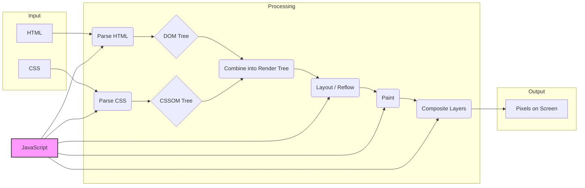
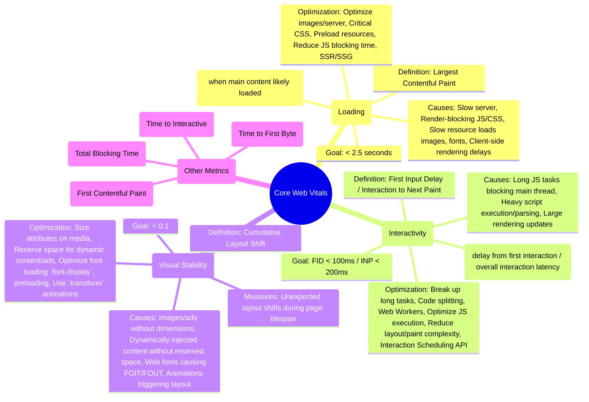

# Chapter 2: Essential Technologies & Concepts Revisited

## Introduction

Building frontend systems that are truly "production-grade" and "scalable," as defined in Chapter 1, requires more than just familiarity with the latest frameworks or libraries. It demands a deep, nuanced understanding of the fundamental technologies and concepts that underpin the entire web platform. While many developers possess a working knowledge of JavaScript, HTML, CSS, and browser APIs, scaling applications effectively necessitates revisiting these essentials through the lens of performance, maintainability, robustness, and developer experience under pressure.

This chapter dives back into these core building blocks, but with a specific focus relevant to large-scale systems. We won't just cover _what_ these technologies are, but _how_ they behave in complex scenarios, _where_ their limitations lie, and _how_ to leverage their advanced features (and avoid their pitfalls) to build resilient and performant applications. Mastering these fundamentals is not about academic purity; it's about making informed architectural decisions, diagnosing complex bugs, optimizing critical user journeys, and ultimately, ensuring your frontend can evolve and scale gracefully over time. Consider this the bedrock upon which the advanced patterns and architectures in subsequent chapters will be built.

---

## A. Modern JavaScript (ESNext and Beyond) for Scale

Modern JavaScript (often referred to as ESNext, encompassing ES6 and subsequent yearly updates) provides powerful features crucial for managing the complexity inherent in large applications. However, using these features effectively at scale requires more than surface-level knowledge.

### 1. Asynchronous Programming Deep Dive: Promises, async/await, Event Loop Internals

Asynchronous operations are ubiquitous in frontend development (fetching data, handling user input, animations). Managing them poorly leads to unresponsive UIs, race conditions, and hard-to-debug errors.

- **Promises:** Represent the eventual result of an asynchronous operation. They provide a cleaner way to handle callbacks (`.then()`, `.catch()`, `.finally()`) and chain asynchronous actions. Key concepts include states (pending, fulfilled, rejected) and avoiding the "callback hell."
- **`async/await`:** Syntactic sugar built on top of Promises, allowing asynchronous code to be written in a more synchronous-looking style. This significantly improves readability and maintainability, especially for complex sequences of asynchronous operations. However, it's crucial to remember that `async` functions return Promises implicitly, and `await` pauses _only_ the execution of the `async` function, not the entire JavaScript engine.
- **Event Loop Internals:** Understanding the event loop is critical for performance. JavaScript is single-threaded, meaning it can only execute one piece of code at a time. The event loop orchestrates the execution of code, handling events and messages from various sources.
  - **Call Stack:** Where function execution contexts are pushed and popped.
  - **Callback Queue (Task Queue / Macrotask Queue):** Holds tasks ready to be executed (e.g., `setTimeout`, `setInterval`, I/O, UI rendering events). Tasks are moved to the call stack only when the stack is empty.
  - **Microtask Queue:** Holds microtasks (e.g., Promise `.then`/`.catch`/`.finally` callbacks, `queueMicrotask`, `MutationObserver` callbacks). Microtasks have higher priority than macrotasks. The microtask queue is processed _after_ the current synchronous script execution finishes and _after each_ macrotask completes, before the browser considers rendering updates or processing the next macrotask.

> **Understanding Microtasks vs. Macrotasks:** Failure to distinguish between these can lead to unexpected behavior. For instance, an infinite loop created by recursively scheduling microtasks (e.g., a Promise resolving and immediately scheduling another `then` that does the same) can completely block rendering and subsequent macrotasks, freezing the UI. Conversely, using `setTimeout(fn, 0)` schedules a macrotask, yielding the main thread briefly.

### 2. Modules and Code Organization Strategies (ESM, CJS nuances)

As applications grow, effective code organization becomes paramount. JavaScript modules provide the mechanism for splitting code into reusable, maintainable units.

- **ES Modules (ESM):** The standard module system for the browser and modern Node.js. Uses `import` and `export` syntax.
  - **Static Analysis:** ESM is designed for static analysis, allowing build tools to perform optimizations like tree-shaking (removing unused code) more effectively.
  - **Asynchronous Loading:** Supports dynamic `import()`, which returns a Promise, enabling code-splitting and lazy-loading of features.
  - **Browser Native:** Supported directly by modern browsers.
- **CommonJS (CJS):** The traditional module system used by Node.js. Uses `require()` and `module.exports`.
  - **Synchronous:** `require()` is synchronous, which can be problematic in browser environments or for optimizations.
  - **Less Tree-Shakeable:** Its dynamic nature makes static analysis harder compared to ESM.
- **Nuances & Interoperability:** While Node.js now supports ESM, interoperability between ESM and CJS can still present challenges, especially within complex build toolchains or when dealing with older libraries. Understanding how bundlers (like Webpack, Rollup, esbuild) handle these different module types is crucial for production builds.

> **Strategy:** For modern frontend development, **prefer ESM** for its static analysis benefits, native browser support, and dynamic import capabilities, which are essential for code-splitting and performance optimization in large applications.

### 3. Advanced Language Features: Generators, Proxies, Decorators (Use Cases & Pitfalls)

Beyond the everyday features, JavaScript offers advanced capabilities that can solve specific problems elegantly, but also introduce complexity if misused.

- **Generators (`function*`, `yield`):** Functions that can be paused and resumed.
  - **Use Cases:** Implementing iterators, managing complex asynchronous flows (though often superseded by `async/await`), creating state machines, handling infinite data streams. Libraries like Redux Saga use generators extensively for managing side effects.
  - **Pitfalls:** Can make control flow harder to follow than `async/await` for simple async tasks; potential for increased cognitive load.
- **Proxies (`new Proxy(target, handler)`):** Allow creating an object that wraps another object ("target"), intercepting fundamental operations (like property lookup, assignment, function invocation) via a "handler" object containing traps.
  - **Use Cases:** Validation, data binding (framework reactivity systems like Vue 3), logging/tracing property access, implementing security controls, default/virtual properties.
  - **Pitfalls:** Performance overhead compared to direct object access (though often negligible unless used in extremely hot code paths); can obscure behavior if overused; debugging can be more complex.
- **Decorators (Stage 3 Proposal as of writing):** A syntax for wrapping/modifying class declarations, methods, accessors, properties, or parameters. Often used with transpilers like Babel or TypeScript.
  - **Use Cases:** Adding metadata, dependency injection, aspect-oriented programming (e.g., logging method calls, performance monitoring), simplifying boilerplate in frameworks (e.g., Angular, MobX).
  - **Pitfalls:** Still a proposal (syntax/semantics might change slightly); reliance on transpilation; can make code harder to understand if logic becomes too implicit; potential for runtime overhead depending on implementation.

### 4. Memory Management in JavaScript: Avoiding Leaks in Long-Running Applications

JavaScript uses automatic memory management via a garbage collector (GC). The GC periodically identifies and reclaims memory occupied by objects that are no longer reachable from the root (e.g., global objects, stack variables). However, memory leaks can still occur in long-running Single Page Applications (SPAs) if references to objects are unintentionally kept alive.

- **Common Leak Sources:**
  - **Accidental Globals:** Variables declared without `let`, `const`, or `var` inside functions can become properties of the global object (`window` in browsers).
  - **Detached DOM Nodes:** Keeping references (e.g., in component state, closures) to DOM nodes that have been removed from the document prevents them and their children from being garbage collected.
  - **Lingering Event Listeners:** Adding event listeners but forgetting to remove them when the associated element or component is destroyed. The listener's closure can keep references to its scope alive.
  - **Closures:** Closures can inadvertently keep references to large objects or scopes alive longer than necessary.
  - **Timers (`setInterval`, `setTimeout`):** Callbacks for timers that are never cleared (`clearInterval`, `clearTimeout`) can keep references alive.
  - **Caches:** In-memory caches that grow indefinitely without eviction policies.
- **Detection & Prevention:**
  - **Browser DevTools:** The Memory tab (Heap Snapshots, Allocation Timelines) is essential for identifying leaks. Look for detached DOM trees and objects growing unexpectedly over time.
  - **WeakRef & FinalizationRegistry:** Newer JS features (`WeakRef`, `FinalizationRegistry`) provide ways to hold weak references to objects (allowing them to be GC'd) and run cleanup logic when an object is collected, useful for managing caches or external resources. Use with caution as GC timing is unpredictable.
  - **Cleanup Logic:** Implement cleanup logic in component lifecycle methods (e.g., `useEffect` cleanup function in React, `ngOnDestroy` in Angular, `unmounted` in Vue) to remove listeners, clear timers, and release resources.

### 5. [Code Snippet: Advanced async patterns for complex flows]

```javascript
// Example: Fetching primary data and then related secondary data in parallel,
// with cancellation support using AbortController.

async function fetchUserDataAndPosts(userId, signal) {
  console.log(`Fetching data for user ${userId}...`);
  try {
    // Fetch user data first
    const userResponse = await fetch(`/api/users/${userId}`, { signal });
    if (!userResponse.ok)
      throw new Error(`Failed to fetch user: ${userResponse.statusText}`);
    const user = await userResponse.json();
    console.log(`Fetched user: ${user.name}`);

    // Fetch user's posts and settings in parallel
    console.log(`Fetching posts and settings for user ${userId}...`);
    const [postsResponse, settingsResponse] = await Promise.all([
      fetch(`/api/users/${userId}/posts`, { signal }),
      fetch(`/api/users/${userId}/settings`, { signal }),
    ]);

    // Check both responses before proceeding
    if (!postsResponse.ok)
      throw new Error(`Failed to fetch posts: ${postsResponse.statusText}`);
    if (!settingsResponse.ok)
      throw new Error(
        `Failed to fetch settings: ${settingsResponse.statusText}`
      );

    const [posts, settings] = await Promise.all([
      postsResponse.json(),
      settingsResponse.json(),
    ]);
    console.log(`Fetched ${posts.length} posts and settings.`);

    return { user, posts, settings };
  } catch (error) {
    if (error.name === "AbortError") {
      console.log("Fetch operation aborted.");
      // Return null or a specific indicator for cancellation
      return null;
    } else {
      console.error("Error fetching user data and posts:", error);
      // Production-grade error handling would involve logging this error
      // to a monitoring service with context (userId, etc.)
      throw error; // Re-throw for higher-level handling if needed
    }
  }
}

// Usage with AbortController for cancellation
const controller = new AbortController();
const { signal } = controller;

const fetchDataPromise = fetchUserDataAndPosts(123, signal);

// Example: Cancel the request after 5 seconds if it hasn't completed
const timeoutId = setTimeout(() => {
  console.log("Request timed out, aborting...");
  controller.abort();
}, 5000);

fetchDataPromise
  .then((data) => {
    clearTimeout(timeoutId); // Clear the timeout if fetch completes successfully
    if (data) {
      console.log("Successfully fetched all data:", data);
      // Process the data...
    } else {
      console.log("Data fetching was cancelled.");
    }
  })
  .catch((error) => {
    clearTimeout(timeoutId); // Clear timeout on error too
    console.error("Unhandled error at top level:", error);
    // Display error message to the user, report error, etc.
  });
```

_This snippet demonstrates combining `async/await` with `Promise.all` for parallel execution and using `AbortController` for robust cancellation, essential for complex user interactions or background tasks in large applications._

### 6. [Production Note: Transpilation strategies and browser compatibility targets]

Modern JavaScript features often require **transpilation** (converting newer syntax to older, more widely compatible syntax) using tools like Babel, and potentially **polyfills** (providing implementations for missing features) via libraries like `core-js`.

- **Strategy:** Configure your build process (e.g., via `babel.config.js` or framework presets) to target specific browser versions. Tools like `browserslist` provide a standard way to define these targets (e.g., `> 0.5%, last 2 versions, Firefox ESR, not dead`).
- **Trade-offs:** Targeting older browsers increases bundle size due to more transpilation and polyfills. Targeting only modern browsers reduces bundle size but excludes users on older systems.
- **Production Goal:** Strike a balance based on your user demographics and application requirements. Use analytics to understand your users' browsers. Consider differential loading (serving modern bundles to modern browsers and legacy bundles to older ones) for optimal performance. Avoid overly aggressive transpilation that unnecessarily bloats bundles for the majority of your users.

---

## B. HTML & CSS Architecture for Maintainability and Performance

HTML and CSS are the visual and structural backbone of the web. In large-scale applications, how you structure your HTML and architect your CSS significantly impacts maintainability, performance, accessibility, and team collaboration.

### 1. Semantic HTML for Accessibility and SEO

Using HTML elements according to their semantic meaning is crucial, especially at scale.

- **Benefits:**
  - **Accessibility (a11y):** Screen readers and other assistive technologies rely on semantic markup (`<nav>`, `<main>`, `<article>`, `<aside>`, `<button>`, proper heading levels `<h1>`-`<h6>`) to understand page structure and provide navigation. Using `<div>` or `<span>` for everything forces reliance on ARIA attributes, which are harder to maintain correctly.
  - **SEO:** Search engines use semantic markup to understand content hierarchy and relevance.
  - **Maintainability:** Semantic HTML makes the structure self-documenting and easier for developers to understand and modify.
  - **Browser Functionality:** Native elements like `<button>`, `<input>`, `<details>` come with built-in keyboard accessibility and state management.
- **Production Impact:** Non-semantic HTML leads to poor accessibility (excluding users, potential legal issues), hinders SEO, and makes the codebase harder to reason about and refactor as the application grows.

> **Example: Semantic vs. Non-Semantic Button**
>
> **Non-Semantic (Bad):** `<div class="button" onclick="doSomething()">Click Me</div>` - Requires manual addition of `role="button"`, `tabindex="0"`, and keyboard event handling (Enter/Space) for basic accessibility.
>
> **Semantic (Good):** `<button type="button" class="button" onclick="doSomething()">Click Me</button>` - Inherently focusable, keyboard accessible, and announced correctly by screen readers.

### 2. Advanced CSS: Custom Properties, Houdini APIs, Container Queries

Modern CSS offers powerful features for creating dynamic, maintainable, and performant styling systems.

- **CSS Custom Properties (Variables):** `--variable-name: value;` and `var(--variable-name)`.
  - **Use Cases:** Theming (easily switch color palettes, spacing units), sharing values between CSS and JavaScript, creating more maintainable design systems, component-level configuration.
  - **Benefits at Scale:** Centralize design tokens, reduce redundancy, enable dynamic updates without JS manipulation in many cases.
- **Houdini APIs:** A collection of low-level browser APIs exposing parts of the CSS engine, allowing developers to extend CSS via JavaScript. Key APIs include:
  - **Paint API:** Draw directly into an element's background, border, or content via a `paintWorklet`. (Use cases: complex gradients, custom borders, visualizations).
  - **Properties & Values API:** Define typed custom properties with default values and inheritance control.
  - **Layout API:** Implement custom layout modes (e.g., masonry). (Still experimental in most browsers).
  - **Benefits:** Enables performance gains by moving rendering logic off the main thread (worklets); unlocks previously impossible styling capabilities.
  - **Caveats:** Browser support is still evolving for some APIs; requires JavaScript.
- **Container Queries (`@container`):** Allow components to adapt their styles based on the size of their _container_ element, rather than the viewport size (like media queries).
  - **Use Cases:** Creating truly reusable components that adapt correctly regardless of where they are placed in the layout (e.g., a card component displaying differently in a narrow sidebar vs. a wide main content area).
  - **Benefits at Scale:** Decouples component styling from page layout, leading to more modular and reusable UI components. Reduces the need for complex JavaScript-based resize observers for styling adjustments.

### 3. CSS Methodologies at Scale (BEM, CUBE CSS, Utility-First, etc.) - Pros & Cons

A consistent CSS methodology is vital for preventing style conflicts, improving readability, and enabling collaboration in large teams.

- **BEM (Block, Element, Modifier):** Naming convention (`.block__element--modifier`).
  - **Pros:** Explicit, reduces specificity conflicts, clear structure, widely understood.
  - **Cons:** Can lead to long class names, potentially verbose HTML.
- **CUBE CSS (Composition, Utility, Block, Exception):** Methodology focusing on composing styles primarily with utilities, using blocks for specific components, and exceptions for overrides. Emphasizes intrinsic design principles.
  - **Pros:** Promotes consistency, leverages CSS cascade and modern features (custom properties, `clamp()`), encourages thinking in terms of design systems.
  - **Cons:** Steeper learning curve than BEM, requires a well-defined utility/token system.
- **Utility-First (e.g., Tailwind CSS):** Relies heavily on atomic CSS classes (`.flex`, `.pt-4`, `.text-red-500`) applied directly in HTML.
  - **Pros:** Rapid prototyping, avoids naming collisions, excellent tooling (PurgeCSS for small bundles), promotes consistency via predefined utilities, scales well as components don't directly depend on each other's styles.
  - **Cons:** Can make HTML very verbose ("class soup"), styling logic is mixed with structure, requires discipline to avoid one-off utility combinations, potential learning curve for the utility set.
- **CSS Modules:** Scopes class names locally to components (often by hashing them during build), preventing global conflicts. Usually used with frameworks/bundlers.
  - **Pros:** True style encapsulation, avoids naming collisions, allows simple class names within components.
  - **Cons:** Requires build tooling, harder to override styles from outside the component (which can be a pro or con), global styles still need careful management.

> **Choosing a Methodology:** The "best" choice depends on team size, project complexity, framework usage, and team preference. The key is **consistency**. Utility-first often scales well for large teams due to reduced merge conflicts and inherent constraints, while methodologies like BEM or CUBE CSS (often combined with CSS Modules or Scoped CSS) provide strong encapsulation for component libraries.

### 4. CSS-in-JS vs. Traditional CSS vs. Hybrid Approaches: A Deep Comparison

How CSS is authored and applied is a major architectural decision.

- **Traditional CSS (Sass/Less/PostCSS, CSS Modules):** Writing CSS in `.css`, `.scss`, or `.less` files, often processed by preprocessors and bundled. CSS Modules provide local scoping.
  - **Pros:** Separation of concerns (structure vs. style), leverages browser caching effectively, mature tooling, well-understood, potentially better runtime performance (no JS overhead for style injection).
  - **Cons:** Global namespace collisions (without Modules/methodologies), managing dependencies between styles and components can be manual, dynamic styling often requires manipulating classes/styles via JS.
- **CSS-in-JS (e.g., Styled Components, Emotion):** Writing CSS directly within JavaScript component files, often using tagged template literals or object styles. Styles are typically scoped automatically and can easily leverage component props/state.
  - **Pros:** Colocation of styles and component logic, automatic scoping, easy dynamic styling based on props/state, facilitates component-based thinking, potential for critical CSS extraction per component.
  - **Cons:** Potential runtime overhead (style injection/computation), can increase JS bundle size, potential for CSS duplication if not managed carefully, slightly steeper learning curve, server-side rendering (SSR) requires specific setup. Some newer zero-runtime CSS-in-JS libraries mitigate performance concerns.
- **Hybrid Approaches:** Combining methods, e.g., using a utility framework (like Tailwind) for layout and basic styling, and CSS Modules or CSS-in-JS for complex, stateful component styles.
  - **Pros:** Can leverage the strengths of each approach, flexibility.
  - **Cons:** Requires clear guidelines on when to use which approach to maintain consistency, potentially more complex tooling setup.

> **Production Considerations:** Performance (runtime overhead vs. bundle size), developer experience (colocation vs. separation), ease of theming, SSR compatibility, and team familiarity are key factors in choosing an approach for a large-scale project. There's no single winner; evaluate the trade-offs in your specific context.

### 5. [Practical Example: Structuring CSS for a large component library]

Imagine building a reusable `Button` component for a design system.

**Approach using CSS Modules and Custom Properties:**

```css
/* src/components/Button/Button.module.css */
.button {
  /* Base styles */
  display: inline-flex;
  align-items: center;
  justify-content: center;
  padding: var(--spacing-small) var(--spacing-medium); /* Use design tokens */
  border: 1px solid transparent;
  border-radius: var(--border-radius-default);
  font-family: var(--font-family-base);
  font-size: var(--font-size-medium);
  cursor: pointer;
  transition: background-color 0.2s ease, border-color 0.2s ease,
    color 0.2s ease;
  text-decoration: none; /* For link buttons */
  white-space: nowrap;

  /* Default variant: primary */
  background-color: var(--color-primary-500);
  color: var(--color-white);
  border-color: var(--color-primary-500);
}

.button:hover {
  background-color: var(--color-primary-600);
  border-color: var(--color-primary-600);
}

.button:focus-visible {
  /* Accessibility */
  outline: 2px solid var(--color-focus-ring);
  outline-offset: 2px;
}

.button:disabled {
  background-color: var(--color-disabled-bg);
  border-color: var(--color-disabled-border);
  color: var(--color-disabled-text);
  cursor: not-allowed;
}

/* Variant: secondary */
.secondary {
  background-color: var(--color-secondary-100);
  color: var(--color-secondary-700);
  border-color: var(--color-secondary-300);
}
.secondary:hover {
  background-color: var(--color-secondary-200);
  border-color: var(--color-secondary-400);
}
/* ... other variants (danger, ghost) ... */

/* Size modifier */
.large {
  padding: var(--spacing-medium) var(--spacing-large);
  font-size: var(--font-size-large);
}

/* Icon support */
.icon {
  margin-right: var(--spacing-xsmall);
  display: inline-block; /* Or flex alignment */
  vertical-align: middle;
}
```

```jsx
// src/components/Button/Button.jsx (React Example)
import React from "react";
import styles from "./Button.module.css";
import clsx from "clsx"; // Utility for conditional classes

const Button = ({
  children,
  variant = "primary", // 'primary', 'secondary', 'danger'
  size, // 'large'
  disabled = false,
  onClick,
  href, // If used as a link
  className, // Allow external classes
  icon: IconComponent, // Optional icon component
  ...props
}) => {
  const Tag = href ? "a" : "button";

  const buttonClasses = clsx(
    styles.button,
    styles[variant], // Apply variant class e.g., styles.secondary
    size && styles[size], // Apply size class if provided e.g., styles.large
    className // Merge external classes
  );

  return (
    <Tag
      className={buttonClasses}
      onClick={Tag === "button" ? onClick : undefined}
      href={href}
      disabled={Tag === "button" ? disabled : undefined}
      aria-disabled={disabled} // Important for accessibility, especially for links styled as buttons
      {...props}
    >
      {IconComponent && (
        <span className={styles.icon}>
          <IconComponent />
        </span>
      )}
      {children}
    </Tag>
  );
};

export default Button;
```

_This example demonstrates:_

- **Encapsulation:** CSS Modules scope styles locally.
- **Design Tokens:** Using CSS Custom Properties (`var(--...)`) for theming and consistency.
- **Composition:** Combining base styles with variant and modifier classes.
- **Accessibility:** Considering `:focus-visible` and `aria-disabled`.
- **Flexibility:** Allowing external class names and optional icons.

### 6. [Production Note: Critical CSS and reducing render-blocking resources]

CSS files are typically **render-blocking resources**. The browser must download and parse CSS files referenced in the `<head>` before it can construct the render tree and paint pixels to the screen. Large CSS files, especially on slow networks, significantly delay the First Contentful Paint (FCP) and Largest Contentful Paint (LCP).

- **Critical CSS:** The minimal set of CSS required to render the above-the-fold content of a page.
- **Strategy:**
  1.  **Identify Critical CSS:** Use automated tools (like `critical`, `penthouse`) or manual analysis to determine the styles needed for the initial viewport.
  2.  **Inline Critical CSS:** Embed this critical CSS directly within a `<style>` tag in the `<head>` of the HTML document. This allows the browser to start rendering the initial view immediately without waiting for an external CSS file.
  3.  **Load Remaining CSS Asynchronously:** Load the full CSS file non-blockingly. This can be done using `<link rel="preload" href="styles.css" as="style" onload="this.onload=null;this.rel='stylesheet'">` or via JavaScript after the page load.
- **Benefits:** Dramatically improves perceived performance and metrics like FCP/LCP.
- **Challenges:** Automating critical CSS extraction accurately across different routes and user states can be complex. It requires careful integration into the build process. Over-inlining can bloat the initial HTML payload.

---

## C. Browser Internals: The Foundation of Performance

Understanding how browsers work under the hood – parsing code, rendering pixels, handling events, managing resources – is fundamental to diagnosing performance bottlenecks and building efficient applications.

### 1. The Rendering Pipeline: Parsing, Style Calculation, Layout, Paint, Compositing

Browsers go through several steps to turn HTML, CSS, and JavaScript into pixels on the screen. Understanding this pipeline helps identify costly operations.



_This diagram shows the typical browser rendering pipeline. HTML and CSS are parsed into the DOM and CSSOM, combined into the Render Tree, which is then used for Layout (calculating geometry), Paint (filling in pixels for layers), and Compositing (assembling layers onto the screen). JavaScript can interact with and trigger various stages of this pipeline._

- **Parse HTML:** The browser parses the HTML markup into a Document Object Model (DOM) tree.
- **Parse CSS:** The browser parses CSS (external, internal, inline) into a CSS Object Model (CSSOM) tree.
- **Style Calculation:** The browser combines the DOM and CSSOM to determine the computed styles for each DOM node. This results in a Render Tree (or Frame Tree), which includes only the elements that will be visually rendered (e.g., `display: none` elements are excluded).
- **Layout (Reflow/Relayout):** The browser calculates the exact size and position of each element in the Render Tree based on the computed styles and viewport dimensions. This is often the most computationally expensive step. Changing geometry properties (width, height, top, left, font-size affecting layout) triggers layout.
- **Paint:** The browser fills in the actual pixels for each element onto distinct layers (rasters). This involves drawing text, colors, images, borders, shadows, etc. Changing visual properties like `background-color`, `color`, `box-shadow` (that don't affect layout) triggers paint.
- **Compositing:** The browser draws the different layers to the screen in the correct order. Operations that only affect compositing (like `transform: translate()`, `opacity`) are the cheapest, as they can often be handled efficiently by the GPU without triggering layout or paint on the main thread.

> **Performance Goal:** Minimize the work done in Layout and Paint, and prefer operations that only trigger Compositing, especially during animations or interactions.

### 2. The Event Loop Revisited: Macro & Microtasks in Detail

As mentioned in the JavaScript section, the event loop orchestrates task execution. A deeper understanding is crucial for UI responsiveness.

- **Macrotasks (Tasks):** Include `setTimeout`, `setInterval`, `setImmediate` (Node.js), I/O operations, UI rendering updates (e.g., handling clicks, running layout/paint). The browser typically performs rendering updates _between_ macrotasks (if needed and time permits).
- **Microtasks:** Include Promise callbacks (`.then`/`.catch`/`.finally`), `queueMicrotask()`, `MutationObserver` callbacks, `process.nextTick` (Node.js). The microtask queue is processed _immediately_ after the currently executing script finishes, and _after each macrotask_, before yielding back to the event loop or performing rendering updates.
- **Implications:**
  - **Responsiveness:** Long-running JavaScript (either a single synchronous script or a tight loop of microtasks) blocks the main thread, preventing the browser from processing user input (leading to high FID/INP) or rendering updates (jank).
  - **Microtask Starvation:** If microtasks continuously queue more microtasks, they can potentially starve macrotasks (like rendering or `setTimeout`) indefinitely, although browsers have mechanisms to mitigate the worst cases.
  - **Predictability:** Understanding the order helps predict when state updates triggered by Promises will become visible relative to other events or timeouts.

### 3. Browser Storage Mechanisms: Cookies, LocalStorage, SessionStorage, IndexedDB (Use Cases & Limits)

Browsers offer various ways to store data client-side. Choosing the right mechanism depends on data size, persistence needs, and access patterns.

- **Cookies:**
  - **Mechanism:** Small key-value pairs sent with _every_ HTTP request to the associated domain. Set by the server (`Set-Cookie` header) or client (`document.cookie`).
  - **Use Cases:** Session management (auth tokens), tracking, user preferences (that need server awareness).
  - **Limits:** Small size (~4KB per cookie, ~20 cookies per domain), performance overhead (added to every request), security concerns (CSRF - mitigated by `SameSite` attribute). Synchronous access via `document.cookie`.
- **LocalStorage:**
  - **Mechanism:** Key-value store (strings only). Data persists even after the browser is closed.
  - **Use Cases:** Storing user preferences, offline application data (small amounts), feature flags fetched once.
  - **Limits:** ~5-10MB per origin (browser-dependent), **synchronous API** (`localStorage.getItem/setItem`) which can block the main thread if used excessively or with large data. Data is not automatically sent to the server. Vulnerable to XSS.
- **SessionStorage:**
  - **Mechanism:** Same API as `LocalStorage`, but data persists only for the duration of the browser _session_ (until the tab/window is closed).
  - **Use Cases:** Storing temporary session-specific data (e.g., user input in a multi-step form before submission), temporary state that shouldn't persist across sessions.
  - **Limits:** Same as `LocalStorage` (~5-10MB, synchronous API), but data is cleared on session end. Vulnerable to XSS.
- **IndexedDB:**
  - **Mechanism:** A transactional, asynchronous, object-oriented database in the browser. Allows storing large amounts of structured data (including files/blobs) and creating indexes for efficient querying.
  - **Use Cases:** Storing large amounts of application data for offline support (PWAs), caching complex data structures, client-side search indexes.
  - **Limits:** Asynchronous API (Promise-based or older callback-based) is more complex than `LocalStorage`. Size limits are generally much larger (can be hundreds of MB or more, often based on available disk space, user permission may be required). Slower than in-memory storage for simple lookups.
- **Cache API (Service Workers):** Primarily used by Service Workers to cache network requests and responses, crucial for offline support and performance.

> **Production Choice:** Use Cookies only when server interaction is needed for that data on every request (like auth tokens). Prefer `LocalStorage`/`SessionStorage` for small, simple, non-critical data due to the simple API, but be mindful of the synchronous blocking nature. Use **IndexedDB** for larger, structured data or when asynchronous access is essential for performance. Avoid storing sensitive information in `LocalStorage`/`SessionStorage` due to XSS risks.

### 4. Networking Stack: HTTP/2, HTTP/3, Caching Mechanisms (Browser & CDN)

Efficiently loading resources over the network is critical for performance.

- **HTTP/1.1:** Suffers from Head-of-Line (HOL) blocking (requests/responses on the same TCP connection must complete sequentially). Browsers open multiple connections (typically 6 per domain) to parallelize downloads, but this has overhead.
- **HTTP/2:**
  - **Multiplexing:** Allows multiple requests and responses to be interleaved over a single TCP connection, eliminating HOL blocking at the HTTP layer.
  - **Header Compression (HPACK):** Reduces overhead from redundant HTTP headers.
  - **Server Push (Less common now):** Allows servers to proactively send resources the client might need.
  - **Benefit:** Faster loading, especially on high-latency connections, reduced server/client resource usage compared to multiple HTTP/1.1 connections. Requires HTTPS.
- **HTTP/3:**
  - **QUIC Protocol:** Runs over UDP instead of TCP. Integrates TLS encryption.
  - **Solves TCP HOL Blocking:** Packet loss on one stream doesn't block other streams within the same connection (unlike TCP).
  - **Faster Connection Establishment:** Reduced round trips for establishing secure connections.
  - **Benefit:** Improved performance, especially on unreliable networks (mobile). Requires server and infrastructure support. Requires HTTPS.
- **Caching Mechanisms:**
  - **Browser Cache (HTTP Cache):** Stores responses locally based on HTTP caching headers (`Cache-Control`, `Expires`, `ETag`, `Last-Modified`). Reduces latency and bandwidth usage for repeat visits.
  - **CDN (Content Delivery Network):** Distributes static assets (JS, CSS, images) across geographically dispersed edge servers. Users fetch assets from the nearest server, reducing latency. CDNs also provide caching layers.
  - **Cache Invalidation:** Ensuring users get updated assets when they change is crucial. Strategies include versioned filenames (`app.[contenthash].js`), query parameters (less effective with some CDNs/proxies), and appropriate `Cache-Control` directives (e.g., short max-age for HTML, long max-age with immutable URLs for assets).

### 5. [Deep Dive: Optimizing layout recalculations (reflows/relayouts)]

Layout is expensive. Triggering it unnecessarily or repeatedly in quick succession ("layout thrashing") can severely impact performance, especially during animations or interactions.

- **What Triggers Layout?**
  - Changing geometry properties: `width`, `height`, `padding`, `margin`, `border`, `top`, `left`, `font-size`, `line-height`, etc.
  - Adding/removing elements from the DOM.
  - Changing element class names that affect layout properties.
  - Resizing the window.
  - **Reading** certain geometric properties _after_ making changes that invalidate layout. This forces the browser to perform a **synchronous layout** immediately. Examples include: `offsetTop`, `offsetLeft`, `offsetWidth`, `offsetHeight`, `scrollTop`, `scrollLeft`, `scrollWidth`, `scrollHeight`, `clientTop`, `clientLeft`, `clientWidth`, `clientHeight`, `getComputedStyle()`, `getBoundingClientRect()`.
- **Layout Thrashing:** Occurs when JavaScript repeatedly writes (changes styles/DOM) and then reads geometric properties within a single frame, forcing multiple synchronous layouts.

```javascript
// BAD: Layout Thrashing Example
function resizeBoxes(boxes) {
  boxes.forEach((box) => {
    // READ: Forces layout calculation for the *first* box
    const currentWidth = box.offsetWidth;

    // WRITE: Invalidates layout
    box.style.width = currentWidth / 2 + "px";
    // READ (Implicit in loop): Next iteration reads offsetWidth, forcing *another* layout
  });
}

// GOOD: Batching Reads and Writes
function resizeBoxesOptimized(boxes) {
  // BATCH READS
  const widths = boxes.map((box) => box.offsetWidth); // Read all widths first

  // BATCH WRITES
  boxes.forEach((box, index) => {
    box.style.width = widths[index] / 2 + "px"; // Write all widths
  });
  // Layout will only be calculated once (or lazily later)
}
```

- **Optimization Strategies:**
  - **Batch Reads/Writes:** Perform all necessary DOM reads first, then perform all DOM writes.
  - **Use `requestAnimationFrame`:** Schedule visual updates within `requestAnimationFrame` callbacks. This ensures your code runs just before the browser performs layout and paint for the next frame, naturally batching operations.
  - **Avoid Layout in Loops:** Don't query geometric properties inside loops where styles or the DOM are being modified.
  - **Use `transform` and `opacity`:** For animations and transitions, prefer `transform: translate() / scale() / rotate()` and `opacity` as they typically only trigger compositing, avoiding layout and paint.
  - **CSS Containment (`contain` property):** Hint to the browser about the scope of layout and paint calculations for an element, potentially isolating rendering work (`contain: layout paint;` or `contain: strict;`).

### 6. [Troubleshooting Section: Diagnosing rendering bottlenecks using DevTools]

Browser Developer Tools are indispensable for finding performance issues.

- **Performance Tab:**
  - **Record Runtime Performance:** Capture a trace of browser activity during interaction or page load.
  - **Main Thread Activity:** Look for long tasks (red-flagged blocks > 50ms) which indicate main thread blockage. Identify what's causing them (Scripting, Rendering, Painting).
  - **Frames View:** Look for dropped frames (red frames) indicating jank. Analyze the work done in slow frames.
  - **Bottom-Up / Call Tree / Event Log:** Analyze which functions or events are consuming the most time. Look for expensive `Layout`, `Paint`, `Update Layer Tree`, or `Composite Layers` events. Identify forced synchronous layouts (often shown as purple "Layout" blocks triggered directly by script).
- **Rendering Tab (Chrome/Edge) / Paint Flashing (Firefox):**
  - **Paint Flashing:** Highlights areas of the screen being repainted in green. Helps identify unexpected or excessive painting.
  - **Layout Shift Regions:** Highlights areas that shifted during rendering (related to CLS).
  - **Layer Borders:** Visualizes compositor layers. Helps understand which elements are being promoted to layers and how they interact. Useful for debugging compositing costs.
- **Lighthouse Panel (Chrome):** Run audits to get performance scores (including Core Web Vitals) and specific optimization opportunities.

> **Workflow:** Start with Lighthouse for high-level issues. Use the Performance tab to record and analyze specific interactions or load sequences causing jank or delays. Use the Rendering tab for visual debugging of paint and layout issues.

---

## D. Core Web Vitals and User-Centric Performance Metrics

Performance isn't just about load time; it's about the user's _experience_. Google's Core Web Vitals (CWV) initiative focuses on metrics that quantify key aspects of user experience: loading, interactivity, and visual stability. Optimizing for these is crucial for user satisfaction and often impacts SEO rankings.



_This mindmap illustrates the three Core Web Vitals (LCP, FID/INP, CLS), their focus areas (Loading, Interactivity, Visual Stability), common causes for poor scores, and high-level optimization strategies. It also notes other relevant performance metrics._

### 1. LCP (Largest Contentful Paint): Measurement and Optimization

- **What it measures:** The render time of the largest image or text block visible within the viewport, relative to when the page first started loading. A good proxy for when the main content of the page has loaded.
- **Good Threshold:** <= 2.5 seconds.
- **Common Causes:**
  - Slow server response times (high TTFB).
  - Render-blocking JavaScript and CSS.
  - Slow resource load times (large images, videos, web fonts).
  - Client-side rendering delays (large JS bundles, complex component rendering).
- **Optimization Strategies:**
  - Optimize server response (TTFB improvements: caching, faster backend logic, CDN).
  - Apply Critical CSS and defer non-critical CSS.
  - Optimize images (correct format, compression, responsive images `<picture>`, `srcset`).
  - Preload important resources (`<link rel="preload">` for LCP image, key fonts, critical scripts).
  - Reduce JavaScript blocking time (code splitting, tree shaking, defer/async scripts).
  - Use Server-Side Rendering (SSR) or Static Site Generation (SSG) to deliver rendered HTML faster.

### 2. FID (First Input Delay) / INP (Interaction to Next Paint): Measurement and Optimization

- **FID What it measures:** The time from when a user _first_ interacts with a page (e.g., clicks a button, taps a link) to the time when the browser is actually able to _begin_ processing event handlers in response to that interaction. Measures "first impression" responsiveness.
- **INP What it measures:** A more comprehensive metric measuring the latency of _all_ user interactions throughout the page's lifecycle. It observes the time from the start of the interaction until the next frame is painted reflecting the visual feedback. Represents overall responsiveness. INP is set to replace FID as a Core Web Vital in March 2024.
- **Good Thresholds:** FID <= 100 milliseconds / INP <= 200 milliseconds.
- **Common Causes:** The main thread being busy executing long JavaScript tasks during or shortly after load, preventing it from responding quickly to user input. Heavy event handlers, complex rendering updates triggered by interactions.
- **Optimization Strategies:**
  - **Break up Long Tasks:** Divide long-running JavaScript into smaller chunks using `setTimeout`, `requestIdleCallback`, or async functions to yield control back to the main thread more frequently.
  - **Optimize JavaScript Execution:** Reduce script parsing/compilation/execution time (code splitting, tree shaking, efficient algorithms).
  - **Use Web Workers:** Move non-UI-blocking computation off the main thread.
  - **Defer Non-Critical JavaScript:** Load third-party scripts or non-essential features later.
  - **Optimize Event Handlers:** Keep event callback logic lean; debounce/throttle frequent events like scroll or resize.
  - **Interaction Scheduling API (Experimental):** Provides `scheduler.postTask()` to prioritize tasks.

### 3. CLS (Cumulative Layout Shift): Measurement and Optimization

- **What it measures:** The sum total of all unexpected layout shifts that occur during the entire lifespan of the page. A layout shift happens when a visible element changes its position from one rendered frame to the next without user interaction. Measures visual stability.
- **Good Threshold:** <= 0.1.
- **Common Causes:**
  - Images, iframes, or ads loading without `width` and `height` attributes (browser doesn't know how much space to reserve).
  - Content being dynamically injected above existing content.
  - Web fonts loading causing a Flash of Invisible Text (FOIT) or Flash of Unstyled Text (FOUT), leading to text reflow.
  - Animations that update geometry properties (`width`, `height`, `top`, `left`) instead of CSS `transform`.
- **Optimization Strategies:**
  - **Include `width` and `height` attributes** (or `aspect-ratio` CSS) on all images and video elements.
  - **Reserve space** for dynamically loaded content (e.g., ads, banners, embeds) using placeholders or skeleton loaders with fixed dimensions.
  - **Optimize Font Loading:** Use `font-display: optional` or `font-display: swap` with preloaded fonts to minimize shifting. Ensure fallback fonts have similar metrics.
  - **Prefer `transform` animations** over animations that trigger layout changes.
  - **Avoid inserting content above existing content** unless triggered by user interaction.

### 4. Other Relevant Metrics (TTFB, TTI, FCP)

While not Core Web Vitals, these metrics provide valuable diagnostic information:

- **TTFB (Time to First Byte):** Time between the initial request and the first byte of the response arriving. Reflects server processing time and network latency. High TTFB directly impacts LCP.
- **FCP (First Contentful Paint):** Time when the browser renders the _first_ bit of content from the DOM (text, image, canvas). Indicates the user is seeing _something_.
- **TTI (Time to Interactive):** Time until the page is visually rendered (FCP) and the main thread is free enough (no long tasks) to reliably respond to user input. Often occurs later than LCP or FCP if significant JS needs to execute.
- **TBT (Total Blocking Time):** The sum of time periods between FCP and TTI where the main thread was blocked by a long task (>50ms), preventing input responsiveness. Directly related to FID/INP.

### 5. [Practical Example: Auditing a page for Core Web Vitals improvements]

1.  **Tool:** Use Google PageSpeed Insights (web.dev/measure) or the Lighthouse panel in Chrome DevTools.
2.  **Run Audit:** Analyze a specific URL (preferably a production URL or a realistic staging environment).
3.  **Review CWV Scores:** Check the LCP, INP (or FID), and CLS scores. Identify which metrics are failing or need improvement.
4.  **Examine Opportunities:** Lighthouse provides specific suggestions:
    - **LCP Issue:** Might suggest "Reduce initial server response time" (TTFB), "Eliminate render-blocking resources" (CSS/JS), "Properly size images," or identify the specific LCP element for optimization.
    - **INP/FID Issue:** Might highlight "Reduce JavaScript execution time," "Minimize main thread work," or list specific "Long Tasks" during load or interaction that need breaking up (TBT).
    - **CLS Issue:** Might point to "Image elements do not have explicit width and height," or "Avoid large layout shifts," often highlighting the specific elements causing the shifts.
5.  **Diagnose Further:** Use the Performance tab in DevTools to record load or interaction traces and pinpoint the exact causes identified by Lighthouse (e.g., find the long tasks, see layout shifts visually).
6.  **Implement Fixes:** Apply the relevant optimization strategies (e.g., add image dimensions, implement critical CSS, refactor long JS tasks).
7.  **Re-Audit:** Run the audit again to verify improvements.

### 6. [Configuration Guide: Setting up performance monitoring tools]

While lab tools (Lighthouse, PageSpeed Insights) are great for development, **Real User Monitoring (RUM)** is essential to understand performance for actual users in production.

- **Choose a RUM Provider:** Options include:
  - Google Analytics 4 (GA4): Automatically collects CWV data.
  - Dedicated APM/Monitoring Tools: Sentry, Datadog, New Relic, Dynatrace often include frontend performance monitoring with CWV tracking.
  - Specialized Frontend Monitoring: SpeedCurve, Akamai mPulse.
  - Open Source: Boomerang.js (can send data to various backends).
- **Integration:** Typically involves adding a JavaScript snippet to your application's `<head>`. This script passively observes performance metrics and user interactions and sends the data to the provider's backend.
- **Configuration:**
  - Ensure the script is loaded early and asynchronously/non-blockingly.
  - Configure sampling rates if needed (to manage cost/data volume).
  - Tag data with relevant context (e.g., page route, user segment, application version, A/B test variant) to allow for effective filtering and analysis.
- **Analysis:** Use the provider's dashboard to:
  - Track CWV trends over time (p75 or p90 values are often most relevant).
  - Segment data by browser, device type, geography, page type, etc.
  - Identify pages or user segments experiencing poor performance.
  - Set up alerts for regressions in key metrics.

> **Production Imperative:** Lab data shows potential, but RUM data shows reality. Continuously monitor CWV and other performance metrics in production to catch regressions and understand the real-world impact of your optimizations.

---

## Conclusion

This chapter revisited the foundational pillars of frontend development – JavaScript, HTML, CSS, browser internals, and performance metrics – but through the critical lens required for building production-grade, scalable systems. A superficial understanding is insufficient when dealing with complexity, performance demands, and the need for long-term maintainability.

Mastering asynchronous JavaScript patterns, architecting maintainable and performant CSS, understanding the browser's rendering pipeline and networking stack, and prioritizing user-centric performance metrics like the Core Web Vitals are not optional extras; they are prerequisites. The concepts explored here – from memory management and module strategies to layout thrashing and critical CSS – form the essential knowledge base upon which the architectural patterns, state management strategies, and tooling choices discussed in the following chapters depend. Without this solid foundation, attempts to scale frontend applications often lead to brittle, slow, and unmaintainable systems.
