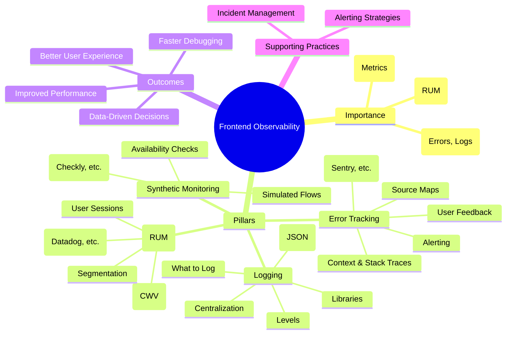

# Chapter 20: Monitoring, Logging, and Alerting for Frontend Systems

Deploying a frontend application to production is not the end of the journey; it's the beginning of its operational life. Once live, understanding how the application behaves in the real world, how users interact with it, and how it performs under various conditions becomes paramount. Without visibility into the running system, developers are flying blind, unable to diagnose issues effectively, measure the impact of new features, or ensure a consistent user experience. This chapter delves into the critical practices of monitoring, logging, and alerting specifically tailored for frontend systems – collectively known as frontend observability.

Observability is more than just collecting data; it's about being able to ask arbitrary questions about your system's state without having to know beforehand what you wanted to ask. For frontend systems, this means understanding not just _if_ something broke, but _why_, _for whom_, _under what conditions_, and _what the impact was_.

## A. The Importance of Frontend Observability

Traditional monitoring often focused heavily on backend systems – server health, database queries, API response times. However, the increasing complexity of frontend applications, the rise of Single Page Applications (SPAs), and the critical role the frontend plays in the overall user experience necessitate dedicated observability strategies for the client-side.

> **Definition: Frontend Observability**
> Frontend Observability is the practice of instrumenting frontend applications to collect data (logs, metrics, traces) that allows development and operations teams to understand the application's behavior, performance, and health from the perspective of the end-user's browser.

### 1. Understanding Real User Experience

Backend metrics might indicate that APIs are fast and servers are healthy, but this doesn't guarantee a good user experience. Slow rendering times, JavaScript errors, unresponsive UI elements, or layout shifts can severely degrade the user's perception of the application, even if the backend is performing optimally. Frontend observability tools, particularly Real User Monitoring (RUM), provide direct insight into what the user actually sees and interacts with. This includes:

- **Performance:** Measuring Core Web Vitals (LCP, FID, CLS), page load times, route transition speeds, and resource loading performance.
- **Interaction:** Tracking user journeys, identifying rage clicks or dead clicks (indicating UI frustration), and understanding feature adoption.
- **Environment:** Correlating issues with specific browsers, devices, operating systems, geographical locations, or network conditions.

### 2. Diagnosing Production Issues Quickly

When users report problems ("The button doesn't work!", "The page is slow!"), vague descriptions are often the only starting point. Frontend observability provides the necessary context to diagnose these issues efficiently:

- **Error Tracking:** Capturing detailed stack traces, browser/OS information, user actions leading up to the error, and application state helps pinpoint the root cause of JavaScript exceptions.
- **Logging:** Recording key events, user actions, and application state changes provides a timeline for debugging complex interaction bugs.
- **Session Replay (often part of RUM):** Visually recreating a user's session can make reproducing intermittent or environment-specific bugs trivial.

Without this data, developers might spend hours or days trying to reproduce a bug that only occurs under specific, unknown conditions.

### 3. Measuring Impact of Changes

Deploying new features or optimizations requires validation. Frontend observability allows teams to measure the real-world impact of these changes:

- **Performance:** Did the code refactor actually improve the Largest Contentful Paint (LCP)? Did the new library add significant weight, slowing down load times?
- **Errors:** Did the new feature introduce new JavaScript errors? Did an update reduce the frequency of a known issue?
- **User Behavior:** Are users adopting the new feature? Is the redesigned workflow causing confusion or errors?

This data-driven approach enables teams to make informed decisions, iterate faster, and demonstrate the value of their work based on actual user impact, not just assumptions.



**Diagram Explanation:** This mindmap illustrates the core components of Frontend Observability, highlighting its importance, the key pillars (Logging, Error Tracking, RUM, Synthetics), the desired outcomes, and supporting practices like alerting.

## B. Frontend Logging Strategies

Logging on the frontend is distinct from backend logging. While backend logs often focus on server operations and requests, frontend logs capture events happening within the user's browser environment. The goal is to record information that aids in understanding user flows and debugging client-side issues.

### 1. What to Log: Errors, Key User Actions, Performance Marks

Not everything needs to be logged. Excessive logging impacts performance and increases costs associated with log ingestion and storage. Focus on logging high-value information:

- **Errors:** While dedicated error tracking tools are better for exceptions (see Section C), logging can capture handled errors or situations where an error _might_ occur (e.g., failed API calls that are gracefully handled but still noteworthy).
- **Key User Actions:** Log significant interactions that define user journeys, such as:
  - Login/Logout events
  - Navigation between major sections/routes
  - Initiation and completion of critical workflows (e.g., checkout process, form submissions)
  - Activation of significant features
- **Performance Marks:** Use the `performance.mark()` and `performance.measure()` APIs to create custom timings for specific operations (e.g., time to render a complex component, duration of a specific calculation) and log these measurements.
- **Application Lifecycle:** Log key moments like application initialization, configuration loading, or state hydration.
- **Feature Flag Evaluation:** Log which feature flags were evaluated and their resulting state for a user session.

### 2. Logging Levels (Debug, Info, Warn, Error)

Using standard logging levels helps categorize log messages and allows for filtering based on severity, both in the browser console during development and in centralized logging platforms.

- **`DEBUG`:** Verbose information useful only during development and debugging. Should typically be disabled in production builds.
- **`INFO`:** General information about application progress and key events (e.g., "User logged in", "Navigated to /settings"). Useful for tracking user flows.
- **`WARN`:** Indicates potential problems or unexpected situations that don't necessarily break functionality but should be investigated (e.g., "API request timed out, using cached data", "Deprecated feature used").
- **`ERROR`:** Signifies actual errors that prevented an operation from completing or caused unexpected behavior (e.g., "Failed to process payment", "Uncaught exception during rendering"). Often overlaps with Error Tracking, but can be used for handled errors.

### 3. Structured Logging (JSON)

Plain text logs (`console.log("User " + userId + " clicked button")`) are difficult to parse and query automatically. Structured logging involves formatting log messages as JSON objects, making them machine-readable and easily searchable in log management platforms.

```javascript
// Instead of:
console.log(`User ${userId} added item ${itemId} to cart`);

// Use structured logging:
console.info(
  JSON.stringify({
    timestamp: new Date().toISOString(),
    level: "INFO",
    message: "Item added to cart",
    context: {
      userId: userId,
      itemId: itemId,
      component: "ProductDetail",
      sessionId: getSessionId(), // Function to retrieve session ID
      // Add other relevant context: browser, OS, app version etc.
    },
  })
);
```

This structured format allows you to easily filter logs in your backend platform (e.g., "Show all 'Item added to cart' messages for userId '123' from the 'ProductDetail' component").

### 4. Client-Side Logging Libraries (e.g., loglevel, pino-browser)

While `console.log/info/warn/error` are built-in, dedicated logging libraries offer several advantages:

- **Level Control:** Easily enable/disable log levels for different environments (e.g., show `DEBUG` in development, only `INFO` and above in production).
- **Formatting:** Simplify the creation of structured logs.
- **Pluggability:** Allow sending logs to multiple destinations (console, centralized platform) via plugins or transports.
- **Lightweight:** Designed to have minimal performance impact.

Examples:

- **loglevel:** A very lightweight logger focused on level control.
- **pino-browser:** A browser-focused version of the popular Node.js logger Pino, emphasizing performance and structured logging.

### 5. Sending Logs to Centralized Platforms (Datadog, Sentry, Logtail)

Logging to the browser console is only useful for local development. For production systems, logs must be sent to a centralized platform for aggregation, searching, analysis, and long-term storage.

Common Approaches:

1.  **Batching:** Collect logs in memory and send them in batches periodically (e.g., every 10 seconds or when 50 logs accumulate) to reduce network requests.
2.  **Beacon API:** Use the `navigator.sendBeacon()` API for sending logs during page unload events, as it's more reliable than standard XHR/fetch for this purpose.
3.  **Dedicated Endpoint:** Create a specific API endpoint (e.g., `/api/logs`) on your backend that accepts log batches and forwards them to your chosen log management platform (Datadog, Logtail, Sematext, etc.).
4.  **Direct Integration (Use with Caution):** Some logging platforms offer client-side SDKs that send logs directly. Be mindful of exposing API keys and potential performance overhead. Often, routing through your own backend is preferred for security and control. Sentry provides session context alongside errors, which can sometimes reduce the need for separate verbose logging.

### 6. [Practical Example: Implementing structured logging and sending to a backend service]

Let's imagine setting up basic structured logging using a simple custom logger that batches logs and sends them to a backend endpoint.

```javascript
// logger.js

const LOG_LEVELS = { debug: 0, info: 1, warn: 2, error: 3 };
const currentLevel = process.env.NODE_ENV === "development" ? "debug" : "info"; // Example level control
const logQueue = [];
const BATCH_SIZE = 20;
const FLUSH_INTERVAL = 10000; // 10 seconds
let flushTimeoutId = null;

function getSessionContext() {
  // In a real app, retrieve actual session ID, user ID, app version etc.
  return {
    sessionId: sessionStorage.getItem("sessionId") || "unknown",
    userId: localStorage.getItem("userId") || "anonymous",
    appVersion: "1.2.3",
    timestamp: new Date().toISOString(),
  };
}

async function flushLogs() {
  if (logQueue.length === 0) {
    return;
  }

  const logsToSend = [...logQueue]; // Copy queue
  logQueue.length = 0; // Clear original queue immediately

  try {
    // Use sendBeacon if available and appropriate, otherwise fetch
    const blob = new Blob([JSON.stringify(logsToSend)], {
      type: "application/json",
    });
    if (navigator.sendBeacon) {
      navigator.sendBeacon("/api/logs", blob);
    } else {
      await fetch("/api/logs", {
        method: "POST",
        headers: { "Content-Type": "application/json" },
        body: JSON.stringify(logsToSend),
        keepalive: true, // Important for requests potentially finishing after page unload
      });
    }
  } catch (error) {
    console.error("Failed to send logs:", error);
    // Consider how to handle failed log sends (e.g., retry, local storage backup)
  } finally {
    scheduleFlush(); // Schedule next flush
  }
}

function scheduleFlush() {
  if (flushTimeoutId) {
    clearTimeout(flushTimeoutId);
  }
  flushTimeoutId = setTimeout(flushLogs, FLUSH_INTERVAL);
}

function log(level, message, context = {}) {
  if (LOG_LEVELS[level] < LOG_LEVELS[currentLevel]) {
    return; // Skip logging if below current level
  }

  const logEntry = {
    level: level.toUpperCase(),
    message,
    context: {
      ...getSessionContext(), // Add common context
      ...context, // Add specific context for this log
      url: window.location.href,
    },
  };

  // Also log to console during development
  if (process.env.NODE_ENV === "development") {
    console[level](JSON.stringify(logEntry, null, 2));
  }

  logQueue.push(logEntry);

  if (logQueue.length >= BATCH_SIZE) {
    if (flushTimeoutId) clearTimeout(flushTimeoutId); // Clear scheduled flush if batch size reached
    flushLogs(); // Flush immediately
  } else if (!flushTimeoutId) {
    scheduleFlush(); // Start timer if not already running
  }
}

// Ensure logs are sent before the page unloads
window.addEventListener("beforeunload", () => {
  if (flushTimeoutId) clearTimeout(flushTimeoutId); // Clear scheduled flush
  flushLogs(); // Attempt synchronous flush (best effort)
});

// Initialize the flush schedule
scheduleFlush();

export const logger = {
  debug: (message, context) => log("debug", message, context),
  info: (message, context) => log("info", message, context),
  warn: (message, context) => log("warn", message, context),
  error: (message, context) => log("error", message, context),
};

// --- Usage Example ---
// import { logger } from './logger';
// logger.info('User logged in', { component: 'LoginPage' });
// logger.warn('API response delayed', { apiEndpoint: '/api/data', durationMs: 3500 });
```

This example demonstrates level control, structured JSON format, batching, sending to a backend endpoint (`/api/logs`), and handling page unload. The backend endpoint would then receive this JSON array and forward it to the chosen log aggregation platform.

### 7. [Production Note: Balancing logging verbosity with performance and cost]

Frontend logging is a trade-off. Every log message consumes client-side resources (CPU, memory, network) and contributes to backend ingestion and storage costs.

- **Be Selective:** Log only what provides significant value for debugging or understanding user behavior. Avoid logging excessively noisy events (e.g., every mouse move).
- **Use Levels Wisely:** Configure production builds to log only `INFO` level and above, or even just `WARN` and `ERROR` if `INFO` logs are too voluminous. `DEBUG` logs should almost never be enabled in production.
- **Sampling:** For very high-traffic sites, consider sampling logs (e.g., sending logs for only 10% of user sessions). Ensure your sampling is statistically significant and doesn't hide important trends.
- **Performance Impact:** Profile your logging implementation. Ensure batching logic and network requests don't negatively impact application responsiveness. Libraries like `pino-browser` are optimized for low overhead.
- **Cost Management:** Monitor your log ingestion volume and costs. Adjust logging levels or implement sampling if costs become prohibitive.

## C. Frontend Error Tracking and Reporting

While logging can capture handled errors, dedicated error tracking platforms are essential for automatically capturing, aggregating, and managing unhandled JavaScript exceptions and other client-side errors. These tools provide much richer context than simple logs.

### 1. Tools: Sentry, Bugsnag, Datadog Error Tracking

Several mature platforms specialize in frontend error tracking:

- **Sentry:** One of the most popular open-source (with a hosted offering) error tracking platforms. Excellent JavaScript SDK with rich framework integrations (React, Vue, Angular, etc.).
- **Bugsnag:** A commercial competitor to Sentry, offering similar features with a focus on stability scores and enterprise features.
- **Datadog Error Tracking:** Integrated into the broader Datadog observability platform, allowing correlation between frontend errors, logs, RUM data, and backend traces.
- **Other options:** Rollbar, Raygun, LogRocket (combines error tracking with session replay).

These tools typically work by installing a small SDK in your frontend application. The SDK automatically hooks into global error handlers (`window.onerror`, `window.onunhandledrejection`) and framework-specific error boundaries.

### 2. Capturing Stack Traces and Context

When an error occurs, the SDK captures:

- **Stack Trace:** The sequence of function calls leading to the error.
- **Error Message & Type:** The specific error thrown (e.g., `TypeError`, `ReferenceError`).
- **Browser & OS:** User agent string, browser version, operating system.
- **URL:** The page where the error occurred.
- **Release Version:** Your application's version (critical for tracking when errors were introduced or fixed).
- **User Context:** If configured, user ID, email, or other identifiers.
- **Tags/Breadcrumbs:** Custom tags (e.g., feature flag status, user segment) and "breadcrumbs" (a trail of recent events like clicks, navigations, log messages) leading up to the error.

This context is crucial for understanding the conditions under which an error occurs and for prioritizing fixes.

### 3. Source Map Integration for Readable Errors

Production JavaScript is typically minified and transpiled, making raw stack traces cryptic and unusable (e.g., `error in a.b.c at main.js:1:12345`). Source maps are files (`.map`) generated during the build process that map the minified code back to the original source code.

Error tracking platforms use source maps to display readable stack traces with original filenames, line numbers, and function names.

**Setup involves:**

1.  **Generating Source Maps:** Configure your build tool (Webpack, Vite, Rollup, etc.) to generate source maps for production builds.
2.  **Uploading Source Maps:** Upload the generated `.js` and `.map` files to the error tracking platform (e.g., using Sentry CLI, Datadog CLI) during your CI/CD pipeline, associating them with the correct release version. **Crucially, do not deploy source maps publicly to your web server** unless absolutely necessary and understood, as they expose your original source code. The error tracking tool processes errors server-side using the uploaded maps.

### 4. User Feedback Integration

Some error tracking tools allow users to provide feedback directly when an error occurs. A small dialog might pop up asking, "Something went wrong. Would you like to tell us what happened?". This qualitative feedback, linked directly to the specific error instance, can provide invaluable context that is impossible to capture automatically.

### 5. Alerting on Error Spikes and New Issues

Error tracking platforms typically provide alerting capabilities:

- **New Errors:** Alert when a previously unseen error fingerprint is detected in a specific release or environment.
- **Error Frequency Spikes:** Alert if the rate of a known error exceeds a defined threshold (e.g., "More than 100 occurrences in 5 minutes" or "Affecting >5% of users").
- **Regression Detection:** Alert if an error marked as "resolved" reappears in a new release.

These alerts allow teams to react quickly to critical issues introduced by new deployments or changes in user behavior.

### 6. [Configuration Guide: Setting up Sentry for a frontend application]

This is a high-level guide. Refer to the official Sentry documentation for specifics.

1.  **Sign Up & Create Project:** Create an account on Sentry.io (or self-host) and create a new project, selecting your framework (React, Vue, Angular, JavaScript).
2.  **Install SDK:** Install the Sentry SDK package(s) for your framework (e.g., `@sentry/react`, `@sentry/vue`).
    ```bash
    npm install --save @sentry/react @sentry/tracing
    # or
    yarn add @sentry/react @sentry/tracing
    ```
3.  **Initialize SDK:** Initialize Sentry as early as possible in your application's entry point (e.g., `index.js`, `main.js`).

    ```javascript
    import * as Sentry from "@sentry/react";
    import { BrowserTracing } from "@sentry/tracing";

    Sentry.init({
      dsn: "YOUR_SENTRY_DSN", // Found in Project Settings
      integrations: [
        new BrowserTracing(),
        // Add framework-specific integrations if needed (e.g. React Router)
      ],
      // Set tracesSampleRate to 1.0 to capture 100%
      // of transactions for performance monitoring.
      // Adjust in production!
      tracesSampleRate: 1.0,
      // Capture Replay for 10% of sessions,
      // plus for 100% of sessions with an error
      replaysSessionSampleRate: 0.1,
      replaysOnErrorSampleRate: 1.0,

      environment: process.env.NODE_ENV, // 'development', 'production'
      release: process.env.REACT_APP_SENTRY_RELEASE, // Set during build process (e.g., git commit SHA)

      // Optional: Before sending, you can modify or filter events
      beforeSend(event, hint) {
        // Example: Filter out specific errors or add custom tags
        if (
          hint.originalException?.message?.includes("Specific error to ignore")
        ) {
          return null; // Don't send this event
        }
        event.tags = event.tags || {};
        event.tags.feature_X_enabled = checkFeatureFlag("feature-x");
        return event;
      },
    });

    // If using React Error Boundaries
    // Wrap your app or specific components:
    // <Sentry.ErrorBoundary fallback={"An error has occurred"}>
    //   <YourApp />
    // </Sentry.ErrorBoundary>
    ```

4.  **Configure Release & Environment:** Set the `release` (unique identifier for each deployment, often the Git commit SHA) and `environment` (`production`, `staging`, etc.) during initialization. This is crucial for tracking errors across deployments. Often done via environment variables set during the build.
5.  **Set up Source Maps:**

    - Configure your build tool to generate source maps.
    - Install Sentry CLI: `npm install --save-dev @sentry/cli`
    - During your CI/CD deployment pipeline, after building:

      ```bash
      export SENTRY_AUTH_TOKEN=YOUR_AUTH_TOKEN
      export SENTRY_ORG=your-org-slug
      export SENTRY_PROJECT=your-project-slug
      VERSION=$(git rev-parse HEAD) # Example: Use Git SHA as release version

      # Create a new release
      sentry-cli releases new "$VERSION"

      # Upload source maps (adjust path to your build output)
      sentry-cli releases files "$VERSION" upload-sourcemaps ./build/static/js --url-prefix '~/static/js' --validate

      # Finalize the release (marks it as ready)
      sentry-cli releases finalize "$VERSION"

      # Optional: Associate commits with the release
      sentry-cli releases set-commits "$VERSION" --auto
      ```

    - Ensure the `--url-prefix` matches how the JS files are served relative to the domain root.

6.  **Set User Context (Optional but Recommended):** When a user logs in, associate their ID with Sentry events:
    ```javascript
    Sentry.setUser({ id: user.id, email: user.email, username: user.username });
    // Sentry.setUser(null); // Call on logout
    ```
7.  **Add Custom Tags & Breadcrumbs:** Use `Sentry.setTag()` and `Sentry.addBreadcrumb()` to add more context. Breadcrumbs are often added automatically by integrations (e.g., for route changes, clicks).

### 7. [Troubleshooting Section: Debugging source map issues]

Source map problems are common. Here’s how to debug them:

1.  **Verify Generation:** Check your build output directory. Do `.js.map` files exist alongside your `.js` files? Inspect their content; they should be JSON files containing mappings.
2.  **Verify Upload:** Check your Sentry (or other tool) release artifacts. Are the source maps listed for the correct release version? Does the release version in Sentry match the `release` option configured in your SDK?
3.  **Check `url-prefix` / `dist`:** This is the most common issue. The path prefix used during upload must correctly correspond to the URL path from which the JavaScript file is served, relative to the domain.
    - If your JS is at `https://example.com/static/js/main.abcdef.js`, the `url-prefix` should likely be `~/static/js` (Sentry uses `~` to represent the domain root).
    - Use your browser's developer tools to see the exact URL of the production JS file causing the error. Compare this path structure to your upload command's prefix.
4.  **Validate Source Maps:** Use `sentry-cli sourcemaps explain <event_id>` or tools like `source-map-validator` to check if a specific error event can be correctly mapped using the uploaded artifacts. Sentry's UI often provides warnings if it detects issues with source maps for an event.
5.  **Public Access (Avoid if Possible):** Ensure your source maps are _not_ publicly accessible on your web server unless intended. The error tracking tool needs them server-side, not the user's browser. If they _are_ public, ensure the `//# sourceMappingURL=...` comment in your JS file points to the correct URL.
6.  **Compression:** Ensure source maps are uploaded uncompressed or that the tool understands the compression format used (e.g., gzip).
7.  **SDK Configuration:** Double-check that the `release` and `dist` (distribution, an optional Sentry concept for grouping builds) identifiers in your `Sentry.init()` call exactly match the release/dist used when uploading source maps via the CLI.

## D. Real User Monitoring (RUM)

While error tracking focuses on exceptions, Real User Monitoring (RUM) focuses on collecting performance metrics and user interaction data from actual user sessions. It provides insights into the perceived performance and usability of your application in the wild.

### 1. Collecting Performance Metrics (Core Web Vitals, Load Times, Route Changes)

RUM tools automatically collect various performance timings:

- **Core Web Vitals (CWV):**
  - **Largest Contentful Paint (LCP):** Time until the largest image or text block is visible. Measures loading performance.
  - **First Input Delay (FID) / Interaction to Next Paint (INP):** Time from first user interaction (e.g., click) to the browser's response. Measures interactivity. (INP is replacing FID).
  - **Cumulative Layout Shift (CLS):** Measures visual stability (how much content unexpectedly shifts during loading).
- **Traditional Metrics:**
  - **First Contentful Paint (FCP):** Time until _any_ content is rendered.
  - **Time to First Byte (TTFB):** Time until the browser receives the first byte from the server.
  - **DOM Content Loaded (DCL):** Time until the HTML document is fully parsed.
  - **Load Event End:** Time until all resources (images, scripts, styles) have loaded.
- **SPA Metrics:** For Single Page Applications, RUM tools track:
  - **Route Change Performance:** Time taken for transitions between different views/routes within the SPA.
  - **Long Tasks:** JavaScript tasks that block the main thread for >50ms, causing unresponsiveness.
- **Resource Timing:** Detailed load times for individual assets (JS, CSS, images, API calls).

### 2. Tracking User Sessions and Journeys

RUM connects performance metrics and errors to specific user sessions. This allows you to:

- **Analyze Session Traces:** See the sequence of page views, route changes, errors, and performance events within a single user's visit.
- **Identify Common Paths:** Understand how users navigate through your application.
- **Detect Frustration Signals:** Some tools identify patterns like "rage clicks" (rapid clicking on an unresponsive element) or "dead clicks" (clicks that trigger no action).
- **Session Replay (Optional):** Some RUM tools offer visual session replay, recording DOM changes and user interactions to reproduce a session exactly as the user experienced it (while respecting privacy).

### 3. Analyzing Data by Browser, Device, Geography

A key strength of RUM is the ability to segment data based on user context:

- **Browser/OS:** Is performance worse on Safari than Chrome? Does a specific error only occur on Android?
- **Device Type:** Are mobile users experiencing slower load times than desktop users?
- **Geography:** Are users in a specific country or region experiencing higher latency or error rates?
- **Connection Speed:** Correlate performance with estimated network conditions (e.g., 3G vs. 4G vs. Wifi).
- **Application Version:** Compare performance and error rates between different releases.

This segmentation is crucial for identifying issues that only affect a subset of users and for prioritizing optimizations.

### 4. Tools: Datadog RUM, Dynatrace RUM, New Relic Browser

Leading RUM providers include:

- **Datadog RUM:** Integrates tightly with Datadog's APM, logs, synthetics, and error tracking. Provides rich visualization and segmentation.
- **Dynatrace RUM:** Part of the Dynatrace platform, known for its AI-powered analysis (Davis AI) to automatically identify root causes.
- **New Relic Browser:** A long-standing player focused on frontend performance monitoring, integrating with New Relic's backend APM.
- **Sentry Performance Monitoring:** Sentry also includes performance monitoring features (tracing) that overlap with RUM, particularly for transaction/route change timings.
- **Google Analytics (Limited):** While not a dedicated RUM tool, GA4 collects Core Web Vitals and basic performance data, but lacks the depth and debugging context of specialized tools.

These tools typically involve installing a JavaScript snippet that asynchronously loads their SDK and starts collecting data automatically.

### 5. [Practical Example: Analyzing RUM data to identify performance bottlenecks]

**Scenario:** Users are complaining about slowness when navigating to the product search results page (`/search?query=...`) in your e-commerce SPA.

**Analysis using RUM Data (e.g., in Datadog RUM):**

1.  **Filter Data:** Go to the RUM dashboard or explorer. Filter views/pages to the specific route (`/search`). Set the time window to the relevant period.
2.  **Examine Core Web Vitals & Load Times:** Observe the P75 or P90 (75th or 90th percentile) load times for this route change. You notice the LCP is significantly higher than other routes (e.g., 4.5 seconds vs. an average of 2 seconds). FID/INP might also be elevated, indicating main thread blockage.
3.  **Segment the Data:**
    - **By Browser:** Is the slowness specific to certain browsers? (e.g., Older versions of Firefox).
    - **By Geography:** Are users in a particular region (e.g., Australia) experiencing much higher load times, potentially indicating CDN issues or high latency API calls?
    - **By Device:** Is the issue more prevalent on mobile devices, suggesting problems with responsive design rendering or larger unoptimized images being loaded?
4.  **Inspect Resource Timings:** Drill down into the network/resource data for slow sessions on the `/search` route. You might discover:
    - A large, unoptimized hero image specifically used on the search results page is causing the high LCP.
    - The API call to fetch search results (`/api/search`) has a high TTFB or takes a long time to complete, blocking rendering.
    - A third-party analytics script loaded on this page is blocking the main thread (Long Tasks).
5.  **View Session Traces:** Look at individual slow user sessions for the `/search` route. See the waterfall chart of resource loading and identify exactly which resource or API call is the bottleneck. Check for associated errors or long tasks occurring during the route transition.
6.  **Correlate with Backend:** If the `/api/search` call is slow, pivot to your backend APM tool (potentially linked within the RUM platform) to investigate database query performance or server-side processing time for that specific endpoint.

**Outcome:** Based on the RUM data, you identified that the primary cause was a slow backend API call (`/api/search`) specifically affecting users in Australia, combined with a large unoptimized image contributing to poor LCP on mobile devices. This allows you to focus optimization efforts accurately.

## E. Synthetic Monitoring

While RUM measures the experience of _actual_ users, Synthetic Monitoring (also known as Proactive Monitoring or Synthetics) involves running automated scripts from various locations around the world to simulate user journeys and test critical application functionality _before_ users are impacted.

### 1. Simulating User Flows from Different Locations

Synthetic tests execute predefined scripts in real browsers (or using headless browsers) hosted in data centers globally. This allows you to:

- **Test Geographic Performance:** Measure load times and transaction completion times from the perspective of users in different regions (e.g., US-East, EU-West, APAC).
- **Proactive Outage Detection:** Detect if your site is down or a critical flow is broken in a specific region, even if no real users from that region are currently active.

### 2. Testing Availability and Core Functionality

Synthetics are ideal for verifying:

- **Uptime/Availability:** Simple "ping" tests or homepage load tests run frequently (e.g., every minute) to ensure the site is reachable.
- **Critical User Journeys:** Multi-step browser tests that simulate core workflows:
  - Login process
  - Adding an item to the cart
  - Checkout flow
  - Submitting a contact form
  - Key search functionality
- **API Endpoint Health:** Directly test the availability and response time of critical API endpoints your frontend relies on.
- **SSL Certificate Validity:** Automatically check for expiring SSL certificates.

### 3. Tools: Datadog Synthetics, Checkly, Pingdom

Popular synthetic monitoring tools include:

- **Datadog Synthetics:** Integrates with the rest of the Datadog platform. Offers browser tests (using Selenium/Puppeteer-like scripting or a no-code recorder), API tests, and SSL checks.
- **Checkly:** Focuses specifically on API monitoring and browser testing using Playwright or Puppeteer scripts written in JavaScript/TypeScript. Known for its developer-friendly workflow.
- **Pingdom:** One of the older players, strong in uptime monitoring and basic page speed checks, with some transaction monitoring capabilities.
- **Other options:** Uptrends, Site24x7, Google Cloud Monitoring (Uptime checks).

### 4. [Configuration Guide: Setting up a synthetic test for a critical user journey]

**Scenario:** Setting up a Datadog Synthetic Browser Test to verify the login flow.

1.  **Navigate to Synthetics:** In Datadog, go to UX Monitoring -> Synthetics -> New Test -> Browser Test.
2.  **Define Starting URL:** Enter the URL of your login page (e.g., `https://yourapp.com/login`).
3.  **Configure Test Details:**
    - **Name:** Give the test a descriptive name (e.g., "Production Login Flow").
    - **Locations:** Select multiple geographic locations from which to run the test (e.g., Virginia, Frankfurt, Sydney).
    - **Devices/Browsers:** Choose the browser(s) and device types (desktop, mobile) to simulate.
    - **Frequency:** How often should the test run? (e.g., Every 15 minutes). More frequent runs provide faster detection but increase cost.
4.  **Record or Script the Steps:**
    - **Recorder:** Use Datadog's browser extension recorder. Click "Start Recording", perform the login steps (enter username, enter password, click login button), and stop recording. The recorder translates these actions into test steps.
    - **Manual Scripting:** Manually add steps like "Type Text", "Click", "Assert Element Content", "Assert Element Present", "Navigate".
5.  **Add Assertions:** Crucial for verifying success. After the login button click step, add assertions:
    - Assert that the URL changes to the expected post-login page (e.g., `/dashboard`).
    - Assert that a specific element unique to the logged-in state is present (e.g., `assert element #user-avatar is present`).
    - Assert that specific text appears (e.g., `assert element h1 contains text "Welcome, User!"`).
6.  **Handle Credentials Securely:** Use Datadog's secure credential management to store test usernames and passwords, referencing them as variables in the "Type Text" steps instead of hardcoding them.
7.  **Set Alerting Conditions:** Configure when the test should trigger an alert:
    - If the test fails (e.g., an assertion fails, an element isn't found, the page doesn't load).
    - If the test duration exceeds a certain threshold (performance degradation).
    - Configure notifications (e.g., send to Slack, PagerDuty).
8.  **Save and Run:** Save the test. It will start running from the selected locations at the configured frequency. Monitor the results and refine steps/assertions as needed.

## F. Alerting Strategies

Collecting logs, errors, and metrics is only half the battle. An effective alerting strategy is needed to notify the right people at the right time when issues arise that require attention. Poor alerting leads to either missed incidents or alert fatigue.

### 1. Defining Key Performance Indicators (KPIs) and Service Level Objectives (SLOs)

Before setting up alerts, define what constitutes "good" performance and availability for your frontend.

- **KPIs (Key Performance Indicators):** Metrics that reflect the success and health of your application from a user or business perspective. Examples:
  - P90 LCP (Largest Contentful Paint)
  - Average route change time for SPAs
  - JavaScript error rate (errors per session or per minute)
  - Availability/Uptime percentage
  - Conversion rate for critical flows (e.g., checkout completion)
- **SLOs (Service Level Objectives):** Specific, measurable targets for your KPIs over a given period, representing your reliability goals. Examples:
  - "99% of homepage loads will have an LCP below 2.5 seconds over a rolling 7-day period."
  - "The JavaScript error rate will be less than 0.1% of user sessions over a rolling 28-day period."
  - "The login synthetic test success rate from US-East will be greater than 99.9% over a rolling 30-day period."

SLOs provide clear thresholds for alerting. Breaching an SLO (or being on track to breach it) indicates a significant problem.

### 2. Alerting on Errors, Performance Degradations, Availability Issues

Configure alerts based on your SLOs and critical thresholds:

- **Error Alerts:**
  - **New Errors:** High priority alert for previously unseen errors in production.
  - **Error Rate Spikes:** Alert when the frequency of errors (overall or specific errors) exceeds a threshold (e.g., > X errors/min, > Y% of sessions affected). Use statistical anomaly detection if available.
  - **Regressions:** Alert when resolved errors reappear.
- **Performance Alerts:**
  - **SLO Breach:** Alert when a performance metric (LCP, FID/INP, transaction time) degrades beyond its SLO threshold (e.g., P90 LCP > 2.5s for > 5 minutes).
  - **Sudden Degradation:** Alert on significant relative changes (e.g., P75 load time increased by 50% compared to last hour).
- **Availability Alerts:**
  - **Synthetic Test Failures:** Alert immediately if a critical synthetic test (e.g., login, checkout) fails consecutively from multiple locations.
  - **High Resource Errors:** Alert if RUM detects a spike in 4xx or 5xx errors for critical API calls or resource loads.

### 3. Reducing Alert Noise

Too many non-actionable alerts lead to "alert fatigue," where important alerts get ignored. Strategies to reduce noise:

- **Tune Thresholds:** Don't set thresholds too low. Base them on established SLOs and historical performance.
- **Use "For X Minutes":** Alert only if a condition persists for a minimum duration (e.g., "CPU > 90% _for 5 minutes_") to avoid flapping alerts from transient spikes.
- **Consolidate Alerts:** Group related alerts. For example, if multiple synthetic tests fail simultaneously due to a site-wide outage, send one consolidated alert, not one per test.
- **Severity Levels:** Use different notification channels for different severities (e.g., PagerDuty/SMS for critical SLO breaches, Slack/Email for warnings or lower-priority issues).
- **Anomaly Detection:** Leverage platform features that automatically detect statistically significant deviations from normal behavior, which can be more robust than static thresholds.
- **Regular Review:** Periodically review alert configurations. Disable or adjust alerts that trigger too often without indicating a real problem.

### 4. Integrating Alerts with Incident Management Systems (PagerDuty, Opsgenie)

For critical alerts requiring immediate human intervention, integrate your monitoring/alerting platform with an incident management system:

- **PagerDuty**
- **Opsgenie (Atlassian)**
- **VictorOps (Splunk)**

These tools handle:

- **On-Call Scheduling:** Managing who is responsible for responding at any given time.
- **Escalation Policies:** Defining rules for notifying backup personnel if the primary on-call doesn't acknowledge an alert.
- **Notification Channels:** Sending alerts via SMS, phone calls, mobile push notifications.
- **Incident Tracking:** Providing a central place to manage the lifecycle of an incident from detection to resolution.

### 5. [Production Note: Defining actionable alerts and runbooks]

An alert is only useful if the recipient knows what to do with it.

- **Actionable Alerts:** Every alert should clearly state:
  - What is broken or degraded? (e.g., "P95 LCP for /checkout page > 4s")
  - What is the impact? (e.g., "Users experiencing slow checkout loading")
  - What is the threshold that was breached?
  - A link to the relevant dashboard or data in the monitoring tool.
- **Runbooks (Playbooks):** For common or critical alerts, create runbooks – documents outlining the steps to diagnose and potentially resolve the issue. A runbook linked directly from the alert can drastically reduce resolution time. It might include:
  - Initial diagnostic steps (e.g., "Check RUM data segmented by browser", "Verify backend API health").
  - Common causes and their fixes (e.g., "If caused by recent deployment, initiate rollback procedure X").
  - Escalation contacts if the initial responder cannot resolve it.
  - Links to relevant logs, dashboards, or documentation.

Well-defined, actionable alerts backed by runbooks empower on-call engineers to respond effectively, even under pressure.

## Conclusion

Frontend observability is not an optional add-on for production-grade systems; it is a fundamental requirement. Moving beyond `console.log` during development to implementing robust logging, error tracking, Real User Monitoring, and synthetic testing provides the visibility needed to build, operate, and iterate on complex frontend applications effectively. By understanding the real user experience, diagnosing issues quickly, measuring the impact of changes, and proactively monitoring critical flows, teams can ensure their frontend applications are not only functional but also performant, reliable, and resilient. Coupled with a well-thought-out alerting strategy based on meaningful SLOs, observability empowers teams to maintain high standards of quality and respond effectively when problems inevitably arise in the dynamic environment of the user's browser.
