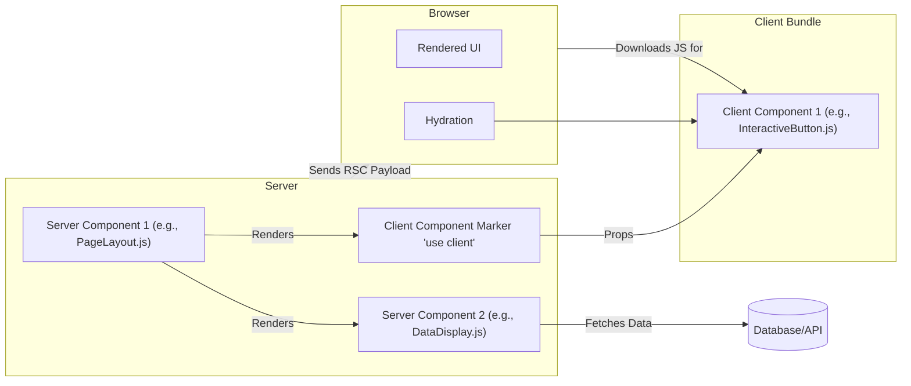
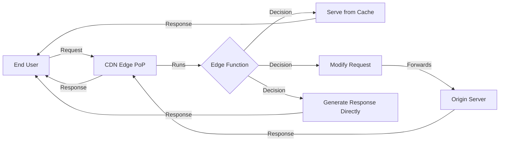

# Chapter 22: Server Components and Edge Computing for Frontend

The landscape of frontend development is constantly evolving, driven by the pursuit of better performance, improved user experiences, and more efficient development workflows, especially at scale. Traditional rendering patterns like pure Client-Side Rendering (CSR) and classic Server-Side Rendering (SSR) have served us well, but they come with inherent limitations, particularly when building complex, data-intensive applications for a global audience.

This chapter delves into two significant advancements shaping the future of frontend architecture: **Server Components** (popularized by React) and **Edge Computing**. These technologies represent a paradigm shift, moving computation and rendering logic away from the monolithic client or server towards more distributed and optimized locations – either closer to the data source (Server Components) or closer to the user (Edge Computing). Understanding and leveraging these concepts is becoming increasingly crucial for building truly production-grade, scalable, and performant frontend systems.

We will explore the shortcomings of previous rendering models that paved the way for these innovations, dive deep into the architecture and practical application of React Server Components, and examine how Edge Computing empowers developers to execute logic at the network perimeter, unlocking new possibilities for personalization, performance, and security.

## A. Evolution Beyond Traditional SSR/CSR

Before diving into Server Components and Edge Computing, it's essential to understand why the industry is moving beyond the established patterns of Client-Side Rendering (CSR) and traditional Server-Side Rendering (SSR). While both have their place, their limitations become apparent when dealing with the demands of large-scale, modern web applications.

### 1. Limitations of Client-Side Rendering at Scale

CSR, typically associated with Single Page Applications (SPAs), involves sending a minimal HTML shell to the browser, along with a large JavaScript bundle. The browser then executes this JavaScript to fetch data, render the UI, and handle user interactions.

- **Large Initial Bundle Sizes:** As applications grow, the JavaScript bundle tends to increase significantly. This leads to longer download and parse times, delaying the initial render (Time to Interactive - TTI). Users on slower networks or less powerful devices suffer the most.
- **Performance Bottlenecks:** All rendering logic, data fetching coordination, and state management run on the user's device. This can strain device resources, leading to sluggishness, especially on complex pages with many components or frequent updates.
- **SEO Challenges:** While search engine crawlers have improved at executing JavaScript, CSR applications can still face SEO difficulties. There might be delays in content availability for crawling, or complex rendering logic might hinder proper indexing compared to server-rendered HTML.
- **Data Fetching Waterfalls:** Naive data fetching in CSR often leads to sequential requests (component A mounts -> fetches data -> renders component B -> component B fetches data...). This waterfall effect increases the overall time required to fully load a page.
- **Security Concerns:** Exposing large amounts of application logic and potentially sensitive API endpoints directly to the client increases the attack surface.

> **Production Perspective:** While code splitting, lazy loading, and optimization techniques can mitigate some CSR issues, the fundamental model of shipping _all_ rendering logic and data fetching orchestration to the client remains a bottleneck for very large applications aiming for optimal performance across diverse user conditions.

### 2. Limitations of Traditional Server-Side Rendering

Traditional SSR addresses the initial load performance and SEO issues of CSR by rendering the full HTML page on the server for each request. The browser receives ready-to-render content, improving First Contentful Paint (FCP). However, it also has drawbacks:

- **Time to First Byte (TTFB) Latency:** The server must fetch all necessary data and render the complete page _before_ sending the response. If data fetching is slow, the user stares at a blank screen waiting for the server, increasing TTFB.
- **Full Page Reloads:** Navigation typically involves a full round trip to the server, requesting and rendering the entire new page. This can feel less seamless than the client-side transitions in SPAs.
- **Server Load:** Rendering pages on the server consumes server resources (CPU, memory). High traffic can necessitate significant server scaling, increasing infrastructure costs.
- **Limited Interactivity Before Hydration:** The server sends HTML, but the JavaScript required for interactivity (event handlers, dynamic updates) must still be downloaded, parsed, and executed on the client (a process called hydration). Until hydration completes, the page might look interactive but won't respond to user input. Large JS bundles can lead to a significant delay between FCP and TTI.
- **Coupling with Backend:** Traditional SSR often tightly couples the frontend rendering logic with the backend environment, potentially limiting technology choices or requiring specific backend frameworks.

> **The Dichotomy:** Historically, developers faced a trade-off: prioritize fast initial load and SEO (SSR) or rich interactivity and smooth transitions (CSR). Modern solutions aim to break this dichotomy.

Server Components and Edge Computing offer ways to combine the benefits of server-side rendering (fast initial load, less client-side work) with the interactivity and dynamic capabilities of client-side applications, while also introducing new architectural possibilities.

## B. Deep Dive: React Server Components (RSC)

React Server Components (RSC) represent a fundamental shift in how React applications can be architected and rendered. Introduced by the React team, RSC allows developers to choose _where_ their components execute – on the server or the client – on a component-by-component basis within the same application tree. This hybrid approach aims to deliver the best of both worlds: the rich interactivity of client-side apps and the performance benefits of server rendering, without the hydration costs associated with traditional SSR for server-rendered parts.

### 1. Architecture and Core Concepts (Server vs. Client Components)

The core idea is the distinction between two types of components coexisting in the same React tree:

- **Server Components (`.js`, `.jsx`, `.ts`, `.tsx` by default in frameworks like Next.js App Router):**

  - **Run exclusively on the server.** Their code is _never_ shipped to the client bundle.
  - Can directly access server-side resources (databases, file systems, internal APIs) without needing to expose API endpoints.
  - Cannot use state (`useState`) or lifecycle effects (`useEffect`) as they don't re-render on the client.
  - Cannot use browser-only APIs (e.g., `window`, `localStorage`).
  - Rendered output is a special, serializable description of the UI (the RSC Payload), not interactive JavaScript code.
  - Ideal for static content sections, data fetching, accessing sensitive data, or reducing client-side JavaScript.

- **Client Components (`'use client';` directive at the top of the file):**
  - **Run initially on the server (for SSR/prerendering) and then hydrate and run on the client.** Their code _is_ included in the client bundle.
  - Can use state (`useState`), effects (`useEffect`), event listeners, and browser APIs.
  - Provide interactivity and handle user events.
  - Can import and render Server Components (though this boundary has implications).
  - Must be used for any component requiring user interaction or browser-specific functionality.

**The Boundary:** The key is the interaction _between_ Server and Client Components.

- Server Components can directly import and render _other_ Server Components.
- Server Components can import and render Client Components. When doing so, they effectively tell the client, "You need to download and render this interactive component (`ClientComponent`) and pass these specific props (`prop1`, `prop2`) to it."
- Client Components _cannot_ directly import Server Components (because Server Component code doesn't exist on the client). They can, however, receive Server Components as props (e.g., via the `children` prop) that were rendered higher up the tree by another Server Component.



**Diagram Explanation:** This diagram illustrates the basic RSC architecture. Server Components (RSC1, RSC2) execute on the server, potentially fetching data (DB). RSC1 renders RSC2 directly. When RSC1 needs an interactive element, it renders a Client Component (CC1), sending a marker and props in the RSC payload. The browser receives the payload, renders the static parts, downloads the JavaScript bundle for CC1, and hydrates it to make it interactive.

### 2. Data Fetching Patterns with RSC

Server Components fundamentally change data fetching. Since they run on the server, often physically closer to data sources, they can fetch data more efficiently and directly.

- **Direct Data Access:** Server Components can directly query databases, access internal microservices, or read from the filesystem without needing intermediary API routes (though using API routes might still be desirable for organizational reasons or reuse).
- **Simplified Fetching Logic:** Data fetching can be done directly within the component's async function body.

```javascript
// Example: Server Component fetching data directly
// app/components/UserProfile.js (Server Component by default)
import db from "./lib/db"; // Assume db is a server-side database client

async function UserProfile({ userId }) {
  // Direct database access within the component
  const user = await db.user.findUnique({ where: { id: userId } });
  // No need for useEffect or useState for data fetching

  if (!user) {
    return <div>User not found.</div>;
  }

  return (
    <div>
      <h1>{user.name}</h1>
      <p>Email: {user.email}</p>
      {/* Other user details */}
    </div>
  );
}

export default UserProfile;
```

- **Colocation:** Data fetching logic lives alongside the component that uses the data, improving maintainability.
- **Reduced Waterfalls:** Frameworks leveraging RSC (like Next.js with its `fetch` patching) can automatically deduplicate data requests made across different Server Components within the same render pass. Parallel fetching becomes the default.

### 3. Streaming and Suspense Integration

Server Components integrate seamlessly with React Suspense and streaming rendering.

- **Streaming:** Instead of waiting for the entire page and all its data to be ready on the server (like traditional SSR), the server can start streaming the UI shell immediately. As data for Server Components becomes available, the server streams chunks of the rendered UI (the RSC payload) to the client. The browser can progressively render these chunks as they arrive.
- **Suspense:** Server Components can `await` data fetches. If a component is waiting for data, React can pause its rendering on the server and send a fallback UI (defined by a `<Suspense>` boundary) in the initial stream. Once the data arrives, React renders the actual component on the server and streams the result to the client, which then replaces the fallback.

```javascript
// Example: Using Suspense with a Server Component
// app/page.js (Server Component)
import { Suspense } from "react";
import UserProfile from "./components/UserProfile";
import UserPosts from "./components/UserPosts"; // Another Server Component (potentially slow)
import Spinner from "./components/Spinner"; // A simple Client Component for loading UI

export default function UserPage({ params }) {
  const userId = params.id;

  return (
    <div>
      {/* UserProfile renders quickly */}
      <UserProfile userId={userId} />

      <hr />

      <h2>User Posts</h2>
      {/* Wrap the potentially slow UserPosts component in Suspense */}
      <Suspense fallback={<Spinner text="Loading posts..." />}>
        {/* UserPosts will fetch its own data */}
        <UserPosts userId={userId} />
      </Suspense>
    </div>
  );
}
```

This combination provides a fast FCP (initial shell streams quickly) and allows content to appear progressively without blocking the entire page render, significantly improving perceived performance.

### 4. Impact on Bundle Size and Client-Side JavaScript

One of the most significant benefits of RSC is the potential for **zero client-side JavaScript** for parts of the application rendered entirely by Server Components.

- **Code Elimination:** The code for Server Components themselves is _never_ sent to the browser. This includes the component logic, data fetching code, and any large libraries used _only_ by those Server Components (e.g., a heavy date formatting library, a Markdown parser).
- **Reduced Bundle Size:** By strategically using Server Components for non-interactive parts of the UI, the amount of JavaScript that needs to be downloaded, parsed, and executed by the client can be drastically reduced. This directly improves TTI and overall performance, especially on low-end devices or slow networks.
- **Selective Hydration:** Only Client Components need to be hydrated. The static markup rendered by Server Components doesn't incur hydration costs.

> **The Trade-off:** While reducing client JS is a major win, the RSC model introduces complexity. Developers must consciously decide where each component should run and manage the boundaries between server and client environments.

### 5. Frameworks Adopting RSC (Next.js App Router)

While RSC is a React feature, its implementation requires framework integration.

- **Next.js App Router:** The most prominent adoption is Next.js's App Router (introduced in Next.js 13). It's built entirely around the RSC architecture. Files within the `app` directory are Server Components by default, and Client Components are opted into using the `'use client';` directive. It handles the server-side rendering, data fetching integration (extending `fetch`), streaming, and client-side routing necessary to make RSC work seamlessly.
- **Other Frameworks:** Other frameworks and meta-frameworks in the React ecosystem are exploring or adopting RSC concepts, recognizing its potential benefits for large-scale application development.

### 6. [Practical Example: Building a feature using React Server Components]

Let's build a simple product listing page where the product details are rendered on the server, but the "Add to Cart" button is interactive on the client.

**File Structure (Next.js App Router):**

```
app/
├── products/
│   └── page.js         # Server Component (Route)
├── components/
│   ├── ProductCard.js  # Server Component (Displays product info)
│   └── AddToCartButton.js # Client Component (Interactive button)
└── lib/
    └── api.js          # Server-side utility to fetch products
```

**`lib/api.js` (Simulated API):**

```javascript
// Server-side only utility
export async function getProducts() {
  // In a real app, fetch from a database or external API
  await new Promise((resolve) => setTimeout(resolve, 500)); // Simulate network delay
  return [
    { id: 1, name: "Flux Capacitor", price: 1985.0 },
    { id: 2, name: "Hoverboard", price: 2015.0 },
    { id: 3, name: "Self-Lacing Shoes", price: 1989.0 },
  ];
}
```

**`components/ProductCard.js` (Server Component):**

```javascript
// This component runs ONLY on the server. Its code is not sent to the client.
import AddToCartButton from "./AddToCartButton"; // Importing a Client Component

export default function ProductCard({ product }) {
  console.log(`Rendering ProductCard for ${product.name} on the server...`);

  return (
    <div
      style={{ border: "1px solid #ccc", padding: "1rem", margin: "1rem 0" }}
    >
      <h2>{product.name}</h2>
      <p>Price: ${product.price.toFixed(2)}</p>
      {/*
        We render the Client Component here.
        The server sends instructions to the client:
        "Render AddToCartButton with productId={product.id}"
      */}
      <AddToCartButton productId={product.id} />
    </div>
  );
}
```

**`components/AddToCartButton.js` (Client Component):**

```javascript
"use client"; // Directive marks this as a Client Component

import { useState } from "react";

export default function AddToCartButton({ productId }) {
  const [isAdding, setIsAdding] = useState(false);
  const [added, setAdded] = useState(false);

  const handleClick = async () => {
    setIsAdding(true);
    console.log(`Adding product ${productId} to cart (client-side)...`);
    // Simulate API call
    await new Promise((resolve) => setTimeout(resolve, 700));
    setIsAdding(false);
    setAdded(true);
    setTimeout(() => setAdded(false), 2000); // Reset after 2s
  };

  return (
    <button onClick={handleClick} disabled={isAdding || added}>
      {added ? "Added!" : isAdding ? "Adding..." : "Add to Cart"}
    </button>
  );
}
```

**`app/products/page.js` (Server Component - Route):**

```javascript
import { Suspense } from "react";
import { getProducts } from "../lib/api";
import ProductCard from "../components/ProductCard";

// This is an async Server Component
export default async function ProductsPage() {
  // Data fetching happens directly on the server
  const products = await getProducts();

  return (
    <div>
      <h1>Our Products</h1>
      <Suspense fallback={<div>Loading product list...</div>}>
        {products.map((product) => (
          <ProductCard key={product.id} product={product} />
        ))}
      </Suspense>
    </div>
  );
}

// Optional: Add dynamic = 'force-dynamic'; to ensure it runs on every request
// export const dynamic = 'force-dynamic';
```

**Outcome:**

1.  When `/products` is requested, `ProductsPage` runs on the server.
2.  It calls `getProducts()` (server-side).
3.  It maps over the products and renders `ProductCard` (Server Component) for each.
4.  Inside `ProductCard`, product details are rendered, and a marker for `AddToCartButton` (Client Component) with its `productId` prop is included in the RSC payload.
5.  The server streams the initial HTML and the RSC payload to the browser.
6.  The browser renders the static product information immediately.
7.  The browser downloads the JavaScript bundle containing `AddToCartButton`.
8.  React hydrates `AddToCartButton`, making it interactive. Clicking it executes the `handleClick` function _on the client_.

**Benefit:** The code for `getProducts` and `ProductCard` (including any libraries they might use) is _not_ sent to the client, reducing the bundle size. Only the interactive `AddToCartButton` contributes to the client-side JavaScript.

### 7. [Deep Dive: Understanding the RSC payload and protocol]

The communication between the server rendering Server Components and the client rendering the final UI relies on a specific protocol and payload format. While the exact format is an implementation detail managed by React and the framework (like Next.js), understanding the principles is crucial.

- **Serialized UI Tree:** The payload is essentially a serialized representation of the React element tree generated by Server Components. It's not HTML, but rather a description that React on the client can understand and use to update the DOM. It might resemble a stream of JSON-like objects or use a more compact binary format.
- **Placeholders for Client Components:** When a Server Component renders a Client Component, the payload includes a reference to the Client Component's code (e.g., its module path or an ID) and the props being passed to it.
- **Streaming Format:** The payload is designed for streaming. As parts of the UI are rendered on the server (especially after async operations like data fetching complete), chunks of this serialized tree are sent down the wire.
- **Data Inclusion:** Data fetched by Server Components and needed as props for Client Components is serialized and included directly in the payload.
- **Client-Side Reconstruction:** React running in the browser receives this stream, parses the serialized description, renders the static parts directly to the DOM, identifies the Client Component placeholders, requests the necessary JavaScript bundles (if not already loaded), and then hydrates the Client Components with their props.

> **Why not just HTML?** While the initial load might involve HTML generated on the server, subsequent updates triggered by navigation or actions within the RSC model often involve fetching and processing this specialized RSC payload directly, allowing React to update the UI efficiently without a full page reload and minimizing the amount of data transferred compared to re-sending full HTML. Understanding this distinction is key to grasping why RSC isn't just "SSR with less JavaScript." It's a fundamentally different way of rendering and updating across the server-client boundary.

## C. Edge Computing for Frontend Applications

While Server Components optimize rendering by leveraging the server environment closer to data sources, **Edge Computing** focuses on moving computation closer to the **user**. It utilizes Content Delivery Networks (CDNs) that have evolved beyond simply caching static assets to include compute capabilities at their globally distributed points of presence (PoPs).

### 1. What is Edge Computing? (CDNs with Compute Capabilities)

Traditionally, CDNs cache static files (images, CSS, JS) at edge locations worldwide. When a user requests a file, it's served from the nearest PoP, reducing latency.

Edge Computing extends this by allowing developers to deploy and execute code directly on these CDN edge servers. Instead of just serving cached files, the edge server can run custom logic _before_ responding to the user or _before_ forwarding the request to the origin server.

> **Definition:** Edge Computing, in the frontend context, refers to running application logic (often lightweight functions) on CDN infrastructure geographically close to the end-user, intercepting HTTP requests and responses to perform tasks dynamically at the network edge.

### 2. Edge Functions (Cloudflare Workers, Vercel Edge Functions, Netlify Edge Functions)

Several platforms provide frameworks and runtimes for deploying code to the edge:

- **Cloudflare Workers:** A mature platform running JavaScript (using the V8 engine) and Wasm at Cloudflare's extensive network edge. Offers low latency and a robust feature set.
- **Vercel Edge Functions:** Integrated tightly with the Vercel platform and Next.js. Runs code at the edge, often using a V8-based runtime, enabling middleware and dynamic rendering closer to users.
- **Netlify Edge Functions:** Uses the Deno runtime to execute JavaScript, TypeScript, and Wasm at Netlify's edge locations. Integrates with their platform features.
- **Others:** AWS Lambda@Edge, Akamai EdgeWorkers, Fastly Compute@Edge offer similar capabilities.

These functions typically have a specific API signature (often similar to the Service Worker API or Node.js `http` module) allowing them to inspect and modify HTTP requests and responses.



**Diagram Explanation:** This flowchart shows how an Edge Function intercepts a user request at the CDN Edge. Based on its logic, it can serve a cached response, modify the request before forwarding it to the origin server, or generate a response directly from the edge, bypassing the origin entirely.

### 3. Use Cases: Personalization, A/B Testing, Middleware, API Routing at the Edge

Edge functions unlock powerful capabilities by executing logic before the request hits your main application server:

- **Personalization:** Modify page content based on user location (derived from IP address via headers), language preference (`Accept-Language` header), cookies (e.g., user cohorts), or device type (`User-Agent`). This can be done by rewriting the HTML response or fetching user-specific content at the edge.
- **A/B Testing:** Implement A/B tests by intercepting requests and assigning users to different buckets (based on cookies or request properties). The edge function can then rewrite URLs to different versions of a page or modify the response to serve different variants, often without needing changes to the core application code.
- **Middleware:** Perform tasks common to many requests:
  - **Authentication/Authorization:** Verify session tokens or JWTs before forwarding requests to protected origin routes. Deny access directly from the edge for invalid requests.
  - **Header Manipulation:** Add or remove request/response headers (e.g., security headers, caching headers).
  - **Redirects:** Handle URL redirects based on location, device, or authentication status.
- **API Routing/Proxying:** Create lightweight API endpoints directly at the edge, potentially aggregating data from multiple backend services or proxying requests to the appropriate microservice, reducing latency for API consumers.
- **Dynamic Bot Blocking:** Implement sophisticated bot detection logic at the edge before malicious traffic can reach origin servers.
- **Image Optimization:** Some platforms allow image resizing and optimization directly at the edge based on request parameters or device characteristics.

### 4. Performance and Scalability Benefits

- **Reduced Latency:** Executing logic closer to the user significantly reduces network round-trip time compared to running the same logic on a centralized origin server, leading to faster responses.
- **Improved Origin Performance:** Offloading tasks like authentication, redirects, or personalization to the edge reduces the load on origin servers, allowing them to focus on core application logic. This can lead to cost savings and improved scalability.
- **Global Scalability:** CDN providers operate globally distributed networks designed for massive scale. Edge functions inherit this scalability, handling large traffic volumes without requiring manual infrastructure provisioning.
- **Faster Static Site Personalization:** Enables dynamic features on statically generated sites without sacrificing the performance benefits of static hosting for the base content.

### 5. Limitations and Trade-offs

Edge computing is powerful but not a silver bullet. It comes with constraints:

- **Limited Runtimes & APIs:** Edge function runtimes are typically more restricted than Node.js or server environments. They often lack full filesystem access, have limitations on specific Node.js APIs (like native modules), and might have stricter CPU/memory usage limits or shorter execution time limits (e.g., 50ms CPU time).
- **Cold Starts:** While generally very fast, edge functions can experience "cold starts" – a slight delay on the first request in a region if the function hasn't been invoked recently. Providers are constantly working to minimize this.
- **State Management:** Edge functions are generally stateless. Managing persistent state across requests requires external databases or key-value stores, which might negate some latency benefits if not also globally distributed (e.g., Cloudflare KV, FaunaDB, DynamoDB Global Tables).
- **Debugging and Observability:** Debugging code running across hundreds of global locations can be more challenging than debugging a centralized server. Observability tooling for the edge is improving but might be less mature than traditional backend monitoring.
- **API Access:** Accessing internal databases or APIs located in a specific region from a globally distributed edge function can introduce latency, potentially negating the benefits. Careful architecture is needed (e.g., using globally distributed databases or caching data at the edge).
- **Vendor Lock-in:** While the core concepts are similar, the specific APIs and deployment mechanisms differ between edge providers (Cloudflare, Vercel, Netlify), potentially leading to vendor lock-in.

### 6. [Practical Example: Implementing personalization using Edge Functions]

Let's implement a simple personalization feature using Vercel Edge Middleware (which runs on their Edge Functions infrastructure) for a Next.js application. We'll show a different banner message to users visiting from California.

**File Structure (Next.js App Router):**

```
├── middleware.js         # Vercel Edge Middleware file
├── app/
│   └── page.js           # Main page component
└── components/
    └── Banner.js         # Component to display the banner
```

**`middleware.js` (Vercel Edge Middleware):**

```javascript
import { NextResponse } from "next/server";

// The Edge Runtime is used by default for middleware.js
// export const config = {
//   matcher: '/', // Only run on the homepage
// };

export function middleware(request) {
  // Get the user's location from Vercel's headers
  // See: https://vercel.com/docs/concepts/edge-network/headers#x-vercel-ip-country
  // See: https://vercel.com/docs/concepts/edge-network/headers#x-vercel-ip-country-region
  const country = request.geo?.country;
  const region = request.geo?.region; // e.g., 'CA' for California

  // Clone the request headers so we can modify them
  const requestHeaders = new Headers(request.headers);

  // Add a custom header indicating if the user is from California
  if (country === "US" && region === "CA") {
    requestHeaders.set("x-user-location", "california");
  } else {
    requestHeaders.set("x-user-location", "other");
  }

  // Return the response, adding the modified headers
  // This allows downstream components (Server or Client) to read the header
  return NextResponse.next({
    request: {
      // New request headers
      headers: requestHeaders,
    },
  });
}
```

**`components/Banner.js` (Server Component):**

```javascript
// This component can now read the header set by the middleware
// It runs on the server after the middleware has executed
import { headers } from "next/headers"; // Import the headers function

export default function Banner() {
  const headersList = headers();
  const location = headersList.get("x-user-location");

  let message = "Welcome to our site!";
  if (location === "california") {
    message = "Special Welcome to our California Visitors!";
  }

  return (
    <div
      style={{ background: "lightblue", padding: "1rem", textAlign: "center" }}
    >
      {message}
    </div>
  );
}
```

**`app/page.js` (Server Component - Route):**

```javascript
import Banner from "../components/Banner";

export default function HomePage() {
  return (
    <div>
      <Banner /> {/* The banner will be personalized */}
      <h1>Main Content</h1>
      <p>This is the rest of the homepage.</p>
    </div>
  );
}
```

**Outcome:**

1.  A user requests the homepage.
2.  The request hits Vercel's Edge Network.
3.  The `middleware.js` function executes _at the edge_.
4.  It inspects the `request.geo` object (populated by Vercel).
5.  If the user is from California (US, CA), it adds the `x-user-location: california` header to the request before forwarding it to the origin (or the Next.js serverless function). Otherwise, it adds `x-user-location: other`.
6.  The `HomePage` Server Component renders on the server.
7.  The `Banner` Server Component renders and uses `headers()` to read the `x-user-location` header set by the middleware.
8.  The appropriate banner message is included in the server-rendered HTML sent to the user.

**Benefit:** The personalization logic runs at the edge, close to the user, potentially before the request even hits the main application server. This is faster than doing the geo-lookup and logic branching within the main application render path on the origin server.

### 7. [Production Note: Security considerations for Edge Compute]

While edge functions can enhance security (e.g., blocking bad actors early), they also introduce new considerations:

- **Input Validation:** Edge functions process raw HTTP requests. Always rigorously validate incoming data (headers, query parameters, request bodies) to prevent injection attacks or unexpected behavior.
- **Denial of Service (DoS):** Edge functions execute per-request. Ensure your logic is efficient and doesn't perform overly complex or long-running tasks that could be exploited to exhaust resources. Implement rate limiting where appropriate.
- **Information Exposure:** Be cautious about logging sensitive information or exposing internal details in error messages generated at the edge.
- **Secrets Management:** Edge platforms provide mechanisms for securely storing secrets (API keys, tokens). Never hardcode secrets directly in your edge function code. Use the platform's provided environment variable or secrets management solutions.
- **Third-Party Code:** Be mindful of the third-party libraries included in your edge functions, as they execute in a potentially sensitive environment. Keep dependencies updated and audit their behavior.
- **Authentication/Authorization Logic:** If implementing auth logic at the edge, ensure it's robust and correctly handles all edge cases. Flaws here could bypass security controls entirely.

## Conclusion

React Server Components and Edge Computing represent powerful architectural shifts addressing the limitations of traditional frontend rendering patterns. RSC offers a hybrid model, optimizing performance by minimizing client-side JavaScript and allowing components direct server-side data access, integrated seamlessly with streaming and Suspense. Edge Computing leverages the global distribution of CDNs to run logic closer to users, enabling low-latency personalization, A/B testing, security enforcement, and more.

While both technologies introduce new complexities and require careful consideration of their trade-offs (e.g., the server/client boundary management in RSC, runtime limitations in Edge Functions), they provide essential tools for building the next generation of scalable, performant, and production-grade frontend systems. As frontend architects and developers, understanding when and how to apply these patterns is crucial for staying ahead and delivering superior user experiences at scale. The following chapters will build upon these concepts, exploring how they intersect with state management, data fetching, testing, and other critical aspects of frontend architecture.
