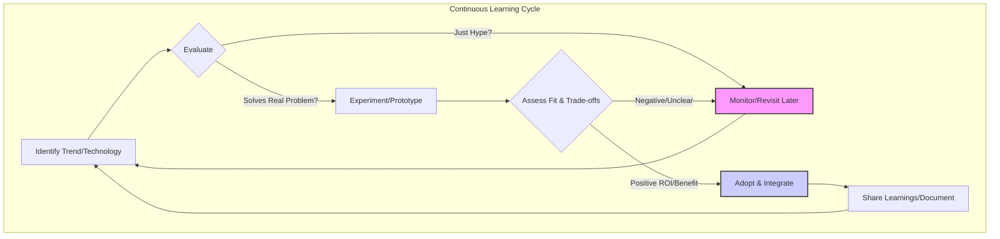
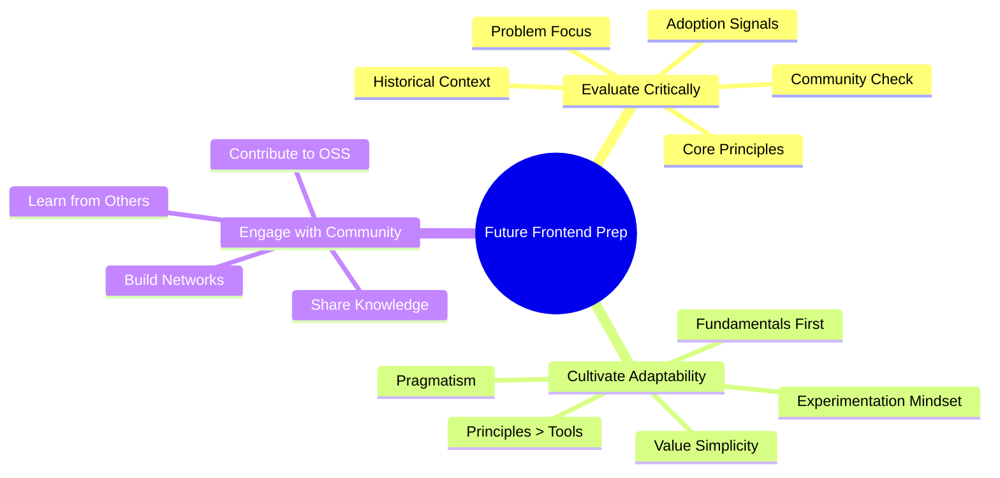

# Chapter 23: The Future of Frontend Architecture and Development

## Introduction: Navigating the Ever-Shifting Frontend Horizon

The only constant in frontend development is change. What was cutting-edge yesterday might be legacy tomorrow. As we conclude this exploration of building production-grade, scalable frontend systems, it's crucial to look ahead. The principles and patterns discussed throughout this book provide a solid foundation, but the landscape upon which we build is constantly evolving. New technologies emerge, user expectations shift, and the very definition of a "frontend" application expands.

This chapter delves into the potential future of frontend architecture and development. We won't gaze into a crystal ball and make definitive predictions, as the tech world is notoriously unpredictable. Instead, we will explore significant emerging trends, evolving paradigms, and the changing responsibilities of frontend engineers and architects. Understanding these potential shifts is vital for staying relevant, making informed decisions, and continuing to build robust, scalable, and impactful frontend systems in the years to come. We will examine how new technologies might reshape our tools and workflows, how sustainability and ethical considerations are becoming increasingly important, and how the role of the frontend professional continues to mature towards system-level thinking and cross-functional leadership. Preparing for this future requires not just technical skill, but also a mindset of continuous learning, critical evaluation, and adaptability.

## A. Emerging Technologies and Paradigms

The relentless pace of innovation continues to introduce new tools, techniques, and possibilities into the frontend ecosystem. Staying abreast of these developments is key to leveraging new capabilities and avoiding technological dead ends.

### 1. AI/ML Integration in Frontend (Personalization, Accessibility, Dev Tools)

Artificial Intelligence (AI) and Machine Learning (ML) are rapidly moving from backend-centric domains into the frontend, offering transformative potential for user experiences and developer workflows.

- **Personalization:** AI can analyze user behavior in real-time to tailor UI elements, content recommendations, and even application flows. Imagine interfaces that subtly adapt layout or highlight features based on individual usage patterns, moving beyond simple A/B testing to continuous, personalized optimization.
- **Accessibility:** ML models can power features like automatic image captioning for screen readers, real-time transcription for audio/video content, or even dynamic adjustments to UI contrast and font sizes based on detected user needs or ambient conditions.
- **Developer Tools & Productivity:** AI is being integrated into IDEs and development tools to offer intelligent code completion (e.g., GitHub Copilot), automated test generation, bug detection, and even UI generation from design specifications or natural language prompts. This can significantly accelerate development cycles and reduce repetitive tasks.
- **Predictive Interfaces:** AI could anticipate user actions, pre-loading resources or pre-rendering components for actions deemed likely, leading to seemingly instantaneous interactions.

> **Example: AI-Powered Form Assistance**
>
> - **Naive Approach:** A standard form with basic client-side validation (e.g., checking if an email field contains "@").
> - **Production-Grade (Future - AI Integrated):** An AI model running client-side (or via a lightweight API call) analyzes the user's input _as they type_. It could:
>   - Detect common typos in email domains and suggest corrections ("Did you mean gmail.com?").
>   - Identify potentially invalid addresses based on patterns and prompt for clarification _before_ submission.
>   - Pre-fill subsequent fields based on initial input (e.g., inferring city/state from a zip code using an ML model).
>   - Adapt the form structure dynamically, showing/hiding fields based on earlier answers, guided by learned user journeys.
>
> This AI integration enhances usability, reduces errors, and improves conversion rates, directly impacting business value.

### 2. Advancements in Web APIs (WebGPU, WebXR, etc.)

Browsers are continuously evolving, exposing lower-level device capabilities and enabling richer, more performant web applications through new APIs.

- **WebGPU:** The successor to WebGL, WebGPU provides modern, low-level access to the GPU. This unlocks significant performance improvements for complex graphics, data visualization, scientific computing, and even running ML models directly in the browser with hardware acceleration. It promises near-native graphics performance for web applications.
- **WebXR Device API:** Enables the development of immersive Virtual Reality (VR) and Augmented Reality (AR) experiences directly within the browser, running across various compatible devices. This opens the door for web-based training simulations, virtual showrooms, AR product visualizations, and immersive gaming without requiring native app installations.
- **WebAssembly (Wasm):** While already established (Chapter 21), Wasm's role continues to expand. Its ability to run pre-compiled code (from languages like Rust, C++, Go) at near-native speed in the browser makes it crucial for performance-critical tasks, porting existing native libraries, and enabling complex computations previously infeasible on the web (complementing technologies like WebGPU).
- **Other Emerging APIs:** Keep an eye on APIs related to device access (e.g., improved Bluetooth, NFC), background processing (more robust service workers, potential for background fetch/sync), and network protocols (WebTransport for low-latency bidirectional communication).

These APIs push the boundaries of what's possible in a browser, blurring the lines between web and native applications and demanding new architectural approaches to leverage their power effectively.

### 3. Evolution of JavaScript Frameworks and Libraries

The framework landscape remains dynamic, driven by the pursuit of better developer experience (DX), improved performance, and new rendering paradigms.

- **Reactivity Refined:** Frameworks are exploring finer-grained reactivity models (e.g., Signals in SolidJS, Preact, and potentially future versions of others) to optimize updates and reduce reliance on virtual DOM diffing, aiming for more predictable performance.
- **Server Components & Edge Rendering:** Architectures like React Server Components (RSC) and similar concepts in other frameworks (e.g., Nuxt Islands, Astro Islands) shift rendering logic and data fetching away from the client, potentially reducing bundle sizes and improving initial load times. Rendering at the edge (CDNs with compute capabilities) further enhances this by minimizing latency. (See Chapter 22).
- **Meta-Frameworks Mature:** Frameworks like Next.js, Nuxt.js, SvelteKit, Remix, and Astro provide opinionated structures, routing, data fetching, and build optimizations, abstracting away much of the underlying complexity and becoming the default choice for many new projects. Their evolution will likely dictate common architectural patterns.
- **Compilation & Build-Time Optimizations:** Increasing emphasis is placed on doing more work at build time – compiling components to highly optimized vanilla JavaScript, eliminating unused code, and pre-calculating layouts or styles – reducing the runtime overhead on the client.
- **Potential Paradigm Shifts:** While component-based architecture dominates, research continues into alternative UI paradigms. Could we see mainstream adoption of approaches based on state machines, functional relational programming, or entirely new models in the long term?

The key takeaway isn't to bet on a specific framework "winner" but to understand the underlying problems they aim to solve (performance, DX, state management complexity) and the architectural trade-offs inherent in different approaches.

### 4. Low-Code/No-Code Platforms (Impact on Frontend Roles)

Low-code/no-code (LC/NC) platforms allow users to build applications and websites through graphical interfaces and configuration, requiring minimal or no traditional programming.

- **Democratization:** LC/NC empowers non-developers (designers, marketers, business analysts) to create digital solutions, accelerating the development of simpler websites, internal tools, and prototypes.
- **Impact on Frontend Roles:** While LC/NC excels at simpler tasks, it's unlikely to replace skilled frontend engineers for complex, bespoke, highly performant, or deeply integrated applications. Instead, the role may shift:
  - **Focus on Complexity:** Frontend engineers will concentrate on the core application logic, complex UI interactions, performance optimization, integrations, and architectural challenges that LC/NC cannot handle.
  - **Platform Building:** Opportunities arise in building the _platforms_ and _custom components_ that power LC/NC tools within an organization, enabling others while maintaining brand consistency and technical standards.
  - **Integration & Oversight:** Frontend architects may oversee the integration of LC/NC tools within the broader tech ecosystem, ensuring they meet security, performance, and data governance standards.

> **Example: Integrating LC/NC with a Production System**
>
> - **Naive Approach:** Allowing marketing to use an external, unvetted LC/NC tool for landing pages that look inconsistent and potentially violate security policies or performance budgets.
> - **Production-Grade Approach:** The frontend architecture team collaborates with marketing. They might:
>   1.  Evaluate and approve a specific LC/NC platform that allows for custom component imports.
>   2.  Develop a set of reusable, on-brand, performant components (using the company's Design System - Chapter 13) specifically for use within that LC/NC tool.
>   3.  Define clear guidelines and integration points (e.g., how forms on LC/NC pages submit data to the main backend via a secure API gateway).
>   4.  Monitor the performance and security of pages built with the tool.
>
> This approach leverages the speed of LC/NC for specific use cases while maintaining architectural integrity, brand consistency, and security across the entire digital presence.

## B. Sustainable Frontend Development

As the web's scale and energy consumption grow, sustainability is transitioning from a niche concern to a critical aspect of responsible software engineering. Frontend development plays a significant role in the overall environmental impact of digital products.

### 1. Performance and Energy Efficiency

Web performance is not just about user experience; it's directly linked to energy consumption on the end-user's device and across the network infrastructure.

- **Client-Side Computation:** Heavy JavaScript execution, complex rendering cycles, and inefficient animations consume significant CPU resources, draining batteries on mobile devices and increasing overall energy usage. Techniques like code splitting, memoization, efficient algorithms, and leveraging browser APIs like `requestIdleCallback` become crucial.
- **Data Transfer:** Large bundle sizes, unoptimized images, and excessive data fetching require more energy for network transmission and processing. Optimizing assets, using modern formats (WebP, AVIF), implementing efficient caching strategies, and minimizing data requests are key.
- **Rendering Strategies:** Server-side rendering (SSR), static site generation (SSG), and incremental static regeneration (ISR), especially when combined with edge computing, can reduce the amount of work the client device needs to do, saving energy. Server Components also contribute here.

Architectural decisions (e.g., choosing a lightweight framework, adopting an island architecture) have direct implications for energy efficiency.

### 2. Reducing Carbon Footprint of Web Applications

Beyond client-side efficiency, consider the broader environmental impact:

- **Infrastructure:** Hosting choices matter. Using cloud providers committed to renewable energy sources can significantly reduce the carbon footprint of servers. Edge computing can reduce data transfer distances, saving energy.
- **Build Processes:** Complex, lengthy build and CI/CD processes consume computational resources. Optimizing build times and potentially using greener CI/CD providers can make a difference.
- **Third-Party Scripts:** Analytics, ads, and tracking scripts add weight and processing overhead. Regularly auditing and minimizing these, or choosing more lightweight alternatives, contributes to sustainability.
- **Awareness & Measurement:** Tools and methodologies are emerging to estimate the carbon footprint of web pages (e.g., Ecograder, Website Carbon Calculator). While estimations, they raise awareness and help identify optimization targets.

> **Definition: Sustainable Web Design Principles**
>
> Principles focused on minimizing the environmental impact of websites and applications, often overlapping with performance best practices:
>
> - **Efficiency:** Optimize code, assets, and data transfer.
> - **Lean Design:** Avoid unnecessary features, graphics, or animations.
> - **Green Hosting:** Choose hosting providers using renewable energy.
> - **Findability:** Ensure users can find information quickly, reducing wasted browsing time and energy.
> - **Awareness:** Measure and understand the environmental impact.

### 3. Ethical Considerations in Frontend Development

Frontend developers are gatekeepers of the user experience, giving them significant ethical responsibilities.

- **Accessibility ( Revisited as Ethics):** Ensuring applications are usable by people with disabilities is not just a legal requirement or a checklist item; it's an ethical imperative for inclusivity. (See Chapter 14).
- **Dark Patterns:** Avoid deceptive or manipulative UI/UX patterns designed to trick users into actions they wouldn't otherwise take (e.g., hidden costs, confusing opt-outs, forced continuity).
- **Data Privacy & Consent:** Implement clear, user-friendly mechanisms for obtaining consent for data collection (cookies, tracking) and ensure compliance with regulations like GDPR and CCPA. Frontend code often handles the initial collection and transmission of user data.
- **Algorithmic Bias (Frontend Role):** If displaying results from AI/ML systems, be aware of potential biases in the data or algorithms. Ensure the UI doesn't exacerbate these biases and provides transparency where possible. For example, clearly labeling AI-generated content or providing users with controls over personalization features.
- **Performance & Access:** Building bloated, slow applications disproportionately affects users with older devices, slower internet connections, or limited data plans, creating a digital divide. Sustainable, performant development is also an ethical consideration for equitable access.

Frontend architects must champion these ethical considerations within their teams and organizations, ensuring they are integral to the design and development process.

## C. The Evolving Role of the Frontend Engineer/Architect

The increasing complexity of frontend applications and the broadening scope of frontend technologies are reshaping the roles and expectations of frontend professionals.

### 1. Increased Focus on System Design and Architecture

Frontend development is no longer just about building UI components in isolation. Modern frontend engineers, and especially architects, must think holistically about the entire system.

- **Beyond the Browser:** Understanding the interplay between the frontend, backend APIs, CDNs, build systems, and infrastructure is crucial. Decisions made in the frontend have ripple effects across the stack.
- **Scalability & Maintainability:** Designing for large codebases and distributed teams requires strong architectural patterns (SOLID, component design, state management strategies, potentially micro-frontends or monorepos – Chapters 4, 5, 6, 11, 12).
- **API Design Influence:** Frontend needs often drive API design. Architects must effectively communicate requirements (data shape, performance needs, error handling) to backend teams or even participate in API design processes (e.g., GraphQL schema design).
- **Technology Evaluation:** Architects are responsible for evaluating new technologies, frameworks, and patterns, considering not just their features but also their long-term maintainability, scalability, community support, and fit within the existing ecosystem.
- **Cross-Cutting Concerns:** Effectively managing concerns like authentication, authorization, logging, monitoring, and internationalization across different parts of a large frontend application requires architectural foresight (Chapter 14).

### 2. Cross-Functional Collaboration Skills

As frontend systems become more integrated and complex, collaboration becomes paramount.

- **Bridging Gaps:** Frontend architects often act as translators between design, product management, backend engineering, DevOps, and QA. Strong communication and empathy are essential.
- **Shared Understanding:** Facilitating shared understanding of technical constraints, user needs, and business goals across different disciplines leads to better product outcomes.
- **Influence and Advocacy:** Effectively advocating for frontend best practices, necessary refactoring, performance budgets, or tooling improvements requires strong persuasion and negotiation skills.
- **Mentorship:** Senior engineers and architects play a vital role in mentoring junior developers, fostering a culture of quality, and disseminating architectural knowledge.

### 3. Continuous Learning and Adaptation

The pace of change necessitates a commitment to lifelong learning.

- **Staying Current:** Regularly reading blogs, attending conferences/meetups, following key figures/projects online, and experimenting with new technologies are essential habits.
- **Deepening Fundamentals:** While frameworks change, core principles (HTTP, browser rendering, JavaScript fundamentals, data structures, design patterns) remain relevant. Continuously strengthening this foundation makes learning new technologies easier.
- **Experimentation:** Allocating time for experimentation (e.g., building small prototypes with new tools, contributing to open source) is crucial for practical understanding beyond theoretical knowledge.
- **Adaptability:** Cultivating a mindset that embraces change rather than resisting it is key. Be willing to unlearn old habits and adopt new approaches when justified.

**Diagram Explanation:** This flowchart illustrates the continuous learning and adaptation cycle crucial for frontend architects. It emphasizes evaluating trends critically, experimenting practically, assessing trade-offs before adoption, and sharing knowledge within the team or community.

## D. Preparing for the Future

Given the dynamic nature of the field, how can we proactively prepare for what's next?

### 1. Identifying Trends vs. Hype

Not every new library, framework, or paradigm announced online represents a genuine, lasting trend. Developing the ability to discern substance from noise is a critical skill.

- **Problem-Solving Focus:** Does the new technology solve a real, significant problem better than existing solutions? Or is it a solution looking for a problem?
- **Underlying Principles:** Look beyond the surface features. What are the core concepts or architectural ideas? Are they fundamentally sound and aligned with established software engineering principles?
- **Community & Ecosystem:** Is there a growing, supportive community? Is the ecosystem around the technology maturing (tooling, documentation, related libraries)? Or is it driven by a single company or a small group?
- **Production Adoption:** Are reputable companies successfully using it in production for non-trivial applications? What challenges did they face?
- **Historical Context:** Does it echo past technologies? Why did previous similar attempts succeed or fail? (e.g., comparing new state management libraries to Flux, Redux, MobX).

> **Example: Evaluating a Hypothetical "QuantumJS" Framework**
>
> - **Hype:** "QuantumJS leverages quantum entanglement for instantaneous state updates across components! Blazing fast!"
> - **Critical Evaluation:**
>   - _Problem:_ Does it solve a real bottleneck not addressable by existing reactivity/rendering optimizations? Unlikely for most apps.
>   - _Principles:_ "Quantum entanglement" sounds like marketing jargon detached from actual computing principles applicable to web development. What is the _actual_ mechanism? Is it just a fancy observer pattern?
>   - _Community:_ Is anyone besides the creator using it? Is there documentation? Tooling?
>   - _Adoption:_ No evidence of production use.
>   - _Conclusion:_ Likely hype. Monitor if genuine innovation emerges, but don't invest time yet. Focus on proven performance techniques.

### 2. Cultivating a Mindset of Adaptability

Since we cannot predict the future with certainty, the best preparation is to cultivate a mindset ready to adapt.

- **Focus on Fundamentals:** Strong knowledge of JavaScript, HTML, CSS, browser APIs, HTTP, performance principles, and core computer science concepts provides a stable base regardless of framework churn.
- **Principles over Tools:** Prioritize understanding architectural principles (SOLID, separation of concerns, coupling/cohesion) and patterns (state management, component design) as they are more transferable than knowledge of specific tool implementations.
- **Embrace Experimentation:** View learning new things not as a chore, but as an opportunity. Be willing to try new approaches, even if they initially feel uncomfortable or less productive.
- **Value Simplicity:** Strive for the simplest viable solution. Overly complex architectures built on fleeting trends become technical debt quickly. Simple, well-understood code is easier to refactor or migrate later.
- **Pragmatism:** Balance the desire to use the latest technology with the practical needs of the project (deadlines, team skills, stability requirements).

### 3. Contributing to Open Source and Community

Engaging with the broader frontend community is a powerful way to learn, stay current, and shape the future.

- **Learning from Others:** Following discussions on platforms like GitHub, Stack Overflow, Reddit, or specialized Discords exposes you to new ideas, common problems, and innovative solutions.
- **Deepening Understanding:** Contributing to open-source projects (even just documentation or bug fixes) forces you to understand codebases and patterns deeply.
- **Building Networks:** Connecting with other developers provides opportunities for mentorship, collaboration, and learning about trends before they become mainstream.
- **Giving Back & Influence:** Sharing your own knowledge (blog posts, talks, answering questions) solidifies your understanding and contributes to the collective knowledge pool. Active participation can even allow you to influence the direction of tools and libraries you rely on.

**Diagram Explanation:** This mindmap summarizes the key strategies for preparing for the future of frontend development: critically evaluating new technologies, cultivating personal adaptability through a focus on fundamentals and principles, and actively engaging with the open-source community.

## Conclusion: Building Tomorrow's Frontend, Today

The future of frontend development promises to be even more dynamic and challenging than its past. Emerging technologies like AI/ML and advanced Web APIs will unlock new capabilities, while the evolution of frameworks and the rise of low-code platforms will reshape workflows. Simultaneously, non-functional requirements like sustainability and ethical considerations are rightly demanding greater attention in our architectural decisions.

For the frontend architect and engineer, this necessitates a continuous evolution of skills and mindset. A deeper focus on system design, enhanced cross-functional collaboration, and an unwavering commitment to learning are no longer optional extras but core competencies.

Navigating this future successfully requires the ability to distinguish lasting trends from fleeting hype, the adaptability to embrace change, and the wisdom to build upon the foundational principles of software engineering discussed throughout this book. By cultivating these qualities and actively engaging with the community, we can not only prepare for the future but also play an active role in shaping it, continuing to build frontend systems that are not only production-grade and scalable but also responsible, inclusive, and impactful. The journey of learning and adaptation never truly ends, and the next generation of frontend challenges awaits.
