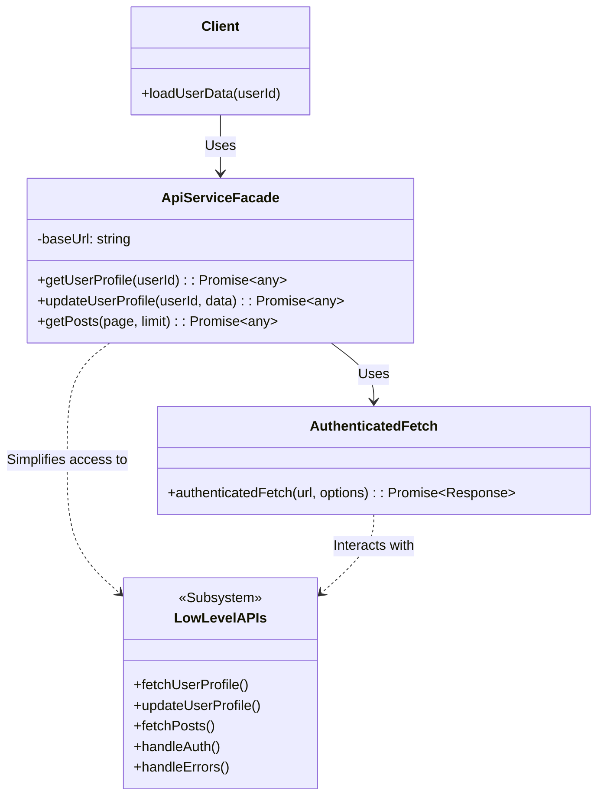
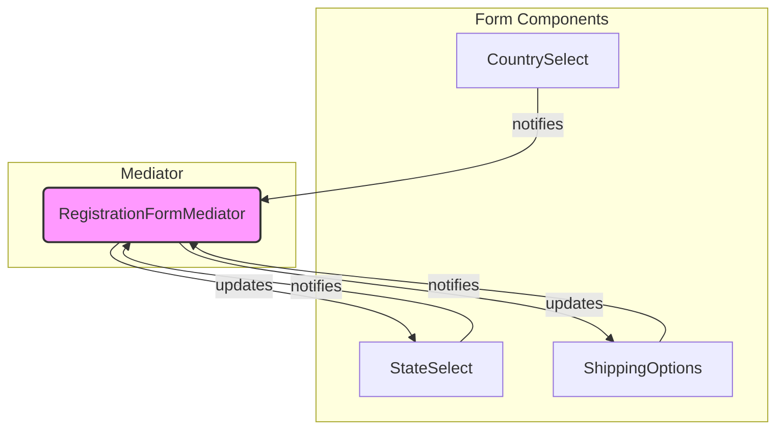

# Chapter 3: Foundational Design Patterns for Frontend Development

As we embark on the journey of building production-grade, scalable frontend systems, understanding the fundamental principles of software design is paramount. While Chapters 1 and 2 established the _what_ and _why_, this chapter delves into the _how_ by exploring foundational design patterns. These patterns, originating from classical software engineering, provide battle-tested solutions to recurring problems in software design. Applying them judiciously in the frontend context allows us to create codebases that are more flexible, maintainable, reusable, and understandable – essential characteristics for systems designed to evolve and scale.

Design patterns are not specific algorithms or concrete implementations; rather, they are conceptual templates or blueprints that guide the structure and interaction of classes and objects. In the dynamic world of frontend development, where frameworks evolve rapidly and user expectations constantly rise, these patterns offer a stable vocabulary and a set of proven techniques for managing complexity. They help us move beyond ad-hoc solutions towards intentional, well-architected designs.

This chapter focuses on the classic "Gang of Four" (GoF) design patterns, categorized into Creational, Structural, and Behavioral types, but critically examines their application _specifically within the modern frontend landscape_. We will explore how these patterns manifest in component creation, state management, API interactions, and overall application structure. Understanding these foundational patterns is crucial before tackling more advanced architectural concepts discussed later in this book.

## A. Creational Patterns (Frontend Context)

Creational patterns deal with object creation mechanisms, trying to create objects in a manner suitable to the situation. In frontend development, this often relates to component instantiation, service creation, or configuration object setup.

### 1. Factory Pattern (Component Factories)

> **Definition:** The Factory Pattern defines an interface for creating an object, but lets subclasses decide which class to instantiate. It lets a class defer instantiation to subclasses. A simpler variant, often called a Simple Factory, centralizes object creation logic without necessarily using inheritance.

In the frontend, the Factory Pattern is incredibly useful for abstracting the creation of components or UI elements. Instead of scattering component instantiation logic (`new Button()`, `<Button />`, etc.) throughout the codebase, a factory centralizes this logic.

**Use Cases:**

- **Component Variants:** Creating different types of components based on input parameters (e.g., different button styles, input types, or list item renderers).
- **Theming:** Generating themed components based on a global theme configuration.
- **Platform Adaptation:** Creating platform-specific components (e.g., native-like elements vs. web elements) from a common interface.

**Benefits:**

- **Decoupling:** The code using the factory doesn't need to know the specific component class being instantiated.
- **Centralization:** Component creation logic is centralized, making it easier to manage and modify.
- **Flexibility:** Easily introduce new component types without modifying the client code significantly.

**Example: Simple Component Factory**

Imagine needing different types of notification components (success, error, warning, info). Instead of conditional rendering scattered everywhere, a factory can handle this:

```typescript
// notificationTypes.ts
enum NotificationType {
  Success = "success",
  Error = "error",
  Warning = "warning",
  Info = "info",
}

// components/SuccessNotification.tsx (and others for Error, Warning, Info)
const SuccessNotification = ({ message }) => (
  <div className="notification success">{message}</div>
);
const ErrorNotification = ({ message }) => (
  <div className="notification error">{message}</div>
);
// ... other notification components

// factories/NotificationFactory.tsx
import React from "react";
import { NotificationType } from "./notificationTypes";
import SuccessNotification from "./components/SuccessNotification";
import ErrorNotification from "./components/ErrorNotification";
// ... import other components

interface NotificationProps {
  type: NotificationType;
  message: string;
}

// Simple Factory Function
const NotificationFactory = ({
  type,
  message,
}: NotificationProps): React.ReactElement | null => {
  switch (type) {
    case NotificationType.Success:
      return <SuccessNotification message={message} />;
    case NotificationType.Error:
      return <ErrorNotification message={message} />;
    // ... other cases
    default:
      console.warn(`Unknown notification type: ${type}`);
      return null; // Or return a default notification
  }
};

export default NotificationFactory;

// Usage in another component
import NotificationFactory from "./factories/NotificationFactory";
import { NotificationType } from "./notificationTypes";

const MyComponent = () => {
  // ...
  return (
    <div>
      {/* ... other content */}
      <NotificationFactory
        type={NotificationType.Error}
        message="Failed to save data!"
      />
      <NotificationFactory
        type={NotificationType.Success}
        message="Data saved successfully."
      />
    </div>
  );
};
```

This factory encapsulates the logic for choosing the correct notification component, making the consuming component (`MyComponent`) cleaner and unaware of the specific notification component implementations.

### 2. Singleton Pattern (Global Services, State Managers) - Use Cases and Caveats

> **Definition:** The Singleton Pattern ensures a class only has one instance and provides a global point of access to it.

In frontend applications, Singletons often appear implicitly or explicitly for managing global concerns.

**Use Cases:**

- **Global Configuration:** A single configuration object accessible throughout the application.
- **Logging Service:** A centralized service for logging application events.
- **API Service Instance:** A single instance managing API connections or authentication tokens.
- **Simple Global State:** Sometimes used for very simple global state management (though dedicated state management libraries are usually preferred for complexity).

**Implementation (Conceptual):**

```typescript
class GlobalConfig {
  private static instance: GlobalConfig;
  private settings: Record<string, any>;

  private constructor() {
    // Private constructor prevents direct instantiation
    this.settings = { apiKey: "default-key", theme: "light" };
    // Load config from somewhere (e.g., environment variables, API)
    console.log("GlobalConfig initialized");
  }

  public static getInstance(): GlobalConfig {
    if (!GlobalConfig.instance) {
      GlobalConfig.instance = new GlobalConfig();
    }
    return GlobalConfig.instance;
  }

  public getSetting(key: string): any {
    return this.settings[key];
  }

  public setSetting(key: string, value: any): void {
    this.settings[key] = value;
    // Potentially notify listeners if settings change (Observer pattern)
  }
}

// Usage:
const config1 = GlobalConfig.getInstance();
const config2 = GlobalConfig.getInstance();

console.log(config1 === config2); // true
console.log(config1.getSetting("apiKey"));

config2.setSetting("theme", "dark");
console.log(config1.getSetting("theme")); // dark
```

**Caveats and Production Considerations:**

While seemingly convenient, the Singleton pattern should be used with **extreme caution** in modern frontend development, especially in large applications:

- **Global State:** Singletons introduce global state, making reasoning about application flow difficult and increasing the risk of unintended side effects. Changes in one part of the app can unexpectedly affect others.
- **Testability:** Components or services depending on Singletons become hard to test in isolation. You often need to mock the Singleton or manage its state across tests, leading to brittle tests. Dependency Injection is generally preferred for testability.
- **Tight Coupling:** Code becomes tightly coupled to the specific Singleton instance, hindering reusability and refactoring.
- **Lifecycle Management:** In environments like server-side rendering (SSR) or micro-frontends, managing the lifecycle and isolation of Singletons can be problematic. A Singleton might persist across requests or user sessions unintentionally.
- **Alternatives:** Modern frameworks and state management libraries (like Redux, Zustand, Vuex, Context API) often provide better, more structured ways to manage shared state and services with clearer dependency management and better testability.

> **Production Note:** Before implementing a Singleton, strongly consider alternatives like Dependency Injection, Context APIs, or dedicated state management libraries. Reserve Singletons for genuinely global, stateless services (like a logger) or configuration holders where the downsides are carefully weighed and mitigated.

### 3. Builder Pattern (Complex Configuration Objects)

> **Definition:** The Builder Pattern separates the construction of a complex object from its representation, allowing the same construction process to create different representations. It's useful when an object requires many configuration parameters, some optional, some mandatory.

In frontend development, this pattern shines when configuring complex components (like charts, data grids, or modals) or setting up intricate request objects.

**Use Cases:**

- **Chart Configuration:** Building configuration objects for charting libraries (e.g., setting data, axes, labels, tooltips, colors).
- **API Request Construction:** Creating complex API request bodies or query parameters step-by-step.
- **Modal/Dialog Configuration:** Setting up modals with various options (title, content, buttons, callbacks, size).
- **Form Builders:** Programmatically constructing complex forms.

**Benefits:**

- **Readability:** Makes the construction of complex objects more readable by using descriptive method names.
- **Immutability:** The builder can be designed to produce an immutable configuration object upon completion.
- **Flexibility:** Allows for optional parameters and different configurations using the same builder.
- **Reduces Constructor Bloat:** Avoids constructors with numerous optional parameters.

**Example: Chart Configuration Builder**

```typescript
// Represents the final complex object
interface ChartConfig {
  type: "line" | "bar" | "pie";
  data: any[];
  xAxisLabel?: string;
  yAxisLabel?: string;
  showLegend?: boolean;
  colorScheme?: string;
  tooltipEnabled?: boolean;
}

// The Builder class
class ChartConfigBuilder {
  private config: Partial<ChartConfig> = {}; // Use Partial for incremental building

  constructor(type: "line" | "bar" | "pie", data: any[]) {
    this.config.type = type;
    this.config.data = data;
  }

  withXAxisLabel(label: string): this {
    this.config.xAxisLabel = label;
    return this; // Return 'this' for chaining
  }

  withYAxisLabel(label: string): this {
    this.config.yAxisLabel = label;
    return this;
  }

  withLegend(show: boolean = true): this {
    this.config.showLegend = show;
    return this;
  }

  withColorScheme(scheme: string): this {
    this.config.colorScheme = scheme;
    return this;
  }

  withTooltips(enabled: boolean = true): this {
    this.config.tooltipEnabled = enabled;
    return this;
  }

  // Final build method
  build(): ChartConfig {
    // Perform validation or set defaults if needed
    if (!this.config.type || !this.config.data) {
      throw new Error("Chart type and data are required.");
    }
    // Return a copy to ensure immutability if desired
    return { ...this.config } as ChartConfig;
  }
}

// Usage:
const lineChartConfig = new ChartConfigBuilder("line", [
  /* data array */
])
  .withXAxisLabel("Time")
  .withYAxisLabel("Value")
  .withLegend()
  .withColorScheme("blue")
  .withTooltips()
  .build();

const barChartConfig = new ChartConfigBuilder("bar", [
  /* data array */
])
  .withYAxisLabel("Count")
  .withColorScheme("green")
  .build(); // Only required fields + Y label + color

console.log(lineChartConfig);
console.log(barChartConfig);

// Assume a ChartComponent uses this config
// <ChartComponent config={lineChartConfig} />
```

The Builder pattern provides a fluent and readable API for constructing the `ChartConfig` object, handling optional parameters gracefully.

## B. Structural Patterns (Frontend Context)

Structural patterns concern class and object composition. They explain how to assemble objects and classes into larger structures while keeping these structures flexible and efficient.

### 1. Adapter Pattern (Integrating Third-Party Libraries)

> **Definition:** The Adapter Pattern converts the interface of a class into another interface clients expect. Adapter lets classes work together that couldn't otherwise because of incompatible interfaces.

This is one of the most frequently useful patterns in frontend development, especially when dealing with external dependencies.

**Use Cases:**

- **Wrapping Third-Party Libraries:** Creating a consistent internal API for interacting with external libraries (e.g., analytics SDKs, date formatters, UI component libraries with different prop conventions).
- **Legacy Code Integration:** Providing a modern interface to older parts of the application.
- **Data Transformation:** Adapting data structures received from an API to the format expected by UI components.

**Benefits:**

- **Decoupling:** Insulates your application from changes in third-party libraries. If the library changes its API, you only need to update the adapter.
- **Consistency:** Provides a uniform interface across your application for similar functionalities offered by different underlying implementations.
- **Testability:** Allows mocking the third-party dependency easily by mocking the adapter interface.

**Example: Adapting an Analytics Library**

Suppose you use an external analytics library with a specific API, but you want an internal, simpler interface.

```typescript
// external-analytics-sdk.js (Simulated third-party library)
const ExternalAnalyticsSDK = {
  configure: (apiKey: string) => {
    console.log(`SDK Configured with ${apiKey}`);
  },
  trackEvent: (
    eventName: string,
    eventData: Record<string, any>,
    userId: string
  ) => {
    console.log(`SDK Event: ${eventName}`, { data: eventData, user: userId });
    // ... actual network request to analytics service
  },
  trackPageView: (url: string, referrer?: string) => {
    console.log(`SDK PageView: ${url}`, { ref: referrer });
    // ... actual network request
  },
};

// services/AnalyticsAdapter.ts (Our Adapter)
interface AppAnalytics {
  initialize(key: string): void;
  track(name: string, properties: Record<string, any>): void;
  page(path: string): void;
}

class AnalyticsAdapter implements AppAnalytics {
  private userId: string = "anonymous"; // Could be fetched after login

  constructor() {
    // Potentially get user ID or other context
  }

  initialize(key: string): void {
    try {
      ExternalAnalyticsSDK.configure(key);
    } catch (error) {
      console.error("Failed to initialize analytics SDK:", error);
      // Implement fallback or error reporting
    }
  }

  // Adapts our 'track' method to the SDK's 'trackEvent'
  track(name: string, properties: Record<string, any>): void {
    try {
      // Maybe add some default properties like timestamp, userAgent etc.
      const enrichedProps = { ...properties, timestamp: Date.now() };
      ExternalAnalyticsSDK.trackEvent(name, enrichedProps, this.userId);
    } catch (error) {
      console.error(`Failed to track event "${name}":`, error);
    }
  }

  // Adapts our 'page' method to the SDK's 'trackPageView'
  page(path: string): void {
    try {
      ExternalAnalyticsSDK.trackPageView(path, document.referrer);
    } catch (error) {
      console.error(`Failed to track page view "${path}":`, error);
    }
  }

  // Method to update user context if needed
  identifyUser(id: string): void {
    this.userId = id;
  }
}

// Create a single instance (potentially using Singleton, but better via DI)
const analyticsService = new AnalyticsAdapter();

// Usage elsewhere in the app:
analyticsService.initialize("YOUR_API_KEY");
// ... user logs in
analyticsService.identifyUser("user-123");
// ... user performs an action
analyticsService.track("button_click", {
  buttonName: "Save",
  location: "UserProfile",
});
// ... user navigates
analyticsService.page("/profile");
```

The `AnalyticsAdapter` provides a clean, application-specific interface (`AppAnalytics`), hiding the details and potential quirks of the `ExternalAnalyticsSDK`. If you later switch to a different analytics provider, only the `AnalyticsAdapter` needs to be rewritten, not every call site throughout the application.

### 2. Decorator Pattern (Higher-Order Components, Composition)

> **Definition:** The Decorator Pattern attaches additional responsibilities to an object dynamically. Decorators provide a flexible alternative to subclassing for extending functionality.

In frontend, especially within component-based frameworks like React, this pattern is often implemented using Higher-Order Components (HOCs) or function composition.

**Use Cases:**

- **Adding Cross-Cutting Concerns:** Wrapping components with logic for authentication checks, logging, styling, or feature flagging without modifying the component itself.
- **Enhancing Props:** Injecting additional props or transforming existing ones before they reach the wrapped component.
- **Conditional Rendering:** Wrapping a component to control its rendering based on certain conditions.

**Benefits:**

- **Flexibility:** Add or remove responsibilities at runtime.
- **Composition over Inheritance:** Avoids creating complex inheritance hierarchies.
- **Single Responsibility Principle:** Keeps components focused on their core task, while decorators handle auxiliary concerns.

**Example: Higher-Order Component (React)**

Let's create an HOC `withAuth` that only renders the wrapped component if the user is authenticated.

```typescript
import React, { useContext } from "react";

// Assume an AuthContext provides authentication status
interface AuthContextType {
  isAuthenticated: boolean;
  // ... other auth data
}
const AuthContext = React.createContext<AuthContextType>({
  isAuthenticated: false,
});

// The Higher-Order Component (Decorator)
const withAuth = <P extends object>(
  WrappedComponent: React.ComponentType<P>
) => {
  const ComponentWithAuth = (props: P) => {
    const { isAuthenticated } = useContext(AuthContext);

    if (!isAuthenticated) {
      // Optionally render a fallback component or redirect
      return <p>Please log in to view this content.</p>;
    }

    // Render the original component with its props if authenticated
    return <WrappedComponent {...props} />;
  };

  // Assign a display name for better debugging
  ComponentWithAuth.displayName = `WithAuth(${
    WrappedComponent.displayName || WrappedComponent.name || "Component"
  })`;

  return ComponentWithAuth;
};

// A component that requires authentication
const UserDashboard = (props: { userId: string }) => {
  return <div>Welcome to your Dashboard, User {props.userId}!</div>;
};

// Apply the decorator
const AuthenticatedUserDashboard = withAuth(UserDashboard);

// Usage in the application
const App = () => {
  const authContextValue = { isAuthenticated: true /* or false */ }; // Get this from actual auth state

  return (
    <AuthContext.Provider value={authContextValue}>
      {/* ... other components */}
      <AuthenticatedUserDashboard userId="user-456" />
      {/* ... other components */}
    </AuthContext.Provider>
  );
};
```

Here, `withAuth` _decorates_ `UserDashboard` with authentication logic without altering `UserDashboard`'s implementation. This promotes reusability and separation of concerns. Note that modern React often favors custom Hooks for cross-cutting concerns over HOCs due to potential "wrapper hell" and better composability, but HOCs remain a valid implementation of the Decorator pattern.

### 3. Facade Pattern (Simplifying Complex Subsystems - e.g., API Layers)

> **Definition:** The Facade Pattern provides a unified interface to a set of interfaces in a subsystem. Facade defines a higher-level interface that makes the subsystem easier to use.

This pattern is excellent for simplifying interactions with complex parts of the application, such as data fetching, browser APIs, or intricate UI modules.

**Use Cases:**

- **API Service Layer:** Creating a single service that orchestrates calls to multiple API endpoints, handles authentication, caching, and error handling, presenting a simple `fetchUserData()`, `saveSettings()` interface to the rest of the app.
- **Browser API Abstraction:** Wrapping complex browser APIs like `localStorage`/`sessionStorage`, `IndexedDB`, or `WebRTC` with a simpler, promise-based interface.
- **Complex UI Module Interaction:** Providing a simple API to interact with a complex component like a rich text editor or a multi-step wizard.

**Benefits:**

- **Simplicity:** Hides the complexity of the underlying subsystem from clients.
- **Decoupling:** Reduces dependencies between client code and the internal workings of the subsystem. Changes within the subsystem don't necessarily affect clients if the facade interface remains stable.
- **Layering:** Helps establish clear architectural layers.

**Example: API Service Facade**

```typescript
// Low-level fetch utility (could be more complex with interceptors etc.)
async function authenticatedFetch(
  url: string,
  options: RequestInit = {}
): Promise<Response> {
  const token = localStorage.getItem("authToken"); // Simplified auth
  const headers = {
    ...options.headers,
    "Content-Type": "application/json",
    ...(token ? { Authorization: `Bearer ${token}` } : {}),
  };

  const response = await fetch(url, { ...options, headers });

  if (!response.ok) {
    // Basic error handling
    const errorData = await response
      .json()
      .catch(() => ({ message: response.statusText }));
    throw new Error(
      `API Error (${response.status}): ${errorData.message || "Unknown error"}`
    );
  }
  return response;
}

// The API Facade
class ApiServiceFacade {
  private baseUrl: string = "/api/v1"; // Base URL for API endpoints

  async getUserProfile(userId: string): Promise<any> {
    try {
      const response = await authenticatedFetch(
        `${this.baseUrl}/users/${userId}`
      );
      return await response.json();
    } catch (error) {
      console.error("Failed to fetch user profile:", error);
      // Handle error appropriately (e.g., show notification, return default)
      throw error; // Re-throw or handle
    }
  }

  async updateUserProfile(userId: string, data: any): Promise<any> {
    try {
      const response = await authenticatedFetch(
        `${this.baseUrl}/users/${userId}`,
        {
          method: "PUT",
          body: JSON.stringify(data),
        }
      );
      return await response.json();
    } catch (error) {
      console.error("Failed to update user profile:", error);
      throw error;
    }
  }

  async getPosts(page: number = 1, limit: number = 10): Promise<any> {
    try {
      const response = await authenticatedFetch(
        `${this.baseUrl}/posts?page=${page}&limit=${limit}`
      );
      return await response.json();
    } catch (error) {
      console.error("Failed to fetch posts:", error);
      throw error;
    }
  }

  // ... other simplified methods for different API interactions
}

// Usage (often instantiated once and injected or imported)
const apiService = new ApiServiceFacade();

async function loadUserData(userId: string) {
  try {
    const profile = await apiService.getUserProfile(userId);
    const posts = await apiService.getPosts();
    // Update UI with profile and posts
    console.log("User Data:", profile, posts);
  } catch (error) {
    // Handle error displayed to the user
    console.log("Could not load user data.");
  }
}

loadUserData("user-789");
```

The `ApiServiceFacade` simplifies fetching user profiles and posts. Components using this facade don't need to worry about base URLs, authentication headers, HTTP methods, or basic error handling – they just call `getUserProfile` or `getPosts`.



**Diagram Explanation:** This diagram shows the Facade pattern in action. The `Client` interacts only with the simplified `ApiServiceFacade`. The `ApiServiceFacade` uses underlying functions (like `AuthenticatedFetch` or directly interacts with parts of the `LowLevelAPIs` subsystem) to fulfill the client's requests, hiding the internal complexity.

### 4. Proxy Pattern (Lazy Loading, Access Control)

> **Definition:** The Proxy Pattern provides a surrogate or placeholder for another object to control access to it.

Proxies act as intermediaries, intercepting requests to the real object (Subject) to perform additional actions like lazy initialization, access control, logging, or caching.

**Use Cases:**

- **Lazy Loading:** Delaying the creation or loading of expensive resources (large components, modules, images) until they are actually needed. Frameworks often use this internally for code splitting (e.g., `React.lazy`, dynamic `import()`).
- **Access Control:** Checking permissions before allowing access to certain components or data.
- **Virtual Proxy:** Representing large objects that reside in memory or on disk (e.g., high-resolution images where a low-res placeholder is shown initially).
- **Logging/Caching:** Intercepting method calls to log them or cache their results.

**Benefits:**

- **Performance:** Improves initial load time and resource usage through lazy loading.
- **Security:** Enforces access control rules transparently.
- **Separation of Concerns:** Isolates access control or loading logic from the core object's functionality.

**Example: Lazy Loading a Component Module**

Modern JavaScript and frameworks provide built-in mechanisms for this, which are essentially implementations of the Proxy concept.

```typescript
import React, { useState, Suspense } from "react";

// Using React.lazy which acts as a Proxy for the component module
const HeavyComponent = React.lazy(() => import("./components/HeavyComponent"));
// The import() function dynamically loads the module when HeavyComponent is rendered.
// React.lazy returns a component that can be rendered like any other.

const App = () => {
  const [showHeavyComponent, setShowHeavyComponent] = useState(false);

  return (
    <div>
      <h1>My Application</h1>
      <button onClick={() => setShowHeavyComponent(true)}>
        Load Heavy Component
      </button>

      {/* Suspense handles the loading state while the module is fetched */}
      <Suspense fallback={<div>Loading component...</div>}>
        {showHeavyComponent && <HeavyComponent />}
      </Suspense>

      <p>Other content...</p>
    </div>
  );
};

// components/HeavyComponent.tsx (This file is loaded only when needed)
import React from "react";

const HeavyComponent = () => {
  // Imagine this component has large dependencies or complex rendering
  console.log("HeavyComponent rendered");
  return (
    <div
      style={{ border: "2px solid red", padding: "20px", marginTop: "10px" }}
    >
      <h2>This is the Heavy Component!</h2>
      <p>It was loaded lazily.</p>
    </div>
  );
};

export default HeavyComponent;
```

In this example, `React.lazy` combined with dynamic `import()` acts as a proxy. The `HeavyComponent` code is not included in the initial JavaScript bundle. It's only fetched and executed when `showHeavyComponent` becomes true and the component is actually rendered. `Suspense` provides a fallback UI during the loading phase. This directly improves the initial performance of the application.

## C. Behavioral Patterns (Frontend Context)

Behavioral patterns identify common communication patterns between objects and realize these patterns. They are concerned with algorithms and the assignment of responsibilities between objects.

### 1. Observer Pattern (Event Handling, State Management)

> **Definition:** The Observer Pattern defines a one-to-many dependency between objects so that when one object (the Subject or Observable) changes state, all its dependents (Observers) are notified and updated automatically.

This is arguably one of the most fundamental patterns in UI development, underpinning event handling and reactive state management.

**Use Cases:**

- **DOM Events:** Browser event listeners (`element.addEventListener('click', handler)`) are a classic example. The element is the subject, and the handler functions are observers.
- **State Management Libraries:** Libraries like Redux, Vuex, Zustand, MobX heavily rely on the Observer pattern. Components subscribe (observe) to changes in the state store (subject) and re-render when relevant state changes occur.
- **Custom Event Emitters:** Creating simple event buses for cross-component communication where direct coupling is undesirable.
- **Real-time Updates:** Notifying UI components about updates received via WebSockets or Server-Sent Events.

**Benefits:**

- **Loose Coupling:** The subject doesn't need to know about the concrete observers, only that they implement the observer interface. Observers can be added or removed dynamically.
- **Reactivity:** Enables reactive programming paradigms where the UI automatically updates in response to data changes.
- **Broadcast Communication:** Efficiently notify multiple objects about an event or state change.

**Example: Simple Custom Event Emitter**

```typescript
type Listener<T> = (payload: T) => void;

// Subject (Observable)
class EventEmitter<T> {
  private listeners: Set<Listener<T>> = new Set();

  subscribe(listener: Listener<T>): () => void {
    this.listeners.add(listener);
    // Return an unsubscribe function
    return () => {
      this.listeners.delete(listener);
      console.log("Listener unsubscribed");
    };
  }

  emit(payload: T): void {
    console.log("Emitting payload:", payload);
    this.listeners.forEach((listener) => {
      try {
        listener(payload);
      } catch (error) {
        console.error("Error in listener:", error);
        // Decide if one listener error should stop others
      }
    });
  }
}

// Create an emitter instance (could be global or scoped)
const notificationEmitter = new EventEmitter<string>();

// Observer 1 (e.g., a Notification UI component)
const unsubscribeToast = notificationEmitter.subscribe((message) => {
  console.log(`[Toast UI] Displaying: ${message}`);
  // Code to show a toast notification
});

// Observer 2 (e.g., a Logging service)
const unsubscribeLogger = notificationEmitter.subscribe((message) => {
  console.log(`[Logger] Event received: ${message}`);
  // Code to send log to a server
});

// Somewhere else in the application, an event occurs
function performAction() {
  console.log("Action performed, emitting notification...");
  notificationEmitter.emit("Data saved successfully!");
}

performAction();

// Later, maybe the toast component is unmounted
// unsubscribeToast(); // Call this to stop listening

// Another event
notificationEmitter.emit("User logged out.");
```

This simple `EventEmitter` demonstrates the core idea: subjects (`EventEmitter`) maintain a list of observers (`listeners`) and notify them when an event (`emit`) occurs. Components or services subscribe to receive these notifications.

### 2. Command Pattern (Encapsulating Actions, Undo/Redo)

> **Definition:** The Command Pattern encapsulates a request as an object, thereby letting you parameterize clients with different requests, queue or log requests, and support undoable operations.

This pattern decouples the object that invokes an operation from the object that knows how to perform it.

**Use Cases:**

- **Undo/Redo Functionality:** Each action (e.g., typing text, drawing a shape) is encapsulated as a command object with an `execute` and `undo` method. A history list stores executed commands.
- **Queuing Operations:** Actions (like API requests) can be queued as command objects and processed sequentially or asynchronously.
- **UI Actions:** Mapping UI button clicks or menu selections to command objects instead of directly calling methods.
- **Macro Recording:** Recording a sequence of commands to be replayed later.

**Benefits:**

- **Decoupling:** The invoker (e.g., a button) doesn't need to know anything about the receiver (the object performing the action) or the action itself.
- **Undo/Redo:** Easily implemented by adding an `undo` method to the command.
- **Extensibility:** New commands can be added easily without changing existing code.
- **Composition:** Commands can be composed into larger macro commands.

**Example: Simple Undo/Redo for a Counter**

```typescript
// Receiver: The object that performs the actual work
class Counter {
  public value: number = 0;

  increment(): void {
    this.value++;
    console.log(`Counter incremented to: ${this.value}`);
  }

  decrement(): void {
    this.value--;
    console.log(`Counter decremented to: ${this.value}`);
  }
}

// Command Interface
interface Command {
  execute(): void;
  undo(): void;
}

// Concrete Command: Increment
class IncrementCommand implements Command {
  constructor(private counter: Counter) {}

  execute(): void {
    this.counter.increment();
  }

  undo(): void {
    this.counter.decrement(); // Undo increment is decrement
  }
}

// Concrete Command: Decrement
class DecrementCommand implements Command {
  constructor(private counter: Counter) {}

  execute(): void {
    this.counter.decrement();
  }

  undo(): void {
    this.counter.increment(); // Undo decrement is increment
  }
}

// Invoker: Manages command history and triggers execution/undo
class CommandManager {
  private history: Command[] = [];
  private redoStack: Command[] = [];

  executeCommand(command: Command): void {
    command.execute();
    this.history.push(command);
    this.redoStack = []; // Clear redo stack on new command execution
    console.log("Command executed and added to history.");
  }

  undoLastCommand(): void {
    const command = this.history.pop();
    if (command) {
      command.undo();
      this.redoStack.push(command);
      console.log("Last command undone.");
    } else {
      console.log("Nothing to undo.");
    }
  }

  redoLastUndone(): void {
    const command = this.redoStack.pop();
    if (command) {
      command.execute();
      this.history.push(command);
      console.log("Last undone command redone.");
    } else {
      console.log("Nothing to redo.");
    }
  }
}

// Client Code
const counter = new Counter();
const manager = new CommandManager();

const incCmd1 = new IncrementCommand(counter);
const incCmd2 = new IncrementCommand(counter);
const decCmd = new DecrementCommand(counter);

manager.executeCommand(incCmd1); // Value: 1
manager.executeCommand(incCmd2); // Value: 2
manager.executeCommand(decCmd); // Value: 1

manager.undoLastCommand(); // Undoes decCmd (Value: 2)
manager.undoLastCommand(); // Undoes incCmd2 (Value: 1)

manager.redoLastUndone(); // Redoes incCmd2 (Value: 2)

manager.undoLastCommand(); // Undoes incCmd2 (Value: 1)
manager.undoLastCommand(); // Undoes incCmd1 (Value: 0)
manager.undoLastCommand(); // Nothing to undo
```

Each user action (increment, decrement) is wrapped in a command object. The `CommandManager` invokes these commands and keeps track of the history, enabling undo and redo functionality without the `Counter` needing to know about this mechanism.

### 3. Strategy Pattern (Swappable Algorithms - e.g., Sorting, Filtering)

> **Definition:** The Strategy Pattern defines a family of algorithms, encapsulates each one, and makes them interchangeable. Strategy lets the algorithm vary independently from clients that use it.

This pattern allows you to select an algorithm or behavior at runtime.

**Use Cases:**

- **Data Sorting:** Implementing different sorting algorithms (by name, date, size) for a list or table, allowing the user to choose.
- **Data Filtering:** Applying different filtering strategies to a dataset.
- **Form Validation:** Using different validation strategies for form fields based on their type or rules.
- **Rendering Strategies:** Choosing different ways to render a component based on context or configuration.

**Benefits:**

- **Flexibility:** Easily switch between different algorithms or behaviors.
- **Open/Closed Principle:** Introduce new strategies without modifying the context class that uses them.
- **Separation of Concerns:** Isolates the algorithmic logic into separate strategy classes.

**Example: Sorting Strategy for a User List**

```typescript
// Data structure
interface User {
  id: number;
  name: string;
  joinDate: Date;
}

// Strategy Interface
interface SortStrategy {
  sort(users: User[]): User[];
}

// Concrete Strategies
class SortByName implements SortStrategy {
  sort(users: User[]): User[] {
    // Create a copy to avoid mutating the original array
    return [...users].sort((a, b) => a.name.localeCompare(b.name));
  }
}

class SortByDate implements SortStrategy {
  sort(users: User[]): User[] {
    return [...users].sort(
      (a, b) => a.joinDate.getTime() - b.joinDate.getTime()
    );
  }
}

// Context: Uses a strategy
class UserList {
  private users: User[];
  private currentStrategy: SortStrategy;

  constructor(users: User[]) {
    this.users = users;
    // Default strategy
    this.currentStrategy = new SortByName();
  }

  setSortStrategy(strategy: SortStrategy): void {
    this.currentStrategy = strategy;
  }

  getSortedUsers(): User[] {
    return this.currentStrategy.sort(this.users);
  }

  // Method to add users, etc.
  addUser(user: User): void {
    this.users.push(user);
  }
}

// Client Code
const users: User[] = [
  { id: 1, name: "Alice", joinDate: new Date(2023, 5, 15) },
  { id: 2, name: "Bob", joinDate: new Date(2022, 11, 1) },
  { id: 3, name: "Charlie", joinDate: new Date(2023, 0, 30) },
];

const userList = new UserList(users);

console.log(
  "Sorted by Name (Default):",
  userList.getSortedUsers().map((u) => u.name)
);
// Output: Sorted by Name (Default): [ 'Alice', 'Bob', 'Charlie' ]

// Change strategy at runtime
userList.setSortStrategy(new SortByDate());
console.log(
  "Sorted by Date:",
  userList.getSortedUsers().map((u) => u.name)
);
// Output: Sorted by Date: [ 'Bob', 'Charlie', 'Alice' ]

// Add a new user
userList.addUser({ id: 4, name: "Zoe", joinDate: new Date(2021, 0, 1) });

// Sort again with the current strategy (Date)
console.log(
  "Sorted by Date after adding Zoe:",
  userList.getSortedUsers().map((u) => u.name)
);
// Output: Sorted by Date after adding Zoe: [ 'Zoe', 'Bob', 'Charlie', 'Alice' ]
```

The `UserList` context delegates the sorting task to a separate `SortStrategy` object. We can easily add new sorting strategies (e.g., `SortById`) without modifying the `UserList` class itself.

### 4. State Pattern (Managing Complex Component States)

> **Definition:** The State Pattern allows an object to alter its behavior when its internal state changes. The object will appear to change its class.

This pattern is useful for managing components or objects that have distinct states with significantly different behaviors associated with each state. It helps avoid large conditional statements (if/else or switch) based on state variables.

**Use Cases:**

- **UI Component States:** Managing states like `Loading`, `Loaded`, `Error`, `Empty` in a data-fetching component. Each state can handle events or render differently.
- **Wizard/Multi-Step Forms:** Each step in the wizard can be represented as a state, controlling available actions and transitions.
- **Media Player:** Handling states like `Playing`, `Paused`, `Stopped`, `Buffering`.
- **Finite State Machines (FSMs):** Implementing formal FSMs for complex interaction logic.

**Benefits:**

- **Organizes State-Specific Logic:** Behavior related to a particular state is localized in its own state object.
- **Reduces Conditional Complexity:** Eliminates large `if/else` or `switch` blocks for state checking.
- **Improves Maintainability:** Makes it easier to add new states and transitions.
- **Follows Open/Closed Principle:** Introduce new states without modifying existing state classes or the context class.

**Example: Data Fetching Component State**

```typescript
// Context: The component managing the state
class DataFetcher {
  // Reference to the current state object
  private currentState: FetcherState;
  public data: any = null;
  public error: Error | null = null;

  constructor() {
    // Initial state
    this.currentState = new IdleState(this);
    console.log(`Initial State: ${this.currentState.getName()}`);
  }

  // Delegate actions to the current state
  fetchData(url: string): void {
    this.currentState.fetch(url);
  }

  // Method for states to transition
  setState(newState: FetcherState): void {
    console.log(
      `Transitioning from ${this.currentState.getName()} to ${newState.getName()}`
    );
    this.currentState = newState;
  }

  // Methods for states to update context data
  setData(data: any): void {
    this.data = data;
    this.error = null;
  }
  setError(error: Error): void {
    this.error = error;
    this.data = null;
  }
}

// State Interface
interface FetcherState {
  fetch(url: string): void;
  getName(): string; // For logging/debugging
}

// Concrete States
class IdleState implements FetcherState {
  constructor(private fetcher: DataFetcher) {}

  fetch(url: string): void {
    console.log(`[IdleState] Starting fetch for: ${url}`);
    this.fetcher.setState(new LoadingState(this.fetcher));
    // Initiate the actual fetch operation (async)
    this.fetcher.currentState.fetch(url); // Delegate to the new LoadingState
  }
  getName(): string {
    return "Idle";
  }
}

class LoadingState implements FetcherState {
  constructor(private fetcher: DataFetcher) {}

  async fetch(url: string): Promise<void> {
    // Note: fetch is called again by IdleState after transition
    try {
      console.log(`[LoadingState] Fetching data from: ${url}`);
      // Simulate network request
      await new Promise((resolve) => setTimeout(resolve, 1500));
      const mockData = { message: `Data from ${url}` }; // Replace with actual fetch
      console.log(`[LoadingState] Fetch successful`);
      this.fetcher.setData(mockData);
      this.fetcher.setState(new LoadedState(this.fetcher));
    } catch (err) {
      console.error(`[LoadingState] Fetch failed:`, err);
      this.fetcher.setError(err as Error);
      this.fetcher.setState(new ErrorState(this.fetcher));
    }
  }
  getName(): string {
    return "Loading";
  }
}

class LoadedState implements FetcherState {
  constructor(private fetcher: DataFetcher) {}

  fetch(url: string): void {
    console.log(`[LoadedState] Already loaded. Refetching: ${url}`);
    // Optionally allow refetching by transitioning back to Loading
    this.fetcher.setState(new LoadingState(this.fetcher));
    this.fetcher.currentState.fetch(url);
  }
  getName(): string {
    return "Loaded";
  }
}

class ErrorState implements FetcherState {
  constructor(private fetcher: DataFetcher) {}

  fetch(url: string): void {
    console.log(`[ErrorState] Retrying fetch for: ${url}`);
    // Allow retrying the fetch
    this.fetcher.setState(new LoadingState(this.fetcher));
    this.fetcher.currentState.fetch(url);
  }
  getName(): string {
    return "Error";
  }
}

// Client Code
const dataFetcher = new DataFetcher();
console.log("Current Data:", dataFetcher.data); // null

dataFetcher.fetchData("/api/users"); // Transitions: Idle -> Loading -> (async) -> Loaded
// ... after ~1.5 seconds ...
// Output logs showing transitions and fetch process
// console.log('Current Data:', dataFetcher.data); // { message: 'Data from /api/users' }

// Example of trying to fetch again while loaded
// setTimeout(() => dataFetcher.fetchData('/api/posts'), 2000); // Transitions: Loaded -> Loading -> (async) -> Loaded
```

The `DataFetcher` context delegates the `fetchData` call to its current `FetcherState` object. Each state (`IdleState`, `LoadingState`, `LoadedState`, `ErrorState`) implements the `fetch` method according to its specific behavior and handles transitions to other states. This avoids a complex `switch` statement within the `DataFetcher` itself.

### 5. Mediator Pattern (Decoupling Components)

> **Definition:** The Mediator Pattern defines an object that encapsulates how a set of objects interact. Mediator promotes loose coupling by keeping objects from referring to each other explicitly, and it lets you vary their interaction independently.

Instead of components communicating directly with each other (leading to a tangled web of dependencies), they communicate only through a central Mediator object.

**Use Cases:**

- **Complex Forms:** A mediator can coordinate interactions between various form fields (e.g., enabling/disabling fields based on selections in others, validating related fields).
- **Parent Component Coordination:** A parent component acting as a mediator for communication between its direct children (sibling components).
- **Application-Level Event Bus:** A global or module-level mediator handling events and dispatching them to interested components (similar to Observer, but often with more complex coordination logic).
- **Multi-Component Workflows:** Coordinating steps across different UI components in a complex workflow.

**Benefits:**

- **Reduced Coupling:** Components don't need direct references to each other.
- **Centralized Control:** Interaction logic is centralized in the mediator, making it easier to understand and maintain.
- **Improved Reusability:** Individual components become more reusable as they don't have hard dependencies on specific peers.

**Example: Coordinating Form Fields**

Imagine a form where selecting a country enables/disables a state/province dropdown and changes available shipping options.

```typescript
// Colleague Interface (Components that interact via Mediator)
interface FormComponent {
  setMediator(mediator: FormMediator): void;
  getName(): string; // Identify the component
  // Methods specific to the component type
}

// Mediator Interface
interface FormMediator {
  notify(sender: FormComponent, event: string, data?: any): void;
}

// Concrete Mediator
class RegistrationFormMediator implements FormMediator {
  private countrySelect: CountrySelect | null = null;
  private stateSelect: StateSelect | null = null;
  private shippingOptions: ShippingOptions | null = null;

  setCountrySelect(component: CountrySelect) {
    this.countrySelect = component;
  }
  setStateSelect(component: StateSelect) {
    this.stateSelect = component;
  }
  setShippingOptions(component: ShippingOptions) {
    this.shippingOptions = component;
  }

  notify(sender: FormComponent, event: string, data?: any): void {
    console.log(`Mediator received event "${event}" from ${sender.getName()}`);
    if (sender === this.countrySelect && event === "change") {
      const selectedCountry = data as string;
      if (selectedCountry === "USA" || selectedCountry === "Canada") {
        this.stateSelect?.enable();
        this.stateSelect?.loadStates(selectedCountry); // Tell state select to load relevant states
        this.shippingOptions?.updateOptions(selectedCountry);
      } else {
        this.stateSelect?.disable();
        this.stateSelect?.clear();
        this.shippingOptions?.updateOptions(selectedCountry);
      }
    }
    // Add more coordination logic for other components/events
  }
}

// Concrete Colleague: Country Select
class CountrySelect implements FormComponent {
  private mediator: FormMediator | null = null;
  private selectedValue: string = "";

  setMediator(mediator: FormMediator): void {
    this.mediator = mediator;
  }
  getName(): string {
    return "CountrySelect";
  }

  // Simulate user selecting a country
  selectCountry(country: string): void {
    console.log(`[CountrySelect] Selected: ${country}`);
    this.selectedValue = country;
    this.mediator?.notify(this, "change", country);
  }
}

// Concrete Colleague: State Select
class StateSelect implements FormComponent {
  private mediator: FormMediator | null = null;
  private isDisabled: boolean = true;

  setMediator(mediator: FormMediator): void {
    this.mediator = mediator;
  }
  getName(): string {
    return "StateSelect";
  }

  enable(): void {
    this.isDisabled = false;
    console.log("[StateSelect] Enabled");
  }
  disable(): void {
    this.isDisabled = true;
    console.log("[StateSelect] Disabled");
  }
  clear(): void {
    console.log("[StateSelect] Cleared"); /* Clear options */
  }
  loadStates(country: string): void {
    console.log(
      `[StateSelect] Loading states for ${country}`
    ); /* Load options */
  }
}

// Concrete Colleague: Shipping Options
class ShippingOptions implements FormComponent {
  private mediator: FormMediator | null = null;

  setMediator(mediator: FormMediator): void {
    this.mediator = mediator;
  }
  getName(): string {
    return "ShippingOptions";
  }

  updateOptions(country: string): void {
    console.log(
      `[ShippingOptions] Updating options based on country: ${country}`
    );
    // Logic to show/hide shipping methods
  }
}

// Client Code
const mediator = new RegistrationFormMediator();

const country = new CountrySelect();
const state = new StateSelect();
const shipping = new ShippingOptions();

// Register components with the mediator
country.setMediator(mediator);
state.setMediator(mediator);
shipping.setMediator(mediator);

// Link mediator back to components (so it knows who is who)
mediator.setCountrySelect(country);
mediator.setStateSelect(state);
mediator.setShippingOptions(shipping);

// Simulate user interaction
console.log("--- Selecting USA ---");
country.selectCountry("USA");
// Mediator coordinates: enables state, loads states, updates shipping

console.log("\n--- Selecting UK ---");
country.selectCountry("UK");
// Mediator coordinates: disables state, clears states, updates shipping
```

The `CountrySelect`, `StateSelect`, and `ShippingOptions` components don't know about each other. They only communicate with the `RegistrationFormMediator`, which centralizes the logic for how a change in one component affects the others.



**Diagram Explanation:** This diagram illustrates the Mediator pattern. All communication flows through the central `RegistrationFormMediator` (M). Form Components (C, S, O) notify the Mediator of events. The Mediator then processes the event and potentially issues commands or updates to other components, decoupling them from each other.

## D. Applying Patterns Effectively

Understanding design patterns is only the first step; knowing _when_ and _how_ to apply them effectively is crucial for building robust, maintainable systems without introducing unnecessary complexity.

### 1. Recognizing When to Use a Pattern (and When Not To)

Patterns are solutions to _recurring problems_ in specific _contexts_. The key is to identify the problem accurately before reaching for a pattern.

**When to Consider Using a Pattern:**

- **Recurring Problem:** You recognize a problem you've solved before, or one described by a known pattern (e.g., needing to decouple event senders and receivers -> Observer; needing to simplify a complex interface -> Facade; needing interchangeable algorithms -> Strategy).
- **Improving Design Qualities:** You have specific goals like increasing flexibility, reducing coupling, improving reusability, or enhancing maintainability, and a pattern directly addresses that goal.
- **Managing Complexity:** The current solution is becoming overly complex (e.g., deep conditional logic based on state -> State pattern; tangled dependencies between components -> Mediator).
- **Future Flexibility:** You anticipate specific types of changes (e.g., needing to support different third-party services -> Adapter; needing to add new actions easily -> Command) and a pattern can accommodate this more gracefully than the current design.

**When NOT to Use a Pattern (or to be Cautious):**

- **No Clear Problem:** Don't force a pattern just for the sake of using it ("Resume-Driven Development" or "Pattern-itis"). If a simpler solution works and meets the requirements, use it.
- **Premature Optimization/Abstraction:** Applying complex patterns too early for flexibility you _might_ need later violates the YAGNI (You Ain't Gonna Need It) principle. Start simple and refactor towards a pattern _when the need arises_ and the complexity justifies it.
- **Pattern Doesn't Fit:** Trying to shoehorn a problem into a pattern it wasn't designed for leads to awkward and overly complex code.
- **Increased Complexity:** Some patterns introduce extra layers of abstraction or more objects/classes. Ensure the benefits (like decoupling or flexibility) outweigh this added complexity, especially for small or simple parts of the application.
- **Team Understanding:** Ensure the team understands the patterns being used. Overly complex or obscure patterns can hinder collaboration and maintenance if not well-documented or understood.

> **Rule of Thumb:** Favor simplicity. Introduce patterns incrementally as the application evolves and complexity warrants them. Refactoring towards a pattern is often better than starting with one prematurely.

### 2. Combining Patterns for Complex Solutions

Design patterns are not mutually exclusive; they often work together synergistically to solve larger, more complex problems. Recognizing how patterns can be combined is a hallmark of experienced design.

**Examples of Pattern Combinations:**

- **Facade + Adapter:** A Facade might use Adapters internally to provide a unified interface over several subsystems or third-party libraries, each requiring adaptation.
- **Observer + Command:** A Subject (using Observer) might notify Observers, which then create and execute Command objects based on the notification.
- **Factory + Strategy:** A Factory could be used to create different Strategy objects based on configuration or context.
- **Mediator + Observer:** Components might notify a Mediator (using Observer-like subscriptions within the Mediator) rather than directly observing each other.
- **Builder + Factory:** A Factory might use a Builder internally to construct the complex objects it's responsible for creating.
- **State + Strategy:** Different states in a State pattern implementation might utilize different Strategy objects to perform state-specific actions.

Thinking about how patterns compose allows for building sophisticated yet well-structured solutions. The key is to ensure each pattern addresses a specific aspect of the problem and that their combination leads to a cleaner overall design.

### 3. [Practical Example: Implementing the Observer pattern for cross-component communication]

Let's revisit the Observer pattern with a concrete, albeit simplified, frontend scenario. Imagine two unrelated components: `UserLoginStatus` (displays login/logout) and `ShoppingCartBadge` (displays item count, maybe clears on logout). We want `ShoppingCartBadge` to react when the user logs out, without `UserLoginStatus` knowing anything about shopping carts.

**Naive Approach (Problematic):**

- **Prop Drilling:** Pass an `onLogout` callback down through many intermediate components from a common ancestor to `UserLoginStatus`, and then somehow get that signal back up or across to `ShoppingCartBadge`. Very brittle.
- **Direct Reference:** Somehow get a reference to the `ShoppingCartBadge` instance inside `UserLoginStatus` and call a method like `clearCart()`. Creates tight coupling.
- **Global Variable/Window:** Set a global flag like `window.isUserLoggedOut = true`. Prone to race conditions, hard to track, pollutes global scope.

**Observer Pattern Approach (using a simple Emitter):**

We'll use the `EventEmitter` from the earlier Observer example. Assume it's instantiated and made available, perhaps via React Context, Dependency Injection, or a simple export (use Singleton cautiously).

```typescript
// services/AuthEvents.ts
// Assume EventEmitter class exists as defined before
// Instantiate the emitter (careful with global instances in SSR/complex apps)
export const authEmitter = new EventEmitter<{
  type: "LOGIN" | "LOGOUT";
  userId?: string;
}>();

// components/UserLoginStatus.tsx (Simplified React Example)
import React, { useState, useEffect } from "react";
import { authEmitter } from "../services/AuthEvents";

const UserLoginStatus = () => {
  const [isLoggedIn, setIsLoggedIn] = useState(false);
  const [userId, setUserId] = useState<string | null>(null);

  // Simulate login/logout actions
  const handleLogin = () => {
    const fakeUserId = `user_${Date.now()}`;
    setIsLoggedIn(true);
    setUserId(fakeUserId);
    // Notify observers about the login event
    authEmitter.emit({ type: "LOGIN", userId: fakeUserId });
  };

  const handleLogout = () => {
    setIsLoggedIn(false);
    setUserId(null);
    // Notify observers about the logout event
    authEmitter.emit({ type: "LOGOUT" });
  };

  return (
    <div>
      {isLoggedIn ? (
        <>
          <span>Welcome, {userId}!</span>
          <button onClick={handleLogout}>Logout</button>
        </>
      ) : (
        <button onClick={handleLogin}>Login</button>
      )}
    </div>
  );
};

export default UserLoginStatus;

// components/ShoppingCartBadge.tsx (Simplified React Example)
import React, { useState, useEffect } from "react";
import { authEmitter } from "../services/AuthEvents";

const ShoppingCartBadge = () => {
  const [itemCount, setItemCount] = useState(5); // Start with some items

  useEffect(() => {
    // Subscribe to auth events when the component mounts
    const handleAuthEvent = (payload: {
      type: "LOGIN" | "LOGOUT";
      userId?: string;
    }) => {
      if (payload.type === "LOGOUT") {
        console.log(
          "[ShoppingCartBadge] User logged out, clearing cart count."
        );
        setItemCount(0); // Reset count on logout
      } else if (payload.type === "LOGIN") {
        console.log(
          `[ShoppingCartBadge] User ${payload.userId} logged in. Maybe fetch cart?`
        );
        // Potentially fetch cart count for the logged-in user
      }
    };

    const unsubscribe = authEmitter.subscribe(handleAuthEvent);

    // Return the unsubscribe function to be called on component unmount
    return () => {
      console.log("[ShoppingCartBadge] Unsubscribing from auth events.");
      unsubscribe();
    };
  }, []); // Empty dependency array ensures this runs only on mount/unmount

  // Simulate adding items (unrelated to auth)
  const addItem = () => setItemCount((count) => count + 1);

  return (
    <div style={{ border: "1px solid blue", padding: "10px", margin: "10px" }}>
      <span>Cart Items: {itemCount}</span>
      <button onClick={addItem} style={{ marginLeft: "10px" }}>
        Add Item
      </button>
    </div>
  );
};

export default ShoppingCartBadge;

// App.tsx (Putting them together)
import UserLoginStatus from "./components/UserLoginStatus";
import ShoppingCartBadge from "./components/ShoppingCartBadge";

function App() {
  return (
    <div>
      <h1>My App</h1>
      <UserLoginStatus />
      <hr />
      <ShoppingCartBadge />
      {/* Other components */}
    </div>
  );
}
```

In this Observer-based solution:

1.  `UserLoginStatus` emits events (`LOGIN`, `LOGOUT`) via the shared `authEmitter` when relevant actions occur. It doesn't know or care who is listening.
2.  `ShoppingCartBadge` subscribes to `authEmitter` when it mounts. It listens for specific events (`LOGOUT`) and reacts accordingly (clearing its state). It doesn't know about `UserLoginStatus`.
3.  The components are decoupled. We could add more components listening to auth events (e.g., `UserProfileDisplay`) without modifying the existing ones.
4.  The `useEffect` hook in `ShoppingCartBadge` correctly handles unsubscribing when the component unmounts, preventing memory leaks.

This demonstrates how the Observer pattern facilitates clean, decoupled communication between different parts of a frontend application.

### 4. [Production Note: Avoiding over-engineering with patterns]

While design patterns are powerful tools, their misuse can lead to **over-engineering**: creating solutions that are far more complex than the problem requires. This often happens when developers are eager to apply patterns they've learned without critically evaluating if the pattern's benefits outweigh its costs in the current context.

**Symptoms of Over-Engineering with Patterns:**

- **Excessive Abstraction:** Too many layers of indirection make the code hard to follow and debug. Simple operations require navigating through multiple classes or functions.
- **Boilerplate Code:** Some patterns inherently require more setup code (e.g., Command, State). If the underlying logic is simple, this boilerplate can dwarf the actual business logic.
- **Reduced Readability:** While aiming for decoupling, overly abstract code can sometimes obscure the actual workflow, making it harder for new team members to understand.
- **Premature Generality:** Building highly generic solutions using patterns like Strategy or Factory for variability that never materializes.
- **Performance Overhead:** Extra layers of abstraction or object creation can sometimes introduce minor performance costs, which might matter in very performance-sensitive code.

**How to Avoid It:**

1.  **KISS (Keep It Simple, Stupid):** Always start with the simplest solution that works and meets the immediate requirements.
2.  **YAGNI (You Ain't Gonna Need It):** Don't add complexity or abstraction for hypothetical future needs. Wait until the need is real.
3.  **Refactor Incrementally:** Introduce patterns through refactoring when the code's complexity or rigidity becomes a tangible problem. Don't start with the pattern unless the problem clearly calls for it from the outset.
4.  **Focus on the Problem:** Understand the specific problem you are trying to solve. Does the pattern _directly_ address this problem's pain points (e.g., coupling, complexity, lack of flexibility)?
5.  **Weigh Costs vs. Benefits:** Explicitly consider the added complexity, boilerplate, and potential learning curve of a pattern against its benefits (decoupling, flexibility, maintainability) _in your specific situation_.
6.  **Code Reviews:** Use code reviews to challenge complex design choices. Ask "Is this complexity necessary?" or "Could this be simpler?".
7.  **Consider Alternatives:** Are there simpler language features, framework conventions, or library functions that achieve a similar outcome with less ceremony? (e.g., using simple functions and composition instead of a full Strategy pattern for trivial variations).

> **Production Mindset:** Production-grade code isn't just code that uses patterns; it's code that is simple, understandable, maintainable, and solves the problem effectively. Patterns are a means to achieve these goals, not the goal itself. Choose wisely.

## Conclusion

Foundational design patterns provide a shared vocabulary and proven solutions for common challenges in frontend development. From creating components flexibly (Factory, Builder) to structuring interactions (Adapter, Facade, Decorator, Proxy) and managing behavior and communication (Observer, Command, Strategy, State, Mediator), these patterns help us build systems that are more resilient to change, easier to understand, and ultimately more scalable.

However, mastery lies not just in knowing the patterns, but in discerning _when_ and _why_ to apply them, and importantly, when _not_ to. Over-engineering through premature or inappropriate pattern application can be as detrimental as having no structure at all.

As we move forward to discuss SOLID principles, component architecture, state management, and other advanced topics, the concepts introduced in this chapter will serve as building blocks. Understanding these fundamental patterns allows us to analyze and design more complex frontend architectures with greater confidence and intentionality, paving the way for truly production-grade applications.
