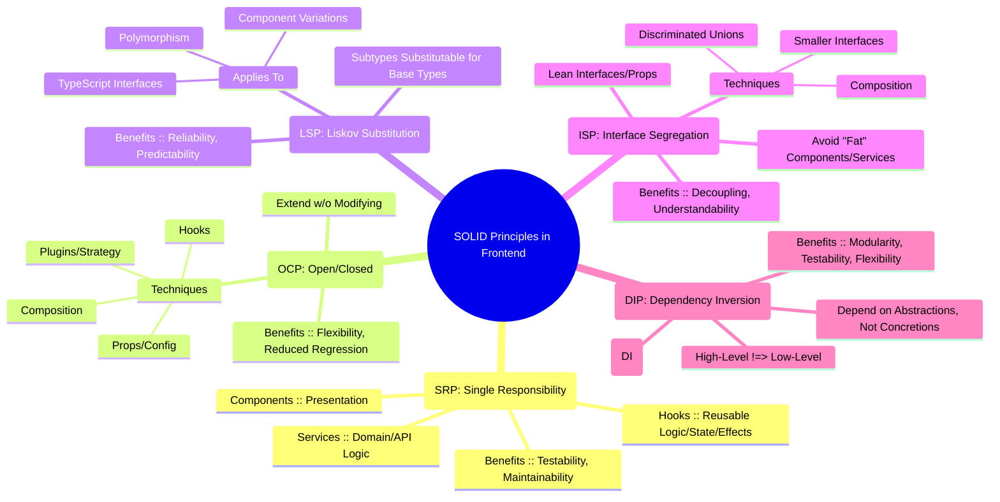
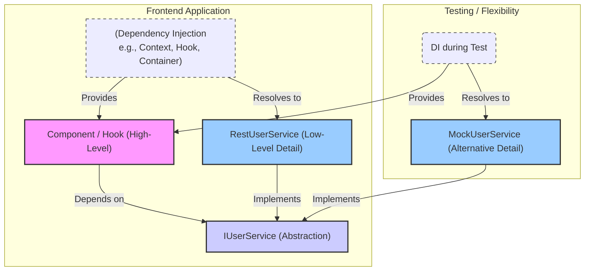

# Chapter 4: SOLID Principles in Frontend Architecture

The quest for building robust, scalable, and maintainable software systems is not new. Decades of software engineering have yielded principles that stand the test of time, guiding developers towards creating systems that are easier to understand, modify, and extend. Among the most influential are the SOLID principles, a mnemonic acronym for five design principles aimed at making software designs more understandable, flexible, and maintainable.

Coined by Robert C. Martin ("Uncle Bob"), these principles originated primarily in the context of object-oriented programming (OOP). However, their underlying concepts – managing dependencies, defining clear responsibilities, and designing for change – are universally applicable and incredibly relevant to modern frontend development, even in paradigms heavily influenced by functional programming concepts, such as those found in React, Vue, Angular, and Svelte.

In the context of frontend architecture, applying SOLID principles helps us combat complexity as applications grow. They guide us in structuring components, hooks, services, and state management logic in ways that prevent tightly coupled, monolithic structures often referred to as "spaghetti code." Adhering to SOLID leads to systems that are:

- **Easier to Maintain:** Changes in one part of the system have minimal impact on others.
- **More Testable:** Components and modules can be tested in isolation.
- **More Reusable:** Well-defined, focused units are easier to reuse across the application or even in different projects.
- **More Scalable:** The architecture can accommodate new features and team growth more gracefully.

This chapter will delve into each of the five SOLID principles, translating their core ideas into the practical realities of building production-grade frontend applications. We will explore how to apply them to components, custom hooks, services, and the overall structure of our frontend codebase, using practical examples and highlighting their impact on achieving the goals outlined in Chapter 1.

## A. Single Responsibility Principle (SRP)

> **Definition:** A class (or, in our context, a module, component, hook, or function) should have only one reason to change.

The SRP is arguably one of the most important yet sometimes misunderstood principles. It's not about functions doing only "one thing" at the lowest possible level, but about cohesion at a higher level of abstraction. It means that a unit of code should be responsible for a single, well-defined piece of functionality or concern within the application. If a module or component has multiple "reasons to change," it likely violates SRP.

### 1. Defining Responsibility for Components, Hooks, Services

In frontend development, responsibilities often fall into categories like:

- **Presentation Logic:** Rendering UI elements, handling basic user interactions (clicks, input changes) that directly manipulate the view, styling.
- **State Management:** Managing local or global application state, handling state transitions.
- **Business Logic/Domain Logic:** Implementing rules specific to the application's domain (e.g., validation logic, calculations, data transformations).
- **Data Fetching/API Interaction:** Communicating with backend services, handling request/response cycles, caching.
- **Cross-Cutting Concerns:** Logging, error handling, authentication/authorization checks.

Applying SRP means striving to isolate these responsibilities:

- **Components:** Should ideally focus on presentation logic. They receive data and callbacks via props and render the UI accordingly. Complex state logic or data fetching is often better extracted.
- **Hooks:** Excellent for encapsulating reusable stateful logic, side effects (like data fetching), or complex behavior (like form handling) that can be shared across multiple components without resorting to complex inheritance or HOC patterns. A hook should have a single, clear purpose (e.g., `useFetchUserData`, `useFormValidation`, `useWindowSize`).
- **Services:** Plain JavaScript/TypeScript modules or classes often used to encapsulate specific domain logic or interactions with external systems (e.g., `ApiService`, `AuthService`, `AnalyticsService`). They centralize logic related to a specific concern, making it reusable and testable independently of the UI.

### 2. Practical Example: Refactoring a component violating SRP

Consider a `UserProfile` component that does everything: fetches user data, manages loading/error states, displays the data, and allows editing the user's name.

**Initial Version (Violating SRP):**

```typescript
// (Conceptual React Example)
import React, { useState, useEffect } from "react";
import { fetchUser, updateUser } from "./api"; // Assume API functions exist

interface User {
  id: string;
  name: string;
  email: string;
  // ... other fields
}

function UserProfile({ userId }: { userId: string }) {
  const [user, setUser] = useState<User | null>(null);
  const [isLoading, setIsLoading] = useState<boolean>(true);
  const [error, setError] = useState<string | null>(null);
  const [isEditing, setIsEditing] = useState<boolean>(false);
  const [newName, setNewName] = useState<string>("");

  useEffect(() => {
    setIsLoading(true);
    setError(null);
    fetchUser(userId)
      .then((data) => {
        setUser(data);
        setNewName(data.name); // Initialize edit field
      })
      .catch((err) => setError(err.message || "Failed to fetch user"))
      .finally(() => setIsLoading(false));
  }, [userId]);

  const handleEditToggle = () => {
    setIsEditing(!isEditing);
    if (user) setNewName(user.name); // Reset name on cancel
  };

  const handleNameChange = (event: React.ChangeEvent<HTMLInputElement>) => {
    setNewName(event.target.value);
  };

  const handleSave = async () => {
    if (!user) return;
    try {
      const updatedUser = await updateUser(userId, { name: newName });
      setUser(updatedUser);
      setIsEditing(false);
      // Maybe show a success notification
    } catch (err) {
      // Maybe show an error notification
      console.error("Failed to update user:", err);
    }
  };

  if (isLoading) return <div>Loading profile...</div>;
  if (error) return <div style={{ color: "red" }}>Error: {error}</div>;
  if (!user) return <div>User not found.</div>;

  return (
    <div>
      <h2>User Profile</h2>
      <p>ID: {user.id}</p>
      <p>Email: {user.email}</p>
      <div>
        Name:{" "}
        {isEditing ? (
          <>
            <input type="text" value={newName} onChange={handleNameChange} />
            <button onClick={handleSave}>Save</button>
            <button onClick={handleEditToggle}>Cancel</button>
          </>
        ) : (
          <>
            {user.name}
            <button onClick={handleEditToggle}>Edit</button>
          </>
        )}
      </div>
      {/* ... other user details */}
    </div>
  );
}

export default UserProfile;
```

This component has multiple reasons to change:

1.  How user data is fetched (API endpoint, method, caching).
2.  How loading/error states are handled and displayed.
3.  How the user profile data is displayed.
4.  How the user name editing UI works.
5.  How the user name is updated via the API.

**Refactored Version (Adhering to SRP):**

We can break this down using a custom hook for data fetching/state management and potentially smaller components for display and editing.

**Step 1: Create a custom hook for user data fetching and updates.**

```typescript
// hooks/useUserData.ts
import { useState, useEffect, useCallback } from "react";
import { fetchUser, updateUser } from "../api"; // Assume API functions exist

interface User {
  id: string;
  name: string;
  email: string;
  // ... other fields
}

interface UseUserDataResult {
  user: User | null;
  isLoading: boolean;
  error: string | null;
  updateUserName: (newName: string) => Promise<void>;
  refetch: () => void; // Added for potential manual refresh
}

export function useUserData(userId: string): UseUserDataResult {
  const [user, setUser] = useState<User | null>(null);
  const [isLoading, setIsLoading] = useState<boolean>(true);
  const [error, setError] = useState<string | null>(null);

  const fetchData = useCallback(() => {
    setIsLoading(true);
    setError(null);
    fetchUser(userId)
      .then((data) => setUser(data))
      .catch((err) => setError(err.message || "Failed to fetch user"))
      .finally(() => setIsLoading(false));
  }, [userId]);

  useEffect(() => {
    fetchData();
  }, [fetchData]);

  const updateUserName = useCallback(
    async (newName: string) => {
      if (!user) throw new Error("User data not available for update.");
      try {
        const updatedUser = await updateUser(userId, { name: newName });
        setUser(updatedUser);
        // Success handling (e.g., notification) could be triggered here or returned
      } catch (err) {
        console.error("Failed to update user:", err);
        // Rethrow or handle error appropriately (e.g., set an error state)
        throw err; // Propagate error for the component to handle UI feedback
      }
    },
    [userId, user]
  );

  return { user, isLoading, error, updateUserName, refetch: fetchData };
}
```

**Step 2: Refactor the `UserProfile` component and create smaller presentation components.**

```typescript
// components/UserProfileDisplay.tsx
import React from "react";

interface User {
  id: string;
  name: string;
  email: string;
}

interface UserProfileDisplayProps {
  user: User;
  onEdit: () => void; // Callback to trigger edit mode
}

export function UserProfileDisplay({ user, onEdit }: UserProfileDisplayProps) {
  return (
    <div>
      <p>ID: {user.id}</p>
      <p>Email: {user.email}</p>
      <div>
        Name: {user.name} <button onClick={onEdit}>Edit</button>
      </div>
      {/* ... other user details */}
    </div>
  );
}

// components/UserNameEditForm.tsx
import React, { useState } from "react";

interface UserNameEditFormProps {
  initialName: string;
  onSave: (newName: string) => Promise<void>; // Async save handler
  onCancel: () => void;
}

export function UserNameEditForm({
  initialName,
  onSave,
  onCancel,
}: UserNameEditFormProps) {
  const [name, setName] = useState(initialName);
  const [isSaving, setIsSaving] = useState(false);
  const [saveError, setSaveError] = useState<string | null>(null);

  const handleChange = (event: React.ChangeEvent<HTMLInputElement>) => {
    setName(event.target.value);
  };

  const handleSaveClick = async () => {
    setIsSaving(true);
    setSaveError(null);
    try {
      await onSave(name);
      // onSave should handle success state (e.g., closing the form) via onCancel or similar
    } catch (err) {
      setSaveError(err.message || "Failed to save name");
    } finally {
      setIsSaving(false);
    }
  };

  return (
    <div>
      Name:
      <input
        type="text"
        value={name}
        onChange={handleChange}
        disabled={isSaving}
      />
      <button onClick={handleSaveClick} disabled={isSaving}>
        {isSaving ? "Saving..." : "Save"}
      </button>
      <button onClick={onCancel} disabled={isSaving}>
        Cancel
      </button>
      {saveError && <p style={{ color: "red" }}>Error: {saveError}</p>}
    </div>
  );
}

// components/UserProfile.tsx (Main component, now much simpler)
import React, { useState } from "react";
import { useUserData } from "../hooks/useUserData";
import { UserProfileDisplay } from "./UserProfileDisplay";
import { UserNameEditForm } from "./UserNameEditForm";

function UserProfile({ userId }: { userId: string }) {
  const { user, isLoading, error, updateUserName } = useUserData(userId);
  const [isEditing, setIsEditing] = useState<boolean>(false);

  const handleSaveName = async (newName: string) => {
    // Error handling for the update operation is now within the hook,
    // but we might want UI feedback here. The hook rethrows the error.
    try {
      await updateUserName(newName);
      setIsEditing(false); // Close edit form on successful save
      // Show success notification if desired
    } catch (updateError) {
      // Error is already logged by the hook, but we can show a UI message here
      console.error("UI caught update error:", updateError);
      // Let UserNameEditForm display the specific error message
    }
  };

  if (isLoading) return <div>Loading profile...</div>;
  // Improved error display - could be a dedicated ErrorDisplay component
  if (error)
    return <div style={{ color: "red" }}>Error fetching profile: {error}</div>;
  if (!user) return <div>User not found.</div>;

  return (
    <div>
      <h2>User Profile</h2>
      {isEditing ? (
        <UserNameEditForm
          initialName={user.name}
          onSave={handleSaveName}
          onCancel={() => setIsEditing(false)}
        />
      ) : (
        <UserProfileDisplay user={user} onEdit={() => setIsEditing(true)} />
      )}
    </div>
  );
}

export default UserProfile;
```

Now, each part has a clearer responsibility:

- `useUserData`: Handles data fetching, loading/error states, and the update API call logic. Reason to change: API changes, state management logic changes.
- `UserProfileDisplay`: Purely presents user data. Reason to change: UI display requirements change.
- `UserNameEditForm`: Handles the specific UI and interaction logic for editing the name. Reason to change: Edit form UI/UX requirements change.
- `UserProfile`: Orchestrates the components, manages the `isEditing` state (which is local UI state), and wires the hook to the presentation components. Reason to change: Overall layout or orchestration logic changes.

### 3. Production Note: SRP's impact on testability and maintainability

Adhering to SRP significantly enhances the quality of production frontend systems:

- **Testability:** Smaller, focused units (hooks, services, presentational components) are much easier to test in isolation. `useUserData` can be tested independently of any UI framework by mocking the `api` functions. `UserProfileDisplay` and `UserNameEditForm` can be tested easily using component testing libraries (like React Testing Library or Vue Test Utils) by providing mock props, without needing to set up complex data fetching scenarios. The original monolithic component would require much more complex setup for testing different states (loading, error, editing, display).
- **Maintainability:** When a change request comes in (e.g., "change how user data is cached," or "redesign the profile display"), the scope of the change is localized. Developers can modify the relevant hook or component with higher confidence that they won't inadvertently break unrelated functionality. This reduces regression bugs and makes onboarding new team members easier, as the codebase is more modular and understandable.
- **Reusability:** The `useUserData` hook could potentially be reused by other components that need access to user data. The `UserNameEditForm` might be reusable in an admin panel or settings page. SRP promotes the creation of reusable building blocks.

## B. Open/Closed Principle (OCP)

> **Definition:** Software entities (classes, modules, functions, etc.) should be open for extension, but closed for modification.

This principle suggests that you should be able to add new functionality to a module or component without changing its existing, working code. Changing existing code risks introducing regressions and requires re-testing. Instead, we should design our systems so that new features can be added by writing new code that plugs into the existing structure.

In frontend, OCP is often achieved through techniques like:

- **Composition:** Building complex UIs or behaviors by combining smaller, independent components. New variations can often be created by composing components differently or passing different child components.
- **Props/Configuration Objects:** Passing configuration objects or specific props (like render props or component props) to control behavior or rendering, allowing customization without changing the component itself.
- **Plugin Systems/Strategy Pattern:** Abstracting variable parts of an algorithm or behavior behind an interface or function signature, allowing different implementations (strategies or plugins) to be provided.
- **Hooks:** Custom hooks can encapsulate extension points or strategies.

### 1. Designing for Extension Without Modification (Plugins, Composition)

Imagine a `DashboardWidget` component. If we need to add new types of widgets frequently, modifying the main `DashboardWidget` component each time with `if/else` or `switch` statements to handle the new type violates OCP.

A better approach is to design `DashboardWidget` to accept the specific widget _content_ or _behavior_ as an input (e.g., via children, render props, or a configuration object defining the widget type and its specific component/renderer).

Another example is a data grid component. Instead of hardcoding column definitions and rendering logic within the grid, it should accept an array of column configurations. Adding a new column type (e.g., one with custom formatting or interactive elements) might involve creating a new cell renderer component and updating the configuration, but not modifying the core `DataGrid` component itself.

### 2. Practical Example: Using composition or render props to achieve OCP

Let's refine the `Card` component example. Suppose we have a basic `Card` component, and we need different footer actions depending on where the card is used (e.g., "View Details", "Add to Cart", "Delete Item").

**Violating OCP (Modification required for new footers):**

```typescript
// (Conceptual React Example)
interface CardProps {
  title: string;
  content: React.ReactNode;
  footerType: "details" | "cart" | "delete"; // Requires modification for new types
  onAction?: () => void; // Assumes a single action type
}

function Card({ title, content, footerType, onAction }: CardProps) {
  const renderFooter = () => {
    switch (footerType) {
      case "details":
        return <button onClick={onAction}>View Details</button>;
      case "cart":
        return <button onClick={onAction}>Add to Cart</button>;
      case "delete":
        return (
          <button onClick={onAction} style={{ color: "red" }}>
            Delete
          </button>
        );
      // !!! Adding a new footer type requires modifying this component !!!
      default:
        return null;
    }
  };

  return (
    <div className="card">
      <div className="card-header">
        <h2>{title}</h2>
      </div>
      <div className="card-content">{content}</div>
      <div className="card-footer">{renderFooter()}</div>
    </div>
  );
}
```

**Achieving OCP using Composition (Passing `footer` as a prop/child):**

```typescript
// (Conceptual React Example)
interface CardProps {
  title: string;
  content: React.ReactNode;
  footer?: React.ReactNode; // Accept any valid React node as the footer
}

function Card({ title, content, footer }: CardProps) {
  return (
    <div className="card">
      <div className="card-header">
        <h2>{title}</h2>
      </div>
      <div className="card-content">{content}</div>
      {footer && <div className="card-footer">{footer}</div>}{" "}
      {/* Render footer if provided */}
    </div>
  );
}

// Usage: Now we can extend functionality without modifying Card
function ProductCard({ product }) {
  const handleAddToCart = () => {
    /* ... */
  };
  return (
    <Card
      title={product.name}
      content={<p>{product.description}</p>}
      footer={<button onClick={handleAddToCart}>Add to Cart</button>} // Provide specific footer
    />
  );
}

function SettingsCard({ setting }) {
  const handleDelete = () => {
    /* ... */
  };
  return (
    <Card
      title={setting.name}
      content={<p>Configure setting...</p>}
      footer={
        // Provide a different footer structure
        <>
          <button onClick={handleDelete} style={{ color: "red" }}>
            Delete
          </button>
          <button>Edit</button>
        </>
      }
    />
  );
}
```

In the OCP-compliant version, the `Card` component is closed for modification regarding _what_ goes in the footer, but open for extension because consumers can provide _any_ footer content they need. Adding a new type of card usage doesn't require changing `Card.tsx`.

### 3. Code Snippet: Abstracting behavior for extensibility

Let's consider a notification system where notifications can be rendered differently (e.g., toast, inline message, modal).

```typescript
// types.ts
interface NotificationData {
  id: string;
  message: string;
  type: "info" | "success" | "warning" | "error";
}

// Define a type for the rendering strategy
type NotificationRenderer = (
  notification: NotificationData,
  dismiss: () => void
) => React.ReactNode;

// NotificationService.ts (Conceptual)
class NotificationService {
  private notifications: NotificationData[] = [];
  private subscribers: Function[] = [];
  private renderer: NotificationRenderer | null = null; // Strategy

  // Allow setting the rendering strategy
  setRenderer(renderer: NotificationRenderer) {
    this.renderer = renderer;
    this.notifySubscribers(); // Re-render with the new strategy
  }

  show(message: string, type: NotificationData["type"]) {
    const newNotification: NotificationData = {
      id: Date.now().toString(),
      message,
      type,
    };
    this.notifications = [...this.notifications, newNotification];
    this.notifySubscribers();
    // Auto-dismiss logic could go here
  }

  dismiss(id: string) {
    this.notifications = this.notifications.filter((n) => n.id !== id);
    this.notifySubscribers();
  }

  subscribe(callback: Function) {
    this.subscribers.push(callback);
    return () => {
      // Unsubscribe function
      this.subscribers = this.subscribers.filter((sub) => sub !== callback);
    };
  }

  getRenderableNotifications(): React.ReactNode[] {
    if (!this.renderer) return [];
    return this.notifications.map(
      (n) => this.renderer!(n, () => this.dismiss(n.id)) // Use the configured renderer
    );
  }

  private notifySubscribers() {
    this.subscribers.forEach((cb) => cb(this.getRenderableNotifications()));
  }
}

export const notificationService = new NotificationService(); // Singleton instance

// --- Usage ---

// Define different renderers (Strategies)
const ToastRenderer: NotificationRenderer = (notification, dismiss) => (
  <div className={`toast toast-${notification.type}`}>
    {notification.message} <button onClick={dismiss}>X</button>
  </div>
);

const InlineRenderer: NotificationRenderer = (notification, dismiss) => (
  <p className={`inline-message inline-${notification.type}`}>
    {notification.message}{" "}
    <span onClick={dismiss} style={{ cursor: "pointer" }}>
      {" "}
      (dismiss)
    </span>
  </p>
);

// In your app setup or specific context:
// notificationService.setRenderer(ToastRenderer);
// or
// notificationService.setRenderer(InlineRenderer);

// A component to display notifications
function NotificationArea() {
  const [renderedNotifications, setRenderedNotifications] = useState<
    React.ReactNode[]
  >([]);

  useEffect(() => {
    const unsubscribe = notificationService.subscribe(setRenderedNotifications);
    // Initial render in case renderer was set before subscribe
    setRenderedNotifications(notificationService.getRenderableNotifications());
    return unsubscribe;
  }, []);

  return <div className="notification-container">{renderedNotifications}</div>;
}
```

Here, `NotificationService` is closed for modification regarding its core logic (managing notifications, subscribers). It's open for extension regarding _how_ notifications are rendered by allowing different `NotificationRenderer` functions (strategies) to be plugged in via `setRenderer`. Adding a new rendering style (e.g., a modal renderer) only requires creating a new renderer function, not changing `NotificationService`.

## C. Liskov Substitution Principle (LSP)

> **Definition:** Subtypes must be substitutable for their base types without altering the correctness of the program.

In simpler terms, if you have a piece of code that works with a base type (`Base`), it should also work correctly if you pass in an instance of a derived type (`Derived`) without knowing it's `Derived`. The derived type must honor the "contract" of the base type.

While frontend development doesn't always involve classical inheritance in the way OOP languages do, LSP is highly relevant when dealing with:

- **Component Variations:** Creating specialized versions of a base component (e.g., `PrimaryButton` extending `BaseButton`).
- **Polymorphism:** Components designed to render different underlying elements or accept varying sets of props based on a type discriminator.
- **TypeScript Interfaces/Types:** Ensuring that objects or component props conforming to a specific interface or type behave as expected by consumers relying on that contract.

Violations of LSP often lead to unexpected runtime errors, conditional logic (`if (instanceof Derived)`) scattered throughout the codebase to handle exceptions, and broken abstractions.

### 1. Interface Contracts and Component Hierarchies

The "contract" of a component includes:

- **Props:** Required props must be accepted, optional props should be handled gracefully, and the types must match.
- **Behavior:** Callbacks should be called as expected, emitted events should follow a defined pattern, and core functionality implied by the base type should be present.
- **Side Effects:** Subtypes shouldn't introduce surprising side effects not present in the base type's contract.
- **Return Values/Rendered Output:** While the exact output may differ, it should be compatible with what the consumer expects from the base type.

When creating variations of a component, ensure the specialized version doesn't violate the base component's contract. For example, if `BaseInput` has an `onChange` prop that receives the input value, a `FancyInput` subtype shouldn't change the signature of `onChange` or fail to call it when the input changes.

### 2. Practical Example: Ensuring substitutability in component variations

Imagine a `FormField` component designed to work with various input controls. It expects its child input component to accept `value`, `onChange`, and `id` props.

```typescript
// (Conceptual React Example)
interface InputControlProps {
  id: string;
  value: string;
  onChange: (value: string) => void;
  label: string; // Added for context
}

// Base Input - Conforms to the expected contract
function TextInput({ id, value, onChange, label }: InputControlProps) {
  return (
    <div>
      <label htmlFor={id}>{label}: </label>
      <input
        type="text"
        id={id}
        value={value}
        onChange={(e) => onChange(e.target.value)}
      />
    </div>
  );
}

// A specialized input - Also conforms
function TextAreaInput({ id, value, onChange, label }: InputControlProps) {
  return (
    <div>
      <label htmlFor={id}>{label}: </label>
      <textarea
        id={id}
        value={value}
        onChange={(e) => onChange(e.target.value)}
      />
    </div>
  );
}

// VIOLATION of LSP: This input doesn't fully honor the contract
// It expects 'onValueChange' instead of 'onChange' and passes an event object
interface BrokenInputProps {
  // Different prop names/types
  id: string;
  currentValue: string; // Different name
  onValueChange: (event: React.ChangeEvent<HTMLInputElement>) => void; // Different signature
  label: string;
}
function BrokenInput({
  id,
  currentValue,
  onValueChange,
  label,
}: BrokenInputProps) {
  return (
    <div>
      <label htmlFor={id}>{label}: </label>
      <input
        type="text"
        id={id}
        value={currentValue}
        onChange={onValueChange} // Incorrectly passing the event
      />
    </div>
  );
}

// The consuming component expects any child conforming to InputControlProps
function FormField({
  label,
  inputId,
  renderInput,
}: {
  label: string;
  inputId: string;
  renderInput: (
    props: Pick<InputControlProps, "id" | "value" | "onChange">
  ) => React.ReactNode;
}) {
  const [fieldValue, setFieldValue] = useState("");

  const handleChange = (newValue: string) => {
    console.log(`Field ${inputId} changed to: ${newValue}`);
    setFieldValue(newValue);
  };

  return (
    <div className="form-field">
      {/* FormField provides the props based on the expected contract */}
      {renderInput({ id: inputId, value: fieldValue, onChange: handleChange })}
    </div>
  );
}

// Usage
function MyForm() {
  return (
    <form>
      <FormField
        label="Name"
        inputId="name-input"
        renderInput={(props) => <TextInput {...props} label="Name" />} // Works
      />
      <FormField
        label="Description"
        inputId="desc-input"
        renderInput={(props) => (
          <TextAreaInput {...props} label="Description" />
        )} // Works
      />
      {/*
      <FormField
        label="Broken"
        inputId="broken-input"
        // This would cause type errors or runtime errors because BrokenInput
        // does not accept the props provided by FormField as expected.
        // FormField provides { id, value, onChange }, but BrokenInput expects
        // { id, currentValue, onValueChange }.
        renderInput={(props) => <BrokenInput {...props} label="Broken" />} // FAILS LSP!
      />
      */}
    </form>
  );
}
```

In this example, `FormField` relies on the contract defined implicitly (or explicitly via `InputControlProps`). `TextInput` and `TextAreaInput` are substitutable because they adhere to this contract. `BrokenInput` violates LSP because it changes prop names (`value` -> `currentValue`) and the `onChange` signature, breaking the expectation of `FormField`. `FormField` would either fail to compile (with TypeScript) or malfunction at runtime if `BrokenInput` were used.

### 3. Deep Dive: LSP implications in TypeScript interfaces/types

TypeScript is a powerful tool for enforcing LSP at compile time, primarily through its structural typing system and interfaces/types.

When you define an interface or type for component props, you establish the contract:

```typescript
interface ButtonProps {
  onClick: () => void;
  disabled?: boolean;
  children: React.ReactNode;
  variant: "primary" | "secondary"; // Base variants
}

interface IconProps {
  iconName: string;
  "aria-label": string;
}

// An IconButton might extend ButtonProps
// LSP Check: Does IconButton correctly implement ButtonProps?
interface IconButtonProps
  extends Omit<ButtonProps, "children" | "variant">,
    IconProps {
  // We omit children because the icon takes its place.
  // We might constrain or fix the variant, or allow it. Let's fix it.
  variant?: "icon"; // Optional override, but maybe fixed is better design
}

// Implementation (Conceptual)
function BaseButton(props: ButtonProps) {
  /* ... renders button ... */
}
function IconButton(props: IconButtonProps) {
  // Can we substitute IconButton where BaseButton is expected?
  // Not directly, because the props shape differs (no children, adds iconName).
  // However, if a function EXPECTS a component that takes an `onClick` and `disabled` prop,
  // BOTH BaseButton and IconButton satisfy that part of the contract.

  // Example: A component that just needs a clickable element
  function ClickableContainer({
    renderButton,
  }: {
    renderButton: (
      props: Pick<ButtonProps, "onClick" | "disabled">
    ) => React.ReactNode;
  }) {
    const handleClick = () => {
      /* ... */
    };
    return renderButton({ onClick: handleClick, disabled: false });
  }

  // Usage:
  // <ClickableContainer renderButton={(props) => <BaseButton {...props} variant="primary">Click Me</BaseButton>} /> // OK
  // <ClickableContainer renderButton={(props) => <IconButton {...props} iconName="close" aria-label="Close" />} /> // OK - IconButton accepts onClick/disabled
}
```

**Key TypeScript Considerations for LSP:**

1.  **Subtype Compatibility:** A subtype's properties must be assignable to the base type's properties. It can have _more_ properties, but not fewer required ones.
2.  **Method Parameter Contravariance:** If overriding a method, the parameter types in the subtype method must be the same or a _supertype_ of the parameter types in the base type method. (Less common in typical component props).
3.  **Method Return Type Covariance:** The return type of an overridden method in the subtype must be the same or a _subtype_ of the return type in the base type method.
4.  **Exceptions:** Subtypes should not throw new types of exceptions (or errors) that the base type's method is not declared to throw (less formally enforced in JS/TS, but good practice).

While TypeScript helps significantly, LSP also concerns _behavior_. A subtype might satisfy the type contract but behave unexpectedly at runtime (e.g., a `ReadOnlyInput` subtype of `BaseInput` that silently ignores calls to `onChange`). This behavioral aspect requires careful design and testing.

## D. Interface Segregation Principle (ISP)

> **Definition:** Clients should not be forced to depend on interfaces (or props/methods) they do not use.

ISP is about keeping interfaces (in the general sense, including component prop types, API contracts for hooks or services) lean and focused. Large, monolithic interfaces ("fat interfaces") force consumers to be aware of and potentially depend on methods or properties they don't actually need. This leads to unnecessary coupling and makes the system harder to understand and modify.

In frontend development, ISP translates to:

- Avoiding components with an excessive number of props, especially if many props are only relevant in specific scenarios.
- Designing hooks and services with focused APIs, rather than single hooks/services that do too many unrelated things.
- Breaking down large configuration objects into smaller, more specific ones.

### 1. Designing Fine-Grained Interfaces/Props

Instead of one giant `props` interface, prefer smaller, more focused interfaces or types. Composition can be used to combine these smaller interfaces when needed.

**Violation of ISP ("Fat" Props Interface):**

```typescript
// (Conceptual React Example)
interface MegaComponentProps {
  // User data props
  userId: string;
  userName: string;
  userAvatarUrl?: string;

  // Product data props (only used if type === 'product')
  productId?: string;
  productName?: string;
  productPrice?: number;
  onAddToCart?: (productId: string) => void;

  // Article data props (only used if type === 'article')
  articleId?: string;
  articleTitle?: string;
  articleSnippet?: string;
  onReadMore?: (articleId: string) => void;

  // General props
  type: "user" | "product" | "article";
  isLoading: boolean;
  theme: "light" | "dark";
  // ... potentially many more props
}

// This component forces consumers to know about user, product, AND article props,
// even if they only care about one type.
function MegaComponent(props: MegaComponentProps) {
  if (props.isLoading) return <div>Loading...</div>;

  switch (props.type) {
    case "user":
      return (
        <div className={`user-widget theme-${props.theme}`}>
          {" "}
          {/* Uses user props */}{" "}
        </div>
      );
    case "product":
      return (
        <div className={`product-widget theme-${props.theme}`}>
          {" "}
          {/* Uses product props */}{" "}
        </div>
      );
    case "article":
      return (
        <div className={`article-widget theme-${props.theme}`}>
          {" "}
          {/* Uses article props */}{" "}
        </div>
      );
    default:
      return null;
  }
}

// Consumer displaying only a user:
// <MegaComponent type="user" userId="123" userName="Alice" isLoading={false} theme="dark"
//    // Must still satisfy the type, even though product/article props are irrelevant
//    productId={undefined} /* or pass null/undefined if optional */
//    articleId={undefined}
// />
```

This `MegaComponentProps` interface forces any consumer to be aware of props related to users, products, _and_ articles, even if they are only rendering one type. If a prop related to `product` changes, consumers only interested in `user` might still be affected (e.g., during refactoring or type checking).

### 2. Avoiding "Fat" Components or Services

Components or services that expose a vast API surface area, trying to cater to every possible use case, often violate ISP. This makes them difficult to use correctly, as developers need to understand the entire API even if they only need a small part of it. It also makes the component/service harder to maintain and test.

The solution is often to break down the "fat" entity into smaller, more specialized ones. For components, this means favoring composition over monolithic components with conditional rendering based on numerous props. For services or hooks, it means creating separate services/hooks for distinct responsibilities (aligning with SRP as well).

### 3. Practical Example: Breaking down large prop types

Let's refactor the `MegaComponent` example using ISP. We can create separate components or use discriminated unions more effectively.

**Approach 1: Separate Components (Composition)**

```typescript
// (Conceptual React Example)

// Common props
interface BaseWidgetProps {
  isLoading: boolean;
  theme: "light" | "dark";
}

// Specific props per type
interface UserWidgetProps extends BaseWidgetProps {
  userId: string;
  userName: string;
  userAvatarUrl?: string;
}
interface ProductWidgetProps extends BaseWidgetProps {
  productId: string;
  productName: string;
  productPrice: number;
  onAddToCart: (productId: string) => void;
}
interface ArticleWidgetProps extends BaseWidgetProps {
  articleId: string;
  articleTitle: string;
  articleSnippet: string;
  onReadMore: (articleId: string) => void;
}

// Separate, focused components
function UserWidget(props: UserWidgetProps) {
  if (props.isLoading) return <div>Loading...</div>;
  return (
    <div className={`user-widget theme-${props.theme}`}>
      {" "}
      {/* Render user */}{" "}
    </div>
  );
}
function ProductWidget(props: ProductWidgetProps) {
  if (props.isLoading) return <div>Loading...</div>;
  return (
    <div className={`product-widget theme-${props.theme}`}>
      {" "}
      {/* Render product */}{" "}
    </div>
  );
}
function ArticleWidget(props: ArticleWidgetProps) {
  if (props.isLoading) return <div>Loading...</div>;
  return (
    <div className={`article-widget theme-${props.theme}`}>
      {" "}
      {/* Render article */}{" "}
    </div>
  );
}

// Consumer displaying only a user:
// <UserWidget userId="123" userName="Alice" isLoading={false} theme="dark" />
// Consumer only needs to know about UserWidgetProps. Much cleaner.
```

**Approach 2: Discriminated Union (If a single component is desired)**

```typescript
// (Conceptual React Example)

// Base props shared by all variants
interface BaseDisplayProps {
  isLoading: boolean;
  theme: "light" | "dark";
}

// Define specific props for each type, including the discriminator ('type')
interface UserDisplayProps extends BaseDisplayProps {
  type: "user";
  userId: string;
  userName: string;
  userAvatarUrl?: string;
}
interface ProductDisplayProps extends BaseDisplayProps {
  type: "product";
  productId: string;
  productName: string;
  productPrice: number;
  onAddToCart: (productId: string) => void;
}
interface ArticleDisplayProps extends BaseDisplayProps {
  type: "article";
  articleId: string;
  articleTitle: string;
  articleSnippet: string;
  onReadMore: (articleId: string) => void;
}

// Create a discriminated union type
type DisplayWidgetProps =
  | UserDisplayProps
  | ProductDisplayProps
  | ArticleDisplayProps;

// A single component, but props are now type-safe based on 'type'
function DisplayWidget(props: DisplayWidgetProps) {
  if (props.isLoading) return <div>Loading...</div>;

  // TypeScript now understands that if props.type === 'user',
  // then props like props.userName are available, but props.productId is not.
  switch (props.type) {
    case "user":
      return (
        <div className={`user-widget theme-${props.theme}`}>
          User: {props.userName}
        </div>
      );
    case "product":
      return (
        <div className={`product-widget theme-${props.theme}`}>
          Product: {props.productName}{" "}
          <button onClick={() => props.onAddToCart(props.productId)}>
            Add
          </button>
        </div>
      );
    case "article":
      return (
        <div className={`article-widget theme-${props.theme}`}>
          Article: {props.articleTitle}{" "}
          <button onClick={() => props.onReadMore(props.articleId)}>
            Read
          </button>
        </div>
      );
    default:
      // Exhaustiveness check (useful with discriminated unions)
      const _exhaustiveCheck: never = props;
      return null;
  }
}

// Consumer displaying only a user:
// <DisplayWidget type="user" userId="123" userName="Alice" isLoading={false} theme="dark" />
// Consumer still provides props for only one type. Type safety prevents mixing props.
```

Both refactored approaches adhere better to ISP. The first approach (separate components) is often preferred for better separation and reusability. The second approach (discriminated union) keeps related logic within one component but uses TypeScript's type system to ensure consumers only deal with relevant props for the specific `type` they are using, effectively segregating the interfaces based on the discriminator.

## E. Dependency Inversion Principle (DIP)

> **Definition:**
> A. High-level modules should not depend on low-level modules. Both should depend on abstractions (e.g., interfaces).
> B. Abstractions should not depend on details. Details (concrete implementations) should depend on abstractions.

DIP is about decoupling modules by introducing abstractions between them. Instead of a high-level component (e.g., a user profile page) directly importing and instantiating a low-level service (e.g., a specific `FetchApiUserService`), the high-level component should depend on an abstract interface (e.g., `IUserService`), and the low-level service should implement that interface.

This "inverts" the traditional dependency flow. The control over which implementation is used is inverted, often managed externally through Dependency Injection (DI).

### 1. Decoupling High-Level Modules from Low-Level Implementations

In frontend architecture:

- **High-Level Modules:** Often UI components, pages, or features that orchestrate user interactions and display information (e.g., `UserProfilePage`, `ShoppingCart`, `Dashboard`).
- **Low-Level Modules:** Often services responsible for specific tasks like data fetching, browser storage access, logging, analytics, or interacting with third-party libraries (e.g., `RestApiService`, `LocalStorageService`, `SentryLogger`, `GoogleAnalyticsService`).

Without DIP, a `UserProfilePage` might directly import and use `RestApiService`:

```typescript
// Violation of DIP
import { RestApiService } from "../services/RestApiService"; // Direct dependency on concrete implementation

function UserProfilePage({ userId }) {
  const apiService = new RestApiService(); // Instantiation inside high-level module

  useEffect(() => {
    apiService.getUser(userId).then(/* ... */);
  }, [userId, apiService]); // apiService dependency might be unstable if recreated

  // ...
}
```

This creates tight coupling:

1.  `UserProfilePage` knows about the existence and specifics of `RestApiService`.
2.  Replacing `RestApiService` (e.g., with a `GraphQLApiService` or a mock for testing) requires modifying `UserProfilePage`.
3.  Testing `UserProfilePage` in isolation is difficult because it's tied to the real `RestApiService`.

With DIP, `UserProfilePage` depends on an abstraction:

```typescript
// Adhering to DIP
import { IUserService } from "../services/IUserService"; // Dependency on abstraction
import { useService } from "../context/ServiceContext"; // Mechanism to get implementation

function UserProfilePage({ userId }) {
  // The actual implementation is provided externally (e.g., via Context/DI)
  const userService: IUserService = useService<IUserService>("IUserService");

  useEffect(() => {
    userService.getUser(userId).then(/* ... */);
  }, [userId, userService]);

  // ...
}

// Somewhere else (e.g., App setup, Service Context Provider):
// The concrete implementation (RestApiService) depends on the abstraction (IUserService)
import { RestApiService } from "../services/RestApiService";
// registerService('IUserService', new RestApiService());
```

Now, `UserProfilePage` only knows about the `IUserService` contract. It doesn't care about the specific implementation (`RestApiService`, `GraphQLApiService`, `MockUserService`). This decoupling makes the system more flexible, modular, and testable.

### 2. Dependency Injection in Frontend (Services, Hooks)

Dependency Injection is a common pattern to achieve DIP. It's the process of providing the concrete dependencies (implementations) to a module from an external source, rather than having the module create them itself.

Common DI techniques in frontend include:

- **React Context API / Vue Provide/Inject / Angular DI:** Framework-specific ways to provide dependencies down the component tree. Suitable for providing services or configuration available to many components.
- **Props Drilling (Manual DI):** Passing dependencies down through props. Can become cumbersome for deep hierarchies but is explicit.
- **Custom Hooks:** Hooks can encapsulate logic for retrieving dependencies from context or other sources.
- **Dedicated DI Containers:** Libraries like `InversifyJS`, `tsyringe`, or simpler custom solutions can manage dependency registration and resolution, especially useful in larger applications or outside of component trees (e.g., in services).
- **Module Factories/Service Locators:** Functions or objects responsible for creating or locating service instances.

### 3. Practical Example: Injecting an API service into a component/hook

Let's refine the `useUserData` hook from the SRP example to use DIP.

**Step 1: Define the Abstraction (Interface)**

```typescript
// services/IUserService.ts
export interface User {
  id: string;
  name: string;
  email: string;
}

export interface IUserService {
  getUser(userId: string): Promise<User>;
  updateUser(userId: string, data: Partial<Pick<User, "name">>): Promise<User>;
}

// Define a token/key for DI if using a container or context map
export const UserServiceToken = "IUserService";
```

**Step 2: Create the Concrete Implementation**

```typescript
// services/RestUserService.ts
import { IUserService, User } from "./IUserService";
import { fetchUser, updateUser } from "../api"; // Assume these low-level API functions exist

export class RestUserService implements IUserService {
  async getUser(userId: string): Promise<User> {
    console.log(`RestUserService: Fetching user ${userId}`);
    // In production, use a proper HTTP client (axios, fetch)
    return fetchUser(userId);
  }

  async updateUser(
    userId: string,
    data: Partial<Pick<User, "name">>
  ): Promise<User> {
    console.log(`RestUserService: Updating user ${userId} with`, data);
    return updateUser(userId, data);
  }
}
```

**Step 3: Set up Dependency Injection (Using React Context as an example)**

```typescript
// context/ServiceContext.tsx
import React, { createContext, useContext } from "react";
import { IUserService, UserServiceToken } from "../services/IUserService";
import { RestUserService } from "../services/RestUserService";
// Import other services and tokens...

// Define the shape of the context value (a map of service tokens to instances)
interface ServiceRegistry {
  [key: string]: any;
}

const ServiceContext = createContext<ServiceRegistry | null>(null);

export function ServiceProvider({ children }: { children: React.ReactNode }) {
  // Instantiate services ONCE here (or use a more sophisticated DI container)
  const services: ServiceRegistry = {
    [UserServiceToken]: new RestUserService(),
    // Add other services:
    // [AuthServiceToken]: new FirebaseAuthService(),
  };

  return (
    <ServiceContext.Provider value={services}>
      {children}
    </ServiceContext.Provider>
  );
}

// Custom hook to easily consume services
export function useService<T>(token: string): T {
  const services = useContext(ServiceContext);
  if (!services) {
    throw new Error("useService must be used within a ServiceProvider");
  }
  const serviceInstance = services[token];
  if (!serviceInstance) {
    throw new Error(`Service with token "${token}" not registered.`);
  }
  return serviceInstance as T;
}

// In your main application file (e.g., App.tsx or index.tsx)
// Wrap your application with the provider
// <ServiceProvider>
//   <App />
// </ServiceProvider>
```

**Step 4: Use the Injected Service in the Hook**

```typescript
// hooks/useUserData.ts (Now depends on abstraction + DI hook)
import { useState, useEffect, useCallback } from "react";
import { IUserService, UserServiceToken, User } from "../services/IUserService";
import { useService } from "../context/ServiceContext";

// ... (UseUserDataResult interface remains the same)

export function useUserData(userId: string): UseUserDataResult {
  // Get the IUserService implementation via DI
  const userService = useService<IUserService>(UserServiceToken);

  const [user, setUser] = useState<User | null>(null);
  const [isLoading, setIsLoading] = useState<boolean>(true);
  const [error, setError] = useState<string | null>(null);

  const fetchData = useCallback(() => {
    setIsLoading(true);
    setError(null);
    // Use the injected service
    userService
      .getUser(userId)
      .then((data) => setUser(data))
      .catch((err) => setError(err.message || "Failed to fetch user"))
      .finally(() => setIsLoading(false));
  }, [userId, userService]); // Add userService to dependency array

  useEffect(() => {
    fetchData();
  }, [fetchData]);

  const updateUserName = useCallback(
    async (newName: string) => {
      if (!user) throw new Error("User data not available for update.");
      try {
        // Use the injected service
        const updatedUser = await userService.updateUser(userId, {
          name: newName,
        });
        setUser(updatedUser);
      } catch (err) {
        console.error("Failed to update user:", err);
        throw err;
      }
    },
    [userId, user, userService]
  ); // Add userService to dependency array

  return { user, isLoading, error, updateUserName, refetch: fetchData };
}
```

Now, `useUserData` depends only on the `IUserService` abstraction and the `useService` hook for obtaining an implementation. It is completely decoupled from `RestUserService`.

### 4. Production Note: DIP's role in enabling modularity and testing

DIP is crucial for building scalable and maintainable production systems:

- **Modularity & Flexibility:** Different implementations of services can be swapped easily without modifying the consuming components or hooks. This is invaluable for:
  - **A/B Testing:** Injecting different service implementations for different user segments.
  - **Platform Adaptation:** Providing different storage implementations for web vs. mobile vs. desktop.
  - **Refactoring/Migration:** Introducing a new API version (e.g., `GraphQLUserService`) alongside the old one (`RestUserService`) and gradually migrating components by changing the injected dependency.
  - **Feature Flags:** Injecting different service behaviors based on feature flag configurations.
- **Testability:** DIP makes unit and integration testing significantly easier. When testing `useUserData` or `UserProfilePage`, we can easily inject a `MockUserService` that returns predefined data or simulates error conditions, without needing a live backend or complex mocking of network requests within the component/hook tests.

```typescript
// Example: Testing useUserData with a mock service
import { renderHook, act } from "@testing-library/react-hooks";
import { IUserService, User, UserServiceToken } from "../services/IUserService";
import { ServiceProvider, useService } from "../context/ServiceContext"; // Assuming context setup
import { useUserData } from "./useUserData";

// Create a mock implementation
const mockUser: User = {
  id: "test-1",
  name: "Mock User",
  email: "mock@test.com",
};
const mockUserService: IUserService = {
  getUser: jest.fn().mockResolvedValue(mockUser),
  updateUser: jest
    .fn()
    .mockResolvedValue({ ...mockUser, name: "Updated Mock" }),
};

// Custom wrapper for testing hooks that use the ServiceContext
const createWrapper =
  (services: { [key: string]: any }) =>
  ({ children }: { children: React.ReactNode }) =>
    (
      <ServiceContext.Provider value={services}>
        {children}
      </ServiceContext.Provider>
    );

test("useUserData fetches user using injected service", async () => {
  const wrapper = createWrapper({ [UserServiceToken]: mockUserService });
  const { result, waitForNextUpdate } = renderHook(
    () => useUserData("test-1"),
    { wrapper }
  );

  expect(result.current.isLoading).toBe(true);
  expect(result.current.user).toBeNull();

  await waitForNextUpdate(); // Wait for the promise from getUser to resolve

  expect(result.current.isLoading).toBe(false);
  expect(result.current.user).toEqual(mockUser);
  expect(mockUserService.getUser).toHaveBeenCalledWith("test-1");
});

test("useUserData updates user using injected service", async () => {
  // Arrange: Initial fetch needs to complete first
  const wrapper = createWrapper({ [UserServiceToken]: mockUserService });
  const { result, waitForNextUpdate } = renderHook(
    () => useUserData("test-1"),
    { wrapper }
  );
  await waitForNextUpdate(); // Wait for initial fetch

  // Act: Call the update function
  await act(async () => {
    await result.current.updateUserName("Updated Mock");
  });

  // Assert
  expect(mockUserService.updateUser).toHaveBeenCalledWith("test-1", {
    name: "Updated Mock",
  });
  expect(result.current.user?.name).toBe("Updated Mock");
});
```

This test setup is clean and focuses solely on the hook's logic, thanks to the ability to inject a controlled, mock dependency.

## Visualizing SOLID in Frontend

To better understand how these principles interrelate and apply within a frontend context, let's visualize them.



**Diagram Explanation:** This mind map summarizes the five SOLID principles, highlighting their core concepts, common application areas in frontend (Components, Hooks, Services), key techniques for achieving them, and the primary benefits each principle brings to frontend architecture.



**Diagram Explanation:** This graph illustrates the Dependency Inversion Principle. The high-level Component/Hook depends on an Abstraction (`IUserService`), not the concrete `RestUserService`. Dependency Injection provides the appropriate implementation (`RestUserService` in production, `MockUserService` during testing) which itself depends on (implements) the Abstraction. This decouples the high-level module from low-level details, enabling flexibility and testability.

## Conclusion

The SOLID principles provide a powerful mental framework for designing frontend architectures that are robust, maintainable, and scalable. While originating in OOP, their core ideas of managing coupling, defining clear responsibilities, and designing for change are universally applicable to components, hooks, services, and state management in modern frontend development.

- **SRP** guides us to create focused, cohesive units of code, improving testability and reducing the ripple effect of changes.
- **OCP** encourages designing for extension through composition and abstraction, minimizing the need to modify existing, stable code.
- **LSP** ensures that abstractions and variations (like component subtypes or interface implementations) are reliable and interchangeable.
- **ISP** promotes lean interfaces and props, preventing unnecessary coupling and improving clarity.
- **DIP** decouples high-level logic from low-level implementation details through abstractions and dependency injection, unlocking modularity and testability.

Applying these principles requires thoughtful consideration and is not always straightforward. There can be trade-offs, and sometimes pragmatic decisions might lead to minor deviations. However, understanding and striving to adhere to SOLID principles fundamentally shifts how we approach frontend development, moving from ad-hoc solutions towards building truly production-grade, scalable systems. They form a crucial foundation upon which the more specific patterns and strategies discussed in subsequent chapters (Component Design, State Management, Project Structure) can be effectively built.
