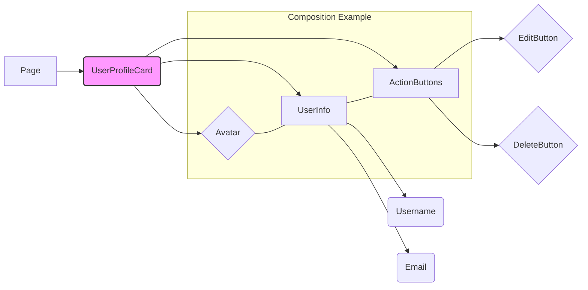
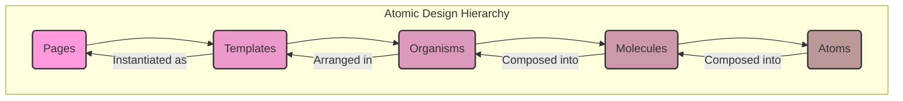

# Chapter 5: Component Design and Architecture

Components are the fundamental building blocks of modern frontend applications. Whether you're using React, Vue, Angular, Svelte, or another framework, the concept of breaking down complex user interfaces into smaller, manageable, and potentially reusable pieces is central to development. However, simply creating components isn't enough for building production-grade, scalable systems. The _way_ components are designed, architected, and interact with each other profoundly impacts maintainability, performance, team velocity, and the overall resilience of the application.

Poor component design leads to tightly coupled systems that are difficult to refactor, test, and scale. Components might become bloated "god objects" handling too many responsibilities, or conversely, an application might suffer from a proliferation of slightly different components that could have been unified. Effective component architecture, therefore, is not just a coding practice but a strategic discipline essential for long-term project health.

This chapter delves into the principles, patterns, and methodologies crucial for designing robust, scalable, and maintainable components. We will explore foundational concepts, practical methodologies like Atomic Design, advanced patterns for flexibility, and the critical role of accessibility in component development.

## A. Principles of Effective Component Design

At the heart of good component architecture lie several core principles. Adhering to these principles helps create components that are easier to understand, test, modify, and reuse across different parts of an application or even across different projects.

### 1. Reusability vs. Specificity

One of the primary goals of componentization is reusability. However, striving for universal reusability can sometimes lead to overly complex components with numerous props and conditional logic, making them hard to manage. Conversely, creating highly specific components for every minor variation leads to code duplication and maintenance overhead.

> **Definition: Reusability** refers to the ability of a component to be used in multiple contexts without modification.
> **Definition: Specificity** refers to a component being tailored for a particular use case or context.

The key is finding the right balance:

- **Identify Core Patterns:** Look for recurring UI patterns or functionalities within your application. These are good candidates for reusable components (e.g., Buttons, Inputs, Modals, Cards).
- **Start Specific, Refactor Towards Reusability:** It's often easier to start with a component tailored to its initial context and then refactor it for broader reusability _if and when_ a similar need arises elsewhere. Premature abstraction can be costly.
- **Use Composition:** Instead of adding endless configuration props to a single component, compose simpler, reusable components together to achieve specific variations (more on this next).
- **Context Matters:** A component designed for a marketing site might have different requirements (e.g., animation focus) than one for a complex data dashboard (e.g., performance focus), even if they look similar.

**Example: Balancing Button Reusability**

- **Naive Approach (Overly Specific):** Creating `PrimaryButton`, `SecondaryButton`, `DangerButton`, `IconButton`, `SubmitButton`, etc., as entirely separate components. This leads to duplicated styling and logic.
- **Naive Approach (Overly Reusable):** Creating a single `<Button>` component with props like `isPrimary`, `isSecondary`, `isDanger`, `hasIcon`, `iconName`, `isSubmit`, `isDisabled`, `isLoading`, `size`, `fullWidth`, etc. This component quickly becomes bloated and difficult to manage.
- **Balanced Approach:** Create a base `<Button>` component handling common functionality (click handling, disabled state, basic styling). Use props like `variant="primary|secondary|danger"` and `size="small|medium|large"` for common variations. Use composition (passing an `<Icon>` component as a child) for icons. For highly specific use cases, compose this base button within a more specific wrapper component.

```jsx
// Balanced Approach Example (Conceptual React)

// Base Button (Reusable Core)
function Button({
  variant = "secondary",
  size = "medium",
  children,
  ...props
}) {
  const baseClasses = "button";
  const variantClasses = `button--${variant}`;
  const sizeClasses = `button--${size}`;
  // ... logic for disabled, loading states ...
  return (
    <button
      className={`${baseClasses} ${variantClasses} ${sizeClasses}`}
      {...props}
    >
      {children}
    </button>
  );
}

// Usage for specific cases
function SubmitFormButton({ isLoading, ...props }) {
  return (
    <Button variant="primary" type="submit" disabled={isLoading} {...props}>
      {isLoading ? <Spinner /> : "Submit"}
    </Button>
  );
}

function DeleteItemButton({ onClick }) {
  return (
    <Button variant="danger" onClick={onClick}>
      <Icon name="trash" /> Delete
    </Button>
  );
}
```

This balanced approach promotes reuse of the core button logic and styling while allowing for specific adaptations through props and composition without overburdening the base component.

### 2. Composition over Inheritance

While object-oriented programming often relies heavily on inheritance, component-based UI development strongly favors composition.

> **Definition: Composition** involves building complex components by combining simpler, independent components. Functionality is achieved by assembling parts.
> **Definition: Inheritance** (in a UI context, often simulated) involves creating specialized components by extending or inheriting properties and behaviors from a base component.

**Why favor composition?**

- **Flexibility:** Composition makes it easier to mix and match functionalities. You can assemble components in various ways without being locked into a rigid inheritance hierarchy.
- **Reduced Coupling:** Components interacting through well-defined APIs (props, events) are less coupled than those relying on internal implementation details inherited from a parent class.
- **Clearer Data Flow:** Props and events provide explicit pathways for data and actions, making it easier to trace how information flows through the application. Inheritance can obscure this flow.
- **Avoids Fragile Base Class Problem:** Changes to a base component in an inheritance model can unintentionally break numerous derived components. Composition limits the blast radius of changes.

Modern frontend frameworks are inherently compositional. Props, children props (like `children` in React or `<slot>` in Vue/Web Components), and context APIs are all mechanisms facilitating composition.



_Diagram Explanation:_ This diagram illustrates how a `UserProfileCard` component (Organism level) is composed of smaller, independent components like `Avatar`, `UserInfo`, and `ActionButtons` (Molecule/Atom level). The `Page` component uses the composed `UserProfileCard`.

### 3. Separation of Concerns (Presentational vs. Container/Logic Components)

This is a classic pattern, popularized by Dan Abramov, aimed at separating the _look and feel_ of a component from its _behavior and data fetching_.

- **Presentational Components (Dumb Components):**

  - **Concern:** How things look (markup, styles).
  - **Awareness:** Receive data and callbacks exclusively via props.
  - **State:** Rarely have their own state (except perhaps UI state like "is dropdown open?").
  - **Data Source:** Do not fetch data or interact directly with global state stores.
  - **Reusability:** Highly reusable across different contexts as their appearance is decoupled from specific data sources or actions.
  - **Examples:** `Button`, `UserAvatar`, `DataTable`, `ModalDialog`.

- **Container Components (Smart Components / Logic Components):**
  - **Concern:** How things work (data fetching, state management, event handling logic).
  - **Awareness:** Interact with data sources (APIs, state management libraries like Redux/Zustand/Pinia).
  - **State:** Often stateful, managing data and UI logic.
  - **Rendering:** Primarily render one or more Presentational components, passing them data and callbacks as props.
  - **Reusability:** Less reusable, often tied to a specific part of the application or data source.
  - **Examples:** `UserProfileContainer`, `ProductListContainer`, `ShoppingCartManager`.

**Benefits:**

- **Improved Reusability:** Presentational components can be easily reused with different data sources.
- **Better Testability:** Presentational components are pure functions of their props, making them easy to test visually (e.g., Storybook) and with snapshot testing. Container components can be tested for their logic, often mocking the presentational components they render.
- **Clearer Separation:** Developers can focus either on the UI/UX aspects (Presentational) or the application logic/data flow (Container).

**Modern Evolution (Hooks):**

With the advent of Hooks (React) and similar composition APIs (Vue Composition API), the strict separation isn't always implemented with distinct "Container" and "Presentational" files. Hooks allow developers to encapsulate logic (data fetching, state) into reusable functions that can be consumed directly within functional components.

Even with Hooks, the _principle_ remains vital: **Separate rendering logic from business logic and data fetching concerns.** A component might use custom hooks to manage its logic, but it should still strive to delegate the pure rendering aspects to simpler, potentially reusable child components that receive data via props.

**Example: User List**

- **`UserList.jsx` (Presentational):**
  ```jsx
  function UserList({ users, onSelectUser, selectedUserId }) {
    if (!users || users.length === 0) {
      return <p>No users found.</p>;
    }
    return (
      <ul>
        {users.map((user) => (
          <li
            key={user.id}
            onClick={() => onSelectUser(user.id)}
            className={user.id === selectedUserId ? "selected" : ""}
          >
            {user.name} ({user.email})
          </li>
        ))}
      </ul>
    );
  }
  ```
- **`UserListContainer.jsx` (Container - Traditional):**

  ```jsx
  import { useState, useEffect } from "react";
  import UserList from "./UserList";
  import { fetchUsers } from "./api"; // Assume an API function

  function UserListContainer() {
    const [users, setUsers] = useState([]);
    const [loading, setLoading] = useState(true);
    const [error, setError] = useState(null);
    const [selectedUserId, setSelectedUserId] = useState(null);

    useEffect(() => {
      setLoading(true);
      fetchUsers()
        .then((data) => {
          setUsers(data);
          setError(null);
        })
        .catch((err) => {
          setError("Failed to load users.");
          console.error(err); // Production: Report error to monitoring service
        })
        .finally(() => setLoading(false));
    }, []);

    const handleSelectUser = (id) => {
      setSelectedUserId(id);
      // Potentially trigger other actions
    };

    if (loading) return <Spinner />;
    if (error) return <ErrorMessage message={error} />;

    return (
      <UserList
        users={users}
        onSelectUser={handleSelectUser}
        selectedUserId={selectedUserId}
      />
    );
  }
  ```

- **`UserListWithHook.jsx` (Using Custom Hook):**

  ```jsx
  // useUsers.js (Custom Hook encapsulating logic)
  import { useState, useEffect } from "react";
  import { fetchUsers } from "./api";

  function useUsers() {
    const [users, setUsers] = useState([]);
    const [loading, setLoading] = useState(true);
    // ... error handling, etc. ...
    useEffect(() => {
      /* ... fetch logic ... */
    }, []);
    return { users, loading, error };
  }

  // UserListWithHook.jsx (Component using the hook)
  import UserList from "./UserList"; // Reuse the same presentational component
  import { useUsers } from "./useUsers";
  import { useState } from "react";

  function UserListWithHook() {
    const { users, loading, error } = useUsers();
    const [selectedUserId, setSelectedUserId] = useState(null);

    const handleSelectUser = (id) => setSelectedUserId(id);

    if (loading) return <Spinner />;
    if (error) return <ErrorMessage message={error} />;

    // Still delegates rendering to the presentational UserList
    return (
      <UserList
        users={users}
        onSelectUser={handleSelectUser}
        selectedUserId={selectedUserId}
      />
    );
  }
  ```

### 4. API Design for Components (Props, Events, Slots)

How a component receives data and communicates outwards defines its Application Programming Interface (API). A well-designed component API is intuitive, predictable, and flexible. Key elements include:

- **Props (Properties):** Used to pass data _down_ into a component.
  - **Naming:** Use clear, descriptive names (e.g., `isDisabled` instead of `d`, `items` instead of `data`).
  - **Data Types:** Be consistent. Use TypeScript or PropTypes for static typing and validation. Avoid overly complex object structures if simpler props suffice.
  - **Booleans:** Prefer positive boolean props (e.g., `isOpen`, `isEnabled`) over negative ones (`isClosed`, `isDisabled`). Default to the least surprising state (often `false`). Avoid boolean props for mutually exclusive states; use a string enum prop instead (e.g., `status="loading|error|success"` instead of `isLoading`, `isError`, `isSuccess`).
  - **Defaults:** Provide sensible default values for optional props.
- **Events (Callbacks):** Used for components to communicate _up_ or _out_ to their parents or consumers.
  - **Naming:** Use consistent naming conventions, often prefixed with `on` (e.g., `onClick`, `onChange`, `onSubmit`, `onClose`).
  - **Payload:** Pass relevant data back with the event (e.g., `onChange(newValue)`, `onSubmit(formData)`). Avoid passing the raw browser event object unless necessary; pass processed, relevant data instead.
  - **Granularity:** Emit specific events for specific actions rather than one generic "update" event.
- **Slots (Content Projection / Children):** Allow consumers to inject arbitrary content (markup, other components) into predefined places within your component. This is `children` in React, `<slot>` in Vue/Web Components.
  - **Flexibility:** Slots provide immense flexibility for customization without adding complex configuration props.
  - **Use Cases:** Ideal for layout components (Card headers/footers), wrappers, or components where the internal structure is fixed but the content varies (e.g., Modal content).
  - **Named Slots:** Allow injecting content into multiple specific locations within a component.

**Example: API Design for a Modal Component**

- **Poor API:**

  ```jsx
  <Modal
    show={true}
    data={{ title: "Confirm Deletion", content: "Are you sure?" }}
    action1Text="Cancel"
    action1Handler={handleCancel}
    action2Text="Delete"
    action2Handler={handleDelete}
    showCloseButton={true}
    closeHandler={handleCancel}
    // ... more props for styling, size, etc.
  />
  ```

  _Problems:_ Rigid structure, forces specific button text/handlers, mixes configuration with content.\*

- **Good API (using Props and Slots/Children):**
  ```jsx
  <Modal isOpen={true} onClose={handleCancel} title="Confirm Deletion">
    <Modal.Body>
      <p>
        Are you sure you want to delete this item? This action cannot be undone.
      </p>
    </Modal.Body>
    <Modal.Footer>
      <Button variant="secondary" onClick={handleCancel}>
        Cancel
      </Button>
      <Button variant="danger" onClick={handleDelete}>
        Delete
      </Button>
    </Modal.Footer>
  </Modal>
  ```
  _Benefits:_ Clear separation of concerns (Modal handles overlay/structure, consumer provides content/actions), flexible content via children/slots, explicit event (`onClose`), uses composable `Button` components.\* This leverages the Compound Component pattern (discussed later).

### 5. State Colocation and Management within Components

Where should state live? This is a fundamental question in component architecture.

> **Principle: Colocate state as close as possible to where it's used.**

- **Local Component State:** If state is only used by a single component (and potentially its direct children via props), keep it within that component (e.g., using `useState` in React, `data` in Vue options API, or reactive variables in Vue Composition API/Svelte). This is the simplest and often best approach.
  - _Example:_ Whether a dropdown menu is currently open or closed. The input value of an uncontrolled form field.
- **Lifting State Up:** When multiple components need access to the same state, or need to manipulate it, lift the state up to their nearest common ancestor component. The ancestor then passes the state down via props and receives updates via callback props.
  - _Example:_ A list of items and a filter input; both need access to the filter criteria and the filtered list. State lives in the parent component containing both the input and the list.
- **Global State Management:** For state that needs to be accessed by many components across different parts of the application hierarchy (e.g., user authentication status, application theme, shopping cart contents), use dedicated state management libraries (Redux, Zustand, Pinia, Vuex, NgRx) or context APIs (React Context, Vue Provide/Inject). Avoid overusing global state, as it can make data flow harder to track. Use it for genuinely _global_ concerns.

Choosing the right place for state significantly impacts component independence, testability, and the overall complexity of data flow within the application. Start local, lift state up when necessary, and reserve global state for truly global concerns. Chapter 6 will delve much deeper into state management strategies.

## B. Atomic Design Methodology (Adapting for Modern Frameworks)

Atomic Design, conceived by Brad Frost, provides a powerful mental model and vocabulary for building design systems and component libraries. It uses an analogy from chemistry to describe the composition of user interfaces. While originally conceived before the widespread adoption of modern component frameworks, its principles remain highly relevant and adaptable.

### 1. Atoms, Molecules, Organisms, Templates, Pages

Atomic Design breaks down interfaces into five distinct levels:

1.  **Atoms:** The smallest, indivisible building blocks of the UI. These map closely to basic HTML elements or their styled equivalents.
    - _Examples:_ Labels (`<label>`), Inputs (`<input>`), Buttons (`<button>`), Icons, Text styles.
    - _Characteristics:_ Abstract, not inherently useful on their own, highly reusable.
2.  **Molecules:** Simple groups of Atoms functioning together as a unit. They take on tangible properties and perform specific actions.
    - _Examples:_ A search form (Label + Input + Button), a navigation link item (Icon + Text), a form field with validation message (Label + Input + Error Text).
    - _Characteristics:_ Do one thing well, composed of Atoms.
3.  **Organisms:** More complex UI components composed of Molecules and/or Atoms, forming distinct sections of an interface.
    - _Examples:_ Header (Logo Atom + Navigation Molecule + Search Form Molecule), Product Card (Image Atom + Title Atom + Price Atom + AddToCart Button Atom), Data Table (composed of Table Header Molecule, Table Row Molecules).
    - _Characteristics:_ Relatively complex, represent discrete parts of the UI, provide context for Molecules and Atoms.
4.  **Templates:** Page-level structures that place Organisms (and potentially Molecules/Atoms) into a layout. They focus on the content structure and arrangement, typically without real content.
    - _Examples:_ A two-column layout template, a dashboard template, an article page template.
    - _Characteristics:_ Abstract containers, define layout, connect Organisms, often use placeholder content.
5.  **Pages:** Specific instances of Templates, filled with real representative content. This is what the user actually sees and interacts with.
    - _Examples:_ The actual Homepage, the User Profile Page for 'Alice', the Product Detail Page for 'Specific Widget'.
    - _Characteristics:_ Concrete instances, demonstrate the final UI with real data, allow testing the design system in action.



_Diagram Explanation:_ This diagram shows the hierarchical relationship in Atomic Design, where Atoms are combined to form Molecules, Molecules form Organisms, Organisms are arranged in Templates, and Templates are instantiated with real content as Pages.

### 2. Practical Application and Variations

- **Mapping to Frameworks:** Atoms, Molecules, and Organisms map naturally to components in React, Vue, Angular, etc. Templates can sometimes be higher-level layout components, and Pages often correspond to route-level components.
- **Flexibility:** Don't be overly dogmatic. The boundaries can sometimes be blurry. Is a complex `DataTable` component an Organism or potentially complex enough to be considered a Template for its rows? The key is the _mental model_ of composition and hierarchy.
- **Directory Structure:** Atomic Design often influences project structure (see Chapter 7), with directories for `atoms`, `molecules`, `organisms`, etc.
- **Design System Tooling:** Tools like Storybook are excellent for developing and documenting components at each level of the Atomic hierarchy, allowing isolated development and visual testing.

### 3. [Practical Example: Building a UI feature using Atomic Design principles]

Let's design a simple "Product Card" for an e-commerce site using Atomic Design principles (conceptual React).

1.  **Atoms:**

    - `Image`: Basic `` tag wrapper, perhaps with lazy loading.
    - `Heading`: Styled `<h2>` or `<h3>` for the product name.
    - `Paragraph`: Styled `<p>` for the description or price.
    - `Button`: Reusable button component (as discussed earlier).
    - `Badge`: Small styled `<span>` for sale tags or categories.

2.  **Molecules:**

    - `PriceDisplay`: Combines a `Paragraph` (for the price) and maybe a `Badge` (if on sale).
      ```jsx
      function PriceDisplay({ price, currency = "$", isOnSale, salePrice }) {
        return (
          <div className="price-display">
            {isOnSale && salePrice ? (
              <>
                <Paragraph className="price--sale">
                  {currency}
                  {salePrice}
                </Paragraph>
                <Paragraph className="price--original">
                  <s>
                    {currency}
                    {price}
                  </s>
                </Paragraph>
                <Badge variant="sale">Sale</Badge>
              </>
            ) : (
              <Paragraph className="price">
                {currency}
                {price}
              </Paragraph>
            )}
          </div>
        );
      }
      ```
    - `ProductInfo`: Combines `Heading` (name) and `Paragraph` (short description).
      ```jsx
      function ProductInfo({ name, description }) {
        return (
          <div className="product-info">
            <Heading level={3}>{name}</Heading>
            <Paragraph>{description}</Paragraph>
          </div>
        );
      }
      ```

3.  **Organism:**

    - `ProductCard`: Combines `Image`, `ProductInfo`, `PriceDisplay`, and `Button`.
      ```jsx
      function ProductCard({ product, onAddToCart }) {
        return (
          <div className="product-card">
            <Image src={product.imageUrl} alt={product.name} />
            <ProductInfo
              name={product.name}
              description={product.shortDescription}
            />
            <PriceDisplay
              price={product.price}
              isOnSale={product.isOnSale}
              salePrice={product.salePrice}
            />
            <Button onClick={() => onAddToCart(product.id)}>Add to Cart</Button>
          </div>
        );
      }
      ```

4.  **Template:**

    - `ProductGridTemplate`: A layout component that arranges multiple `ProductCard` organisms in a grid. It might receive an array of product data placeholders.

5.  **Page:**
    - `CategoryPage`: An instance of `ProductGridTemplate`, fetching real product data for a specific category and passing it down to render multiple `ProductCard` organisms.

This structured approach ensures that basic elements (Atoms) are reusable, intermediate components (Molecules) encapsulate common pairings, and larger sections (Organisms) are built consistently from these smaller parts.

### 4. [Production Note: Scaling Atomic Design in large teams]

While powerful, scaling Atomic Design across large teams and projects requires careful consideration:

- **Clear Definitions & Governance:** The team needs a shared understanding of what constitutes an Atom, Molecule, or Organism within their specific context. Document these definitions and establish a governance process (e.g., design system reviews) to maintain consistency. Without this, folders can become inconsistent dumping grounds.
- **Discovery & Documentation:** As the number of components grows, discoverability becomes crucial. Tools like Storybook are essential not just for development but for browsing and understanding the available components at each level. Robust documentation is key.
- **Cross-Team Collaboration:** If multiple teams consume a shared Atomic component library, clear communication channels, versioning strategies, and contribution guidelines are necessary.
- **Avoiding Rigidity:** Don't let the classification stifle pragmatic solutions. If a component doesn't fit neatly, discuss it as a team. Sometimes a slightly "impure" component is better than forcing an awkward fit or creating unnecessary layers. The goal is maintainability and scalability, not dogmatic adherence.
- **Refactoring Boundaries:** Be prepared to refactor and reclassify components as the application evolves. A Molecule might grow complex enough to become an Organism, or an Organism might be broken down into smaller, more reusable Molecules.

## C. Advanced Component Patterns

Beyond the foundational principles, several advanced patterns have emerged to solve common problems related to logic reuse, state management, and component flexibility. While some have been partially superseded by Hooks in frameworks like React, understanding them provides valuable context and they still have relevant use cases.

### 1. Render Props

> **Definition: Render Props** is a technique for sharing code between components using a prop whose value is a function. The component using the render prop calls this function to determine what to render, passing it some internal state or logic.

**How it works:** A component (e.g., `DataProvider`) encapsulates some behavior or state (like fetching data or tracking mouse position). Instead of rendering something specific itself, it takes a function prop (commonly named `render` or passed as `children` if it's a function). It calls this function with its internal state as arguments, letting the consumer decide how to render based on that state.

**Use Cases:**

- Sharing cross-cutting logic (e.g., mouse tracking, data fetching status).
- Inverting control: The component provides capabilities, the consumer decides the presentation.

**Example (Conceptual React):**

```jsx
// Component providing mouse position via render prop
function MouseTracker({ render }) {
  // Could also use children: ({ children }) => children(mousePos)
  const [mousePos, setMousePos] = useState({ x: 0, y: 0 });

  useEffect(() => {
    const handleMouseMove = (event) => {
      setMousePos({ x: event.clientX, y: event.clientY });
    };
    window.addEventListener("mousemove", handleMouseMove);
    return () => window.removeEventListener("mousemove", handleMouseMove);
  }, []);

  // Call the render prop function with the internal state
  return render(mousePos);
}

// Consumer using the MouseTracker
function App() {
  return (
    <div>
      <h1>Move the mouse!</h1>
      <MouseTracker
        render={(
          { x, y } // The function passed as render prop
        ) => (
          <p>
            The current mouse position is ({x}, {y})
          </p>
        )}
      />
      {/* Could render something different with the same logic */}
      <MouseTracker
        render={({ x, y }) => (
          <div
            style={{
              position: "absolute",
              left: x,
              top: y,
              width: "10px",
              height: "10px",
              background: "red",
            }}
          />
        )}
      />
    </div>
  );
}
```

**Modern Alternatives:** Custom Hooks often provide a cleaner way to achieve similar logic sharing without the component nesting inherent in render props ("wrapper hell"). However, the pattern is still useful, especially when the rendering logic itself is the primary thing being customized.

### 2. Higher-Order Components (HOCs) - Use Cases and Modern Alternatives

> **Definition: A Higher-Order Component (HOC)** is a function that takes a component and returns a new component, usually augmenting the original component with additional props or behavior. `HOC(WrappedComponent) => EnhancedComponent`.

**How it works:** HOCs are a pattern derived from functional programming's higher-order functions. They act as wrappers or decorators for components.

**Use Cases (Historically):**

- Injecting props (e.g., data from a store, theme information).
- Code reuse (e.g., adding logging, authentication checks, conditional rendering logic).
- Modifying behavior (e.g., adding loading states).

**Example (Conceptual React):**

```jsx
// HOC that adds a 'user' prop
function withUserData(WrappedComponent) {
  // Returns a new component class or function
  return function WithUserData(props) {
    const [user, setUser] = useState(null);
    // Simulate fetching user data
    useEffect(() => {
      fetch("/api/user")
        .then((res) => res.json())
        .then((data) => setUser(data))
        .catch((err) => console.error("Failed to fetch user", err)); // Production: Report error
    }, []);

    if (!user) return <Spinner />;

    // Render the original component, passing existing props and the new 'user' prop
    return <WrappedComponent {...props} user={user} />;
  };
}

// A simple component that needs user data
function UserProfile({ user /* other props */ }) {
  return <div>Welcome, {user.name}!</div>;
}

// Enhance the component using the HOC
const UserProfileWithData = withUserData(UserProfile);

// Usage in the app
function App() {
  return <UserProfileWithData /* pass other props */ />;
}
```

**Challenges & Modern Alternatives:**

- **Prop Naming Collisions:** HOCs injecting props can accidentally overwrite existing props.
- **Obscured Source:** It's not immediately clear where injected props come from when reading the JSX (`<UserProfileWithData />`).
- **Wrapper Hell:** Deeply nested HOCs can make debugging and understanding the component tree difficult.
- **Static Composition:** HOCs are applied statically; dynamic composition is harder than with Hooks or Render Props.

**Modern Alternatives:** Custom Hooks are now the preferred way in React to achieve most of what HOCs were used for (logic reuse, data fetching, context access) in a more explicit, composable, and less error-prone manner. Render Props also offer an alternative. While less common for _new_ code, HOCs are still prevalent in older codebases and some libraries.

### 3. Controlled vs. Uncontrolled Components

This distinction primarily applies to form elements or components that manage internal state based on user interaction.

- **Uncontrolled Components:** The component manages its own state internally. The parent component doesn't directly control the component's value; it might read the value when needed (e.g., via a ref or on form submission). Think of standard HTML form elements (`<input>`, `<textarea>`).
  - _Pros:_ Simpler to implement initially, closer to traditional HTML forms.
  - _Cons:_ Harder for the parent to react instantly to changes, validate on the fly, or programmatically set the value. Data is "pulled" rather than "pushed".
- **Controlled Components:** The component's state (e.g., the value of an input) is controlled by its parent component through props. Changes are communicated back to the parent via events (e.g., `onChange`), and the parent updates the state, which then flows back down as a prop. The component doesn't manage its own value state.
  - _Pros:_ Parent has full control over the value, enabling easy validation, formatting, conditional logic, and synchronization with other UI elements. Data flow is explicit ("React way").
  - _Cons:_ Requires more boilerplate (state and handler in the parent).

**Example (Conceptual React Input):**

```jsx
// Uncontrolled Input
function UncontrolledForm() {
  const inputRef = useRef(null);

  const handleSubmit = (event) => {
    event.preventDefault();
    alert(`Name: ${inputRef.current.value}`); // Read value on submit
  };

  return (
    <form onSubmit={handleSubmit}>
      <label>
        Name: <input type="text" ref={inputRef} defaultValue="Initial" />
      </label>
      <button type="submit">Submit</button>
    </form>
  );
}

// Controlled Input
function ControlledForm() {
  const [name, setName] = useState("Initial");

  const handleChange = (event) => {
    setName(event.target.value.toUpperCase()); // Parent controls the value (e.g., forces uppercase)
  };

  const handleSubmit = (event) => {
    event.preventDefault();
    alert(`Name: ${name}`); // Read value from state
  };

  return (
    <form onSubmit={handleSubmit}>
      <label>
        Name: <input type="text" value={name} onChange={handleChange} />
      </label>{" "}
      {/* Value passed as prop, changes via onChange */}
      <button type="submit">Submit</button>
      <p>Current value: {name}</p> {/* Parent can easily react */}
    </form>
  );
}
```

**Choosing:** Controlled components are generally preferred in frameworks like React for complex forms and when you need fine-grained control or synchronization. Uncontrolled components can be simpler for very basic forms or when integrating with non-React libraries. Sometimes a component might support both modes.

### 4. Headless Components / Downshift Pattern

> **Definition: Headless Components** are components that encapsulate logic, state management, and behavior (e.g., accessibility interactions) but **do not render any UI markup themselves**. They provide the "brains" and leave the "looks" entirely up to the consumer, usually via render props or hooks.

The Downshift library (by Kent C. Dodds) popularized this pattern for building highly flexible and accessible autocomplete, select, and dropdown components.

**Benefits:**

- **Maximum Flexibility:** Consumers have complete control over the rendering, allowing integration with any styling or markup requirements.
- **Logic Encapsulation:** Complex logic (state transitions, ARIA attributes, keyboard navigation) is handled by the headless component, reducing boilerplate for consumers.
- **Accessibility:** Accessibility best practices can be baked into the core logic.

**How it works:** The headless component manages state (e.g., `isOpen`, `highlightedIndex`) and provides functions (`getItemProps`, `getMenuProps`, `getInputProps`) that return prop objects. The consumer spreads these prop objects onto their custom JSX elements to wire up the behavior and accessibility attributes.

### 5. [Code Snippet: Implementing a flexible Headless Component]

Let's create a very simple headless toggle component using a custom hook (React).

```jsx
// useToggle.js (Headless Hook)
import { useState, useCallback } from "react";
import { nanoid } from "nanoid"; // For generating unique IDs

function useToggle(initialOn = false) {
  const [isOn, setIsOn] = useState(initialOn);
  const toggle = useCallback(() => setIsOn((prev) => !prev), []);

  // Generate stable IDs for accessibility
  const [buttonId] = useState(() => `toggle-button-${nanoid(6)}`);
  const [statusId] = useState(() => `toggle-status-${nanoid(6)}`);

  // Prop getters: Functions that return objects of props to spread
  const getToggleButtonProps = (props = {}) => ({
    ...props, // Allow consumer to pass additional props
    id: buttonId,
    "aria-pressed": isOn,
    "aria-describedby": statusId, // Link button to status message
    onClick: () => {
      toggle();
      // Allow consumer's onClick to run too
      if (props.onClick) {
        props.onClick();
      }
    },
  });

  const getStatusProps = (props = {}) => ({
    ...props,
    id: statusId,
    role: "status", // Announce changes to screen readers
  });

  return {
    isOn,
    toggle, // Expose the raw toggle function if needed
    getToggleButtonProps,
    getStatusProps,
  };
}

// Usage Example: MyCustomToggle.jsx
import { useToggle } from "./useToggle";

function MyCustomToggle({ onToggle }) {
  const { isOn, getToggleButtonProps, getStatusProps } = useToggle(false);

  useEffect(() => {
    if (onToggle) {
      onToggle(isOn);
    }
  }, [isOn, onToggle]);

  return (
    <div className="custom-toggle-wrapper">
      {/* Consumer decides the rendering entirely */}
      <button
        {...getToggleButtonProps({
          className: `toggle-button ${isOn ? "on" : "off"}`,
        })} // Spread props + add custom class
      >
        {isOn ? "ON" : "OFF"}
      </button>
      {/* Hidden status message for screen readers */}
      <span {...getStatusProps({ style: { display: "none" } })}>
        {isOn ? "Switch is On" : "Switch is Off"}
      </span>
      <p>The toggle is currently: {isOn ? "On" : "Off"}</p>
    </div>
  );
}
```

This `useToggle` hook provides the state (`isOn`), the action (`toggle`), and prop getters (`getToggleButtonProps`, `getStatusProps`) that bundle necessary behavior and accessibility attributes, but it dictates nothing about the visual output.

### 6. Compound Components

> **Definition: Compound Components** are a pattern where multiple components work together to manage a shared state and logic, presenting a unified interface to the consumer. The consumer uses these related components together to build the final UI element.

Think of HTML's `<select>` and `<option>` elements. You don't use `<option>` on its own; it only works meaningfully inside a `<select>`. The `<select>` manages the overall state (which option is selected), and the `<option>` elements represent the individual choices.

**Benefits:**

- **Expressive API:** Allows consumers to structure the component declaratively, similar to HTML.
- **Implicit State Sharing:** The parent component often manages state implicitly (e.g., via Context API) and shares it with its relevant children.
- **Flexibility in Structure:** Consumers can often arrange the child components (within limits) and intersperse other elements.

**How it works (React Example using Context):**

```jsx
// ToggleCompound.jsx
import React, { useState, useContext, createContext, useCallback } from "react";

const ToggleContext = createContext();

// Parent component manages state and provides context
function Toggle({ children }) {
  const [isOn, setIsOn] = useState(false);
  const toggle = useCallback(() => setIsOn((prev) => !prev), []);

  // Provide state and toggle function via context
  const contextValue = { isOn, toggle };

  return (
    <ToggleContext.Provider value={contextValue}>
      {children}
    </ToggleContext.Provider>
  );
}

// Child components consume the context
function ToggleOn({ children }) {
  const { isOn } = useContext(ToggleContext);
  return isOn ? children : null;
}

function ToggleOff({ children }) {
  const { isOn } = useContext(ToggleContext);
  return isOn ? null : children;
}

function ToggleButton(props) {
  const { isOn, toggle } = useContext(ToggleContext);
  return (
    <button onClick={toggle} aria-pressed={isOn} {...props}>
      {/* Button content can be passed as children or props */}
    </button>
  );
}

// Optional: Attach child components as properties for easier import/use
Toggle.On = ToggleOn;
Toggle.Off = ToggleOff;
Toggle.Button = ToggleButton;

// Usage Example
function App() {
  return (
    <Toggle>
      <Toggle.On>
        <p>The toggle is ON</p>
      </Toggle.On>
      <Toggle.Off>
        <p>The toggle is OFF</p>
      </Toggle.Off>
      <div>{/* Can intersperse other elements */}</div>
      <Toggle.Button>Toggle Me</Toggle.Button>
    </Toggle>
  );
}

export default Toggle; // Export the main component with attached children
```

This pattern provides a clean and declarative API for components that have tightly related parts, like Tabs/TabPanels, Accordions/AccordionItems, or Select/Options.

## D. Accessibility (A11y) in Component Design

Building accessible components is not an optional add-on; it's a fundamental requirement for production-grade frontend systems. Accessibility ensures that people with disabilities can perceive, understand, navigate, and interact with your application. Designing components with accessibility in mind from the start is far more effective and efficient than trying to retrofit it later.

> **WCAG (Web Content Accessibility Guidelines):** The international standard for web accessibility. Aiming for WCAG 2.1 Level AA compliance is a common target for production applications.

### 1. Semantic HTML and ARIA Roles/Attributes

- **Use Native Elements:** Whenever possible, use semantic HTML elements for their built-in accessibility features (keyboard navigation, roles, states). Use `<button>` for buttons, `<nav>` for navigation, `<input type="checkbox">` for checkboxes, etc. Avoid reinventing the wheel with `<div>`s and `<span>`s if a native element exists.
- **ARIA (Accessible Rich Internet Applications):** Use ARIA roles, states, and properties when native HTML isn't sufficient, especially for complex custom components (like custom dropdowns, modals, tabs, carousels).
  - **Roles:** Define the purpose of an element (e.g., `role="dialog"`, `role="tablist"`, `role="tab"`, `role="tabpanel"`).
  - **States & Properties:** Communicate the current state or properties (e.g., `aria-expanded="true"`, `aria-selected="false"`, `aria-labelledby="label-id"`, `aria-describedby="description-id"`, `aria-hidden="true"`).
- **Labels:** Ensure all interactive elements (inputs, buttons) have accessible names, typically via `<label for="id">`, `aria-label`, or `aria-labelledby`.

### 2. Keyboard Navigation and Focus Management

- **Keyboard Operability:** All interactive elements must be operable using only the keyboard (typically Tab, Shift+Tab, Enter, Space, Arrow keys). Ensure logical focus order.
- **Focus Indicators:** Visible focus indicators are crucial for keyboard users to know where they are on the page. Don't disable default outlines (`outline: none;`) without providing a clear, high-contrast alternative.
- **Focus Trapping:** For components like modals or off-canvas menus that overlay the page, keyboard focus must be trapped within the component while it's active. Users shouldn't be able to tab back to the underlying page content. Focus should also be returned to the triggering element when the component is closed.
- **Managing Focus Programmatically:** Sometimes you need to manually move focus (e.g., to the first focusable element inside a newly opened modal, or to a newly revealed error message). Use `element.focus()` carefully and predictably.

### 3. Color Contrast and Theming for Accessibility

- **Minimum Contrast:** Text content must have sufficient contrast against its background to be readable by users with visual impairments. WCAG AA requires a contrast ratio of at least 4.5:1 for normal text and 3:1 for large text (18pt or 14pt bold). UI elements and graphical objects also need a 3:1 contrast ratio.
- **Don't Rely on Color Alone:** Don't use color as the _only_ way to convey information (e.g., indicating errors solely with red text). Use icons, text labels, or other visual cues in addition to color.
- **Theming:** If your application supports theming (e.g., light/dark mode), ensure that all themes meet contrast requirements. Provide mechanisms for users who prefer reduced motion.

### 4. Testing Components for Accessibility

- **Automated Testing:** Use tools like `axe-core` (integrations available for Jest, Cypress, Playwright, Storybook) to automatically catch common A11y violations during development and in CI pipelines. These tools can catch many issues but not all.
- **Manual Keyboard Testing:** Regularly navigate your components using only the keyboard (Tab, Shift+Tab, Enter, Space, Arrows). Can you reach and operate everything? Is the focus order logical? Is the focus indicator visible?
- **Screen Reader Testing:** Test critical user flows with screen readers (e.g., NVDA, JAWS, VoiceOver) to understand how visually impaired users experience your components.
- **Linting:** Use ESLint plugins like `eslint-plugin-jsx-a11y` to catch potential issues directly in your code editor.
- **Browser Extensions:** Use browser extensions like axe DevTools or WAVE during development for quick checks.

### 5. [Practical Example: Building an accessible modal component]

Let's outline the key A11y considerations for a modal dialog component:

1.  **Role:** The main modal container should have `role="dialog"`. If it's an alert dialog interrupting the user flow, use `role="alertdialog"`.
2.  **Labels/Descriptions:** The dialog must have an accessible name. Use `aria-labelledby` pointing to the ID of the visible modal title. If there's descriptive text, use `aria-describedby` pointing to its ID.
3.  **Visibility:** When the modal is closed, it should be hidden from _all_ users, including assistive technologies. Use `display: none` or the `hidden` attribute. When open, ensure `aria-modal="true"` is set on the dialog container to signal to screen readers that content outside the dialog is inert.
4.  **Focus Management:**
    - When the modal opens, focus should move to the first focusable element inside it (often the close button or the first input).
    - Keyboard focus must be trapped _inside_ the modal. Tabbing should cycle through focusable elements within the modal only.
    - When the modal closes, focus must return to the element that originally triggered its opening.
5.  **Keyboard Interaction:** The modal should be dismissible using the Escape key. Standard keyboard interaction should work for any controls inside the modal.
6.  **DOM Structure:** Ideally, render the modal element as a direct child of `<body>` or in a dedicated portal/layer to avoid complex stacking context issues and simplify focus trapping logic.

```jsx
// Conceptual Accessible Modal Structure (React)
import { useEffect, useRef } from "react";
import FocusTrap from "focus-trap-react"; // Example library for focus trapping

function AccessibleModal({ isOpen, onClose, title, children }) {
  const triggerRef = useRef(null);
  const titleId = "modal-title"; // Generate unique IDs in real app
  const descriptionId = "modal-description";

  // Store the triggering element before opening
  useEffect(() => {
    if (isOpen) {
      triggerRef.current = document.activeElement;
    }
  }, [isOpen]);

  // Handle Escape key and focus return on close
  useEffect(() => {
    const handleKeyDown = (event) => {
      if (event.key === "Escape") {
        onClose();
      }
    };

    if (isOpen) {
      document.addEventListener("keydown", handleKeyDown);
    }

    // Cleanup: remove listener and return focus
    return () => {
      document.removeEventListener("keydown", handleKeyDown);
      if (!isOpen && triggerRef.current) {
        // Delay slightly to ensure modal is fully closed before returning focus
        setTimeout(() => triggerRef.current?.focus(), 0);
      }
    };
  }, [isOpen, onClose]);

  if (!isOpen) {
    return null;
  }

  // Use FocusTrap library for robust focus management
  return (
    <FocusTrap
      active={isOpen}
      focusTrapOptions={{
        initialFocus: "#modal-close-button", // Example selector for initial focus
        fallbackFocus: "#modal-container", // Focus container if no focusable elements
        onDeactivate: onClose, // Ensure trap deactivates on close
      }}
    >
      <div
        id="modal-container"
        className="modal-overlay" // Styles for backdrop
        onClick={onClose} // Optional: close on backdrop click
      >
        <div
          className="modal-dialog"
          role="dialog"
          aria-modal="true"
          aria-labelledby={titleId}
          aria-describedby={descriptionId} // Only if descriptive text exists
          onClick={(e) => e.stopPropagation()} // Prevent closing when clicking inside dialog
          tabIndex={-1} // Needed for fallbackFocus
        >
          <header className="modal-header">
            <h2 id={titleId}>{title}</h2>
            <button
              id="modal-close-button"
              onClick={onClose}
              aria-label="Close dialog"
            >
              &times;
            </button>
          </header>
          <section className="modal-body">
            {/* Optional descriptive text could go here with id={descriptionId} */}
            {children}
          </section>
          {/* Footer with actions etc. */}
        </div>
      </div>
    </FocusTrap>
  );
}
```

_(Note: This is a simplified example. Production implementations often use portals and more sophisticated focus management.)_

### 6. [Production Note: Integrating accessibility checks into the CI/CD pipeline]

Making accessibility a routine part of development requires integrating checks early and often:

- **Automated Scans:** Add automated accessibility testing (e.g., using `axe-core` with Jest for unit/integration tests or Cypress/Playwright for E2E tests) to your CI pipeline. Configure it to fail the build if critical or serious violations are detected.
- **Storybook Integration:** Use Storybook's accessibility addon (`@storybook/addon-a11y`) which runs axe-core on your stories, providing immediate feedback during component development.
- **Linting:** Enforce accessibility linting rules (`eslint-plugin-jsx-a11y`) in your CI pipeline's linting step.
- **Manual Check Reminders:** While harder to automate, consider adding reminders or checklist items in Pull Request templates for manual keyboard and screen reader testing of significantly changed UI components.
- **Monitoring:** While less common, some teams explore ways to run automated checks periodically on deployed production environments to catch regressions, though this is more complex.

Integrating these checks ensures that accessibility isn't an afterthought but a consistent quality gate, preventing regressions and promoting a culture of inclusive design.

## Conclusion

Component design and architecture are cornerstones of building scalable, maintainable, and robust frontend applications. By adhering to principles like composition over inheritance, separation of concerns, and thoughtful API design, developers can create components that are easier to reason about, test, and reuse. Methodologies like Atomic Design provide a valuable framework for organizing components into a cohesive system.

Advanced patterns like Render Props, HOCs (and their modern Hook-based alternatives), Controlled/Uncontrolled inputs, Headless Components, and Compound Components offer powerful solutions for complex logic sharing and API design challenges. Crucially, embedding accessibility considerations (semantic HTML, ARIA, keyboard navigation, focus management, contrast) into every stage of component design is non-negotiable for production-grade systems.

Mastering these concepts allows teams to move beyond simply _making things work_ towards architecting frontend systems that can gracefully evolve and scale over time, accommodating new features, changing requirements, and growing teams. The components you design today form the foundation of your application's future.
