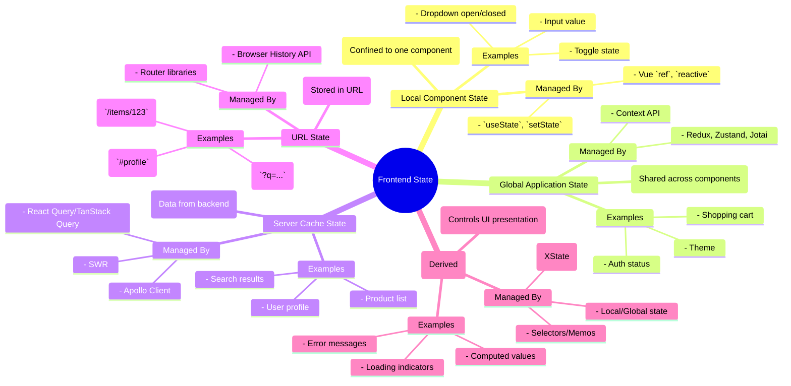

# Chapter 6: State Management Strategies at Scale

Managing state is arguably one of the most critical and complex challenges in building modern frontend applications. As applications grow in size, features, and user interactions, the complexity of managing the data that drives the UI can quickly become overwhelming. Inadequate state management strategies lead to bugs, performance bottlenecks, inconsistent user experiences, and significant maintenance overhead.

This chapter delves into the multifaceted world of frontend state management, exploring various strategies suitable for building production-grade, scalable systems. We will dissect different types of state, examine common patterns and libraries, and discuss the trade-offs involved in choosing the right approach for your specific needs. Understanding these strategies is fundamental to architecting robust and maintainable frontend applications.

## A. The State Management Landscape

Before diving into specific solutions, it's crucial to understand the different kinds of state we encounter in frontend applications and the inherent challenges associated with managing them, especially at scale.

### 1. Understanding Different Types of State

State in a frontend application isn't monolithic. Recognizing its different forms helps in choosing appropriate management techniques:

- **Local Component State:**

  - **Definition:** State confined entirely within a single component. It's not shared or accessible outside that component's scope.
  - **Examples:** Whether a dropdown is open, the current value of an uncontrolled input field, the state of a toggle switch.
  - **Management:** Typically handled by built-in framework mechanisms (e.g., React's `useState`, Vue's `ref` or `reactive`).

- **Global Application State:**

  - **Definition:** State that needs to be accessed or modified by multiple, often unrelated, components across the application.
  - **Examples:** User authentication status, user preferences (like theme), shopping cart contents, application-wide notifications.
  - **Management:** Often requires dedicated state management libraries (Redux, Zustand, Context API) to provide a centralized and predictable way to handle shared data.

- **Server Cache State / Remote State:**

  - **Definition:** State originating from a remote server or API. It represents data fetched from the backend that the frontend needs to display, cache, and potentially update.
  - **Examples:** A list of products fetched from an e-commerce API, user profile data, search results.
  - **Management:** Specialized libraries (React Query/TanStack Query, SWR, Apollo Client) excel here, handling caching, background synchronization, request deduplication, and mutation management.

- **URL State:**

  - **Definition:** State derived from or stored within the browser's URL (query parameters, hash fragments, path segments).
  - **Examples:** Search filters applied to a list (`?filter=active&sort=name`), the ID of the currently viewed item (`/products/123`), the current tab in a settings page (`/settings#profile`).
  - **Management:** Typically managed via routing libraries and browser APIs, often synchronized with other state types.

- **UI State (Derived/Computed):**
  - **Definition:** State that describes the _condition_ of the UI itself, often derived from other state types. It might not be data _per se_, but rather flags or modes controlling presentation.
  - **Examples:** Whether a loading spinner is visible (derived from server cache state), whether a form validation error message is shown (derived from local form state and validation rules), the computed count of items in a filtered list (derived from global or server state and URL state).
  - **Management:** Can reside locally, globally, or be computed on-the-fly using selectors or derived state functions. State machines are particularly useful for managing complex UI state transitions.



**Diagram Explanation:** This mind map categorizes the different types of state commonly found in frontend applications, providing examples and typical management approaches for each. Recognizing these distinctions is the first step towards effective state management architecture.

### 2. Challenges of State Management in Large Applications

As applications scale, managing state effectively becomes increasingly difficult due to several factors:

- **Complexity & Interdependence:** State becomes scattered across many components. Understanding data flow, dependencies, and the impact of changes becomes challenging. Unpredictable side effects can arise from state modifications in distant parts of the application.
- **Synchronization:** Keeping different parts of the state (e.g., server cache and global state) consistent is hard. Stale data can lead to incorrect UI displays and user confusion.
- **Performance:** Frequent or inefficient state updates can trigger excessive re-renders, degrading application performance. Large state objects can consume significant memory. Prop drilling (passing state down through many component layers) can also cause unnecessary re-renders.
- **Debugging:** Tracing the origin of state changes or identifying the cause of inconsistent state can be time-consuming and frustrating without proper tools and patterns. Race conditions, especially with asynchronous operations, add another layer of complexity.
- **Boilerplate & Maintainability:** Some state management solutions can introduce significant boilerplate code, making development slower and increasing the surface area for potential errors. Maintaining consistency across large teams requires clear conventions and patterns.
- **Testing:** Components tightly coupled to complex state logic can be difficult to unit test in isolation. Mocking state dependencies becomes necessary but can be cumbersome.

Addressing these challenges requires deliberate architectural choices and the adoption of robust state management patterns and libraries, which we will explore in the following sections.

## B. Local Component State

The simplest form of state management occurs within the boundaries of a single component. Modern frontend frameworks provide built-in mechanisms for this.

### 1. Framework-Specific Mechanisms

- **React:** The `useState` hook is the primary mechanism for declaring state variables within functional components. For class components, `this.state` and `this.setState` are used.

  ```javascript
  import React, { useState } from "react";

  function Counter() {
    // 'count' is the state variable, 'setCount' is the function to update it.
    const [count, setCount] = useState(0);

    return (
      <div>
        <p>You clicked {count} times</p>
        <button onClick={() => setCount(count + 1)}>Click me</button>
      </div>
    );
  }
  ```

- **Vue:** Vue 3 uses the Composition API (`ref`, `reactive`) or the Options API (`data` property).

  ```vue
  <script setup>
  import { ref } from "vue";

  const count = ref(0); // 'count' is a reactive reference
  </script>

  <template>
    <button @click="count++">Count is: {{ count }}</button>
  </template>
  ```

- **Angular:** Component properties serve as state, updated directly or through methods. Change detection handles UI updates.

  ```typescript
  import { Component } from "@angular/core";

  @Component({
    selector: "app-counter",
    template: `
      <button (click)="increment()">Clicked {{ count }} times</button>
    `,
  })
  export class CounterComponent {
    count = 0; // Component property as state

    increment() {
      this.count++;
    }
  }
  ```

### 2. When Local State is Sufficient (and When It's Not)

Local state is the **preferred** approach when:

- The state is **only relevant** to the component itself and its direct children (which can receive it via props).
- The state doesn't need to be shared with sibling components or components far up or down the component tree.
- The state is ephemeral and doesn't need to persist across different views or user sessions (unless explicitly saved elsewhere).
- Examples: Managing the open/closed state of a modal, handling input field values before submission, controlling the visibility of a tooltip.

Local state becomes **insufficient** when:

- **Prop Drilling:** You find yourself passing the same piece of state down through many layers of intermediate components that don't actually use the state themselves. This makes refactoring difficult and components less reusable.
- **Shared State Needs:** Multiple, potentially unrelated, components need to access or modify the same piece of state (e.g., user authentication status, theme preference).
- **Complex State Logic:** The logic for updating the state becomes complex, involves asynchronous operations, or needs to be reused across different components.
- **Cross-Cutting Concerns:** State updates need to trigger side effects in different parts of the application.

When local state limitations are reached, it's time to consider lifting state up to a common ancestor or employing more sophisticated global or server state management solutions.

### 3. [Production Note: Performance implications of excessive local state updates]

> While local state is generally performant, be mindful of updates that trigger frequent re-renders, especially in complex components.
>
> - **Frequent Updates:** State updates that happen very rapidly (e.g., tracking mouse coordinates directly in state via `useState` on every `mousemove`) can lead to performance issues. Consider debouncing, throttling, or using `useRef` for values that don't need to trigger re-renders.
> - **Large State Objects:** Storing very large objects or arrays in local state and updating them frequently can be inefficient, as frameworks might perform shallow comparisons. Ensure updates are targeted or consider breaking down large state objects.
> - **Derived State Calculation:** If calculating derived data within the component render function is expensive, memoize it using tools like React's `useMemo` to avoid recalculation on every render.

## C. Global State Management Solutions

When state needs to be shared across different parts of the application, global state management solutions provide structure and predictability.

### 1. Principles: Single Source of Truth, Immutability, Predictability

Most robust global state management patterns adhere to these core principles:

- **Single Source of Truth (SSoT):** The global state of your application is stored in one central place (the "store"). This makes it easier to track, debug, and reason about the application's state at any given time. Components read data from this single source rather than maintaining their own potentially conflicting copies.
- **Immutability:** State should be treated as read-only. Instead of modifying the state directly, updates are performed by creating new state objects or arrays. This prevents unexpected side effects, enables efficient change detection (using reference equality checks), and facilitates features like time-travel debugging.
- **Predictability:** State changes should happen in a structured and predictable way, often through explicit actions or events. This makes the data flow easier to follow and debug. Pure functions (reducers in Redux) are often used to calculate the next state based on the current state and an action.

### 2. Deep Dive: Redux / Redux Toolkit (Middleware, Selectors, Thunks/Sagas)

Redux has been a dominant force in global state management for React applications, although its principles are applicable elsewhere.

- **Core Concepts:**

  - **Store:** A single JavaScript object holding the entire application state tree.
  - **Actions:** Plain JavaScript objects describing _what happened_ (e.g., `{ type: 'todos/todoAdded', payload: 'Learn Redux' }`). They are the only way to trigger a state change.
  - **Reducers:** Pure functions that take the previous state and an action, and return the _next_ state (`(previousState, action) => newState`). They must be pure and perform immutable updates.
  - **Dispatch:** The mechanism for sending actions to the store.
  - **Selectors:** Functions that extract specific pieces of data from the store state. They help decouple components from the state shape and can be memoized for performance.

- **Redux Toolkit (RTK):** The official, opinionated toolset for efficient Redux development. It drastically reduces boilerplate and enforces best practices:

  - `configureStore`: Simplifies store setup with sensible defaults (like enabling Redux DevTools and including `redux-thunk` middleware).
  - `createSlice`: Generates action creators and reducers based on a slice name and reducer functions, using Immer internally for easier immutable updates.
  - `createAsyncThunk`: Simplifies handling asynchronous actions (like API calls).
  - `createEntityAdapter`: Provides utilities for managing normalized state (storing collections of items by ID).
  - `createSelector`: Re-exports Reselect for creating memoized selectors.

- **Middleware:** Functions that intercept dispatched actions before they reach the reducer. Used for side effects, logging, asynchronous operations, etc.

  - **Thunks (`redux-thunk`):** Allow action creators to return functions instead of plain action objects. These functions receive `dispatch` and `getState` as arguments, enabling asynchronous logic and dispatching multiple actions. RTK includes this by default.
  - **Sagas (`redux-saga`):** Use ES6 Generators to manage complex asynchronous flows, making them easier to test and reason about. Sagas listen for dispatched actions and can trigger side effects or dispatch other actions. Often chosen for very complex async orchestration.

- **Selectors:** Crucial for performance and decoupling. They compute derived data and prevent unnecessary component re-renders if the underlying data hasn't changed. Libraries like **Reselect** are commonly used to create memoized selectors.

### 3. Deep Dive: Zustand, Jotai, Valtio (Atomic State Management)

These libraries offer simpler, often less boilerplate-heavy alternatives to Redux, particularly popular in the React ecosystem. They often embrace hooks more directly and manage state in smaller, independent "atoms" or slices.

- **Zustand:**

  - **Approach:** Minimalist, hook-based state management. Creates a store as a custom hook. Updates are achieved by calling `set` within actions defined in the store.
  - **Features:** Low boilerplate, uses hooks directly, middleware support (including Redux DevTools), allows selecting state slices with automatic re-rendering only when the selected slice changes. Doesn't strictly enforce the action/reducer pattern like Redux.
  - **Best For:** Applications needing global state with less ceremony than Redux, comfortable with a more direct state mutation style (though often uses Immer internally).

- **Jotai:**

  - **Approach:** Atomic state management. State is built from primitive, independent units called "atoms". Components subscribe only to the atoms they need.
  - **Features:** Inspired by Recoil. Atoms can be derived from other atoms. Automatic garbage collection of unused atom states. Integrates well with Suspense for data fetching. Encourages code splitting by defining atoms alongside features.
  - **Best For:** Applications where state can be naturally broken down into small, independent pieces. Good for performance as updates are highly granular.

- **Valtio:**
  - **Approach:** Uses JavaScript proxies for reactive state management. You mutate state objects directly, and components subscribed to parts of that state automatically re-render.
  - **Features:** Extremely simple API (feels like mutating plain JS objects). Automatic tracking of dependencies.
  - **Best For:** Projects prioritizing developer experience and minimal boilerplate, where the magic of proxies is acceptable.

### 4. Deep Dive: Context API (Use Cases, Performance Pitfalls, Optimization)

React's built-in Context API provides a way to pass data through the component tree without prop drilling.

- **Use Cases:**

  - Passing down "global" data that doesn't change often (e.g., theme, user authentication status, locale).
  - Dependency injection (providing services or configuration to deeply nested components).
  - Managing relatively simple shared state where the overhead of a full library like Redux feels excessive.

- **Performance Pitfalls:**

  - **Single Context Value:** By default, any component consuming a Context will re-render whenever _any_ part of the context value changes, even if the specific part the component cares about hasn't changed. This can lead to significant performance issues in large applications with frequently updating context values.

- **Optimization:**
  - **Splitting Contexts:** Divide large context objects into smaller, more focused contexts. Components then only subscribe to the specific contexts they need.
  - **Memoization:** Use `React.memo` on consuming components to prevent re-renders if their props haven't changed. Wrap the context `value` prop passed to the Provider in `useMemo` to prevent unnecessary re-renders of consumers if the value object is recreated on every parent render but its contents are the same.
  - **Selector Pattern:** Pass down both the state and the `dispatch` function (or update functions) via context. Components can select only the state they need within themselves, potentially combined with `useMemo` or custom hooks to avoid re-rendering if the selected slice hasn't changed (though this often requires manual implementation compared to libraries like Redux or Zustand).
  - **Context + `useReducer`:** Combining `useReducer` with Context provides a Redux-like pattern (state and dispatch) without external libraries, but still suffers from the core Context re-render issue unless optimized.

> **Production Perspective:** While Context API is built-in, relying solely on it for complex, frequently changing global state in large applications is often discouraged due to performance challenges. Libraries like Redux Toolkit, Zustand, or Jotai offer built-in optimizations and better developer tooling for managing state at scale. Use Context judiciously for relatively stable global data or dependency injection.

### 5. Choosing the Right Global State Manager

There's no single "best" solution. The choice depends on:

- **Team Familiarity:** Does the team have experience with a particular library?
- **Application Complexity:** How complex are the state interactions and asynchronous flows? (Redux/Sagas excel here, while Zustand/Jotai might be simpler for less complex needs).
- **Boilerplate Tolerance:** How much setup and boilerplate code is acceptable? (Zustand/Jotai/Valtio generally have less than classic Redux, though RTK significantly reduces Redux boilerplate).
- **Performance Requirements:** Are granular updates critical? (Jotai/Zustand often provide more granular re-renders than basic Context API).
- **Ecosystem & Tooling:** Does the library have good developer tools, community support, and integration with other libraries (e.g., persistence middleware, routing integration)?

Often, a combination is used: Local state for component-specific data, a dedicated server cache library for API data, and a global state manager for truly shared application state.

### 6. [Practical Example: Structuring a complex Redux store for a feature]

Imagine an e-commerce application feature for managing user wishlists. A production-grade Redux store structure using Redux Toolkit might look like this:

```
src/
├── app/
│   └── store.ts       # ConfigureStore setup
├── features/
│   └── wishlist/
│       ├── index.ts         # Barrel file exporting slice, selectors, thunks
│       ├── wishlistSlice.ts # createSlice (reducer, actions, initial state)
│       ├── wishlistSelectors.ts # Memoized selectors (using createSelector)
│       ├── wishlistThunks.ts    # Async thunks (e.g., fetchWishlist, addToWishlist)
│       └── components/      # React components related to wishlist
│           └── WishlistPage.tsx # Consumes selectors and dispatches thunks
│           └── AddToWishlistButton.tsx
└── ... (other features)
```

**`wishlistSlice.ts` (Simplified):**

```typescript
import {
  createSlice,
  createAsyncThunk,
  PayloadAction,
  createEntityAdapter,
} from "@reduxjs/toolkit";
import { RootState } from "../../app/store";
import * as wishlistApi from "./wishlistApi"; // Mock API functions

// Use createEntityAdapter for normalized state (good for lists)
const wishlistAdapter = createEntityAdapter<{
  id: string;
  productId: string;
  addedAt: string;
}>();

// Async thunk for fetching
export const fetchWishlist = createAsyncThunk("wishlist/fetch", async () => {
  const response = await wishlistApi.fetchWishlistItems();
  return response.items; // Assuming API returns { items: [...] }
});

// Async thunk for adding
export const addToWishlist = createAsyncThunk(
  "wishlist/add",
  async (productId: string) => {
    const newItem = await wishlistApi.addItemToWishlist(productId);
    return newItem;
  }
);

const initialState = wishlistAdapter.getInitialState({
  status: "idle" as "idle" | "loading" | "succeeded" | "failed",
  error: null as string | null | undefined,
});

const wishlistSlice = createSlice({
  name: "wishlist",
  initialState,
  reducers: {
    // Can add synchronous reducers here if needed
  },
  extraReducers: (builder) => {
    builder
      .addCase(fetchWishlist.pending, (state) => {
        state.status = "loading";
      })
      .addCase(fetchWishlist.fulfilled, (state, action) => {
        state.status = "succeeded";
        wishlistAdapter.setAll(state, action.payload); // Use adapter utility
      })
      .addCase(fetchWishlist.rejected, (state, action) => {
        state.status = "failed";
        state.error = action.error.message;
      })
      .addCase(addToWishlist.fulfilled, (state, action) => {
        wishlistAdapter.addOne(state, action.payload); // Add new item
      });
    // Handle pending/rejected for addToWishlist similarly...
  },
});

export default wishlistSlice.reducer;
```

**`wishlistSelectors.ts` (Simplified):**

```typescript
import { createSelector } from "@reduxjs/toolkit";
import { RootState } from "../../app/store";
import { wishlistAdapter } from "./wishlistSlice";

// Basic selectors generated by adapter
export const {
  selectAll: selectAllWishlistItems,
  selectById: selectWishlistItemById,
  selectIds: selectWishlistItemIds,
} = wishlistAdapter.getSelectors((state: RootState) => state.wishlist);

// Selector for loading status
export const selectWishlistStatus = (state: RootState) => state.wishlist.status;

// Example of a derived, memoized selector
export const selectWishlistItemCount = createSelector(
  selectWishlistItemIds, // Input selector
  (ids) => ids.length // Output calculation (only runs if ids change)
);

// Selector to check if a specific product is in the wishlist
export const selectIsProductInWishlist = createSelector(
  [selectAllWishlistItems, (state: RootState, productId: string) => productId],
  (items, productId) => items.some((item) => item.productId === productId)
);
```

This structure promotes modularity ("feature slice"), uses RTK for conciseness, handles async logic cleanly with `createAsyncThunk`, normalizes state for efficiency with `createEntityAdapter`, and uses memoized selectors for performance.

### 7. [Code Snippet: Optimizing selectors with memoization (e.g., Reselect)]

Using the example above, `createSelector` from Redux Toolkit (which uses Reselect internally) provides memoization.

```typescript
import { createSelector } from "@reduxjs/toolkit";
import { RootState } from "../../app/store";
import { selectAllWishlistItems } from "./wishlistSelectors"; // Assume this selects the raw items array

// Imagine we need to get wishlist items sorted by date added
export const selectSortedWishlistItems = createSelector(
  [selectAllWishlistItems], // Input selector(s)
  (wishlistItems) => {
    console.log("Calculating sorted wishlist items..."); // This will only log when wishlistItems reference changes
    // Create a new sorted array (immutability)
    return [...wishlistItems].sort(
      (a, b) => new Date(b.addedAt).getTime() - new Date(a.addedAt).getTime()
    );
  }
  // Optional: customize memoization/comparison function if needed
  // { memoizeOptions: { resultEqualityCheck: customDeepEqual } }
);

// In a component:
// const sortedItems = useSelector(selectSortedWishlistItems);
// This component will only re-render due to this selector if the *result* of
// selectSortedWishlistItems changes (i.e., the sorted array is different).
// If other parts of the Redux state change, but selectAllWishlistItems returns
// the exact same array reference, the expensive sort operation is skipped.
```

**Explanation:** `createSelector` takes one or more "input selectors" and a "result function". It remembers the last inputs and the last result. If called again with the _exact same inputs_ (by reference equality), it skips the result function and returns the cached result. This is crucial for preventing expensive calculations and unnecessary re-renders in components that depend on derived data.

### 8. [Troubleshooting Section: Debugging common global state issues]

- **Issue: Component not re-rendering after state update.**
  - **Cause:** Mutation of state instead of immutable update (Redux/RTK rely on reference changes). Direct state mutation in Zustand/Valtio might not be tracked if not done correctly via proxies/setters. Incorrect selector logic (not selecting the changed data). Component not actually subscribed to the relevant state slice. Using `React.memo` incorrectly.
  - **Debug:** Use Redux DevTools to inspect actions and state changes. Verify reducer/slice logic ensures immutability (RTK's `createSlice` helps). Check selector implementation. Ensure the component's `useSelector` hook selects the data that actually changed. Step through component rendering logic.
- **Issue: Excessive re-renders.**
  - **Cause:** Components selecting large chunks of state when they only need a small part. Selectors creating new object/array references on every call even if data is the same. Context API re-rendering all consumers. Frequent state updates triggering widespread re-renders.
  - **Debug:** Use React DevTools Profiler to identify components rendering unnecessarily. Optimize selectors with memoization (Reselect/`createSelector`). Ensure selectors return primitive values or stable references where possible. Split Contexts. Refactor components to select more granular state. Debounce/throttle frequent updates if appropriate.
- **Issue: Incorrect state after asynchronous operations.**
  - **Cause:** Race conditions between multiple async actions. Incorrect handling of loading/error states. State updates based on stale data captured in closures.
  - **Debug:** Use Redux DevTools to trace action sequences. Implement robust loading/error state handling in async thunks/sagas/middleware. Ensure correct use of `async/await` or Promise chaining. Check for stale closures in thunks or effect handlers. Consider cancellation logic for async operations if needed.
- **Issue: Boilerplate makes development slow (Classic Redux).**
  - **Solution:** Adopt Redux Toolkit (`createSlice`, `createAsyncThunk`). Consider lighter-weight alternatives like Zustand or Jotai if appropriate for the project's scale and complexity.
- **Issue: Difficulty tracing state changes.**
  - **Solution:** Leverage Redux DevTools (works with Redux, RTK, Zustand middleware). Implement logging middleware. Ensure actions have clear, descriptive types. Keep reducers pure and predictable.

```mermaid
graph LR
    subgraph Redux Data Flow
        A[Component Event] --> B(Dispatch Action);
        B --> C{Middleware (Thunks/Sagas)};
        C -- Async Ops --> D[API Call];
        D -- Response --> C;
        C -- Action --> E[Reducer];
        E -- Current State & Action --> F(New State);
        F --> G((Store));
        G -- Updated State --> H{Selectors};
        H -- Selected Data --> I[Component Re-render];
    end

    style G fill:#f9f,stroke:#333,stroke-width:2px
    style E fill:#ccf,stroke:#333,stroke-width:1px
    style H fill:#ccf,stroke:#333,stroke-width:1px
```

**Diagram Explanation:** This flowchart illustrates the unidirectional data flow typical in Redux (and similar global state managers). Events trigger actions, which may pass through middleware for side effects before reaching reducers. Reducers compute the new state immutably, updating the central store. Selectors extract data from the store, and components re-render based on the selected data.

## D. Server Cache State Management

Managing data fetched from APIs presents unique challenges distinct from managing client-side global state. Libraries specifically designed for this "server cache state" have become indispensable in modern frontend development.

### 1. Challenges: Caching, Synchronization, Invalidation, Mutations

- **Caching:** Naively fetching data on every component mount is inefficient and slow. Effective caching is needed to avoid redundant network requests and provide instant UI feedback.
- **Synchronization:** Server data can change independently of the client. The frontend needs mechanisms to keep its cached data reasonably up-to-date (e.g., background refetching, polling, real-time updates).
- **Invalidation:** When the user performs an action that changes data on the server (e.g., adding an item, updating a profile), the relevant cached data on the client needs to be invalidated or updated to reflect the change.
- **Mutations:** Performing data modifications (POST, PUT, DELETE requests) requires handling loading states, error states, and updating the cache upon success (invalidation or direct update). Optimistic updates (updating the UI _before_ the server confirms) can enhance perceived performance but add complexity.
- **Request Deduplication:** Multiple components requesting the same data simultaneously should ideally result in only one network request.
- **Stale-While-Revalidate:** Showing stale cached data immediately while fetching fresh data in the background provides a good balance between responsiveness and data freshness.

### 2. Deep Dive: React Query / TanStack Query

TanStack Query (formerly React Query) is a powerful, framework-agnostic library for fetching, caching, synchronizing, and updating server state.

- **Core Concepts:**

  - **Queries:** Used for fetching data (GET requests). Identified by a unique `queryKey`. Manages caching, background refetching, stale time, cache time.

    ```javascript
    import { useQuery } from "@tanstack/react-query";

    function Profile() {
      const { data, error, isLoading, isFetching } = useQuery({
        queryKey: ["userProfile", userId], // Unique key for this query
        queryFn: () => fetchUserProfile(userId), // Async function to fetch data
        staleTime: 5 * 60 * 1000, // 5 minutes - data is fresh for this long
        cacheTime: 10 * 60 * 1000, // 10 minutes - data removed from cache after inactive
      });

      if (isLoading) return "Loading...";
      if (error) return `An error occurred: ${error.message}`;

      return <div>Hello {data.name}</div>;
    }
    ```

  - **Mutations:** Used for creating, updating, or deleting data (POST, PUT, DELETE). Provides `mutate` or `mutateAsync` functions and callbacks (`onSuccess`, `onError`, `onSettled`) for handling side effects like cache invalidation.

    ```javascript
    import { useMutation, useQueryClient } from "@tanstack/react-query";

    function UpdateProfileButton() {
      const queryClient = useQueryClient();
      const mutation = useMutation({
        mutationFn: updateProfile, // Async function making the PUT/POST request
        onSuccess: (data) => {
          // Invalidate and refetch the user profile query after success
          queryClient.invalidateQueries({ queryKey: ["userProfile", data.id] });
          // Or, update the cache directly:
          // queryClient.setQueryData(['userProfile', data.id], data);
        },
        onError: (error) => {
          /* Handle error */
        },
      });

      return (
        <button
          onClick={() => mutation.mutate({ name: "New Name" })}
          disabled={mutation.isPending}
        >
          {mutation.isPending ? "Saving..." : "Update Profile"}
        </button>
      );
    }
    ```

  - **QueryClient:** The central client managing the cache and query configurations. Usually provided via React Context.
  - **Query Invalidation:** Manually marking specific queries (by key) as stale, triggering a refetch if they are currently active.
  - **Optimistic Updates:** Updating the cache _before_ the mutation completes for a snappier UI, with rollback logic in case of errors.

### 3. Deep Dive: SWR

Developed by Vercel, SWR (stale-while-revalidate) is another popular library in the React ecosystem focused on data fetching, following the HTTP cache invalidation strategy of the same name.

- **Core Concepts:**

  - **Hook-based:** Primarily used via the `useSWR` hook.
  - **Stale-While-Revalidate:** Returns cached (stale) data first, then fetches updated data (revalidates) in the background, and finally updates the UI with the fresh data.
  - **Key:** Similar to React Query's `queryKey`, identifies the data resource.
  - **Fetcher:** The function responsible for fetching the data.
  - **Automatic Revalidation:** Revalidates data automatically on component focus, network reconnection, and configurable intervals.
  - **Mutations:** Provides a `mutate` function (bound or global) to manually update cached data or trigger revalidation, often used after POST/PUT/DELETE requests.

  ```javascript
  import useSWR from "swr";

  const fetcher = (url) => fetch(url).then((res) => res.json());

  function UserAvatar({ userId }) {
    const { data, error, isLoading } = useSWR(`/api/users/${userId}`, fetcher);

    if (isLoading) return "Loading avatar...";
    if (error) return "Failed to load";

    return ;
  }
  ```

- **Comparison with TanStack Query:** Both are excellent choices. TanStack Query is generally considered more feature-rich (dedicated mutation helpers, optimistic updates API, more caching options, framework-agnostic core), while SWR is often praised for its simplicity and focus on the stale-while-revalidate pattern.

### 4. Deep Dive: Apollo Client (for GraphQL)

If your backend uses GraphQL, Apollo Client is the de facto standard for managing GraphQL data on the frontend.

- **Core Concepts:**
  - **Declarative Data Fetching:** Integrates with frameworks like React via hooks (`useQuery`, `useMutation`) that bind GraphQL operations directly to UI components.
  - **Normalized Caching:** Automatically normalizes nested GraphQL responses into a flat cache structure based on object types and IDs (`__typename`, `id`). This allows different queries sharing data to update consistently and efficiently.
  - **Cache Updates:** Provides fine-grained control over cache updates after mutations using mechanisms like `refetchQueries`, direct cache writes (`cache.writeQuery`), and update functions.
  - **Local State Management:** Can also manage local client-side state alongside remote GraphQL data.
  - **Ecosystem:** Rich ecosystem including browser developer tools, server integrations, and support for features like subscriptions (real-time updates).

### 5. Integrating Server Cache with Global State

While server cache libraries manage remote data, you might still need a global state manager (like Redux or Zustand) for purely client-side state (UI state, session info, etc.). How do they interact?

- **Keep them Separate (Recommended):** Treat server cache state (managed by TanStack Query, SWR, Apollo) and global UI/session state (managed by Redux, Zustand) as distinct concerns. Components can consume data from both sources independently.
  - **Example:** A component might get user data via `useQuery` and the current theme preference via `useSelector` (Redux) or a Zustand hook.
- **Syncing Selectively:** Sometimes, you might need to sync a piece of server state into the global store (e.g., user authentication status). This can be done within the `onSuccess` callback of a query or mutation, dispatching an action to the global store. However, do this sparingly to avoid duplicating state and creating synchronization issues. The server cache library should remain the SSoT for server data.
- **Avoid Duplication:** Resist the urge to dump all fetched data into your global Redux/Zustand store. This defeats the purpose of the specialized server cache libraries and reintroduces caching/synchronization challenges that those libraries solve effectively.

### 6. [Practical Example: Implementing optimistic updates with React Query]

Let's enhance the `addToWishlist` mutation from the Redux example, but using TanStack Query for optimistic updates.

```typescript
import { useMutation, useQueryClient } from "@tanstack/react-query";
import * as wishlistApi from "./wishlistApi"; // Mock API functions

function AddToWishlistButtonOptimistic({ productId }: { productId: string }) {
  const queryClient = useQueryClient();
  const wishlistQueryKey = ["wishlistItems"]; // Key for the list query

  const mutation = useMutation({
    mutationFn: (newWishlistItem: { productId: string; tempId: string }) =>
      wishlistApi.addItemToWishlist(newWishlistItem.productId), // API call

    // When mutate is called:
    onMutate: async (newItemData) => {
      // 1. Cancel any outgoing refetches (so they don't overwrite our optimistic update)
      await queryClient.cancelQueries({ queryKey: wishlistQueryKey });

      // 2. Snapshot the previous value
      const previousWishlist =
        queryClient.getQueryData<
          { id: string; productId: string; addedAt: string }[]
        >(wishlistQueryKey);

      // 3. Optimistically update to the new value
      queryClient.setQueryData(wishlistQueryKey, (oldData = []) => [
        ...oldData,
        {
          // Use a temporary ID for the optimistic item
          id: newItemData.tempId,
          productId: newItemData.productId,
          addedAt: new Date().toISOString(), // Add optimistic timestamp
        },
      ]);

      // 4. Return a context object with the snapshotted value
      return { previousWishlist, tempId: newItemData.tempId };
    },

    // If the mutation fails, use the context returned from onMutate to roll back
    onError: (err, newItemData, context) => {
      if (context?.previousWishlist) {
        queryClient.setQueryData(wishlistQueryKey, context.previousWishlist);
      }
      // TODO: Show error notification to user
      console.error("Failed to add item:", err);
    },

    // On success, update the cache with the real item from the server response
    onSuccess: (serverData, newItemData, context) => {
      queryClient.setQueryData(wishlistQueryKey, (oldData = []) =>
        // Replace the temporary item with the real one from the server
        oldData.map((item) => (item.id === context?.tempId ? serverData : item))
      );
    },

    // Always refetch after error or success:
    onSettled: () => {
      queryClient.invalidateQueries({ queryKey: wishlistQueryKey });
    },
  });

  const handleAdd = () => {
    // Generate a temporary ID for optimistic update
    const tempId = `temp-${Date.now()}`;
    mutation.mutate({ productId, tempId });
  };

  // Check if item is already in wishlist (using query data, potentially optimistically)
  const wishlistData = queryClient.getQueryData<any[]>(wishlistQueryKey) ?? [];
  const isInWishlist = wishlistData.some(
    (item) => item.productId === productId
  );

  return (
    <button onClick={handleAdd} disabled={mutation.isPending || isInWishlist}>
      {mutation.isPending
        ? "Adding..."
        : isInWishlist
        ? "In Wishlist"
        : "Add to Wishlist"}
    </button>
  );
}
```

**Explanation:** This example demonstrates the key steps for optimistic updates: cancel queries, snapshot previous state, update the cache immediately with temporary data, and define rollback logic (`onError`) and finalization logic (`onSuccess`/`onSettled`). This makes the UI feel instantaneous, even though the network request takes time.

### 7. [Configuration Guide: Setting up caching strategies]

When configuring TanStack Query or SWR, consider these key options:

- **`staleTime` (TanStack Query) / `dedupingInterval` (SWR):** How long fetched data is considered "fresh". During this time, cached data will be returned without a background refetch. Set higher for data that changes infrequently. Default is often 0 (always stale).
- **`cacheTime` (TanStack Query) / `provider` cache settings (SWR):** How long inactive query data remains in the cache before being garbage collected. Set higher if you expect users to revisit data frequently. Default is typically 5 minutes (TanStack Query).
- **`refetchOnWindowFocus`:** Automatically refetch data when the browser tab/window regains focus. Usually enabled by default; good for keeping data synced but can be disabled for performance or specific use cases.
- **`refetchOnReconnect`:** Automatically refetch data when the network connection is restored. Usually enabled by default.
- **`refetchInterval`:** Enable polling by setting a time interval for automatic refetching. Useful for data that updates frequently in the background (e.g., live dashboards) but use with caution to avoid excessive requests.
- **Retry Logic:** Configure if and how many times failed queries should be retried (often enabled by default with exponential backoff).

**Production Strategy:** Start with default settings. Profile your application's network usage and user behavior. Adjust `staleTime` based on how quickly data actually changes on the backend. Increase `cacheTime` if memory allows and users frequently navigate back to views with cached data. Disable aggressive refetching (`refetchOnWindowFocus`, `refetchInterval`) for data known to be static or if background updates cause performance issues. Configure global defaults via the `QueryClientProvider` (TanStack Query) or `SWRConfig` (SWR) and override per-query as needed.

## E. URL as State

The URL is often an underutilized yet powerful mechanism for managing certain types of application state, particularly state related to navigation, filtering, and sharing.

### 1. Leveraging the URL for Sharability and Navigation State

Storing state in the URL provides several key benefits:

- **Sharability:** Users can copy and paste the URL to share the exact state of the application (e.g., specific search results, applied filters, viewed item) with others.
- **Bookmarking:** Users can bookmark specific application states.
- **Browser History:** Back/forward navigation works as expected, allowing users to navigate through different states they've visited.
- **Resilience:** If the user refreshes the page, the application can often reconstruct its state directly from the URL.

State suitable for the URL includes:

- Filters and sorting parameters for lists.
- Search queries.
- Pagination offsets or page numbers.
- The ID of the currently selected item or view.
- Tab selections within a component.
- Modal visibility (sometimes, using hash fragments).

### 2. Synchronizing URL Parameters/Hash with Application State

The core challenge is keeping the URL synchronized with the relevant application state (whether local, global, or server cache) and vice-versa.

- **Reading from URL on Load:** When the application initializes or a route loads, read the relevant parameters, query strings, or hash fragments from the URL. Use this information to set the initial state of components, trigger data fetches, or configure global state. Most routing libraries provide hooks or APIs to access URL parts easily (e.g., `useParams`, `useLocation`, `useSearchParams` in React Router).
- **Updating URL on State Change:** When the application state changes (e.g., user applies a filter, navigates to an item), update the URL accordingly. This typically involves using the routing library's navigation functions (e.g., `navigate` or `history.pushState`) to change the URL without a full page reload.
- **Handling Back/Forward Navigation:** Ensure your application listens for URL changes triggered by browser navigation (back/forward buttons) and updates the application state accordingly. Routing libraries often handle this integration.

**Common Patterns:**

- Use query parameters (`?key=value&key2=value2`) for optional state like filters, sorting, and search terms.
- Use path parameters (`/items/:id`) for identifying primary resources.
- Use hash fragments (`#section`) for scrolling to sections or managing secondary state like tabs (though query params are often preferred now).

### 3. [Practical Example: Managing filter state via URL query parameters]

Imagine a product list page where users can filter by category and sort by price.

**Naive Approach (State only in component):**

```javascript
function ProductList() {
  const [filters, setFilters] = useState({
    category: "all",
    sortBy: "price_asc",
  });
  // Fetch products based on 'filters' state
  // ... render list and filter controls ...
  // Problem: Refreshing loses filters, cannot share filtered view.
}
```

**Production Approach (Syncing with URL using React Router v6):**

```javascript
import React, { useState, useEffect, useMemo } from "react";
import { useSearchParams, useNavigate } from "react-router-dom";

function ProductList() {
  const [searchParams, setSearchParams] = useSearchParams();
  const navigate = useNavigate(); // Or just setSearchParams

  // Read initial state from URL or use defaults
  const initialCategory = searchParams.get("category") || "all";
  const initialSortBy = searchParams.get("sortBy") || "price_asc";

  // Optional: Keep local state for UI controls if needed, but derive filters from URL
  // const [localCategory, setLocalCategory] = useState(initialCategory);

  // Derive filters directly from searchParams for fetching/logic
  const filters = useMemo(
    () => ({
      category: initialCategory,
      sortBy: initialSortBy,
    }),
    [initialCategory, initialSortBy]
  );

  // Fetch products based on 'filters' derived from URL
  // const { data: products } = useQuery(['products', filters], () => fetchProducts(filters));

  const handleFilterChange = (newCategory: string) => {
    // Update URL search params
    setSearchParams(
      (prev) => {
        prev.set("category", newCategory);
        // Reset page number when filters change?
        // prev.delete('page');
        return prev;
      },
      { replace: true }
    ); // Use replace to avoid polluting history for simple filter changes
  };

  const handleSortChange = (newSortBy: string) => {
    setSearchParams(
      (prev) => {
        prev.set("sortBy", newSortBy);
        return prev;
      },
      { replace: true }
    );
  };

  // Effect to potentially sync URL changes back to local state if needed
  // useEffect(() => {
  //   setLocalCategory(initialCategory);
  // }, [initialCategory]);

  return (
    <div>
      {/* Filter/Sort Controls */}
      <select
        value={filters.category}
        onChange={(e) => handleFilterChange(e.target.value)}
      >
        {/* Options */}
      </select>
      <select
        value={filters.sortBy}
        onChange={(e) => handleSortChange(e.target.value)}
      >
        {/* Options */}
      </select>

      {/* Render product list based on fetched data */}
    </div>
  );
}
```

**Explanation:** This approach uses `useSearchParams` to read filter values from the URL and `setSearchParams` to update the URL when filters change. The component's behavior is now driven by the URL, making the state sharable, bookmarkable, and resilient to refreshes. The source of truth for these filters _is_ the URL.

## F. State Machines and Statecharts

For managing particularly complex state logic, especially involving distinct modes, transitions, and side effects within a component or a user flow, state machines and statecharts offer a powerful and robust paradigm.

### 1. Managing Complex Component/Flow Logic

Consider a component with multiple interdependent boolean flags (`isLoading`, `isError`, `isSuccess`, `isEditing`, `isValidating`, etc.). Managing the valid combinations and transitions between these states using simple `if/else` statements or boolean flags can quickly become error-prone and difficult to reason about.

> **Problem:** It's easy to end up in impossible states (e.g., `isLoading` and `isSuccess` both true) or handle transitions incorrectly.

State machines provide a formal way to model behavior:

- **Finite States:** The component or system can only be in one of a finite number of defined states at any given time (e.g., `idle`, `loading`, `success`, `error`, `editing`).
- **Events/Transitions:** State changes occur only in response to specific events, moving the system from one defined state to another along predefined transitions.
- **Actions/Side Effects:** Actions (side effects like API calls, state updates) can be triggered upon entering or exiting a state, or during a transition.
- **Guards/Conditions:** Transitions can be conditional based on certain criteria (guards).

Statecharts (like Harel statecharts or SCXML) extend state machines with features like hierarchical (nested) states, parallel states, and history states, making them suitable for modeling even more complex UI logic.

### 2. Deep Dive: XState

XState is a popular JavaScript library for creating, interpreting, and executing state machines and statecharts, adhering to the SCXML specification.

- **Core Concepts:**

  - **Machine:** The definition of the state machine/statechart using a configuration object.
  - **States:** Objects defining the possible states, including nested states (`states`), initial state (`initial`), actions on entry/exit (`onEntry`, `onExit`), and transitions (`on`).
  - **Transitions:** Defined within the `on` property of a state, mapping event types to target states, actions, and conditions (guards).
  - **Events:** Plain objects (like Redux actions) that trigger transitions.
  - **Actions:** Functions executed as side effects during transitions or on state entry/exit.
  - **Guards (`cond`):** Functions that return `true` or `false` to determine if a transition should be taken.
  - **Services:** Long-running processes invoked within a state (e.g., promises, observables, other machines), often used for async operations.
  - **Interpreter (`interpret`):** Runs the machine, manages its current state, and handles sending events.
  - **`useMachine` Hook (for React/Vue/etc.):** Integrates the machine interpreter with UI frameworks, providing the current state and a `send` function to dispatch events.

- **Benefits:**
  - **Declarative & Visualizable:** Machine definitions clearly describe all possible states and transitions. XState Studio and other tools can visualize these machines.
  - **Predictability:** Eliminates impossible states and makes logic easier to follow and debug.
  - **Testability:** Machines can often be tested independently of the UI.
  - **Robustness:** Handles complex flows, concurrency, and async operations more reliably than manual boolean flag management.

### 3. [Practical Example: Modeling a multi-step form with XState]

Consider a simple 3-step signup form: 1. User Info, 2. Account Details, 3. Confirmation.

**Naive Approach (Local state flags):**

```javascript
function SignupForm() {
  const [step, setStep] = useState(1);
  const [userInfo, setUserInfo] = useState({});
  const [accountDetails, setAccountDetails] = useState({});
  const [isLoading, setIsLoading] = useState(false);
  const [error, setError] = useState(null);

  // Complex logic with if/else based on 'step', 'isLoading', 'error'
  // Prone to errors, hard to track transitions.
}
```

**Production Approach (XState):**

```typescript
import { createMachine, assign, interpret } from "xstate";
import { useMachine } from "@xstate/react"; // Example for React

// Define actions (update context) and guards (validation)
const actions = {
  updateUserInfo: assign({
    userInfo: (context, event) => event.data,
  }),
  updateAccountDetails: assign({
    accountDetails: (context, event) => event.data,
  }),
  setError: assign({ error: (context, event) => event.data }),
  clearError: assign({ error: null }),
  // Define API call service later
};

const guards = {
  isUserInfoValid: (context, event) => validateUserInfo(event.data),
  isAccountDetailsValid: (context, event) => validateAccountDetails(event.data),
};

// Define the state machine
const signupMachine = createMachine(
  {
    id: "signupForm",
    initial: "userInfo",
    context: {
      // Store form data and errors in context
      userInfo: null,
      accountDetails: null,
      error: null,
    },
    states: {
      userInfo: {
        on: {
          NEXT: {
            target: "accountDetails",
            cond: "isUserInfoValid", // Guard: only transition if valid
            actions: ["updateUserInfo", "clearError"],
          },
          INPUT_INVALID: {
            // Handle validation errors within the state
            actions: "setError",
          },
        },
      },
      accountDetails: {
        on: {
          PREVIOUS: { target: "userInfo", actions: "clearError" },
          NEXT: {
            target: "submitting",
            cond: "isAccountDetailsValid",
            actions: ["updateAccountDetails", "clearError"],
          },
          INPUT_INVALID: {
            actions: "setError",
          },
        },
      },
      submitting: {
        invoke: {
          // Invoke an async service (API call)
          id: "submitSignup",
          src: (context, event) =>
            submitSignupApi(context.userInfo, context.accountDetails),
          onDone: { target: "success" },
          onError: { target: "failure", actions: "setError" },
        },
      },
      success: {
        type: "final", // Final state
      },
      failure: {
        // State to show submission errors
        on: {
          RETRY_USER_INFO: { target: "userInfo", actions: "clearError" },
          RETRY_ACCOUNT_DETAILS: {
            target: "accountDetails",
            actions: "clearError",
          },
        },
      },
    },
  },
  {
    actions,
    guards,
    // services: { submitSignupApi: ... } // Define async service implementation
  }
);

// In the React component:
function SignupForm() {
  const [current, send] = useMachine(signupMachine, {
    // Pass implementations for guards, actions, services if not defined above
    // services: { submitSignupApi: (context) => fetch(...) }
  });

  const handleSubmitUserInfo = (data) => {
    if (validateUserInfo(data)) {
      send({ type: "NEXT", data });
    } else {
      send({ type: "INPUT_INVALID", data: "Invalid user info" });
    }
  };

  const handleSubmitAccountDetails = (data) => {
    if (validateAccountDetails(data)) {
      send({ type: "NEXT", data });
    } else {
      send({ type: "INPUT_INVALID", data: "Invalid account details" });
    }
  };

  return (
    <div>
      {current.matches("userInfo") && (
        <UserInfoStep
          onSubmit={handleSubmitUserInfo}
          initialData={current.context.userInfo}
          error={current.context.error}
        />
      )}
      {current.matches("accountDetails") && (
        <AccountDetailsStep
          onSubmit={handleSubmitAccountDetails}
          onBack={() => send("PREVIOUS")}
          initialData={current.context.accountDetails}
          error={current.context.error}
        />
      )}
      {current.matches("submitting") && <div>Submitting...</div>}
      {current.matches("success") && <div>Signup Successful!</div>}
      {current.matches("failure") && (
        <div>
          Error: {current.context.error}
          {/* Provide options to go back based on error type perhaps */}
          <button onClick={() => send("RETRY_ACCOUNT_DETAILS")}>
            Retry Account Details
          </button>
          <button onClick={() => send("RETRY_USER_INFO")}>Edit User Info</button>
        </div>
      )}
    </div>
  );
}
```

**Explanation:** The XState machine declaratively defines the possible steps (`userInfo`, `accountDetails`, `submitting`, `success`, `failure`), the valid transitions between them (`NEXT`, `PREVIOUS`, `RETRY_*`), conditions (`cond`), and side effects (`actions`, `invoke`). The component logic becomes much simpler, primarily checking the current state (`current.matches(...)`) and sending events (`send(...)`). This approach scales much better for complex flows with many states and transitions.

## Conclusion

State management is a cornerstone of scalable frontend architecture. There is no one-size-fits-all solution; instead, a production-grade application typically employs a combination of strategies tailored to different types of state:

- **Local State:** For data confined to a single component.
- **Global State (Redux, Zustand, Jotai, Context API):** For client-side state shared across the application, chosen based on complexity and team preference.
- **Server Cache State (TanStack Query, SWR, Apollo Client):** For managing asynchronous data from APIs, handling caching, synchronization, and mutations effectively.
- **URL State:** For making application state sharable, bookmarkable, and integrated with browser history.
- **State Machines (XState):** For managing complex, explicit state transitions and preventing invalid states, especially in intricate UI flows or components.

Choosing the right tools and patterns requires understanding the specific challenges of your application, the trade-offs of each approach, and the principles of predictability, immutability, and clear data flow. Mastering state management is essential for building frontend systems that are not only functional but also performant, maintainable, and scalable over time. The subsequent chapters will build upon these concepts as we explore component design, data fetching patterns, and overall application architecture.
