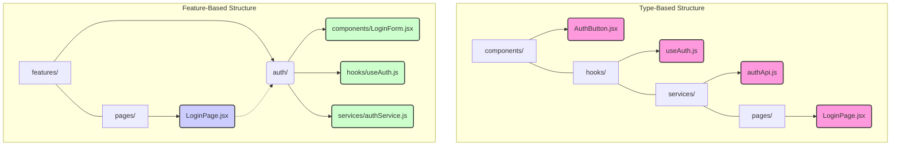
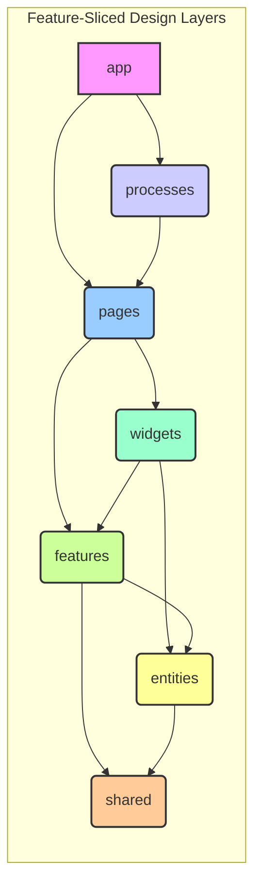

# Chapter 7: Project Structure and Code Organization

As frontend applications grow in complexity and team size increases, the way code is organized becomes paramount. A well-defined project structure is not merely an aesthetic choice; it's a fundamental pillar supporting scalability, maintainability, developer productivity, and overall system health. Conversely, a haphazard or inconsistent structure breeds confusion, slows down development, increases the likelihood of bugs, and makes onboarding new team members a painful experience.

This chapter delves into the principles, patterns, and practices essential for structuring production-grade frontend projects. We will explore how thoughtful organization facilitates managing large codebases, encourages modularity, simplifies collaboration, and ultimately contributes to building robust and scalable applications. We move beyond simple folder arrangements to discuss the underlying philosophies that guide effective code organization in complex frontend systems.

## A. Principles of Scalable Project Structures

Before diving into specific patterns, it's crucial to understand the core principles that underpin any scalable project structure. These principles act as guiding lights when making decisions about how to organize code.

### 1. Modularity and Cohesion

- **Modularity:** Refers to dividing a system into distinct, independent units (modules) with well-defined interfaces. In frontend, a module could be a UI component, a feature slice, a utility library, or a data fetching service. High modularity means changes within one module have minimal impact on others, reducing ripple effects and simplifying maintenance.
- **Cohesion:** Measures the degree to which elements within a single module belong together. A highly cohesive module focuses on a single, well-defined responsibility. For example, a `UserProfileCard` component should contain only the logic and presentation related to displaying user profile information. Logic related to authentication or data fetching for unrelated entities should reside elsewhere.

> **Definition: High Cohesion & Low Coupling**
> The ideal state for a scalable system is **High Cohesion** within modules and **Low Coupling** between modules. High cohesion makes modules understandable and focused. Low coupling minimizes dependencies, making the system easier to modify and test.

Striving for high cohesion and low coupling is central to creating a manageable codebase. It allows developers to reason about smaller parts of the system in isolation and promotes reusability.

### 2. Feature-Based vs. Type-Based Organization (Pros & Cons)

Two primary approaches dominate frontend project organization:

- **Type-Based (or Layer-Based) Organization:** Groups files primarily by their technical type or layer.

  ```
  /src
  ├── components/
  │   ├── Button.jsx
  │   ├── Modal.jsx
  │   └── UserAvatar.jsx
  ├── hooks/
  │   ├── useAuth.js
  │   └── useFetchData.js
  ├── services/
  │   ├── authService.js
  │   └── userService.js
  ├── utils/
  │   ├── formatters.js
  │   └── validators.js
  ├── pages/
  │   ├── LoginPage.jsx
  │   └── ProfilePage.jsx
  └── store/
      ├── authSlice.js
      └── userSlice.js
  ```

  - **Pros:** Familiar to many developers, simple to understand initially, easy to locate files of a specific _type_.
  - **Cons:** Becomes difficult to manage as the application grows. Files related to a single feature (e.g., authentication) are scattered across multiple directories (`components`, `hooks`, `services`, `pages`, `store`). Refactoring or removing a feature requires hunting down files in many places. Low cohesion at the directory level. Poor discoverability for feature-specific logic.

- **Feature-Based (or Domain-Based) Organization:** Groups files primarily by the application feature or domain they belong to.
  ```
  /src
  ├── features/
  │   ├── auth/
  │   │   ├── components/
  │   │   │   └── LoginForm.jsx
  │   │   ├── hooks/
  │   │   │   └── useAuth.js
  │   │   ├── services/
  │   │   │   └── authService.js
  │   │   └── index.js  # Public API for the auth feature
  │   ├── profile/
  │   │   ├── components/
  │   │   │   ├── ProfileCard.jsx
  │   │   │   └── EditProfileForm.jsx
  │   │   ├── hooks/
  │   │   │   └── useUserProfile.js
  │   │   └── services/
  │   │       └── profileService.js
  │   ├── ... (other features)
  ├── shared/
  │   ├── components/
  │   │   ├── Button.jsx
  │   │   └── Modal.jsx
  │   ├── hooks/
  │   │   └── useDebounce.js
  │   └── utils/
  │       └── formatters.js
  ├── app/          # App-level setup, routing, global styles, store config
  └── pages/        # Entry points, composing features onto routes
      ├── LoginPage.jsx
      └── ProfilePage.jsx
  ```
  - **Pros:** High cohesion – all code related to a feature is co-located. Easier feature refactoring, deletion, or extraction. Better discoverability – developers working on a feature know where to look. Promotes clear boundaries between features. Scales better with application complexity and team size.
  - **Cons:** Requires more upfront thought to define feature boundaries. Can have a slightly steeper initial learning curve. Potential for duplication if shared components/logic aren't identified and placed correctly in `shared`.

**Production Perspective:** For large, scalable, production-grade applications, **feature-based organization is strongly recommended**. The long-term benefits in maintainability, team collaboration, and scalability far outweigh the initial setup effort compared to type-based structures.



**Diagram Explanation:** This diagram contrasts Type-Based and Feature-Based structures. In Type-Based (top), files related to authentication (pink nodes) are scattered across different type directories. In Feature-Based (bottom), authentication-related files (green nodes) are co-located within the `features/auth/` directory, improving cohesion. The `LoginPage.jsx` (blue node) composes the `auth` feature.

### 3. Defining Clear Boundaries Between Modules/Features

Regardless of the chosen pattern, establishing clear boundaries is vital. This means defining:

- **Public APIs:** Each module or feature should expose a clear, intentional public interface (e.g., through an `index.js` or `index.ts` file). Other parts of the application should only interact with the module through this public API. Internal implementation details should remain hidden.
- **Dependency Rules:** Define rules about how modules can depend on each other. For example:
  - Features should ideally not depend directly on other features. If interaction is needed, it might happen via shared state, events, or routing.
  - Features and `app` can depend on `shared`.
  - `shared` code should _never_ depend on specific features or `app`.
  - `pages` compose features and orchestrate interactions.
- **Encapsulation:** Hide internal implementation details. Changes within a module's internals should not break consumers as long as the public API remains stable.

Tools like ESLint (with plugins like `eslint-plugin-import` or specialized boundary checkers) can help enforce these rules programmatically.

## B. Common Project Structure Patterns

Building upon the principles, several established patterns provide concrete blueprints for organizing frontend projects.

### 1. Feature-Sliced Design (FSD)

Feature-Sliced Design is a highly structured, prescriptive architectural methodology specifically designed for scaling frontend applications. It builds heavily on feature-based organization and defines strict layers and rules for interaction.

**Key Layers (Top to Bottom):**

1.  **`app`:** The top-level layer, responsible for initializing the application (routing, store setup, global styles, providers). Depends on all lower layers.
2.  **`processes` (Optional):** Handles complex, multi-step user scenarios spanning multiple features (e.g., a multi-stage checkout process). Depends on `pages` and `features`.
3.  **`pages`:** Application pages/routes, composing UI from `features` and `widgets`. Responsible for page-level layout and orchestrating feature interactions. Depends on `features`, `widgets`, `entities`, `shared`.
4.  **`widgets` (Optional):** Compositional layer for combining multiple `features` and `entities` into standalone UI blocks (e.g., a site header containing auth status, navigation, and search). Depends on `features`, `entities`, `shared`.
5.  **`features`:** User-interaction scenarios or features (e.g., `feature/send-comment`, `feature/add-to-cart`, `feature/user-auth`). Contains components, logic, API calls, and potentially state related to a specific piece of functionality. Depends on `entities`, `shared`.
6.  **`entities`:** Business domain entities (e.g., `entity/user`, `entity/product`, `entity/order`). Contains components (like cards, avatars), data structures, and potentially selectors/logic related to representing the entity. Depends only on `shared`.
7.  **`shared`:** The lowest layer containing reusable code agnostic to business logic (UI Kit components, utility functions, configuration, API clients, type definitions). Cannot depend on any other layer.

**Key Rules:**

- Layers can only depend on layers strictly below them.
- Modules within a layer should ideally not depend on other modules _at the same layer_ (especially true for `features` and `entities`). Interaction happens via higher layers (`pages`, `widgets`) or shared state/events managed appropriately.
- Each "slice" (a directory within `features`, `entities`, etc.) should expose a public API (`index.ts`).



**Diagram Explanation:** This diagram illustrates the hierarchical layers of Feature-Sliced Design. Arrows indicate allowed dependencies – a layer can only depend on layers directly below it. This strict layering enforces modularity and controls complexity.

**Pros:** Highly scalable, excellent maintainability, enforces clear boundaries, promotes code reuse through `shared` and `entities`, great for large teams.
**Cons:** Prescriptive, can feel like overkill for small projects, requires discipline and understanding from the team, potential for boilerplate if not managed well.

### 2. Bulletproof React/Vue/Angular Structures (Adapting Principles)

Popular frameworks like React, Vue, and Angular often have community-driven "bulletproof" structure guides (e.g., "Bulletproof React"). While the specific folder names might differ, they generally adapt the core principles discussed earlier:

- **Feature-Based Grouping:** Organizing code by feature is common.
- **Separation of Concerns:** Distinguishing between UI components, state management, API interactions, utilities, etc., often within feature folders.
- **Clear Entry Points:** Defining clear application setup and routing locations.
- **Shared Code:** Explicitly designating areas for reusable, cross-cutting code.

**Key Takeaway:** Don't just blindly copy a template structure. Understand the _principles_ behind it (modularity, cohesion, clear boundaries, feature-centric organization) and adapt them to your specific framework, team, and project needs. The exact folder names (`modules`, `features`, `domains`) are less important than the underlying organizational philosophy.

### 3. Domain-Driven Design (DDD) Concepts Applied to Frontend

Domain-Driven Design offers valuable concepts for structuring complex applications, even on the frontend. While a full DDD implementation is more common on the backend, key ideas can inform frontend structure:

- **Bounded Contexts:** Identify distinct areas of the application with their own specific models and language (e.g., "Ordering", "Inventory", "User Management"). These can map directly to high-level feature folders or even separate micro-frontends (see Chapter 12). Code within one bounded context should be highly cohesive and loosely coupled with others.
- **Ubiquitous Language:** Use consistent terminology across the team (product, design, backend, frontend) when referring to domain concepts. This language should be reflected in code (folder names, variable names, component names). For example, if the business calls it a "Customer Inquiry", don't call it a "Support Ticket" in the code.
- **Aggregates & Entities:** While less strict on the frontend, thinking about core data entities (like `User`, `Product`) and how they are accessed and manipulated can inform the structure of `entities` or shared data layers.

Applying DDD principles helps align the codebase structure with the business domain, making it more intuitive and easier to reason about complex business logic implemented in the frontend.

### 4. [Practical Example: Implementing a Feature-Sliced structure]

Let's sketch out a simplified Feature-Sliced structure for an e-commerce application:

```
/src
├── app/
│   ├── providers/      # Context providers, Theme provider
│   ├── layouts/        # Main app layout components
│   ├── styles/         # Global styles, CSS resets
│   ├── App.tsx         # Root component, routing setup
│   └── main.tsx        # Application entry point
├── pages/
│   ├── HomePage.tsx
│   ├── ProductDetailsPage.tsx
│   ├── CartPage.tsx
│   └── CheckoutPage.tsx # Might eventually become a 'process'
├── widgets/
│   ├── Header/
│   │   ├── ui/Header.tsx
│   │   └── index.ts      # Composes UserStatus, Navigation, MiniCart features
│   └── ProductRecommendations/
│       ├── ui/ProductRecs.tsx
│       └── index.ts      # Composes ProductCard entities based on logic
├── features/
│   ├── user-auth/
│   │   ├── ui/LoginForm.tsx
│   │   ├── model/useAuth.ts # Hook/state logic
│   │   ├── api/authApi.ts
│   │   └── index.ts      # Public API: export { LoginForm, useAuth };
│   ├── add-to-cart/
│   │   ├── ui/AddToCartButton.tsx
│   │   ├── model/useCartMutations.ts
│   │   └── index.ts
│   ├── view-cart/
│   │   ├── ui/MiniCart.tsx
│   │   ├── model/useCartState.ts
│   │   └── index.ts
│   └── ...
├── entities/
│   ├── product/
│   │   ├── ui/ProductCard.tsx
│   │   ├── ui/ProductImage.tsx
│   │   ├── model/types.ts # Product type definition
│   │   ├── model/selectors.ts # e.g., getProductPriceFormatted
│   │   └── index.ts
│   ├── user/
│   │   ├── ui/UserAvatar.tsx
│   │   ├── model/types.ts
│   │   └── index.ts
│   └── cart/
│       ├── model/types.ts # Cart, CartItem types
│       ├── model/selectors.ts # e.g., getCartTotal
│       └── index.ts
└── shared/
    ├── ui/             # Generic UI Kit: Button, Modal, Input, Spinner
    ├── lib/            # Utility functions: formatters, validators, hooks (useDebounce)
    ├── api/            # Base API client setup, interceptors
    ├── config/         # Environment variables, constants
    └── assets/         # Static assets like icons, images (if not using CDN)
```

**Explanation:**

1.  **`app`:** Initializes everything.
2.  **`pages`:** `ProductDetailsPage` might import `ProductCard` (entity), `AddToCartButton` (feature), and `ProductRecommendations` (widget).
3.  **`widgets`:** `Header` imports `MiniCart` (feature) and potentially `UserAvatar` (entity).
4.  **`features`:** `add-to-cart` provides the button and logic; `view-cart` provides the display logic. They both likely interact with the `cart` entity's state/model.
5.  **`entities`:** `product` defines what a product _is_ and how it's displayed generically (`ProductCard`). `cart` defines the cart data structure and related selectors.
6.  **`shared`:** Contains truly generic elements like a base `Button` component used everywhere, or a `formatCurrency` utility.

This structure promotes high cohesion within each slice and enforces dependencies strictly through the layers, making it easier to manage complexity as the application grows.

## C. Managing Shared Code and Utilities

As applications scale, identifying and managing code that needs to be reused across different features or modules becomes critical.

### 1. Identifying Cross-Cutting Concerns (Auth, Logging, API Clients)

Cross-cutting concerns are functionalities required by many parts of the application, often orthogonal to specific features. Common examples include:

- **Authentication/Authorization:** Checking user login status, permissions.
- **Logging & Monitoring:** Sending logs and performance metrics.
- **API Client(s):** Centralized setup for making HTTP requests (base URL, headers, interceptors).
- **UI Kit / Design System Components:** Generic buttons, inputs, modals.
- **Utility Functions:** Date formatting, string manipulation, validation rules.
- **Global State Management:** Core application state accessible by multiple features.
- **Internationalization (i18n):** Translation functions and setup.
- **Feature Flags:** Client-side feature flag evaluation.

These concerns typically reside in the `shared` layer (in FSD) or dedicated top-level directories (`lib`, `utils`, `core`, `common`) in other structures.

### 2. Strategies for Sharing: Utility Folders, Internal Packages

How you organize and share this code depends on the scale and complexity:

- **Simple `shared`/`utils`/`lib` Folders:** For most monolithic frontend applications, placing shared code within dedicated folders at the root (or within the `shared` layer) is sufficient. Clear sub-folder organization within `shared` (e.g., `shared/ui`, `shared/lib`, `shared/api`) is crucial.
- **Internal Packages (Monorepo):** In very large applications or monorepo setups (see Chapter 11), shared code can be extracted into separate internal packages (e.g., `@my-org/ui-kit`, `@my-org/api-client`, `@my-org/utils`). This enforces boundaries more strictly, allows independent versioning (if needed), and facilitates sharing across _multiple_ frontend applications within the monorepo. Tools like Lerna, Nx, or Turborepo manage these internal packages.

**Example: Transitioning a Utility**

1.  **Initial State:** A `formatDate` function is created within `features/reporting/utils/formatters.ts`.
2.  **Need for Sharing:** The `features/dashboard` also needs the exact same date formatting.
3.  **Refactoring:**
    - Move `formatDate` to `shared/lib/formatters.ts`.
    - Update imports in `features/reporting` to point to the new shared location.
    - Import `formatDate` from `shared/lib/formatters.ts` in `features/dashboard`.
4.  **Monorepo Scenario:** If this utility needs to be shared across multiple separate applications (e.g., main app, admin panel), it could be moved to an internal package like `packages/utils/src/formatters.ts` and consumed as `@my-org/utils`.

### 3. [Production Note: Avoiding premature abstraction]

While identifying shared code is important, abstracting too early can be detrimental.

> **Principle: Rule of Three**
> Don't abstract code into a shared module until it's needed in at least three distinct places. Creating abstractions prematurely often leads to overly complex or incorrect abstractions that need refactoring later. It's often better to tolerate a small amount of duplication initially than to create the wrong abstraction.

Wait for a clear pattern of reuse to emerge before moving code to `shared` or creating an internal package. Focus on building features first, and refactor to shared modules when the need becomes evident and well-understood. Over-abstraction increases complexity without providing immediate value.

## D. Naming Conventions and Coding Standards

Consistency is key to maintainability, especially in large teams. Standardized naming and coding styles reduce cognitive load, make code predictable, and improve readability.

### 1. Importance of Consistency for Team Scalability

Imagine onboarding a new developer to a project where:

- Some files use `camelCase`, others `kebab-case`, others `PascalCase`.
- Functions handling similar tasks have vastly different names (`getUserData`, `fetchProfileInfo`, `retrieveAccountDetails`).
- Code formatting (indentation, spacing, quotes) varies wildly between files.

This inconsistency forces developers to constantly switch mental contexts, slowing them down and increasing the chance of errors. Consistent standards create a unified codebase that feels like it was written by a single, disciplined developer, regardless of team size. This significantly improves:

- **Readability:** Code is easier to scan and understand.
- **Maintainability:** Finding and modifying code is faster.
- **Onboarding:** New team members can become productive more quickly.
- **Collaboration:** Code reviews are more focused on logic than style debates.

### 2. Establishing and Enforcing Standards (Linters, Formatters)

Manually enforcing standards is unreliable and tedious. Automation is essential.

- **Linters (e.g., ESLint, Stylelint):** Analyze code for potential errors, anti-patterns, and stylistic issues based on configurable rules.
  - **ESLint:** For JavaScript and TypeScript. Catches common errors (unused variables, scope issues) and enforces coding style (naming conventions, function complexity, import order). Highly configurable with plugins for specific frameworks (React, Vue) and styles (Airbnb, Standard).
  - **Stylelint:** For CSS, SCSS, Less. Enforces CSS best practices and stylistic consistency (property order, selector naming, unit usage).
- **Formatters (e.g., Prettier):** Automatically format code to ensure consistent style (indentation, spacing, line breaks, quote style, trailing commas). Prettier is "opinionated," meaning it has fewer configuration options, aiming for universal consistency. It integrates well with linters.

**The Workflow:**

1.  **Define Standards:** Agree on a set of rules (e.g., adopt a popular style guide like Airbnb's, then customize). Document these choices.
2.  **Configure Tools:** Set up ESLint, Stylelint, and Prettier configuration files (`.eslintrc.js`, `.stylelintrc.js`, `.prettierrc.js`).
3.  **Integrate:**
    - **Editor Integration:** Configure IDEs/editors (VS Code, WebStorm) to lint and format code on save.
    - **Pre-commit Hooks:** Use tools like `husky` and `lint-staged` to automatically lint and format staged files before they can be committed. This prevents inconsistent code from ever entering the repository.
    - **CI/CD Pipeline:** Run linters and format checks as part of the continuous integration process to catch any issues that slip through.

### 3. [Configuration Guide: Setting up ESLint, Prettier, Stylelint for a large project]

Setting up these tools involves installing dependencies and creating configuration files. Here’s a high-level overview (specific commands/configs vary slightly based on project type - React/Vue/TS/JS):

**1. Installation (using npm/yarn):**

```bash
# Core tools
npm install --save-dev eslint prettier stylelint husky lint-staged

# ESLint plugins/configs (example for React + TypeScript + Airbnb)
npm install --save-dev eslint-config-airbnb eslint-plugin-import eslint-plugin-jsx-a11y eslint-plugin-react eslint-plugin-react-hooks @typescript-eslint/eslint-plugin @typescript-eslint/parser eslint-config-prettier eslint-plugin-prettier

# Stylelint plugins/configs (example for standard CSS/SCSS)
npm install --save-dev stylelint-config-standard stylelint-config-prettier stylelint-config-standard-scss # If using SCSS

# Prettier plugins (optional, e.g., for sorting imports or package.json)
npm install --save-dev prettier-plugin-import-sort # Example
```

**2. Configuration Files:**

- **`.eslintrc.js` (or `.json`, `.yaml`)**
  ```javascript
  module.exports = {
    parser: "@typescript-eslint/parser", // Specifies the ESLint parser for TypeScript
    extends: [
      "airbnb", // Uses Airbnb's base rules
      "plugin:react/recommended",
      "plugin:react-hooks/recommended",
      "plugin:@typescript-eslint/recommended", // Uses recommended rules from @typescript-eslint/eslint-plugin
      "plugin:import/typescript", // Allows TS path aliases if used
      "plugin:jsx-a11y/recommended",
      // Make sure these are last to override other configs
      "plugin:prettier/recommended", // Enables eslint-plugin-prettier and displays prettier errors as ESLint errors.
      "prettier", // Turns off ESLint rules that conflict with Prettier.
    ],
    plugins: [
      "react",
      "react-hooks",
      "@typescript-eslint",
      "import",
      "jsx-a11y",
      "prettier",
      // Add other plugins like 'import-sort' if used
    ],
    parserOptions: {
      ecmaVersion: 2020, // Allows parsing of modern ECMAScript features
      sourceType: "module", // Allows use of imports
      ecmaFeatures: {
        jsx: true, // Allows parsing of JSX
      },
    },
    settings: {
      react: {
        version: "detect", // Tells eslint-plugin-react to automatically detect the React version
      },
      "import/resolver": {
        typescript: {}, // Helps resolve TypeScript paths
      },
    },
    rules: {
      // Customize rules here - override or add new ones
      "react/react-in-jsx-scope": "off", // Often not needed with modern React/bundlers
      "react/jsx-filename-extension": [1, { extensions: [".jsx", ".tsx"] }], // Allow JSX in .tsx files
      "import/extensions": "off",
      "no-use-before-define": "off", // Often problematic with function hoisting or TS types
      "@typescript-eslint/no-use-before-define": ["error"],
      "prettier/prettier": "error", // Report Prettier violations as ESLint errors
      // Example: Enforce Feature-Sliced public API usage
      // 'import/no-internal-modules': ['error', {
      //   'allow': ['**/ui/*', '**/lib/*', '**/api/*', '**/config/*', '**/model/*'] // Allow imports from specific subdirs
      // }],
      // Example: Boundary enforcement (requires specific plugins like eslint-plugin-boundaries)
      // 'boundaries/element-types': [2, { ...config... }]
    },
    env: {
      browser: true, // Add browser global variables
      node: true, // Add Node.js global variables
      es2021: true,
    },
  };
  ```
- **`.prettierrc.js` (or `.json`, `.yaml`)**
  ```javascript
  module.exports = {
    semi: true, // Add semicolons
    trailingComma: "es5", // Add trailing commas where valid in ES5 (objects, arrays, etc.)
    singleQuote: true, // Use single quotes instead of double quotes
    printWidth: 80, // Wrap lines at 80 characters
    tabWidth: 2, // Indent with 2 spaces
    useTabs: false, // Use spaces instead of tabs
    jsxSingleQuote: false, // Use double quotes in JSX
    arrowParens: "always", // Always include parens around arrow function parameters
  };
  ```
- **`.stylelintrc.js` (or `.json`, `.yaml`)**
  ```javascript
  module.exports = {
    extends: [
      "stylelint-config-standard", // Base standard rules
      "stylelint-config-prettier", // Disables rules conflicting with Prettier
      // 'stylelint-config-standard-scss', // Add if using SCSS
    ],
    plugins: [
      // Add plugins if needed, e.g., 'stylelint-order' for property sorting
    ],
    rules: {
      // Customize rules here
      "at-rule-no-unknown": [
        true,
        {
          // Allow SCSS specific @-rules
          ignoreAtRules: [
            "tailwind",
            "apply",
            "variants",
            "responsive",
            "screen",
            "layer",
            "use",
            "forward",
            "mixin",
            "include",
            "extend",
          ],
        },
      ],
      "scss/at-rule-no-unknown": true, // If using SCSS plugin
      "selector-class-pattern": null, // Allow flexible class naming (e.g., for BEM or Tailwind)
      "custom-property-pattern": null, // Allow flexible CSS variable naming
      "declaration-block-no-redundant-longhand-properties": null, // Sometimes longhand is clearer
    },
  };
  ```
- **`package.json` (for husky & lint-staged)**
  ```json
  {
    // ... other package.json content
    "scripts": {
      "lint": "eslint . --ext .js,.jsx,.ts,.tsx && stylelint '**/*.{css,scss}'",
      "format": "prettier --write .",
      "prepare": "husky install" // Installs husky hooks after npm install
    },
    "husky": {
      "hooks": {
        "pre-commit": "lint-staged"
      }
    },
    "lint-staged": {
      "*.{js,jsx,ts,tsx}": ["eslint --fix", "prettier --write"],
      "*.{css,scss,md,json}": ["prettier --write"],
      "*.{css,scss}": ["stylelint --fix"]
    }
  }
  ```
  _Run `npm run prepare` or `yarn prepare` once after setting this up._

**Key Considerations:**

- **Incremental Adoption:** Introduce linting/formatting gradually in large, existing codebases, perhaps starting with new/modified files.
- **Team Buy-in:** Discuss and agree upon standards as a team. Tools enforce rules, but understanding the _why_ is crucial.
- **Configuration Overheads:** Maintaining these configurations requires effort, especially when upgrading tools or changing standards.

## E. Documentation within the Codebase

Code tells you _how_, documentation tells you _why_. Good documentation embedded within the codebase is essential for understanding complex logic, architectural decisions, and module responsibilities.

### 1. JSDoc / TSDoc for Functions and Components

- **JSDoc (JavaScript) / TSDoc (TypeScript):** Standardized formats for writing comments that explain functions, classes, types, and variables. They often include descriptions, parameter explanations (`@param`), return value descriptions (`@returns`), and usage examples (`@example`).
- **Benefits:**
  - **Improved Readability:** Makes code easier to understand without reading the entire implementation.
  - **IDE Integration:** Many IDEs use JSDoc/TSDoc comments to provide better autocompletion, type checking (even in JS), and inline documentation hints.
  - **Documentation Generation:** Tools like TypeDoc (for TS) or JSDoc can automatically generate API documentation websites from these comments.

**Example (TSDoc):**

```typescript
/**
 * Represents a user profile within the application.
 */
export interface UserProfile {
  id: string;
  name: string;
  email: string;
  /** Optional URL for the user's avatar */
  avatarUrl?: string;
}

/**
 * Fetches the user profile for the given user ID.
 *
 * @param userId - The unique identifier of the user to fetch.
 * @param apiClient - An instance of the API client to use for the request.
 * @returns A promise that resolves with the UserProfile, or null if not found.
 * @throws {Error} If the API request fails unexpectedly.
 *
 * @example
 * const profile = await fetchUserProfile('user-123', myApiClient);
 * if (profile) {
 *   console.log(profile.name);
 * }
 */
async function fetchUserProfile(
  userId: string,
  apiClient: ApiClient
): Promise<UserProfile | null> {
  // ... implementation ...
}
```

Focus on documenting complex functions, public APIs of modules/features, and non-obvious logic. Simple, self-explanatory code may not need extensive comments.

### 2. Architectural Decision Records (ADRs)

- **What:** Lightweight text files documenting significant architectural decisions made during the project's lifecycle. Each ADR typically records the context, the decision made, the rationale, the alternatives considered, and the consequences (pros/cons) of the decision.
- **Why:** Provide historical context for _why_ the system is built the way it is. Invaluable for onboarding new team members, understanding constraints, and revisiting past decisions. Prevents "architecture archaeology" where developers struggle to understand the reasoning behind existing structures.
- **Where:** Often stored in a dedicated `docs/adr` or `architecture/adr` directory within the repository.
- **Format:** Simple Markdown templates are common (e.g., using Michael Nygard's template).

**Example ADR Snippet (adr/001-adopt-feature-sliced-design.md):**

```markdown
# ADR 001: Adopt Feature-Sliced Design for Project Structure

- **Status:** Accepted
- **Date:** 2023-10-26
- **Context:** The project is expected to grow significantly in features and team size. The previous type-based structure led to scattered feature logic and difficulties in parallel development. We need a scalable structure that promotes modularity and clear boundaries.
- **Decision:** We will adopt the Feature-Sliced Design (FSD) methodology for organizing the frontend codebase (`app`, `pages`, `widgets`, `features`, `entities`, `shared` layers).
- **Consequences:**
  - **Pros:** Improved scalability, better code cohesion, clear dependency rules, easier feature refactoring/removal, better onboarding for FSD-familiar devs.
  - **Cons:** Steeper initial learning curve for the team, potentially more boilerplate for simple features, requires strict discipline to maintain layer boundaries.
- **Alternatives Considered:**
  - **Atomic Design:** Considered too focused on UI components, less on feature logic and data flow.
  - **Custom Feature-Based:** Less prescriptive than FSD, potentially leading to inconsistencies over time.
```

### 3. READMEs for Modules/Features

Each significant module or feature (especially within a feature-based structure) should have its own `README.md` file. This README should explain:

- The purpose and responsibility of the module/feature.
- How to use its public API (key components, hooks, functions).
- Any specific setup or context required.
- Links to relevant ADRs or external documentation.
- (Optional) Key internal implementation details or diagrams if helpful.

This localizes documentation, making it easy for developers working within or consuming a specific feature to quickly understand its role and usage.

**Example (`src/features/user-auth/README.md`):**

````markdown
# Feature: User Authentication (`user-auth`)

Handles user login, logout, and potentially registration flows.

## Responsibilities

- Provides UI components for login (`LoginForm`).
- Exposes hooks/state for accessing authentication status (`useAuth`).
- Contains API logic for interacting with the authentication backend (`authService`).

## Public API (`index.ts`)

- `LoginForm`: React component for user login.
- `useAuth`: Hook returning `{ isAuthenticated: boolean, user: User | null, login: (credentials) => Promise<void>, logout: () => Promise<void> }`.

## Usage

```tsx
import { LoginForm, useAuth } from "@/features/user-auth";

function AuthSection() {
  const { isAuthenticated, user, login, logout } = useAuth();

  if (isAuthenticated) {
    return <button onClick={logout}>Logout {user?.name}</button>;
  }

  return <LoginForm onSubmit={login} />;
}
```
````

## Related ADRs

- [ADR-005: Choose JWT for Session Management](../../docs/adr/005-choose-jwt-session.md)

```

### 4. [Production Note: Keeping documentation up-to-date]

Outdated documentation can be worse than no documentation. Maintaining documentation requires discipline:

*   **Document as You Code:** Write JSDoc/TSDoc and update READMEs/ADRs as part of the development process, not as an afterthought.
*   **Code Reviews:** Include documentation checks in code reviews. Is the documentation clear, accurate, and up-to-date with the code changes?
*   **Automation:** Use tools to generate API documentation from JSDoc/TSDoc where applicable.
*   **Regular Pruning:** Periodically review documentation (especially ADRs and READMEs) to ensure it still reflects the current state of the system. Archive or update outdated information.

Treat documentation as a living part of the codebase, essential for its long-term health and maintainability.

## Conclusion

Project structure and code organization are not mere administrative tasks; they are critical architectural concerns that directly impact the scalability, maintainability, and overall success of a frontend application. By adhering to principles like modularity and cohesion, choosing appropriate patterns like Feature-Sliced Design, managing shared code effectively, enforcing consistent standards, and embedding meaningful documentation, teams can build robust systems capable of handling complexity and evolving gracefully over time.

A well-structured project provides a clear map for developers, reducing friction, enabling parallel work, and ultimately allowing the team to focus on delivering value rather than fighting the codebase. The investment in thoughtful organization pays significant dividends throughout the application's lifecycle. The next chapter will explore routing strategies, another crucial aspect of structuring complex frontend applications.
```
