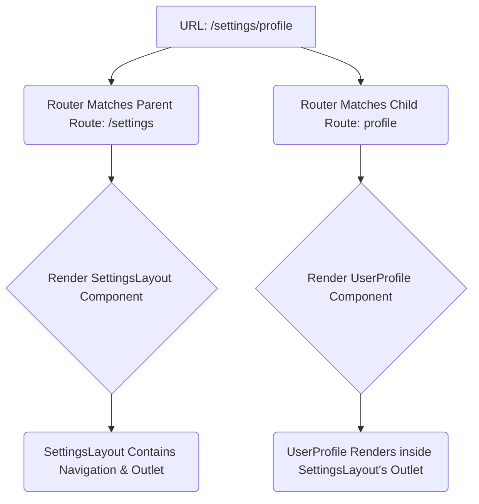
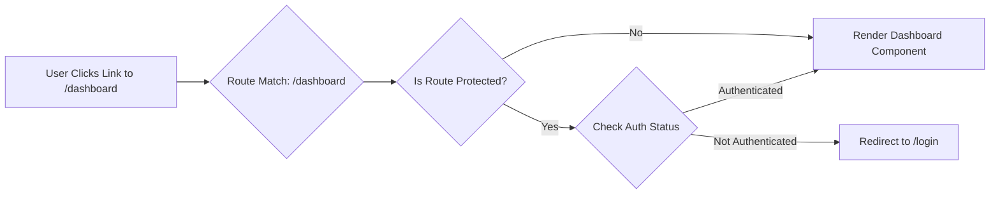

# Chapter 8: Routing Strategies for Complex Applications

## Introduction

Routing is the backbone of navigation in modern web applications, particularly Single Page Applications (SPAs). It's the mechanism that translates a URL in the browser's address bar into the specific view or component hierarchy the user sees on the screen. In simple applications, routing might seem trivial – map a path to a component. However, as applications grow in complexity, managing dozens or even hundreds of potential views, handling user authentication, optimizing load times, and integrating with server-rendering strategies demands sophisticated routing solutions.

Poorly designed routing can lead to a frustrating user experience (broken links, unexpected redirects, slow transitions), bloated application bundles, difficulties in code organization, and challenges in implementing features like authentication or data fetching tied to specific views. Conversely, a well-architected routing strategy is crucial for building scalable, maintainable, and performant frontend systems. It dictates how users navigate the application's features, how code is structured and loaded, and how the application interacts with the browser's history stack.

This chapter delves into the fundamental concepts of client-side routing, explores advanced patterns necessary for complex applications, examines the integration with server-side rendering (SSR) and static site generation (SSG), and provides an overview of popular routing libraries. Understanding these strategies is essential for any developer aiming to build production-grade frontend applications.

## A. Client-Side Routing (CSR) Fundamentals

Client-Side Routing (CSR) enables navigation between different "pages" or views within an SPA without requiring a full page reload from the server for each transition. The browser initially loads the core application shell (HTML, CSS, JavaScript), and subsequent navigation is handled entirely by JavaScript running in the browser, which updates the URL and renders the appropriate components.

### 1. History API vs. Hash Routing

Two primary mechanisms allow JavaScript to manipulate the browser's URL and history stack for CSR:

- **Hash Routing (`#`)**:

  - **Mechanism:** Uses the URL fragment identifier (the part after the `#`). Changes to the hash (`window.location.hash`) do _not_ trigger a full page reload by default. JavaScript listens for the `hashchange` event to detect navigation and update the view.
  - **Example URL:** `https://example.com/#/users/123`
  - **Pros:**
    - Simplicity: Easy to implement and requires no server-side configuration. The server only ever needs to serve the main `index.html` file, regardless of the hash path.
    - Legacy Browser Support: Works reliably even in older browsers.
  - **Cons:**
    - Aesthetics: URLs are often considered less "clean" or professional due to the `#`.
    - SEO Challenges: Historically, search engine crawlers sometimes ignored or had difficulty indexing content behind hash fragments, although this has improved significantly.
    - Server-Side Rendering: Doesn't map naturally to server-side routes if trying to achieve universal rendering.

- **History API (`pushState`, `replaceState`, `popstate`)**:
  - **Mechanism:** Utilizes the HTML5 History API methods (`history.pushState()`, `history.replaceState()`) to change the URL path displayed in the browser _without_ triggering a page reload. JavaScript listens for the `popstate` event (triggered by browser back/forward buttons) and intercepts link clicks to manage navigation internally.
  - **Example URL:** `https://example.com/users/123`
  - **Pros:**
    - Clean URLs: Provides standard-looking URLs, preferred for aesthetics and user perception.
    - Better SEO Potential: Search engines generally handle these URLs like traditional multi-page site URLs.
    - Aligns with Server Routing: URLs map directly to potential server-side routes, simplifying SSR/SSG integration.
  - **Cons:**
    - Server Configuration Required: If a user directly accesses or refreshes a deep link (e.g., `https://example.com/users/123`), the server must be configured to serve the main application shell (`index.html`) for that path, rather than looking for a file named `users/123`. Otherwise, a 404 error will occur. This typically involves setting up URL rewriting rules on the webserver (e.g., Nginx, Apache) or backend framework.

> **Production Note:** For most modern, production-grade applications, the **History API** is the preferred method due to cleaner URLs and better alignment with SEO and server-rendering practices. The necessary server configuration is a standard part of deploying SPAs. Hash routing might still be considered for internal tools where SEO is irrelevant and server configuration is restricted, or for specific legacy compatibility scenarios.

### 2. Core Concepts: Routers, Routes, Links, Route Parameters, Query Strings

Regardless of the underlying mechanism (Hash or History API), most routing libraries abstract these details and provide a common set of concepts:

- **Router:** The main component or instance that wraps the application (or a section of it) and provides the routing context. It listens to URL changes and orchestrates the rendering of matched routes.
- **Routes:** Definitions that map a specific URL path pattern to a component or set of components to be rendered. Routes can be exact paths (`/about`), include parameters (`/users/:userId`), or use wildcards (`/files/*`).
- **Links:** Special components or directives provided by the routing library (e.g., `<Link to="/dashboard">`, `<router-link to="/profile">`) used for declarative navigation. They typically render as standard anchor (`<a>`) tags but intercept the click event, prevent the default browser navigation, update the URL using the chosen routing mechanism (History API or Hash), and trigger the router to render the new view. Using these components ensures seamless client-side transitions.
- **Route Parameters:** Dynamic segments within a route path, usually denoted by a colon (`:`). They allow a single route definition to handle multiple specific URLs. For example, a route defined as `/products/:productId` would match `/products/1`, `/products/abc`, etc. The value of the parameter (`1`, `abc`) is typically made available within the matched component's props or via hooks.

  ```javascript
  // Example (React Router v6)
  import { useParams } from "react-router-dom";

  function ProductDetail() {
    let { productId } = useParams(); // Accesses the 'productId' value from the URL
    // Fetch product data using productId...
    return <div>Product ID: {productId}</div>;
  }
  ```

- **Query Strings (or Search Parameters):** Key-value pairs appended to the URL after a question mark (`?`), used to pass additional, optional data that doesn't define the resource itself but modifies the request (e.g., filtering, sorting, pagination). Example: `/search?query=routing&page=2`. Routing libraries provide utilities to access these parameters.

  ```javascript
  // Example (React Router v6)
  import { useSearchParams } from "react-router-dom";

  function SearchResults() {
    let [searchParams, setSearchParams] = useSearchParams();
    let query = searchParams.get("query"); // Accesses the 'query' value
    let page = searchParams.get("page"); // Accesses the 'page' value
    // Fetch search results using query and page...
    return (
      <div>
        Searching for: {query}, Page: {page}
      </div>
    );
  }
  ```

Understanding these core concepts is fundamental before tackling more complex routing scenarios encountered in large-scale applications.

## B. Advanced Routing Patterns

As applications grow, basic path-to-component mapping becomes insufficient. Production applications require more sophisticated patterns to handle complex layouts, user permissions, performance optimization, and dynamic data requirements.

### 1. Nested Routes and Layouts

Complex UIs often feature components that contain their own internal navigation or sections that should persist across multiple sub-views (e.g., a user settings page with sidebar navigation for profile, security, notifications). Nested routing allows route definitions to mirror this component hierarchy.

- **Concept:** A parent route renders a layout component, which includes a designated area (often called an "outlet" or "router-view") where child routes can render their components based on the matched URL path.
- **Example URL Structure:**
  - `/settings` -> Renders `SettingsLayout`
  - `/settings/profile` -> Renders `SettingsLayout` with `UserProfile` inside the outlet.
  - `/settings/security` -> Renders `SettingsLayout` with `SecuritySettings` inside the outlet.



- **Diagram Explanation:** This diagram shows how a nested URL like `/settings/profile` is processed. The router first matches the parent `/settings` route, rendering the `SettingsLayout`. It then matches the `profile` child route and renders the `UserProfile` component within the designated outlet area inside `SettingsLayout`.

This pattern promotes code reuse for shared layouts and logically groups related views within the application structure.

### 2. Protected/Authenticated Routes

Most applications have sections accessible only to logged-in users or users with specific permissions (roles). Protected routes enforce these access controls.

- **Mechanism:** Before rendering the component associated with a protected route, the router (or a wrapper component/guard) checks the user's authentication status (e.g., presence of a valid token, user session data in state management).
  - If authenticated/authorized: Render the requested component.
  - If not authenticated/authorized: Redirect the user to a login page or display an "Access Denied" message.
- **Implementation Strategies:**
  - **Wrapper Component:** Create a component (e.g., `<ProtectedRoute>`) that wraps the actual route definition. It performs the check and either renders its children (the protected component) or redirects.
  - **Route Configuration:** Some libraries allow defining metadata or guards directly within the route configuration object.
  - **Higher-Order Component (HOC):** Wrap the protected component with an HOC that adds the authentication check logic.
  - **Router Hooks/Guards:** Libraries like Vue Router or Angular Router provide dedicated navigation guards (`beforeEach`, `beforeEnter`, `CanActivate`) that execute before a route transition completes.



- **Diagram Explanation:** This flowchart illustrates the logic for accessing a potentially protected route. When a user attempts to navigate, the system checks if the route requires authentication. If so, it verifies the user's status, either rendering the component or redirecting to login. If the route isn't protected, it renders directly.

### 3. Code Splitting per Route (Lazy Loading)

Loading the entire application's JavaScript bundle upfront can lead to slow initial page loads, especially for large applications. Code splitting breaks the bundle into smaller chunks, which can be loaded on demand. Route-based code splitting is a common and effective strategy: only load the JavaScript code needed for a specific route when the user navigates to it.

- **Mechanism:** Utilizes dynamic `import()` syntax, which modern bundlers (like Webpack, Vite, Rollup) understand. When the router determines it needs to render a component associated with a lazy-loaded route, it triggers the dynamic import. The browser fetches the required chunk, and once loaded, the component is rendered.
- **Benefits:**
  - Faster initial load times (smaller initial bundle).
  - Reduced memory consumption initially.
  - Improved Time To Interactive (TTI).
- **Implementation:** Frameworks and routers provide mechanisms to integrate dynamic imports easily.
  - **React:** `React.lazy()` combined with `Suspense`.
  - **Vue:** Async components with dynamic `import()`.
  - **Angular:** Lazy loading modules via the router configuration (`loadChildren`).

### 7. [Code Snippet: Lazy loading components based on route]

Here's an example using React Router v6 and `React.lazy`:

```jsx
import React, { Suspense, lazy } from "react";
import { BrowserRouter as Router, Routes, Route, Link } from "react-router-dom";

// Dynamically import components
const HomePage = lazy(() => import("./pages/HomePage"));
const AboutPage = lazy(() => import("./pages/AboutPage"));
const DashboardPage = lazy(() => import("./pages/DashboardPage")); // Protected route component

// A simple loading fallback component
const LoadingSpinner = () => <div>Loading...</div>;

// A simple ProtectedRoute wrapper (implementation details vary)
const ProtectedRoute = ({ children }) => {
  const isAuthenticated = checkAuthStatus(); // Assume this function checks auth
  return isAuthenticated ? children : <Navigate to="/login" replace />;
};

function App() {
  return (
    <Router>
      <nav>
        <Link to="/">Home</Link> | <Link to="/about">About</Link> |{" "}
        <Link to="/dashboard">Dashboard</Link>
      </nav>
      <Suspense fallback={<LoadingSpinner />}>
        <Routes>
          <Route path="/" element={<HomePage />} />
          <Route path="/about" element={<AboutPage />} />
          <Route
            path="/dashboard"
            element={
              <ProtectedRoute>
                <DashboardPage />
              </ProtectedRoute>
            }
          />
          {/* Add other routes, 404 handler, etc. */}
          <Route path="/login" element={<div>Login Page</div>} />
        </Routes>
      </Suspense>
    </Router>
  );
}

export default App;
```

- **Explanation:** `React.lazy()` takes a function that calls a dynamic `import()`. This tells the bundler to create separate chunks for `HomePage`, `AboutPage`, and `DashboardPage`. The `<Suspense>` component wraps the `<Routes>` and provides a fallback UI (`LoadingSpinner`) to display while the lazy-loaded component's code is being fetched and evaluated. The `DashboardPage` is also wrapped in a hypothetical `ProtectedRoute` component.

### 4. Programmatic Navigation

Sometimes, navigation needs to be triggered by logic within a component, not just by a user clicking a link. Examples include redirecting after a form submission, navigating after a successful API call, or handling complex workflow steps.

- **Mechanism:** Routing libraries provide imperative APIs (functions) to trigger navigation programmatically.
- **Examples:**
  - **React Router:** `useNavigate()` hook (e.g., `const navigate = useNavigate(); navigate('/confirmation');`).
  - **Vue Router:** `router.push('/profile')` or `router.replace('/settings')`.
  - **Angular Router:** `Router` service (e.g., `constructor(private router: Router) {} this.router.navigate(['/orders', orderId]);`).

> **Production Consideration:** Use programmatic navigation judiciously. Over-reliance can make application flow harder to follow compared to declarative `<Link>` components. Reserve it for actions and side effects. Ensure redirects handle history correctly (e.g., using `replace: true` or `router.replace` when the user shouldn't be able to navigate back to the previous state, like after login).

### 5. Route-Based Data Fetching

Often, a component associated with a route needs specific data to render correctly. Fetching this data efficiently is crucial for user experience.

- **Strategies:**

  1.  **Fetch-on-Render (Inside Component):** The component mounts, then triggers a data fetch (e.g., in `useEffect`). Shows loading state while fetching. Simple but can lead to loading spinners cascading through nested routes.
  2.  **Fetch-then-Render (Route Loaders/Guards):** Fetch data _before_ the route transition completes and the component renders. The router waits for the data (or handles loading/error states centrally) before showing the new view. This can prevent rendering incomplete UIs.
      - **React Router v6.4+:** Introduced `loader` functions defined on routes. Data is fetched in parallel with lazy-loading the component code and made available via the `useLoaderData` hook.
      - **Vue Router:** Navigation guards (`beforeRouteEnter`, `beforeRouteUpdate`) can be used to fetch data before navigation.
      - **Angular:** Route Resolvers (`Resolve` interface) fetch data before activating the route.
      - **Meta-frameworks (Next.js, Nuxt, SvelteKit):** Often have built-in data fetching functions tied to pages/routes (e.g., `getServerSideProps`, `getStaticProps`, `load`).

- **Trade-offs:** Fetch-then-render can feel slightly slower initially if data fetching is slow (blank screen or persistent old screen until data arrives), but avoids layout shifts and loading spinners within the main content area. Fetch-on-render shows the new UI structure faster but requires handling loading states within each component. Modern approaches like React Router loaders aim for the best of both worlds by starting fetches early.

### 6. [Practical Example: Implementing role-based access control for routes]

Let's extend the protected route concept to handle user roles (e.g., 'admin', 'editor', 'viewer'). We want to restrict access to certain routes based on these roles.

**Scenario:**

- `/admin/users` should only be accessible by users with the 'admin' role.
- `/posts/edit/:postId` should be accessible by 'admin' or 'editor' roles.
- `/dashboard` should be accessible by any authenticated user ('admin', 'editor', 'viewer').

**Implementation Sketch (using a conceptual wrapper component):**

```jsx
// Assume getUser() returns { isAuthenticated: boolean, roles: string[] }
import { getUser } from "./authService";
import { Navigate, useLocation } from "react-router-dom";

function RoleBasedGuard({ allowedRoles, children }) {
  const user = getUser();
  const location = useLocation();

  if (!user.isAuthenticated) {
    // Redirect to login, preserving intended destination
    return <Navigate to="/login" state={{ from: location }} replace />;
  }

  // Check if user has at least one of the allowed roles
  // If allowedRoles is empty or undefined, just check for authentication
  const hasRequiredRole = allowedRoles
    ? allowedRoles.some((role) => user.roles.includes(role))
    : true;

  if (!hasRequiredRole) {
    // User is logged in but doesn't have permission
    // Redirect to an 'Unauthorized' page or back to dashboard/home
    return <Navigate to="/unauthorized" replace />;
  }

  // User is authenticated and has the required role(s)
  return children;
}

// --- In your Route definitions ---
import AdminUserManagement from "./pages/AdminUserManagement";
import PostEditor from "./pages/PostEditor";
import Dashboard from "./pages/Dashboard";

<Routes>
  <Route
    path="/admin/users"
    element={
      <RoleBasedGuard allowedRoles={["admin"]}>
        <AdminUserManagement />
      </RoleBasedGuard>
    }
  />
  <Route
    path="/posts/edit/:postId"
    element={
      <RoleBasedGuard allowedRoles={["admin", "editor"]}>
        <PostEditor />
      </RoleBasedGuard>
    }
  />
  <Route
    path="/dashboard"
    element={
      // No specific roles needed, just authentication (handled by RoleBasedGuard)
      <RoleBasedGuard>
        <Dashboard />
      </RoleBasedGuard>
    }
  />
  {/* Other routes: /login, /unauthorized, public routes, etc. */}
</Routes>;
```

- **Explanation:** The `RoleBasedGuard` component centralizes the authorization logic. It first checks for basic authentication. If authenticated, it then checks if the user's roles (`user.roles`) include any of the `allowedRoles` passed as a prop. Based on the checks, it either renders the `children` (the protected component) or redirects the user appropriately. This pattern keeps the authorization logic separate from the page components themselves.

## C. Server-Side Routing (SSR) and Static Site Generation (SSG) Integration

While CSR handles navigation within the browser, the initial delivery of the application often involves the server. Modern frontend development frequently integrates CSR with server-rendering techniques for better performance and SEO.

### 1. Understanding the Trade-offs: Performance, SEO, Complexity

Choosing a rendering strategy involves balancing several factors:

| Strategy | Description                                                                   | Performance (Initial Load) | Performance (Subsequent Nav) | SEO      | Complexity | Server Cost | Use Cases                                                                |
| :------- | :---------------------------------------------------------------------------- | :------------------------- | :--------------------------- | :------- | :--------- | :---------- | :----------------------------------------------------------------------- |
| **CSR**  | Render in browser. Server sends minimal HTML + JS bundle.                     | Slowest (TTFB/FCP/TTI)     | Fastest                      | Poorer\* | Lowest     | Low         | Dashboards, apps behind login, complex interactive tools.                |
| **SSR**  | Render page on server per request. Send full HTML. JS hydrates later.         | Faster (FCP/TTI)           | Slower than CSR              | Good     | Higher     | High        | Dynamic content needing SEO, e-commerce, personalized content.           |
| **SSG**  | Render all pages to static HTML at build time. Serve from CDN.                | Fastest (FCP/TTI)          | Fastest                      | Best     | Low-Medium | Lowest      | Blogs, marketing sites, documentation, content-heavy sites.              |
| **ISR**  | Like SSG, but pages can be regenerated periodically or on-demand after build. | Fastest (FCP/TTI)          | Fastest                      | Best     | Medium     | Low-Medium  | Sites needing SSG benefits but with moderately frequent content updates. |

\* _CSR SEO can be significantly improved using pre-rendering services or dynamic rendering, but it's not inherent._

### 2. Framework-Specific SSR/SSG (Next.js, Nuxt, SvelteKit, Angular Universal)

Meta-frameworks build upon base libraries (React, Vue, Svelte, Angular) to provide integrated solutions for different rendering strategies, often blurring the lines between client and server routing:

- **Next.js (React):** Offers page-based routing. Provides `getServerSideProps` (SSR), `getStaticProps` (SSG/ISR), and the newer App Router model with Server Components and Client Components, allowing fine-grained control over rendering and data fetching strategies per component/route.
- **Nuxt (Vue):** Provides file-system based routing and multiple rendering modes (SPA, Universal/SSR, Static/SSG). Uses `asyncData` and `fetch` hooks for server-side data fetching. Nitro server engine handles deployment targets.
- **SvelteKit:** File-system based routing with `+page.js` (or `+page.server.js`) files exporting `load` functions for data fetching. Adapters configure output for different platforms (static, Node server, serverless). Supports SSR, SSG, and CSR modes.
- **Angular Universal:** An official Angular package (`@nguniversal/express-engine`) enabling server-side rendering for Angular applications, typically integrated with a Node.js Express server.

These frameworks manage the complexity of serving initial HTML, handling routing on both server and client, and managing hydration.

### 3. Hydration: Concepts and Potential Issues

Hydration is the process by which client-side JavaScript takes over the static HTML rendered by the server (SSR/SSG) and makes it interactive. It involves:

1.  Rendering the component tree in memory on the client.
2.  Diffing this virtual tree against the existing server-rendered DOM.
3.  Attaching event listeners (`onClick`, `onSubmit`, etc.) to the existing DOM nodes.
4.  Restoring application state if necessary.

> **Goal:** To seamlessly transition from a static server-rendered page to a fully interactive client-side application without jarring visual changes or loss of state.

Potential Issues: See Deep Dive below.

### 4. Incremental Static Regeneration (ISR)

Pioneered by Next.js, ISR bridges the gap between SSG and SSR.

- **Mechanism:** Pages are initially built as static HTML (like SSG). However, you can specify a `revalidate` period (e.g., 60 seconds).
  1.  The first request serves the stale static page.
  2.  A background process triggers a regeneration of the page (re-fetching data, re-rendering HTML).
  3.  Subsequent requests within the revalidation window serve the stale page.
  4.  Once regeneration is complete, the _next_ request serves the newly generated, fresh page, which becomes the new "stale" page.
- **Benefits:** Get the performance and scalability of static hosting (serving from CDN edge) while ensuring content doesn't become excessively outdated. Ideal for sites with frequent but not real-time updates. On-demand ISR allows triggering regeneration via API calls (e.g., after updating content in a CMS).

### 5. [Deep Dive: How hydration works and common pitfalls]

**How Hydration Works (Simplified):**

1.  **Server:** Receives a request for `/product/123`. Runs framework code, fetches data for product 123, renders the React/Vue/etc. component tree to an HTML string. Sends this HTML (plus necessary data embedded as JSON) to the browser.
2.  **Browser:** Receives HTML, parses and displays it quickly (Fast FCP). Starts downloading the main JS bundle(s).
3.  **Client JS:** Bundle downloads and executes. The framework (React, Vue, etc.) initializes.
4.  **Virtual DOM:** The framework builds its internal representation (Virtual DOM) of what the `/product/123` page _should_ look like based on the client-side component code.
5.  **Reconciliation/Diffing:** The framework compares its Virtual DOM with the existing server-rendered HTML DOM structure.
6.  **Attachment:** Instead of discarding the server HTML and re-creating DOM nodes, the framework "adopts" the existing nodes, attaches the necessary event listeners, and wires up the component state.

**Common Hydration Pitfalls:**

- **Hydration Mismatch Errors:** These occur when the DOM structure rendered on the server is different from what the client-side JavaScript expects to render for the same state/props. This forces the client to discard the server HTML and re-render from scratch, negating SSR benefits and potentially causing visual glitches.
  - **Causes:**
    - Using browser-specific APIs (`window`, `localStorage`) directly in rendering logic _without_ checks (e.g., `typeof window !== 'undefined'`).
    - Rendering based on timestamps (`Date.now()`) or random numbers (`Math.random()`) that differ between server and client.
    - Incorrect conditional rendering logic that behaves differently on server vs. client.
    - Browser extensions manipulating the DOM before hydration completes.
    - Invalid HTML structure (e.g., nesting `<div>` inside `<p>`) that the browser corrects differently than the server outputted.
  - **Mitigation:** Careful coding practices, using framework lifecycle hooks/guards correctly, abstracting browser APIs, ensuring consistent rendering logic. Frameworks often provide warnings in development mode.
- **Performance Bottlenecks (TTI Delay):** Even if hydration succeeds, a large JS bundle can take time to download, parse, and execute. During this time, the page _looks_ interactive (FCP is fast) but isn't actually responsive to user input until hydration completes (TTI is delayed). This is known as the "uncanny valley" of SSR.
  - **Mitigation:** Code splitting (especially route-based), optimizing bundle size, deferring non-critical JS, exploring techniques like partial hydration or progressive hydration (though complex).
- **Layout Shifts:** If CSS isn't loaded correctly or if client-side rendering logic subtly changes layout compared to the server version, users might experience content jumping around during or after hydration.
  - **Mitigation:** Ensure critical CSS is inlined or loaded synchronously, use fixed dimensions for elements prone to shifting, test thoroughly.

### 6. [Production Note: Choosing the right rendering strategy]

There's no single "best" strategy; the optimal choice depends heavily on the specific application's requirements:

- **Public Marketing Site / Blog / Docs:** **SSG** is often ideal. Max speed, best SEO, low cost. Use **ISR** if content updates frequently but not in real-time.
- **E-commerce Site:**
  - Product listing pages: **SSR** or **ISR** for SEO and relatively fresh data.
  - Product detail pages: **SSR** or **ISR**.
  - Shopping cart / Checkout: **CSR** or **SSR** (often CSR behind login, but SSR might be used for the initial load).
- **SaaS Dashboard / Application (behind login):** **CSR** is often sufficient and simpler. Initial load performance is less critical than for public sites, and SEO is irrelevant. SSR might be used for the initial shell load if perceived performance is paramount, but adds complexity.
- **News Site / Social Media Feed:** **SSR** or **ISR** combined with client-side fetching for real-time updates. SSR ensures fresh content and SEO for initial load.
- **Highly Interactive Tool (e.g., Online Editor):** **CSR** is usually the best fit due to the constant state changes and complex UI interactions best handled client-side.

**Key Considerations:**

- **SEO Needs:** Public-facing content needing indexing heavily favors SSR/SSG/ISR.
- **Content Freshness:** How often does data change? Real-time -> SSR + Client Fetching; Frequent -> ISR/SSR; Infrequent -> SSG.
- **Interactivity:** Highly dynamic, stateful interfaces often lean towards CSR (though SSR/SSG provide the initial load).
- **Perceived Performance:** Time-to-First-Byte (TTFB), First Contentful Paint (FCP), Time To Interactive (TTI) – which are most critical?
- **Development Complexity & Team Expertise:** SSR/ISR add complexity compared to pure CSR or simple SSG.
- **Infrastructure Costs:** SSR requires active server processes, increasing cost and complexity compared to static hosting for SSG/ISR/CSR.

Often, complex applications use a **hybrid approach**, applying different strategies to different parts of the site (e.g., SSG for marketing pages, SSR for product pages, CSR for the user dashboard). Meta-frameworks excel at enabling these hybrid patterns.

## D. Routing Libraries Deep Dive

While the core concepts are similar, specific implementations and features vary across popular routing libraries tied to major frontend frameworks.

### 1. React Router / TanStack Router

- **React Router:** The de facto standard for routing in React applications for many years.
  - **Key Features (v6):** Component-based route definition (`<Routes>`, `<Route>`), hooks API (`useNavigate`, `useParams`, `useLocation`, `useOutletContext`), nested routes with `<Outlet>`, layout routes, strong focus on declarative composition.
  - **v6.4+ Enhancements:** Introduced data loading/mutation APIs (`loader`, `action` functions defined on routes), deferred data loading, improved race condition handling, aligning more closely with patterns seen in meta-frameworks. Eliminates component-based fetch-on-render waterfalls for data fetching.
- **TanStack Router (formerly React Location, now framework-agnostic):** A newer, fully type-safe routing library gaining significant traction.
  - **Key Features:** Built with TypeScript first (excellent type safety and autocomplete), type-safe route parameters and search parameters, first-class support for search param state management, built-in caching, file-based routing option, framework-agnostic core with adapters for React, Solid, Vue, Svelte. Focuses heavily on developer experience and eliminating common routing bugs through type safety.

### 2. Vue Router

- **Key Features:** The official router for Vue.js, tightly integrated with the framework's reactivity system.
  - **Configuration:** Typically configured using a route configuration object passed to `createRouter`.
  - **Components:** `<router-link>` for navigation, `<router-view>` as the outlet for rendering matched components (can be named for complex layouts).
  - **Navigation Guards:** Powerful mechanism for intercepting navigation globally (`beforeEach`, `afterEach`), per-route (`beforeEnter`), or within components (`beforeRouteEnter`, `beforeRouteUpdate`, `beforeRouteLeave`). Used for auth, data fetching, logging, etc.
  - **Modes:** Supports `history` (History API) and `hash` (Hash Routing) modes.
  - **Programmatic Navigation:** `router.push()`, `router.replace()`, `router.go()`.
  - **Scroll Behavior:** Customizable control over scroll position on navigation.

### 3. Angular Router

- **Key Features:** Part of the core Angular framework (`@angular/router`), deeply integrated with Angular's module system and dependency injection.
  - **Configuration:** Defined within Angular modules using `RouterModule.forRoot()` (app root) and `RouterModule.forChild()` (feature modules). Routes are defined as an array of `Route` objects.
  - **Outlet:** `<router-outlet>` directive marks where matched components should be rendered.
  - **Route Guards:** Interfaces like `CanActivate` (control access to a route), `CanActivateChild` (control access to child routes), `CanDeactivate` (control navigation away from a route), `Resolve` (pre-fetch data before route activation), `CanLoad` (control lazy loading of modules). Implemented as injectable services.
  - **Lazy Loading:** Built-in support for lazy loading entire Angular modules via the `loadChildren` property in route configuration, enabling effective code splitting.
  - **Parameters:** Access route parameters and query parameters via the `ActivatedRoute` service.
  - **Programmatic Navigation:** `Router` service (`navigate`, `navigateByUrl`).

### 4. Standalone Routers

While most large applications use framework-specific routers for better integration, some lightweight, framework-agnostic routers exist (e.g., Navigo, Universal Router). However, in the context of production-grade systems built with major frameworks like React, Vue, or Angular, their respective canonical routers (or strong alternatives like TanStack Router) are overwhelmingly preferred due to ecosystem support, feature richness, and community backing. Meta-frameworks like Next.js, Nuxt, and SvelteKit also come with their own powerful, integrated file-system based routing solutions that abstract away much of the manual configuration.

### 5. [Configuration Guide: Advanced configuration options for React Router v6]

Let's illustrate some advanced configurations using React Router v6's object-based route configuration, which often scales better for complex applications than JSX routes.

```jsx
import React, { Suspense, lazy } from "react";
import {
  createBrowserRouter,
  RouterProvider,
  Outlet,
  Navigate,
  useRouteError,
  useLoaderData,
  useNavigate,
} from "react-router-dom";

// --- Services ---
import { checkAuth, getUserProfile, getPost, updatePost } from "./apiService"; // Mock API functions

// --- Layout Components ---
const RootLayout = () => (
  <div>
    <header>My App Header</header>
    <nav> {/* Navigation Links */} </nav>
    <main>
      <Outlet /> {/* Child routes render here */}
    </main>
    <footer>My App Footer</footer>
  </div>
);

const SettingsLayout = () => (
  <div>
    <h2>Settings</h2>
    <nav> {/* Settings Sub-Navigation */} </nav>
    <Outlet /> {/* Settings child routes render here */}
  </div>
);

// --- Page Components (Lazy Loaded) ---
const HomePage = lazy(() => import("./pages/HomePage"));
const LoginPage = lazy(() => import("./pages/LoginPage"));
const DashboardPage = lazy(() => import("./pages/DashboardPage"));
const ProfileSettingsPage = lazy(() => import("./pages/ProfileSettingsPage"));
const SecuritySettingsPage = lazy(() => import("./pages/SecuritySettingsPage"));
const PostEditorPage = lazy(() => import("./pages/PostEditorPage"));
const NotFoundPage = lazy(() => import("./pages/NotFoundPage"));

// --- Loading/Error Components ---
const Loading = () => <div>Loading...</div>;
const RootErrorBoundary = () => {
  let error = useRouteError();
  console.error(error);
  // Render fallback UI, maybe log error to monitoring service
  return <div>Something went wrong at the root level!</div>;
};

// --- Loader Functions ---
// Loader: Ensure user is authenticated for protected routes
const protectedLoader = async () => {
  const isAuthenticated = await checkAuth();
  if (!isAuthenticated) {
    // Throwing a redirect response is the idiomatic way to redirect in loaders
    throw new Response("Unauthorized", {
      status: 401,
      statusText: "Unauthorized",
    });
    // Or return redirect('/login'); // If using helper functions
  }
  return null; // Or return user data if needed globally
};

// Loader: Fetch user profile data
const profileLoader = async () => {
  await protectedLoader(); // Ensure auth first
  const profile = await getUserProfile();
  if (!profile) throw new Response("Not Found", { status: 404 });
  return { profile }; // Data made available via useLoaderData()
};

// Loader: Fetch post data for editing
const postLoader = async ({ params }) => {
  await protectedLoader(); // Ensure auth
  const post = await getPost(params.postId);
  if (!post) throw new Response("Not Found", { status: 404 });
  return { post };
};

// --- Action Function ---
// Action: Handle post update form submission
const postUpdateAction = async ({ request, params }) => {
  await protectedLoader(); // Ensure auth
  const formData = await request.formData();
  const updates = Object.fromEntries(formData);
  await updatePost(params.postId, updates);
  // Redirect after successful update
  return redirect(`/posts/${params.postId}`); // Assume redirect helper exists or use Navigate
};

// --- Route Configuration Object ---
const routerConfig = [
  {
    path: "/",
    element: <RootLayout />,
    errorElement: <RootErrorBoundary />, // Catch errors bubbling up
    children: [
      {
        index: true, // Matches '/' path exactly
        element: <HomePage />,
      },
      {
        path: "login",
        element: <LoginPage />,
        // Add action for login form if needed
      },
      {
        // Group protected routes under a common loader/element if desired
        id: "protected", // Optional ID for referencing
        loader: protectedLoader, // Applied to all child routes
        element: <Outlet />, // Just renders children if loader passes
        errorElement: <div>Auth Error or Sub-route Error</div>, // More specific error boundary
        children: [
          {
            path: "dashboard",
            element: <DashboardPage />,
            // loader: dashboardLoader, // Specific loader for dashboard data
          },
          {
            path: "settings",
            element: <SettingsLayout />,
            children: [
              {
                index: true, // Default settings view, maybe redirect or show overview
                element: <Navigate to="profile" replace />,
              },
              {
                path: "profile",
                loader: profileLoader, // Load profile data
                element: <ProfileSettingsPage />,
                // action: profileUpdateAction, // Handle profile form submission
              },
              {
                path: "security",
                element: <SecuritySettingsPage />,
              },
            ],
          },
          {
            path: "posts/:postId/edit",
            loader: postLoader,
            action: postUpdateAction,
            element: <PostEditorPage />,
          },
        ],
      },
      {
        // Catch-all 404 route - must be last
        path: "*",
        element: <NotFoundPage />,
      },
    ],
  },
];

// --- Create and Provide Router ---
const router = createBrowserRouter(routerConfig);

function App() {
  // Wrap RouterProvider in Suspense for lazy loading fallbacks
  return (
    <Suspense fallback={<Loading />}>
      <RouterProvider router={router} fallbackElement={<Loading />} />
    </Suspense>
  );
}

export default App;
```

- **Explanation:**
  - **Object-Based Config:** Uses `createBrowserRouter` with an array of route objects instead of JSX `<Route>` elements. This can be easier to manage and generate programmatically for very large route sets.
  - **Layouts:** `RootLayout` and `SettingsLayout` use `<Outlet />` to render nested routes.
  - **Loaders:** `protectedLoader`, `profileLoader`, `postLoader` fetch data _before_ rendering. They are defined alongside the routes they apply to. `protectedLoader` also acts as an auth guard by throwing a Response on failure (React Router catches this).
  - **Actions:** `postUpdateAction` handles form submissions for a specific route, performs mutations, and redirects.
  - **Error Handling:** `errorElement` is used at different levels to provide specific error UIs. `useRouteError` hook accesses the error within the boundary component.
  - **Lazy Loading:** Components are still lazy-loaded using `React.lazy`. `Suspense` is used around `RouterProvider`.
  - **Index Routes:** `index: true` specifies the default child route for a path.
  - **Catch-All Route:** `path: '*'` handles any unmatched paths (404).

This configuration demonstrates how React Router's data APIs and object configuration can handle authentication, data fetching, mutations, nested layouts, and error handling in a structured way suitable for complex applications.

## Conclusion

Routing is far more than just mapping URLs to components; it's a fundamental aspect of frontend architecture that deeply influences user experience, application structure, performance, and maintainability. From understanding the basic differences between History API and Hash routing to implementing advanced patterns like nested layouts, protected routes, route-based code splitting, and data fetching strategies, mastering routing is essential for building scalable, production-grade applications.

The integration with server-rendering strategies (SSR, SSG, ISR) adds another layer of complexity, requiring careful consideration of trade-offs between initial load performance, SEO, development complexity, and infrastructure costs. Modern meta-frameworks and routing libraries provide powerful tools and abstractions to manage these complexities, but a solid understanding of the underlying concepts is crucial for making informed architectural decisions.

Choosing the right routing library and leveraging its advanced features effectively allows development teams to build complex navigation flows, enforce security policies, optimize load times, and create intuitive, responsive user interfaces. As applications scale, a well-defined and robust routing strategy becomes an indispensable foundation for success.
