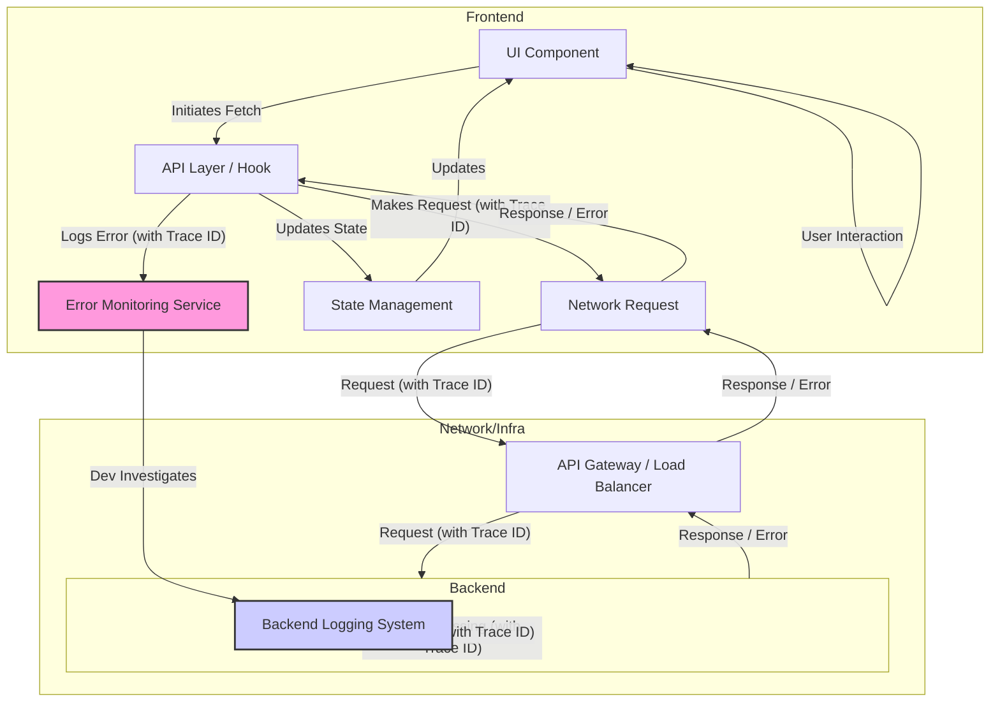

# Chapter 9: Data Fetching and API Interaction Patterns

Modern frontend applications are rarely self-contained; they are dynamic interfaces powered by data fetched from backend services, third-party APIs, and various data sources. The way a frontend application interacts with these APIs is a critical architectural concern, directly impacting user experience, performance, maintainability, and scalability. Inefficient or poorly designed data fetching strategies lead to sluggish interfaces, brittle codebases, difficult debugging, and frustrated users.

This chapter delves into the essential patterns and best practices for managing data fetching and API interactions in production-grade, scalable frontend systems. We will move beyond simple `fetch` calls and explore how to build a robust, maintainable, and performant data layer within your frontend architecture. We'll cover designing dedicated API layers, consuming RESTful and GraphQL APIs effectively, handling loading and error states gracefully, and implementing comprehensive error reporting.

## A. Designing the Frontend API Layer

One of the most crucial steps towards a scalable frontend is establishing a clear separation between the UI components and the specifics of API communication. Directly embedding `fetch` or `axios` calls within UI components leads to tight coupling, making it difficult to refactor, test, or adapt to API changes. A dedicated API layer acts as an intermediary, encapsulating the details of network requests, data transformation, and endpoint logic.

### 1. Decoupling UI from API Specifics

**Why Decouple?**

- **Maintainability:** If an API endpoint changes (URL, request/response structure, headers), changes are localized to the API layer, not scattered across multiple UI components.
- **Testability:** UI components can be tested independently by mocking the API layer, and the API layer itself can be unit-tested without needing a running UI.
- **Reusability:** API interaction logic can be easily reused across different parts of the application.
- **Adaptability:** Switching underlying fetching libraries (e.g., `fetch` to `axios`) or even API paradigms (e.g., REST to GraphQL for a specific domain) becomes significantly easier.
- **Consistency:** Enforces a consistent way of interacting with APIs across the entire application.

> **Definition: API Layer**
> An abstraction layer within the frontend codebase responsible for managing all communication with external APIs. It encapsulates network request logic, data transformation, authentication handling, and error management related to API interactions, exposing a cleaner, domain-specific interface to the rest of the application (primarily UI components or state management).

### 2. Creating Reusable API Client Services/Hooks

The implementation of the API layer often takes the form of:

- **Service Classes/Objects:** Using classes or plain objects to group related API calls (e.g., `UserService`, `ProductService`). Each method corresponds to an API operation (e.g., `getUserById(id)`, `updateUserProfile(data)`).
- **Custom Hooks (React):** In React applications, custom hooks (e.g., `useUserData(userId)`, `useUpdatePost()`) are a popular way to encapsulate data fetching logic, state management (loading, error, data), and side effects related to a specific API resource or operation. These hooks often utilize libraries like React Query or SWR internally.
- **Functions:** Simple functions, potentially grouped by module, can also serve this purpose, especially in smaller applications or when integrating with state management libraries that handle the request lifecycle.

The key is that these services/hooks hide the implementation details (e.g., which HTTP method is used, the exact endpoint path, how headers are set) and provide a semantically meaningful interface to the rest of the application.

### 3. Handling API Base URLs and Environments

Hardcoding API endpoints directly in the code is a common anti-pattern. Production applications operate in multiple environments (development, testing/staging, production), each potentially having a different API base URL.

**Best Practice:** Use environment variables.

1.  **Define Variables:** Create `.env` files for different environments (e.g., `.env.development`, `.env.production`).

    ```
    # .env.development
    REACT_APP_API_BASE_URL=http://localhost:3001/api

    # .env.production
    REACT_APP_API_BASE_URL=https://api.myapp.com/v1
    ```

2.  **Access Variables:** Use build tool mechanisms (like Webpack's `DefinePlugin`, Vite's `import.meta.env`, or Create React App's `process.env`) to access these variables in your code.
3.  **Centralize Usage:** Configure your API client (e.g., Axios instance, base fetch function) to use this base URL, ensuring all requests go to the correct environment.

```typescript
// Example: Centralized Axios instance configuration
import axios from "axios";

const apiClient = axios.create({
  baseURL: process.env.REACT_APP_API_BASE_URL || "http://localhost:3001/api", // Fallback for safety
  timeout: 10000, // Example: Request timeout
  headers: {
    "Content-Type": "application/json",
    Accept: "application/json",
  },
});

// Interceptors can be added here (see Section B)

export default apiClient;
```

### 4. [Practical Example: Building a typed API client using Fetch or Axios]

Let's build a simple, typed API client service for managing user data using Axios and TypeScript.

```typescript
// src/services/apiClient.ts
import axios, { AxiosInstance, AxiosRequestConfig, AxiosResponse } from "axios";
import { User, UserProfileUpdate } from "../types/user"; // Assuming these types are defined

class ApiClient {
  private client: AxiosInstance;

  constructor() {
    this.client = axios.create({
      baseURL:
        process.env.REACT_APP_API_BASE_URL || "http://localhost:3001/api",
      timeout: 10000,
      headers: {
        "Content-Type": "application/json",
        Accept: "application/json",
      },
    });

    // Add interceptors if needed (e.g., for auth)
    this.client.interceptors.request.use(
      (config) => {
        const token = localStorage.getItem("authToken"); // Example: Retrieving token
        if (token && config.headers) {
          config.headers.Authorization = `Bearer ${token}`;
        }
        return config;
      },
      (error) => Promise.reject(error)
    );
  }

  // Generic request method (optional, but can be useful)
  private async request<T>(config: AxiosRequestConfig): Promise<T> {
    try {
      const response: AxiosResponse<T> = await this.client.request<T>(config);
      return response.data;
    } catch (error) {
      // Basic error handling/logging can happen here or be delegated
      console.error("API Request Error:", error);
      throw error; // Re-throw to be handled by the caller
    }
  }

  // Specific User methods
  public async getUserById(userId: string): Promise<User> {
    return this.request<User>({ method: "GET", url: `/users/${userId}` });
  }

  public async updateUserProfile(
    userId: string,
    data: UserProfileUpdate
  ): Promise<User> {
    return this.request<User>({
      method: "PUT",
      url: `/users/${userId}/profile`,
      data,
    });
  }

  public async getAllUsers(params?: Record<string, any>): Promise<User[]> {
    return this.request<User[]>({ method: "GET", url: "/users", params });
  }
}

// Export a singleton instance
const apiClientInstance = new ApiClient();
export default apiClientInstance;

// --- Usage in a component (e.g., React Hook) ---
import { useState, useEffect } from "react";
import apiClient from "../services/apiClient";
import { User } from "../types/user";

function useUserData(userId: string) {
  const [user, setUser] = useState<User | null>(null);
  const [loading, setLoading] = useState<boolean>(true);
  const [error, setError] = useState<Error | null>(null);

  useEffect(() => {
    if (!userId) return;

    setLoading(true);
    setError(null);
    apiClient
      .getUserById(userId)
      .then((data) => {
        setUser(data);
      })
      .catch((err) => {
        setError(err); // Error object from apiClient
      })
      .finally(() => {
        setLoading(false);
      });
  }, [userId]);

  return { user, loading, error };
}
```

This example demonstrates:

- Encapsulation of base URL and Axios configuration.
- Type safety for request parameters and response data (`User`, `UserProfileUpdate`).
- Reusable methods (`getUserById`, `updateUserProfile`) hiding HTTP details.
- Basic request interceptor for adding authentication tokens.
- Clear separation allowing `useUserData` hook to focus on state management and component lifecycle, relying on `apiClient` for the actual fetching.

## B. RESTful API Consumption Best Practices

Representational State Transfer (REST) remains a dominant architectural style for web APIs. Consuming RESTful APIs effectively requires understanding HTTP fundamentals and implementing consistent patterns.

### 1. Request Methods, Headers, Status Codes

- **Methods:** Use HTTP methods semantically:
  - `GET`: Retrieve data (should be safe and idempotent).
  - `POST`: Create a new resource or trigger an action.
  - `PUT`: Replace an existing resource entirely (idempotent).
  - `PATCH`: Partially update an existing resource (not necessarily idempotent).
  - `DELETE`: Remove a resource (idempotent).
- **Headers:** Send appropriate headers:
  - `Content-Type`: Indicates the format of the request body (e.g., `application/json`).
  - `Accept`: Indicates the desired format for the response (e.g., `application/json`).
  - `Authorization`: Carries credentials (e.g., `Bearer <token>`).
  - Custom headers as required by the API (e.g., `X-Request-ID` for tracing).
- **Status Codes:** Understand and handle common status codes:
  - `2xx` (Success): `200 OK`, `201 Created`, `204 No Content`.
  - `3xx` (Redirection): Often handled automatically by the browser/client, but be aware (e.g., `304 Not Modified` for caching).
  - `4xx` (Client Errors): `400 Bad Request`, `401 Unauthorized`, `403 Forbidden`, `404 Not Found`, `422 Unprocessable Entity`. These indicate an issue with the client's request.
  - `5xx` (Server Errors): `500 Internal Server Error`, `502 Bad Gateway`, `503 Service Unavailable`, `504 Gateway Timeout`. These indicate a problem on the server side.

### 2. Data Transformation (Request/Response)

APIs often return data in a format optimized for the backend or following a generic standard. The frontend might need this data in a different structure for easier consumption by UI components or state management. Similarly, data entered by the user might need transformation before being sent to the API.

**Where to Transform:** Perform transformations within the API layer. This keeps UI components clean and focused on presentation.

```typescript
// Example: Transforming API response within the API client service
import apiClient from "./apiClient"; // Using the previous Axios instance

interface ApiUser {
  // Raw format from API
  user_id: string;
  first_name: string;
  last_name: string;
  created_at: string;
  is_active: boolean;
}

interface AppUser {
  // Format needed by the frontend
  id: string;
  firstName: string;
  lastName: string;
  createdAt: Date;
  isActive: boolean;
}

function transformApiUserToAppUser(apiUser: ApiUser): AppUser {
  return {
    id: apiUser.user_id,
    firstName: apiUser.first_name,
    lastName: apiUser.last_name,
    createdAt: new Date(apiUser.created_at), // Convert string to Date object
    isActive: apiUser.is_active,
  };
}

class UserService {
  public async getUser(userId: string): Promise<AppUser> {
    // Fetch raw data
    const rawUserData = await apiClient.get<ApiUser>(`/users/${userId}`);
    // Transform before returning
    return transformApiUserToAppUser(rawUserData.data); // Assuming axios response structure
  }

  // Similar transformation might be needed for sending data (AppUser -> ApiUser format)
}

export const userService = new UserService();
```

### 3. Handling Authentication (Tokens, Cookies)

- **Token-Based (e.g., JWT):**
  - **Storage:** Tokens are typically received after login and need to be stored securely. Options include:
    - `localStorage`: Simple, but vulnerable to XSS attacks. Use with caution.
    - `sessionStorage`: Similar to `localStorage` but cleared when the session ends. Still vulnerable to XSS.
    - Memory: Store in a variable within your app's state. Lost on refresh, requiring mechanisms to re-authenticate or persist refresh tokens securely.
    - HttpOnly Cookies (Set by Backend): The most secure option against XSS, as JavaScript cannot access the token directly. The browser automatically sends the cookie with requests to the originating domain. Often used in conjunction with CSRF protection.
  - **Sending:** Tokens (unless using HttpOnly cookies) must be manually added to the `Authorization` header (usually `Bearer <token>`) for authenticated requests. Interceptors are ideal for this.
  - **Refresh Tokens:** Long-lived refresh tokens (often stored in HttpOnly cookies or secure storage) can be used to obtain new short-lived access tokens without requiring the user to log in again. Implement logic to handle token expiry and refresh automatically.
- **Cookie-Based (Session):**
  - The browser handles sending the session cookie automatically with requests to the same domain, provided the cookie's attributes (`Domain`, `Path`, `HttpOnly`, `Secure`, `SameSite`) are set correctly by the backend.
  - Frontend usually doesn't need to manage the cookie directly, but needs to handle responses indicating an expired session (e.g., 401 status, redirect to login).
  - Requires CSRF (Cross-Site Request Forgery) protection mechanisms (e.g., CSRF tokens).

### 4. [Code Snippet: Implementing interceptors for auth and error handling]

Using Axios interceptors provides a centralized place to manage common request and response logic.

```typescript
// src/services/apiClient.ts (Continuing from previous example)
import axios, {
  AxiosInstance,
  AxiosRequestConfig,
  AxiosResponse,
  AxiosError,
} from "axios";
import { AuthService } from "./authService"; // Assume an auth service handles token logic

class ApiClient {
  private client: AxiosInstance;
  private authService: AuthService;

  constructor() {
    this.authService = new AuthService(); // Instantiate auth service
    this.client = axios.create({
      /* ... base config ... */
    });

    // Request Interceptor: Add Auth Token
    this.client.interceptors.request.use(
      (config: AxiosRequestConfig): AxiosRequestConfig => {
        const token = this.authService.getAccessToken(); // Get token from secure storage/memory
        if (token && config.headers) {
          config.headers.Authorization = `Bearer ${token}`;
        }
        return config;
      },
      (error: AxiosError) => Promise.reject(error)
    );

    // Response Interceptor: Handle Global Errors (e.g., 401 Unauthorized)
    this.client.interceptors.response.use(
      (response: AxiosResponse) => response, // Pass through successful responses
      async (error: AxiosError) => {
        const originalRequest = error.config;

        // Handle 401 Unauthorized - potentially refresh token
        if (
          error.response?.status === 401 &&
          originalRequest &&
          !originalRequest._retry
        ) {
          originalRequest._retry = true; // Mark to prevent infinite retry loops
          try {
            const newToken = await this.authService.refreshToken(); // Attempt to refresh
            if (newToken && originalRequest.headers) {
              originalRequest.headers.Authorization = `Bearer ${newToken}`;
              return this.client(originalRequest); // Retry the original request with the new token
            }
          } catch (refreshError) {
            console.error("Token refresh failed:", refreshError);
            this.authService.logout(); // Logout user if refresh fails
            // Redirect to login page or show modal
            window.location.href = "/login";
            return Promise.reject(refreshError);
          }
        }

        // Handle other errors (e.g., log 5xx errors, transform specific 4xx errors)
        if (error.response?.status >= 500) {
          console.error("Server Error Detected:", error.response.data);
          // Potentially log to external service here
        }

        // Important: Re-throw the error so specific callers can handle it too
        return Promise.reject(error);
      }
    );
  }

  // ... rest of the ApiClient class (request method, specific API calls)
}

const apiClientInstance = new ApiClient();
export default apiClientInstance;
```

This interceptor automatically adds the auth token and attempts a token refresh on 401 errors, centralizing critical auth logic.

## C. GraphQL Consumption Best Practices

GraphQL offers a different paradigm for API interaction, allowing clients to request exactly the data they need. Consuming GraphQL APIs effectively involves understanding its core concepts and leveraging client libraries.

### 1. Queries, Mutations, Subscriptions

- **Queries:** Used to fetch data. Clients specify the structure of the data they need, mirroring the shape of the response.
  ```graphql
  query GetUserProfile($userId: ID!) {
    user(id: $userId) {
      id
      name
      email
      posts(last: 5) {
        id
        title
        createdAt
      }
    }
  }
  ```
- **Mutations:** Used to modify data (create, update, delete). Similar syntax to queries, but use the `mutation` keyword. They also allow requesting data back in the response (e.g., the updated resource).
  ```graphql
  mutation UpdatePostTitle($postId: ID!, $newTitle: String!) {
    updatePost(id: $postId, title: $newTitle) {
      id
      title # Request the updated title back
      updatedAt
    }
  }
  ```
- **Subscriptions:** Used for real-time updates. Clients subscribe to specific events, and the server pushes data to the client when those events occur (often using WebSockets).
  ```graphql
  subscription NewCommentNotification($postId: ID!) {
    commentAdded(postId: $postId) {
      id
      content
      author {
        id
        name
      }
    }
  }
  ```

### 2. Schema Stitching and Federation (Frontend Perspective)

As backend systems grow, managing a single monolithic GraphQL schema can become challenging. Two common approaches to distribute the schema are:

- **Schema Stitching:** Combines multiple independent GraphQL schemas into a single gateway schema. The frontend interacts with the gateway as if it were one schema.
- **Apollo Federation:** A more structured approach where subgraphs define parts of the overall schema and can reference types defined in other subgraphs. A gateway composes these subgraphs.

**From the frontend perspective:** In both cases, the goal is usually to interact with a _single_ GraphQL endpoint (the gateway). The complexity of stitching or federation is largely hidden from the client. The frontend benefits from a unified graph without needing to know which underlying microservice provides which piece of data. Tooling (like Apollo Client) interacts seamlessly with these gateway endpoints.

### 3. Caching Strategies with GraphQL Clients (e.g., Apollo Client, urql)

Modern GraphQL clients provide sophisticated caching mechanisms that go far beyond simple HTTP caching:

- **Normalized Caching:** This is the key feature. Clients like Apollo Client and urql parse query results and store each object with a unique identifier (typically `__typename` and `id` or a custom key). When data is requested, the client first checks the normalized cache. If the data is present and not stale, it's returned immediately without a network request.
- **Automatic Updates:** When a mutation modifies an object, the client automatically updates that object in the cache. Any queries currently displaying data from that object are automatically re-rendered with the updated information.
- **Cache Configuration:** Clients offer APIs to manually interact with the cache (e.g., updating lists after additions/deletions, evicting data, garbage collection).
- **Benefits:** Significantly improves perceived performance, reduces network traffic, ensures data consistency across the UI.

### 4. Type Generation from GraphQL Schemas

One of GraphQL's major advantages is its strong type system. Tools like **GraphQL Code Generator** can introspect a GraphQL schema (and your query/mutation/subscription documents) to generate TypeScript (or other language) types automatically.

**Benefits:**

- **End-to-End Type Safety:** Catch errors at build time if frontend queries don't match the backend schema or if the frontend uses data incorrectly.
- **Improved Developer Experience:** Autocompletion for query variables, response fields, and component props.
- **Reduced Boilerplate:** Eliminates the need to manually define types for API responses.

**Workflow:**

1.  Define GraphQL operations (`.graphql` files).
2.  Configure GraphQL Code Generator (e.g., `codegen.yml`).
3.  Run the generator (often as part of the build process or a dedicated script).
4.  Import and use the generated types in your components, hooks, and API interactions.

### 5. [Practical Example: Fetching and displaying data using a GraphQL query]

This example uses React and Apollo Client.

```typescript
// src/components/UserProfile.tsx
import React from "react";
import { gql, useQuery } from "@apollo/client";
// Assume types are generated by GraphQL Code Generator
import {
  GetUserProfileQuery,
  GetUserProfileQueryVariables,
} from "../generated/graphql";

// Define the GraphQL query (can also be in a .graphql file)
const GET_USER_PROFILE = gql`
  query GetUserProfile($userId: ID!) {
    user(id: $userId) {
      id
      name
      email
      avatarUrl
    }
  }
`;

interface UserProfileProps {
  userId: string;
}

const UserProfile: React.FC<UserProfileProps> = ({ userId }) => {
  const { loading, error, data } = useQuery<
    GetUserProfileQuery,
    GetUserProfileQueryVariables
  >(GET_USER_PROFILE, {
    variables: { userId },
    // Apollo Client handles caching automatically here
  });

  if (loading) return <p>Loading profile...</p>; // See Section D for better loading states
  if (error) return <p>Error loading profile: {error.message}</p>; // See Section E for better error handling
  if (!data?.user) return <p>User not found.</p>;

  const { user } = data;

  return (
    <div>
      
      <h2>{user.name}</h2>
      <p>Email: {user.email}</p>
      {/* Display other user info */}
    </div>
  );
};

export default UserProfile;
```

This component uses the `useQuery` hook provided by Apollo Client, which handles fetching, caching, loading, and error states based on the provided GraphQL query and variables.

### 6. [Deep Dive: Normalized caching in Apollo Client]

Apollo Client's cache is essentially a flat key-value store where each object retrieved from your GraphQL API is stored under a unique key. This key is typically generated by combining the object's `__typename` (a meta-field automatically added by GraphQL servers) and its `id` or `_id` field.

**Example:**

Suppose you run this query:

```graphql
query GetAuthorAndPosts {
  author(id: "author:1") {
    id
    name
    posts {
      id
      title
      __typename # Explicitly requesting typename helps cache
    }
    __typename
  }
}
```

The response might be:

```json
{
  "data": {
    "author": {
      "id": "author:1",
      "name": "Jane Doe",
      "posts": [
        { "id": "post:1", "title": "GraphQL Intro", "__typename": "Post" },
        { "id": "post:2", "title": "Caching Deep Dive", "__typename": "Post" }
      ],
      "__typename": "Author"
    }
  }
}
```

Apollo Client's cache would store this data normalized, something like this (simplified):

```
{
  "Author:author:1": {
    "id": "author:1",
    "name": "Jane Doe",
    "posts": [
      { "__ref": "Post:post:1" }, // Reference to another cached object
      { "__ref": "Post:post:2" }
    ],
    "__typename": "Author"
  },
  "Post:post:1": {
    "id": "post:1",
    "title": "GraphQL Intro",
    "__typename": "Post"
  },
  "Post:post:2": {
    "id": "post:2",
    "title": "Caching Deep Dive",
    "__typename": "Post"
  },
  "ROOT_QUERY": {
    "author({\"id\":\"author:1\"})": { "__ref": "Author:author:1" }
  }
}
```

**Benefits of Normalization:**

1.  **Deduplication:** Each unique object (`Post:1`, `Post:2`, `Author:1`) is stored only once, regardless of how many queries fetch it.
2.  **Consistency:** If a mutation updates `Post:2`'s title, the cache entry for `Post:post:2` is updated. _Any_ part of the UI currently displaying data linked to `Post:post:2` (via `__ref`) will automatically re-render with the new title, without needing to refetch the entire `GetAuthorAndPosts` query.
3.  **Partial Data:** If another query fetches only the author's name (`query { author(id: "author:1") { name } }`), Apollo can potentially fulfill this entirely from the cache using the existing `Author:author:1` entry.

This automatic caching and consistency management is a major reason why dedicated GraphQL clients are preferred over simple `fetch` calls for GraphQL APIs.

## D. Handling Loading States and Skeletons

Users expect immediate feedback when interacting with web applications. Data fetching is asynchronous, meaning there's a delay between initiating a request and receiving the data (or an error). Failing to provide feedback during this delay results in a poor user experience, where the user might think the application is frozen or broken.

### 1. Providing User Feedback During Data Fetching

- **Identify Loading States:** Every data fetch operation has potential loading states that need representation in the UI.
- **Use Clear Indicators:**
  - **Spinners/Loaders:** Suitable for small areas or when the loading time is expected to be very short.
  - **Progress Bars:** Useful for longer operations if progress can be estimated (less common for simple data fetches, more for uploads/downloads).
  - **Button States:** Disable buttons and show a loading indicator within them when an action triggers a data fetch/mutation.
  - **Skeleton Screens:** (See below) Provide a placeholder preview of the content structure.
- **Placement:** Display indicators close to the content that is loading. Avoid global spinners for localized content loading, as it can be jarring.

### 2. Implementing Skeleton Screens Effectively

Skeleton screens (or content placeholders) provide a better perceived performance than traditional spinners, especially for content-heavy sections. They render the basic structure of the UI immediately, using placeholder shapes (like grey boxes or lines) where text and images will eventually appear.

**Best Practices:**

- **Match Layout:** Skeletons should closely mimic the actual layout, size, and shape of the content they represent.
- **Subtle Animation:** A gentle pulsing or shimmering animation on the skeleton elements can indicate activity without being distracting.
- **Simplicity:** Don't over-design the skeleton; keep it simple and low-contrast.
- **Consistency:** Use consistent skeleton patterns across the application.
- **Componentization:** Create reusable skeleton components for common UI elements (cards, list items, profiles).

### 3. Managing Multiple Concurrent Requests

A single page or view might require data from multiple independent API endpoints. How do you handle the loading state?

- **Individual Indicators:** Each section loads independently, showing its own spinner or skeleton. This is often the best approach for unrelated content blocks.
- **Aggregated State:** If the entire view depends on multiple requests finishing before it's meaningful, you might track the loading state of all requests (e.g., using `Promise.allSettled` or tracking flags in state management) and show a single overlay or skeleton for the whole area until all are complete.
- **Prioritization:** Load critical content first, showing its skeleton, while less critical content loads in the background.

### 4. [Practical Example: Creating reusable loading indicators and skeleton components]

```typescript
// src/components/LoadingSpinner.tsx
import React from "react";
import "./LoadingSpinner.css"; // CSS for animation

const LoadingSpinner: React.FC<{ size?: number }> = ({ size = 24 }) => (
  <div
    className="spinner"
    style={{ width: size, height: size }}
    role="status"
    aria-label="Loading..."
  >
    {/* Simple CSS spinner */}
  </div>
);

export default LoadingSpinner;

// src/components/Skeleton.tsx
import React from "react";
import "./Skeleton.css"; // CSS for background/animation

interface SkeletonProps {
  width?: string | number;
  height?: string | number;
  variant?: "text" | "rect" | "circle";
  className?: string;
  style?: React.CSSProperties;
}

const Skeleton: React.FC<SkeletonProps> = ({
  width = "100%",
  height = "1em",
  variant = "text",
  className = "",
  style = {},
}) => {
  const computedStyle: React.CSSProperties = {
    width,
    height,
    borderRadius:
      variant === "circle" ? "50%" : variant === "text" ? "4px" : undefined,
    ...style,
  };

  return (
    <span className={`skeleton ${className}`} style={computedStyle}>
      &zwnj;
    </span>
  ); // &zwnj; for accessibility/layout
};

export default Skeleton;

// src/components/UserProfileCard.tsx (Usage Example)
import React from "react";
import useUserData from "../hooks/useUserData"; // Assume this hook provides { user, loading, error }
import LoadingSpinner from "./LoadingSpinner";
import Skeleton from "./Skeleton";
import "./UserProfileCard.css";

interface UserProfileCardProps {
  userId: string;
}

const UserProfileCard: React.FC<UserProfileCardProps> = ({ userId }) => {
  const { user, loading, error } = useUserData(userId);

  if (loading) {
    return <UserProfileCardSkeleton />;
  }

  if (error) {
    return <div className="card error">Failed to load user profile.</div>; // Basic error display
  }

  if (!user) {
    return <div className="card">User not found.</div>;
  }

  return (
    <div className="card user-profile-card">
      
      <h3>{user.name}</h3>
      <p>{user.email}</p>
    </div>
  );
};

// Specific Skeleton component for the UserProfileCard
const UserProfileCardSkeleton: React.FC = () => (
  <div className="card user-profile-card skeleton-card">
    <Skeleton
      variant="circle"
      width={50}
      height={50}
      style={{ marginBottom: "10px" }}
    />
    <Skeleton width="60%" height="1.5em" style={{ marginBottom: "8px" }} />
    <Skeleton width="80%" />
  </div>
);

export default UserProfileCard;
```

This example shows reusable `LoadingSpinner` and `Skeleton` components. The `UserProfileCard` uses the `loading` state from its data fetching hook to conditionally render the `UserProfileCardSkeleton`, providing a much better user experience than a blank screen or a simple spinner.

## E. Robust Error Handling and Reporting

Things inevitably go wrong when dealing with networks and external services. Production-grade applications must anticipate and handle errors gracefully, providing helpful feedback to the user while also logging sufficient information for developers to diagnose and fix the underlying issues.

### 1. Network Errors vs. API Errors (e.g., 4xx, 5xx)

It's crucial to differentiate between:

- **Network Errors:** The request failed to even reach the server. This could be due to the user being offline, DNS issues, CORS problems (often appear as network errors in the browser), timeouts, or server unavailability. The browser's `fetch` API typically rejects the promise, and libraries like Axios will throw an error often without a `response` object attached.
- **API Errors:** The server received the request but responded with an error status code (4xx or 5xx). The request completed, but the operation failed. These errors usually have a `response` object containing the status code, headers, and potentially a response body with error details (e.g., validation messages in JSON format).

**Handling:**

- **Network Errors:** Often require generic "Cannot connect" or "Check your internet connection" messages. Retrying might be appropriate (see Retry Logic).
- **API Errors:** Can often be handled more specifically based on the status code:
  - `401/403`: Authentication/Authorization issue. Redirect to login or show permission denied message.
  - `400/422`: Bad request/Validation error. Display specific error messages from the response body near the relevant form fields.
  - `404`: Resource not found. Show a "Not Found" message or component.
  - `5xx`: Server error. Display a generic "Something went wrong on our end" message. These should be logged aggressively for backend investigation. Retrying might be appropriate.

### 2. Displaying User-Friendly Error Messages

Avoid showing raw technical error details (like stack traces or generic "Fetch failed" messages) directly to the user.

**Strategies:**

- **Inline Errors:** Display validation errors or specific field issues directly below or next to the relevant form input.
- **Notifications/Toasts:** Use temporary pop-up messages for non-critical errors or successful actions that had a potential failure mode.
- **Dedicated Error Sections/Components:** For errors affecting a whole section or page (e.g., failure to load main content), display a clear error message within that area, potentially with a "Retry" button.
- **Error Boundaries (React):** Wrap sections of the UI in Error Boundaries to catch rendering errors in child components and display a fallback UI instead of crashing the whole application. While not strictly for _data fetching_ errors, they are part of overall UI resilience.
- **Clarity and Actionability:** Messages should be clear, concise, explain what went wrong in simple terms, and suggest what the user can do (e.g., "Please check your connection and try again," "Invalid email format, please correct it," "Could not save changes, please try again later.").

**Example: Production vs. Development Error Handling**

- **Naive Development:**
  ```javascript
  fetch("/api/data")
    .then((res) => res.json())
    .then((data) => console.log(data))
    .catch((error) => console.error("Fetch failed:", error)); // Logs cryptic error to console, UI shows nothing.
  ```
- **Production-Grade:**

  ```typescript
  // Inside an async function or hook
  try {
    const response = await apiClient.getData(); // Using our API client
    setData(response);
  } catch (error: any) {
    let userMessage = "An unexpected error occurred. Please try again later.";
    let shouldLog = true;

    if (axios.isAxiosError(error)) {
      // Check if it's an Axios error
      if (!error.response) {
        // Network Error
        userMessage =
          "Cannot connect to server. Please check your internet connection.";
      } else if (error.response.status === 404) {
        userMessage = "The requested data could not be found.";
        shouldLog = false; // 404 might be expected, maybe don't log as critical error
      } else if (error.response.status >= 400 && error.response.status < 500) {
        // Client-side error (e.g., validation)
        userMessage =
          error.response.data?.message ||
          "There was a problem with your request.";
        // Potentially extract more specific field errors from error.response.data.errors
      } else if (error.response.status >= 500) {
        // Server-side error
        userMessage =
          "Something went wrong on our end. We are looking into it.";
      }
    } else {
      // Non-Axios error (e.g., rendering error, unexpected JS error)
      console.error("Non-API Error:", error);
    }

    setErrorState(userMessage); // Update UI state to display friendly message

    if (shouldLog) {
      logErrorToMonitoringService(error, {
        context: "Data Fetching" /* Add more context */,
      }); // See next section
    }
  }
  ```

### 3. Logging Frontend Errors to Monitoring Services

Console logs are lost once the user closes the browser. For production applications, it's essential to send error information to a centralized logging or application monitoring service (e.g., Sentry, Datadog RUM, LogRocket, New Relic Browser).

**What to Log:**

- **Error Object:** The full error object (including stack trace if available).
- **Context:** Crucial for debugging!
  - User ID or session ID.
  - Browser/OS information.
  - URL or route where the error occurred.
  - Component name or area of the application.
  - Request details (URL, method - **avoid logging sensitive data like passwords or tokens!**).
  - Response details (status code, relevant headers).
  - Application state (e.g., relevant Redux/Zustand state).
  - Unique request/trace ID (see Production Note below).

**Implementation:** Integrate the SDK provided by your chosen monitoring service and call its error reporting function within your global error handlers (e.g., interceptors, `componentDidCatch`, top-level try/catch blocks).

```typescript
// Example: Simplified logging function
import * as Sentry from "@sentry/react"; // Example using Sentry

function logErrorToMonitoringService(
  error: any,
  context?: Record<string, any>
) {
  console.error("Logging to monitoring service:", error, context); // Also log locally for dev

  Sentry.withScope((scope) => {
    if (context) {
      scope.setExtras(context); // Add custom context
    }
    // Potentially add user info, tags, etc.
    // scope.setUser({ id: 'user123' });
    // scope.setTag('page', window.location.pathname);

    Sentry.captureException(error);
  });
}
```

### 4. Implementing Retry Logic and Circuit Breakers (Conceptual)

For transient errors (network issues, temporary server overload like 503/504), automatically retrying the request can improve resilience.

- **Retry Logic:**
  - **When:** Only retry idempotent requests (GET, PUT, DELETE) or specific transient errors (network errors, 5xx). Don't retry 4xx errors.
  - **How:** Implement a delay between retries, ideally using **exponential backoff** (e.g., wait 1s, then 2s, then 4s) to avoid overwhelming the server. Limit the number of retries.
  - **Libraries:** Libraries like `axios-retry` can simplify this for Axios. React Query and SWR often have built-in retry mechanisms.
- **Circuit Breaker Pattern:**
  - **Concept:** If an API endpoint consistently fails, continuously retrying can waste resources (client and server) and worsen the problem. A circuit breaker monitors failures. After a certain threshold of failures, it "opens the circuit," causing subsequent requests to fail immediately _without_ hitting the network for a configured period. After the timeout, it enters a "half-open" state, allowing one test request. If that succeeds, the circuit closes; otherwise, it stays open.
  - **Implementation:** More complex to implement on the frontend. Often handled by API gateways or service meshes, but libraries exist (e.g., `opossum`). Conceptually important for understanding backend resilience patterns that affect the frontend.

### 5. [Troubleshooting Section: Diagnosing common data fetching errors]

When data fetching fails, here's a systematic approach using browser developer tools:

1.  **Check the Network Tab:**
    - Filter requests (XHR/Fetch).
    - Find the failed request.
    - **Status Code:** Is it 2xx (OK), 4xx (Client Error), 5xx (Server Error), or `(failed)` (Network Error/CORS)?
    - **Headers:** Check request headers (Is `Authorization` present? Is `Content-Type` correct?). Check response headers (Any CORS headers like `Access-Control-Allow-Origin`? `Content-Type`?).
    - **Response:** If there's a response body (even for errors), inspect it. APIs often return JSON error details here.
    - **Timing:** Did the request time out?
2.  **Check the Console Tab:**
    - Look for explicit error messages logged by your application or libraries.
    - **CORS Errors:** Often manifest as cryptic network errors in the Network tab but have more detailed messages in the Console (e.g., "No 'Access-Control-Allow-Origin' header is present..."). CORS issues must typically be fixed on the _server_ by adding the correct headers.
    - **Unhandled Promise Rejections:** Ensure all your promises (`fetch`, async functions) have `.catch()` handlers or are awaited within `try...catch` blocks.
    - **Type Errors:** If using TypeScript, check if the data received matches the expected types. A mismatch can cause errors later when trying to use the data.
3.  **Verify API Contract:** Double-check that the request URL, method, parameters, and body match what the API expects. Use tools like Postman or Insomnia to test the API endpoint independently.
4.  **Check Authentication:** Is the user logged in? Is the auth token valid/expired? Are tokens being attached correctly (check Network tab headers)?
5.  **Application State:** Inspect your application's state (React DevTools, Redux DevTools) to see if the loading/error/data states are being updated as expected.

### 6. [Production Note: Correlating frontend errors with backend logs]

Debugging distributed systems is hard. When a frontend error occurs due to a 5xx API response, the frontend error log alone might just say "Internal Server Error". To quickly find the corresponding error on the backend, implement **distributed tracing**:

- **Generate a Trace ID:** When the frontend makes an API call, generate a unique ID (e.g., UUID) or use one provided by your monitoring service.
- **Send Trace ID:** Include this ID in a custom HTTP header (e.g., `X-Request-ID` or `traceparent`).
- **Log Trace ID:**
  - **Frontend:** Log this ID along with the frontend error report.
  - **Backend:** The backend API should read this header and include it in _all_ its log messages related to processing that specific request.
- **Correlation:** When investigating a frontend error report, grab the Trace ID and search for it in your backend logging system. This immediately links the user-facing error to the specific backend process and logs that caused it, dramatically speeding up debugging.



_Diagram Explanation: This diagram shows the flow of a request initiated by the frontend UI. It highlights the role of the API Layer, the inclusion of a Trace ID in both the network request and frontend error logging, and how this Trace ID allows correlation with backend logs for effective debugging._

## Conclusion

Data fetching and API interaction are fundamental to the functionality and user experience of modern frontend applications. Moving beyond ad-hoc `fetch` calls within components to a structured approach involving a dedicated API layer, consistent patterns for REST or GraphQL, graceful handling of loading and error states, and robust error reporting is essential for building scalable and maintainable systems.

By implementing the strategies discussed in this chapter – decoupling, reusable clients, thoughtful state handling, comprehensive error management, and leveraging appropriate tools and libraries – frontend architects can build applications that are not only performant and user-friendly but also resilient and easier to debug and evolve over time. The patterns established here form a critical foundation for interacting with the backend systems that power the frontend experience.
