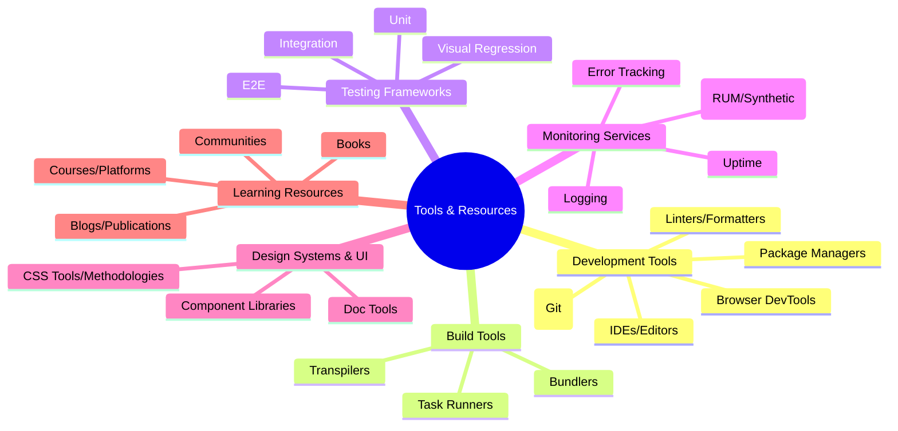

# Appendix C: Recommended Tools and Resources

## Introduction

Building production-grade, scalable frontend systems requires not only a deep understanding of architectural principles and patterns but also proficiency with a wide array of tools and technologies. The frontend ecosystem is vast and constantly evolving, making it challenging to stay abreast of the best options available.

This appendix serves as a curated guide to some of the most effective and widely adopted tools and resources relevant to the concepts discussed throughout this book. It is by no means exhaustive, as new tools emerge and existing ones evolve rapidly. However, it provides a solid starting point for developers and teams looking to equip themselves for building robust, maintainable, and scalable frontend applications.

The tools listed here span the entire development lifecycle, from initial coding and local development to building, testing, deploying, and monitoring applications in production. We also include essential learning resources to foster continuous improvement and knowledge acquisition.

**Diagram Explanation:** This mind map categorizes the recommended tools and resources discussed in this appendix, providing a high-level overview of the different areas covered.

---

## A. Development Tools

Effective development tools are crucial for developer productivity, code quality, and collaboration, especially in large teams working on complex systems.

### Code Editors / Integrated Development Environments (IDEs)

Modern editors offer much more than simple text editing. Features like intelligent code completion, debugging integration, version control interfaces, and extensible plugin ecosystems significantly boost efficiency.

- **Visual Studio Code (VS Code):** Free, highly extensible, and currently the most popular editor in the web development community. Excellent support for JavaScript, TypeScript, various frameworks, and debugging. Its vast marketplace of extensions allows customization for almost any workflow.
- **WebStorm:** A powerful paid IDE from JetBrains specifically designed for JavaScript and related technologies. Offers deep code understanding, refactoring capabilities, built-in debugging, testing, and VCS integration. Often favored in enterprise environments for its robust feature set.
- **Sublime Text:** A lightweight, fast, and highly customizable editor known for its performance and "Goto Anything" feature. While perhaps less feature-rich out-of-the-box compared to VS Code or WebStorm, it remains a favorite for many due to its speed and simplicity.
- **Vim / Neovim:** Highly efficient, terminal-based text editors with a steep learning curve but unparalleled editing speed for experienced users. Extensible through plugins.
- **Emacs:** Another powerful, extensible, terminal-based text editor with a long history and dedicated following.

### Browser Developer Tools

Indispensable for debugging, inspecting, and optimizing web applications directly in the browser.

- **Chrome DevTools:** Comprehensive suite built into Google Chrome. Key panels include Elements (DOM/CSS inspection), Console (logging, command execution), Network (request analysis), Performance (runtime profiling), Application (storage, service workers), Lighthouse (audits).
- **Firefox Developer Tools:** Similar powerful suite in Firefox, often praised for specific features like its CSS Grid inspector and JavaScript debugger.
- **Safari Web Inspector:** Essential for debugging on Safari and iOS devices. Offers similar capabilities to Chrome and Firefox DevTools.

### Version Control Systems (VCS)

Essential for tracking changes, collaborating with teams, and managing code history.

- **Git:** The de facto standard for version control in modern software development. Distributed nature allows for flexible workflows.
- **Git Hosting Platforms:**
  - **GitHub:** Most popular platform for hosting Git repositories, offering collaboration features like Pull Requests, Issues, Actions (CI/CD), Packages, etc.
  - **GitLab:** An open-core alternative offering a complete DevOps platform, including CI/CD, registry, monitoring, and more, available as self-hosted or SaaS.
  - **Bitbucket:** Atlassian's Git hosting solution, integrating well with other Atlassian products like Jira and Confluence.

### Package Managers

Used to manage project dependencies (libraries, frameworks, tools).

- **npm (Node Package Manager):** The default package manager for Node.js, comes bundled with Node.js installation. Largest registry of packages.
- **Yarn (Classic / Berry):** Developed by Facebook as an alternative to npm, focusing on speed, reliability, and security. Yarn Berry (v2+) introduces Plug'n'Play (PnP) for potentially faster installs and stricter dependency management.
- **pnpm:** Focuses on disk space efficiency and speed by using a content-addressable store and symlinks/hard links to share dependencies between projects.

> **The Importance of Developer Experience (DX)**
>
> Choosing and configuring development tools effectively significantly impacts Developer Experience (DX). Good DX—achieved through fast feedback loops (e.g., quick builds, hot reloading), intelligent tooling (e.g., autocompletion, inline error reporting), and streamlined workflows (e.g., integrated testing, easy debugging)—directly translates to higher productivity, better code quality, and improved team morale. In scalable systems involving many developers, optimizing DX is not a luxury but a necessity for maintaining velocity and attracting talent.

---

## B. Build Tools

Build tools automate the process of transforming source code (e.g., TypeScript, Sass, modern JavaScript) into optimized assets suitable for production deployment (e.g., minified JavaScript bundles, CSS files).

### Module Bundlers

Combine multiple JavaScript modules (and often other assets like CSS, images) into a smaller number of files (bundles) for efficient loading in the browser. They handle dependency graphs, transformations, and optimizations like code splitting and tree shaking.

- **Webpack:** Highly configurable and powerful bundler with a vast ecosystem of loaders and plugins. Steep learning curve but offers maximum flexibility. Widely used in many established projects and frameworks (e.g., older versions of Create React App, Angular CLI).
- **Vite:** Modern build tool focusing on speed during development by leveraging native ES modules (ESM) and esbuild for pre-bundling dependencies. Uses Rollup for production builds. Offers a significantly faster development server startup and Hot Module Replacement (HMR). Rapidly gaining popularity.
- **Rollup:** Primarily focused on bundling libraries (especially ES modules), known for producing optimized and efficient output. Often used under the hood by other tools (like Vite for production builds).
- **Parcel:** Aims for zero-configuration bundling, making it easy to get started. Automatically detects and bundles most assets. Good for smaller projects or rapid prototyping.
- **esbuild:** Extremely fast bundler and minifier written in Go. Often used within other tools (like Vite) for its speed, but can also be used directly. Its API and plugin system are less mature than Webpack's or Rollup's.

### Task Runners

While dedicated task runners were popular (Gulp, Grunt), most modern workflows rely on the `scripts` section in `package.json` combined with the capabilities of the chosen bundler.

- **npm/Yarn/pnpm Scripts:** The `scripts` field in `package.json` allows defining custom commands for common tasks like `start`, `build`, `test`, `lint`, etc., often invoking CLI tools directly. This is the standard approach today.

### Transpilers

Convert code written in one language or version into another, typically to ensure browser compatibility or enable the use of newer language features.

- **Babel:** The standard transpiler for converting modern JavaScript (ES2015+) into backward-compatible versions for older browsers. Works via presets and plugins.
- **TypeScript:** While primarily a language (a superset of JavaScript adding static types), the TypeScript compiler (`tsc`) also acts as a transpiler, converting TypeScript (and modern JavaScript) code into a specified JavaScript version.

> **Build Optimization is Key for Production**
>
> The build process is a critical control point for production performance and reliability. Optimizations like code splitting (loading only necessary code), tree shaking (removing unused code), minification (reducing file size), asset compression (e.g., Gzip, Brotli), and cache busting are essential for delivering fast-loading and efficient frontend applications to end-users. Neglecting build optimization can lead to slow initial loads, poor Core Web Vitals scores, and a subpar user experience.

---

## C. Testing Frameworks

A comprehensive testing strategy is fundamental to building resilient and maintainable frontend applications. Different types of tests target different levels of the application.

### Unit Testing

Focuses on testing individual units of code (e.g., functions, components) in isolation.

- **Jest:** Popular testing framework developed by Facebook. Offers an all-in-one solution with a test runner, assertion library, mocking support, and snapshot testing capabilities. Known for its ease of use and performance.
- **Vitest:** A Vite-native unit test framework designed to be fast and compatible with the Vite ecosystem. Offers a Jest-compatible API, making migration easier.
- **Mocha:** Flexible and mature testing framework, often paired with assertion libraries like Chai and mocking libraries like Sinon.JS. Provides the test runner structure but allows choosing other components.
- **Jasmine:** Behavior-Driven Development (BDD) testing framework providing functions for structuring tests (`describe`, `it`) and performing assertions (`expect`).

- **Assertion Libraries:** (Often used with Mocha)
  - **Chai:** Provides various assertion styles (BDD `expect`/`should`, TDD `assert`).
- **Mocking Libraries:** (Often used with Mocha/Jasmine)
  - **Sinon.JS:** Standalone library for creating spies, stubs, and mocks.
- **Component Unit Testing Utilities:**
  - **React Testing Library:** Encourages testing React components in a user-centric way, interacting with them as a user would (finding elements by accessible roles, text, etc.) rather than testing implementation details. Part of the broader Testing Library family.
  - **Vue Testing Library:** Similar philosophy for Vue components.
  - **Enzyme:** (Historically popular for React, less emphasis now) Allows rendering components in isolation and traversing/manipulating their output.

### Integration Testing

Verifies the interaction between multiple units or components. Often uses the same tools as unit testing but with less mocking and more focus on component composition and data flow. React Testing Library and Vue Testing Library are excellent for this level.

### End-to-End (E2E) Testing

Simulates real user scenarios by interacting with the application through the browser. Tests the entire application stack from the user's perspective.

- **Cypress:** Modern E2E testing framework known for its developer experience, fast execution, time-travel debugging, and reliability. Runs directly in the browser alongside the application.
- **Playwright:** Developed by Microsoft, offers cross-browser automation (Chromium, Firefox, WebKit) with a single API. Known for its speed, reliability, and powerful automation capabilities.
- **Selenium WebDriver:** The long-standing standard for browser automation. Supports multiple languages and browsers but can be more complex to set up and prone to flakiness compared to newer alternatives.

### Visual Regression Testing

Captures screenshots of UI components or pages and compares them against baseline images to detect unintended visual changes.

- **Percy:** A popular paid service that integrates with CI/CD pipelines and testing frameworks (Cypress, Playwright, Storybook) to automate visual testing and review workflows.
- **Chromatic:** Developed by the Storybook team, specifically designed for visual testing components within Storybook. Offers UI testing and review features.
- **Applitools Eyes:** Enterprise-grade visual testing platform using AI-powered image comparison.
- **Framework-Integrated Tools:** Both Cypress and Playwright offer basic image snapshot comparison features.

> **Testing for Resilience**
>
> In production-grade systems, testing is not just about finding bugs; it's about building confidence and ensuring resilience. A multi-layered testing strategy (unit, integration, E2E, visual) provides overlapping safety nets, catching regressions early, facilitating refactoring, and ensuring that the application behaves as expected under various conditions, even as it scales in complexity.

---

## D. Monitoring Services

Once an application is deployed, monitoring is essential to understand its health, performance, and user experience in the real world.

### Error Tracking

Captures and reports JavaScript errors (and sometimes other frontend issues) occurring in users' browsers in real-time.

- **Sentry:** Widely used open-source (with a popular SaaS offering) error tracking platform. Provides detailed stack traces, context (browser, OS, user info), release tracking, and integrations.
- **Bugsnag:** Similar commercial service focusing on stability monitoring and error reporting with rich diagnostic data.
- **Rollbar:** Another established player in real-time error monitoring and deployment tracking.
- **Datadog Error Tracking:** Part of the broader Datadog observability platform.

### Performance Monitoring (RUM & Synthetics)

Measures and analyzes the performance of the application as experienced by real users (Real User Monitoring - RUM) or through automated tests (Synthetic Monitoring).

- **Real User Monitoring (RUM):**
  - **Datadog RUM:** Collects performance metrics (Core Web Vitals, load times, XHR/Fetch performance), errors, and user session data.
  - **Dynatrace RUM:** Enterprise-focused platform providing deep insights into user experience and application performance.
  - **New Relic Browser:** Monitors frontend performance, errors, and AJAX requests from the end-user perspective.
  - **Google Analytics:** While primarily web analytics, GA4 includes reporting on Core Web Vitals.
- **Synthetic Monitoring:**
  - **SpeedCurve:** Focuses on frontend performance monitoring using synthetic tests and RUM data, providing detailed dashboards and competitive analysis.
  - **Calibre:** Performance monitoring and testing platform using Lighthouse and synthetic tests across various devices and locations.
  - Most observability platforms (Datadog, Dynatrace, New Relic) also offer synthetic testing capabilities (e.g., browser checks, API tests).

### Log Management

Collects, centralizes, and analyzes logs generated by the frontend application (e.g., custom application events, diagnostic information). While less common than backend logging, it can be valuable for debugging complex user flows or specific frontend states.

- **Datadog Logs:** Integrates frontend log collection with the rest of the Datadog platform.
- **Splunk:** Powerful enterprise platform for searching, monitoring, and analyzing machine-generated data, including logs.
- **Logz.io:** Cloud observability platform based on open-source tools like Elasticsearch, Logstash, Kibana (ELK).
- **Custom Solutions:** Sending logs to a custom backend endpoint that forwards them to a logging system.

### Uptime Monitoring

Periodically checks if the application is accessible from different locations around the world.

- **UptimeRobot:** Popular service offering free and paid plans for HTTP(s), ping, and port monitoring with alerts.
- **Pingdom:** Comprehensive website monitoring service (uptime, page speed, transaction monitoring).
- **StatusCake:** Uptime monitoring and performance testing service.

> **Observability: Seeing Inside Production**
>
> Monitoring tools provide _observability_ – the ability to understand the internal state of your system based on its external outputs (metrics, logs, traces). In complex frontend applications, where issues can arise from network conditions, browser quirks, user interactions, or API dependencies, robust observability through error tracking, performance monitoring, and logging is non-negotiable for diagnosing problems, understanding user experience, and ensuring production stability.

---

## E. Design Systems & Component Libraries

Tools and libraries that help build consistent, reusable, and scalable user interfaces.

### Documentation & Collaboration Tools

Facilitate the creation, documentation, and consumption of UI components and design patterns.

- **Storybook:** The industry standard for building, testing, and documenting UI components in isolation. Supports React, Vue, Angular, Svelte, and more. Essential for developing and maintaining component libraries and design systems.
- **Docz:** Documentation generator using MDX (Markdown + JSX), making it easy to write documentation alongside components.
- **Styleguidist:** Component development environment with a living style guide.
- **Design Tools (Source of Truth):**
  - **Figma:** Dominant cloud-based design tool for UI/UX design, prototyping, and collaboration. Essential for design handoff.
  - **Sketch:** macOS-native design toolkit, historically popular but facing strong competition from Figma.
  - **Adobe XD:** Adobe's offering for UI/UX design and prototyping.
- **Design System Management Platforms:**
  - **Zeroheight:** Platform for creating integrated design system documentation sites, pulling design tokens and components from design tools and code repositories.
  - **Specify:** Helps automate the distribution of design tokens and assets from design tools to code repositories.

### Popular Open-Source Component Libraries

Provide pre-built, often customizable UI components to accelerate development.

- **Material UI (MUI):** Comprehensive suite of React components implementing Google's Material Design. Highly popular and customizable.
- **Ant Design:** Enterprise-grade UI design language and React/Vue/Angular component libraries. Offers a vast set of components.
- **Chakra UI:** Simple, modular, and accessible component library for React (and Vue) that gives developers building blocks to create UIs with speed and flexibility. Focuses on developer experience and accessibility.
- **Bootstrap (React/Vue/Angular versions):** Long-standing framework, originally CSS/JS, now with popular component library implementations for major frameworks (e.g., React Bootstrap, BootstrapVue).
- **Tailwind UI:** (Requires Tailwind CSS) Collection of professionally designed UI components and templates built with Tailwind CSS utility classes. Not a traditional component library but provides copy-pasteable HTML/JSX.

### CSS Methodologies & Tools

Approaches and tools for writing maintainable and scalable CSS.

- **CSS-in-JS:** Libraries that allow writing CSS styles directly within JavaScript components.
  - **Styled Components:** Popular library using tagged template literals.
  - **Emotion:** Performant and flexible CSS-in-JS library.
- **Utility-First CSS:** Frameworks providing low-level utility classes to build designs directly in the markup.
  - **Tailwind CSS:** Extremely popular utility-first framework, highly customizable and scalable.
- **CSS Modules:** Scopes CSS class names locally to components by default, preventing global scope collisions.
- **CSS Preprocessors:** Add features like variables, nesting, mixins to CSS.
  - **Sass/SCSS:** Most widely used CSS preprocessor.
- **Methodologies:** Naming conventions to structure CSS.
  - **BEM (Block, Element, Modifier):** Popular methodology for creating clear, strict naming conventions.

> **Consistency and Scale through Design Systems**
>
> Design systems, encompassing design principles, UI components, and documentation, are crucial for achieving visual and interactive consistency across large applications or multiple products. Leveraging component libraries and documentation tools like Storybook allows teams to build UIs faster, reduce duplication, improve accessibility, and maintain a cohesive user experience as the application and the team scale.

---

## F. Learning Resources (Blogs, Courses, Communities)

The frontend landscape evolves rapidly. Continuous learning is essential for staying relevant and mastering new techniques and technologies.

### Influential Blogs & Publications

Stay updated with articles, tutorials, and insights from experts and leading organizations.

- **MDN Web Docs (Mozilla):** The definitive resource for web standards (HTML, CSS, JavaScript, Web APIs). Includes tutorials and reference documentation.
- **web.dev / developers.google.com/web:** Resources from Google covering modern web capabilities, performance (Core Web Vitals), accessibility, and best practices.
- **Smashing Magazine:** High-quality articles and books on frontend development, UX design, and accessibility.
- **CSS-Tricks:** Long-running blog focused on CSS, HTML, JavaScript, and all things web design and development.
- **Kent C. Dodds' Blog:** Insightful articles on React, testing, and software development principles.
- **Josh W. Comeau's Blog:** Deep dives into CSS, React, animation, and developer experience with interactive explanations.
- **Frontend Masters Blog:** Articles accompanying their video courses, covering a wide range of frontend topics.
- **LogRocket Blog:** Technical tutorials and articles focusing on frontend development, performance, and debugging.
- **Official Framework/Tool Blogs:** (e.g., React Blog, Vue Blog, Angular Blog, TypeScript Blog)

### Online Courses & Platforms

Structured learning paths and in-depth courses on specific technologies and concepts.

- **Frontend Masters:** High-quality video courses taught by industry experts on various frontend technologies and concepts.
- **Egghead.io:** Concise, focused video lessons and courses primarily on web development technologies.
- **Udemy / Coursera / edX:** Broad platforms offering a vast range of courses, including frontend development, often from university or industry partners. Quality can vary.
- **Pluralsight:** Subscription-based platform with a large library of tech courses, including frontend development paths.
- **Scrimba:** Interactive learning platform where you can directly edit code within the instructor's screencast.
- **Official Documentation:** Often the best place to start learning a specific framework or library (React Docs, Vue Docs, Angular Docs, Svelte Docs, etc.).

### Communities & Conferences

Engage with other developers, ask questions, share knowledge, and stay connected.

- **Stack Overflow:** The go-to Q&A site for programming questions.
- **Reddit:** Subreddits like `r/javascript`, `r/reactjs`, `r/vuejs`, `r/angular`, `r/webdev` are active communities.
- **Dev.to:** Community platform for developers to share articles, tutorials, and discussions.
- **Hacker News:** Forum for tech news and discussions, often featuring frontend-related topics.
- **Discord / Slack:** Many frameworks, libraries, and communities have dedicated servers/workspaces for real-time discussion and support.
- **Local Meetups:** Great way to connect with developers in your area.
- **Conferences:** (JSConf, React Conf, VueConf, AngularConnect, NodeConf, etc.) Opportunities for learning, networking, and hearing about the latest trends (many offer online streaming or recorded talks).

### Books (Beyond this one!)

In-depth exploration of specific topics and foundational principles.

- **"Clean Architecture: A Craftsman's Guide to Software Structure and Design"** by Robert C. Martin: Foundational principles applicable beyond the backend.
- **"Design Patterns: Elements of Reusable Object-Oriented Software"** by Erich Gamma, Richard Helm, Ralph Johnson, John Vlissides (Gang of Four): Classic patterns, many adaptable to frontend.
- **"JavaScript: The Good Parts"** by Douglas Crockford: Classic insights into JavaScript's core features (though slightly dated, fundamentals remain relevant).
- **"Eloquent JavaScript"** by Marijn Haverbeke: Excellent introduction and deep dive into JavaScript.
- **Framework-Specific Books:** Numerous books delve deep into React, Angular, Vue, Svelte, etc.
- **"High Performance Browser Networking"** by Ilya Grigorik: Deep dive into network protocols and browser optimizations.

> **The Lifelong Learner**
>
> The tools and best practices in frontend development are a moving target. What is cutting-edge today might be legacy tomorrow. Cultivating a habit of continuous learning through blogs, courses, communities, and experimentation is perhaps the most critical skill for any developer aiming to build and maintain scalable, production-grade systems over the long term.

---

## Conclusion

Choosing the right tools and resources is a significant factor in the success of any large-scale frontend project. This appendix provides a starting point, highlighting reliable and effective options across the development lifecycle. However, the best choices often depend on specific project requirements, team expertise, and organizational context.

Remember to evaluate tools critically, consider their maintenance status and community support, and prioritize those that enhance developer experience, code quality, and application performance. Most importantly, embrace continuous learning to stay effective in the ever-evolving world of frontend development.
