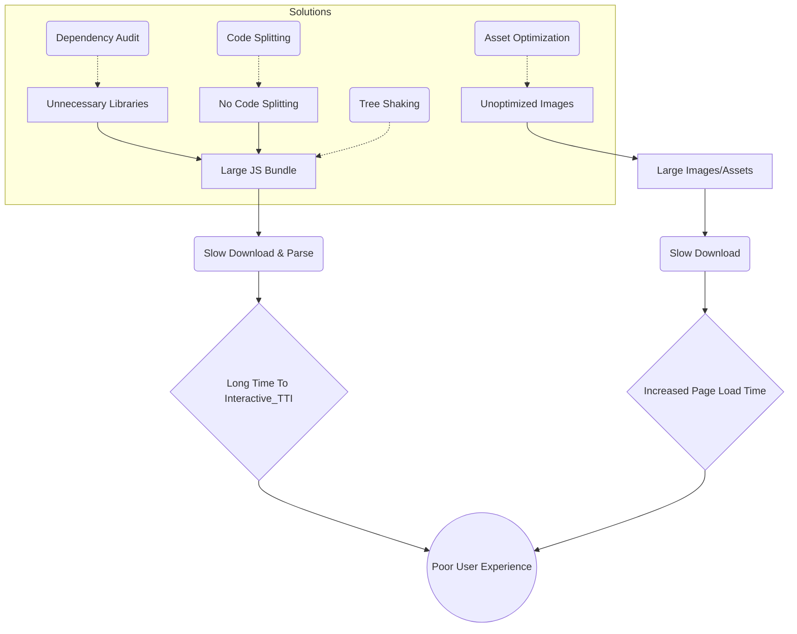
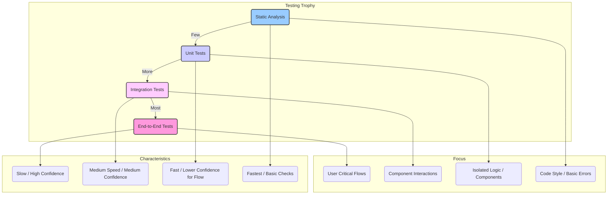

# Appendix D: Common Frontend Anti-Patterns and How to Avoid Them

## Introduction: The Hidden Costs of "Good Enough"

In the fast-paced world of frontend development, the pressure to deliver features quickly can often lead teams down paths that seem efficient in the short term but incur significant "technical debt" later. These recurring problematic solutions or practices are known as **anti-patterns**. While they might initially appear to solve a problem, they ultimately create more issues related to maintainability, scalability, performance, and overall system health.

Recognizing and actively avoiding these common frontend anti-patterns is not just about writing "cleaner" code; it's fundamental to building truly **production-grade** and **scalable** applications. Systems riddled with anti-patterns become brittle, difficult to understand, expensive to change, and prone to bugs, hindering team velocity and user experience.

This appendix serves as a guide to identifying some of the most prevalent anti-patterns across various facets of frontend development – from high-level architecture to component design, state management, performance, and testing. By understanding these pitfalls and their associated avoidance strategies, development teams can make more informed decisions, leading to more robust, resilient, and maintainable frontend systems. Remember, awareness is the first step towards prevention.

---

## A. Architecture Anti-Patterns

Architectural anti-patterns represent fundamental flaws in the high-level structure and organization of a frontend application. They often manifest early in a project's lifecycle but their negative consequences become increasingly apparent as the application grows in complexity and scale.

### 1. The "Big Ball of Mud"

> **Definition:** An application lacking any discernible architecture. Code is haphazardly organized, components are tightly coupled, responsibilities are blurred, and data flows are difficult to trace. It often results from rapid, uncontrolled growth without refactoring or adherence to design principles.

- **Consequences:** Extremely difficult and risky to modify or extend; high cognitive load for developers; bug-prone; poor testability; scalability nightmare. Onboarding new team members becomes a Herculean task.
- **Avoidance Strategies:**
  - **Establish Clear Boundaries:** Define logical modules or domains early on (e.g., by feature, by business capability).
  - **Enforce Modularity:** Use techniques like feature folders, domain-driven design principles, or even micro-frontends (Chapter 12) for larger systems.
  - **Apply Design Principles:** Adhere to SOLID principles (Chapter 4) and foundational patterns (Chapter 3) to promote loose coupling and high cohesion.
  - **Invest in Refactoring:** Regularly allocate time to refactor code and improve structure _before_ it becomes unmanageable.
  - **Code Reviews:** Use code reviews to enforce architectural guidelines and spot emerging coupling issues.

### 2. Monolithic Frontend without Modularity

> **Definition:** While not inherently bad for smaller applications, a large frontend application built as a single, undifferentiated codebase without clear internal modules or separation of concerns becomes an anti-pattern as it scales. All features, routes, and components are intertwined within one large build artifact and deployment unit.

- **Consequences:** Slow build times; difficult for multiple teams to work independently; a change in one area can inadvertently break another unrelated area; deployment risks are high (all or nothing); harder to adopt new technologies incrementally.
- **Avoidance Strategies:**
  - **Logical Modularity:** Structure the codebase into distinct features or domains, even within a monolith (Chapter 7).
  - **Code Splitting:** Implement route-based and component-based code splitting to reduce initial bundle sizes (Chapter 10, Chapter 15).
  - **Consider Monorepos:** Use monorepos (Chapter 11) with tools like Nx or Turborepo to manage multiple logical packages within a single repository, enabling better modularity and independent builds/tests.
  - **Micro-Frontends (for large scale):** For very large applications or ecosystems involving multiple independent teams, evaluate a micro-frontend architecture (Chapter 12).

### 3. Ignoring Cross-Cutting Concerns

> **Definition:** Scattering the implementation of concerns that affect multiple parts of the application (e.g., authentication/authorization checks, logging, error reporting, internationalization, feature flagging) throughout the codebase.

- **Consequences:** Massive code duplication; inconsistency in implementation; difficult to update or modify the behavior globally; violation of the Don't Repeat Yourself (DRY) principle.
- **Avoidance Strategies:**
  - **Centralized Services/Modules:** Create dedicated modules or services for each cross-cutting concern (Chapter 14).
  - **Higher-Order Components (HOCs) / Hooks (React):** Use HOCs or custom hooks to encapsulate and inject cross-cutting logic into components.
  - **Middleware (State Management/Routing):** Leverage middleware in state management libraries (like Redux Toolkit) or routing libraries to intercept actions or transitions and apply cross-cutting logic.
  - **Aspect-Oriented Programming Concepts:** While less common in JS, concepts like decorators (if using TypeScript/Babel) can sometimes help isolate concerns.
  - **Configuration-Driven Approach:** Manage features like logging levels or feature flags through centralized configuration.

### 4. Premature Optimization (Architectural)

> **Definition:** Implementing complex architectural patterns (like micro-frontends, complex state machines, or elaborate event bus systems) before they are genuinely needed, based on anticipated future requirements that may never materialize.

- **Consequences:** Unnecessary complexity added early on; increased development time and effort; potential for choosing the _wrong_ abstraction before the problem is fully understood; can hinder iteration speed.
- **Avoidance Strategies:**
  - **YAGNI (You Ain't Gonna Need It):** Start with the simplest architecture that meets the current requirements.
  - **Iterative Design:** Evolve the architecture as the application grows and requirements become clearer. Refactor towards more complex patterns only when the pain points of the simpler approach become evident.
  - **Focus on Modularity:** Prioritize good modular design within a simpler architecture. This makes it easier to refactor or adopt more complex patterns later if needed.
  - **Spike/Proof of Concept:** If considering a complex pattern, build a small spike or PoC to validate its benefits and understand its implications before committing the entire application to it.

### 5. Technology Hype-Driven Development

> **Definition:** Choosing frameworks, libraries, or architectural patterns primarily because they are new, trendy, or heavily marketed, rather than based on a rational evaluation of project requirements, team expertise, and long-term maintainability.

- **Consequences:** Using inappropriate tools for the job; steep learning curves impacting productivity; potential for library instability or abandonment; difficulty hiring developers with niche expertise; maintenance burden if the hype fades.
- **Avoidance Strategies:**
  - **Requirement-Driven Evaluation:** Start with the project's specific needs (performance, scale, features, team size) and evaluate technologies against those criteria.
  - **Assess Ecosystem Maturity:** Consider the stability, documentation quality, community support, and long-term viability of a technology.
  - **Team Skillset:** Factor in the current expertise of the development team and the cost/time required for training.
  - **Proof of Concept (PoC):** Build small PoCs to evaluate how well a new technology integrates and solves actual problems within your context.
  - **Consider the "Why":** Clearly articulate _why_ a specific technology is the best fit, beyond just its novelty.

---

## B. Component Design Anti-Patterns

Components are the building blocks of modern frontend applications. Poor component design leads to UIs that are difficult to maintain, test, and reuse.

### 1. God Components

> **Definition:** Components that violate the Single Responsibility Principle (SRP) by trying to do too much. They often fetch data, manage complex local state, handle user interactions for multiple distinct concerns, and contain excessive presentational logic all in one place.

- **Consequences:** Extremely difficult to understand, test, and debug; low reusability; changes often have unintended side effects; high coupling to specific data sources or state structures.
- **Avoidance Strategies:**
  - **Break Down Components:** Decompose large components into smaller, focused ones, each handling a single responsibility.
  - **Container/Presentational Pattern (Use with Nuance):** Separate data fetching and state management logic (containers) from UI rendering (presentational components). _Note: Hooks have made this pattern less rigid, but the principle of separating concerns remains vital._
  - **Custom Hooks:** Encapsulate reusable logic (state management, data fetching, side effects) into custom hooks (common in React).
  - **Composition:** Build complex UIs by composing simpler, reusable components together.
  - **State Management Solutions:** Delegate complex state management to dedicated libraries or context (Chapter 6).

**Example: Refactoring a God Component**

- **Anti-Pattern (God Component):**

  ```jsx
  // UserProfileCard.jsx (Anti-Pattern)
  function UserProfileCard({ userId }) {
    const [user, setUser] = useState(null);
    const [posts, setPosts] = useState([]);
    const [isLoading, setIsLoading] = useState(false);
    const [error, setError] = useState(null);
    const [isEditing, setIsEditing] = useState(false);
    const [formData, setFormData] = useState({});

    useEffect(() => {
      // Fetch user data
      // Fetch user posts
      // Handle loading and error states for both
    }, [userId]);

    const handleEditToggle = () => { /* ... */ };
    const handleInputChange = (e) => { /* ... */ };
    const handleSave = async () => { /* ... save user data */ };

    if (isLoading) return <Spinner />;
    if (error) return <ErrorMessage message={error} />;

    return (
      <div className="profile-card">
        {/* Display user info */}
        {isEditing ? (
          {/* Render edit form */}
          <button onClick={handleSave}>Save</button>
        ) : (
          <button onClick={handleEditToggle}>Edit</button>
        )}
        <h2>User Posts</h2>
        {/* Display posts list */}
      </div>
    );
  }
  ```

- **Improved Approach (Using Hooks and Smaller Components):**

  ```jsx
  // useUserData.js (Custom Hook for data fetching)
  function useUserData(userId) {
    // ... logic to fetch user data, handle loading/error
    return { user, isLoading, error };
  }

  // useUserPosts.js (Custom Hook for data fetching)
  function useUserPosts(userId) {
    // ... logic to fetch posts, handle loading/error
    return { posts, isLoading, error };
  }

  // UserInfoDisplay.jsx (Presentational)
  function UserInfoDisplay({ user }) {
    /* ... displays user info */
  }

  // UserInfoEditForm.jsx (Handles editing form state/logic)
  function UserInfoEditForm({ user, onSave }) {
    /* ... form logic */
  }

  // UserPostsList.jsx (Presentational)
  function UserPostsList({ posts }) {
    /* ... displays posts */
  }

  // UserProfileCard.jsx (Composition Root)
  function UserProfileCard({ userId }) {
    const {
      user,
      isLoading: userLoading,
      error: userError,
    } = useUserData(userId);
    const {
      posts,
      isLoading: postsLoading,
      error: postsError,
    } = useUserPosts(userId);
    const [isEditing, setIsEditing] = useState(false);

    // Handle combined loading/error states if necessary
    if (userLoading || postsLoading) return <Spinner />;
    const error = userError || postsError;
    if (error) return <ErrorMessage message={error.message} />;
    if (!user) return null; // Or some placeholder

    const handleSave = async (updatedData) => {
      // ... call API to save user data
      setIsEditing(false);
    };

    return (
      <div className="profile-card">
        {isEditing ? (
          <UserInfoEditForm user={user} onSave={handleSave} />
        ) : (
          <>
            <UserInfoDisplay user={user} />
            <button onClick={() => setIsEditing(true)}>Edit Profile</button>
          </>
        )}
        <hr />
        <h2>User Posts</h2>
        <UserPostsList posts={posts} />
      </div>
    );
  }
  ```

  This refactored version separates concerns into custom hooks and smaller, focused components, making each part easier to understand, test, and reuse.

### 2. Prop Drilling

> **Definition:** Passing props down through multiple layers of nested components that don't actually need the props themselves, just to get them to a deeply nested child component that _does_ need them.

- **Consequences:** Makes refactoring difficult and error-prone (need to update intermediate components); components become unnecessarily coupled to the data needs of their distant children; reduces component reusability as intermediate components now require props they don't use.
- **Avoidance Strategies:**
  - **React Context API / Vue Provide/Inject:** Use built-in mechanisms for sharing state across the component tree without explicit prop passing. Best for low-frequency updates or relatively stable data (e.g., theme, user authentication).
  - **State Management Libraries (Redux, Zustand, Pinia, etc.):** For application-wide state or complex state interactions, use a dedicated library where components can subscribe directly to the needed state slices (Chapter 6).
  - **Component Composition:** Pass components _as props_ (e.g., using `children` prop or named slots) to inject UI or behavior closer to where it's needed, reducing the need for intermediate components to know about specific data.
  - **Render Props:** A pattern where a component receives a function prop that it calls to render something, allowing the parent to control rendering logic and data provision.

### 3. Tightly Coupled Components

> **Definition:** Components that have strong dependencies on each other's internal implementation details, specific data structures, or methods. Changes in one component frequently necessitate changes in others.

- **Consequences:** Reduced reusability; increased difficulty in refactoring or replacing components; changes ripple through the system unexpectedly; harder to test components in isolation.
- **Avoidance Strategies:**
  - **Props as API:** Define clear, stable prop interfaces for components. Components should only rely on their defined props, not on the internal workings of their parents or children.
  - **Dependency Inversion:** Depend on abstractions (like prop types, TypeScript interfaces, or events) rather than concrete implementations.
  - **Event Emitters / Pub-Sub:** For communication between sibling components or decoupled parts of the application, use an event bus or similar mechanism instead of direct method calls or prop drilling.
  - **Context API / State Management:** Use shared state mechanisms for indirect communication when appropriate, rather than direct component coupling.

### 4. Inconsistent Naming and Structure

> **Definition:** Lack of established conventions for naming components, props, event handlers, state variables, CSS classes, and file/folder structures.

- **Consequences:** Increased cognitive load for developers trying to understand the codebase; makes searching for code harder; leads to confusion and potential errors; hinders collaboration and onboarding.
- **Avoidance Strategies:**
  - **Establish a Style Guide:** Define clear naming conventions (e.g., PascalCase for components, camelCase for props/variables, `handleEventName` for handlers, BEM or CSS Modules for styling). Document these conventions.
  - **Consistent File Structure:** Adopt a consistent folder structure (e.g., feature-based, type-based) across the project (Chapter 7).
  - **Linters and Formatters:** Use tools like ESLint, Prettier, and Stylelint to automatically enforce coding style and naming conventions. Integrate them into the development workflow (e.g., pre-commit hooks).
  - **Code Reviews:** Use reviews to catch inconsistencies and reinforce adherence to conventions.

### 5. Mixing Presentation and Logic Excessively

> **Definition:** Components become a tangled mess of complex rendering logic, business rules, data fetching, state manipulation, and side effects without clear separation.

- **Consequences:** Poor testability (hard to test logic without rendering UI, and vice-versa); low reusability (logic is tied to specific presentation); difficult to understand and maintain.
- **Avoidance Strategies:**
  - **Custom Hooks (React):** Extract non-presentational logic (state, effects, data fetching) into reusable custom hooks.
  - **Separation of Concerns:** Aim to keep components focused primarily on rendering UI based on props and state. Move complex logic to hooks, services, or state management layers.
  - **Utility Functions/Services:** Extract pure business logic or utility functions into separate modules that can be tested independently.
  - **State Management Patterns:** Utilize patterns within state management libraries (e.g., actions/reducers/selectors in Redux, services in Angular) to encapsulate logic.

---

## C. State Management Anti-Patterns

Managing state effectively is crucial for application stability and maintainability, especially as applications grow. Anti-patterns here often lead to unpredictable behavior, performance issues, and debugging nightmares.

### 1. Global State Overuse

> **Definition:** Placing almost all application state into a global store (like Redux, Zustand, Vuex/Pinia) regardless of whether the state is truly global or only relevant to a small part of the component tree.

- **Consequences:** Makes the global state unnecessarily complex and bloated; components become coupled to the global store even for local concerns; potential performance issues due to unrelated state updates triggering re-renders; harder to trace data flow and debug.
- **Avoidance Strategies:**
  - **Identify State Scope:** Consciously decide where state belongs:
    - **Local Component State:** State used only by a single component (e.g., form input values, toggle states). Use `useState` (React), `ref`/`reactive` (Vue), or component properties.
    - **Shared Parent/Child State:** State needed by a component and its direct descendants. Lift state up to the nearest common ancestor.
    - **Cross-Cutting/App-Wide State:** State needed by multiple, unrelated parts of the application (e.g., user authentication status, theme). Use Context API or a global state management library.
  - **Context API for Localized Sharing:** Use React Context or Vue Provide/Inject for sharing state within specific subtrees, avoiding global pollution.
  - **Feature-Based State Modules:** If using a global store, structure it into modules or slices based on application features or domains (Chapter 6).

### 2. Inconsistent State Structure / Lack of Normalization

> **Definition:** Storing data, especially relational or nested data fetched from APIs, in the state store in inconsistent shapes or with deep nesting and duplication.

- **Consequences:** Difficult to update nested data immutably; hard to write efficient selectors; potential for data inconsistency if the same entity is duplicated in different parts of the state tree; complex reducer/mutation logic.
- **Avoidance Strategies:**
  - **Normalization:** Store data in a flat, normalized structure, similar to database tables. Use libraries like `normalizr` or techniques recommended by state management libraries (e.g., Redux Toolkit's `createEntityAdapter`). Store entities by ID in dictionaries/maps and use arrays of IDs to represent collections or relationships.
  - **Define Clear Schemas/Types:** Use TypeScript or PropTypes to define the expected shape of your state, ensuring consistency.
  - **Selectors for Denormalization:** Use memoized selectors (see below) to reconstruct nested or computed data shapes for components _when they need it_, keeping the stored state normalized.

### 3. Mutating State Directly

> **Definition:** Modifying state objects or arrays directly instead of creating new references. This is particularly problematic in frameworks/libraries that rely on reference equality for change detection (like React, Redux).

- **Consequences:** Breaks change detection mechanisms, leading to UI not updating when expected; makes state changes unpredictable and hard to debug (losing history in dev tools); undermines time-travel debugging capabilities.
- **Avoidance Strategies:**
  - **Immutability Principle:** Treat state as immutable. Always create new objects or arrays when updating state.
  - **Spread Syntax (`...`):** Use the spread syntax for creating copies of objects and arrays with modifications.
  - **Array Methods:** Use non-mutating array methods (`map`, `filter`, `reduce`, `concat`, `slice`) instead of mutating ones (`push`, `pop`, `splice`, `sort` - sort mutates in place!).
  - **Immutability Helpers:** Use libraries like Immer (integrated into Redux Toolkit and Zustand) or Immutable.js to simplify immutable updates, especially for deeply nested state. Immer allows you to write seemingly mutable code that it translates into safe, immutable updates.

**Example: Direct Mutation vs. Immutable Update**

- **Anti-Pattern (Direct Mutation):**

  ```javascript
  // Assuming state is managed by React useState or similar
  const [users, setUsers] = useState([{ id: 1, name: "Alice", active: false }]);

  const activateUser = (userId) => {
    const user = users.find((u) => u.id === userId);
    if (user) {
      user.active = true; // MUTATING the user object directly within the array!
      setUsers(users); // React might not detect a change as the array reference is the same
    }
  };
  ```

- **Improved Approach (Immutable Update):**

  ```javascript
  // Using useState
  const [users, setUsers] = useState([{ id: 1, name: "Alice", active: false }]);

  const activateUser = (userId) => {
    setUsers(
      (currentUsers) =>
        currentUsers.map(
          (user) =>
            user.id === userId
              ? { ...user, active: true } // Create a NEW user object with updated 'active' property
              : user // Return the original user object if no change
        ) // map returns a NEW array
    );
  };

  // Using Immer (e.g., inside Redux Toolkit reducer or Zustand slice)
  // activateUser: (state, action) => {
  //   const user = state.users.find(u => u.id === action.payload.userId);
  //   if (user) {
  //     user.active = true; // Immer handles the immutable update behind the scenes
  //   }
  // }
  ```

### 4. Lack of Selectors / Recomputing Derived State

> **Definition:** Directly accessing and manipulating raw state data within components, often recomputing derived values (e.g., filtering a list, calculating totals) repeatedly in multiple places or on every render.

- **Consequences:** Performance issues due to unnecessary recalculations, especially with large datasets or complex computations; duplicated logic across components; components become tightly coupled to the raw state structure.
- **Avoidance Strategies:**
  - **Memoized Selectors:** Use libraries like `reselect` (for Redux), `useMemo` (React), or `computed` (Vue) to create selectors. Selectors compute derived data from the state and memoize the result. They only recompute if the underlying state they depend on actually changes.
  - **Colocate Selectors:** Define selectors alongside the state reducers/slices they operate on.
  - **Compose Selectors:** Build complex selectors by composing simpler ones.

### 5. Ignoring State Colocation

> **Definition:** Placing state in a global store when it's only ever used by a specific component or a small, localized subtree of the application. This is the inverse of "Global State Overuse" but equally problematic.

- **Consequences:** Adds unnecessary complexity to the global state; makes components harder to reuse in different contexts as they implicitly depend on the global store being configured correctly; hinders code splitting as features might depend on global state slices even if the feature itself isn't needed yet.
- **Avoidance Strategies:**
  - **Default to Local State:** Start with local component state (`useState`, `ref`) as the default.
  - **Lift State Judiciously:** Only lift state up to the nearest common ancestor component that needs it.
  - **Use Context for Subtree State:** If state needs to be shared within a specific feature or subtree, use React Context or Vue Provide/Inject scoped to that part of the application.
  - **Global State for Truly Global Concerns:** Reserve the global state store for data that is genuinely accessed or modified by disparate parts of the application (e.g., authentication, user preferences, theme, shopping cart).

---

## D. Performance Anti-Patterns

Frontend performance directly impacts user experience, conversion rates, and search engine rankings. These anti-patterns lead to slow load times, unresponsive interfaces, and frustrated users.

### 1. Large Bundle Sizes

> **Definition:** Shipping an excessive amount of JavaScript, CSS, images, fonts, or other assets to the user's browser, especially on the initial page load.

- **Consequences:** Long initial load times (Time to Interactive - TTI); high data consumption for users on mobile or limited plans; poor performance on low-end devices; negative impact on SEO.
- **Avoidance Strategies:**
  - **Code Splitting:** Break the application bundle into smaller chunks that can be loaded on demand (e.g., per route, per feature). Use dynamic `import()` (Chapter 10, Chapter 15).
  - **Tree Shaking:** Ensure the build process eliminates unused code (dead code elimination). Relies on using ES Modules and avoiding side effects in modules.
  - **Dependency Analysis:** Regularly audit dependencies using tools like `webpack-bundle-analyzer` or `source-map-explorer` to identify large or unnecessary libraries. Consider lighter alternatives if possible.
  - **Asset Optimization:** Compress images (using formats like WebP/AVIF), minify JS/CSS, use efficient font loading strategies, leverage browser caching.
  - **Lazy Loading:** Load non-critical components, images, or third-party scripts only when they are needed (e.g., when they scroll into view).



**Diagram Explanation:** This diagram shows how large bundles (JavaScript or other assets), often caused by unnecessary libraries or lack of code splitting/optimization, lead to slow download/parse times, ultimately resulting in poor user experience (long TTI, slow page load). The solutions section points towards mitigation strategies.

### 2. Unnecessary Re-renders

> **Definition:** Components in the UI framework (like React, Vue, Angular) re-rendering even when their props or state haven't changed in a way that affects their output.

- **Consequences:** Wasted CPU cycles on the user's device; can lead to sluggishness, jank, or dropped frames, especially in complex UIs or during frequent state updates; drains battery on mobile devices.
- **Avoidance Strategies:**
  - **Memoization:**
    - **React:** Use `React.memo` for functional components, `PureComponent` for class components, or implement `shouldComponentUpdate` carefully. Use `useMemo` to memoize expensive calculations within components and `useCallback` to memoize callback functions passed as props. Ensure dependency arrays for hooks (`useEffect`, `useMemo`, `useCallback`) are correct.
    - **Vue:** Vue's reactivity system generally handles this well, but be mindful of computed property dependencies and use `v-once` where appropriate.
    - **Angular:** Use `OnPush` change detection strategy.
  - **Optimize State Updates:** Avoid updating state in ways that trigger widespread re-renders unnecessarily. Use memoized selectors to prevent components from re-rendering if the selected data hasn't changed.
  - **Virtualization (for long lists):** For rendering very long lists or large tables, use windowing/virtualization libraries (like `react-window` or `vue-virtual-scroller`) to only render the items currently visible in the viewport.

### 3. Blocking the Main Thread

> **Definition:** Executing long-running JavaScript tasks (complex calculations, intensive DOM manipulation, synchronous operations) on the browser's main thread, preventing it from handling user input, rendering updates, or running animations.

- **Consequences:** Frozen or unresponsive UI ("jank"); poor user experience; browser may show a "page unresponsive" warning.
- **Avoidance Strategies:**
  - **Web Workers:** Offload computationally intensive tasks to background threads using Web Workers, keeping the main thread free.
  - **Asynchronous Operations:** Use `async/await`, Promises, and asynchronous APIs wherever possible to avoid blocking.
  - **Debouncing/Throttling:** Limit the rate at which expensive event handlers (e.g., `onScroll`, `onResize`, search input) are executed.
  - **Break Down Tasks:** Split long-running tasks into smaller chunks using techniques like `requestIdleCallback` or `setTimeout(..., 0)` to yield back to the main thread periodically.
  - **Optimize Algorithms:** Review algorithms for inefficiencies (e.g., nested loops over large datasets).

### 4. Inefficient Data Fetching

> **Definition:** Suboptimal patterns for requesting data from APIs, leading to slow data display or wasted resources. Includes fetching too much data, fetching data sequentially when parallel fetching is possible (request waterfalls), or failing to cache data effectively.

- **Consequences:** Slow perceived performance as users wait for data; unnecessary load on backend servers; wasted user bandwidth; complex loading state management in the UI.
- **Avoidance Strategies:**
  - **Pagination/Infinite Scrolling:** Fetch data in chunks rather than all at once.
  - **GraphQL:** Use GraphQL to allow the frontend to request only the specific data fields it needs.
  - **Parallelize Requests:** Identify independent data requirements and fetch them in parallel (e.g., using `Promise.all`) instead of sequentially. Be mindful of browser connection limits.
  - **Caching:** Implement caching strategies:
    - **HTTP Caching:** Leverage browser caching via appropriate HTTP headers (`Cache-Control`, `ETag`).
    - **Client-Side Caching:** Use state management libraries with built-in caching/normalization, libraries like React Query or SWR, or even Service Workers for more advanced offline caching.
  - **Request Batching/Deduplication:** Consolidate multiple identical requests made in a short period into a single request. Libraries like React Query/SWR often handle this automatically.

**Example: Request Waterfall vs. Parallel Fetching**

- **Anti-Pattern (Waterfall):**

  ```javascript
  async function loadUserProfile(userId) {
    const user = await fetch(`/api/users/${userId}`).then((res) => res.json()); // Request 1
    // Only starts fetching posts AFTER user data arrives
    const posts = await fetch(`/api/users/${userId}/posts`).then((res) =>
      res.json()
    ); // Request 2
    // Only starts fetching comments AFTER posts arrive
    const comments = await fetch(`/api/users/${userId}/comments`).then((res) =>
      res.json()
    ); // Request 3
    return { user, posts, comments };
    // Total time = Time(Req1) + Time(Req2) + Time(Req3)
  }
  ```

- **Improved Approach (Parallel):**

  ```javascript
  async function loadUserProfile(userId) {
    // Start all independent requests concurrently
    const userPromise = fetch(`/api/users/${userId}`).then((res) => res.json());
    const postsPromise = fetch(`/api/users/${userId}/posts`).then((res) =>
      res.json()
    );
    const commentsPromise = fetch(`/api/users/${userId}/comments`).then((res) =>
      res.json()
    );

    // Wait for all promises to resolve
    const [user, posts, comments] = await Promise.all([
      userPromise,
      postsPromise,
      commentsPromise,
    ]);

    return { user, posts, comments };
    // Total time = Max(Time(Req1), Time(Req2), Time(Req3))
  }
  ```

### 5. Memory Leaks

> **Definition:** Parts of the application allocate memory (e.g., for objects, event listeners, DOM elements) but fail to release it when it's no longer needed, leading to gradually increasing memory consumption over time.

- **Consequences:** Application slows down over time; potential browser crashes, especially on long-running single-page applications (SPAs); poor performance on memory-constrained devices.
- **Avoidance Strategies:**
  - **Cleanup Effects/Lifecycle Methods:** Remove event listeners, clear timers (`setInterval`, `setTimeout`), and unsubscribe from observables or data streams when components unmount or effects re-run. Use the cleanup function returned by `useEffect` (React), `beforeUnmount`/`unmounted` (Vue), or `ngOnDestroy` (Angular).
  - **Avoid Global Listeners Carelessly:** Be cautious when adding listeners to global objects like `window` or `document`; ensure they are removed.
  - **Manage Subscriptions:** Properly unsubscribe from WebSocket connections, RxJS observables, etc.
  - **DOM References:** Avoid holding onto references to detached DOM elements. Frameworks usually handle this, but manual DOM manipulation can cause leaks if not careful.
  - **Use Browser DevTools:** Regularly use the Memory tab in browser developer tools to profile memory usage, take heap snapshots, and identify detached elements or objects causing leaks.

---

## E. Testing Anti-Patterns

Effective testing ensures application quality, reduces regressions, and enables confident refactoring. Testing anti-patterns undermine these goals, leading to brittle, unreliable, or ineffective test suites.

### 1. Testing Implementation Details

> **Definition:** Writing tests that assert on the internal state, private methods, or specific DOM structure/CSS classes of a component, rather than its observable behavior from a user's perspective.

- **Consequences:** Tests become brittle and break frequently during refactoring, even if the component's external behavior remains unchanged. This discourages refactoring and increases test maintenance overhead. Tests provide a false sense of security, as they might pass even if the user experience is broken.
- **Avoidance Strategies:**
  - **Focus on Behavior:** Test _what_ the component does, not _how_ it does it. Interact with the component as a user would (finding elements by accessible roles, text content, form labels) and assert on the visible output or side effects.
  - **Use User-Centric Testing Libraries:** Employ libraries like React Testing Library, Vue Testing Library, or Cypress Testing Library, which encourage querying the DOM in accessible ways and interacting via user events. Avoid utilities that encourage accessing internal state or instance methods directly.
  - **Black-Box Testing:** Treat the component largely as a black box, providing inputs (props, user events) and asserting on the outputs (rendered UI, calls to mocked functions).

**Example: Implementation Detail vs. Behavioral Test**

- **Anti-Pattern (Testing Implementation Detail - React Example):**

  ```jsx
  // Counter.jsx
  function Counter() {
    const [count, setCount] = useState(0);
    const increment = () => setCount((c) => c + 1);
    return (
      <div>
        <span data-testid="count-display" className="counter-value">
          {count}
        </span>
        <button onClick={increment} className="increment-button">
          Increment
        </button>
      </div>
    );
  }

  // counter.test.js (Anti-Pattern)
  test("increments internal count state on click", () => {
    const wrapper = shallow(<Counter />); // Using enzyme's shallow rendering
    expect(wrapper.state("count")).toBe(0); // Accessing internal state (brittle!)
    wrapper.find(".increment-button").simulate("click"); // Finding by CSS class (brittle!)
    expect(wrapper.state("count")).toBe(1); // Checking internal state again
  });
  ```

- **Improved Approach (Behavioral Test - Using Testing Library):**

  ```jsx
  // counter.test.js (Behavioral)
  import { render, screen, fireEvent } from "@testing-library/react";
  import Counter from "./Counter";

  test("displays initial count of 0 and increments on button click", () => {
    render(<Counter />);

    // Assert initial state based on what the user sees
    expect(screen.getByText("0")).toBeInTheDocument(); // Find element by its text content

    // Find button by its accessible role or text and simulate click
    const incrementButton = screen.getByRole("button", { name: /increment/i });
    fireEvent.click(incrementButton);

    // Assert updated state based on what the user sees
    expect(screen.getByText("1")).toBeInTheDocument();
    expect(screen.queryByText("0")).not.toBeInTheDocument(); // Optionally check old value is gone
  });
  ```

### 2. Insufficient Test Coverage (or Wrong Kind)

> **Definition:** Having very low test coverage overall, or focusing coverage heavily on trivial unit tests (e.g., testing simple utility functions) while neglecting integration tests or end-to-end (E2E) tests for critical user flows.

- **Consequences:** False sense of security; regressions frequently slip into production; critical user journeys may be broken without detection; difficult to refactor complex interactions confidently.
- **Avoidance Strategies:**
  - **Balanced Test Suite (Testing Trophy/Pyramid):** Aim for a balanced mix:
    - **Unit Tests:** Good for testing individual functions, components in isolation, complex logic, edge cases. Fast to run.
    - **Integration Tests:** Test the interaction between several units/components (e.g., a form component interacting with a validation hook and submitting data via a mocked service). Provide higher confidence than unit tests alone.
    - **End-to-End (E2E) Tests:** Test complete user flows through the actual application interface in a browser (using tools like Cypress, Playwright). Slowest and most brittle, but provide the highest confidence for critical paths. Use sparingly for key scenarios (login, checkout, core features).
  - **Focus on Critical Paths:** Prioritize writing integration and E2E tests for the most important user flows and business-critical functionality.
  - **Measure Meaningful Coverage:** Don't just aim for a high line coverage percentage. Ensure that the _behavior_ and _interactions_ are adequately covered. Use coverage reports as a guide, not a strict target.



**Diagram Explanation:** This diagram illustrates the "Testing Trophy" concept, emphasizing writing more integration tests than E2E tests, and even more unit tests, complemented by static analysis. It highlights the typical focus and characteristics (speed vs. confidence) of each testing layer, advocating for a balanced approach rather than relying solely on one type.

### 3. Flaky Tests

> **Definition:** Tests that pass sometimes and fail other times without any changes to the code under test or the test itself.

- **Consequences:** Erodes trust in the test suite; developers start ignoring failing tests; CI/CD pipelines become unreliable; wastes significant developer time investigating non-existent issues.
- **Avoidance Strategies:**
  - **Avoid Timeouts/Sleeps:** Don't use arbitrary `setTimeout` or `sleep` calls to wait for asynchronous operations. Use proper async/await patterns and testing library utilities designed for waiting for elements or events (e.g., `waitFor`, `findBy*` queries in Testing Library).
  - **Consistent Mocking:** Ensure mocks and stubs behave predictably every time the test runs. Avoid mocks that rely on external factors or produce random results.
  - **Proper Setup/Teardown:** Ensure each test runs in isolation. Reset state, clean up mocks, and unmount components between tests (`beforeEach`, `afterEach`).
  - **Deterministic Data:** Use fixed or predictable data for tests instead of random data generators unless randomness is specifically being tested.
  - **Identify Resource Contention:** In E2E tests, look for issues like multiple tests trying to use the same user account simultaneously or race conditions in the test environment.

### 4. Slow Test Suites

> **Definition:** The entire test suite takes an excessively long time to run, discouraging developers from running tests frequently during development.

- **Consequences:** Slow feedback loop for developers; tests are run less often, increasing the chance of regressions merging; CI/CD pipeline times increase significantly.
- **Avoidance Strategies:**
  - **Parallel Execution:** Configure test runners (like Jest, Vitest, Cypress) to run tests in parallel across multiple CPU cores or machines.
  - **Optimize Individual Tests:** Profile the test suite to identify the slowest tests and optimize them (e.g., reduce unnecessary rendering, improve selectors, optimize E2E interactions).
  - **Selective Test Runs:** Use features of test runners to run only tests related to changed files (e.g., Jest's `--watch` mode or `--findRelatedTests`). Integrate this into pre-commit hooks or CI filters.
  - **Minimize E2E Tests:** Reserve slow E2E tests for the most critical flows and rely more on faster integration and unit tests for broader coverage.
  - **Efficient Mocking:** Ensure mocks are efficient and don't introduce unnecessary delays.

### 5. Not Mocking Dependencies Properly

> **Definition:** Tests make actual network requests to backend APIs, interact with databases, or rely on other external services or browser features (like `localStorage`, timers) without proper isolation.

- **Consequences:** Tests become slow and dependent on network latency; tests can fail due to external service outages or changes; tests might have side effects (e.g., creating real data); tests become non-deterministic; potential costs associated with hitting third-party APIs.
- **Avoidance Strategies:**
  - **Mock Network Requests:** Use libraries like Mock Service Worker (MSW), `nock`, or Jest's manual mocks (`jest.mock`) to intercept network requests and return predefined responses. MSW is often preferred as it intercepts at the network level, working across different fetching methods.
  - **Dependency Injection:** Design components and services to receive dependencies (like API clients) as props or arguments, making it easy to provide mock versions during tests.
  - **Mock Browser APIs:** Use test runner features (like Jest's `jest.spyOn` or `jest.fn`) or specific mocking libraries to mock browser APIs like `localStorage`, `fetch`, timers (`jest.useFakeTimers`), `matchMedia`, etc.
  - **Clear Boundaries:** Design code with clear boundaries between pure logic, UI rendering, and side effects (like API calls), making it easier to test logic independently and mock side effects.

---

## Conclusion: Vigilance and Continuous Improvement

Anti-patterns are rarely introduced intentionally; they often creep in due to deadlines, evolving requirements, lack of awareness, or gradual decay of architectural principles. Recognizing these common pitfalls – in architecture, component design, state management, performance, and testing – is the crucial first step towards building frontend systems that are not just functional, but also robust, scalable, and maintainable in the long run.

Avoiding these anti-patterns requires discipline, communication within the team, adherence to established conventions, and a commitment to code quality and refactoring. It's an ongoing process of vigilance and continuous improvement. By actively identifying and addressing these patterns early, development teams can significantly reduce technical debt and build frontend applications that stand the test of time and scale. This vigilance is a hallmark of professional, production-focused frontend engineering.
